# Sentinel AI — Architecture Blueprint

> **Document Class:** Definitive Engineering Reference
> **Audience:** Engineering, Architecture
> **Status:** Authoritative — Version 1.0
> **Last Updated:** 2026-07-03
> **Parent Documents:**
> - [00_MASTER_CONTEXT.md](./00_MASTER_CONTEXT.md)
> - [01_PROJECT_VISION.md](./01_PROJECT_VISION.md)
> - [15_ARCHITECTURE_DECISIONS.md](../adr/15_ARCHITECTURE_DECISIONS.md)

> **Related ADRs (all):** ADR-001 through ADR-014 — all binding, no exceptions.

---

## Table of Contents

1. [Executive Summary](#1-executive-summary)
2. [System Goals and Non-Goals](#2-system-goals-and-non-goals)
3. [Architecture Principles](#3-architecture-principles)
4. [C4 System Context](#4-c4-system-context)
5. [C4 Container Diagram](#5-c4-container-diagram)
6. [Component Architecture](#6-component-architecture)
7. [Service Responsibilities](#7-service-responsibilities)
8. [Dependency Rules](#8-dependency-rules)
9. [Business Event Lifecycle](#9-business-event-lifecycle)
10. [Business Case Lifecycle](#10-business-case-lifecycle)
11. [Execution Lifecycle](#11-execution-lifecycle)
12. [LangGraph State Machine](#12-langgraph-state-machine)
13. [Human Approval Flow](#13-human-approval-flow)
14. [Event Sequence Diagram](#14-event-sequence-diagram)
15. [Data Architecture](#15-data-architecture)
16. [Database Boundaries](#16-database-boundaries)
17. [Knowledge Layer](#17-knowledge-layer)
18. [API Boundaries](#18-api-boundaries)
19. [Security Model](#19-security-model)
20. [Failure Recovery](#20-failure-recovery)
21. [Deployment Architecture](#21-deployment-architecture)
22. [Folder Mapping](#22-folder-mapping)
23. [Engineering Standards](#23-engineering-standards)
24. [Scalability Strategy](#24-scalability-strategy)
25. [Future Evolution](#25-future-evolution)

---

## 1. Executive Summary

Sentinel AI is a **multi-agent autonomous business execution engine** structured around a closed operational loop: Monitor → Detect → Investigate → Plan → [Human Approval] → Execute → Record → Improve.

The architecture is defined by five binding constraints:

| Constraint | Binding Decision |
|---|---|
| Inter-agent communication | Event-driven (ADR-001) |
| System layering | Five explicit layers, no layer-skipping (ADR-002) |
| Unit of work | Business Case object, append-only (ADR-004) |
| Workflow engine | Single LangGraph graph (ADR-006) |
| Human authority | Non-bypassable approval gateway (ADR-008) |

The hackathon MVP implements **one complete vertical slice** within the **Inventory Operations** domain (ADR-003, ADR-014). The architecture is domain-agnostic at its core so that future domains attach without structural rework.

**Key numbers:**
- End-to-end cycle target: < 15 minutes from anomaly to executed corrective action
- Detection precision target: >= 90%
- Root cause accuracy target: >= 80%
- Action success rate target: >= 95%

---

## 2. System Goals and Non-Goals

**Related ADRs:** ADR-001, ADR-002, ADR-003, ADR-008

### Goals

| ID | Goal | Measurable Criterion |
|---|---|---|
| G-01 | Continuously monitor the inventory event stream without human initiation | Zero human-triggered polls required |
| G-02 | Detect anomalies within 5 minutes of occurrence | >= 90% of significant anomalies flagged within 5 min |
| G-03 | Generate root cause hypotheses from data, not from hard-coded rules | >= 80% first-pass accuracy |
| G-04 | Produce actionable, human-readable Execution Plans | Plan contains >= 2 prioritized actions, each with risk level and expected outcome |
| G-05 | Enforce a non-bypassable human approval gateway before every execution | Zero executions without an approval record in the audit trail |
| G-06 | Execute approved actions atomically and idempotently | Duplicate execution of the same action key produces no additional side effects |
| G-07 | Produce an immutable, complete audit record for every case | Every field group in the Business Case schema is populated before the case is closed |
| G-08 | Feed execution outcomes into the detection baseline | Baseline updated at case close; next anomaly scoring uses updated model |
| G-09 | Surface all case state in real time to the operator | Dashboard latency from state change to operator view: < 2 seconds |

### Non-Goals

| Non-Goal | Rationale |
|---|---|
| Acting without human approval | Violates Master Context section 6.3 and ADR-008 |
| Replacing the system of record (WMS/ERP) | Integration Over Replacement — Master Context section 6.6 |
| Multi-domain monitoring in MVP | One domain done completely — ADR-003 |
| User authentication and authorization | Explicitly out of scope for MVP — Vision section 10 |
| Real ERP/WMS integration | Simulated data stream in MVP — Vision section 10 |
| Real-time supplier communication | Referenced in plans only — Vision section 10 |
| Batch analytics or nightly jobs | Sentinel AI is always-on — Master Context section 5 |
| Being a chatbot or RAG application | Master Context section 5 |

---

## 3. Architecture Principles

**Related ADRs:** ADR-001, ADR-002, ADR-005, ADR-007, ADR-008, ADR-009

These principles govern every design decision. Derived directly from Master Context section 8 and enforced by the ADRs.

| # | Principle | Enforcement Mechanism |
|---|---|---|
| P-01 | **Event-Driven by Default** — state changes are events, not API calls | ADR-001; agents have no direct references to other agents |
| P-02 | **Layer Boundaries Are Hard** — no layer may skip to a non-adjacent layer | ADR-002; dependency rules codified in section 8 of this document |
| P-03 | **Business Case Is the Single Unit of Work** — all state lives in one object | ADR-004; no agent maintains its own case state |
| P-04 | **Orchestrator Holds Routing, Agents Hold Logic** — no business logic in the orchestrator | ADR-005; reviewed in code review |
| P-05 | **Capabilities Are Stateless** — a capability is a pure function of its input | ADR-007; no instance variables; no in-process cache |
| P-06 | **Human Approval Is Inviolable** — no programmatic path bypasses the gateway | ADR-008; gateway is a LangGraph interrupt node, not a conditional |
| P-07 | **Contracts Are Versioned and Shared** — no private type copies | ADR-009, ADR-012; @sentinel/schemas is the single source |
| P-08 | **Idempotency Is Mandatory for All Execution Actions** | Master Context section 8.7; idempotency keys on every external write |
| P-09 | **Audit Log Is Append-Only** — no update or delete on historical records | Master Context section 8.4; write path enforced at persistence layer |
| P-10 | **Configuration Over Code for Business Logic** — thresholds and policies are config | Master Context section 8.6; no hard-coded operational parameters in source |

---

## 4. C4 System Context

**Related ADRs:** ADR-002, ADR-003, ADR-013

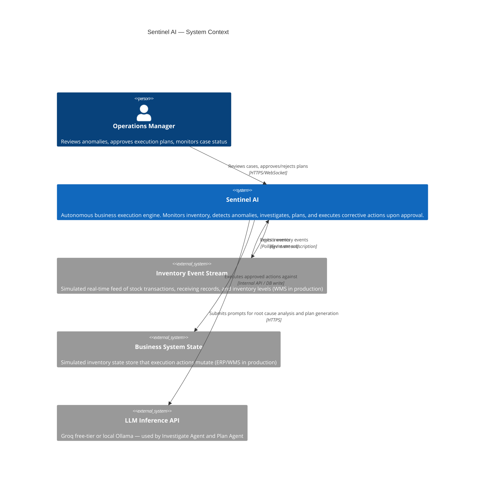

### Context Boundary Notes

- In **MVP**: `Inventory Event Stream` and `Business System State` are both local simulated stores seeded with realistic data.
- In **Horizon 2**: these are replaced with live WMS/ERP integrations (Manhattan, SAP, NetSuite).
- The `operator` is the only human actor in the MVP. No authentication is implemented.
- `LLM Inference API` must have a local Ollama fallback pre-configured (ADR-013).

---

## 5. C4 Container Diagram

**Related ADRs:** ADR-002, ADR-005, ADR-006, ADR-010, ADR-011, ADR-013

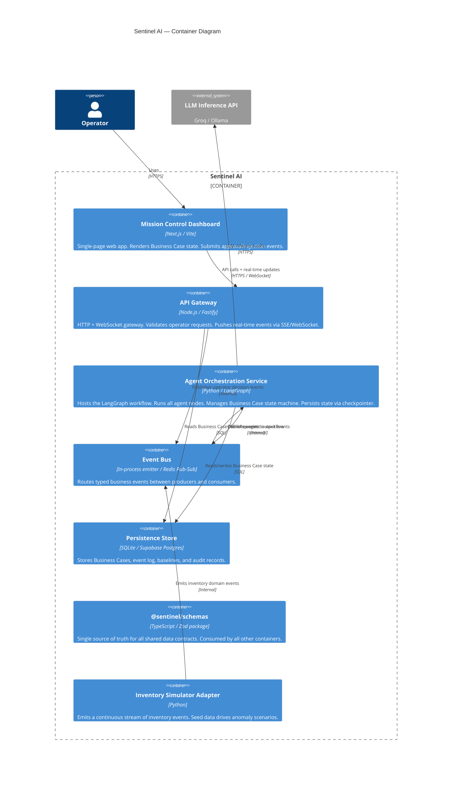

### Container Responsibilities Summary

| Container | Language | Deployable | Owns DB |
|---|---|---|---|
| Mission Control Dashboard | TypeScript / React | Yes (static) | No |
| API Gateway | TypeScript / Node.js | Yes | No |
| Agent Orchestration Service | Python | Yes | Via Persistence Store |
| Event Bus | Redis (Docker) | Yes | No |
| Persistence Store | SQLite / Postgres | Yes | Yes |
| @sentinel/schemas | TypeScript | No (library) | No |
| Inventory Simulator Adapter | Python | Yes | No |

---

## 6. Component Architecture

**Related ADRs:** ADR-002, ADR-004, ADR-005, ADR-006, ADR-007

### Agent Orchestration Service — Internal Components

```mermaid
graph TB
    subgraph orch["Agent Orchestration Service"]
        direction TB

        subgraph wf["Workflow Engine"]
            LG["LangGraph Runtime"]
            CP["Checkpointer (SQLite / Postgres)"]
            LG -->|persists state| CP
        end

        subgraph nodes["Agent Nodes"]
            MON["Monitor Agent Node"]
            DET["Detect Agent Node"]
            INV["Investigate Agent Node"]
            PLN["Plan Agent Node"]
            APP["Approval Gateway interrupt node"]
            EXE["Execute Agent Node"]
            REC["Record Agent Node"]
            IMP["Improve Agent Node"]
        end

        subgraph caps["Capabilities - stateless"]
            BL["Baseline Engine"]
            AD["Anomaly Scorer"]
            RC["Root Cause Analyser"]
            PG["Plan Generator"]
            AX["Action Executor"]
            AL["Audit Logger"]
            BU["Baseline Updater"]
        end

        subgraph tools["Tools - agent-callable"]
            QI["Inventory Query Tool"]
            QP["Purchase Order Query Tool"]
            QS["Supplier Lookup Tool"]
            WR["Business System Write Tool"]
        end

        LG --> MON & DET & INV & PLN & APP & EXE & REC & IMP
        MON --> BL
        DET --> AD
        INV --> RC
        INV --> QI & QP & QS
        PLN --> PG
        EXE --> AX
        EXE --> WR
        REC --> AL
        IMP --> BU
    end

    EB["Event Bus"]
    PS["Persistence Store"]

    LG <-->|publishes/consumes events| EB
    CP <-->|state I/O| PS
    AL -->|audit writes| PS
    BU -->|baseline writes| PS
    QI & QP & QS & WR -->|data reads/writes| PS
```

### API Gateway — Internal Components

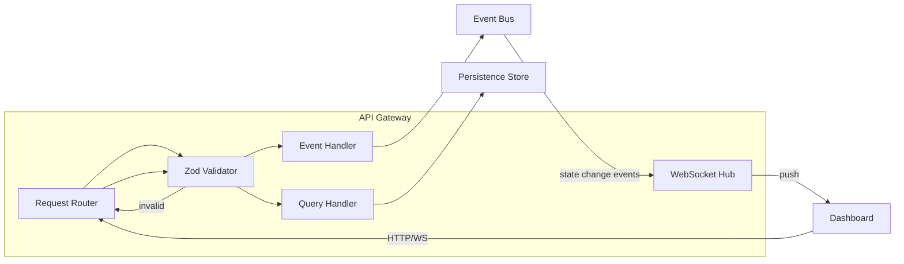

---

## 7. Service Responsibilities

**Related ADRs:** ADR-002, ADR-004, ADR-005, ADR-006, ADR-007, ADR-010

### Agent Responsibilities Matrix

Each agent has exactly one responsibility. Business Case fields it writes vs. reads are explicit.

| Agent | Single Responsibility | Reads from Case | Writes to Case |
|---|---|---|---|
| **Monitor Agent** | Ingest inventory events; maintain per-SKU/location baselines; emit anomaly_candidate events when deviation is detected | — | — (emits events; does not own a case yet) |
| **Detect Agent** | Consume anomaly_candidate; score against baseline; classify by type, severity, scope; create a new Business Case | Baseline store | detection_record, creates case_id |
| **Investigate Agent** | Execute automated root cause analysis using LLM + tool calls; document evidence chain and confidence score | detection_record | investigation_record |
| **Plan Agent** | Synthesize investigation into a structured Execution Plan with ordered actions, risk levels, expected outcomes | detection_record, investigation_record | execution_plan |
| **Approval Gateway** | Interrupt the workflow; wait for operator decision event; route to Execute on approval or back to Plan on rejection | execution_plan | approval_record |
| **Execute Agent** | Execute each approved action against the business system, atomically and idempotently; record per-action status | execution_plan, approval_record | execution_record |
| **Record Agent** | Construct and persist the complete, immutable audit record for the full case lifecycle | All case fields | audit_record, seals the case |
| **Improve Agent** | Feed execution outcome back into the baseline model; update anomaly scoring parameters | execution_record, audit_record | Baseline store (external write, not case field) |

### Non-Agent Service Responsibilities

| Service | Responsibility | Must Not Do |
|---|---|---|
| **API Gateway** | Validate operator input; route to event bus or persistence; broadcast real-time updates | Contain business logic; call agents directly |
| **Inventory Simulator** | Emit a continuous, realistic inventory event stream from seed data | Contain any agent or orchestration logic |
| **Persistence Store** | Store Business Cases, events, baselines, audit records | Be queried by agents across service boundaries |
| **Event Bus** | Route typed events by topic; guarantee delivery within a session | Perform any transformation or business logic |

---

## 8. Dependency Rules

**Related ADRs:** ADR-001, ADR-002, ADR-011, ADR-012

### Layer Dependency Direction

Dependencies flow **downward only**. No layer imports from a layer above it.

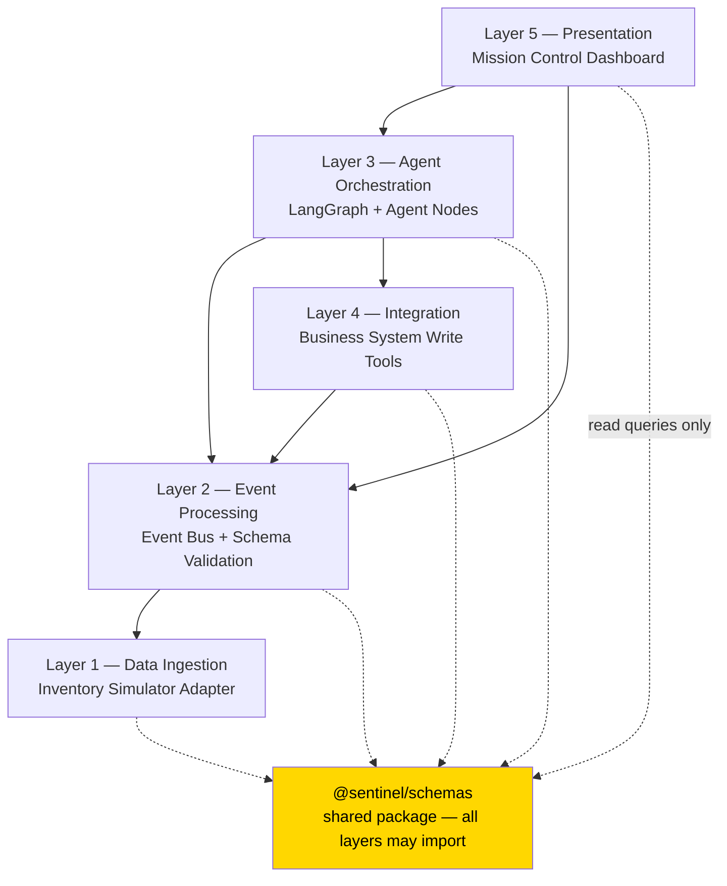

### Forbidden Dependencies

| Forbidden Pattern | Reason |
|---|---|
| Layer 1 to Layer 3 or above | Ingestion must not know about orchestration |
| Layer 3 to Layer 5 | Orchestration must not call the UI |
| Agent A to Agent B (direct call) | All inter-agent communication is via event bus |
| Any layer defines its own copy of a shared type | All shared types come from @sentinel/schemas |
| Integration Layer modifies Business Case directly | Only the Orchestration Layer writes case state |

### Package Import Rules

```
apps/           may import: packages/*, services/* (API types only)
services/       may import: packages/*
packages/       may import: packages/* (no circular deps)
infra/          no application imports
```

---

## 9. Business Event Lifecycle

**Related ADRs:** ADR-001, ADR-009

### Standard Business Event Envelope

Every event on the bus conforms to this envelope exactly (ADR-009):

| Field | Type | Nullable | Description |
|---|---|---|---|
| event_id | UUID | No | Globally unique, generated at publish time |
| event_type | sentinel.domain.entity.verb | No | Namespaced type identifier |
| schema_version | semver string | No | Payload schema version |
| timestamp | ISO 8601 UTC | No | Event creation time |
| source_agent | string | No | Emitting agent identifier |
| case_id | UUID | Yes | Null for pre-case events; set for all subsequent events |
| correlation_id | UUID | No | Distributed trace identifier, propagated across the call chain |
| payload | object | No | Event-type-specific data; validated against event_type schema |

### Inventory Domain Event Catalogue

| Event Type | Producer | Consumers | Triggers |
|---|---|---|---|
| sentinel.inventory.stocklevel.updated | Simulator Adapter | Monitor Agent | Stock count changed |
| sentinel.inventory.transaction.received | Simulator Adapter | Monitor Agent | Goods receipt recorded |
| sentinel.inventory.anomaly.candidate_detected | Monitor Agent | Detect Agent | Baseline deviation exceeds threshold |
| sentinel.inventory.anomaly.detected | Detect Agent | Investigate Agent, API Gateway | New Business Case created |
| sentinel.inventory.rootcause.analysed | Investigate Agent | Plan Agent, API Gateway | Investigation complete |
| sentinel.inventory.plan.generated | Plan Agent | Approval Gateway, API Gateway | Execution Plan ready |
| sentinel.inventory.plan.approved | API Gateway (operator action) | Execution Orchestrator | Operator approved |
| sentinel.inventory.plan.rejected | API Gateway (operator action) | Execution Orchestrator | Operator rejected |
| sentinel.inventory.action.executed | Execute Agent | Record Agent, API Gateway | Single action completed |
| sentinel.inventory.case.closed | Record Agent | Improve Agent, API Gateway | Full audit record written |
| sentinel.inventory.baseline.updated | Improve Agent | Monitor Agent | Baseline model updated |

### Event Flow State Machine

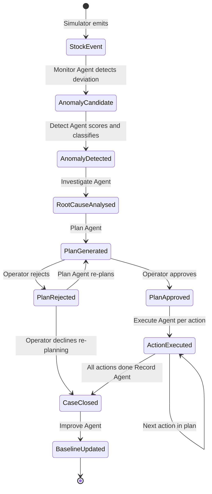

---

## 10. Business Case Lifecycle

**Related ADRs:** ADR-004, ADR-005, ADR-008

### Business Case Status Enumeration

| Status | Description | Entered By | Exited By |
|---|---|---|---|
| DETECTED | Anomaly identified; case created | Detect Agent | Investigate Agent starting |
| INVESTIGATING | Root cause analysis running | Investigate Agent | Investigation completion |
| PLAN_GENERATED | Execution Plan ready for review | Plan Agent | Operator decision |
| AWAITING_APPROVAL | Workflow interrupted; human decision pending | Approval Gateway | Operator event |
| APPROVED | Operator approved; execution starting | API Gateway event handler | Execute Agent starting |
| EXECUTING | One or more actions in progress | Execute Agent | All actions complete or any failure |
| EXECUTION_FAILED | One or more actions failed; rollback attempted | Execute Agent | Record Agent |
| CLOSED_SUCCESS | All actions executed; audit record written | Record Agent | terminal |
| CLOSED_REJECTED | Operator rejected; case closed without execution | Approval Gateway | terminal |
| CLOSED_FAILED | Execution failed without recovery | Record Agent | terminal |

### Business Case Field Schema

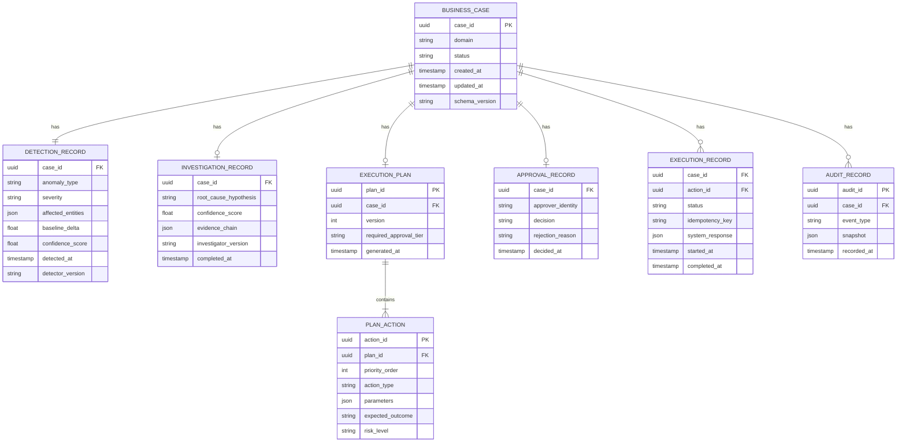

---

## 11. Execution Lifecycle

**Related ADRs:** ADR-004, ADR-005, ADR-006, ADR-008, ADR-014

### Full Cycle — Milestone Timing Targets

| Milestone | Target Elapsed Time | Owner |
|---|---|---|
| Anomaly occurs in inventory stream | T+0 | Simulator |
| Monitor Agent detects deviation | T + 30s | Monitor Agent |
| Detect Agent creates Business Case | T + 60s | Detect Agent |
| Investigate Agent completes RCA | T + 3 min | Investigate Agent |
| Plan Agent generates Execution Plan | T + 5 min | Plan Agent |
| Operator notified (dashboard push) | T + 5 min | API Gateway |
| Operator approves plan | T + 10 min (human time) | Operator |
| Execute Agent completes all actions | T + 12 min | Execute Agent |
| Record Agent seals the case | T + 13 min | Record Agent |
| Improve Agent updates baseline | T + 15 min | Improve Agent |

### Execution Action Contract

Every action submitted to the Execute Agent must satisfy:

| Property | Requirement |
|---|---|
| **Atomicity** | Each action is a single, bounded write to the business system. No partial multi-step action. |
| **Idempotency** | Action carries an idempotency_key. Re-executing the same key is a no-op. |
| **Reversibility** | Where technically feasible, the action stores the prior state to enable rollback. |
| **Audit record** | Execution result (success/failure/response) is written to EXECUTION_RECORD before the next action starts. |
| **Isolation** | Action failure does not automatically roll back prior completed actions; partial execution is a valid terminal state with explicit failure record. |

---

## 12. LangGraph State Machine

**Related ADRs:** ADR-005, ADR-006, ADR-008

### Graph Node Definitions

| Node Name | Type | Description |
|---|---|---|
| monitor | Async generator | Continuously ingests events; yields anomaly candidates |
| detect | Agent node | Scores candidates; creates Business Case on threshold breach |
| investigate | Agent node with LLM + tools | Root cause analysis with tool calls |
| plan | Agent node with LLM + structured output | Generates Execution Plan |
| await_approval | **Interrupt node** | Halts graph; resumes on operator event |
| execute | Agent node | Iterates over plan actions; calls Action Executor per action |
| record | Agent node | Writes immutable audit record; sets terminal case status |
| improve | Agent node | Updates baseline model from outcome data |

### Graph Edges and Conditions

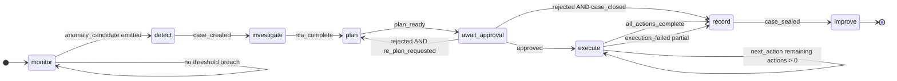

### LangGraph State Schema

The LangGraph state dict is a projection of the Business Case. The Orchestration Service is the sole writer.

```
GraphState {
  case_id:              UUID
  status:               CaseStatus (enum)
  detection_record:     DetectionRecord | null
  investigation_record: InvestigationRecord | null
  execution_plan:       ExecutionPlan | null
  approval_record:      ApprovalRecord | null
  execution_records:    ExecutionRecord[]
  error:                string | null
  re_plan_count:        int  (max 2 re-plans per case)
}
```

### Checkpointer Strategy

- **Technology:** SQLite checkpointer (local/MVP), Postgres checkpointer (production)
- **Checkpoint trigger:** After every node completion
- **Resume semantics:** On process restart, the workflow resumes from the last completed node
- **Isolation:** Each Business Case runs in its own LangGraph thread keyed by case_id

---

## 13. Human Approval Flow

**Related ADRs:** ADR-005, ADR-006, ADR-008, ADR-010

### Approval Gateway Properties

The await_approval node is a LangGraph **interrupt node**. The following invariants are enforced by workflow graph topology, not by application logic:

| Invariant | Mechanism |
|---|---|
| Execution cannot start before approval | execute node is only reachable via the approved edge from await_approval |
| Approval cannot be bypassed by any agent | No edge from plan to execute exists in the graph |
| Approval cannot be bypassed by config flag | No conditional; interrupt is unconditional |
| Rejection is routed to re-plan or close | Both paths are explicit graph edges |
| Approval event is persisted before execution starts | await_approval writes approval_record to the Business Case before resuming |

### Approval Flow Sequence

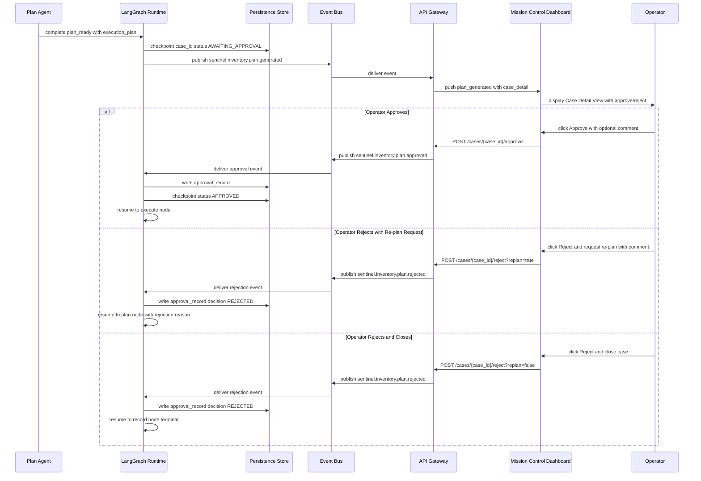

---

## 14. Event Sequence Diagram

**Related ADRs:** ADR-001, ADR-005, ADR-006, ADR-009

### Complete Case Lifecycle — Happy Path

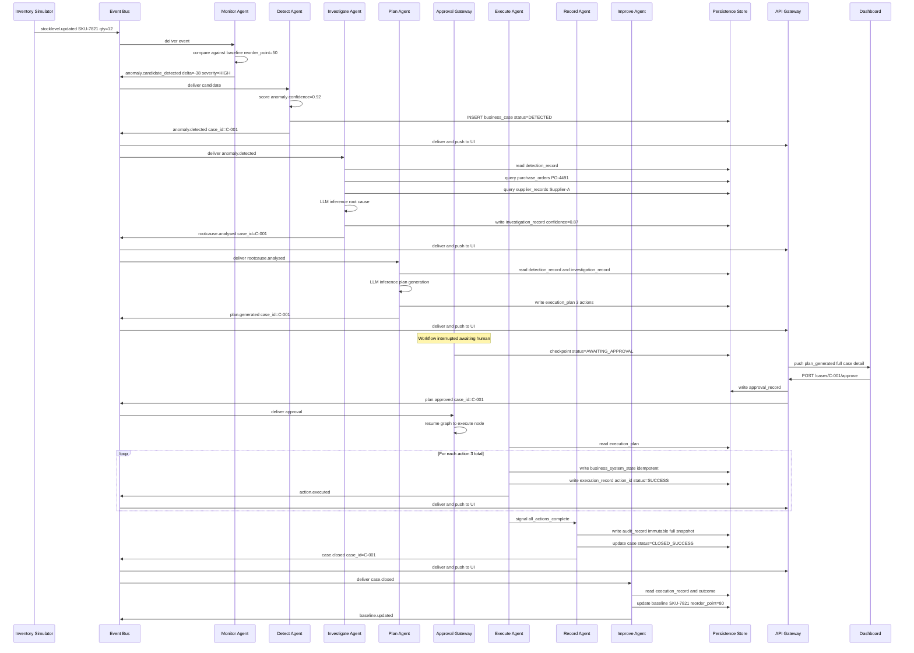

---

## 15. Data Architecture

**Related ADRs:** ADR-004, ADR-009, ADR-012

### Data Categories

| Category | Description | Mutability | Owner |
|---|---|---|---|
| **Business Cases** | Core business objects tracking each anomaly through its full lifecycle | Append-only fields; status transitions allowed | Orchestration Service |
| **Business Events** | Typed events published to the event bus; logged for replay and audit | Immutable once published | Event Bus + Persistence Store |
| **Operational Baselines** | Per-SKU, per-location statistical models of normal behaviour | Mutable; updated by Improve Agent | Orchestration Service |
| **Inventory State** | Simulated current inventory positions; mutated by Execute Agent | Mutable; source of truth for simulation | Persistence Store |
| **Audit Records** | Complete, sealed snapshots of Business Case state at closure | Immutable; append-only | Record Agent |
| **Agent Prompts** | Versioned prompt templates for Investigate and Plan agents | Immutable in production; deployed as code | Orchestration Service |
| **Schema Definitions** | TypeScript + Zod schemas in @sentinel/schemas | Versioned; breaking changes require major version bump | Shared Package |

### Data Flow Diagram

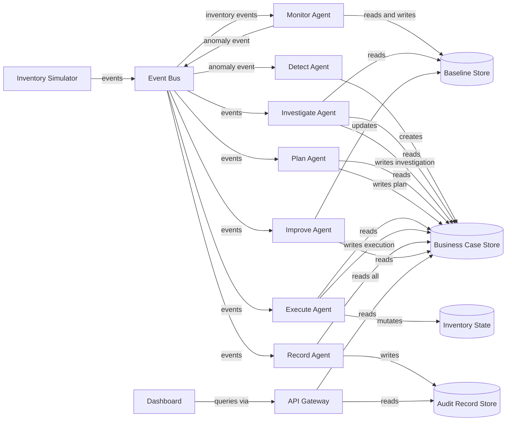

---

## 16. Database Boundaries

**Related ADRs:** ADR-002, ADR-004, ADR-013

### Single Database, Logical Schema Boundaries

In the MVP, one SQLite/Postgres instance is used. Logical boundaries enforce the same access rules that physical separation would enforce in production.

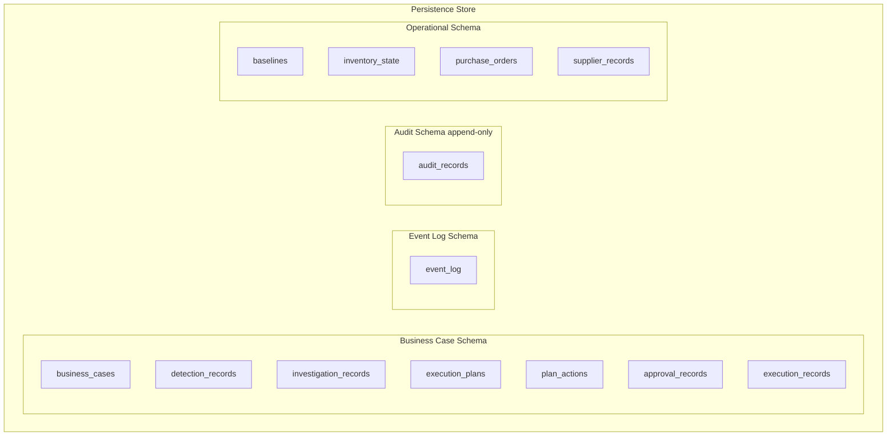

### Schema Access Rules

| Schema | Writers | Readers |
|---|---|---|
| Business Case Schema | Orchestration Service only | Orchestration Service, API Gateway |
| Event Log Schema | Event Bus publisher only | Orchestration Service (replay), API Gateway |
| Audit Schema | Record Agent only | API Gateway (read-only) |
| Operational Schema | Execute Agent (inventory_state), Improve Agent (baselines), Simulator (seed) | All agents via query tools |

### Immutability Enforcement

- audit_records: no UPDATE or DELETE granted to any application user. INSERT only.
- event_log: same. Append-only.
- Business Case fields designated as sealed (e.g., detection_record) are set once; subsequent writes to those columns are rejected by a database trigger.

---

## 17. Knowledge Layer

**Related ADRs:** ADR-006, ADR-007, ADR-012

The Knowledge Layer is the set of models, baselines, and prompt templates that give agents their intelligence. It is distinct from operational data.

### Knowledge Components

| Component | Type | Location | Update Mechanism |
|---|---|---|---|
| **Per-SKU Baseline Model** | Statistical (sliding window mean + stddev per metric) | baselines table | Written by Improve Agent at case close |
| **Anomaly Classification Config** | Configuration (threshold multipliers, severity mappings) | Config file, loaded at startup | Operator config change + service restart |
| **Root Cause Analysis Prompt** | Versioned prompt template | services/orchestration/prompts/rca_vN.txt | Deployed as code; version tracked in source |
| **Plan Generation Prompt** | Versioned prompt template | services/orchestration/prompts/plan_vN.txt | Deployed as code; version tracked in source |
| **Tool Schemas for LLM tool calls** | JSON Schema | @sentinel/schemas package | Schema package release |
| **Ground Truth Labels** | Human-validated case outcomes | audit_records (derived field) | Written at case close; used for future model evaluation |

### Baseline Model Specification

```
BaselineModel {
  sku_id:            string
  location_id:       string
  metric:            enum { stock_level, daily_consumption, receipt_interval }
  window_size:       int    (rolling window in days, default 30)
  mean:              float
  stddev:            float
  anomaly_threshold: float  (multiplier of stddev, default 2.5)
  last_updated_at:   timestamp
  case_count:        int    (number of cases that updated this model)
}
```

The Monitor Agent uses mean plus or minus (anomaly_threshold multiplied by stddev) to classify deviations. The Improve Agent updates mean and stddev using Welford's online algorithm on execution outcome data.

### Prompt Versioning Contract

- Prompt files are named {capability}_v{MAJOR}.{MINOR}.txt
- **Major version**: changes that alter the expected output schema (requires downstream schema update)
- **Minor version**: phrasing improvements that do not change output structure
- The Orchestration Service config specifies which prompt version to load at startup
- Prompt changes follow the same PR + review process as code changes (Master Context section 9.4)

---

## 18. API Boundaries

**Related ADRs:** ADR-002, ADR-009, ADR-010, ADR-012

### API Gateway Contract

The API Gateway exposes two communication channels to the Dashboard:

#### HTTP REST (operator actions)

| Category | Method | Resource Pattern | Request Schema | Response Schema |
|---|---|---|---|---|
| Case queries | GET | /cases | — | CaseListResponse |
| Case queries | GET | /cases/{case_id} | — | CaseDetailResponse |
| Approval | POST | /cases/{case_id}/approve | ApprovalRequest | ApprovalConfirmation |
| Rejection | POST | /cases/{case_id}/reject | RejectionRequest | RejectionConfirmation |
| Audit | GET | /cases/{case_id}/audit | — | AuditLogResponse |
| Health | GET | /health | — | HealthResponse |

All request and response schemas are defined in @sentinel/schemas. Zod validation is applied at the gateway boundary on both inbound and outbound payloads.

#### WebSocket / SSE (real-time push)

| Channel | Direction | Events Pushed | Schema |
|---|---|---|---|
| /ws/cases | Server to Client | All sentinel.inventory.* events relevant to the operator | BusinessEvent envelope |
| /ws/cases/{case_id} | Server to Client | All events for a specific case | BusinessEvent envelope |

The API Gateway does not perform business logic. It validates inbound requests, translates operator actions into business events (published to the event bus), and forwards event bus messages to WebSocket subscribers.

### Internal Service Boundary

The Orchestration Service does not expose an HTTP API to the Dashboard. All communication from the Dashboard to the Orchestration Service is mediated by the API Gateway via the event bus.

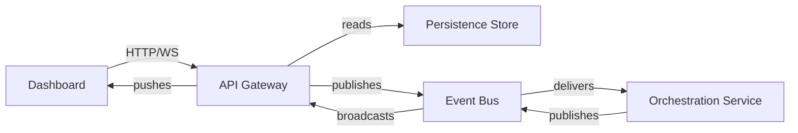

---

## 19. Security Model

**Related ADRs:** ADR-008, ADR-013

> **Note:** The MVP explicitly excludes authentication and authorization (Vision section 10). This section documents the security model as it must be implemented in Horizon 2, and the security properties that are enforced even in MVP.

### MVP Security Properties (Enforced)

| Property | Implementation |
|---|---|
| **Human approval is non-bypassable** | LangGraph interrupt node; no code path from plan to execute without operator event |
| **Audit log is tamper-evident** | audit_records table: INSERT-only database user; no UPDATE/DELETE grant |
| **Idempotency prevents double-execution** | Idempotency key checked before each execution write |
| **Event schema validation** | Zod validation at event publish and consume boundaries; malformed events are rejected and logged |
| **No LLM output directly executed** | LLM output is structured (Zod-parsed) and validated before any state mutation; raw LLM text never executed |

### Horizon 2 Security Requirements

| Requirement | Mechanism |
|---|---|
| Operator authentication | JWT-based session via an identity provider |
| Role-based access control | Roles: viewer, approver, admin; enforced at API Gateway |
| Approval tier enforcement | High-risk actions require admin role to approve |
| Secrets management | LLM API keys via environment variables; rotated per-deployment |
| Audit log integrity | Append-only with cryptographic hash chain (each record hashes the prior) |
| Input sanitisation | All operator inputs and LLM-generated content treated as untrusted; sanitised before persistence |
| Adversarial input defence | Inventory data validated against expected schema; statistical outlier in input data flagged before LLM ingestion (Master Context section 9.6) |

### Trust Boundary Diagram

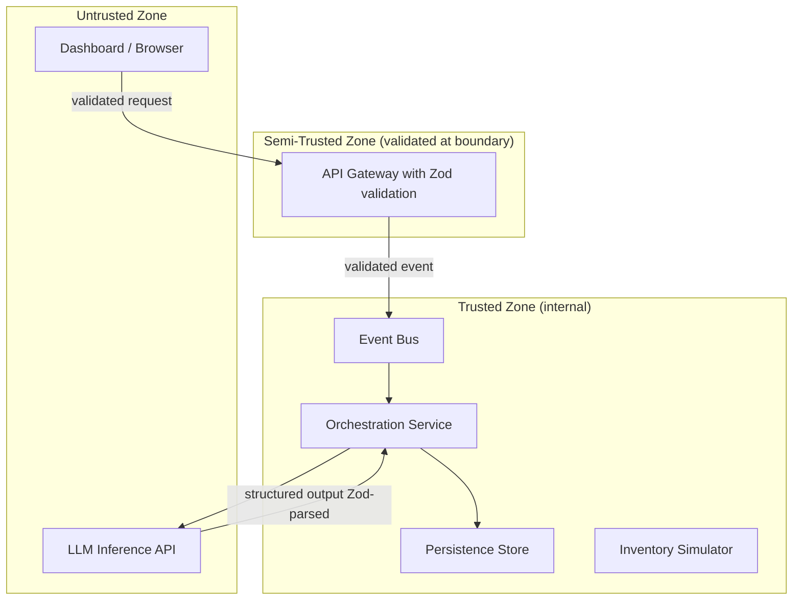

---

## 20. Failure Recovery

**Related ADRs:** ADR-001, ADR-005, ADR-006, Master Context section 8.1

### Failure Taxonomy

| Failure Class | Example | Detection | Recovery Strategy |
|---|---|---|---|
| **Agent node failure** | LLM inference timeout | Exception caught in node | Retry with exponential backoff (max 3); if exhausted, set error on graph state and route to record with CLOSED_FAILED |
| **LLM inference failure** | Rate limit or API error | HTTP 4xx/5xx from inference API | Retry on 5xx; fall back to Ollama local if retries exhausted (ADR-013) |
| **Event bus delivery failure** | Redis unavailable | Publish error | In-process queue as fallback; event replayed from event_log on reconnect |
| **Persistence write failure** | DB connection lost | Write exception | Retry with backoff; if checkpointer cannot write, workflow pauses until DB recovers |
| **Duplicate event delivery** | Event replayed by bus | event_id deduplication check on consume | Idempotent consume: duplicate events are no-ops |
| **Process restart mid-workflow** | Service crash during investigation | — | LangGraph checkpointer resumes from last committed node on restart |
| **Partial execution failure** | Action 2 of 3 fails | Execute Agent catches exception | Prior actions remain committed; EXECUTION_RECORD for failed action set to FAILED; case status set to EXECUTION_FAILED; audit record written |
| **Operator approval timeout** | No response within configurable window | Timer event | Case escalated via UI notification; no automatic action taken; case remains in AWAITING_APPROVAL |

### Recovery State Transitions

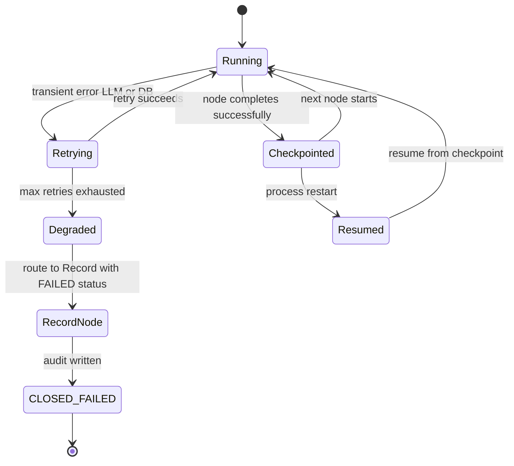

### Circuit Breaker Configuration

| Dependency | Failure Threshold | Reset Window | Fallback |
|---|---|---|---|
| LLM Inference API | 3 consecutive failures | 60 seconds | Ollama local (ADR-013) |
| Event Bus | 5 consecutive failures | 30 seconds | In-process queue |
| Persistence Store | 3 consecutive failures | 120 seconds | Workflow paused (no fallback for persistence) |

---

## 21. Deployment Architecture

**Related ADRs:** ADR-011, ADR-013

### MVP Deployment: Docker Compose (Local)

All services run as Docker containers orchestrated by a single docker-compose.yml in infra/.

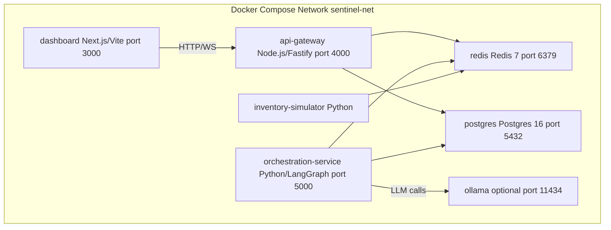

### Service Configuration

| Service | Image | Ports | Volumes | Environment |
|---|---|---|---|---|
| dashboard | node:20-alpine build | 3000 | — | NEXT_PUBLIC_API_URL |
| api-gateway | node:20-alpine build | 4000 | — | DATABASE_URL, REDIS_URL |
| orchestration-service | python:3.12-slim build | 5000 | ./ai | DATABASE_URL, REDIS_URL, GROQ_API_KEY, OLLAMA_URL |
| redis | redis:7-alpine | 6379 | redis-data | — |
| postgres | postgres:16-alpine | 5432 | pg-data | POSTGRES_DB, POSTGRES_USER, POSTGRES_PASSWORD |
| ollama | ollama/ollama | 11434 | ollama-data | — |
| inventory-simulator | python:3.12-slim build | — | ./ai | DATABASE_URL, REDIS_URL |

### Startup Order

```
postgres > redis > orchestration-service > inventory-simulator > api-gateway > dashboard
```

Health checks gate each dependent service's start. The orchestration service waits for both postgres and redis to be healthy before starting.

### Horizon 2 Deployment (Reference)

| Component | Target |
|---|---|
| Dashboard | Vercel / Cloudflare Pages |
| API Gateway | Cloud Run / ECS Fargate |
| Orchestration Service | Cloud Run / ECS Fargate |
| Event Bus | Managed Redis (Upstash / Elasticache) |
| Persistence | Managed Postgres (Supabase / RDS) |
| LLM Inference | OpenAI API / Groq (paid tier) |

---

## 22. Folder Mapping

**Related ADRs:** ADR-011, ADR-014

```
sentinel-ai/
|
+-- apps/
|   +-- dashboard/                        <- Mission Control Dashboard (ADR-010)
|       +-- src/
|       |   +-- components/
|       |   |   +-- CaseFeed/             <- Live Operations Feed view
|       |   |   +-- CaseDetail/           <- Case Detail + Approve/Reject view
|       |   |   +-- ExecutionStatus/      <- Real-time execution progress view
|       |   |   +-- AuditLog/             <- Audit Log view
|       |   +-- hooks/
|       |   |   +-- useWebSocket.ts       <- WebSocket client for real-time updates
|       |   +-- pages/                    <- Route-level components
|       |   +-- main.tsx
|       +-- package.json
|
+-- services/
|   +-- api-gateway/                      <- HTTP + WebSocket gateway
|   |   +-- src/
|   |   |   +-- routes/                   <- HTTP route handlers
|   |   |   +-- ws/                       <- WebSocket hub and SSE broadcaster
|   |   |   +-- validators/               <- Zod validation middleware
|   |   |   +-- index.ts
|   |   +-- package.json
|   |
|   +-- orchestration/                    <- Agent Orchestration Service (Layer 3)
|       +-- agents/
|       |   +-- monitor.py                <- Monitor Agent node
|       |   +-- detect.py                 <- Detect Agent node
|       |   +-- investigate.py            <- Investigate Agent node + LLM call
|       |   +-- plan.py                   <- Plan Agent node + LLM call
|       |   +-- execute.py                <- Execute Agent node
|       |   +-- record.py                 <- Record Agent node
|       |   +-- improve.py                <- Improve Agent node
|       +-- capabilities/
|       |   +-- baseline_engine.py        <- Sliding window model (stateless)
|       |   +-- anomaly_scorer.py         <- Scoring function (stateless)
|       |   +-- root_cause_analyser.py    <- LLM + tool orchestration (stateless)
|       |   +-- plan_generator.py         <- LLM + structured output (stateless)
|       |   +-- action_executor.py        <- Idempotent write (stateless)
|       |   +-- audit_logger.py           <- Append-only writer (stateless)
|       +-- tools/
|       |   +-- inventory_query.py        <- Read tool: inventory state
|       |   +-- purchase_order_query.py   <- Read tool: PO records
|       |   +-- supplier_lookup.py        <- Read tool: supplier records
|       |   +-- business_system_write.py  <- Write tool: idempotent state mutation
|       +-- graph/
|       |   +-- workflow.py               <- LangGraph graph definition
|       |   +-- state.py                  <- GraphState TypedDict
|       |   +-- checkpointer.py           <- Checkpointer configuration
|       +-- prompts/
|       |   +-- rca_v1.0.txt              <- Root Cause Analysis prompt (versioned)
|       |   +-- plan_v1.0.txt             <- Plan Generation prompt (versioned)
|       +-- events/
|       |   +-- publisher.py              <- Event bus publish functions
|       |   +-- consumer.py               <- Event bus subscription setup
|       +-- main.py                       <- Service entrypoint
|
+-- packages/
|   +-- schemas/                          <- @sentinel/schemas (ADR-012)
|       +-- src/
|       |   +-- events/
|       |   |   +-- envelope.ts           <- Standard Business Event envelope
|       |   |   +-- inventory/            <- Inventory domain event payloads
|       |   +-- business-case/
|       |   |   +-- index.ts              <- BusinessCase + all sub-record types
|       |   |   +-- status.ts             <- CaseStatus enum
|       |   +-- api/
|       |   |   +-- requests.ts           <- ApprovalRequest, RejectionRequest
|       |   |   +-- responses.ts          <- CaseListResponse, CaseDetailResponse
|       |   +-- index.ts                  <- Barrel export
|       +-- generated/
|       |   +-- json-schema/              <- JSON Schema exports for Python
|       +-- package.json
|
+-- infra/
|   +-- docker-compose.yml                <- Full stack local deployment
|   +-- docker-compose.dev.yml            <- Development overrides
|   +-- seed/
|       +-- inventory_seed.sql            <- Baseline inventory state
|       +-- anomaly_scenarios.json        <- Scripted anomaly scenarios for demo
|
+-- ai/
|   +-- simulator/
|       +-- event_generator.py            <- Inventory event stream generator
|       +-- anomaly_injector.py           <- Injects scripted anomaly scenarios
|       +-- seed_loader.py                <- Loads seed data on startup
|
+-- docs/
|   +-- 00_MASTER_CONTEXT.md
|   +-- 01_PROJECT_VISION.md
|   +-- 03_ARCHITECTURE.md                <- This document
|   +-- 15_ARCHITECTURE_DECISIONS.md
|
+-- scripts/
|   +-- seed-db.sh                        <- Database seed script
|   +-- validate-schemas.sh               <- JSON Schema export validation
|   +-- demo-run.sh                       <- Full demo sequence launcher
|
+-- package.json                          <- pnpm workspace root
+-- pnpm-workspace.yaml                   <- Workspace package globs
+-- .gitignore
```

---

## 23. Engineering Standards

**Related ADRs:** ADR-007, ADR-009, ADR-012, ADR-014; Master Context sections 8 and 9

### Code Standards

| Standard | Rule |
|---|---|
| **Shared types** | All shared types defined in @sentinel/schemas. No duplication. Enforced by monorepo lint rule. |
| **Event validation** | All published events pass Zod validation before publish. All consumed events pass Zod validation before processing. Invalid events are logged to DLQ and not processed. |
| **Agent capability signature** | capability(input: CapabilityInput, context: CaseContext) -> CapabilityOutput — pure function; no side effects on call. |
| **Idempotency keys** | All writes to business_system_state via business_system_write.py must include an idempotency_key derived from case_id + action_id. |
| **Prompt versioning** | Prompt files named {capability}_v{MAJOR}.{MINOR}.txt. Major bump required on output schema change. |
| **Error handling** | Every agent node catches all exceptions. Unhandled exceptions set state.error and route to record node. No silent failures. |
| **Logging** | Structured JSON logs. Every log entry includes: correlation_id, case_id (if applicable), agent, level, message. |
| **No business logic in orchestrator** | The LangGraph workflow graph (graph/workflow.py) contains only node definitions and edge conditions. Zero business logic. |
| **Append-only audit writes** | audit_logger.py uses an INSERT-only database connection string. UPDATE and DELETE are not available to this module. |

### TypeScript Standards (Frontend + API Gateway)

| Standard | Rule |
|---|---|
| Strict mode | "strict": true in all tsconfig.json files. No any types in production code. |
| Schema-first | All data crossing a service boundary is typed via @sentinel/schemas. |
| Error boundaries | All async handlers wrapped in try/catch. Unhandled promise rejections terminate the process. |
| WebSocket messages | All WebSocket messages typed as BusinessEvent from @sentinel/schemas. |

### Python Standards (Orchestration Service + Simulator)

| Standard | Rule |
|---|---|
| Type hints | All function signatures fully typed. mypy strict mode enforced in CI. |
| Pydantic models | All data structures use Pydantic models (validated) or Python dataclasses. No raw dicts across function boundaries. |
| LLM output parsing | All LLM responses parsed with Pydantic models using structured output mode. Raw LLM text is never used directly. |
| Async | All I/O-bound operations are async. asyncio.run() at service entrypoint only. |

### Definition of Done

A feature is Done when:

- [ ] All affected @sentinel/schemas types are updated and reviewed
- [ ] Event publish and consume paths have Zod/Pydantic validation
- [ ] Agent capability is stateless (no instance state)
- [ ] Audit logging is verified (case state written to audit_records at case close)
- [ ] Idempotency verified for any execution action
- [ ] LangGraph checkpoint test passes (simulate process restart mid-workflow; verify resume)
- [ ] The vertical slice is demonstrable end-to-end (ADR-014)

---

## 24. Scalability Strategy

**Related ADRs:** ADR-001, ADR-007, Master Context section 8.5

### Current MVP Constraints

The MVP runs as a single Docker Compose stack. Scalability is not an operational concern for the hackathon. However, every architectural decision is made with horizontal scale in mind.

### Scalability Design Properties

| Property | How It Is Achieved |
|---|---|
| **Stateless capabilities** | Any number of Orchestration Service replicas can handle any case; no session affinity required (ADR-007) |
| **Event-driven decoupling** | Producers and consumers scale independently; adding consumers does not affect producers (ADR-001) |
| **Externalized state** | All case state in Persistence Store; all workflow state in LangGraph checkpointer (Postgres); process restart is safe |
| **Queue-based work distribution** | Event bus distributes events across multiple consumer instances; no work is pinned to a single process |
| **LangGraph thread isolation** | Each Business Case runs in its own LangGraph thread (thread_id = case_id); threads are independent and concurrent |

### Horizontal Scale Architecture (Horizon 2+)

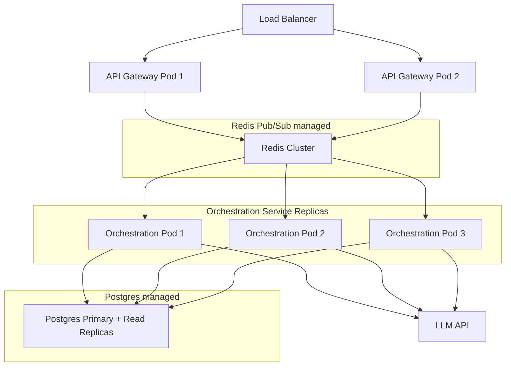

### Throughput Bottleneck Analysis

| Bottleneck | Limit | Mitigation |
|---|---|---|
| LLM inference | Rate limit on free tier (~30 RPM Groq) | Concurrency control; local Ollama fallback |
| LangGraph checkpointer | Write throughput of underlying DB | Postgres connection pool; read replicas for query-heavy paths |
| Event bus | Redis single-instance throughput ~100k events/sec | Sufficient for MVP; Redis Cluster for Horizon 2 |
| Persistence write (audit) | Postgres write throughput | Async write; separate audit writer connection pool |

---

## 25. Future Evolution

**Related ADRs:** ADR-003, ADR-006, ADR-008, ADR-013; Master Context section 10

### Horizon Map

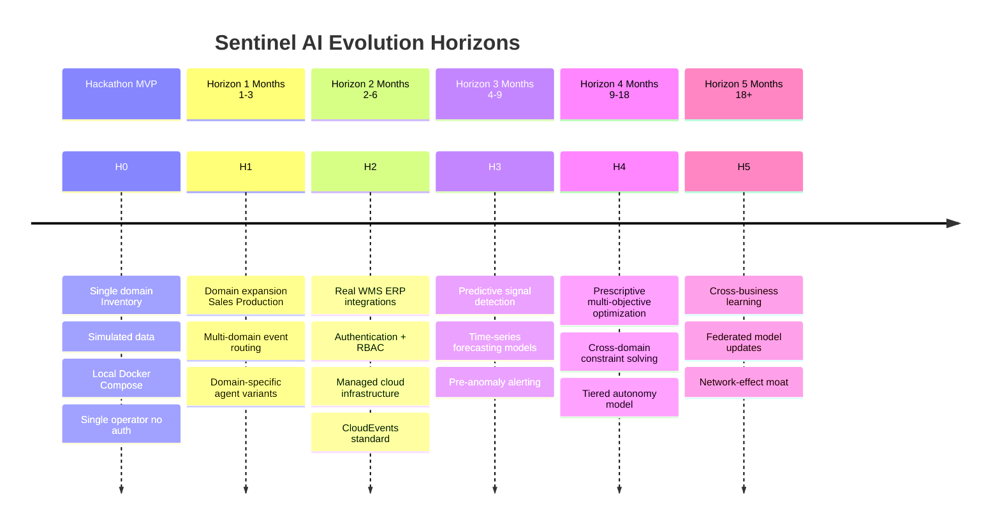

### ADRs Expected to Be Superseded

| ADR | Superseded By | Trigger |
|---|---|---|
| ADR-003 Inventory-only domain | Domain Expansion ADR | Beginning Horizon 1 domain work |
| ADR-008 Human approval required | Tiered Autonomy ADR | Operator trust scores justify partial auto-approval for low-risk high-confidence action class only |
| ADR-009 Standard event schema | CloudEvents ADR | Horizon 2 external integrations require standards-compliant event envelope |
| ADR-013 Zero-cost technology | Production Infrastructure ADR | Immediately upon Horizon 2 start |
| ADR-014 Vertical slice development | Sprint Delivery ADR | End of hackathon phase |

### Extension Points Designed Into MVP

| Extension Point | Current State | Future State |
|---|---|---|
| **Domain routing** | Hardcoded to sentinel.inventory.* topic | Event router config table maps domain to subscriber set |
| **Approval tiers** | Single tier all operators | required_approval_tier field on PLAN_ACTION drives multi-tier routing |
| **Agent capability swap** | Hardcoded prompt + LLM call | Capability registry with pluggable implementations |
| **Baseline model** | Statistical mean + stddev | ML model LSTM Prophet injected via Baseline Engine interface |
| **Integration adapter** | Single simulated system write | Adapter registry; each target system has a typed adapter |
| **Schema registry** | File-based JSON Schema exports | Confluent Schema Registry or similar for managed schema governance |

### Non-Negotiable Architecture Properties Through All Horizons

Regardless of what evolves, these properties must be preserved:

1. **Human approval gateway is inviolable** — any tiered autonomy model requires a new ADR and explicit operator policy; it does not remove the gateway for other action classes.
2. **Audit log is append-only and immutable** — no horizon justifies retroactive modification of historical records.
3. **Business Case is the unit of work** — all agents operate within the context of a Business Case; no agent acts outside a case context.
4. **Shared schema is the single source of truth** — @sentinel/schemas (or its successor) remains the canonical contract definition; private type copies remain forbidden.
5. **Observability is non-negotiable** — every agent output is loggable, every event is traceable, every Business Case state transition is auditable.

---

*This document is the engineering constitution of Sentinel AI. Implementation decisions not covered here must be consistent with the ADRs in [15_ARCHITECTURE_DECISIONS.md](../adr/15_ARCHITECTURE_DECISIONS.md) and the principles in [00_MASTER_CONTEXT.md](./00_MASTER_CONTEXT.md). When implementation conflicts with this document, this document governs. When this document must change, a change here must be accompanied by a new or superseding ADR.*
