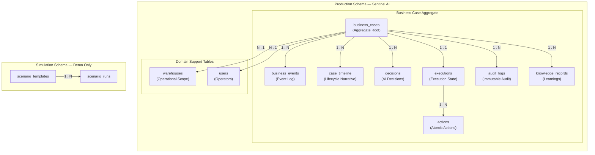
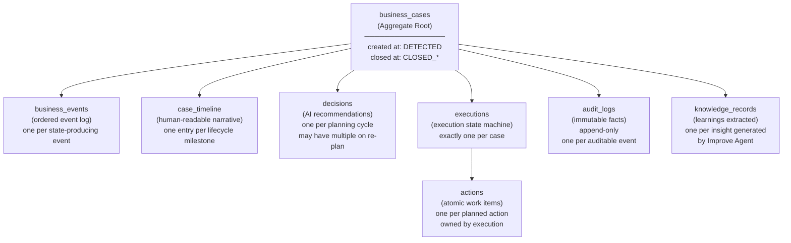
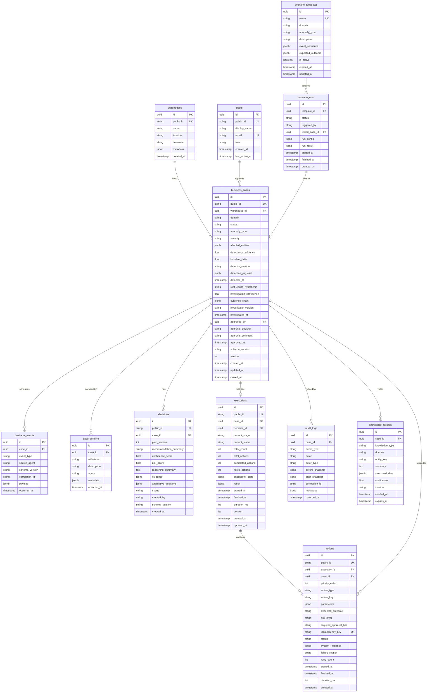
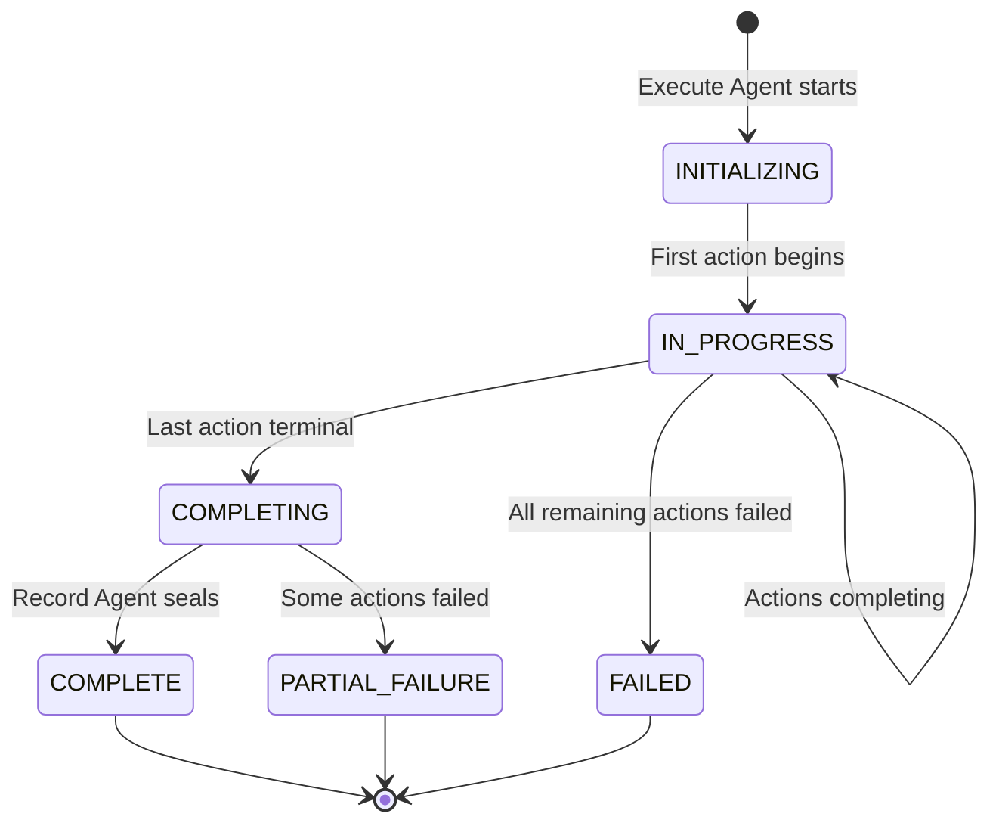
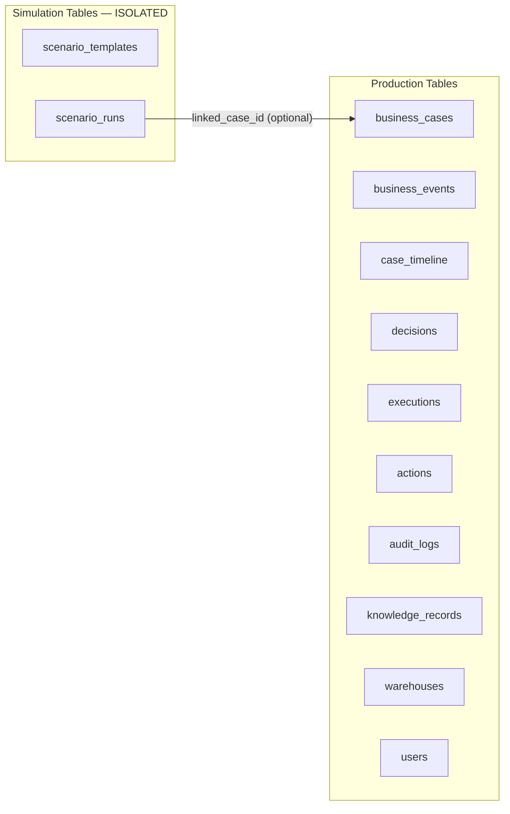
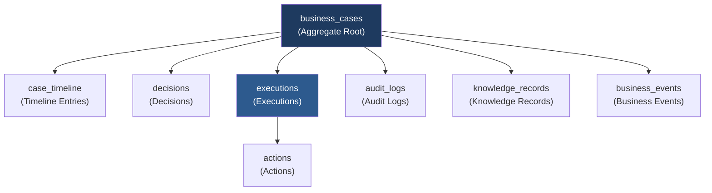
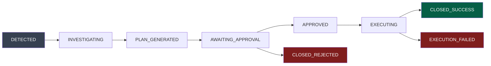
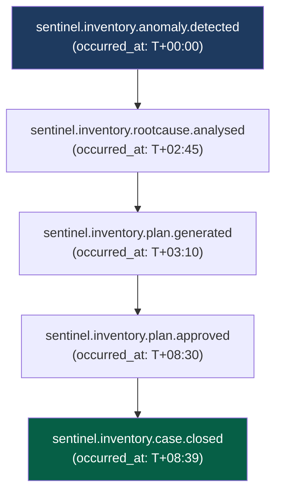

# Sentinel AI — Database Design Specification (DDS)

> **Document Class:** Definitive Engineering Reference
> **Audience:** Engineering, Architecture, Data
> **Status:** Authoritative — Version 1.1
> **Last Updated:** 2026-07-03
> **Parent Documents:**
> - [00_MASTER_CONTEXT.md](./00_MASTER_CONTEXT.md)
> - [01_PROJECT_VISION.md](./01_PROJECT_VISION.md)
> - [03_ARCHITECTURE.md](./03_ARCHITECTURE.md)
> - [15_ARCHITECTURE_DECISIONS.md](../adr/15_ARCHITECTURE_DECISIONS.md)

> **Related ADRs:** ADR-001, ADR-004, ADR-006, ADR-007, ADR-009, ADR-012, ADR-013

---

## Table of Contents

1. [Executive Summary](#1-executive-summary)
2. [Database Philosophy](#2-database-philosophy)
3. [Design Principles](#3-design-principles)
4. [High-Level Database Architecture](#4-high-level-database-architecture)
5. [Aggregate Model](#5-aggregate-model)
6. [Entity Relationship Diagram](#6-entity-relationship-diagram)
7. [Core Tables](#7-core-tables)
8. [Case-Centric Lifecycle Model](#8-case-centric-lifecycle-model)
9. [Decision Model](#9-decision-model)
10. [Execution Model](#10-execution-model)
11. [Timeline Model](#11-timeline-model)
12. [Index Strategy](#12-index-strategy)
13. [Query Patterns](#13-query-patterns)
14. [Constraints](#14-constraints)
15. [Audit Strategy](#15-audit-strategy)
16. [Versioning Strategy](#16-versioning-strategy)
17. [Performance Strategy](#17-performance-strategy)
18. [Simulation Data Model](#18-simulation-data-model)
19. [Naming Conventions](#19-naming-conventions)
20. [Identifier Strategy](#20-identifier-strategy)
21. [Sample Records](#21-sample-records)
22. [Future Evolution](#22-future-evolution)
23. [Aggregate Ownership Diagram](#23-aggregate-ownership-diagram)
24. [State vs. Event](#24-state-vs-event)
25. [Business Case State Machine](#25-business-case-state-machine)
26. [JSONB Usage Guidelines](#26-jsonb-usage-guidelines)
27. [Storage Growth Estimates](#27-storage-growth-estimates)
28. [Archive Strategy](#28-archive-strategy)
29. [Public Identifier Design](#29-public-identifier-design)
30. [ADR Cross-Reference Index](#30-adr-cross-reference-index)

---

## 1. Executive Summary

The Sentinel AI database is not a collection of tables. It is the **persistent operational memory of autonomous business execution**.

Every anomaly the system detects, every investigation it runs, every decision it makes, every action it takes, and every outcome it measures is stored — completely, immutably, and traceably — in this database. When a business asks _"what happened, why, what was decided, and what was done?"_, the database is the definitive answer.

This document specifies:

- The **aggregate model** anchored to `business_cases` as the Aggregate Root
- Every **core table** with its complete field inventory
- The **case-centric lifecycle approach** that replaces fragmented lifecycle tables
- The **decision and execution models** required for full explainability and auditability
- The **timeline model** that narrates every case from creation to closure
- **Index strategy**, **query patterns**, **constraint definitions**, and **audit rules**
- The **simulation boundary** separating demo data from production data
- **Identifier conventions**, **naming standards**, and **sample records**

This document is the single source of truth for PostgreSQL schema design, SQLAlchemy model generation, Alembic migrations, Pydantic models, Zod schemas, and LangGraph state persistence. An engineer must be able to derive all of these artifacts from this document alone.

**Related ADRs:** ADR-004, ADR-012, ADR-013

---

## 2. Database Philosophy

### 2.1 The Persistent Operational Memory

The database is not a passive store. It is the institutional memory of a system that acts autonomously on behalf of a business. This distinction shapes every design decision.

In conventional SaaS applications, the database stores current state. In Sentinel AI, the database stores **current state AND the complete causal history** of every state transition. You must be able to answer not only _"what is the current stock level?"_ but also _"who detected the anomaly, what was the evidence, what did the AI decide, who approved it, what was executed, and what was the outcome?"_

This is the difference between a ledger and a spreadsheet. Sentinel AI requires a ledger.

### 2.2 The Business Case Is the Aggregate Root

Following Domain-Driven Design (DDD) aggregate principles, **`business_cases` is the Aggregate Root** of the Sentinel AI domain. Every persistent entity in the system either:

- **Belongs to exactly one Business Case** — and cannot exist without it, or
- **Is a domain-level support table** (warehouses, users, knowledge records) that Business Cases reference

No agent persists data outside the context of a Business Case (with the sole exception of operational baseline data written by the Improve Agent, which is a cross-case support store).

### 2.3 Append-Only Truth

The record of what happened is never altered after it is written. A correction to a historical fact is expressed as a new record, not a modification of the old one. This is not a technical constraint — it is an **epistemic commitment**: the system acknowledges that it can only know the world as it appeared at a given moment, and that subsequent corrections are new facts, not retroactive rewrites.

### 2.4 Explainability as a Persistence Obligation

The database is the final guarantor of explainability. The LLM inference that produced a root cause hypothesis will not be reproducible. The agent state that existed at decision time will not persist in memory. The database must capture — at the moment of generation — the reasoning, the evidence, the confidence scores, the alternatives considered, and the risk assessments that justified every decision and action. This is not audit overhead. It is a correctness requirement.

**Related ADRs:** ADR-004, ADR-008, ADR-009

---

## 3. Design Principles

### P-DB-01 — Case-First Architecture

Every write operation occurs within the context of a Business Case identified by `case_id`. Tables without a `case_id` foreign key are domain support tables (warehouses, users, knowledge). No data island exists outside the aggregate hierarchy.

_Rationale:_ ADR-004. The Business Case is the unit of work. A fact without a case context has no operational meaning.

### P-DB-02 — Event-Driven Storage

The `business_events` table is the system's ledger of what happened and when. Events are written by producers and never modified. All agent state transitions produce a corresponding event record. The events table is the ground truth for case replay and audit reconstruction.

_Rationale:_ ADR-001. Events are the atomic unit of truth in an event-driven architecture.

### P-DB-03 — Immutable Audit Logs

The `audit_logs` table is INSERT-only. The database user that writes to `audit_logs` has no UPDATE or DELETE privileges. Any attempt to modify an audit record is a database error, not an application-level check.

_Rationale:_ Master Context §8.4. The integrity of the historical record is foundational to trust and accountability.

### P-DB-04 — Idempotent Writes

Every write that can be triggered by a retried event includes an `idempotency_key`. The key is derived from `case_id + action_type + sequence`. A write with a duplicate key is silently accepted (ON CONFLICT DO NOTHING) and does not modify state.

_Rationale:_ Master Context §8.7. Every action Sentinel AI takes against an external system must be idempotent.

### P-DB-05 — Explainable AI Decisions

The `decisions` table captures not only the recommendation but the **full reasoning trace**: confidence score, risk score, reasoning summary, evidence payload, and alternatives considered. This data must be captured at decision time — it cannot be reconstructed later.

_Rationale:_ Master Context §6.2. Every action must be explainable. The database is the final guarantor.

### P-DB-06 — Versioned Records

Schema-sensitive records include a `schema_version` field. This allows the system to correctly deserialize historical records written by earlier versions of the schema, even after migrations.

_Rationale:_ ADR-012. Shared schema is the single source of truth. Versioning enables non-breaking evolution.

### P-DB-07 — Soft Delete Avoidance

Records are never soft-deleted. Deletion represents the destruction of operational truth. If a record must be logically invalidated, a new record expressing the supersession is appended (e.g., a new decision supersedes an older one). The original record is preserved.

_Rationale:_ Soft deletes introduce filter complexity and hide deleted records from audit views. They are a code smell in a system where the record is the product.

### P-DB-08 — Optimistic Concurrency

Records that may be concurrently updated (e.g., `business_cases.status`, `executions.current_status`) include a `version` integer column. Updates must supply the current version; a mismatch returns a conflict error. No row-level locks are used.

_Rationale:_ ADR-007. Stateless capabilities. No agent holds session locks. Concurrency is managed by versioned compare-and-swap.

### P-DB-09 — Human-Readable IDs

Every major entity exposes a human-readable public identifier (e.g., `CASE-000001`, `DEC-000042`) alongside its internal UUID primary key. The UUID is used for all foreign key relationships. The human-readable ID is used for display, logging, and debugging.

_Rationale:_ Explainability and operational usability. An operator reading an alert or log must immediately know which case, which decision, or which execution is being referenced.

### P-DB-10 — Zero-Cost Infrastructure Compatibility

The schema is designed for PostgreSQL (Supabase free tier) as the production target and SQLite as the local development target. JSON columns use standard `JSONB` syntax on Postgres and `TEXT` (JSON serialized) on SQLite. No Postgres-specific extensions beyond `uuid-ossp` and `pgcrypto` are required.

_Rationale:_ ADR-013. Zero-cost technology strategy.

**Related ADRs:** ADR-001, ADR-004, ADR-007, ADR-008, ADR-012, ADR-013

---

## 4. High-Level Database Architecture



### Storage Tier Summary

| Tier | Tables | Mutability | Owner |
|---|---|---|---|
| **Case Aggregate** | `business_cases`, `business_events`, `case_timeline`, `decisions`, `executions`, `actions`, `audit_logs`, `knowledge_records` | Append-heavy; case status transitions allowed | Orchestration Service |
| **Domain Support** | `warehouses`, `users` | Mutable (operational configuration) | API Gateway / seed data |
| **Simulation** | `scenario_templates`, `scenario_runs` | Mutable (simulation management) | Simulator Adapter |

**Related ADRs:** ADR-001, ADR-004, ADR-013

---

## 5. Aggregate Model

### 5.1 Why `business_cases` Is the Aggregate Root

In Domain-Driven Design, an Aggregate Root is the single entry point through which all members of an aggregate are accessed and modified. It enforces invariants across the entire cluster of related objects.

`business_cases` qualifies as the Aggregate Root for the following reasons:

| DDD Criterion | Sentinel AI Expression |
|---|---|
| **Identity boundary** | Every entity in the system can be addressed through its `case_id`. No sub-entity is independently meaningful without a case. |
| **Consistency boundary** | The invariant _"every case must have exactly one execution plan, and execution cannot begin without an approval record"_ is enforced at the aggregate level. |
| **Lifecycle ownership** | The case is born when an anomaly is detected and dies when the Record Agent seals it. All sub-entities share this lifecycle. |
| **Transactional boundary** | Writes to `decisions`, `executions`, `actions`, and `case_timeline` are always scoped to a single `case_id`. Cross-case transactions do not exist. |

### 5.2 Ownership Hierarchy



### 5.3 Entities That Live Outside the Aggregate

These tables are referenced by `business_cases` but are not owned by it:

| Table | Relationship | Rationale |
|---|---|---|
| `warehouses` | `business_cases.warehouse_id → warehouses.id` | A warehouse exists independently; many cases can reference one warehouse |
| `users` | `business_cases.approved_by → users.id` | A user (operator) is a system-level entity, not a case-level entity |

**Related ADRs:** ADR-004

---

## 6. Entity Relationship Diagram



---

## 7. Core Tables

### 7.1 `business_cases`

| Attribute | Value |
|---|---|
| **Purpose** | The Aggregate Root. Represents one complete autonomous execution cycle from anomaly detection to case closure. Carries all phase-level data inline to avoid join cost on the hot query path. |
| **Owner Service** | Orchestration Service (write); API Gateway (read) |
| **Primary Key** | `id` UUID |
| **Foreign Keys** | `warehouse_id → warehouses.id`, `approved_by → users.id` |

#### Required Fields

| Column | Type | Notes |
|---|---|---|
| `id` | UUID | Generated at case creation by the Detect Agent |
| `public_id` | VARCHAR(20) | Format: `CASE-000001`. Unique. Sequential per domain. |
| `warehouse_id` | UUID | The warehouse in which the anomaly was detected |
| `domain` | VARCHAR(50) | Enum: `INVENTORY`, `SALES`, `PRODUCTION`, `LOGISTICS`, `FINANCE` |
| `status` | VARCHAR(30) | See status enum in §7.1.1 |
| `anomaly_type` | VARCHAR(50) | Enum: `STOCKOUT_RISK`, `RECEIVING_DISCREPANCY`, `UNEXPLAINED_VARIANCE`, `SUPPLIER_DELAY`, `OVERSTOCK` |
| `severity` | VARCHAR(10) | Enum: `LOW`, `MEDIUM`, `HIGH`, `CRITICAL` |
| `detection_confidence` | FLOAT | Confidence score (0.0–1.0) from Detect Agent |
| `schema_version` | VARCHAR(20) | Schema version at case creation time (e.g., `1.0.0`) |
| `version` | INTEGER | Optimistic concurrency counter. Starts at 1. |
| `created_at` | TIMESTAMPTZ | Case creation timestamp (UTC) |
| `updated_at` | TIMESTAMPTZ | Last status transition timestamp |

#### Optional Fields (Populated as Case Progresses)

| Column | Type | Populated By |
|---|---|---|
| `affected_entities` | JSONB | Detect Agent — list of affected SKUs/locations |
| `baseline_delta` | FLOAT | Detect Agent — magnitude of deviation from baseline |
| `detector_version` | VARCHAR(20) | Detect Agent — version string |
| `detection_payload` | JSONB | Detect Agent — full raw anomaly payload |
| `detected_at` | TIMESTAMPTZ | Detect Agent — anomaly event timestamp |
| `root_cause_hypothesis` | TEXT | Investigate Agent — plain-language hypothesis |
| `investigation_confidence` | FLOAT | Investigate Agent — confidence score (0.0–1.0) |
| `evidence_chain` | JSONB | Investigate Agent — structured evidence array |
| `investigator_version` | VARCHAR(20) | Investigate Agent — version string |
| `investigated_at` | TIMESTAMPTZ | Investigate Agent — completion timestamp |
| `approved_by` | UUID | Approval Gateway — operator user ID |
| `approval_decision` | VARCHAR(10) | Enum: `APPROVED`, `REJECTED` |
| `approval_comment` | TEXT | Operator's optional comment |
| `approved_at` | TIMESTAMPTZ | Approval Gateway — decision timestamp |
| `closed_at` | TIMESTAMPTZ | Record Agent — case closure timestamp |

#### Indexes

| Index Name | Columns | Type | Rationale |
|---|---|---|---|
| `idx_bc_status` | `(status)` | B-tree | Filter by active/pending status on dashboard feed |
| `idx_bc_warehouse_status` | `(warehouse_id, status)` | Composite B-tree | Dashboard queries scoped to a warehouse |
| `idx_bc_severity_status` | `(severity, status)` | Composite B-tree | Critical/high priority case queue |
| `idx_bc_created_at` | `(created_at DESC)` | B-tree | Recency ordering on case list |
| `idx_bc_public_id` | `(public_id)` | B-tree (Unique) | Human-readable ID lookup |
| `idx_bc_domain_status` | `(domain, status)` | Composite B-tree | Multi-domain future expansion |

#### Constraints

- `status` must be one of the defined `CaseStatus` enum values
- `version` must be supplied on UPDATE and must match current row version (optimistic lock)
- `closed_at` is NULL while case is not in a `CLOSED_*` status
- `approved_by` must reference a valid `users.id`

#### Status Enum — `CaseStatus`

| Value | Description |
|---|---|
| `DETECTED` | Anomaly identified; case created by Detect Agent |
| `INVESTIGATING` | Root cause analysis running |
| `PLAN_GENERATED` | Execution plan ready; awaiting operator review |
| `AWAITING_APPROVAL` | Workflow interrupted; operator decision pending |
| `APPROVED` | Operator approved; execution starting |
| `EXECUTING` | One or more actions in progress |
| `EXECUTION_FAILED` | One or more actions failed |
| `CLOSED_SUCCESS` | All actions executed; audit record sealed |
| `CLOSED_REJECTED` | Operator rejected; case closed without execution |
| `CLOSED_FAILED` | Execution failed without recovery |

#### Lifecycle

Created by Detect Agent → Updated by each downstream agent as case progresses → Sealed by Record Agent at closure. After sealing, only `audit_logs` receives new appends for this case.

**Related ADRs:** ADR-004, ADR-008, ADR-012

---

### 7.2 `business_events`

| Attribute | Value |
|---|---|
| **Purpose** | Ordered, immutable ledger of every significant state-change event emitted by any agent during a case's lifecycle. Used for case replay, distributed tracing, and audit reconstruction. |
| **Owner Service** | Event Bus Publisher (Orchestration Service writes on behalf of all agents) |
| **Primary Key** | `id` UUID |
| **Foreign Keys** | `case_id → business_cases.id` |

#### Required Fields

| Column | Type | Notes |
|---|---|---|
| `id` | UUID | Globally unique event identifier (generated at publish) |
| `event_type` | VARCHAR(100) | Namespaced: `sentinel.{domain}.{entity}.{verb}` |
| `source_agent` | VARCHAR(50) | Emitting agent identifier (e.g., `investigate_agent`) |
| `schema_version` | VARCHAR(20) | Payload schema version |
| `correlation_id` | UUID | Distributed trace identifier propagated across the call chain |
| `payload` | JSONB | Event-type-specific data, validated against event schema |
| `occurred_at` | TIMESTAMPTZ | Event creation timestamp (UTC) |

#### Optional Fields

| Column | Type | Notes |
|---|---|---|
| `case_id` | UUID | NULL for pre-case events (e.g., `anomaly.candidate_detected`) |

#### Indexes

| Index Name | Columns | Type | Rationale |
|---|---|---|---|
| `idx_be_case_id` | `(case_id)` | B-tree | Retrieve all events for a case (audit replay) |
| `idx_be_event_type` | `(event_type)` | B-tree | Filter by event class for monitoring |
| `idx_be_occurred_at` | `(occurred_at DESC)` | B-tree | Chronological event stream queries |
| `idx_be_case_occurred` | `(case_id, occurred_at)` | Composite B-tree | Timeline reconstruction per case |
| `idx_be_correlation_id` | `(correlation_id)` | B-tree | Distributed trace lookup |

#### Constraints

- INSERT-only. No UPDATE or DELETE is permitted by any application role.
- `event_type` must match a registered event type pattern.
- `payload` must be valid JSON.

#### Lifecycle

Events are appended throughout the case lifecycle by each agent as actions complete. Events are never modified or deleted. They persist indefinitely as the system's operational ledger.

**Related ADRs:** ADR-001, ADR-009

---

### 7.3 `case_timeline`

| Attribute | Value |
|---|---|
| **Purpose** | Human-readable, ordered narrative of every meaningful lifecycle milestone within a Business Case. Replaces separate detection_records, investigation_records, approval_records, and verification_records tables. Each row describes a "what happened at this point" fact for an operator or system. |
| **Owner Service** | Orchestration Service (each agent appends its milestone on completion) |
| **Primary Key** | `id` UUID |
| **Foreign Keys** | `case_id → business_cases.id` |

#### Required Fields

| Column | Type | Notes |
|---|---|---|
| `id` | UUID | Generated at insert |
| `case_id` | UUID | Parent Business Case |
| `milestone` | VARCHAR(50) | Enum: see §11 Timeline Milestones |
| `description` | TEXT | Plain-language description of what happened at this milestone |
| `agent` | VARCHAR(50) | Producing agent identifier |
| `occurred_at` | TIMESTAMPTZ | Milestone timestamp (UTC) |

#### Optional Fields

| Column | Type | Notes |
|---|---|---|
| `metadata` | JSONB | Milestone-specific structured data (e.g., confidence score at detection) |

#### Indexes

| Index Name | Columns | Type | Rationale |
|---|---|---|---|
| `idx_ct_case_id` | `(case_id)` | B-tree | Retrieve full timeline for a case |
| `idx_ct_case_occurred` | `(case_id, occurred_at)` | Composite B-tree | Ordered timeline reconstruction |
| `idx_ct_milestone` | `(milestone)` | B-tree | Filter cases by milestone reached |

#### Constraints

- INSERT-only after case creation.
- `milestone` must be from the defined `TimelineMilestone` enum.
- `occurred_at` must be monotonically non-decreasing per `case_id` (enforced via trigger).

#### Lifecycle

First entry is appended when the case is created (CASE_CREATED). Each subsequent agent appends its milestone on completion. Final entry is CASE_CLOSED on case seal.

**Related ADRs:** ADR-004, ADR-005

---

### 7.4 `decisions`

| Attribute | Value |
|---|---|
| **Purpose** | Records every AI-generated decision (execution plan recommendation) produced during a case. A case may have more than one Decision if the operator rejects and requests re-planning. Captures full explainability data at decision time. |
| **Owner Service** | Orchestration Service (Plan Agent writes) |
| **Primary Key** | `id` UUID |
| **Foreign Keys** | `case_id → business_cases.id` |

#### Required Fields

| Column | Type | Notes |
|---|---|---|
| `id` | UUID | Generated at plan creation |
| `public_id` | VARCHAR(20) | Format: `DEC-000001` |
| `case_id` | UUID | Parent Business Case |
| `plan_version` | INTEGER | 1 for first plan, incremented on re-plan |
| `recommendation_summary` | TEXT | Plain-language summary of the recommended course of action |
| `confidence_score` | FLOAT | Planner's confidence in the recommendation (0.0–1.0) |
| `risk_score` | FLOAT | Aggregate risk assessment (0.0–1.0; higher = more risk) |
| `reasoning_summary` | TEXT | The chain of reasoning that produced this recommendation |
| `evidence` | JSONB | Structured evidence from the investigation that supports this decision |
| `alternative_decisions` | JSONB | Array of alternative plans considered but not recommended |
| `status` | VARCHAR(20) | Enum: `PENDING`, `APPROVED`, `REJECTED`, `SUPERSEDED` |
| `created_by` | VARCHAR(50) | Producing agent identifier |
| `schema_version` | VARCHAR(20) | Schema version at creation |
| `created_at` | TIMESTAMPTZ | Decision creation timestamp (UTC) |

#### Indexes

| Index Name | Columns | Type | Rationale |
|---|---|---|---|
| `idx_dec_case_id` | `(case_id)` | B-tree | Retrieve all decisions for a case |
| `idx_dec_status` | `(status)` | B-tree | Filter pending/approved decisions |
| `idx_dec_public_id` | `(public_id)` | B-tree (Unique) | Human-readable ID lookup |
| `idx_dec_case_version` | `(case_id, plan_version)` | Composite B-tree | Fetch specific version within a case |

#### Constraints

- `confidence_score` and `risk_score` must be in range `[0.0, 1.0]`.
- `plan_version` must be unique per `case_id`.
- When a new Decision is inserted for a case, all prior Decisions for that case with status `PENDING` are automatically set to `SUPERSEDED` via trigger.
- `evidence` must be a valid JSON object (not null).

#### Lifecycle

Created by Plan Agent. Status transitions: `PENDING → APPROVED` (on operator approval), `PENDING → REJECTED` (on operator rejection), `PENDING → SUPERSEDED` (on re-plan). Once closed, the Decision is never modified.

**Related ADRs:** ADR-004, ADR-008

---

### 7.5 `executions`

| Attribute | Value |
|---|---|
| **Purpose** | Tracks the state machine of the execution phase for a Business Case. One execution record per case. Contains the current stage, progress counters, retry state, checkpoint data for LangGraph resume, and final result. |
| **Owner Service** | Orchestration Service (Execute Agent writes) |
| **Primary Key** | `id` UUID |
| **Foreign Keys** | `case_id → business_cases.id`, `decision_id → decisions.id` |

#### Required Fields

| Column | Type | Notes |
|---|---|---|
| `id` | UUID | Generated when execution begins |
| `public_id` | VARCHAR(20) | Format: `EXEC-000001` |
| `case_id` | UUID | Parent Business Case |
| `decision_id` | UUID | The approved Decision this execution implements |
| `current_stage` | VARCHAR(30) | Enum: `INITIALIZING`, `IN_PROGRESS`, `COMPLETING`, `COMPLETE`, `FAILED`, `PARTIAL_FAILURE` |
| `current_status` | VARCHAR(20) | Enum: `RUNNING`, `PAUSED`, `RETRYING`, `DONE`, `ERROR` |
| `total_actions` | INTEGER | Total number of actions in the plan |
| `completed_actions` | INTEGER | Count of successfully completed actions |
| `failed_actions` | INTEGER | Count of failed actions |
| `retry_count` | INTEGER | Global retry count for the execution (not per-action) |
| `version` | INTEGER | Optimistic concurrency counter |
| `created_at` | TIMESTAMPTZ | Execution start timestamp (UTC) |
| `updated_at` | TIMESTAMPTZ | Last state change timestamp |

#### Optional Fields

| Column | Type | Notes |
|---|---|---|
| `checkpoint_state` | JSONB | LangGraph checkpointer state snapshot for resume-on-restart |
| `result` | JSONB | Final execution result payload written by Record Agent |
| `started_at` | TIMESTAMPTZ | Timestamp when first action began |
| `finished_at` | TIMESTAMPTZ | Timestamp when execution reached terminal state |
| `duration_ms` | INTEGER | Total execution duration in milliseconds |

#### Indexes

| Index Name | Columns | Type | Rationale |
|---|---|---|---|
| `idx_exe_case_id` | `(case_id)` | B-tree (Unique) | One execution per case |
| `idx_exe_current_status` | `(current_status)` | B-tree | Monitor running executions |
| `idx_exe_public_id` | `(public_id)` | B-tree (Unique) | Human-readable ID lookup |

#### Constraints

- Exactly one `executions` row per `case_id` (unique constraint).
- `completed_actions + failed_actions ≤ total_actions` at all times (enforced by application).
- `version` must be supplied on UPDATE and must match current row version.
- `finished_at` is NULL while `current_stage ≠ COMPLETE` and `current_stage ≠ FAILED`.

#### Lifecycle

Created by Execute Agent on workflow advance to execute node. Updated after each action completes. Sealed with `COMPLETE` or `FAILED` when all actions have terminal status.

**Related ADRs:** ADR-004, ADR-006, ADR-008

---

### 7.6 `actions`

| Attribute | Value |
|---|---|
| **Purpose** | Represents one atomic, idempotent action within an execution plan. Tracks the attempt state, parameters, system response, and idempotency key for each discrete step the Execute Agent takes against the business system. |
| **Owner Service** | Orchestration Service (Plan Agent creates; Execute Agent updates) |
| **Primary Key** | `id` UUID |
| **Foreign Keys** | `execution_id → executions.id`, `case_id → business_cases.id` |

#### Required Fields

| Column | Type | Notes |
|---|---|---|
| `id` | UUID | Generated when plan is written |
| `public_id` | VARCHAR(20) | Format: `ACT-000001` |
| `execution_id` | UUID | Parent Execution |
| `case_id` | UUID | Parent Business Case (denormalized for query efficiency) |
| `priority_order` | INTEGER | Execution sequence. 1 = first action. |
| `action_type` | VARCHAR(50) | Enum: `REORDER_STOCK`, `ESCALATE_SUPPLIER`, `ADJUST_SAFETY_STOCK`, `ADJUST_THRESHOLD`, `FLAG_INVESTIGATION` |
| `action_key` | VARCHAR(100) | Deterministic key: `{case_id}:{action_type}:{priority_order}` |
| `parameters` | JSONB | Action-specific parameters (quantity, supplier ID, threshold value, etc.) |
| `expected_outcome` | TEXT | Human-readable description of the expected result |
| `risk_level` | VARCHAR(10) | Enum: `LOW`, `MEDIUM`, `HIGH` |
| `idempotency_key` | VARCHAR(255) | Globally unique key derived from `case_id + action_type + priority_order`. Enforced UNIQUE. |
| `status` | VARCHAR(20) | Enum: `PENDING`, `IN_PROGRESS`, `SUCCESS`, `FAILED`, `SKIPPED` |
| `created_at` | TIMESTAMPTZ | Action creation timestamp (UTC) |

#### Optional Fields

| Column | Type | Notes |
|---|---|---|
| `required_approval_tier` | VARCHAR(20) | For future tiered approval (e.g., `STANDARD`, `ADMIN`) |
| `system_response` | JSONB | Response payload from the business system |
| `failure_reason` | TEXT | Human-readable failure explanation |
| `retry_count` | INTEGER | Per-action retry attempts |
| `started_at` | TIMESTAMPTZ | Execution start timestamp |
| `finished_at` | TIMESTAMPTZ | Execution completion timestamp |
| `duration_ms` | INTEGER | Action duration in milliseconds |

#### Indexes

| Index Name | Columns | Type | Rationale |
|---|---|---|---|
| `idx_act_execution_id` | `(execution_id)` | B-tree | Retrieve all actions for an execution |
| `idx_act_case_id` | `(case_id)` | B-tree | Case-scoped action queries |
| `idx_act_idempotency_key` | `(idempotency_key)` | B-tree (Unique) | Idempotency enforcement |
| `idx_act_status` | `(status)` | B-tree | Filter pending/failed actions |
| `idx_act_execution_order` | `(execution_id, priority_order)` | Composite B-tree | Ordered action retrieval |

#### Constraints

- `idempotency_key` is globally unique (UNIQUE constraint).
- A write to a business system with a duplicate `idempotency_key` results in `ON CONFLICT DO NOTHING`.
- `priority_order` is unique per `execution_id`.
- `status` transitions are one-directional: `PENDING → IN_PROGRESS → SUCCESS` or `PENDING → IN_PROGRESS → FAILED`.

#### Lifecycle

Created by Plan Agent when decision is written. Status updated by Execute Agent as each action is attempted. Terminal statuses (`SUCCESS`, `FAILED`, `SKIPPED`) are write-once.

**Related ADRs:** ADR-004, ADR-008

---

### 7.7 `audit_logs`

| Attribute | Value |
|---|---|
| **Purpose** | Immutable, append-only record of every auditable fact in a Business Case lifecycle. Written by the Record Agent at case closure, and by individual agents at key state transitions. The audit log is the legal and operational record of the system. |
| **Owner Service** | Record Agent (primary writer); individual agents (state transition audit entries) |
| **Primary Key** | `id` UUID |
| **Foreign Keys** | `case_id → business_cases.id` |

#### Required Fields

| Column | Type | Notes |
|---|---|---|
| `id` | UUID | Generated at insert |
| `case_id` | UUID | Parent Business Case |
| `event_type` | VARCHAR(100) | Audit event type (e.g., `CASE_CREATED`, `DECISION_APPROVED`, `ACTION_EXECUTED`) |
| `actor` | VARCHAR(100) | The entity that caused this audit event (agent name or user display name) |
| `actor_type` | VARCHAR(20) | Enum: `AGENT`, `OPERATOR`, `SYSTEM` |
| `after_snapshot` | JSONB | State snapshot after the event occurred |
| `correlation_id` | UUID | Distributed trace identifier |
| `recorded_at` | TIMESTAMPTZ | Audit record creation timestamp (UTC) |

#### Optional Fields

| Column | Type | Notes |
|---|---|---|
| `before_snapshot` | JSONB | State snapshot before the event (null for creation events) |
| `metadata` | JSONB | Additional context (e.g., retry count, tool calls made) |

#### Indexes

| Index Name | Columns | Type | Rationale |
|---|---|---|---|
| `idx_al_case_id` | `(case_id)` | B-tree | Full audit trail for a case |
| `idx_al_event_type` | `(event_type)` | B-tree | Filter by audit event class |
| `idx_al_recorded_at` | `(recorded_at DESC)` | B-tree | Chronological audit stream |
| `idx_al_actor` | `(actor)` | B-tree | Actor-based audit queries |
| `idx_al_case_recorded` | `(case_id, recorded_at)` | Composite B-tree | Ordered audit trail per case |

#### Constraints

- INSERT-only. The database role used by the audit writer has INSERT privilege only on `audit_logs`. No UPDATE or DELETE permission exists.
- `event_type` must match a registered audit event type.
- `recorded_at` is server-generated and cannot be set by the application (DEFAULT `now()`).
- No `version` column — optimistic concurrency does not apply to an append-only table.

#### Lifecycle

Audit records are created throughout the case lifecycle at each significant transition. The Record Agent writes a final, complete case snapshot at closure. Audit records persist indefinitely and are never deleted.

**Related ADRs:** ADR-004, ADR-009, Master Context §8.4

---

### 7.8 `knowledge_records`

| Attribute | Value |
|---|---|
| **Purpose** | Stores structured learnings, insights, and model updates generated by the Improve Agent at case closure. Knowledge records are the mechanism by which the system learns from each execution cycle. They feed baseline updates and refine future detection and investigation. |
| **Owner Service** | Improve Agent |
| **Primary Key** | `id` UUID |
| **Foreign Keys** | `case_id → business_cases.id` |

#### Required Fields

| Column | Type | Notes |
|---|---|---|
| `id` | UUID | Generated at insert |
| `case_id` | UUID | Source Business Case that generated this knowledge |
| `knowledge_type` | VARCHAR(50) | Enum: `BASELINE_UPDATE`, `ROOT_CAUSE_PATTERN`, `RESOLUTION_EFFECTIVENESS`, `SUPPLIER_RELIABILITY`, `THRESHOLD_ADJUSTMENT` |
| `domain` | VARCHAR(50) | Domain scope of the knowledge |
| `entity_key` | VARCHAR(255) | The entity this knowledge is about (e.g., `SKU-7821`, `SUPPLIER-A`, `WAREHOUSE-001`) |
| `summary` | TEXT | Plain-language summary of the learning |
| `structured_data` | JSONB | Machine-readable representation of the learning |
| `confidence` | FLOAT | Confidence in the validity of this knowledge (0.0–1.0) |
| `version` | VARCHAR(20) | Knowledge schema version |
| `created_at` | TIMESTAMPTZ | Knowledge record creation timestamp (UTC) |

#### Optional Fields

| Column | Type | Notes |
|---|---|---|
| `expires_at` | TIMESTAMPTZ | If set, this knowledge is only valid until this timestamp (for time-decaying learnings) |

#### Indexes

| Index Name | Columns | Type | Rationale |
|---|---|---|---|
| `idx_kr_entity_key` | `(entity_key)` | B-tree | Retrieve all knowledge for a specific SKU/supplier/warehouse |
| `idx_kr_knowledge_type` | `(knowledge_type)` | B-tree | Filter by learning category |
| `idx_kr_domain` | `(domain)` | B-tree | Domain-scoped knowledge queries |
| `idx_kr_created_at` | `(created_at DESC)` | B-tree | Latest knowledge retrieval |
| `idx_kr_entity_type` | `(entity_key, knowledge_type)` | Composite B-tree | Entity + type scoped knowledge search |

#### Lifecycle

Created by Improve Agent at case closure. May be queried by Investigate Agent to inform future root cause analyses. Does not expire unless `expires_at` is set.

**Related ADRs:** ADR-004, ADR-007

---

### 7.9 `warehouses`

| Attribute | Value |
|---|---|
| **Purpose** | Domain support table representing a physical or logical warehouse/operational scope. Business Cases are always scoped to a warehouse. Used for multi-warehouse future expansion. |
| **Owner Service** | Seed / Configuration (not written by agents at runtime) |
| **Primary Key** | `id` UUID |
| **Foreign Keys** | None |

#### Fields

| Column | Type | Required | Notes |
|---|---|---|---|
| `id` | UUID | Yes | Internal identifier |
| `public_id` | VARCHAR(20) | Yes | Format: `WH-001` |
| `name` | VARCHAR(100) | Yes | Display name (e.g., "Warehouse Alpha") |
| `location` | VARCHAR(255) | Yes | Physical location description |
| `timezone` | VARCHAR(50) | Yes | IANA timezone identifier |
| `metadata` | JSONB | No | Arbitrary operational configuration |
| `created_at` | TIMESTAMPTZ | Yes | Record creation timestamp |

#### Indexes

| Index Name | Columns | Type | Rationale |
|---|---|---|---|
| `idx_wh_public_id` | `(public_id)` | B-tree (Unique) | Human-readable ID lookup |

**Related ADRs:** ADR-003

---

### 7.10 `users`

| Attribute | Value |
|---|---|
| **Purpose** | Domain support table representing operators who interact with the system (approve/reject decisions, configure policies). Minimal in MVP; expanded with authentication in Horizon 2. |
| **Owner Service** | API Gateway (writes on first operator login or seed) |
| **Primary Key** | `id` UUID |
| **Foreign Keys** | None |

#### Fields

| Column | Type | Required | Notes |
|---|---|---|---|
| `id` | UUID | Yes | Internal identifier |
| `public_id` | VARCHAR(20) | Yes | Format: `USR-001` |
| `display_name` | VARCHAR(100) | Yes | Operator display name |
| `email` | VARCHAR(255) | Yes | Unique email address |
| `role` | VARCHAR(20) | Yes | Enum: `VIEWER`, `APPROVER`, `ADMIN` |
| `created_at` | TIMESTAMPTZ | Yes | Record creation timestamp |
| `last_active_at` | TIMESTAMPTZ | No | Last login/activity timestamp |

#### Indexes

| Index Name | Columns | Type | Rationale |
|---|---|---|---|
| `idx_usr_email` | `(email)` | B-tree (Unique) | Authentication lookup |
| `idx_usr_public_id` | `(public_id)` | B-tree (Unique) | Human-readable ID lookup |

**Related ADRs:** ADR-008, ADR-013

---

### 7.11 `scenario_templates`

> **Simulation Schema** — This table belongs to the simulation boundary. No production data writes to this table.

| Attribute | Value |
|---|---|
| **Purpose** | Defines a reusable scripted anomaly scenario for the inventory simulator. Each template specifies an event sequence and expected outcome, enabling consistent, repeatable demonstrations. |
| **Owner Service** | Simulator Adapter |
| **Primary Key** | `id` UUID |
| **Foreign Keys** | None |

#### Fields

| Column | Type | Required | Notes |
|---|---|---|---|
| `id` | UUID | Yes | Internal identifier |
| `name` | VARCHAR(100) | Yes | Unique template name |
| `domain` | VARCHAR(50) | Yes | Domain scope |
| `anomaly_type` | VARCHAR(50) | Yes | The anomaly type this scenario demonstrates |
| `description` | TEXT | Yes | Human-readable scenario description |
| `event_sequence` | JSONB | Yes | Ordered array of events the simulator will emit |
| `expected_outcome` | JSONB | Yes | Expected case resolution for validation |
| `is_active` | BOOLEAN | Yes | Whether this template is available for use |
| `created_at` | TIMESTAMPTZ | Yes | Record creation timestamp |
| `updated_at` | TIMESTAMPTZ | Yes | Last update timestamp |

**Related ADRs:** ADR-003, ADR-013

---

### 7.12 `scenario_runs`

> **Simulation Schema** — This table belongs to the simulation boundary. No production data writes to this table.

| Attribute | Value |
|---|---|
| **Purpose** | Tracks each execution of a scenario template. Links the simulation run to the Business Case it generated, enabling validation that the simulation produced the expected outcome. |
| **Owner Service** | Simulator Adapter |
| **Primary Key** | `id` UUID |
| **Foreign Keys** | `template_id → scenario_templates.id`, `linked_case_id → business_cases.id` |

#### Fields

| Column | Type | Required | Notes |
|---|---|---|---|
| `id` | UUID | Yes | Internal identifier |
| `template_id` | UUID | Yes | Source scenario template |
| `status` | VARCHAR(20) | Yes | Enum: `RUNNING`, `COMPLETE`, `FAILED`, `CANCELLED` |
| `triggered_by` | VARCHAR(100) | Yes | Who triggered the run (user ID or `auto`) |
| `linked_case_id` | UUID | No | The Business Case generated by this run |
| `run_config` | JSONB | No | Runtime overrides applied to this run |
| `run_result` | JSONB | No | Outcome and validation result |
| `started_at` | TIMESTAMPTZ | No | Run start timestamp |
| `finished_at` | TIMESTAMPTZ | No | Run completion timestamp |
| `created_at` | TIMESTAMPTZ | Yes | Record creation timestamp |

**Related ADRs:** ADR-003, ADR-013, ADR-014

---

## 8. Case-Centric Lifecycle Model

### 8.1 Why No Separate Lifecycle Tables

A naive normalized design would create separate tables for each lifecycle phase:

- `detection_records`
- `investigation_records`
- `approval_records`
- `verification_records`

**This design is rejected for the following reasons:**

| Problem | Normalized Tables | Case-Centric Model |
|---|---|---|
| **Query complexity** | Retrieving a full case requires 4–7 JOIN operations on the critical read path | Core case data is inline on `business_cases`; one row returns the full context |
| **Lifecycle coupling** | Adding a new phase requires a new table, a new migration, and changes to all agents | A new phase adds a milestone to `case_timeline` and optional inline fields |
| **Partial state risk** | A detection record can exist without a corresponding business case if a transaction fails | All phase data is written to the aggregate; no orphan records possible |
| **Explainability fragmentation** | Audit reconstruction requires reassembling fragments from multiple tables | The full case history is in `case_timeline` and `audit_logs`, co-located with the aggregate |
| **Agent cognitive load** | Each agent must know which lifecycle table to write to | Each agent appends to `case_timeline` and updates `business_cases` inline fields |

### 8.2 Phase Data Ownership

| Lifecycle Phase | Data Location | Written By |
|---|---|---|
| Detection data | `business_cases` inline fields (`anomaly_type`, `severity`, `detection_confidence`, `detected_at`, etc.) | Detect Agent |
| Investigation data | `business_cases` inline fields (`root_cause_hypothesis`, `investigation_confidence`, `evidence_chain`, etc.) | Investigate Agent |
| Planning data | `decisions` table (separate because multiple decisions can exist per case on re-plan) | Plan Agent |
| Approval data | `business_cases` inline fields (`approved_by`, `approval_decision`, `approval_comment`, `approved_at`) | Approval Gateway |
| Execution data | `executions` + `actions` tables | Execute Agent |
| Audit data | `audit_logs` table | Record Agent + all agents |
| Knowledge data | `knowledge_records` table | Improve Agent |
| Lifecycle narrative | `case_timeline` table | All agents |

### 8.3 The `decisions` Table as an Exception

Planning data lives in its own table — not inline on `business_cases` — because a single case can produce **multiple decisions** (initial plan + re-plans after operator rejection). The `decisions` table preserves the full decision history, including superseded plans, which is critical for explainability.

**Related ADRs:** ADR-004, ADR-005, ADR-008

---

## 9. Decision Model

### 9.1 Explainability as a Persistence Obligation

A Decision is the primary artifact of AI reasoning in Sentinel AI. The LLM inference that produced a decision is a stochastic, stateful computation that cannot be reproduced exactly. Therefore, **every material aspect of the reasoning that produced a Decision must be captured in the database at the moment of generation**.

The `decisions` table captures:

| Field | Explainability Function |
|---|---|
| `recommendation_summary` | The plain-language conclusion any operator can read and understand |
| `confidence_score` | Quantifies the system's certainty in its recommendation (operator calibration) |
| `risk_score` | Quantifies the potential downside of acting on this recommendation |
| `reasoning_summary` | The chain of inference from evidence to conclusion |
| `evidence` | The structured evidence from the investigation that was available to the planner |
| `alternative_decisions` | Other plans considered but not recommended, with brief rationale for rejection |
| `status` | Tracks whether this decision was acted upon, rejected, or superseded |

### 9.2 Alternative Decisions Schema

The `alternative_decisions` JSONB field stores an array of alternatives, each with:

```json
{
  "summary": "string",
  "confidence_score": 0.0,
  "risk_score": 0.0,
  "reason_not_recommended": "string"
}
```

### 9.3 Re-Planning and Supersession

When an operator rejects a plan and requests re-planning:
1. A new `decisions` row is inserted with `plan_version = N+1`
2. A trigger sets all prior `PENDING` decisions for the same `case_id` to `SUPERSEDED`
3. The rejection reason from the operator is carried into the new Plan Agent invocation context
4. The re-plan has full access to the prior decision's evidence and the rejection comment

This produces a complete, auditable re-planning history for every case.

**Related ADRs:** ADR-004, ADR-008

---

## 10. Execution Model

### 10.1 Execution State Machine

The `executions` table is the execution phase's state machine. It transitions through the following `current_stage` values:



### 10.2 Execution Field Semantics

| Field | Semantics |
|---|---|
| `current_stage` | The phase within the execution workflow (INITIALIZING through COMPLETE) |
| `current_status` | The operational health of the execution right now (RUNNING, RETRYING, ERROR) |
| `retry_count` | Global execution-level retries (circuit breaker counter) |
| `total_actions` | Immutable count set at execution start from the approved decision's action list |
| `completed_actions` | Monotonically increasing counter of successful actions |
| `failed_actions` | Monotonically increasing counter of failed actions |
| `checkpoint_state` | LangGraph checkpointer snapshot enabling process-restart resume |
| `result` | Final outcome payload written at execution close |
| `started_at` | When the first action actually began (not when execution was created) |
| `finished_at` | When the terminal state was reached |
| `duration_ms` | `finished_at - started_at` in milliseconds |

### 10.3 Checkpoint State

The `checkpoint_state` JSONB field stores the LangGraph graph state at the last successfully committed node. On process restart, the orchestration service reads `checkpoint_state` from the `executions` row and resumes the LangGraph workflow from the checkpointed position. This field is written after every action completes successfully.

**Related ADRs:** ADR-004, ADR-006

---

## 11. Timeline Model

### 11.1 Why Timeline Entries Replace Lifecycle Tables

The `case_timeline` table is a **narrative append log**. Instead of distributing lifecycle data across `detection_records`, `investigation_records`, and `approval_records` tables, every meaningful lifecycle milestone is recorded as a timeline entry with:

- **What happened** (`milestone` enum)
- **Who caused it** (`agent`)
- **When** (`occurred_at`)
- **A human-readable description** (`description`)
- **Structured context** (`metadata` JSONB)

This design:
1. **Requires no schema migrations** when new lifecycle phases are added
2. **Provides a chronological narrative** that any operator can read in sequence
3. **Avoids JOIN complexity** — timeline entries for a case are a simple ordered list
4. **Supports phase introspection** — querying what milestone a case has reached is a single filter

### 11.2 Timeline Milestone Enum

| Milestone | Producing Agent | Description |
|---|---|---|
| `CASE_CREATED` | Detect Agent | Business Case instantiated from anomaly detection |
| `OBSERVATION_COMPLETE` | Monitor Agent | Observation context logged before detection |
| `DETECTION_COMPLETE` | Detect Agent | Anomaly classified and severity assigned |
| `INVESTIGATION_STARTED` | Investigate Agent | Root cause analysis initiated |
| `INVESTIGATION_COMPLETE` | Investigate Agent | Root cause hypothesis generated with evidence |
| `PLAN_GENERATED` | Plan Agent | Execution plan created and ready for review |
| `APPROVAL_REQUESTED` | Approval Gateway | Workflow interrupted; operator notified |
| `PLAN_APPROVED` | Approval Gateway | Operator approved the execution plan |
| `PLAN_REJECTED` | Approval Gateway | Operator rejected; re-plan or close |
| `REPLAN_REQUESTED` | Approval Gateway | Operator requested a revised plan |
| `EXECUTION_STARTED` | Execute Agent | First action begun |
| `ACTION_COMPLETE` | Execute Agent | Individual action successfully executed |
| `ACTION_FAILED` | Execute Agent | Individual action failed |
| `EXECUTION_COMPLETE` | Execute Agent | All actions reached terminal state |
| `VERIFICATION_PASSED` | Record Agent | Post-execution state verified |
| `KNOWLEDGE_UPDATED` | Improve Agent | Baseline/knowledge updated from outcome |
| `CASE_CLOSED` | Record Agent | Case sealed with final audit record |

### 11.3 Example Timeline for a Complete Case

```
Case CASE-000001 — SKU-7821 Stockout Risk — Warehouse Alpha
─────────────────────────────────────────────────────────────
T+00:00  CASE_CREATED           detect_agent       Case created from anomaly candidate
T+00:05  DETECTION_COMPLETE     detect_agent       STOCKOUT_RISK detected, severity=HIGH, confidence=0.92
T+00:35  INVESTIGATION_STARTED  investigate_agent  RCA initiated; querying PO and supplier records
T+02:45  INVESTIGATION_COMPLETE investigate_agent  Root cause: Supplier delay on PO-4491, confidence=0.87
T+03:10  PLAN_GENERATED         plan_agent         3-action execution plan generated, risk=LOW
T+03:12  APPROVAL_REQUESTED     approval_gateway   Operator notified via dashboard push
T+08:30  PLAN_APPROVED          approval_gateway   Approved by operator@sentinel.ai
T+08:31  EXECUTION_STARTED      execute_agent      Executing action 1 of 3
T+08:32  ACTION_COMPLETE        execute_agent      ACT-000001 (REORDER_STOCK): SUCCESS
T+08:33  ACTION_COMPLETE        execute_agent      ACT-000002 (ESCALATE_SUPPLIER): SUCCESS
T+08:34  ACTION_COMPLETE        execute_agent      ACT-000003 (ADJUST_SAFETY_STOCK): SUCCESS
T+08:35  EXECUTION_COMPLETE     execute_agent      All 3 actions succeeded
T+08:36  VERIFICATION_PASSED    record_agent       Post-execution verification passed
T+08:38  KNOWLEDGE_UPDATED      improve_agent      Baseline updated: SKU-7821 reorder_point -> 80
T+08:39  CASE_CLOSED            record_agent       Case sealed; full audit record written
─────────────────────────────────────────────────────────────
Total cycle time: 8 minutes 39 seconds
```

**Related ADRs:** ADR-004, ADR-005

---

## 12. Index Strategy

### 12.1 Index Philosophy

Indexes in Sentinel AI are created for one of three purposes:

1. **Dashboard hot path** — queries that serve the real-time operator UI must return in < 100ms
2. **Audit and replay** — queries that reconstruct a full case history must be fast even for old cases
3. **Uniqueness enforcement** — business constraints expressed as unique indexes

No index is created speculatively. Every index below has an explicit rationale tied to a named query pattern.

### 12.2 Composite Index Strategy

Composite indexes are used when a query always filters on two columns together. The column with lower cardinality is placed first to maximize prefix-matching efficiency.

| Composite Index | Query Pattern | Column Order Rationale |
|---|---|---|
| `(warehouse_id, status)` on `business_cases` | "Show me all active cases for Warehouse Alpha" | `warehouse_id` first (few warehouses); filters massively before status check |
| `(severity, status)` on `business_cases` | "Show me all critical unresolved cases" | `severity` first (4 values); narrows to a small set before status filter |
| `(domain, status)` on `business_cases` | "Show me all inventory cases in progress" | `domain` first (few domains in MVP) |
| `(case_id, occurred_at)` on `business_events` | "Replay all events for this case in order" | `case_id` first; then sort by time within the case set |
| `(case_id, occurred_at)` on `case_timeline` | "Reconstruct the timeline narrative for a case" | Same pattern — case scoped, time ordered |
| `(case_id, plan_version)` on `decisions` | "Retrieve the latest plan version for a case" | `case_id` first; then version ordering |
| `(execution_id, priority_order)` on `actions` | "Get the next pending action in an execution" | `execution_id` first; then action sequence |
| `(entity_key, knowledge_type)` on `knowledge_records` | "Get all baseline update knowledge for SKU-7821" | `entity_key` first (high cardinality); then type filter |

### 12.3 Full Index Register

| Table | Index | Columns | Type |
|---|---|---|---|
| `business_cases` | `idx_bc_status` | `(status)` | B-tree |
| `business_cases` | `idx_bc_warehouse_status` | `(warehouse_id, status)` | Composite B-tree |
| `business_cases` | `idx_bc_severity_status` | `(severity, status)` | Composite B-tree |
| `business_cases` | `idx_bc_created_at` | `(created_at DESC)` | B-tree |
| `business_cases` | `idx_bc_public_id` | `(public_id)` | Unique B-tree |
| `business_cases` | `idx_bc_domain_status` | `(domain, status)` | Composite B-tree |
| `business_events` | `idx_be_case_id` | `(case_id)` | B-tree |
| `business_events` | `idx_be_event_type` | `(event_type)` | B-tree |
| `business_events` | `idx_be_occurred_at` | `(occurred_at DESC)` | B-tree |
| `business_events` | `idx_be_case_occurred` | `(case_id, occurred_at)` | Composite B-tree |
| `business_events` | `idx_be_correlation_id` | `(correlation_id)` | B-tree |
| `case_timeline` | `idx_ct_case_id` | `(case_id)` | B-tree |
| `case_timeline` | `idx_ct_case_occurred` | `(case_id, occurred_at)` | Composite B-tree |
| `case_timeline` | `idx_ct_milestone` | `(milestone)` | B-tree |
| `decisions` | `idx_dec_case_id` | `(case_id)` | B-tree |
| `decisions` | `idx_dec_status` | `(status)` | B-tree |
| `decisions` | `idx_dec_public_id` | `(public_id)` | Unique B-tree |
| `decisions` | `idx_dec_case_version` | `(case_id, plan_version)` | Composite B-tree |
| `executions` | `idx_exe_case_id` | `(case_id)` | Unique B-tree |
| `executions` | `idx_exe_current_status` | `(current_status)` | B-tree |
| `executions` | `idx_exe_public_id` | `(public_id)` | Unique B-tree |
| `actions` | `idx_act_execution_id` | `(execution_id)` | B-tree |
| `actions` | `idx_act_case_id` | `(case_id)` | B-tree |
| `actions` | `idx_act_idempotency_key` | `(idempotency_key)` | Unique B-tree |
| `actions` | `idx_act_status` | `(status)` | B-tree |
| `actions` | `idx_act_execution_order` | `(execution_id, priority_order)` | Composite B-tree |
| `audit_logs` | `idx_al_case_id` | `(case_id)` | B-tree |
| `audit_logs` | `idx_al_event_type` | `(event_type)` | B-tree |
| `audit_logs` | `idx_al_recorded_at` | `(recorded_at DESC)` | B-tree |
| `audit_logs` | `idx_al_case_recorded` | `(case_id, recorded_at)` | Composite B-tree |
| `knowledge_records` | `idx_kr_entity_key` | `(entity_key)` | B-tree |
| `knowledge_records` | `idx_kr_knowledge_type` | `(knowledge_type)` | B-tree |
| `knowledge_records` | `idx_kr_entity_type` | `(entity_key, knowledge_type)` | Composite B-tree |
| `warehouses` | `idx_wh_public_id` | `(public_id)` | Unique B-tree |
| `users` | `idx_usr_email` | `(email)` | Unique B-tree |
| `users` | `idx_usr_public_id` | `(public_id)` | Unique B-tree |

**Related ADRs:** ADR-013

---

## 13. Query Patterns

### QP-01 — Latest Active Cases (Dashboard Feed)

**Purpose:** Render the live operations feed. Ordered by recency, filtered to non-closed statuses.
**Tables:** `business_cases`, `warehouses`
**Filter:** `status NOT IN ('CLOSED_SUCCESS', 'CLOSED_REJECTED', 'CLOSED_FAILED')`
**Order:** `created_at DESC`
**Pagination:** Cursor-based on `created_at` + `id`
**Index Used:** `idx_bc_status`, `idx_bc_created_at`

---

### QP-02 — Critical Cases

**Purpose:** Priority queue of `HIGH` and `CRITICAL` severity cases requiring immediate attention.
**Tables:** `business_cases`
**Filter:** `severity IN ('HIGH', 'CRITICAL') AND status NOT IN ('CLOSED_SUCCESS', 'CLOSED_REJECTED', 'CLOSED_FAILED')`
**Order:** `severity DESC, created_at ASC`
**Index Used:** `idx_bc_severity_status`

---

### QP-03 — Pending Approval Queue

**Purpose:** Retrieve all cases currently awaiting operator action.
**Tables:** `business_cases`, `decisions`
**Filter:** `business_cases.status = 'AWAITING_APPROVAL'`
**Join:** `decisions ON decisions.case_id = business_cases.id AND decisions.status = 'PENDING'`
**Index Used:** `idx_bc_status`, `idx_dec_case_id`

---

### QP-04 — Execution Replay

**Purpose:** Reconstruct the complete execution sequence for a specific case.
**Tables:** `business_events`, `case_timeline`, `audit_logs`, `actions`
**Filter:** `case_id = :case_id`
**Order:** `occurred_at ASC`
**Index Used:** `idx_be_case_occurred`, `idx_ct_case_occurred`, `idx_al_case_recorded`

---

### QP-05 — Warehouse Health

**Purpose:** Aggregate status counts per warehouse for operational health dashboard.
**Tables:** `business_cases`, `warehouses`
**Aggregate:** `COUNT(*) GROUP BY warehouse_id, status`
**Index Used:** `idx_bc_warehouse_status`

---

### QP-06 — Knowledge Search

**Purpose:** Retrieve all knowledge records for a specific entity.
**Tables:** `knowledge_records`
**Filter:** `entity_key = :entity_key AND (expires_at IS NULL OR expires_at > now())`
**Order:** `created_at DESC`
**Index Used:** `idx_kr_entity_type`

---

### QP-07 — Decision History for a Case

**Purpose:** Retrieve all decisions for a case in planning-version order.
**Tables:** `decisions`
**Filter:** `case_id = :case_id`
**Order:** `plan_version ASC`
**Index Used:** `idx_dec_case_version`

---

### QP-08 — Timeline Replay

**Purpose:** Retrieve the full ordered narrative for a case.
**Tables:** `case_timeline`
**Filter:** `case_id = :case_id`
**Order:** `occurred_at ASC`
**Index Used:** `idx_ct_case_occurred`

---

### QP-09 — Cases by Anomaly Type

**Purpose:** Find all cases of a specific anomaly type to surface recurring patterns.
**Tables:** `business_cases`
**Filter:** `anomaly_type = :anomaly_type AND status = 'CLOSED_SUCCESS'`
**Order:** `created_at DESC`
**Index Used:** `idx_bc_domain_status`, `idx_bc_status`

---

### QP-10 — Execution Failure Audit

**Purpose:** Find all failed executions for retrospective review.
**Tables:** `executions`, `actions`, `business_cases`
**Filter:** `executions.current_stage IN ('FAILED', 'PARTIAL_FAILURE')`
**Join:** `actions ON actions.execution_id = executions.id AND actions.status = 'FAILED'`
**Index Used:** `idx_exe_current_status`, `idx_act_status`

---

## 14. Constraints

### 14.1 Referential Integrity

| Constraint | Type | Rule |
|---|---|---|
| `business_cases.warehouse_id` | FK | Must reference a valid `warehouses.id`. NOT NULL. |
| `business_cases.approved_by` | FK | Must reference a valid `users.id`. NULLABLE (null until approved). |
| `business_events.case_id` | FK | Must reference a valid `business_cases.id`. NULLABLE (null for pre-case events). |
| `case_timeline.case_id` | FK | Must reference a valid `business_cases.id`. NOT NULL. |
| `decisions.case_id` | FK | Must reference a valid `business_cases.id`. NOT NULL. |
| `executions.case_id` | FK | Must reference a valid `business_cases.id`. NOT NULL. |
| `executions.decision_id` | FK | Must reference a valid `decisions.id`. NOT NULL. |
| `actions.execution_id` | FK | Must reference a valid `executions.id`. NOT NULL. |
| `actions.case_id` | FK | Must reference a valid `business_cases.id`. NOT NULL. |
| `audit_logs.case_id` | FK | Must reference a valid `business_cases.id`. NOT NULL. |
| `knowledge_records.case_id` | FK | Must reference a valid `business_cases.id`. NOT NULL. |
| `scenario_runs.template_id` | FK | Must reference a valid `scenario_templates.id`. NOT NULL. |
| `scenario_runs.linked_case_id` | FK | Must reference a valid `business_cases.id`. NULLABLE. |

### 14.2 Business Constraints

| Constraint | Table | Rule |
|---|---|---|
| One execution per case | `executions` | `UNIQUE (case_id)` |
| Unique action order within execution | `actions` | `UNIQUE (execution_id, priority_order)` |
| Unique idempotency key globally | `actions` | `UNIQUE (idempotency_key)` |
| Unique plan version per case | `decisions` | `UNIQUE (case_id, plan_version)` |
| Timeline monotonicity | `case_timeline` | Trigger: `occurred_at >= MAX(occurred_at) WHERE case_id = NEW.case_id` |
| Audit log immutability | `audit_logs` | Database role restriction: INSERT only. No UPDATE/DELETE privilege granted. |
| Event log immutability | `business_events` | Database role restriction: INSERT only. |
| Status transitions must be valid | `business_cases` | Trigger: validates transition against CaseStatus FSM |

### 14.3 Validation Rules

| Rule | Table | Enforcement |
|---|---|---|
| `confidence_score` in [0.0, 1.0] | `decisions`, `business_cases` | CHECK constraint |
| `risk_score` in [0.0, 1.0] | `decisions` | CHECK constraint |
| `confidence` in [0.0, 1.0] | `knowledge_records` | CHECK constraint |
| `priority_order >= 1` | `actions` | CHECK constraint |
| `total_actions > 0` | `executions` | CHECK constraint |
| `retry_count >= 0` | `executions`, `actions` | CHECK constraint |
| `plan_version >= 1` | `decisions` | CHECK constraint |
| `version >= 1` | `business_cases`, `executions` | CHECK constraint |

### 14.4 Unique Constraints Summary

| Table | Unique Column(s) | Purpose |
|---|---|---|
| `business_cases` | `public_id` | Human-readable ID uniqueness |
| `business_events` | `id` | Event deduplication |
| `decisions` | `public_id` | Human-readable ID uniqueness |
| `decisions` | `(case_id, plan_version)` | One decision per plan version per case |
| `executions` | `public_id` | Human-readable ID uniqueness |
| `executions` | `case_id` | One execution per case |
| `actions` | `public_id` | Human-readable ID uniqueness |
| `actions` | `idempotency_key` | Idempotency enforcement |
| `actions` | `(execution_id, priority_order)` | Action ordering uniqueness |
| `warehouses` | `public_id` | Human-readable ID uniqueness |
| `users` | `public_id`, `email` | Identity uniqueness |
| `scenario_templates` | `name` | Template name uniqueness |

### 14.5 Enum Reference

| Enum Name | Values |
|---|---|
| `CaseStatus` | `DETECTED`, `INVESTIGATING`, `PLAN_GENERATED`, `AWAITING_APPROVAL`, `APPROVED`, `EXECUTING`, `EXECUTION_FAILED`, `CLOSED_SUCCESS`, `CLOSED_REJECTED`, `CLOSED_FAILED` |
| `Domain` | `INVENTORY`, `SALES`, `PRODUCTION`, `LOGISTICS`, `FINANCE` |
| `Severity` | `LOW`, `MEDIUM`, `HIGH`, `CRITICAL` |
| `AnomalyType` | `STOCKOUT_RISK`, `RECEIVING_DISCREPANCY`, `UNEXPLAINED_VARIANCE`, `SUPPLIER_DELAY`, `OVERSTOCK` |
| `DecisionStatus` | `PENDING`, `APPROVED`, `REJECTED`, `SUPERSEDED` |
| `ExecutionStage` | `INITIALIZING`, `IN_PROGRESS`, `COMPLETING`, `COMPLETE`, `PARTIAL_FAILURE`, `FAILED` |
| `ExecutionStatus` | `RUNNING`, `PAUSED`, `RETRYING`, `DONE`, `ERROR` |
| `ActionStatus` | `PENDING`, `IN_PROGRESS`, `SUCCESS`, `FAILED`, `SKIPPED` |
| `RiskLevel` | `LOW`, `MEDIUM`, `HIGH` |
| `KnowledgeType` | `BASELINE_UPDATE`, `ROOT_CAUSE_PATTERN`, `RESOLUTION_EFFECTIVENESS`, `SUPPLIER_RELIABILITY`, `THRESHOLD_ADJUSTMENT` |
| `ActorType` | `AGENT`, `OPERATOR`, `SYSTEM` |
| `UserRole` | `VIEWER`, `APPROVER`, `ADMIN` |
| `TimelineMilestone` | see §11.2 |

**Related ADRs:** ADR-004, ADR-008, ADR-009

---

## 15. Audit Strategy

### 15.1 The Immutability Commitment

The `audit_logs` table is the legal and operational record of Sentinel AI. Its immutability is enforced at three levels:

| Level | Mechanism |
|---|---|
| **Database role** | The audit writer uses a dedicated DB connection string with INSERT privilege only on `audit_logs`. No UPDATE or DELETE permission exists. |
| **Application layer** | `audit_logger.py` uses the dedicated INSERT-only connection. It has no reference to any UPDATE or DELETE capability. |
| **Future: Hash chain** | In Horizon 2, each `audit_logs` row hashes the prior row's content into a `chain_hash` column, making retroactive modification cryptographically detectable. |

### 15.2 What Is Audited

Every auditable event produces at minimum one `audit_logs` entry:

| Event | `event_type` | `actor_type` |
|---|---|---|
| Case created | `CASE_CREATED` | `AGENT` |
| Case status transition | `CASE_STATUS_CHANGED` | `AGENT` |
| Decision generated | `DECISION_GENERATED` | `AGENT` |
| Decision approved | `DECISION_APPROVED` | `OPERATOR` |
| Decision rejected | `DECISION_REJECTED` | `OPERATOR` |
| Action started | `ACTION_STARTED` | `AGENT` |
| Action completed | `ACTION_COMPLETED` | `AGENT` |
| Action failed | `ACTION_FAILED` | `AGENT` |
| Execution completed | `EXECUTION_COMPLETED` | `AGENT` |
| Knowledge updated | `KNOWLEDGE_UPDATED` | `AGENT` |
| Case sealed | `CASE_SEALED` | `AGENT` |

### 15.3 Traceability Chain

For any case, the following sequence is always reconstructible from the database:

```
business_cases.id
    -> business_events (all events, ordered by occurred_at)
    -> case_timeline (all milestones, ordered by occurred_at)
    -> decisions (all plans, ordered by plan_version)
    -> executions -> actions (all actions, ordered by priority_order)
    -> audit_logs (all audit entries, ordered by recorded_at)
    -> knowledge_records (all learnings generated from this case)
```

### 15.4 Correction Policy

If an audit entry is discovered to be factually incorrect:
1. A new `audit_logs` entry is inserted with `event_type = 'AUDIT_CORRECTION'`
2. The correction entry references the incorrect entry's `id` in its `metadata`
3. The incorrect entry is **never modified or deleted**

**Related ADRs:** ADR-004, ADR-009, Master Context §8.4

---

## 16. Versioning Strategy

### 16.1 Schema Versioning

Every schema-sensitive record carries a `schema_version` field (e.g., `"1.0.0"`). This version refers to the schema version of `@sentinel/schemas` that was active when the record was written. It enables correct deserialization of historical records after schema evolution.

### 16.2 Migration Policy

| Change Type | Classification | Migration Required | Backward Compatible |
|---|---|---|---|
| Add nullable column | MINOR | Yes (additive) | Yes |
| Add NOT NULL column with default | MINOR | Yes (additive with default) | Yes |
| Add table | MINOR | Yes | Yes |
| Add index | MINOR | Yes (online) | Yes |
| Change column type (widening) | MINOR | Yes | Yes |
| Rename column | **MAJOR** | Yes (multi-step) | **No — requires deprecation period** |
| Remove column | **MAJOR** | Yes | **No** |
| Remove table | **MAJOR** | Yes | **No** |
| Change enum (add value) | MINOR | Yes | Yes |
| Change enum (remove/rename value) | **MAJOR** | Yes | **No** |

### 16.3 Alembic Migration Rules

- Every schema change is expressed as an Alembic migration script.
- Migration scripts are named: `{revision}_{YYYY_MM_DD}_{brief_description}.py`
- Every migration has a `downgrade()` function (even if it raises `NotImplementedError` for irreversible changes).
- Migrations are tested against a copy of the production schema before application.
- No migration is run in production without a reviewed PR.

### 16.4 Breaking Changes

A breaking change to a schema used in `@sentinel/schemas` increments the MAJOR version of that schema. The following process applies:

1. New schema version is deployed alongside the old version
2. All writers are updated to produce the new version
3. A migration window is defined during which both old and new schema versions are supported
4. Readers are updated to handle both versions (via `schema_version` field check)
5. Old version support is removed after the migration window

**Related ADRs:** ADR-012

---

## 17. Performance Strategy

### 17.1 MVP Scale Expectations

| Metric | MVP Target | Notes |
|---|---|---|
| Concurrent active cases | 1–10 | Single operator, demo environment |
| Cases per day | < 50 | Simulated event stream rate |
| Events per case | 20–50 | Typical happy path |
| Audit records per case | 10–20 | One per significant transition |
| Total rows at end of demo | < 10,000 | Negligible for any database |
| Query response target (UI) | < 100ms | Covered by existing indexes |

At MVP scale, the database is not a performance concern. The design is built for horizontal scale and can sustain production load without structural changes.

### 17.2 Pagination

All list queries use **cursor-based pagination** (not offset pagination) to avoid performance degradation at large row counts:

- Cursor: `(created_at, id)` tuple, encoded as an opaque token
- Page size: configurable, default 20, max 100
- Response includes `next_cursor` and `has_more` fields

### 17.3 Archiving Strategy (Horizon 2+)

| Strategy | Trigger | Target |
|---|---|---|
| **Cold storage archiving** | Cases older than 365 days | Move to `archived_cases` table or S3-backed storage |
| **Index cleanup** | After archiving | Drop indexes on archived table; keep primary key only |
| **Audit log retention** | Never deleted | Audit logs are retained indefinitely by policy |

### 17.4 Partitioning (Horizon 3+)

When case volume reaches hundreds of thousands per month:

| Table | Partition Strategy | Partition Key |
|---|---|---|
| `business_cases` | Range partitioning by month | `created_at` |
| `business_events` | Range partitioning by month | `occurred_at` |
| `audit_logs` | Range partitioning by quarter | `recorded_at` |
| `case_timeline` | Range partitioning by month | `occurred_at` |

### 17.5 Caching Strategy

| Cache Target | Strategy | TTL |
|---|---|---|
| Case list (dashboard feed) | In-memory LRU in API Gateway | 2 seconds (invalidated on case status event) |
| Warehouse list | In-memory LRU in API Gateway | 60 seconds |
| Knowledge records | Query result cache in Investigate Agent | 30 seconds |
| User lookups | In-process dict in API Gateway | Session lifetime |

**Related ADRs:** ADR-007, ADR-013

---

## 18. Simulation Data Model

### 18.1 Production / Simulation Boundary



### 18.2 Why Simulation Data Must Be Isolated

| Risk | Impact | Mitigation |
|---|---|---|
| Simulated events trigger real agents | Agent actions taken on fake data modify baseline models | Simulation event source is tagged; agents filter by source in production |
| Simulated cases inflate production metrics | Dashboard shows inflated case counts | Simulation cases are queryable by `linked_case_id` trace; excluded from production aggregates |
| Simulation schema changes bleed into production migrations | Schema coupling | Simulation tables are namespaced separately in Alembic migration groups |
| Demo data persists into production database | Data integrity concern | Simulation tables are truncated between demo runs; not linked to production archiving |

### 18.3 Simulation Seed Data

Seed data for the simulation lives in:
- `infra/seed/inventory_seed.sql` — baseline inventory state
- `infra/seed/anomaly_scenarios.json` — scripted scenario templates (populated into `scenario_templates`)

Production tables (`warehouses`, `users`) are seeded from the same scripts but represent real operational configuration — not simulation data.

**Related ADRs:** ADR-003, ADR-013, ADR-014

---

## 19. Naming Conventions

### 19.1 Table Names

- Format: `snake_case`
- Plural nouns: `business_cases`, `audit_logs`, `actions`
- No abbreviations: `business_cases` not `biz_cases`
- No prefixes or suffixes indicating layer: no `tbl_`, no `_table`

### 19.2 Column Names

- Format: `snake_case`
- Consistent suffixes: `_at` for timestamps, `_id` for foreign keys, `_count` for counters, `_ms` for milliseconds
- Primary key: always `id` (not `case_id`, `decision_id` — that naming is for FK columns)
- Public identifiers: always `public_id`

### 19.3 TypeScript / Zod Models

- Format: `PascalCase` for types and interfaces
- Enums: `PascalCase` for the type, `UPPER_SNAKE_CASE` for values
- Examples: `BusinessCase`, `CaseStatus.DETECTED`, `DecisionStatus.APPROVED`

### 19.4 Python / Pydantic Models

- Format: `PascalCase` for classes
- Enums: Python `Enum` subclass with `UPPER_SNAKE_CASE` member names
- Examples: `class BusinessCase(BaseModel)`, `class CaseStatus(str, Enum): DETECTED = "DETECTED"`

### 19.5 Enum Values

- Format: `UPPER_SNAKE_CASE` in all languages
- Examples: `CLOSED_SUCCESS`, `STOCKOUT_RISK`, `BASELINE_UPDATE`

### 19.6 REST API URLs

- Format: `kebab-case`
- Resource-oriented: `/business-cases`, `/business-cases/{case_id}/decisions`
- No verbs in URLs: `/business-cases/{case_id}/approve` uses POST, not `/approve-case`

### 19.7 Migration File Names

- Format: `{revision}_{YYYY_MM_DD}_{snake_case_description}.py`
- Example: `0001_2026_07_03_initial_schema.py`

---

## 20. Identifier Strategy

### 20.1 Internal UUIDs (Primary Keys)

All primary keys are UUID v4 (randomly generated). UUIDs are used for all foreign key relationships.

**Rationale:** UUIDs prevent enumeration attacks, are safe to distribute across replicas without coordination, and decouple identity from insertion order.

### 20.2 Public Human-Readable IDs

Every major entity exposes a `public_id` column alongside its UUID primary key.

| Entity | Format | Example |
|---|---|---|
| Business Case | `CASE-{6 digit zero-padded sequential}` | `CASE-000001` |
| Business Event | `EVENT-{6 digit}` | `EVENT-000042` |
| Decision | `DEC-{6 digit}` | `DEC-000007` |
| Execution | `EXEC-{6 digit}` | `EXEC-000003` |
| Action | `ACT-{6 digit}` | `ACT-000015` |
| Warehouse | `WH-{3 digit}` | `WH-001` |
| User | `USR-{3 digit}` | `USR-001` |

### 20.3 Sequential ID Generation

Public IDs are generated by the application layer using a counter stored in a dedicated `id_sequences` table:

| Column | Type | Notes |
|---|---|---|
| `entity_type` | VARCHAR(20) | Entity class (e.g., `CASE`, `DECISION`) |
| `last_value` | INTEGER | Last issued sequence value |
| `updated_at` | TIMESTAMPTZ | Last update timestamp |

The application increments this counter atomically (SELECT FOR UPDATE) and formats the public ID. This approach is compatible with both SQLite and Supabase.

### 20.4 Why Human-Readable IDs Improve Operations

| Scenario | UUID | Human-Readable ID |
|---|---|---|
| Log entry | `7a3f1c2e-9b4d-4e8a-b5f0-1c2d3e4f5a6b` | `CASE-000001` |
| Operator comment | Must copy-paste UUID | Types `CASE-000001` |
| Debug: which action failed? | Must join through execution to find UUID | `ACT-000015 FAILED` immediately meaningful |
| Demo narration | UUID is opaque | "CASE-000001 was resolved in 8 minutes" |
| Slack alert to on-call | UUID requires context | "CASE-000001: CRITICAL stockout risk" |

**Related ADRs:** ADR-009, ADR-013

---

## 21. Sample Records

### 21.1 BusinessCase

```json
{
  "id": "7a3f1c2e-9b4d-4e8a-b5f0-1c2d3e4f5a6b",
  "public_id": "CASE-000001",
  "warehouse_id": "c1d2e3f4-a5b6-7890-abcd-ef1234567890",
  "domain": "INVENTORY",
  "status": "CLOSED_SUCCESS",
  "anomaly_type": "STOCKOUT_RISK",
  "severity": "HIGH",
  "affected_entities": [
    { "type": "SKU", "id": "SKU-7821", "name": "Premium Widget", "location": "Zone-B" }
  ],
  "detection_confidence": 0.92,
  "baseline_delta": -38.0,
  "detector_version": "1.0.0",
  "detection_payload": {
    "current_stock": 12,
    "reorder_point": 50,
    "daily_consumption_rate": 8.3,
    "projected_depletion_hours": 1.4
  },
  "detected_at": "2026-07-03T08:00:00Z",
  "root_cause_hypothesis": "Supplier delayed shipment. PO-4491 due 2026-06-29 has not been received as of 2026-07-03. This is the third late delivery from Supplier A in 60 days.",
  "investigation_confidence": 0.87,
  "evidence_chain": [
    { "source": "purchase_orders", "finding": "PO-4491 status=PENDING, due_date=2026-06-29, 4 days overdue", "weight": 0.6 },
    { "source": "supplier_records", "finding": "Supplier A on-time delivery rate last 90 days: 62%", "weight": 0.3 }
  ],
  "investigator_version": "1.0.0",
  "investigated_at": "2026-07-03T08:02:45Z",
  "approved_by": "a1b2c3d4-e5f6-7890-abcd-ef1234567890",
  "approval_decision": "APPROVED",
  "approval_comment": "Proceed with emergency reorder. Escalate PO-4491 to account manager.",
  "approved_at": "2026-07-03T08:08:30Z",
  "schema_version": "1.0.0",
  "version": 7,
  "created_at": "2026-07-03T08:00:00Z",
  "updated_at": "2026-07-03T08:09:15Z",
  "closed_at": "2026-07-03T08:09:15Z"
}
```

### 21.2 Decision

```json
{
  "id": "d4e5f6a7-b8c9-4d0e-1f2a-3b4c5d6e7f8a",
  "public_id": "DEC-000001",
  "case_id": "7a3f1c2e-9b4d-4e8a-b5f0-1c2d3e4f5a6b",
  "plan_version": 1,
  "recommendation_summary": "Issue emergency reorder to backup supplier, escalate overdue PO-4491, and adjust safety stock threshold for SKU-7821.",
  "confidence_score": 0.88,
  "risk_score": 0.15,
  "reasoning_summary": "The stockout risk is driven by a supplier reliability failure, not by demand volatility. An emergency reorder from Supplier B (24-hour lead time) resolves the immediate risk. Escalating PO-4491 applies pressure to the primary supplier. Raising safety stock from 50 to 80 units creates buffer against future delivery delays.",
  "evidence": {
    "anomaly_type": "STOCKOUT_RISK",
    "severity": "HIGH",
    "root_cause": "supplier_delay",
    "primary_evidence": "PO-4491 overdue by 4 days",
    "supporting_evidence": "Supplier A reliability degradation over 90 days"
  },
  "alternative_decisions": [
    {
      "summary": "Demand throttling — reduce order acceptance for SKU-7821 until stock is replenished",
      "confidence_score": 0.60,
      "risk_score": 0.40,
      "reason_not_recommended": "Demand throttling causes customer-facing stockout impact"
    },
    {
      "summary": "Inter-warehouse transfer from Warehouse Beta (82 units available)",
      "confidence_score": 0.72,
      "risk_score": 0.20,
      "reason_not_recommended": "Transfer logistics add 48 hours vs. Supplier B 24-hour lead time"
    }
  ],
  "status": "APPROVED",
  "created_by": "plan_agent",
  "schema_version": "1.0.0",
  "created_at": "2026-07-03T08:03:10Z"
}
```

### 21.3 Execution

```json
{
  "id": "e5f6a7b8-c9d0-4e1f-2a3b-4c5d6e7f8a9b",
  "public_id": "EXEC-000001",
  "case_id": "7a3f1c2e-9b4d-4e8a-b5f0-1c2d3e4f5a6b",
  "decision_id": "d4e5f6a7-b8c9-4d0e-1f2a-3b4c5d6e7f8a",
  "current_stage": "COMPLETE",
  "current_status": "DONE",
  "total_actions": 3,
  "completed_actions": 3,
  "failed_actions": 0,
  "retry_count": 0,
  "checkpoint_state": {
    "last_completed_action": "ACT-000003",
    "graph_node": "execute",
    "thread_id": "7a3f1c2e-9b4d-4e8a-b5f0-1c2d3e4f5a6b"
  },
  "result": {
    "outcome": "ALL_ACTIONS_SUCCEEDED",
    "summary": "3 of 3 actions completed successfully"
  },
  "started_at": "2026-07-03T08:08:31Z",
  "finished_at": "2026-07-03T08:08:55Z",
  "duration_ms": 24000,
  "version": 4,
  "created_at": "2026-07-03T08:08:31Z",
  "updated_at": "2026-07-03T08:08:55Z"
}
```

### 21.4 Timeline (Selected Entries)

```json
[
  {
    "case_id": "7a3f1c2e-9b4d-4e8a-b5f0-1c2d3e4f5a6b",
    "milestone": "CASE_CREATED",
    "description": "Business Case instantiated. STOCKOUT_RISK detected for SKU-7821 at Warehouse Alpha.",
    "agent": "detect_agent",
    "metadata": { "anomaly_type": "STOCKOUT_RISK", "severity": "HIGH" },
    "occurred_at": "2026-07-03T08:00:00Z"
  },
  {
    "case_id": "7a3f1c2e-9b4d-4e8a-b5f0-1c2d3e4f5a6b",
    "milestone": "INVESTIGATION_COMPLETE",
    "description": "Root cause identified. Supplier delay on PO-4491 (4 days overdue). Confidence: 0.87.",
    "agent": "investigate_agent",
    "metadata": { "confidence": 0.87, "root_cause": "supplier_delay" },
    "occurred_at": "2026-07-03T08:02:45Z"
  },
  {
    "case_id": "7a3f1c2e-9b4d-4e8a-b5f0-1c2d3e4f5a6b",
    "milestone": "CASE_CLOSED",
    "description": "Case sealed. Full audit record written. Cycle time: 8 minutes 39 seconds.",
    "agent": "record_agent",
    "metadata": { "total_duration_ms": 519000 },
    "occurred_at": "2026-07-03T08:09:15Z"
  }
]
```

### 21.5 Knowledge Record

```json
{
  "id": "k1b2c3d4-e5f6-7890-abcd-ef1234567890",
  "case_id": "7a3f1c2e-9b4d-4e8a-b5f0-1c2d3e4f5a6b",
  "knowledge_type": "SUPPLIER_RELIABILITY",
  "domain": "INVENTORY",
  "entity_key": "SUPPLIER-A",
  "summary": "Supplier A has demonstrated a pattern of delivery delays over 90 days. On-time delivery rate: 62%. Third late delivery in 60 days detected in this case.",
  "structured_data": {
    "supplier_id": "SUPPLIER-A",
    "on_time_rate_90d": 0.62,
    "late_delivery_count_60d": 3,
    "recommended_action": "INCREASE_SAFETY_LEAD_TIME",
    "recommended_lead_time_days": 7
  },
  "confidence": 0.87,
  "version": "1.0.0",
  "created_at": "2026-07-03T08:09:10Z",
  "expires_at": null
}
```

---

## 22. Future Evolution

### 22.1 Multiple Warehouses

The schema already supports multiple warehouses via `warehouses.id` as a foreign key on `business_cases`. Expanding to multiple warehouses requires only adding warehouse records (configuration change, not schema change). The composite index on `(warehouse_id, status)` already exists.

### 22.2 ERP Integration

ERP integration affects the `actions` table: the `action_type` enum expands to include ERP-specific action types (e.g., `ERP_PURCHASE_ORDER_AMENDMENT`, `ERP_STOCK_ADJUSTMENT`). The `system_response` JSONB field accommodates ERP-specific response payloads without schema change.

### 22.3 IoT Sensors

IoT data is ingested as `business_events` with new domain values and produces new `anomaly_type` values on `business_cases` (e.g., `TEMPERATURE_DEVIATION`, `EQUIPMENT_VIBRATION_ANOMALY`). The `affected_entities` JSONB field accommodates sensor entities. No structural changes required.

### 22.4 Finance Domain

Finance anomalies are supported by adding values to the `domain` and `anomaly_type` enums. Finance-specific evidence structures live in `evidence_chain` JSONB. No new tables required.

### 22.5 Manufacturing Domain

Manufacturing adds an optional `production_line_id` context column (nullable FK) on `business_cases`. Manufacturing action types are added to the `action_type` enum. Existing non-manufacturing cases are unaffected.

### 22.6 Multi-Tenant SaaS

| Change | Impact |
|---|---|
| Add `tenant_id` UUID column to all tables | Additive migration; backward compatible |
| Add `tenant_id` to all composite indexes | Re-index operation; can be done online |
| Row-level security (RLS) on Postgres | Configuration change; no schema change |
| Isolate `id_sequences` per tenant | Add `tenant_id` FK to `id_sequences` table |
| Supabase RLS policies per tenant | Supabase configuration |

The aggregate model is inherently compatible with multi-tenancy: tenant isolation is achieved by prefixing every query with `AND tenant_id = :current_tenant_id`, enforced at the ORM level and hardened by Postgres RLS.

**Related ADRs:** ADR-003, ADR-013, Master Context §10

---

## 23. Aggregate Ownership Diagram

**Related ADRs:** ADR-004, ADR-005

### 23.1 Ownership Tree

The following diagram makes the aggregate ownership hierarchy explicit. Every entity lives inside the `business_cases` aggregate boundary. Entities to the left of the `executions` node are case-level records. Entities inside `executions` are execution-phase records owned by it.



### 23.2 Aggregate Boundary Rules

An aggregate boundary defines the consistency and transactional scope of a cluster of related entities. The rules that follow from the `business_cases` aggregate boundary are:

| Rule | Rationale |
|---|---|
| Every write to a child entity must carry `case_id` | Orphan records cannot exist; every fact is traceable to its case |
| Cross-case transactions are forbidden | No operation mutates two cases atomically; each case is its own unit of work |
| Reads of child entities must be scoped to a known `case_id` | Avoids unbounded cross-case scans; enforced by composite indexes |
| Only the Orchestration Service writes to the aggregate | No other service may write to `business_cases`, `decisions`, `executions`, `actions`, `case_timeline`, or `audit_logs` |
| `executions` owns `actions` | An action cannot exist without a parent execution; the execution governs the action lifecycle |
| Domain support tables (`warehouses`, `users`) are referenced, not owned | They have their own lifecycle independent of any individual case |

### 23.3 What Lives Outside the Aggregate

| Entity | Why It Is External | Relationship |
|---|---|---|
| `warehouses` | A warehouse exists before any case and outlives all cases | `business_cases.warehouse_id → warehouses.id` |
| `users` | An operator exists independently of the cases they approve | `business_cases.approved_by → users.id` |
| `scenario_templates` / `scenario_runs` | Simulation is a test concern, not a production domain entity | `scenario_runs.linked_case_id → business_cases.id` (optional) |

---

## 24. State vs. Event

**Related ADRs:** ADR-001, ADR-004, ADR-009

### 24.1 The Distinction

Sentinel AI maintains two fundamentally different kinds of persistent data. Conflating them produces incorrect designs.

| Concept | Table(s) | Nature | Mutability |
|---|---|---|---|
| **Business Case** — Current Operational State | `business_cases`, `executions` | A snapshot of where the system is right now for a given anomaly | Transitions allowed (status, version); fields populated progressively |
| **Business Events** — Immutable Operational History | `business_events`, `case_timeline`, `audit_logs` | A ledger of what happened and when; the causal chain behind the current state | INSERT-only; never modified or deleted |

### 24.2 Current Operational State

The `business_cases` row is the **mutable view** of a case. It answers: _"What is this case right now?"_



The `status` column on `business_cases` is the current state. It is updated on each valid transition. Optimistic concurrency (`version` column) guards against race conditions.

### 24.3 Immutable Operational History

The event tables are the **append-only ledger**. They answer: _"How did the case reach its current state?"_



Each event is immutable from the moment it is written. The sequence of events is the authoritative explanation of every state transition.

### 24.4 Why Both Are Necessary

| Question | Answered By | Table |
|---|---|---|
| What is the current status of CASE-000001? | Current operational state | `business_cases.status` |
| When did investigation complete? | Immutable history | `case_timeline.occurred_at WHERE milestone = 'INVESTIGATION_COMPLETE'` |
| Who approved the plan and when? | Current state (denormalized for fast read) + history | `business_cases.approved_by`, `audit_logs` |
| What were all events in order? | Immutable history | `business_events ORDER BY occurred_at ASC` |
| Can I reconstruct what happened if `business_cases` row is lost? | Immutable history | `business_events`, `case_timeline`, `audit_logs` — yes, fully |

---

## 25. Business Case State Machine

**Related ADRs:** ADR-004, ADR-005, ADR-006, ADR-008

### 25.1 State Diagram

The following diagram is the authoritative state machine for `business_cases.status`. Any implementation that produces a transition not shown here violates ADR-004.

```mermaid
stateDiagram-v2
    [*] --> DETECTED : Detect Agent creates case

    DETECTED --> INVESTIGATING : Investigate Agent starts RCA

    INVESTIGATING --> DECISION_READY : RCA complete, Plan Agent invoked
    note right of DECISION_READY
        Mapped to PLAN_GENERATED
        in CaseStatus enum
    end note

    DECISION_READY --> AWAITING_APPROVAL : Plan Agent writes decision

    AWAITING_APPROVAL --> EXECUTING : Operator approves
    AWAITING_APPROVAL --> DECISION_READY : Operator rejects with re-plan
    AWAITING_APPROVAL --> CLOSED_REJECTED : Operator rejects and closes

    EXECUTING --> VERIFYING : All actions reach terminal state
    note right of VERIFYING
        Mapped to EXECUTION_FAILED
        or CLOSED_SUCCESS depending
        on action outcomes
    end note

    VERIFYING --> LEARNING : Record Agent seals case
    note right of LEARNING
        Improve Agent updates baseline.
        Not a persisted CaseStatus;
        represents the final agent pass.
    end note

    LEARNING --> CLOSED_SUCCESS : Baseline updated; case sealed
    VERIFYING --> CLOSED_FAILED : Critical execution failure

    CLOSED_SUCCESS --> [*]
    CLOSED_REJECTED --> [*]
    CLOSED_FAILED --> [*]
```



> **Note on state naming:** The diagram above uses logical stage names (`DECISION_READY`, `VERIFYING`, `LEARNING`) that map to existing `CaseStatus` enum values. `DECISION_READY` corresponds to `PLAN_GENERATED`. `VERIFYING` is a transient sub-state within the Record Agent's execution. `LEARNING` is the Improve Agent's pass and does not produce a new persisted status; the case status advances directly from `EXECUTING` to `CLOSED_SUCCESS` or `CLOSED_FAILED`.

### 25.2 Allowed Transitions

| From | To | Triggered By | Condition |
|---|---|---|---|
| `DETECTED` | `INVESTIGATING` | Investigate Agent | Case exists and `detection_confidence` is populated |
| `INVESTIGATING` | `PLAN_GENERATED` | Plan Agent | `root_cause_hypothesis` written by Investigate Agent |
| `PLAN_GENERATED` | `AWAITING_APPROVAL` | Approval Gateway | Active `decisions` row with status `PENDING` exists |
| `AWAITING_APPROVAL` | `APPROVED` | API Gateway (operator event) | Operator submits approval; `approval_decision = 'APPROVED'` |
| `APPROVED` | `EXECUTING` | Execute Agent | Approved decision exists; execution record created |
| `AWAITING_APPROVAL` | `PLAN_GENERATED` | Plan Agent (re-plan) | Operator rejects with re-plan; `re_plan_count < 2` |
| `AWAITING_APPROVAL` | `CLOSED_REJECTED` | Approval Gateway | Operator rejects without re-plan |
| `EXECUTING` | `EXECUTION_FAILED` | Execute Agent | One or more actions fail; recovery exhausted |
| `EXECUTING` | `CLOSED_SUCCESS` | Record Agent | All actions succeed; audit record sealed |
| `EXECUTION_FAILED` | `CLOSED_FAILED` | Record Agent | Failure recorded; no recovery path |

### 25.3 Forbidden Transitions

The following transitions are explicitly forbidden. Any code that attempts them must be rejected by the status transition trigger (§14.2).

| Forbidden Transition | Reason |
|---|---|
| `PLAN_GENERATED → EXECUTING` | Execution without approval violates ADR-008 |
| `AWAITING_APPROVAL → EXECUTING` directly | The `APPROVED` state must be written before Execute Agent starts |
| `CLOSED_*` → any other state | Terminal states are final; no resurrection of a closed case |
| `INVESTIGATING → AWAITING_APPROVAL` | Plan Agent must run between investigation and approval |

---

## 26. JSONB Usage Guidelines

**Related ADRs:** ADR-004, ADR-012, ADR-013

### 26.1 Purpose

PostgreSQL's `JSONB` type provides schema-flexible storage for structured data whose shape is not fully known at schema design time, or varies between records. In Sentinel AI, JSONB is used selectively. Overuse of JSONB destroys query performance and schema legibility.

### 26.2 When JSONB Is Appropriate

Use `JSONB` for data that satisfies one or more of the following criteria:

| Criterion | Example Use |
|---|---|
| **Evidence payload** — structured evidence whose keys vary by anomaly type | `business_cases.evidence_chain`, `decisions.evidence` |
| **LLM metadata** — reasoning traces, token counts, model parameters captured at inference time | `decisions.alternative_decisions`, `case_timeline.metadata` |
| **Flexible action parameters** — action-specific parameters that differ by `action_type` | `actions.parameters` |
| **System response payloads** — external system responses whose schema is governed by the external system, not by Sentinel AI | `actions.system_response`, `executions.result` |
| **Checkpoint state** — LangGraph graph state blobs that do not require relational querying | `executions.checkpoint_state` |
| **Extensible metadata** — optional context attributes for entities like warehouses | `warehouses.metadata` |

#### JSONB-Appropriate Columns (Complete Register)

| Table | Column | Justification |
|---|---|---|
| `business_cases` | `affected_entities` | Variable-length list of affected SKU/location objects |
| `business_cases` | `detection_payload` | Raw anomaly payload; structure varies by anomaly type |
| `business_cases` | `evidence_chain` | LLM-generated structured evidence; keys vary by root cause type |
| `decisions` | `evidence` | Investigation evidence snapshot at planning time |
| `decisions` | `alternative_decisions` | Array of alternative plan objects with variable keys |
| `executions` | `checkpoint_state` | LangGraph state blob; opaque to the database |
| `executions` | `result` | Final outcome payload; structure varies by execution result |
| `actions` | `parameters` | Action-type-specific parameters |
| `actions` | `system_response` | Response from the external business system |
| `case_timeline` | `metadata` | Milestone-specific structured context |
| `audit_logs` | `before_snapshot` | Pre-event state snapshot |
| `audit_logs` | `after_snapshot` | Post-event state snapshot |
| `audit_logs` | `metadata` | Additional audit context |
| `knowledge_records` | `structured_data` | Machine-readable knowledge representation |
| `warehouses` | `metadata` | Operational configuration; keys set by operations team |
| `business_events` | `payload` | Event-type-specific data; schema governed by event type |
| `scenario_templates` | `event_sequence` | Ordered simulation event array |
| `scenario_templates` | `expected_outcome` | Validation expectation payload |
| `scenario_runs` | `run_config` | Runtime override configuration |
| `scenario_runs` | `run_result` | Run outcome and validation result |

### 26.3 When JSONB Is Forbidden

The following data categories must **never** be stored in a JSONB field. They must always be first-class typed columns.

| Forbidden Category | Reason | Correct Approach |
|---|---|---|
| **Primary and foreign keys** (`id`, `case_id`, `decision_id`) | JSONB values cannot be referentially enforced by the database; foreign key constraints cannot apply | Dedicated UUID column with FK constraint |
| **Status and state enums** (`status`, `current_stage`, `current_status`) | Status must be indexable, constrainable, and queryable for dashboard feeds and state machine transitions | Dedicated `VARCHAR` column with `CHECK` constraint and B-tree index |
| **Timestamps** (`created_at`, `occurred_at`, `detected_at`) | Timestamps must be indexable for time-range queries and sortable for chronological ordering | Dedicated `TIMESTAMPTZ` column with B-tree index |
| **Searchable categorical fields** (`domain`, `anomaly_type`, `severity`, `action_type`) | These fields appear in `WHERE` clauses on the hot query path; JSONB lookups require `@>` or `->>` operators that cannot use B-tree indexes efficiently | Dedicated typed column with enum constraint and index |
| **Idempotency keys** | Must be enforced as globally unique; JSONB values cannot carry a `UNIQUE` constraint | Dedicated `VARCHAR` column with `UNIQUE` constraint |
| **Optimistic concurrency counters** (`version`) | Compare-and-swap updates require a plain integer column | Dedicated `INTEGER` column |
| **Confidence and risk scores** | Require `CHECK` constraints for range validation (`[0.0, 1.0]`) and are used in ordering queries | Dedicated `FLOAT` column with `CHECK` constraint |

### 26.4 JSONB Indexing

When a JSONB field contains a key that is queried frequently, a GIN index or a functional B-tree index may be appropriate:

```sql
-- GIN index for containment queries on affected_entities
CREATE INDEX idx_bc_affected_entities ON business_cases USING GIN (affected_entities);

-- Functional index on a specific key within a JSONB column
CREATE INDEX idx_be_payload_sku ON business_events ((payload->>'sku_id'));
```

GIN indexes are only justified when `@>` containment queries are on the hot path. Do not add GIN indexes speculatively.

---

## 27. Storage Growth Estimates

**Related ADRs:** ADR-004, ADR-013

### 27.1 Growth Classification Definitions

| Classification | Typical Monthly Row Growth | Notes |
|---|---|---|
| **Low** | < 1,000 rows/month | Static or near-static; configuration or rare lifecycle events |
| **Medium** | 1,000–50,000 rows/month | Proportional to case volume; one or a few rows per case |
| **High** | 50,000–500,000 rows/month | Multiple rows per case; event-frequency driven |
| **Very High** | > 500,000 rows/month | Proportional to event throughput; grows with SKU × location cardinality |

### 27.2 Table-by-Table Growth Estimates

| Table | Classification | Growth Driver | Explanation |
|---|---|---|---|
| `business_cases` | **Medium** | One row per detected anomaly | In MVP (< 50 cases/day), growth is trivial. At production scale, one row per case regardless of case complexity; row size is moderate (< 8 KB typical). |
| `business_events` | **High** | 20–50 events per case | Every agent transition emits one or more events. At 50 cases/day, this is 1,000–2,500 rows/day. Payload JSONB size varies by event type; large payloads (evidence chains) can push individual rows to 10–50 KB. |
| `case_timeline` | **Medium** | ~15–20 milestones per case | One row per lifecycle milestone. Predictable; bounded by the number of defined `TimelineMilestone` values. Row size is small (< 2 KB). |
| `decisions` | **Low** | 1–3 rows per case (re-plan cycles) | Most cases produce one decision. Two or three decisions indicate re-plan cycles. `evidence` and `alternative_decisions` JSONB can be large (5–20 KB per row). |
| `executions` | **Low** | Exactly one row per case | Strictly 1:1 with `business_cases`. Growth rate is identical to `business_cases`. Row size is moderate; `checkpoint_state` JSONB can accumulate during long-running executions. |
| `actions` | **Medium** | 2–5 actions per case (plan size) | Bounded by the action plan size. At 50 cases/day with an average of 3 actions, this is 150 rows/day. `system_response` JSONB adds moderate per-row size. |
| `audit_logs` | **High** | 10–20 entries per case | Every significant state transition produces an audit record. `before_snapshot` and `after_snapshot` JSONB fields are the largest rows in the system; each snapshot can be 5–50 KB. Audit logs are never deleted. Growth is permanent and cumulative. |
| `knowledge_records` | **Low** | 1–3 records per closed case | Generated by the Improve Agent at case closure. Row size is moderate; `structured_data` JSONB is bounded by the learning type. |
| `warehouses` | **Low** | Configuration-driven | Added by operations staff; not agent-driven. In MVP, 1–5 rows. At scale, hundreds at most. |
| `users` | **Low** | Configuration-driven | Operators are onboarded manually. In MVP, < 10 rows. At enterprise scale, thousands at most. |
| `scenario_templates` | **Low** | Development-time configuration | Created by the engineering team; not generated at runtime. |
| `scenario_runs` | **Medium** | One per demonstration run | Grows during testing and demonstrations. Truncated between demo runs in practice. At continuous CI test scale, hundreds per day. |

### 27.3 Storage Hotspots

The following tables require proactive storage planning:

| Table | Hotspot Reason | Mitigation |
|---|---|---|
| `audit_logs` | Never deleted; before/after snapshots double per-row size; grows permanently | Archiving strategy (§28); Horizon 2 partitioning (§17.4) |
| `business_events` | High row count; large payload JSONB for evidence events | Partitioning by month (§17.4); event payload compression |
| `decisions` | Large JSONB fields per row; re-plan cases multiply rows | Evidence stored by reference in Horizon 2 (cross-case evidence deduplication) |

---

## 28. Archive Strategy

**Related ADRs:** ADR-004, ADR-009, ADR-013

### 28.1 Retention Philosophy

Sentinel AI operates on a **tiered retention model** that balances operational performance, storage cost, and legal/audit obligations. The overriding principle is:

> **Audit logs are never deleted.** All other data may be tiered or archived after its operational window expires, but the audit record is permanent.

This is not a cost optimisation decision. It is a correctness commitment. An autonomous system that can alter the business must be able to prove, indefinitely, what it did and why.

### 28.2 Data Lifecycle Tiers

| Tier | Definition | Query Frequency | Storage Target |
|---|---|---|---|
| **Hot** | Data for cases created in the last 30 days | High — dashboard queries, live operations feed, approval queue | Primary Postgres tables with full index coverage |
| **Warm** | Data for cases created 30–365 days ago | Low — historical investigation, retrospective analysis, pattern mining | Primary Postgres tables; indexes may be partially dropped for non-dashboard columns |
| **Archive** | Data for cases older than 365 days | Rare — legal inquiry, long-term trend analysis, audit reconstruction | Separate `archived_cases` table (Postgres) or S3-backed Parquet files |

### 28.3 Per-Table Retention Rules

| Table | Hot (0–30 days) | Warm (30–365 days) | Archive (365+ days) | Delete? |
|---|---|---|---|---|
| `business_cases` | Full access | Full access; index pruning acceptable | Archived to cold storage | Never deleted; archived |
| `business_events` | Full access | Read-only | Archived | Never deleted; archived |
| `case_timeline` | Full access | Read-only | Archived with case | Never deleted; archived |
| `decisions` | Full access | Read-only | Archived with case | Never deleted; archived |
| `executions` | Full access | Read-only | Archived with case | Never deleted; archived |
| `actions` | Full access | Read-only | Archived with case | Never deleted; archived |
| `audit_logs` | Full access | Full access | **Retained in primary store permanently** | **Never deleted under any circumstance** |
| `knowledge_records` | Full access | Full access (Improve Agent reads knowledge across time) | Archived if `expires_at` is set | Expired records may be purged if `expires_at` is set |
| `scenario_templates` | Full access | Full access | N/A — not archived | Deletable (simulation data only) |
| `scenario_runs` | Full access | Truncated after demo | N/A | Deletable (simulation data only) |

### 28.4 Archiving Mechanics

#### Hot → Warm (Automatic)

No data movement is required. The Hot → Warm boundary is time-based (`created_at < now() - interval '30 days'`). The primary table contains both hot and warm data. Dashboard queries filter to the hot window using the `idx_bc_created_at` index. Warm data simply ages out of the dashboard feed.

#### Warm → Archive (Horizon 2 — Scheduled Job)

```
Criteria:    created_at < now() - interval '365 days'
Process:     1. SELECT full case aggregate (case + all child tables) into JSON
             2. Write to archived_cases (compressed JSONB) or S3 Parquet
             3. DELETE child table rows (NOT audit_logs)
             4. UPDATE business_cases.status to ARCHIVED (new terminal state)
             5. Retain audit_logs rows permanently in primary table
Frequency:   Monthly batch job
Validation:  Verify archive record is readable before deleting primary rows
```

#### Audit Log Retention

Audit logs reside in the primary `audit_logs` table **permanently**, regardless of the case's archive status. They are indexed independently and are never moved or deleted. In Horizon 2, a hash chain is added to make retroactive modification cryptographically detectable.

### 28.5 Retention Summary Matrix

```
Age:          0 ────────── 30d ────────── 365d ──────────── ∞
              │            │              │
              │   HOT      │    WARM      │    ARCHIVE     │
              │   Full     │    Full      │    Cold store  │
              │   R/W      │    R only    │    rare query  │
              │            │              │                │
audit_logs:   │────────────│──────────────│────────────────│ (NEVER archived)
              │            │              │                │
```

---

## 29. Public Identifier Design

**Related ADRs:** ADR-009, ADR-013

### 29.1 Recommended Format

Every major entity exposes a human-readable public identifier in addition to its internal UUID. The recommended format includes a **year component** to make identifiers self-contextualising in cross-year operations:

| Entity | Format | Example |
|---|---|---|
| Business Case | `CASE-{YYYY}-{6 digit zero-padded sequential}` | `CASE-2026-000001` |
| Business Event | `EVENT-{YYYY}-{6 digit}` | `EVENT-2026-000001` |
| Execution | `EXEC-{YYYY}-{6 digit}` | `EXEC-2026-000001` |
| Decision | `DEC-{YYYY}-{6 digit}` | `DEC-2026-000001` |
| Action | `ACT-{YYYY}-{6 digit}` | `ACT-2026-000015` |

> **Migration note:** The MVP schema uses the 6-digit-only format (e.g., `CASE-000001`) as defined in §20.2. The year-prefixed format is the recommended target for Horizon 1, achievable via a MINOR schema migration (column widening from `VARCHAR(20)` to `VARCHAR(30)`). Both formats are backward compatible at the application layer since `public_id` is display-only.

### 29.2 Why Year-Prefixed IDs Improve Operations

| Scenario | UUID | Short ID (current) | Year-Prefixed ID (recommended) |
|---|---|---|---|
| **Log correlation** | `7a3f1c2e...` — opaque | `CASE-000001` — clear entity type | `CASE-2026-000001` — clear type and year |
| **Cross-year disambiguation** | Impossible without timestamp | Ambiguous: is `CASE-000001` from 2026 or 2027? | Unambiguous: year is encoded |
| **Operator communication** | Must copy-paste UUID | Say "case one" | Say "case 2026-1" — contextualised |
| **Demo narration** | UUID is opaque | "CASE-000001 resolved in 8 minutes" | "CASE-2026-000001 resolved in 8 minutes" — timestamped for credibility |
| **Alert routing** | UUID in Slack/PagerDuty | Workable | Year context improves triage speed |
| **Debug: which action failed?** | Join through execution table | `ACT-000015 FAILED` | `ACT-2026-000015 FAILED` — year-contextualised |
| **Regulatory reporting** | Must join `created_at` separately | Must join `created_at` | Year is encoded in the ID itself |

### 29.3 ID Generation

Public IDs are generated by the application layer (§20.3) using the `id_sequences` table. To produce year-prefixed IDs:

1. The `entity_type` key in `id_sequences` becomes `CASE-{YYYY}`, `DECISION-{YYYY}`, etc.
2. Each calendar year has its own sequence counter, starting from 1.
3. The format string is `f"{prefix}-{year}-{counter:06d}"`.

This is a pure application-layer change. The `id_sequences` table schema requires only an additive migration to support year-keyed entity types.

### 29.4 IDs Are for Display; UUIDs Are for Keys

Public IDs are **display artifacts**. They must never be used as foreign key references, API internal routing parameters, or event correlation identifiers. All internal references use UUIDs.

| Usage | Correct Identifier |
|---|---|
| Foreign key references | UUID (`id`) |
| Event bus `case_id` field | UUID |
| API path parameter (internal) | UUID |
| Log entry correlation | UUID (for machine) + `public_id` (for human) |
| Operator-facing display | `public_id` |
| Alert notification | `public_id` |
| Demo narration | `public_id` |

---

## 30. ADR Cross-Reference Index

The following table maps every major section of this document to the ADRs that govern it. Use this index when an implementation question arises: identify the section, find the ADR, and the ADR contains the decision rationale.

| Section | Title | Governing ADRs |
|---|---|---|
| §2 | Database Philosophy | ADR-004, ADR-008, ADR-009 |
| §3 | Design Principles | ADR-001, ADR-004, ADR-007, ADR-008, ADR-012, ADR-013 |
| §4 | High-Level Database Architecture | ADR-001, ADR-004, ADR-013 |
| §5 | Aggregate Model | ADR-004 |
| §6 | Entity Relationship Diagram | ADR-004, ADR-009, ADR-012 |
| §7.1 | `business_cases` | ADR-004, ADR-008, ADR-012 |
| §7.2 | `business_events` | ADR-001, ADR-009 |
| §7.3 | `case_timeline` | ADR-004, ADR-005 |
| §7.4 | `decisions` | ADR-004, ADR-008 |
| §7.5 | `executions` | ADR-004, ADR-006, ADR-008 |
| §7.6 | `actions` | ADR-004, ADR-008 |
| §7.7 | `audit_logs` | ADR-004, ADR-009, Master Context §8.4 |
| §7.8 | `knowledge_records` | ADR-004, ADR-007 |
| §7.9 | `warehouses` | ADR-003 |
| §7.10 | `users` | ADR-008, ADR-013 |
| §7.11–7.12 | `scenario_templates`, `scenario_runs` | ADR-003, ADR-013, ADR-014 |
| §8 | Case-Centric Lifecycle Model | ADR-004, ADR-005, ADR-008 |
| §9 | Decision Model | ADR-004, ADR-008 |
| §10 | Execution Model | ADR-004, ADR-006 |
| §11 | Timeline Model | ADR-004, ADR-005 |
| §12 | Index Strategy | ADR-013 |
| §13 | Query Patterns | ADR-004, ADR-013 |
| §14 | Constraints | ADR-004, ADR-008, ADR-009 |
| §15 | Audit Strategy | ADR-004, ADR-009, Master Context §8.4 |
| §16 | Versioning Strategy | ADR-012 |
| §17 | Performance Strategy | ADR-007, ADR-013 |
| §18 | Simulation Data Model | ADR-003, ADR-013, ADR-014 |
| §19 | Naming Conventions | ADR-009, ADR-012 |
| §20 | Identifier Strategy | ADR-009, ADR-013 |
| §21 | Sample Records | ADR-004, ADR-009 |
| §22 | Future Evolution | ADR-003, ADR-013, Master Context §10 |
| §23 | Aggregate Ownership Diagram | ADR-004, ADR-005 |
| §24 | State vs. Event | ADR-001, ADR-004, ADR-009 |
| §25 | Business Case State Machine | ADR-004, ADR-005, ADR-006, ADR-008 |
| §26 | JSONB Usage Guidelines | ADR-004, ADR-012, ADR-013 |
| §27 | Storage Growth Estimates | ADR-004, ADR-013 |
| §28 | Archive Strategy | ADR-004, ADR-009, ADR-013 |
| §29 | Public Identifier Design | ADR-009, ADR-013 |
| §30 | ADR Cross-Reference Index | All |

---

*This document is the database engineering constitution of Sentinel AI. All SQLAlchemy models, Alembic migrations, Pydantic models, Zod schemas, and Supabase schema configurations must be consistent with this specification. When implementation conflicts with this document, this document governs. When this document must change, the change must be accompanied by a corresponding ADR or ADR amendment.*
