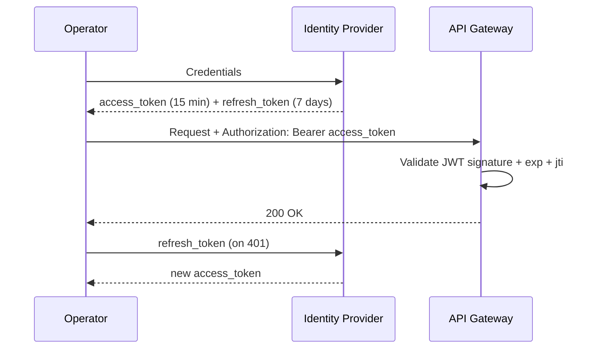
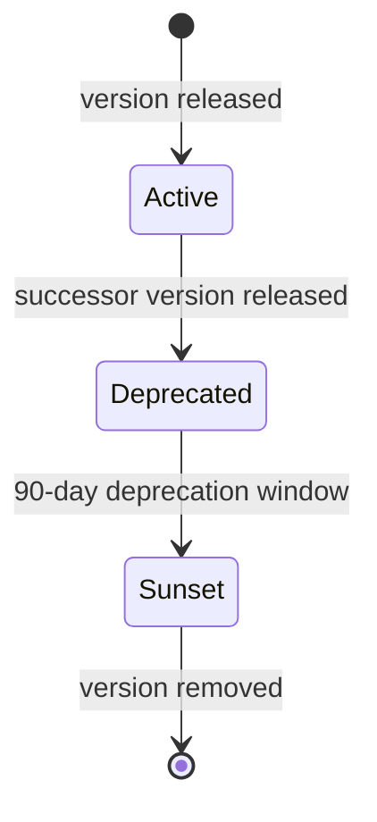
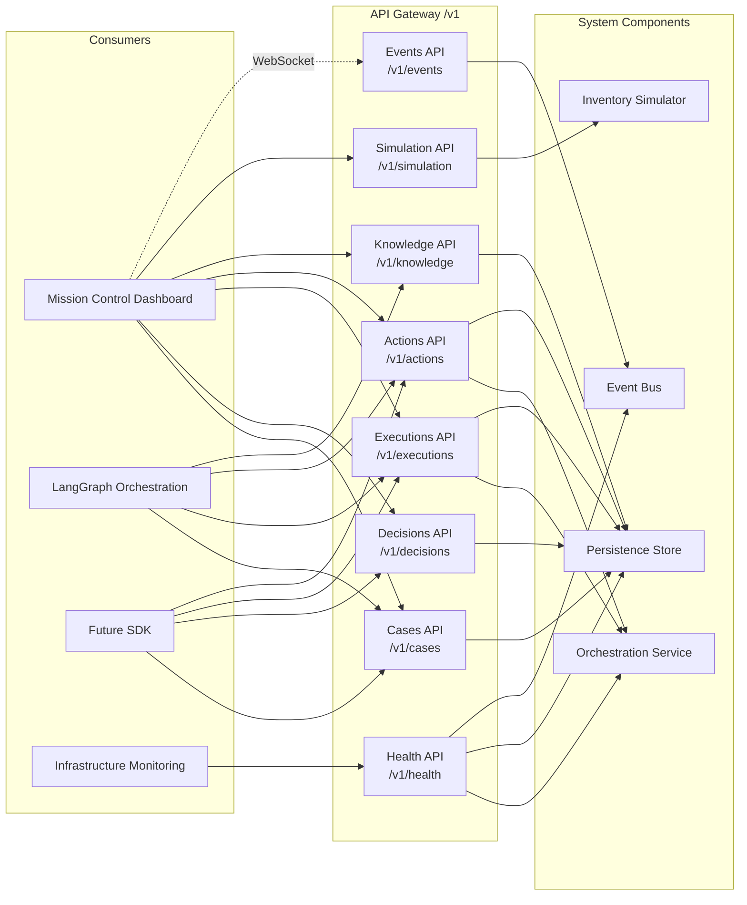
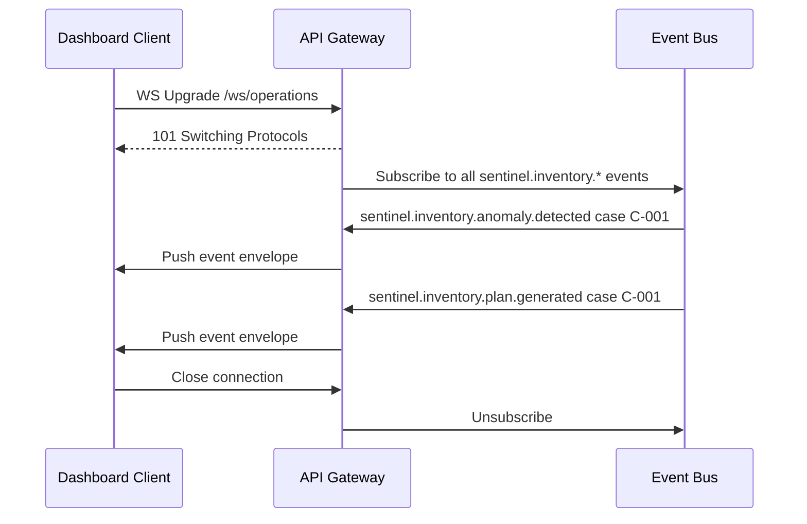
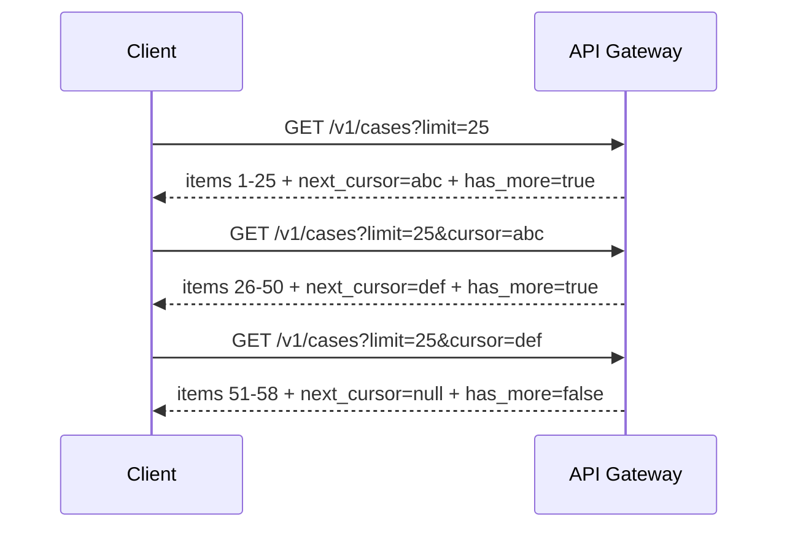
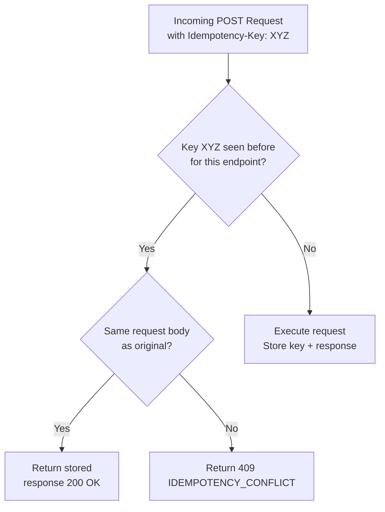
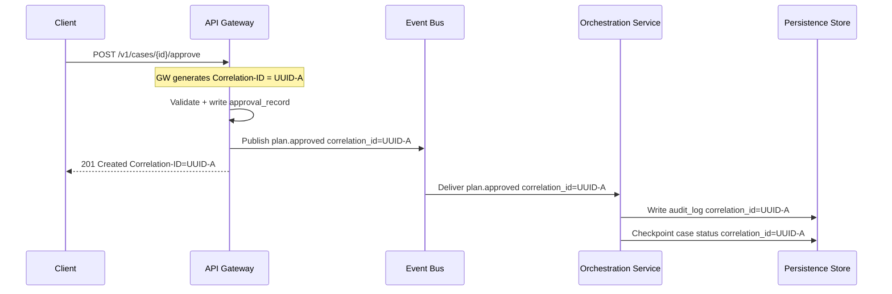
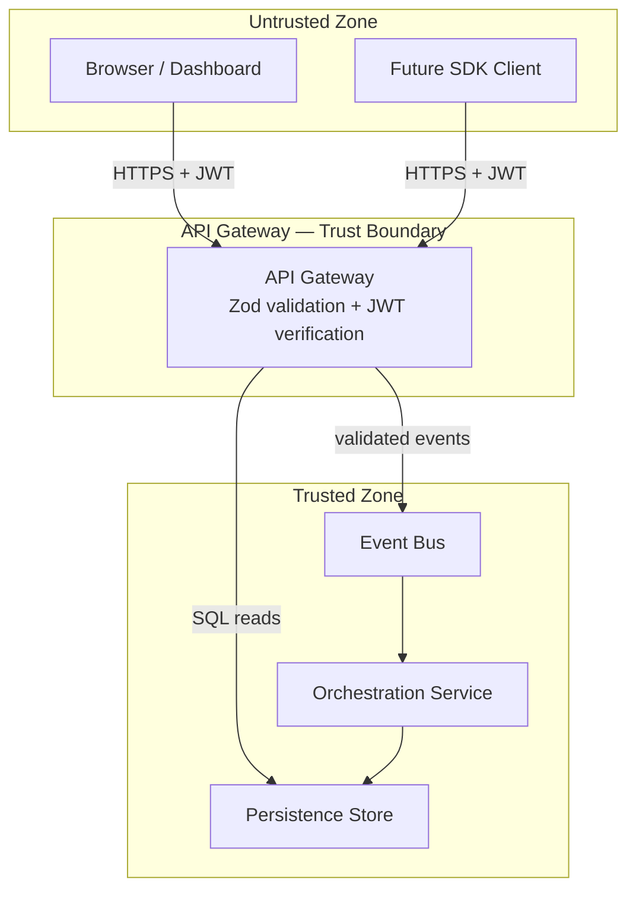
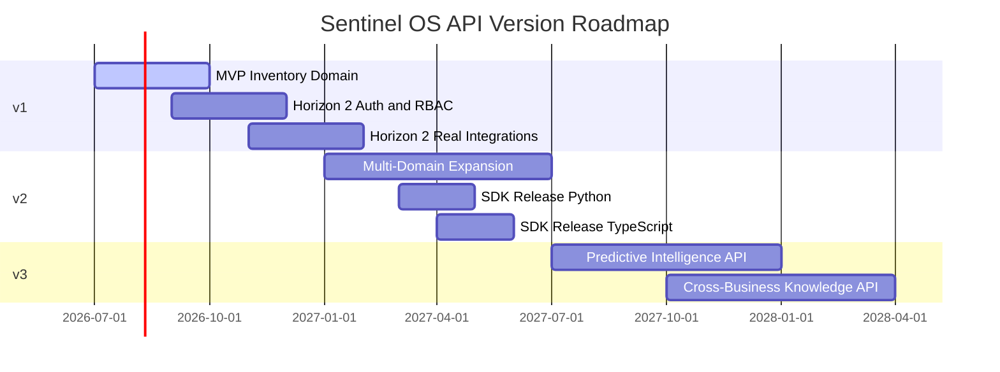

# Sentinel OS — Public API Specification

> **Document Class:** Definitive Engineering Reference
> **Audience:** Engineering, Frontend, Platform, LangGraph Orchestration, Future SDK Authors
> **Status:** Authoritative — Version 1.0
> **Last Updated:** 2026-07-03
> **Parent Documents:**
> - [00_MASTER_CONTEXT.md](./00_MASTER_CONTEXT.md)
> - [01_PROJECT_VISION.md](./01_PROJECT_VISION.md)
> - [03_ARCHITECTURE.md](./03_ARCHITECTURE.md)
> - [04_DATABASE.md](./04_DATABASE.md)
> - [15_ARCHITECTURE_DECISIONS.md](../adr/15_ARCHITECTURE_DECISIONS.md)

> **Related ADRs:** ADR-001, ADR-002, ADR-004, ADR-005, ADR-006, ADR-008, ADR-009, ADR-010, ADR-012

---

## Table of Contents

1. [Executive Summary](#1-executive-summary)
2. [API Philosophy](#2-api-philosophy)
3. [API Design Principles](#3-api-design-principles)
4. [Authentication Model](#4-authentication-model)
5. [Authorization Model](#5-authorization-model)
6. [API Versioning](#6-api-versioning)
7. [Capability Map](#7-capability-map)
8. [REST Modules](#8-rest-modules)
9. [Events API](#9-events-api)
10. [Cases API](#10-cases-api)
11. [Decisions API](#11-decisions-api)
12. [Executions API](#12-executions-api)
13. [Actions API](#13-actions-api)
14. [Knowledge API](#14-knowledge-api)
15. [Simulation API](#15-simulation-api)
16. [Health API](#16-health-api)
17. [WebSocket Events](#17-websocket-events)
18. [Error Model](#18-error-model)
19. [Pagination & Filtering](#19-pagination--filtering)
20. [Rate Limiting](#20-rate-limiting)
21. [Idempotency Strategy](#21-idempotency-strategy)
22. [Correlation IDs](#22-correlation-ids)
23. [Request / Response Standards](#23-request--response-standards)
24. [Security Considerations](#24-security-considerations)
25. [Future Evolution](#25-future-evolution)

---

## 1. Executive Summary

The Sentinel OS API is the single programmable surface through which operators, the Mission Control Dashboard, the LangGraph orchestration service, and future SDK consumers interact with the autonomous execution engine.

This API does not expose database tables. It exposes **operational capabilities**: the ability to observe anomaly cases as they progress through a closed execution loop, to render human judgment at the approval gateway, to inspect AI reasoning, to retrieve immutable audit records, and to control simulation scenarios.

Every endpoint in this specification is an expression of a business capability, not a CRUD operation. The distinction is intentional and non-negotiable.

**API surface at a glance:**

| Module | Base Path | Primary Consumer |
|---|---|---|
| Events | `/v1/events` | Dashboard, LangGraph, Monitoring |
| Cases | `/v1/cases` | Dashboard, Operators |
| Decisions | `/v1/decisions` | Dashboard, Audit |
| Executions | `/v1/executions` | Dashboard, Execute Agent |
| Actions | `/v1/actions` | Dashboard, Execute Agent |
| Knowledge | `/v1/knowledge` | LangGraph Agents, Dashboard |
| Simulation | `/v1/simulation` | Development, Demo |
| Health | `/v1/health` | Infrastructure, CI/CD |

**Real-time channel:**

| Channel | Protocol | Consumer |
|---|---|---|
| `/ws/operations` | WebSocket | Dashboard (all case events) |
| `/ws/cases/{case_id}` | WebSocket | Dashboard (per-case real-time view) |

---

## 2. API Philosophy

### 2.1 Capabilities, Not Resources

REST is a transport mechanism. The API communicates **business capabilities**:

- `POST /v1/cases/{id}/approve` — a human exercising their authority over an autonomous execution plan
- `POST /v1/cases/{id}/reject` — a human declining a plan and providing corrective feedback
- `POST /v1/simulation/scenarios/{id}/trigger` — initiating a demonstration scenario

These are not CRUD operations on a `cases` table. They are domain verbs that advance the operational state machine and carry real business consequence.

### 2.2 The Approval Gateway Is the Center of Gravity

Every design decision in this API traces back to one inviolable constraint (ADR-008): **no execution begins without an explicit human approval event**. The approval and rejection endpoints are not a thin wrapper around a database write. They are the mechanisms through which human authority is exercised and audit-recorded before any action is taken against a business system.

### 2.3 The Event Stream Is the Source of Truth for State

Real-time state propagates via the WebSocket event stream (Section 17). REST endpoints serve the initial page load and audit retrieval use cases. Consumers that need live state must subscribe to the event stream. Polling REST endpoints for state changes is an anti-pattern in this system.

### 2.4 LangGraph Is a First-Class Consumer

The orchestration service (LangGraph) interacts with this API through the same surface as the dashboard. There are no internal back-channel APIs. LangGraph reads business case state via `GET /v1/cases/{id}`, submits execution outcomes via execution and action endpoints, and receives operator decisions via the event bus. This constraint enforces testability and ensures the API contract is complete.

### 2.5 Audit-First Design

Every state-mutating operation through this API produces an `audit_log` record before the HTTP response is returned. A `4xx` or `5xx` response means no audit record was written. A `2xx` response guarantees the operation is durably recorded.

---

## 3. API Design Principles

| # | Principle | Concrete Expression |
|---|---|---|
| **P-API-01** | Business capability over CRUD | Endpoints are named after what the operator is doing, not the table being written |
| **P-API-02** | Immutability is visible | All immutable collections return `X-Sentinel-Immutable: true` in response headers |
| **P-API-03** | Idempotency is mandatory for mutations | Every `POST` that changes state accepts and enforces an `Idempotency-Key` header |
| **P-API-04** | Correlation across the request chain | Every request generates or propagates a `Correlation-ID` header that appears in audit logs and events |
| **P-API-05** | Errors are operational, not technical | Error bodies include `error_code` (machine-readable), `message` (human-readable), and `case_id` where applicable |
| **P-API-06** | Schema contracts are externalized | All request and response body shapes are defined in `@sentinel/schemas`; this document describes them in human language |
| **P-API-07** | Partial success is explicit | Multi-step operations (e.g., execution progress) return structured per-item status, never a boolean success flag |
| **P-API-08** | Pagination is cursor-based | All list endpoints use keyset pagination over timestamp cursors; offset pagination is not supported |
| **P-API-09** | Deprecation is explicit | Deprecated capabilities are marked with `Sunset` and `Deprecation` headers at least one minor version before removal |
| **P-API-10** | No business logic in the gateway | The API Gateway validates, routes, and translates — it does not compute, infer, or decide |

---

## 4. Authentication Model

> **MVP Note:** Authentication is explicitly out of scope for the hackathon MVP (Vision §10). This section documents the target model for Horizon 2. The MVP operates as a single-operator session without auth enforcement.

### 4.1 Token-Based Authentication (Horizon 2)

All requests to the Sentinel OS API must carry a bearer token in the `Authorization` header:

```
Authorization: Bearer <jwt_token>
```

Tokens are issued by an identity provider (IdP) — internal or external — and validated at the API Gateway. The gateway extracts the operator identity (`sub` claim) and role claims before routing any request.

### 4.2 JWT Structure

| Claim | Type | Description |
|---|---|---|
| `sub` | UUID | Operator's internal user ID. Maps to `users.id`. |
| `email` | string | Operator email. Used for audit records. |
| `role` | string | Role enum: `VIEWER`, `APPROVER`, `ADMIN` |
| `warehouse_ids` | UUID[] | Warehouses the operator has access to (empty = all) |
| `exp` | epoch | Token expiry. Short-lived (15 min); refreshable. |
| `jti` | UUID | JWT ID for token revocation checks. |

### 4.3 Token Lifecycle



### 4.4 MVP Bypass

In MVP mode, the `Authorization` header is not required. All requests are attributed to the default operator identity (`OPERATOR-DEFAULT`). This default identity appears in all audit records during the hackathon demonstration.

---

## 5. Authorization Model

> **MVP Note:** Authorization enforcement is also deferred to Horizon 2. All MVP operations are available to the single operator session.

### 5.1 Role Definitions

| Role | Description | Capabilities |
|---|---|---|
| `VIEWER` | Read-only access | Read cases, decisions, executions, audit logs, knowledge |
| `APPROVER` | Standard operator | All VIEWER rights + approve/reject plans |
| `ADMIN` | Full access | All APPROVER rights + approve high-risk actions + manage simulation + configure knowledge |

### 5.2 Endpoint Authorization Matrix

| Capability | VIEWER | APPROVER | ADMIN |
|---|---|---|---|
| List active cases | ✓ | ✓ | ✓ |
| View case detail | ✓ | ✓ | ✓ |
| Approve execution plan | ✗ | ✓ | ✓ |
| Reject execution plan | ✗ | ✓ | ✓ |
| Approve HIGH-risk action | ✗ | ✗ | ✓ |
| View audit log | ✓ | ✓ | ✓ |
| Read knowledge records | ✓ | ✓ | ✓ |
| Create knowledge records | ✗ | ✗ | ✓ |
| Trigger simulation scenario | ✗ | ✗ | ✓ |
| Halt simulation | ✗ | ✗ | ✓ |
| View health status | ✓ | ✓ | ✓ |

### 5.3 Warehouse Scoping

An operator with a non-empty `warehouse_ids` JWT claim can only read and act on cases associated with those warehouses. The API Gateway enforces this by injecting a `WHERE warehouse_id IN (...)` predicate into every case query. An `ADMIN` with an empty `warehouse_ids` claim has unrestricted scope.

---

## 6. API Versioning

### 6.1 Versioning Scheme

The Sentinel OS API uses **URI path versioning**. All endpoints are prefixed with a version segment:

```
/v1/cases
/v2/cases   ← future
```

### 6.2 Version Semantics

| Version Change | Definition | Backward Compatible? |
|---|---|---|
| **Minor** (e.g., new optional field in response) | Response body gains new optional fields; existing fields unchanged | Yes |
| **Major** (e.g., field removed, type changed, endpoint removed) | Breaking change; new major version required | No |
| **Patch** (e.g., bug fix, documentation correction) | No contract change | Yes |

### 6.3 Version Lifecycle



Deprecated versions carry the following response headers:

```
Deprecation: true
Sunset: 2026-10-01
Link: </v2/cases>; rel="successor-version"
```

### 6.4 Compatibility Policy

- **New optional fields** may be added to responses at any time within a major version.
- **Clients must tolerate unknown fields** in JSON responses (ignore, do not error).
- **Required request fields** are never added to an existing endpoint within a major version.
- **Enum values** may be added to response enums within a major version. Clients must handle unknown enum values.

---

## 7. Capability Map

The following diagram maps the seven API modules to the agents and system components they expose capabilities for:



### 7.1 Capability Ownership

| Capability | API Module | Business Agent | ADR |
|---|---|---|---|
| Observe the event stream | Events API | All agents via Event Bus | ADR-001, ADR-009 |
| Monitor active cases | Cases API | Detect Agent (creates), all agents (update) | ADR-004 |
| Approve / reject execution plans | Cases API | Approval Gateway | ADR-008 |
| Inspect AI reasoning | Decisions API | Plan Agent | ADR-004 |
| Track execution progress | Executions API | Execute Agent | ADR-004 |
| Inspect action-level detail | Actions API | Execute Agent | ADR-004 |
| Query operational knowledge | Knowledge API | Improve Agent, Investigate Agent | ADR-006 |
| Control simulation scenarios | Simulation API | Inventory Simulator | ADR-003 |
| Verify system health | Health API | All services | ADR-013 |

---

## 8. REST Modules

The following sections define every endpoint in the Sentinel OS API. For each endpoint the following structure is used:

- **Purpose** — what business capability this endpoint delivers
- **Request** — path parameters, query parameters, request body fields
- **Response** — response body fields and their types
- **Status Codes** — all possible HTTP status codes and their meaning
- **Validation Rules** — field-level constraints enforced before processing
- **Errors** — error codes specific to this endpoint
- **Related ADRs** — which architecture decisions govern this endpoint

---

## 9. Events API

Base path: `/v1/events`

The Events API exposes the typed business event stream persisted in `business_events`. It provides a queryable, paginated view of the event ledger. The live event stream is served via the WebSocket API (Section 17); this REST surface is for historical query and replay.

---

### 9.1 `GET /v1/events`

**Purpose:** Retrieve a paginated, filterable page from the business event ledger. Used by the dashboard to reconstruct case timelines and by operators performing incident retrospectives.

**Request:**

| Parameter | Location | Type | Required | Description |
|---|---|---|---|---|
| `case_id` | Query | UUID | No | Filter events to a specific Business Case |
| `event_type` | Query | string | No | Filter by event type (e.g., `sentinel.inventory.anomaly.detected`) |
| `source_agent` | Query | string | No | Filter by emitting agent |
| `from` | Query | ISO 8601 UTC | No | Events occurring at or after this timestamp |
| `until` | Query | ISO 8601 UTC | No | Events occurring at or before this timestamp |
| `cursor` | Query | string | No | Opaque cursor from previous page response for keyset pagination |
| `limit` | Query | integer | No | Page size. Default: `50`. Max: `200`. |

**Response:**

```json
{
  "items": [
    {
      "id":             "UUID",
      "event_type":     "string",
      "source_agent":   "string",
      "schema_version": "string",
      "case_id":        "UUID | null",
      "correlation_id": "UUID",
      "payload":        {},
      "occurred_at":    "ISO 8601 UTC"
    }
  ],
  "pagination": {
    "next_cursor": "string | null",
    "has_more":    false,
    "total_count": null
  }
}
```

**Status Codes:**

| Code | Condition |
|---|---|
| `200 OK` | Events returned successfully |
| `400 Bad Request` | Invalid filter parameter format |
| `401 Unauthorized` | Missing or invalid bearer token (Horizon 2) |
| `422 Unprocessable Entity` | `from` is after `until` |

**Validation Rules:**

- `from` and `until` must be valid ISO 8601 UTC timestamps.
- `limit` must be a positive integer ≤ 200.
- `cursor` is opaque; do not attempt to parse or construct it manually.

**Errors:**

| Error Code | HTTP Status | Description |
|---|---|---|
| `INVALID_TIME_RANGE` | 422 | `from` timestamp is after `until` timestamp |
| `INVALID_CURSOR` | 400 | Cursor is malformed or expired |
| `UNKNOWN_EVENT_TYPE` | 400 | `event_type` filter does not match any registered type |

**Related ADRs:** ADR-001, ADR-009

---

### 9.2 `GET /v1/events/{event_id}`

**Purpose:** Retrieve a single event by its globally unique identifier. Used for distributed trace resolution and audit investigation.

**Request:**

| Parameter | Location | Type | Required | Description |
|---|---|---|---|---|
| `event_id` | Path | UUID | Yes | Globally unique event identifier |

**Response:**

```json
{
  "id":             "UUID",
  "event_type":     "string",
  "source_agent":   "string",
  "schema_version": "string",
  "case_id":        "UUID | null",
  "correlation_id": "UUID",
  "payload":        {},
  "occurred_at":    "ISO 8601 UTC"
}
```

**Status Codes:**

| Code | Condition |
|---|---|
| `200 OK` | Event found and returned |
| `404 Not Found` | No event with this ID exists |

**Errors:**

| Error Code | HTTP Status | Description |
|---|---|---|
| `EVENT_NOT_FOUND` | 404 | Event ID does not exist in the ledger |

**Related ADRs:** ADR-001, ADR-009

---

## 10. Cases API

Base path: `/v1/cases`

The Cases API is the operational core of the Sentinel OS surface. It exposes Business Cases — the central unit of autonomous execution (ADR-004) — and the two human-authority endpoints that drive the approval gateway (ADR-008): `approve` and `reject`.

This is the API that operators use most. It must be fast, current, and precise.

```mermaid
graph LR
    OP["Operator"] -->|GET /v1/cases| LIST["Active Case Feed"]
    OP -->|GET /v1/cases/{id}| DETAIL["Case Detail"]
    OP -->|POST /v1/cases/{id}/approve| APPROVE["Approve Plan"]
    OP -->|POST /v1/cases/{id}/reject| REJECT["Reject Plan"]
    OP -->|GET /v1/cases/{id}/timeline| TIMELINE["Case Timeline"]
    OP -->|GET /v1/cases/{id}/audit| AUDIT["Case Audit Log"]

    APPROVE -->|publishes| EB["Event Bus"]
    REJECT -->|publishes| EB
    EB --> ORC["Orchestration Service LangGraph resumes"]
```

---

### 10.1 `GET /v1/cases`

**Purpose:** Retrieve a filtered, paginated list of Business Cases. Drives the Live Operations Feed on the Mission Control Dashboard. Default ordering is most-recently-updated first.

**Request:**

| Parameter | Location | Type | Required | Description |
|---|---|---|---|---|
| `status` | Query | string (enum, multi) | No | Filter by status. Accepts comma-separated list. E.g., `AWAITING_APPROVAL,EXECUTING`. |
| `severity` | Query | string (enum, multi) | No | `LOW`, `MEDIUM`, `HIGH`, `CRITICAL` |
| `domain` | Query | string (enum) | No | `INVENTORY`, `SALES`, `PRODUCTION`, `LOGISTICS`, `FINANCE` |
| `warehouse_id` | Query | UUID | No | Filter to a specific warehouse |
| `anomaly_type` | Query | string | No | E.g., `STOCKOUT_RISK`, `RECEIVING_DISCREPANCY` |
| `from` | Query | ISO 8601 UTC | No | Cases created at or after this time |
| `until` | Query | ISO 8601 UTC | No | Cases created at or before this time |
| `cursor` | Query | string | No | Keyset pagination cursor |
| `limit` | Query | integer | No | Default `25`. Max `100`. |

**Response:**

```json
{
  "items": [
    {
      "id":                   "UUID",
      "public_id":            "CASE-000001",
      "warehouse_id":         "UUID",
      "domain":               "INVENTORY",
      "status":               "AWAITING_APPROVAL",
      "anomaly_type":         "STOCKOUT_RISK",
      "severity":             "HIGH",
      "detection_confidence": 0.92,
      "baseline_delta":       -38.0,
      "detected_at":          "2026-07-03T09:00:00.000Z",
      "updated_at":           "2026-07-03T09:04:00.000Z",
      "cycle_elapsed_ms":     240000
    }
  ],
  "pagination": {
    "next_cursor": "string | null",
    "has_more":    false
  },
  "summary": {
    "total_active":            3,
    "awaiting_approval_count": 1,
    "executing_count":         1,
    "critical_count":          0
  }
}
```

**Status Codes:**

| Code | Condition |
|---|---|
| `200 OK` | List returned. Empty `items` array if no cases match filters. |
| `400 Bad Request` | Invalid filter value |
| `401 Unauthorized` | Auth failure (Horizon 2) |

**Validation Rules:**

- `status` values must be valid `CaseStatus` enum members.
- `severity` values must be `LOW`, `MEDIUM`, `HIGH`, or `CRITICAL`.
- `limit` must be between `1` and `100`.

**Errors:**

| Error Code | HTTP Status | Description |
|---|---|---|
| `INVALID_STATUS_FILTER` | 400 | Unknown `status` enum value |
| `INVALID_SEVERITY_FILTER` | 400 | Unknown `severity` enum value |

**Related ADRs:** ADR-004, ADR-010

---

### 10.2 `GET /v1/cases/{case_id}`

**Purpose:** Retrieve the complete state of a single Business Case, including all phase-level data: detection record, investigation findings, execution plan, approval record, and current execution status. This is the primary data source for the Case Detail View.

**Request:**

| Parameter | Location | Type | Required | Description |
|---|---|---|---|---|
| `case_id` | Path | UUID | Yes | Business Case UUID |

**Response:**

```json
{
  "id":                       "UUID",
  "public_id":                "CASE-000001",
  "warehouse_id":             "UUID",
  "domain":                   "INVENTORY",
  "status":                   "AWAITING_APPROVAL",
  "schema_version":           "1.0.0",
  "version":                  3,
  "created_at":               "2026-07-03T09:00:00.000Z",
  "updated_at":               "2026-07-03T09:04:30.000Z",
  "closed_at":                null,
  "cycle_elapsed_ms":         270000,

  "detection": {
    "anomaly_type":           "STOCKOUT_RISK",
    "severity":               "HIGH",
    "confidence":             0.9200,
    "baseline_delta":         -38.0,
    "affected_entities":      [],
    "detector_version":       "1.0.0",
    "detected_at":            "2026-07-03T09:00:30.000Z",
    "payload":                {}
  },

  "investigation": {
    "root_cause_hypothesis":  "Supplier delayed shipment. PO-4491 due 2026-06-29, not received as of 2026-07-03.",
    "confidence":             0.8700,
    "evidence_chain":         [],
    "investigator_version":   "1.0.0",
    "investigated_at":        "2026-07-03T09:03:00.000Z"
  },

  "decision": {
    "id":                     "UUID",
    "public_id":              "DEC-000001",
    "plan_version":           1,
    "recommendation_summary": "Issue emergency reorder and escalate supplier.",
    "confidence_score":       0.8500,
    "risk_score":             0.2000,
    "reasoning_summary":      "...",
    "evidence":               {},
    "alternative_decisions":  [],
    "status":                 "PENDING",
    "created_at":             "2026-07-03T09:04:30.000Z"
  },

  "approval": null,

  "execution": null
}
```

**Status Codes:**

| Code | Condition |
|---|---|
| `200 OK` | Case found and returned |
| `404 Not Found` | No case with this ID |

**Errors:**

| Error Code | HTTP Status | Description |
|---|---|---|
| `CASE_NOT_FOUND` | 404 | Case UUID does not exist |

**Related ADRs:** ADR-004, ADR-008, ADR-010

---

### 10.3 `POST /v1/cases/{case_id}/approve`

**Purpose:** Record the operator's approval of the current execution plan for this case. This is the **human approval gateway** (ADR-008). On success, the API Gateway publishes `sentinel.inventory.plan.approved` to the event bus, which resumes the LangGraph workflow from the `await_approval` interrupt node and advances execution.

This endpoint has irreversible operational consequences. Once approved, the Execute Agent begins processing actions against the business system.

**Request:**

| Parameter | Location | Type | Required | Description |
|---|---|---|---|---|
| `case_id` | Path | UUID | Yes | Business Case UUID |
| `Idempotency-Key` | Header | string | Yes | Client-generated unique key to prevent duplicate approvals. Max 128 chars. |
| `comment` | Body | string | No | Optional operator comment captured in the approval record. Max 1000 chars. |
| `approved_by` | Body | UUID | Yes (MVP: defaults to OPERATOR-DEFAULT) | Operator user ID. Must match authenticated token subject in Horizon 2. |

**Response:**

```json
{
  "case_id":         "UUID",
  "public_id":       "CASE-000001",
  "decision":        "APPROVED",
  "approved_by":     "UUID",
  "comment":         null,
  "decided_at":      "2026-07-03T09:10:00.000Z",
  "new_case_status": "APPROVED",
  "event_id":        "UUID"
}
```

**Status Codes:**

| Code | Condition |
|---|---|
| `200 OK` | Approval recorded. Idempotency-Key matched a prior successful approval. Response is identical to original. |
| `201 Created` | Approval recorded for the first time. |
| `400 Bad Request` | Case is not in `AWAITING_APPROVAL` status |
| `404 Not Found` | Case does not exist |
| `409 Conflict` | Case has already been approved or rejected (not idempotent match) |
| `422 Unprocessable Entity` | Request body validation failure |
| `429 Too Many Requests` | Rate limit exceeded |

**Validation Rules:**

- `case_id` must reference an existing case.
- Case `status` must be `AWAITING_APPROVAL`. Any other status results in `400`.
- `Idempotency-Key` must be present. Absent key returns `400`.
- `comment` max length is 1000 characters.

**Errors:**

| Error Code | HTTP Status | Description |
|---|---|---|
| `CASE_NOT_FOUND` | 404 | Case UUID does not exist |
| `CASE_NOT_AWAITING_APPROVAL` | 400 | Case status is not `AWAITING_APPROVAL` |
| `ALREADY_DECIDED` | 409 | Case already has a terminal approval decision |
| `MISSING_IDEMPOTENCY_KEY` | 400 | `Idempotency-Key` header not provided |

**Related ADRs:** ADR-004, ADR-008, ADR-009

---

### 10.4 `POST /v1/cases/{case_id}/reject`

**Purpose:** Record the operator's rejection of the current execution plan. The `replan` flag determines whether the LangGraph workflow routes back to the Plan Agent for re-generation (with the rejection reason as input), or closes the case as `CLOSED_REJECTED`. A rejection is always recorded in the audit log before routing.

**Request:**

| Parameter | Location | Type | Required | Description |
|---|---|---|---|---|
| `case_id` | Path | UUID | Yes | Business Case UUID |
| `Idempotency-Key` | Header | string | Yes | Client-generated unique key. Max 128 chars. |
| `reason` | Body | string | Yes | Operator's rejection reason. Passed to Plan Agent on re-plan. Max 2000 chars. |
| `replan` | Body | boolean | Yes | `true` = route to Plan Agent for re-generation. `false` = close case immediately. |
| `rejected_by` | Body | UUID | Yes (MVP: defaults to OPERATOR-DEFAULT) | Operator user ID. |

**Response:**

```json
{
  "case_id":         "UUID",
  "public_id":       "CASE-000001",
  "decision":        "REJECTED",
  "rejected_by":     "UUID",
  "reason":          "Actions do not address the root cause adequately.",
  "replan":          true,
  "decided_at":      "2026-07-03T09:10:00.000Z",
  "new_case_status": "PLAN_GENERATED",
  "event_id":        "UUID"
}
```

**Status Codes:**

| Code | Condition |
|---|---|
| `200 OK` | Rejection recorded. Idempotency match. |
| `201 Created` | Rejection recorded for the first time. |
| `400 Bad Request` | Case not in `AWAITING_APPROVAL`; or `replan=true` but max re-plan count (2) exceeded |
| `404 Not Found` | Case does not exist |
| `409 Conflict` | Case already has a terminal approval decision |
| `422 Unprocessable Entity` | Missing `reason` or `replan` |

**Validation Rules:**

- `reason` is required and must be non-empty.
- `replan` must be an explicit boolean.
- A case may be re-planned a maximum of 2 times. If `replan=true` and `re_plan_count >= 2`, the request fails with `400` and error code `MAX_REPLAN_EXCEEDED`.

**Errors:**

| Error Code | HTTP Status | Description |
|---|---|---|
| `CASE_NOT_FOUND` | 404 | Case UUID does not exist |
| `CASE_NOT_AWAITING_APPROVAL` | 400 | Case status is not `AWAITING_APPROVAL` |
| `ALREADY_DECIDED` | 409 | Terminal decision already recorded |
| `MAX_REPLAN_EXCEEDED` | 400 | Re-plan count at limit (2). Must set `replan=false`. |
| `MISSING_REASON` | 422 | `reason` field is absent or empty |

**Related ADRs:** ADR-004, ADR-008, ADR-009

---

### 10.5 `GET /v1/cases/{case_id}/timeline`

**Purpose:** Retrieve the ordered lifecycle narrative for a Business Case. Returns all `case_timeline` entries — one per significant milestone — in chronological order. The timeline is the human-readable account of what happened and who did it at each step.

**Request:**

| Parameter | Location | Type | Required | Description |
|---|---|---|---|---|
| `case_id` | Path | UUID | Yes | Business Case UUID |

**Response:**

```json
{
  "case_id":    "UUID",
  "public_id":  "CASE-000001",
  "status":     "CLOSED_SUCCESS",
  "entries": [
    {
      "id":          "UUID",
      "milestone":   "CASE_CREATED",
      "description": "Anomaly detected: STOCKOUT_RISK for SKU-7821 at confidence 0.92",
      "agent":       "detect_agent",
      "metadata":    { "confidence": 0.92 },
      "occurred_at": "2026-07-03T09:00:30.000Z"
    }
  ]
}
```

**Timeline Milestones:**

| Milestone | Producing Agent | Description |
|---|---|---|
| `CASE_CREATED` | Detect Agent | Anomaly scored; Business Case instantiated |
| `INVESTIGATION_STARTED` | Investigate Agent | Root cause analysis initiated |
| `INVESTIGATION_COMPLETE` | Investigate Agent | Root cause hypothesis generated |
| `PLAN_GENERATED` | Plan Agent | Execution plan produced and ready for review |
| `PLAN_REJECTED` | Approval Gateway | Operator rejected; re-plan requested or case closed |
| `PLAN_APPROVED` | Approval Gateway | Operator approved; execution authorized |
| `EXECUTION_STARTED` | Execute Agent | First action initiated |
| `ACTION_COMPLETED` | Execute Agent | Individual action succeeded |
| `ACTION_FAILED` | Execute Agent | Individual action failed |
| `EXECUTION_COMPLETE` | Execute Agent | All actions reached terminal status |
| `CASE_CLOSED` | Record Agent | Audit record sealed; case terminal |
| `BASELINE_UPDATED` | Improve Agent | Detection baseline updated from outcome |

**Status Codes:**

| Code | Condition |
|---|---|
| `200 OK` | Timeline returned |
| `404 Not Found` | Case does not exist |

**Related ADRs:** ADR-004, ADR-005

---

### 10.6 `GET /v1/cases/{case_id}/audit`

**Purpose:** Retrieve the immutable audit log for a Business Case. Returns all `audit_log` entries in chronological order. The audit log is the tamper-evident record of every state-changing event and every actor involved. This is the compliance surface.

**Request:**

| Parameter | Location | Type | Required | Description |
|---|---|---|---|---|
| `case_id` | Path | UUID | Yes | Business Case UUID |
| `event_type` | Query | string | No | Filter audit entries by event type |
| `actor_type` | Query | string | No | `AGENT` or `OPERATOR` |

**Response Headers:**

```
X-Sentinel-Immutable: true
```

**Response:**

```json
{
  "case_id":   "UUID",
  "public_id": "CASE-000001",
  "entries": [
    {
      "id":              "UUID",
      "event_type":      "PLAN_APPROVED",
      "actor":           "OPERATOR-DEFAULT",
      "actor_type":      "OPERATOR",
      "before_snapshot": { "status": "AWAITING_APPROVAL" },
      "after_snapshot":  { "status": "APPROVED" },
      "correlation_id":  "UUID",
      "metadata":        null,
      "recorded_at":     "2026-07-03T09:10:00.000Z"
    }
  ]
}
```

**Status Codes:**

| Code | Condition |
|---|---|
| `200 OK` | Audit log returned |
| `404 Not Found` | Case does not exist |

**Errors:**

| Error Code | HTTP Status | Description |
|---|---|---|
| `CASE_NOT_FOUND` | 404 | Case UUID does not exist |

**Related ADRs:** ADR-004, ADR-008, ADR-009, Master Context §8.4

---

## 11. Decisions API

Base path: `/v1/decisions`

The Decisions API exposes AI-generated execution plan recommendations — the `decisions` table — with their full explainability payload: confidence scores, risk assessments, reasoning summaries, evidence chains, and alternative plans considered. This is the primary surface for inspecting AI reasoning.

---

### 11.1 `GET /v1/decisions/{decision_id}`

**Purpose:** Retrieve a single AI decision (execution plan recommendation) by its ID, with the full explainability payload. Used by the Case Detail View to render the reasoning behind the presented plan.

**Request:**

| Parameter | Location | Type | Required | Description |
|---|---|---|---|---|
| `decision_id` | Path | UUID | Yes | Decision UUID |

**Response:**

```json
{
  "id":                     "UUID",
  "public_id":              "DEC-000001",
  "case_id":                "UUID",
  "plan_version":           1,
  "recommendation_summary": "Issue emergency reorder to Supplier B and escalate PO-4491.",
  "confidence_score":       0.8500,
  "risk_score":             0.2000,
  "reasoning_summary":      "Supplier A has a pattern of late deliveries...",
  "evidence": {
    "sources":       [],
    "key_findings":  [],
    "data_points":   []
  },
  "alternative_decisions": [
    {
      "summary":              "Wait for Supplier A shipment",
      "reason_not_selected": "Lead time risk exceeds stockout window",
      "risk_score":           0.75
    }
  ],
  "status":         "PENDING",
  "created_by":     "plan_agent",
  "schema_version": "1.0.0",
  "created_at":     "2026-07-03T09:04:30.000Z"
}
```

**Status Codes:**

| Code | Condition |
|---|---|
| `200 OK` | Decision returned |
| `404 Not Found` | Decision UUID does not exist |

**Errors:**

| Error Code | HTTP Status | Description |
|---|---|---|
| `DECISION_NOT_FOUND` | 404 | Decision ID does not exist |

**Related ADRs:** ADR-004, ADR-008, Master Context §6.2

---

### 11.2 `GET /v1/cases/{case_id}/decisions`

**Purpose:** Retrieve all decisions generated for a specific case, in plan-version order. A case that has been rejected and re-planned will have multiple decisions. This endpoint surfaces the full deliberation history — which plans were generated, which was approved, and which were superseded.

**Request:**

| Parameter | Location | Type | Required | Description |
|---|---|---|---|---|
| `case_id` | Path | UUID | Yes | Business Case UUID |
| `status` | Query | string | No | Filter by `PENDING`, `APPROVED`, `REJECTED`, `SUPERSEDED` |

**Response:**

```json
{
  "case_id":   "UUID",
  "decisions": [
    {
      "id":                     "UUID",
      "public_id":              "DEC-000001",
      "plan_version":           1,
      "recommendation_summary": "...",
      "confidence_score":       0.8500,
      "risk_score":             0.2000,
      "status":                 "SUPERSEDED",
      "created_at":             "2026-07-03T09:04:30.000Z"
    },
    {
      "id":                     "UUID",
      "public_id":              "DEC-000002",
      "plan_version":           2,
      "recommendation_summary": "...",
      "confidence_score":       0.9100,
      "risk_score":             0.1500,
      "status":                 "APPROVED",
      "created_at":             "2026-07-03T09:07:00.000Z"
    }
  ]
}
```

**Status Codes:**

| Code | Condition |
|---|---|
| `200 OK` | Decisions returned. Empty array if none. |
| `404 Not Found` | Case UUID does not exist |

**Related ADRs:** ADR-004, ADR-008

---

## 12. Executions API

Base path: `/v1/executions`

The Executions API tracks the state machine of the execution phase: how many actions are planned, how many are complete, and what the overall status is. One `execution` record exists per Business Case that has been approved.

---

### 12.1 `GET /v1/executions/{execution_id}`

**Purpose:** Retrieve the current execution state for an approved case. Drives the Execution Status View on the dashboard. Returns progress counters, timing data, and the checkpoint state used for LangGraph resume on restart.

**Request:**

| Parameter | Location | Type | Required | Description |
|---|---|---|---|---|
| `execution_id` | Path | UUID | Yes | Execution UUID |

**Response:**

```json
{
  "id":                "UUID",
  "public_id":         "EXEC-000001",
  "case_id":           "UUID",
  "decision_id":       "UUID",
  "current_stage":     "IN_PROGRESS",
  "current_status":    "RUNNING",
  "total_actions":     3,
  "completed_actions": 1,
  "failed_actions":    0,
  "retry_count":       0,
  "started_at":        "2026-07-03T09:10:05.000Z",
  "finished_at":       null,
  "duration_ms":       null,
  "result":            null,
  "created_at":        "2026-07-03T09:10:00.000Z",
  "updated_at":        "2026-07-03T09:10:30.000Z",
  "version":           2
}
```

**Status Codes:**

| Code | Condition |
|---|---|
| `200 OK` | Execution state returned |
| `404 Not Found` | Execution ID does not exist |

**Errors:**

| Error Code | HTTP Status | Description |
|---|---|---|
| `EXECUTION_NOT_FOUND` | 404 | Execution ID does not exist |

**Related ADRs:** ADR-004, ADR-006, ADR-008

---

### 12.2 `GET /v1/cases/{case_id}/execution`

**Purpose:** Retrieve the execution record associated with a specific case by case ID. Convenience endpoint for the Case Detail View which always has the `case_id` in context.

**Request:**

| Parameter | Location | Type | Required | Description |
|---|---|---|---|---|
| `case_id` | Path | UUID | Yes | Business Case UUID |

**Response:** Same schema as `GET /v1/executions/{execution_id}`.

**Status Codes:**

| Code | Condition |
|---|---|
| `200 OK` | Execution state returned |
| `404 Not Found` | Case does not exist or has no execution record (not yet approved) |

**Errors:**

| Error Code | HTTP Status | Description |
|---|---|---|
| `CASE_NOT_FOUND` | 404 | Case UUID does not exist |
| `NO_EXECUTION_RECORD` | 404 | Case exists but has not been approved; no execution started |

**Related ADRs:** ADR-004, ADR-008

---

## 13. Actions API

Base path: `/v1/actions`

The Actions API provides granular visibility into individual atomic actions within an execution plan. Each action is a discrete, idempotent step against the business system (e.g., reorder stock, escalate supplier, adjust safety stock threshold).

---

### 13.1 `GET /v1/cases/{case_id}/actions`

**Purpose:** Retrieve all actions planned for a specific case, with their current execution status. Used by the Execution Status View to render a per-action progress breakdown.

**Request:**

| Parameter | Location | Type | Required | Description |
|---|---|---|---|---|
| `case_id` | Path | UUID | Yes | Business Case UUID |
| `status` | Query | string | No | Filter by `PENDING`, `IN_PROGRESS`, `SUCCESS`, `FAILED`, `SKIPPED` |

**Response:**

```json
{
  "case_id":      "UUID",
  "execution_id": "UUID",
  "actions": [
    {
      "id":                      "UUID",
      "public_id":               "ACT-000001",
      "priority_order":          1,
      "action_type":             "REORDER_STOCK",
      "action_key":              "case-uuid:REORDER_STOCK:1",
      "parameters":              { "quantity": 200, "supplier_id": "SUPP-B" },
      "expected_outcome":        "200 units dispatched within 24 hours",
      "risk_level":              "LOW",
      "required_approval_tier": "APPROVER",
      "idempotency_key":         "case-uuid:REORDER_STOCK:1",
      "status":                  "SUCCESS",
      "system_response":         { "order_id": "PO-9001", "eta": "2026-07-04" },
      "failure_reason":          null,
      "retry_count":             0,
      "started_at":              "2026-07-03T09:10:05.000Z",
      "finished_at":             "2026-07-03T09:10:20.000Z",
      "duration_ms":             15000,
      "created_at":              "2026-07-03T09:04:30.000Z"
    }
  ]
}
```

**Status Codes:**

| Code | Condition |
|---|---|
| `200 OK` | Actions returned. Empty array before approval. |
| `404 Not Found` | Case UUID does not exist |

**Related ADRs:** ADR-004, ADR-008, Master Context §8.7

---

### 13.2 `GET /v1/actions/{action_id}`

**Purpose:** Retrieve a single action by ID with its full parameter set, system response, and timing data. Used for audit drill-down and debugging.

**Request:**

| Parameter | Location | Type | Required | Description |
|---|---|---|---|---|
| `action_id` | Path | UUID | Yes | Action UUID |

**Response:** Same as individual action object in the `GET /v1/cases/{case_id}/actions` response.

**Status Codes:**

| Code | Condition |
|---|---|
| `200 OK` | Action returned |
| `404 Not Found` | Action UUID does not exist |

**Errors:**

| Error Code | HTTP Status | Description |
|---|---|---|
| `ACTION_NOT_FOUND` | 404 | Action ID does not exist |

**Related ADRs:** ADR-004, Master Context §8.7

---

## 14. Knowledge API

Base path: `/v1/knowledge`

The Knowledge API exposes the `knowledge_records` table — the operational learnings extracted by the Improve Agent after case closure. Knowledge records are the mechanism through which Sentinel OS accumulates institutional memory: baseline updates, recurring pattern identifications, and confidence-weighted insights derived from resolved cases.

---

### 14.1 `GET /v1/knowledge`

**Purpose:** Query the knowledge base for records matching criteria. Used by the Investigate Agent during root cause analysis (to surface relevant past patterns) and by the dashboard's Knowledge Explorer view.

**Request:**

| Parameter | Location | Type | Required | Description |
|---|---|---|---|---|
| `knowledge_type` | Query | string | No | E.g., `BASELINE_UPDATE`, `PATTERN_IDENTIFIED`, `SUPPLIER_RELIABILITY` |
| `domain` | Query | string | No | `INVENTORY`, `SALES`, etc. |
| `entity_key` | Query | string | No | The specific SKU, location, or supplier ID the record pertains to |
| `min_confidence` | Query | float | No | Minimum confidence score. Range: `0.0–1.0`. |
| `cursor` | Query | string | No | Keyset pagination cursor |
| `limit` | Query | integer | No | Default `25`. Max `100`. |

**Response:**

```json
{
  "items": [
    {
      "id":              "UUID",
      "case_id":         "UUID",
      "knowledge_type":  "SUPPLIER_RELIABILITY",
      "domain":          "INVENTORY",
      "entity_key":      "SUPP-A",
      "summary":         "Supplier A has delivered late on 3 of the last 5 POs in 60 days.",
      "structured_data": {},
      "confidence":      0.9000,
      "version":         "1.0",
      "created_at":      "2026-07-03T09:15:00.000Z",
      "expires_at":      null
    }
  ],
  "pagination": {
    "next_cursor": null,
    "has_more":    false
  }
}
```

**Status Codes:**

| Code | Condition |
|---|---|
| `200 OK` | Knowledge records returned |
| `400 Bad Request` | Invalid filter value |

**Related ADRs:** ADR-006, ADR-007

---

### 14.2 `GET /v1/knowledge/{record_id}`

**Purpose:** Retrieve a single knowledge record by ID with its full structured payload. Used when an agent or operator needs the complete data for a specific insight.

**Request:**

| Parameter | Location | Type | Required | Description |
|---|---|---|---|---|
| `record_id` | Path | UUID | Yes | Knowledge record UUID |

**Response:** Full single knowledge record object (same shape as items in 14.1).

**Status Codes:**

| Code | Condition |
|---|---|
| `200 OK` | Knowledge record returned |
| `404 Not Found` | Record UUID does not exist |

**Related ADRs:** ADR-006, ADR-007

---

### 14.3 `POST /v1/knowledge`

**Purpose:** Create a new knowledge record. In normal operations, knowledge records are created exclusively by the Improve Agent at case close. This endpoint is available to `ADMIN` operators for manual knowledge injection — for example, seeding domain-specific priors before the first automated case completes.

**Request:**

| Parameter | Location | Type | Required | Description |
|---|---|---|---|---|
| `Idempotency-Key` | Header | string | Yes | Prevents duplicate record creation on retry |
| `knowledge_type` | Body | string | Yes | Knowledge type enum value |
| `domain` | Body | string | Yes | Domain enum value |
| `entity_key` | Body | string | Yes | The entity this record pertains to |
| `summary` | Body | string | Yes | Human-readable summary. Max 2000 chars. |
| `structured_data` | Body | object | Yes | Structured machine-readable payload |
| `confidence` | Body | float | Yes | Confidence score `0.0–1.0` |
| `expires_at` | Body | ISO 8601 UTC | No | When this record should no longer be consulted |

**Response:**

```json
{
  "id":             "UUID",
  "knowledge_type": "SUPPLIER_RELIABILITY",
  "domain":         "INVENTORY",
  "entity_key":     "SUPP-A",
  "summary":        "Manually seeded: Supplier A known for Q3 delays.",
  "confidence":     0.7500,
  "created_at":     "2026-07-03T09:00:00.000Z"
}
```

**Status Codes:**

| Code | Condition |
|---|---|
| `200 OK` | Idempotency match. Record already exists. |
| `201 Created` | Knowledge record created |
| `400 Bad Request` | Validation failure |
| `403 Forbidden` | Role does not have `ADMIN` authority |
| `422 Unprocessable Entity` | `confidence` out of range or `expires_at` in the past |

**Validation Rules:**

- `confidence` must be in `[0.0, 1.0]`.
- `expires_at` must be in the future if provided.
- `knowledge_type` must be a registered enum value.

**Errors:**

| Error Code | HTTP Status | Description |
|---|---|---|
| `INVALID_CONFIDENCE_RANGE` | 422 | `confidence` is not between 0.0 and 1.0 |
| `EXPIRED_KNOWLEDGE_RECORD` | 422 | `expires_at` is in the past |
| `UNKNOWN_KNOWLEDGE_TYPE` | 400 | `knowledge_type` is not a registered value |

**Related ADRs:** ADR-006, ADR-007

---

## 15. Simulation API

Base path: `/v1/simulation`

The Simulation API controls the Inventory Simulator Adapter — the component that emits the synthetic inventory event stream used in the MVP demonstration. It enables operators and engineers to trigger specific anomaly scenarios, inspect running simulations, and halt the event stream.

> **Scope Note:** This API exists only while the system operates against simulated data (ADR-003, ADR-013). In Horizon 2, when the system connects to live WMS/ERP integrations, the Simulation API is retired.

---

### 15.1 `GET /v1/simulation/scenarios`

**Purpose:** List all available simulation scenario templates that can be triggered. Templates define the event sequence, expected anomaly type, and expected autonomous system response.

**Request:**

| Parameter | Location | Type | Required | Description |
|---|---|---|---|---|
| `domain` | Query | string | No | Filter by domain |
| `anomaly_type` | Query | string | No | Filter by anomaly type |
| `is_active` | Query | boolean | No | Filter to only active templates |

**Response:**

```json
{
  "scenarios": [
    {
      "id":           "UUID",
      "name":         "stockout-risk-supplier-delay",
      "domain":       "INVENTORY",
      "anomaly_type": "STOCKOUT_RISK",
      "description":  "Simulates SKU-7821 approaching stockout due to Supplier A delay on PO-4491.",
      "is_active":    true,
      "created_at":   "2026-07-03T00:00:00.000Z"
    }
  ]
}
```

**Status Codes:**

| Code | Condition |
|---|---|
| `200 OK` | Scenario list returned |

**Related ADRs:** ADR-003, ADR-013

---

### 15.2 `POST /v1/simulation/scenarios/{scenario_id}/trigger`

**Purpose:** Initiate a simulation scenario run. The simulator begins emitting the scenario's event sequence into the event bus. This triggers the Monitor Agent and initiates the full autonomous execution loop. The response includes the `run_id` for tracking and the `linked_case_id` once a Business Case is created by the Detect Agent (populated asynchronously).

**Request:**

| Parameter | Location | Type | Required | Description |
|---|---|---|---|---|
| `scenario_id` | Path | UUID | Yes | Scenario template UUID |
| `Idempotency-Key` | Header | string | Yes | Prevents duplicate run initiation |
| `speed_multiplier` | Body | float | No | Event playback speed. Default `1.0`. Range `0.1–10.0`. |
| `run_config` | Body | object | No | Override specific scenario parameters |

**Response:**

```json
{
  "run_id":         "UUID",
  "scenario_id":    "UUID",
  "scenario_name":  "stockout-risk-supplier-delay",
  "status":         "INITIATED",
  "triggered_by":   "OPERATOR-DEFAULT",
  "started_at":     "2026-07-03T09:00:00.000Z",
  "linked_case_id": null
}
```

**Status Codes:**

| Code | Condition |
|---|---|
| `202 Accepted` | Scenario run initiated. Case creation is asynchronous. |
| `400 Bad Request` | Scenario is not active or `speed_multiplier` out of range |
| `403 Forbidden` | Caller does not have `ADMIN` role |
| `404 Not Found` | Scenario ID does not exist |
| `409 Conflict` | A run of this scenario is already in progress |

**Validation Rules:**

- `speed_multiplier` must be between `0.1` and `10.0`.
- Scenario must be `is_active = true`.
- Only one concurrent run per scenario is permitted.

**Errors:**

| Error Code | HTTP Status | Description |
|---|---|---|
| `SCENARIO_NOT_FOUND` | 404 | Scenario UUID does not exist |
| `SCENARIO_NOT_ACTIVE` | 400 | Scenario is disabled |
| `RUN_ALREADY_IN_PROGRESS` | 409 | Duplicate concurrent run |
| `INVALID_SPEED_MULTIPLIER` | 400 | Speed out of allowed range |

**Related ADRs:** ADR-003, ADR-013, ADR-014

---

### 15.3 `GET /v1/simulation/runs/{run_id}`

**Purpose:** Retrieve the status and result of a specific simulation run. Poll this endpoint to determine when a `linked_case_id` has been populated after scenario trigger.

**Request:**

| Parameter | Location | Type | Required | Description |
|---|---|---|---|---|
| `run_id` | Path | UUID | Yes | Simulation run UUID |

**Response:**

```json
{
  "id":             "UUID",
  "template_id":    "UUID",
  "status":         "RUNNING",
  "triggered_by":   "OPERATOR-DEFAULT",
  "linked_case_id": "UUID",
  "run_config":     {},
  "run_result":     null,
  "started_at":     "2026-07-03T09:00:00.000Z",
  "finished_at":    null,
  "created_at":     "2026-07-03T09:00:00.000Z"
}
```

**Status Codes:**

| Code | Condition |
|---|---|
| `200 OK` | Run status returned |
| `404 Not Found` | Run ID does not exist |

**Related ADRs:** ADR-003, ADR-014

---

### 15.4 `POST /v1/simulation/runs/{run_id}/halt`

**Purpose:** Halt an in-progress simulation run. Stops event emission. The Business Case that was created as a result of the run continues processing normally — halting the simulator does not affect the orchestration workflow.

**Request:**

| Parameter | Location | Type | Required | Description |
|---|---|---|---|---|
| `run_id` | Path | UUID | Yes | Simulation run UUID |
| `reason` | Body | string | No | Optional reason for halting. Max 500 chars. |

**Response:**

```json
{
  "run_id":    "UUID",
  "status":    "HALTED",
  "halted_at": "2026-07-03T09:05:00.000Z",
  "reason":    null
}
```

**Status Codes:**

| Code | Condition |
|---|---|
| `200 OK` | Run halted |
| `400 Bad Request` | Run is not in `RUNNING` status |
| `403 Forbidden` | Caller does not have `ADMIN` role |
| `404 Not Found` | Run ID does not exist |

**Related ADRs:** ADR-003, ADR-013

---

## 16. Health API

Base path: `/v1/health`

The Health API provides structured, machine-readable health status for all Sentinel OS system components. Used by infrastructure monitoring, container orchestration readiness/liveness probes, and CI/CD pipelines.

---

### 16.1 `GET /v1/health`

**Purpose:** Return the aggregate health status of the Sentinel OS system. Returns `200` only when all critical dependencies are healthy. Returns `503` when any critical dependency is degraded or unavailable.

**Request:** No parameters.

**Response:**

```json
{
  "status":    "HEALTHY",
  "version":   "1.0.0",
  "timestamp": "2026-07-03T09:00:00.000Z",
  "components": {
    "api_gateway": {
      "status":     "HEALTHY",
      "latency_ms": 2
    },
    "orchestration_service": {
      "status":        "HEALTHY",
      "active_cases":  3,
      "graph_threads": 3
    },
    "persistence_store": {
      "status":         "HEALTHY",
      "latency_ms":     4,
      "pool_available": 18
    },
    "event_bus": {
      "status":     "HEALTHY",
      "latency_ms": 1
    },
    "llm_inference": {
      "status":     "HEALTHY",
      "provider":   "groq",
      "latency_ms": 340
    }
  }
}
```

**Status Codes:**

| Code | Condition |
|---|---|
| `200 OK` | All critical components healthy |
| `207 Multi-Status` | Some components degraded; system operational with reduced capability |
| `503 Service Unavailable` | One or more critical components unhealthy; system not operational |

**Related ADRs:** ADR-013, Master Context §6.5

---

### 16.2 `GET /v1/health/ready`

**Purpose:** Kubernetes/Docker readiness probe. Returns `200` when the API Gateway is ready to accept traffic.

**Response:** `{ "ready": true }` or `{ "ready": false }`

**Status Codes:** `200` (ready) or `503` (not ready).

---

### 16.3 `GET /v1/health/live`

**Purpose:** Kubernetes/Docker liveness probe. Returns `200` if the process is alive and should not be restarted.

**Response:** `{ "alive": true }` or `{ "alive": false }`

**Status Codes:** `200` (alive) or `503` (restart required).

---

## 17. WebSocket Events

WebSocket channels deliver real-time state changes from the event bus to connected dashboard clients. The API Gateway subscribes to the internal event bus and forwards relevant events over open WebSocket connections.

### 17.1 Connection Lifecycle



### 17.2 WebSocket Channels

| Channel | Pattern | Scope | Description |
|---|---|---|---|
| `/ws/operations` | Global | All cases, all events | Full operations feed. Used by the Live Operations Feed. |
| `/ws/cases/{case_id}` | Case-scoped | All events for one case | Per-case real-time view. Used by Case Detail and Execution Status views. |

### 17.3 Event Envelope

All messages pushed over WebSocket conform to the Standard Business Event Envelope (ADR-009):

```json
{
  "event_id":       "UUID",
  "event_type":     "sentinel.inventory.plan.generated",
  "schema_version": "1.0.0",
  "timestamp":      "2026-07-03T09:00:00.000Z",
  "source_agent":   "plan_agent",
  "case_id":        "UUID",
  "correlation_id": "UUID",
  "payload":        {}
}
```

### 17.4 Event Catalogue — Pushed to Dashboard

| Event Type | Trigger | Payload Key Fields |
|---|---|---|
| `sentinel.inventory.anomaly.detected` | Detect Agent creates case | `case_id`, `severity`, `anomaly_type`, `detection_confidence` |
| `sentinel.inventory.rootcause.analysed` | Investigate Agent completes | `case_id`, `root_cause_hypothesis`, `investigation_confidence` |
| `sentinel.inventory.plan.generated` | Plan Agent completes | `case_id`, `decision_id`, `risk_score`, `plan_version` |
| `sentinel.inventory.plan.approved` | Operator approves | `case_id`, `approved_by`, `decided_at` |
| `sentinel.inventory.plan.rejected` | Operator rejects | `case_id`, `rejected_by`, `reason`, `replan` |
| `sentinel.inventory.action.executed` | Execute Agent completes an action | `case_id`, `action_id`, `action_type`, `status` |
| `sentinel.inventory.case.closed` | Record Agent seals case | `case_id`, `final_status`, `closed_at` |
| `sentinel.inventory.baseline.updated` | Improve Agent updates baseline | `entity_key`, `metric`, `new_mean`, `new_stddev` |

### 17.5 WebSocket Error Handling

| Error | Behavior |
|---|---|
| Authentication failure (Horizon 2) | Connection rejected with close code `4001` |
| Invalid `case_id` on scoped channel | Connection rejected with close code `4004` |
| Server-side event bus unavailable | Connection remains open; events buffered in-process. Client receives heartbeat pings. |
| Client reconnects after disconnect | Client must re-fetch current case state via REST on reconnect; WebSocket delivers only future events |

### 17.6 Heartbeat

The server sends a `ping` frame every `30 seconds`. If a client does not respond with a `pong` within `10 seconds`, the connection is closed with code `1001 Going Away`. Clients should implement automatic reconnection with exponential backoff (base: 1s, max: 30s).

---

## 18. Error Model

All API errors return a consistent JSON body. There are no plain text or HTML error responses from the Sentinel OS API.

### 18.1 Error Response Schema

```json
{
  "error": {
    "code":        "CASE_NOT_AWAITING_APPROVAL",
    "message":     "Case CASE-000042 is in status EXECUTING and cannot receive an approval decision.",
    "case_id":     "UUID",
    "request_id":  "UUID",
    "occurred_at": "2026-07-03T09:00:00.000Z",
    "details":     {}
  }
}
```

| Field | Type | Description |
|---|---|---|
| `code` | string | Machine-readable error code. Stable across versions within a major. |
| `message` | string | Human-readable description of the error. May change between versions. |
| `case_id` | UUID or null | Populated when the error is specific to a Business Case. |
| `request_id` | UUID | The `Correlation-ID` of the request that produced this error. |
| `occurred_at` | ISO 8601 UTC | Server-side error timestamp. |
| `details` | object | Optional structured additional context. Schema varies by error code. |

### 18.2 Error Code Registry

| Error Code | HTTP Status | Description |
|---|---|---|
| `VALIDATION_FAILED` | 422 | Request body or query parameter failed Zod schema validation |
| `MISSING_IDEMPOTENCY_KEY` | 400 | `Idempotency-Key` header required but absent |
| `IDEMPOTENCY_CONFLICT` | 409 | Same `Idempotency-Key` used with different request body |
| `CASE_NOT_FOUND` | 404 | Business Case UUID not found |
| `CASE_NOT_AWAITING_APPROVAL` | 400 | Approval/rejection attempted on case not in `AWAITING_APPROVAL` |
| `ALREADY_DECIDED` | 409 | Case already has a final approval decision |
| `MAX_REPLAN_EXCEEDED` | 400 | Re-plan limit (2) reached for this case |
| `DECISION_NOT_FOUND` | 404 | Decision UUID not found |
| `EXECUTION_NOT_FOUND` | 404 | Execution UUID not found |
| `NO_EXECUTION_RECORD` | 404 | Case approved but no execution record yet |
| `ACTION_NOT_FOUND` | 404 | Action UUID not found |
| `SCENARIO_NOT_FOUND` | 404 | Simulation scenario UUID not found |
| `SCENARIO_NOT_ACTIVE` | 400 | Simulation scenario is disabled |
| `RUN_ALREADY_IN_PROGRESS` | 409 | Duplicate concurrent simulation run |
| `EVENT_NOT_FOUND` | 404 | Event UUID not found in ledger |
| `INVALID_TIME_RANGE` | 422 | `from` is after `until` |
| `INVALID_CURSOR` | 400 | Pagination cursor is malformed or expired |
| `UNAUTHORIZED` | 401 | Missing or invalid bearer token |
| `FORBIDDEN` | 403 | Token valid but role lacks required authority |
| `RATE_LIMIT_EXCEEDED` | 429 | Too many requests. Retry after `Retry-After` header value. |
| `INTERNAL_ERROR` | 500 | Unhandled server error. Report with `request_id`. |
| `SERVICE_UNAVAILABLE` | 503 | Dependency unavailable. Retry after `Retry-After` header value. |

### 18.3 Error Handling for LLM Failures

When an endpoint's response depends on an LLM inference call that has failed, the error surface is:

| Failure Type | Error Code | HTTP Status |
|---|---|---|
| LLM rate limit (upstream) | `SERVICE_UNAVAILABLE` | 503 |
| LLM inference timeout | `SERVICE_UNAVAILABLE` | 503 |
| LLM structured output parse failure | `INTERNAL_ERROR` | 500 |
| Fallback to Ollama, Ollama unavailable | `SERVICE_UNAVAILABLE` | 503 |

---

## 19. Pagination & Filtering

### 19.1 Keyset (Cursor) Pagination

All list endpoints use **cursor-based keyset pagination** over `updated_at DESC` + `id ASC` as the tiebreaker. Offset pagination is not supported.



**Cursor Properties:**

- Cursors are **opaque** — base64-encoded internal state. Do not construct or parse them.
- Cursors expire after **24 hours**. Expired cursors return `400 INVALID_CURSOR`.
- A cursor encodes the sort key values of the last item in the previous page.

### 19.2 Filtering Standards

| Filter Pattern | Implementation |
|---|---|
| Exact match | `status=AWAITING_APPROVAL` |
| Multi-value OR | `status=AWAITING_APPROVAL,EXECUTING` (comma-separated) |
| Date range | `from=2026-07-01T00:00:00Z&until=2026-07-03T23:59:59Z` |
| Numeric range | `min_confidence=0.8` |
| Boolean | `is_active=true` |

### 19.3 Ordering

All list endpoints default to **most-recently-updated first** (`updated_at DESC`). Ordering is not configurable in v1. Future versions may add an `order_by` parameter.

---

## 20. Rate Limiting

### 20.1 Rate Limit Tiers

| Client Type | Requests per Minute | Burst Allowance |
|---|---|---|
| Dashboard (authenticated session) | 300 | 50 |
| LangGraph Orchestration Service | 600 | 100 |
| Unauthenticated (MVP) | 120 | 20 |

### 20.2 Rate Limit Headers

Every response carries rate limit headers:

```
X-RateLimit-Limit:     300
X-RateLimit-Remaining: 247
X-RateLimit-Reset:     1720000860
```

When the limit is exceeded:

```
HTTP 429 Too Many Requests
Retry-After: 23
```

### 20.3 Exemptions

Health endpoints (`/v1/health`, `/v1/health/ready`, `/v1/health/live`) are exempt from rate limiting. They must be callable from monitoring infrastructure without constraint.

---

## 21. Idempotency Strategy

**Related ADRs:** ADR-004, Master Context §8.7

Idempotency guarantees that submitting the same request twice produces the same outcome as submitting it once — with no duplicate side effects. In Sentinel OS, this is critical for the approval gateway: network failures must not cause duplicate approval events.

### 21.1 Which Endpoints Require `Idempotency-Key`

| Endpoint | Required |
|---|---|
| `POST /v1/cases/{id}/approve` | **Yes** |
| `POST /v1/cases/{id}/reject` | **Yes** |
| `POST /v1/simulation/scenarios/{id}/trigger` | **Yes** |
| `POST /v1/knowledge` | **Yes** |
| `POST /v1/simulation/runs/{id}/halt` | No (naturally idempotent) |
| All `GET` endpoints | No |

### 21.2 Key Requirements

- **Header:** `Idempotency-Key: <client-generated-value>`
- **Format:** Any non-empty string up to 128 characters. Recommended: UUID v4.
- **Scope:** Per endpoint + per key. The same key may be reused across different endpoints.
- **TTL:** Keys are stored and enforced for **72 hours** after first use.

### 21.3 Idempotency Resolution



### 21.4 Absence of Key

If `Idempotency-Key` is absent on an endpoint that requires it:

```
HTTP 400 Bad Request
{ "error": { "code": "MISSING_IDEMPOTENCY_KEY", ... } }
```

The request is not processed.

---

## 22. Correlation IDs

Correlation IDs are the distributed tracing mechanism that links a client request, all internal service calls it triggers, all events it produces, and all audit log entries it generates — into a single observable trace.

### 22.1 Propagation Rules



### 22.2 Rules

- If the client provides `Correlation-ID` in the request header, the gateway propagates it unchanged.
- If the client does not provide `Correlation-ID`, the gateway generates a new UUID and uses it for the full trace.
- All events published to the event bus carry the same `correlation_id` as the originating request.
- All `audit_log` records carry the `correlation_id` of the operation that produced them.
- All error responses include `request_id` which equals the `correlation_id` of the request.

### 22.3 Header Specification

| Direction | Header Name | Description |
|---|---|---|
| Request (client to gateway) | `Correlation-ID` | Optional. Client-provided trace ID. |
| Response (gateway to client) | `Correlation-ID` | Always present. Same as request value if provided, otherwise gateway-generated. |
| Response (gateway to client) | `X-Request-ID` | Alias for `Correlation-ID`. For compatibility. |

---

## 23. Request / Response Standards

### 23.1 Content Type

All request and response bodies use:

```
Content-Type: application/json
```

Requests with a body that do not include this header return `415 Unsupported Media Type`.

### 23.2 Timestamps

All timestamps are **ISO 8601 UTC** strings with millisecond precision:

```
2026-07-03T09:00:00.000Z
```

The API never returns epoch integers or relative time strings.

### 23.3 UUIDs

All identifiers are **UUID v4** strings in canonical lowercase hyphenated format:

```
3fa85f64-5717-4562-b3fc-2c963f66afa6
```

### 23.4 Numeric Precision

- Confidence and risk scores are **floats with 4 decimal places**, e.g., `0.8743`.
- Duration values are **integers in milliseconds**.
- Monetary values (future expansion) will be strings with explicit currency codes.

### 23.5 Null vs. Absent Fields

- A field that is **logically absent** (e.g., `investigation` on a newly detected case) is returned as `null`, not omitted from the response body.
- Clients must handle `null` for all optional fields.
- Request body parsing treats an **absent field** differently from an **explicit `null`** for fields with defaults.

### 23.6 Standard Response Headers

All responses include:

```
Content-Type: application/json; charset=utf-8
Correlation-ID: <uuid>
X-Request-ID: <uuid>
X-Sentinel-Version: 1.0
X-RateLimit-Limit: <integer>
X-RateLimit-Remaining: <integer>
X-RateLimit-Reset: <epoch>
```

Mutating responses additionally include:

```
X-Idempotency-Key: <key>
```

Immutable collection responses include:

```
X-Sentinel-Immutable: true
```

### 23.7 Empty Collections

List endpoints return an **empty `items` array** (`[]`), not `null` or `404` when no results match the filter:

```json
{
  "items": [],
  "pagination": { "next_cursor": null, "has_more": false }
}
```

---

## 24. Security Considerations

### 24.1 Trust Boundary

The API Gateway is the boundary between the untrusted zone (browser clients, operator inputs) and the trusted zone (orchestration service, persistence store, event bus).



### 24.2 Input Validation

All inbound request bodies and query parameters are validated against Zod schemas at the API Gateway before any processing occurs. Invalid input is rejected with `422 Unprocessable Entity` before reaching the event bus or the persistence layer.

LLM-generated content (root cause hypotheses, plan summaries, reasoning text) is **never executed**. It is treated as untrusted string data, Zod-parsed into a typed structure, and stored as-is. No eval, no dynamic SQL construction, no dynamic code execution from LLM output.

### 24.3 Approval Gateway Integrity

The human approval gateway has the following tamper-resistant properties enforced at the API level:

| Property | Mechanism |
|---|---|
| Approval requires `AWAITING_APPROVAL` status | Status check enforced before any write; mismatch returns `400` |
| Approval cannot be re-submitted | `ALREADY_DECIDED` guard checks for existing approval record |
| Approval event is persisted before execution starts | Audit log write is atomic with event publish (same transaction) |
| Approval actor is captured at request time | `approved_by` written from the authenticated JWT `sub` claim (Horizon 2) |

### 24.4 Audit Log Tamper Resistance

The `audit_logs` table is `INSERT`-only at the database permission level. The API Gateway writes audit records through a database role that has no `UPDATE` or `DELETE` privilege on `audit_logs`. A response of `2xx` guarantees the audit record is durably written.

In Horizon 2, each `audit_log` row includes a cryptographic hash of the prior row, forming a hash chain. Tampering with any historical record invalidates all subsequent records.

### 24.5 Secrets and Sensitive Data

- LLM API keys are injected via environment variables. They are never returned in API responses.
- Database credentials are not exposed through any API surface.
- The `evidence_chain` JSONB fields may contain raw operational data. In Horizon 2, field-level encryption will be applied to these columns at rest.

### 24.6 Adversarial Input Defence

Referencing ADR-009 and Master Context §9.6: inventory event payloads ingested from the simulator and future WMS integrations are validated against strict JSON Schema before reaching the Monitor Agent. An event payload that does not conform to its registered schema is:

1. Rejected by the event bus consumer.
2. Logged to `business_events` with `event_type = sentinel.system.event.rejected`.
3. Surfaced as a `DEGRADED` status on the `event_bus` health component.

This prevents corrupted or adversarially crafted input from poisoning the anomaly detection baseline.

---

## 25. Future Evolution

### 25.1 API Version Roadmap



### 25.2 Planned v1 Additions (Non-Breaking)

| Addition | Target | Description |
|---|---|---|
| `GET /v1/cases/{id}/actions/{action_id}/replay` | Horizon 2 | Retrieve the idempotency state and system response for a re-executed action |
| `GET /v1/baselines` | Horizon 2 | Expose per-SKU/location statistical baselines maintained by the Monitor Agent |
| `PATCH /v1/baselines/{entity_key}` | Horizon 2 | Allow operators to manually override baseline parameters (ADMIN only) |
| `GET /v1/metrics` | Horizon 2 | Expose operational KPIs: detection precision, root cause accuracy, cycle time |
| WebSocket channel `/ws/metrics` | Horizon 2 | Live operational KPI stream for dashboard gauges |

### 25.3 Planned v2 Breaking Changes

| Change | Rationale |
|---|---|
| Multi-domain routing at root path | `GET /v1/cases` becomes `GET /v1/{domain}/cases` for domain-scoped queries |
| CloudEvents envelope adoption | Replace bespoke event envelope with CloudEvents 1.0 spec (ADR-009 Future Review) |
| Structured `affected_entities` response schema | Replace opaque JSONB with typed union per domain |
| Authentication required with no bypass | JWT enforcement with no MVP bypass mode |

### 25.4 SDK Strategy

Future SDK clients (Python, TypeScript) will be generated from the `@sentinel/schemas` package. Design principles:

- **Generated, not hand-authored.** All typed request/response models derive from the Zod schemas in `@sentinel/schemas`.
- **Business capability methods, not HTTP wrappers.** The SDK exposes `sentinel.approve_case(...)`, not `sentinel.post("/cases/{id}/approve", ...)`.
- **Event subscription first-class.** The Python SDK will expose `sentinel.on_event(event_type, handler)` for LangGraph agent integration.
- **Idempotency handled transparently.** SDK methods auto-generate and manage `Idempotency-Key` headers.

### 25.5 LangGraph Integration Evolution

The current LangGraph integration consumes this API through the same HTTP+WebSocket surface as the dashboard. Planned improvements:

| Improvement | Description |
|---|---|
| Agent-to-API typed client | Replace raw HTTP calls with a generated Python client consuming `@sentinel/schemas` JSON Schema exports |
| Event-driven agent resumption | LangGraph interrupt node subscribes directly to the event bus rather than polling REST |
| Structured capability authorization | Each LangGraph agent is issued a scoped API credential with only the capabilities it requires |

---

*This specification is the contract. When implementation conflicts with this document, the document governs. When this document must change, a new version is issued — never an in-place modification that would invalidate existing consumers.*

*Related engineering reference documents:*
- *Architecture: [03_ARCHITECTURE.md](./03_ARCHITECTURE.md)*
- *Database: [04_DATABASE.md](./04_DATABASE.md)*
- *Architecture Decisions: [15_ARCHITECTURE_DECISIONS.md](../adr/15_ARCHITECTURE_DECISIONS.md)*
