# Sentinel OS — Capability Specifications (Part A: Architectural Foundations & Engineering Contracts)

> **Document Class:** Definitive Engineering Reference  
> **Audience:** Engineering, Architecture, Product, Systems & Orchestration Developers  
> **Status:** Authoritative — Version 1.0  
> **Last Updated:** 2026-07-03  
> **Parent Documents:**  
> - [00_MASTER_CONTEXT.md](./00_MASTER_CONTEXT.md)  
> - [01_PROJECT_VISION.md](./01_PROJECT_VISION.md)  
> - [03_ARCHITECTURE.md](./03_ARCHITECTURE.md)  
> - [04_DATABASE.md](./04_DATABASE.md)  
> - [05_API_SPEC.md](./05_API_SPEC.md)  
> - [15_ARCHITECTURE_DECISIONS.md](../adr/15_ARCHITECTURE_DECISIONS.md)  
>  
> **Related ADRs (all binding):** ADR-001, ADR-002, ADR-004, ADR-005, ADR-006, ADR-007, ADR-008, ADR-009, ADR-012, ADR-013, ADR-014  

---

## Table of Contents

1. [Executive Summary](#1-executive-summary)
2. [Capability Philosophy](#2-capability-philosophy)
3. [Capability Design Principles](#3-capability-design-principles)
4. [Universal Capability Contract](#4-universal-capability-contract)
5. [Shared State Contract](#5-shared-state-contract)
6. [Capability Pipeline](#6-capability-pipeline)
7. [Capability Interaction Model](#7-capability-interaction-model)
8. [Capability Maturity Model](#8-capability-maturity-model)

---

## 1. Executive Summary

Sentinel OS is an **autonomous operational decision platform**. It is explicitly not a conversational chatbot, nor is it an AI assistant that awaits human prompts to generate text or summarize static documents. Sentinel OS operates continuously inside the operational telemetry stream of an enterprise, detecting structural anomalies, investigating root causes across disparate enterprise systems, formulating bounded execution plans, and executing actions against live systems of record after obtaining explicit human authority.

To achieve enterprise-grade reliability, auditable correctness, and strict operational safety, Sentinel OS rejects monolithic artificial intelligence. A single general-purpose model tasked with end-to-end autonomous execution creates an untestable, opaque, and highly fragile operational footprint. Instead, Sentinel OS is architected around **specialized operational capabilities**.

A capability is a formal business responsibility defined independently of its underlying technological implementation. Whether a capability is executed via deterministic mathematical rules, statistical baselines, large language model inference, or human decision routing, its functional contract remains invariant.

### Architectural Imperatives of Capability Specialization

| Architectural Imperative | Engineering Rationale & Enterprise Consequence |
|---|---|
| **Separation of Responsibility** | Operational execution requires distinct cognitive and computational modes. Anomaly detection requires continuous statistical hypothesis testing over high-velocity streams. Root cause investigation requires multi-hop relational synthesis across procurement, inventory, and supplier ledgers. Action planning requires constraint-based optimization and risk grading. Combining these responsibilities into a single execution context violates single-responsibility design, inflates prompt context limits, and degrades reasoning accuracy. |
| **Deterministic Orchestration** | While individual AI inference steps exhibit probabilistic variations, the overarching progression of operational problem-solving must remain rigorously deterministic. By bounding AI reasoning inside discrete capabilities orchestrated by a formal state machine (ADR-005, ADR-006), the platform enforces invariant state transitions, strict schema validation at capability boundaries, and guaranteed execution ordering. |
| **Complete Explainability** | Unexplainable autonomous execution represents an unacceptable enterprise risk (Master Context §6.2). Capability specialization enforces that every operational phase produces a structured, immutable evidentiary artifact before advancing. An investigator capability cannot pass a vague intuition to a planning capability; it must materialize a structured evidence chain with explicit confidence metrics persisted in the shared case state. |
| **Replaceable Intelligence** | Technological implementations evolve faster than core business domain models. A capability-driven architecture ensures that an anomaly scoring algorithm written as a statistical z-score calculation today can be replaced by a graph neural network tomorrow without altering upstream event consumers or downstream root cause investigators (ADR-007). The capability boundary acts as an anti-corruption layer isolating business logic from underlying runtime mechanics. |
| **Clear Business Ownership** | Enterprise organizations divide operational accountability across domain boundaries (e.g., Inventory Management, Procurement, Quality Assurance). Capability specialization maps technical software components directly to business ownership domains. A specific operational team owns the baseline rules, risk thresholds, and approval policies for their corresponding capabilities, establishing unambiguous governance. |

---

## 2. Capability Philosophy

### 2.1 Capability-First Architecture

In traditional enterprise architecture, business functions are mapped to rigid software modules or siloed database applications. In emergent AI applications, system architecture is frequently subordinated to model API conventions or prompt chains. Sentinel OS establishes a **Capability-First Architecture**: the fundamental decomposition unit of the platform is an operational business function, never an AI runtime or code implementation pattern.

A capability defines **what** business outcome must be guaranteed at a specific stage of an operational lifecycle, what invariants must hold true, what state must be read and written, and what failure recovery guarantees apply. The engineering engine—whether LangGraph, a rules engine, a relational query executor, or a deterministic script—is strictly an implementation detail bound to the universal capability contract.

### 2.2 The Closed Operational Loop

Sentinel OS structures autonomous execution into an eight-stage closed operational loop. Every business event entering the platform traverses this capability chain to achieve operational resolution:

```
Observation → Detection → Investigation → Decision → Approval → Execution → Verification → Learning
```

#### Stage Progression and Closed-Loop Mechanics

1. **Observation**: Continuously ingests, validates, and normalizes high-velocity operational telemetry streams (e.g., warehouse stock adjustments, goods receipt logs) against standardized schema contracts (ADR-009). Maintains rolling statistical baselines per operational entity without human intervention.
2. **Detection**: Evaluates observation metrics against dynamic baselines. When deviations exceed statistically significant boundaries, this capability creates a formal `Business Case` (ADR-004), assigns severity and priority classifications, and emits structured detection records.
3. **Investigation**: Interrogates cross-domain historical and transactional records (e.g., purchase order ledgers, supplier shipping manifests) to test causal hypotheses. Synthesizes multi-source telemetry into an explicit root cause finding accompanied by an empirical evidence chain and confidence score.
4. **Decision**: Synthesizes the verified root cause into an actionable, bounded `Execution Plan`. Evaluates alternative intervention strategies, models operational risk scores, assigns priority ordering, and determines the precise human approval tier required for execution.
5. **Approval**: Enforces the inviolable human authority boundary (Master Context §6.3, ADR-008). Interposes a hard state machine interrupt that blocks programmatic progression. Presents full investigative reasoning and plan trade-offs to authenticated human operators, capturing immutable decision records (approval or rejection with mandatory feedback).
6. **Execution**: Translates approved plan actions into atomic, idempotent API or database write operations against external systems of record (WMS, ERP). Tracks individual action lifecycle states, enforces retry safety protocols, and isolates failures to prevent partial corruption.
7. **Verification**: Interrogates external systems post-execution to validate that intended operational state mutations occurred successfully. Confirms actual operational recovery against predicted plan outcomes, flagging residual discrepancies for secondary remediation.
8. **Learning**: Extracts empirical outcome metrics from the completed execution cycle. Updates underlying statistical baselines, refines anomaly scoring parameters, and synthesizes structured knowledge records to permanently improve platform accuracy for subsequent operational cycles.

By feeding the empirical outcome of execution and verification back into the observation baselines and knowledge repository, the architecture closes the operational loop. The platform operates as a compounding institutional memory that increases precision and compresses resolution cycle times with every executed case.

---

## 3. Capability Design Principles

Every capability engineered within Sentinel OS must strictly adhere to twelve architectural design principles. These principles govern code review, system testing, and contract verification.

### P-CAP-01: Single Responsibility
- **Purpose**: Restrict each capability to exactly one discrete operational business function within the closed execution loop.
- **Benefits**: Eliminates hidden coupling, reduces cognitive complexity during debugging, allows independent scaling of high-load phases (e.g., continuous observation vs. episodic planning), and prevents prompt saturation in LLM-backed implementations.
- **Trade-offs**: Increases the total number of orchestrated transitions and requires formal contract serialization at every phase boundary.

### P-CAP-02: Deterministic Inputs
- **Purpose**: Mandate that every capability invocation receives its complete required execution context via explicit, schema-validated input payloads.
- **Benefits**: Guarantees exact reproducibility of past capability executions for audit replay and offline debugging; eliminates race conditions arising from ambient or out-of-band state mutation.
- **Trade-offs**: Requires larger data payloads to be serialized across the orchestration bus and necessitates strict schema backward-compatibility management (ADR-012).

### P-CAP-03: Structured Outputs
- **Purpose**: Require all capabilities to emit strictly typed, formal domain objects conforming to shared institutional schemas (`@sentinel/schemas`).
- **Benefits**: Prevents downstream parsing errors, enables compile-time type safety across service boundaries, and guarantees that downstream capabilities receive syntactically valid data structures regardless of upstream generative variance.
- **Trade-offs**: Requires robust structural validation layers (e.g., Zod or Pydantic parsers with automated retry prompt loops) when wrapping non-deterministic LLM outputs.

### P-CAP-04: No Hidden State
- **Purpose**: Prohibit capabilities from maintaining internal in-memory caches, instance variables, or private persistence stores across execution cycles (ADR-007).
- **Benefits**: Enables horizontal scaling across arbitrary compute nodes without session affinity; allows immediate process crash recovery by replaying state from the persistent orchestration checkpoint.
- **Trade-offs**: Precludes local instance caching optimizations, requiring capabilities to fetch necessary reference context from external persistence stores or input envelopes on every run.

### P-CAP-05: Business Ownership
- **Purpose**: Map every capability directly to an authoritative business operational domain and organizational stakeholder group.
- **Benefits**: Ensures clear accountability for operational thresholds, escalation rules, and risk classifications; aligns software release cycles with business policy governance.
- **Trade-offs**: Requires formal cross-team alignment and sign-off when modifying cross-cutting capability interfaces or shared aggregate contracts.

### P-CAP-06: Complete Explainability
- **Purpose**: Enforce that every capability must externalize the complete reasoning chain, evidence references, and confidence scores that motivated its output (Master Context §6.2).
- **Benefits**: Establishes operator trust, satisfies strict regulatory audit mandates, and allows human approvers to rapidly validate complex automated proposals without manual re-investigation.
- **Trade-offs**: Consumes compute and token bandwidth to generate detailed rationale artifacts alongside primary operational decisions.

### P-CAP-07: Comprehensive Observability
- **Purpose**: Mandate that every capability emit structured start, completion, error, and progress telemetry events accompanied by immutable correlation identifiers.
- **Benefits**: Provides instant end-to-end distributed tracing, real-time operator visibility via Mission Control (ADR-010), and precise MTTR localization during infrastructure failures.
- **Trade-offs**: Generates significant telemetry data volume requiring dedicated log indexing, retention policies, and event bus bandwidth management.

### P-CAP-08: Inviolable Human Approval
- **Purpose**: Guarantee that capabilities proposing external system mutations must yield to a non-bypassable human approval checkpoint prior to execution (ADR-008).
- **Benefits**: Prevents autonomous runaway actions, preserves human statutory accountability over systems of record, and captures high-value operator correction feedback.
- **Trade-offs**: Introduces human latency into the execution cycle, preventing instantaneous closed-loop remediation for high-impact mutations.

### P-CAP-09: Mandatory Idempotency
- **Purpose**: Require that any capability executing state mutations against external systems or internal persistence layers must accept and enforce deterministic idempotency keys (Master Context §8.7).
- **Benefits**: Guarantees exactly-once execution semantics in at-least-once message delivery environments; eliminates duplicate orders, repeated supplier escalations, or corrupted stock ledgers during retry loops.
- **Trade-offs**: Requires persistent deduplication tracking stores and rigorous idempotency key generation algorithms across all integration adapters.

### P-CAP-10: Stateless Execution
- **Purpose**: Enforce that capability execution is a pure mathematical function of the current shared Business Case state and input envelope (`f(State, Input) -> Output + StateDelta`).
- **Benefits**: Simplifies unit testing to pure input/output assertions; allows seamless runtime migration of active workflows across heterogeneous execution infrastructure.
- **Trade-offs**: Prevents long-running background connections or stateful socket pools within individual capability implementations.

### P-CAP-11: Retry Safety
- **Purpose**: Design every capability to execute safely under automated retry policies with exponential backoff and jitter upon encountering transient infrastructure failures.
- **Benefits**: Maximizes operational resiliency against network partitions, database lock timeouts, or external API rate limits without aborting active business cases.
- **Trade-offs**: Requires complex error classification logic to rigorously separate transient retryable exceptions from deterministic terminal business errors.

### P-CAP-12: Future Replaceability
- **Purpose**: Isolate capability internals behind stable, versioned input/output contracts so that internal orchestration mechanics can be entirely swapped without consumer disruption.
- **Benefits**: Protects enterprise capital investment against AI framework churn; permits seamless upgrades from heuristic scripts to advanced neural models.
- **Trade-offs**: Requires strict adherence to contract design and prevents leaking implementation-specific optimization flags across capability boundaries.

---

## 4. Universal Capability Contract

To ensure engineering consistency and prevent architectural drift, every capability defined within Sentinel OS must implement the **Universal Capability Contract**. When specifying a new capability or auditing an existing one, software engineers must populate the following formal specification template in its entirety.

### Engineering Specification Template

#### 1. Mission
- **Field Description**: A precise, one-sentence declaration of the capability's core operational responsibility.
- **Engineering Requirement**: Must use active domain verbs (e.g., "Monitor", "Score", "Correlate", "Formulate"). Must explicitly state what operational guarantee the capability delivers to the platform.

#### 2. Business Purpose
- **Field Description**: The enterprise justification explaining why this capability exists and what financial or operational failure mode it mitigates.
- **Engineering Requirement**: Must reference specific business impact metrics (e.g., loss prevention, stockout avoidance, MTTR reduction). Marketing terminology is strictly prohibited.

#### 3. Responsibilities
- **Field Description**: An exhaustive bulleted inventory of exact computational and logical tasks performed during execution.
- **Engineering Requirement**: Must explicitly define the boundary of action. Every listed responsibility must map directly to an output field or state transition.

#### 4. Inputs
- **Field Description**: The complete specification of input payloads, environmental parameters, and configuration objects injected into the capability at invocation.
- **Engineering Requirement**: Must reference explicit schema definitions from `@sentinel/schemas`. Must distinguish between mandatory and optional parameters.

#### 5. Outputs
- **Field Description**: The formal schema specification of structural artifacts generated upon successful completion.
- **Engineering Requirement**: Must define exact data shapes, nullability constraints, and precision limits. Must never return untyped maps or arbitrary string wrappers.

#### 6. Consumes (Shared State Reads)
- **Field Description**: Exact enumeration of `Business Case` fields, operational baselines, or external reference tables read during execution.
- **Engineering Requirement**: Must list specific field paths within the aggregate hierarchy (e.g., `business_cases.detection_record.affected_entities`). Prohibits undeclared ambient database reads.

#### 7. Produces (Shared State Writes)
- **Field Description**: Exact enumeration of `Business Case` fields, records, or timeline entries mutated or appended upon completion.
- **Engineering Requirement**: Must specify whether the write is append-only or a version-controlled compare-and-swap update. Must adhere to aggregate ownership rules (ADR-004).

#### 8. Dependencies
- **Field Description**: Internal platform services, external integration adapters, or database tables required for execution.
- **Engineering Requirement**: Subdivided into explicit sub-fields:
  - **Database Tables**: Specific relational tables accessed (`business_cases`, `warehouses`, `users`).
  - **External Systems**: Enterprise systems of record queried or mutated (`WMS API`, `ERP Purchasing Module`).
  - **Tools**: Executable tool boundaries invoked during LLM reasoning loops (`InventoryQueryTool`, `SupplierLookupTool`).

#### 9. Prompt Contract
- **Field Description**: For AI-backed capabilities, the exact systemic directives, role constraints, and context framing governing generative inference.
- **Engineering Requirement**: Must specify the required context injection variables, strict behavioral boundaries, and prohibition directives (e.g., "Never assume stock quantities not present in tool output").

#### 10. Structured Output Contract
- **Field Description**: The formal schema enforcement mechanism ensuring deterministic parsing of generative inference outputs.
- **Engineering Requirement**: Must specify exact Zod schema identifiers, required JSON-schema validation strict parameters, and automated parser self-correction limits.

#### 11. Validation Rules
- **Field Description**: Mandatory pre-execution and post-execution invariant checks enforced before state mutation is permitted.
- **Engineering Requirement**: Must define exact mathematical ranges, string formatting rules, and cross-field dependency validations (e.g., `confidence_score` must be between `0.0` and `1.0`).

#### 12. Success Criteria
- **Field Description**: The definitive testable conditions that verify successful capability completion.
- **Engineering Requirement**: Must be verifiable by automated regression test suites without human inspection.

#### 13. Failure Modes
- **Field Description**: Structured taxonomy of anticipated error states, classification types, and domain rollback triggers.
- **Engineering Requirement**: Must classify every failure as either `TRANSIENT` (retryable infrastructure issue) or `DETERMINISTIC` (terminal domain rule or validation breach).

#### 14. Retry Policy
- **Field Description**: Exact programmatic retry parameters applied to transient execution failures.
- **Engineering Requirement**: Must specify maximum retry attempt counts, base backoff intervals in milliseconds, exponential multiplier coefficients, and maximum jitter bounds.

#### 15. Timeout Policy
- **Field Description**: Strict upper bound execution time duration limits before forceful termination.
- **Engineering Requirement**: Must define explicit timeout ceilings in milliseconds for individual tool calls, LLM inference hops, and total capability execution duration.

#### 16. Events Published
- **Field Description**: Formal business event envelopes emitted to the event bus upon lifecycle progression.
- **Engineering Requirement**: Must specify exact namespaced event type strings conforming to ADR-009 (`sentinel.<domain>.<entity>.<verb>`) and reference payload schemas.

#### 17. Events Consumed
- **Field Description**: Incoming business event subscriptions that trigger capability instantiation or resume suspended workflows.
- **Engineering Requirement**: Must specify exact subscribed event topics and correlation identifier routing requirements.

#### 18. Observability & Metrics
- **Field Description**: Required operational telemetry, structured log formats, and time-series metrics generated during execution.
- **Engineering Requirement**: Must define specific Prometheus/OpenTelemetry metric names (counters, histograms, gauges) and mandatory structured log context keys (`correlation_id`, `case_id`).

#### 19. Security & Access Control
- **Field Description**: Required authorization roles, data scoping restrictions, and credential management rules.
- **Engineering Requirement**: Must define minimum JWT role claims (`VIEWER`, `APPROVER`, `ADMIN`) required for invocation and multi-tenant warehouse scoping rules.

#### 20. Human Interaction
- **Field Description**: Explicit definition of human operator touchpoints, notification channels, and interface display requirements.
- **Engineering Requirement**: Must state whether the capability executes autonomously or requires human gating, detailing exact UI rendering components in Mission Control.

#### 21. Future Evolution
- **Field Description**: Scheduled technological upgrade paths and algorithmic maturation targets across horizon milestones.
- **Engineering Requirement**: Must document how the capability will transition from heuristic rules in MVP to predictive/prescriptive models in later horizons without contract breakage.

#### 22. Related ADRs
- **Field Description**: Binding Architecture Decision Records that govern the capability's design and runtime constraints.
- **Engineering Requirement**: Must explicitly list all applicable ADR identifiers (`ADR-001` through `ADR-014`).

---

## 5. Shared State Contract

The execution pipeline relies on a canonical shared state envelope that traverses all capability phases. In accordance with ADR-004 and ADR-006, all state is unified under the `Business Case` aggregate root and projected into the orchestration engine runtime state.

### 5.1 Shared State Field Inventory

| Field Name | Purpose & Operational Description | Owner Capability | Mutability | Lifecycle Stage | Persistence Strategy |
|---|---|---|---|---|---|
| `case_id` | Globally unique UUID identifying the operational problem across all systems. | **Detection** | Immutable | Assigned at case creation (`DETECTED`); persists indefinitely. | Primary key in `business_cases` table. |
| `public_id` | Human-readable sequential reference code (e.g., `CASE-000001`) for operator interfaces and logging. | **Detection** | Immutable | Assigned at creation; immutable throughout lifecycle. | Unique indexed column in `business_cases`. |
| `domain` | Functional enterprise operational domain (`INVENTORY`, `SALES`, `PRODUCTION`). | **Observation** | Immutable | Captured from source telemetry; invariant for case duration. | String column in `business_cases`. |
| `status` | Current formal lifecycle state in the execution state machine (`CaseStatus` enum). | **Orchestration** | Mutable | Transitions at each capability phase boundary until closure. | Version-controlled column with optimistic concurrency. |
| `correlation_id` | Distributed trace UUID linking telemetry across external event producers and internal agents. | **Observation** | Immutable | Generated at telemetry ingestion; propagated across all logs. | Column in `business_events` and `audit_logs`. |
| `trace_id` | OpenTelemetry execution trace identifier for low-level performance profiling. | **Orchestration** | Immutable | Created per workflow thread execution hop. | Stored in structured application telemetry records. |
| `execution_context` | Environmental metadata (tenant ID, warehouse ID, operator session identity). | **Orchestration** | Immutable | Established at case initiation; scopes all data queries. | Foreign keys and JSONB context column. |
| `checkpoint` | Binary/JSON serialized state of the LangGraph execution graph for process recovery. | **Orchestration** | Mutable | Overwritten at the completion of every capability node. | Blob/JSONB in checkpointer table (`checkpoints`). |
| `observation_record` | Normalized snapshot of raw telemetry triggering the operational cycle. | **Observation** | Immutable | Created during event ingestion; static reference. | Stored in `business_events.payload`. |
| `detection_record` | Structured finding detailing anomaly type, severity, baseline delta, and confidence. | **Detection** | Immutable | Written at case instantiation (`DETECTED`). | Denormalized inline columns on `business_cases`. |
| `evidence_chain` | Array of verified relational artifacts and cross-system records explaining causation. | **Investigation** | Immutable | Populated during root cause synthesis (`INVESTIGATING`). | JSONB column on `business_cases` (`evidence_chain`). |
| `root_cause` | Plain-language synthesis hypothesis explaining why the operational breakdown occurred. | **Investigation** | Immutable | Written upon investigation completion. | Text column on `business_cases` (`root_cause_hypothesis`). |
| `execution_plan` | Bounded proposal containing ordered actions, risk scores, expected outcomes, and approval tier. | **Decision** | Mutable | Created by Plan Agent; superseded on re-plan requests. | Child table `decisions` and `actions` records. |
| `approval_record` | Human judgment artifact detailing approver identity, decision, timestamp, and feedback. | **Approval** | Immutable | Recorded when operator submits approval or rejection. | Columns on `business_cases` and `audit_logs`. |
| `execution_record` | Real-time tracking of external API write operations, retry attempts, and system responses. | **Execution** | Mutable | Created on execution start; updated per action completion. | Child table `executions` and `actions`. |
| `verification_record` | Post-execution empirical audit confirming physical/systemic resolution of the anomaly. | **Verification** | Immutable | Appended after execution actions complete. | Appended milestone in `case_timeline`. |
| `knowledge_record` | Synthesized institutional learning extracted to refine future baselines and scoring parameters. | **Learning** | Immutable | Written at case closure (`CLOSED_SUCCESS`). | Persistent rows in `knowledge_records` table. |

---

## 6. Capability Pipeline

The progression of a business event through the Sentinel OS platform is strictly governed by the following state machine pipeline. Each capability phase represents an explicit transition with defined inputs, outputs, decision gates, failure paths, and recovery guarantees.

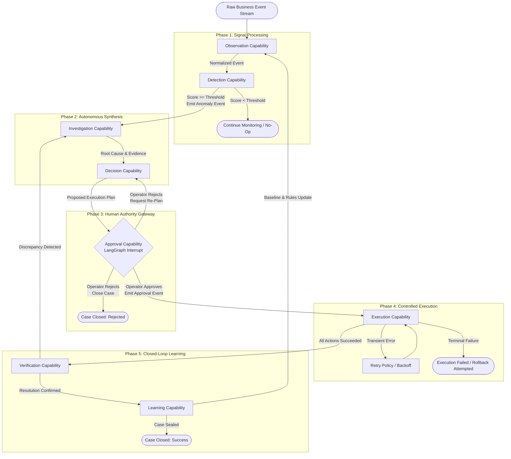

### Transition Engineering Matrix

| Transition Stage | Mandatory Input | Guaranteed Output | Decision Point / Gate | Failure Path | Recovery Guarantee |
|---|---|---|---|---|---|
| **Stream → Observation** | Raw JSON/HTTP telemetry event payload. | Validated `BusinessEvent` object. | Schema adherence check against `@sentinel/schemas`. | Dead-letter queue (DLQ) route on invalid schema. | Automatic stream consumer retry; malformed payloads isolated to DLQ. |
| **Observation → Detection** | Normalized telemetry + current operational baselines. | Anomaly candidate score + classification. | Statistical threshold comparison (`delta >= threshold`). | Log below-threshold variance; discard candidate. | Stateless computation; re-evaluates cleanly on subsequent event ingestion. |
| **Detection → Investigation** | `DetectionRecord` + newly initialized `Business Case`. | `InvestigationRecord` with verified evidence chain. | Data sufficiency check across external system tools. | Transition to manual investigation flag on tool failure. | Checkpoint preserved; automated retry of timed-out tool calls (max 3 attempts). |
| **Investigation → Decision** | Verified root cause hypothesis + evidence array. | Structured `ExecutionPlan` containing ordered actions. | Risk score evaluation against automated policy tiers. | Fallback to conservative safe-mode plan on LLM parsing error. | Strict Zod schema self-correction loop; deterministic fallback plan generation. |
| **Decision → Approval** | Structured plan + action risk classifications. | LangGraph execution state suspension checkpoint. | **Hard Gateway**: Requires explicit operator decision event. | Suspend workflow indefinitely until human action or expiry timeout. | Durable database checkpointer guarantees exact resume on process restart. |
| **Approval → Execution** | Operator approval record + approved action list. | Series of API write execution attempts. | Pre-flight authorization and system health verification. | Abort execution; trigger reverse compensation actions if partial failure occurs. | Idempotency keys (`case_id:action:seq`) prevent duplicate side effects on retry. |
| **Execution → Verification** | Completed execution records + system responses. | Empirical verification report confirming state match. | State reconciliation check against expected outcomes. | Re-open case for secondary planning if verification fails. | Verification queries are idempotent reads; safe to re-run continuously. |
| **Verification → Learning** | Verified resolution report + full case audit history. | Updated statistical baselines + `KnowledgeRecord`. | Statistical significance filter for baseline adjustment. | Skip baseline adjustment on corrupted outcome data; seal case. | Database transaction guarantees atomic write of audit log and case seal. |

---

## 7. Capability Interaction Model

The interaction between autonomous agent capabilities, real-time event infrastructure, human operators, and external enterprise systems is structured around asynchronous event publishing and durable state persistence. The sequence diagram below maps the complete operational lifecycle across all containers.

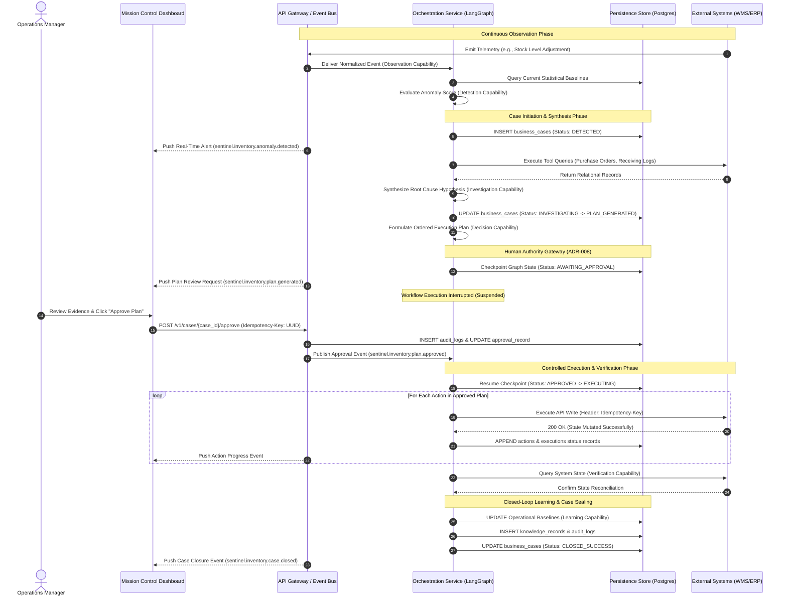

---

## 8. Capability Maturity Model

To ensure manageable implementation scope during initial deployment while establishing a clear engineering trajectory for enterprise evolution, every capability matures across four distinct architectural horizons. Progressing across horizons increases computational sophistication and operational reach without violating the Universal Capability Contract.

| Capability | MVP (Hackathon Horizon) | Version 1 (Production Core) | Version 2 (Predictive Scale) | Future (Prescriptive Enterprise) |
|---|---|---|---|---|
| **Observation** | Ingests simulated inventory event streams via polling adapters; calculates static z-score threshold variances. | Real-time webhook & event streaming connectors (Kafka/RabbitMQ) integrating live WMS/ERP feeds. | Multi-stream signal correlation across inventory, logistics, and point-of-sale transaction ledgers. | Autonomous schema discovery and self-healing data normalization across arbitrary enterprise integrations. |
| **Detection** | Single-metric statistical deviation scoring against pre-seeded baseline thresholds. | Dynamic rolling-window seasonal baseline calculations with automated outlier suppression. | Multi-variate machine learning anomaly detection models identifying subtle cross-domain pattern shifts. | Predictive leading-indicator detection flagging operational degradation weeks before physical failure occurs. |
| **Investigation** | Deterministic SQL/API tool queries against purchase order and receiving ledgers with structured LLM synthesis. | Automated multi-hop relational graph traversal connecting supplier reliability history with warehouse logs. | Probabilistic causal inference graphs quantifying exact percentage contributions of root cause variables. | Autonomous cross-enterprise investigation correlating vendor supply chain telemetry with internal breakdowns. |
| **Decision** | Prompt-engineered LLM generation of bounded 3-step execution plans validated against strict Zod schemas. | Rules-assisted LLM planning incorporating formal inventory cost constraints and safety stock policies. | Multi-objective mathematical optimization balancing working capital preservation against fulfillment velocity. | Fully prescriptive simulation modeling running thousands of Monte Carlo scenarios before plan recommendation. |
| **Approval** | Mandatory human interrupt on all execution plans via web interface; one-click approve/reject action. | Role-based authorization tiers requiring dual-approval for high-value or permanent state mutations. | Policy-gated automated approval for low-risk, highly verified routine actions based on operator trust scores. | Dynamic risk envelope negotiation where human operators manage boundary policies rather than individual cases. |
| **Execution** | Sequential API execution wrapper with deterministic idempotency keys against simulated system stores. | Distributed saga execution orchestrator with automated two-phase compensation and rollback mechanisms. | Parallel multi-system execution engine coordinating simultaneous atomic mutations across WMS, ERP, and CRM. | Self-healing execution adapters that dynamically rewrite API payloads to navigate external system version upgrades. |
| **Verification** | Simple post-execution database/API read confirming exact target stock quantity reconciliation. | Automated delay-tolerant polling verifying multi-step asynchronous batch processing in external ERPs. | Automated financial and operational ledger auditing confirming exact monetary and inventory balance match. | Continuous post-resolution health monitoring tracking entity stability over extended 30-day trailing windows. |
| **Learning** | Deterministic update of single-SKU reorder point baselines based on successful case completion. | Automated parameter tuning of anomaly detection thresholds using closed-case classification accuracy. | Automated extraction of reusable organizational knowledge graphs indexed for semantic vector retrieval. | Autonomous platform self-optimization discovering and promoting entirely new operational intervention strategies. |

---

*This document defines the architectural foundations and immutable engineering contracts governing autonomous capabilities within Sentinel OS.*

---

# Part B — Capability Specifications

This section defines every operational capability inside Sentinel OS. Each capability is an autonomous business function owning a specific domain responsibility. Capabilities communicate exclusively through Shared State, Business Events (`sentinel.<domain>.<entity>.<verb>`), and formal API Contracts. All capability definitions remain strictly implementation-independent.

---

## 9. Observation Capability

### 9.1 Executive Summary
The Observation Capability is the foundational ingestion, normalization, and signal enrichment engine of Sentinel OS. Operating continuously upstream of human intervention, it consumes unstructured and high-velocity operational telemetry across enterprise inventory, receiving ledgers, shipment feeds, and environmental sensors. It enforces strict schema normalization, timestamp synchronization, and metadata enrichment, transforming raw transactional noise into authoritative, auditable operational observations.

### 9.2 Business Purpose
Enterprise supply chain networks generate high-frequency transactional data across disparate Warehouse Management Systems (WMS), Enterprise Resource Planning (ERP) ledgers, and IoT environmental adapters. Manual monitoring or unvalidated stream consumption results in silent data corruption, timestamp drift, and unobserved stock anomalies. The Observation Capability establishes an inviolable telemetry boundary, guaranteeing 100% visibility, uniform data hygiene, and deterministic signal qualification before any downstream analytical processing occurs.

### 9.3 Mission Statement
To continuously consume, validate, timestamp-normalize, enrich, and qualify raw operational inventory and logistics telemetry streams in real time, converting raw enterprise transactions into standardized observation signals without human intervention.

### 9.4 Business Responsibilities
1. Ingest raw transactional telemetry from external WMS, ERP, logistics tracking adapters, and environmental sensor gateways.
2. Enforce syntactic and semantic schema normalization against enterprise domain contracts.
3. Synchronize and normalize heterogeneous source timestamps into UTC ISO 8601 canonical form.
4. Enrich raw signals with facility metadata, SKU categorization, and supplier hierarchy identifiers.
5. Evaluate telemetry quality and assign observation confidence gradings.
6. Publish normalized observation events to the enterprise event bus.
7. Quarantine malformed or unprocessable telemetry payloads into diagnostic dead-letter storage.

### 9.5 Capability Boundaries
- **Inclusion**: Stream consumption, schema validation, unit conversion, timestamp alignment, metadata lookup enrichment, quality scoring, and event emission.
- **Exclusion**: Statistical baseline modeling, anomaly detection thresholds, root cause diagnosis, business case creation, and external system write mutations.

### 9.6 Inputs
| Input Field | Data Type | Source | Mandatory | Description |
|---|---|---|---|---|
| `raw_event_id` | UUID | Stream Adapter | Yes | Unique identifier generated by the telemetry ingestion adapter. |
| `source_system` | String | Stream Adapter | Yes | Originating system identifier (e.g., `WMS-CORP-01`, `ERP-SAP-PROD`). |
| `event_type` | String | Stream Adapter | Yes | Raw event categorization identifier. |
| `source_timestamp` | String | External System | Yes | Original timestamp reported by the external source system. |
| `facility_code` | String | External System | Yes | Physical location or warehouse alphanumeric code. |
| `item_code` | String | External System | Yes | Stock Keeping Unit or manufacturer part number. |
| `quantity_raw` | Numeric | External System | Yes | Transactional or snapshot quantity value reported. |
| `unit_of_measure` | String | External System | Yes | Unit identifier (`EA`, `PLT`, `CS`, `KG`). |
| `transaction_class` | String | External System | Yes | Classification enum (`RECEIPT`, `SHIPMENT`, `ADJUSTMENT`, `COUNT`). |
| `trace_context` | UUID | Client / Adapter | Yes | Distributed tracing correlation identifier. |

### 9.7 Outputs
| Output Field | Data Type | Destination | Nullable | Description |
|---|---|---|---|---|
| `observation_id` | UUID | Event Bus | No | Authoritative primary key assigned to the normalized observation. |
| `warehouse_id` | UUID | Event Bus | No | Normalized internal facility primary key reference. |
| `sku_id` | String | Event Bus | No | Normalized internal item identifier reference. |
| `observed_metric` | Numeric | Event Bus | No | Standardized effective quantity expressed in base units (`EA`). |
| `observation_quality` | Numeric | Event Bus | No | Quality confidence grade ranging from `0.00` to `1.00`. |
| `normalized_timestamp` | ISO 8601 UTC | Event Bus | No | Standardized UTC timestamp representing physical occurrence. |
| `enrichment_metadata` | JSON Object | Event Bus | No | Attached facility timezone, item velocity tier, and supplier ID. |

### 9.8 Shared State Reads
| State Entity | Read Scope | Purpose |
|---|---|---|
| `FacilityRegistry` | Active warehouse identity mapping | Resolve `facility_code` to primary `warehouse_id` and timezone attributes. |
| `ItemMasterCatalog` | Active SKU dimensional and base unit rules | Convert packaging units (`PLT`, `CS`) to canonical base units (`EA`). |

### 9.9 Shared State Writes
- None. The Observation Capability is strictly stateless regarding persistent domain aggregates. It does not mutate domain entities or lifecycle states.

### 9.10 Business Events Consumed
| Event Name | Source System | Payload Schema | Trigger Condition |
|---|---|---|---|
| `sentinel.telemetry.inventory.raw_stream` | WMS Ingestion Gateway | `RawInventoryTelemetryPayload` | Continuous stream emission upon any warehouse stock ledger mutation. |
| `sentinel.telemetry.logistics.shipment_stream` | Carrier Integration Gateway | `RawShipmentTelemetryPayload` | Inbound receipt or outbound dock departure notification. |

### 9.11 Business Events Published
| Event Name | Destination | Payload Schema | Trigger Condition |
|---|---|---|---|
| `sentinel.inventory.observation.recorded` | Event Bus | `ObservationRecordedPayload` | Successful validation, normalization, and quality scoring of telemetry event. |

### 9.12 Database Reads
| Table / View | Access Pattern | Index Strategy | Rationale |
|---|---|---|---|
| `warehouses` | Point lookup by `facility_code` | Unique B-tree index on `code` | Retrieve internal UUID and operational verification flags. |
| `skus` | Point lookup by `item_code` | Unique B-tree index on `sku_code` | Retrieve conversion multiplier and item active status. |

### 9.13 Database Writes
| Table Name | Operation | Transaction Scope | Rationale |
|---|---|---|---|
| `dlq_telemetry_events` | INSERT | Autonomous single-row commit | Archive unprocessable raw payloads with diagnostic failure codes for audit. |

### 9.14 External Systems
| System Name | Protocol / Interface | Interaction Type | Data Exchanged |
|---|---|---|---|
| Enterprise WMS Event Stream | Asynchronous Message Consumer | Read-Only Stream | Stock level adjustments, receiving ledger receipts, dock count snapshots. |
| Enterprise ERP Inventory Feed | Asynchronous Webhook Gateway | Read-Only Ingestion | Sales order stock allocations, return-to-vendor ledger updates. |

### 9.15 Internal Workflow
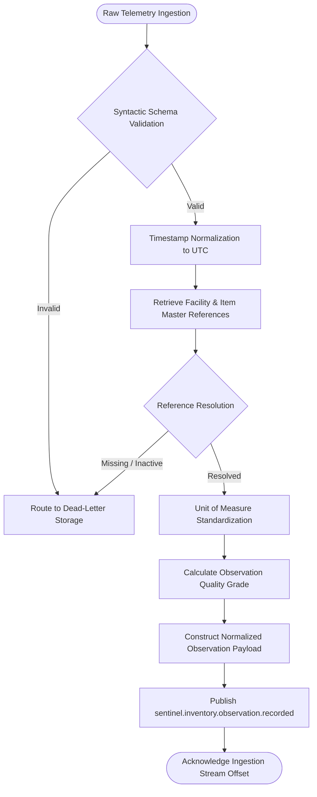

### 9.16 Decision Logic
1. **Timestamp Normalization**: Parse `source_timestamp` across RFC 2822, Epoch milliseconds, and non-UTC ISO formats. Convert to canonical UTC. If drift relative to current ingestion platform clock exceeds $\pm 24\text{ hours}$, mark payload stale (`quality < 0.50`).
2. **Unit Conversion**: Interrogate `ItemMasterCatalog` unit conversion multiplier ($M$). Compute $Q_{base} = \text{quantity\_raw} \times M$.
3. **Quality Scoring Equation**:
   $$Q_{obs} = w_1 \cdot V_{schema} + w_2 \cdot V_{time} + w_3 \cdot V_{ref}$$
   Where $V_{schema} = 1.0$ (syntactically valid), $V_{time} = 1.0$ if drift $\le 60\text{s}$ (linear degradation to $0.0$ at $86,400\text{s}$), and $V_{ref} = 1.0$ if facility and SKU records are active. If $Q_{obs} < 0.60$, event is flagged for diagnostic review.

### 9.17 Tool Requirements
- Stateless programmatic computation utilities only. Does not invoke external reasoning tools or remote procedure call executors.

### 9.18 Prompt Contract
- *Not Applicable*. Algorithmic normalization and enrichment engine operating without natural language prompts.

### 9.19 Structured Output Contract
- All emitted events must conform to `ObservationRecordedPayloadSchema`. Strict runtime enforcement guarantees non-null `observation_id`, valid UUID formatting, and bounded numerical ranges for `observation_quality`.

### 9.20 Validation Rules
| Rule Identifier | Target Attribute | Evaluation Criterion | Violation Outcome |
|---|---|---|---|
| `VAL-OBS-01` | `raw_event_id` | Must conform to RFC 4122 UUID structure. | Deterministic rejection to DLQ (`ERR_MALFORMED_ID`). |
| `VAL-OBS-02` | `quantity_raw` | Must be finite numerical value within domain bounds ($-10^7 \le Q \le 10^7$). | Deterministic rejection to DLQ (`ERR_OUT_OF_BOUNDS`). |
| `VAL-OBS-03` | `unit_of_measure` | Must exist in registered enterprise measurement taxonomy. | Deterministic rejection to DLQ (`ERR_UNKNOWN_UOM`). |

### 9.21 Success Criteria
- 100% of syntactically and semantically valid raw events transformed into canonical observation payloads, enriched with reference master data, and published to the event bus within bounded latency targets.

### 9.22 Failure Modes
| Failure Identifier | Description | Classification | Trigger Condition | Rollback / Recovery Action |
|---|---|---|---|---|
| `FAIL-OBS-01` | Reference Store Timeout | Transient | Database lookup latency for warehouse/SKU exceeds 400ms. | Abort evaluation; do not acknowledge stream offset; execute exponential backoff retry. |
| `FAIL-OBS-02` | Malformed Payload Serialization | Deterministic | Ingested stream byte array fails JSON syntax parsing. | Write raw bytes to DLQ; acknowledge stream offset to prevent head-of-line blocking. |
| `FAIL-OBS-03` | Event Bus Broker Unavailable | Transient | Socket connection refused on outbound event publication. | Retain normalized observation in local memory buffer; execute retry policy up to ceiling. |

### 9.23 Retry Strategy
- **Transient Failures (`FAIL-OBS-01`, `FAIL-OBS-03`)**:
  - Maximum Attempt Count: `3`
  - Initial Backoff Interval: `100ms`
  - Exponential Multiplier Factor: `2.0`
  - Random Jitter Allowance: `±20ms`
- **Deterministic Failures (`FAIL-OBS-02`)**: Zero retry attempts permitted. Immediate dead-letter archiving.

### 9.24 Timeout Strategy
- Reference Master Database Lookup Ceiling: `400ms`.
- Outbound Event Bus Publication Ceiling: `200ms`.
- End-to-End Capability Execution Ceiling: `800ms`.

### 9.25 Human Approval Rules
- Fully autonomous stream processing. No human operational checkpoints or authorization barriers exist within the Observation Capability.

### 9.26 Security Requirements
- Ingestion stream adapters must authenticate via mutual TLS (mTLS) certificates or verify HMAC SHA-256 cryptographic payload signatures.
- Database read operations execute under an isolated database role (`obs_reader_role`) granted `SELECT`-only privileges on reference tables.

### 9.27 Audit Requirements
- Every payload rejected to dead-letter storage must capture the exact raw byte stream, ingestion timestamp, adapter identity, and structured failure classification code.

### 9.28 Observability
- Real-time stream processing dashboards displaying ingestion throughput, validation failure rates, reference resolution latency, and dead-letter accumulation.

### 9.29 Performance Targets
- Sustained Ingestion Throughput: $\ge 5,000\text{ events/second}$ per processing node.
- P99 End-to-End Processing Latency: $\le 50\text{ milliseconds}$.

### 9.30 Metrics
| Metric Identifier | Metric Type | Dimensional Labels | Description |
|---|---|---|---|
| `sentinel_obs_events_ingested_total` | Monotonic Counter | `source_system`, `event_type` | Total volume of raw telemetry events received from stream adapters. |
| `sentinel_obs_validation_failures_total` | Monotonic Counter | `error_code`, `source_system` | Total volume of events rejected due to schema or validation breaches. |
| `sentinel_obs_observations_emitted_total` | Monotonic Counter | `warehouse_id`, `quality_tier` | Total volume of normalized observations published to event bus. |
| `sentinel_obs_processing_latency_seconds` | Histogram | `status` (`success`/`failure`) | Execution latency distribution from stream ingestion to event publication. |

### 9.31 Logging Requirements
Every invocation must emit exactly one structured JSON log record containing: `timestamp`, `log_level`, `trace_context`, `raw_event_id`, `observation_id`, `warehouse_id`, `sku_id`, `observation_quality`, `execution_latency_ms`, and `outcome_status`.

### 9.32 Traceability
- Propagates inbound `trace_context` UUID into all outbound event headers and database audit entries, maintaining distributed trace integrity across system boundaries.

### 9.33 Error Recovery
- In the event of persistent stream consumption failure, processing nodes detach from consumer groups without committing offsets, allowing peer cluster instances to rebalance partition assignments safely.

### 9.34 Future Evolution
- Integration of edge-computing stream pre-filtering nodes deployed directly inside physical warehouse facilities to perform local unit normalization prior to WAN transmission.

### 9.35 Related ADRs
- `ADR-003` (Event-Driven Domain Architecture), `ADR-007` (Capability Anti-Corruption Layers), `ADR-012` (Canonical Schema Enforcement).

### 9.36 Architectural Diagrams (Observation Capability)

#### Sequence Diagram
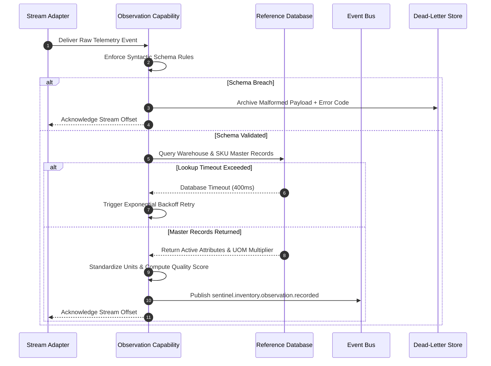

#### State Diagram
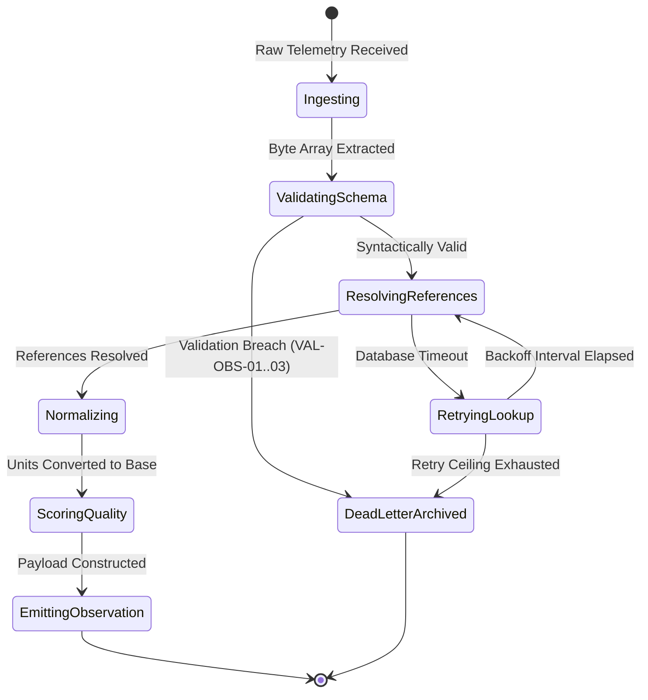

#### Lifecycle Diagram
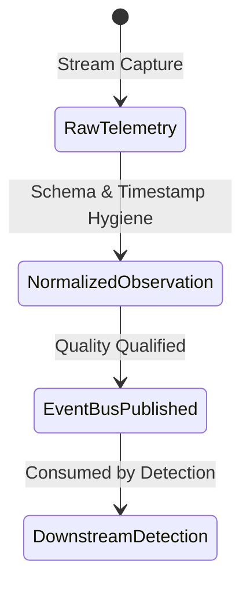

#### Dependency Diagram
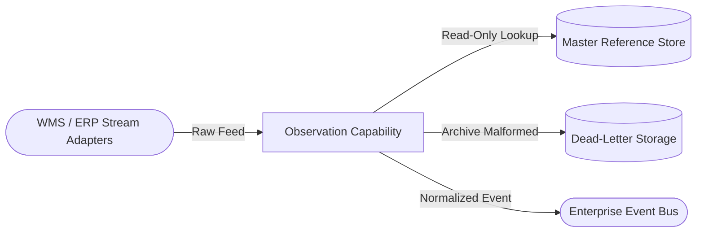

---

## 10. Detection Capability

### 10.1 Executive Summary
The Detection Capability operates as the analytical anomaly triage and case instantiation engine of Sentinel OS. It consumes normalized observation streams, evaluates inventory levels against rolling statistical baselines, suppresses duplicate alerts, and instantiates authoritative `Business Case` aggregates within the persistent database layer. It establishes the formal lifecycle narrative for every detected operational risk.

### 10.2 Business Purpose
Unfiltered stream observations generate immense alert noise, obscuring genuine operational degradation. Without rigorous deduplication and statistical scoring, operations managers face severe alert fatigue. The Detection Capability acts as an autonomous triage sentinel, isolating statistically verified anomalies, deduplicating repetitive observations over 24-hour windows, and creating formal, auditable Business Cases that anchor all subsequent investigation and remediation.

### 10.3 Mission Statement
To evaluate normalized observation streams against operational statistical baselines, calculate anomaly severity and confidence scoring, suppress duplicate signals, and instantiate authoritative Business Case aggregates to initiate structured lifecycle management.

### 10.4 Business Responsibilities
1. Consume `sentinel.inventory.observation.recorded` events from the enterprise event bus.
2. Retrieve rolling statistical baselines (`mean`, `stddev`, `safety_stock`) for the affected item and facility.
3. Calculate statistical deviation ($z$-score) and projected stockout depletion timelines.
4. Interrogate active database records to detect and suppress duplicate anomaly signals across trailing 24-hour windows.
5. Classify anomaly types (`STOCKOUT_RISK`, `RECEIVING_DISCREPANCY`, `UNEXPLAINED_VARIANCE`, `SUPPLIER_DELAY`).
6. Instantiate formal `Business Case` aggregate roots within PostgreSQL (`business_cases` table) with status `DETECTED`.
7. Initialize the case narrative timeline (`case_timeline`) and immutable audit log (`audit_logs`).
8. Publish `sentinel.inventory.anomaly.detected` events carrying the authoritative `case_id`.

### 10.5 Capability Boundaries
- **Inclusion**: Statistical variance calculation, severity grading, confidence evaluation, active case deduplication, aggregate root database insertion, timeline initialization, and anomaly event emission.
- **Exclusion**: Multi-hop root cause diagnosis, external vendor communication, remediation planning, human approval routing, and external API execution.

### 10.6 Inputs
| Input Field | Data Type | Source | Mandatory | Description |
|---|---|---|---|---|
| `observation_id` | UUID | Observation Event | Yes | Reference identifier from upstream normalization. |
| `warehouse_id` | UUID | Observation Event | Yes | Facility primary key reference. |
| `sku_id` | String | Observation Event | Yes | Item master reference code. |
| `observed_metric` | Numeric | Observation Event | Yes | Current standardized stock quantity balance reported. |
| `observation_quality` | Numeric | Observation Event | Yes | Upstream telemetry quality confidence grade. |
| `normalized_timestamp` | ISO 8601 UTC | Observation Event | Yes | Canonical event timestamp. |
| `trace_context` | UUID | Event Header | Yes | Distributed tracing correlation identifier. |

### 10.7 Outputs
| Output Field | Data Type | Destination | Nullable | Description |
|---|---|---|---|---|
| `case_id` | UUID | Database / Bus | No | Authoritative Business Case primary key generated by Detection. |
| `public_id` | String | Database / Bus | No | Human-readable alphanumeric identifier (`CASE-000104`). |
| `domain` | String | Database Column | No | Domain literal classification (`INVENTORY`). |
| `status` | String | Database Column | No | Initial lifecycle state assignment (`DETECTED`). |
| `anomaly_type` | String | Database / Bus | No | Classified anomaly enum string (`STOCKOUT_RISK`). |
| `severity` | String | Database / Bus | No | Assessed risk tier (`LOW`, `MEDIUM`, `HIGH`, `CRITICAL`). |
| `detection_confidence` | Numeric | Database / Bus | No | Statistical detection confidence score (`0.00` to `1.00`). |
| `baseline_delta` | Numeric | Database / Bus | No | Absolute variance (`observed_metric - baseline_mean`). |

### 10.8 Shared State Reads
| State Entity | Read Scope | Purpose |
|---|---|---|
| `OperationalBaselines` | Statistical parameters for `(warehouse_id, sku_id)` | Retrieve 30-day rolling mean ($\mu$), standard deviation ($\sigma$), and safety stock. |
| `ActiveBusinessCases` | Existing cases matching facility and SKU | Verify absence of open duplicate cases across trailing 24 hours. |

### 10.9 Shared State Writes
| State Entity | Write Scope | Purpose |
|---|---|---|
| `BusinessCaseAggregate` | New row insertion in `business_cases` | Establish authoritative ownership of new operational problem lifecycle. |
| `CaseTimeline` | New row insertion in `case_timeline` | Record initial `CASE_CREATED` milestone narrative. |
| `AuditLog` | New row insertion in `audit_logs` | Create immutable system creation trail. |

### 10.10 Business Events Consumed
| Event Name | Source System | Payload Schema | Trigger Condition |
|---|---|---|---|
| `sentinel.inventory.observation.recorded` | Observation Capability | `ObservationRecordedPayload` | Emitted upon successful stream normalization. |

### 10.11 Business Events Published
| Event Name | Destination | Payload Schema | Trigger Condition |
|---|---|---|---|
| `sentinel.inventory.anomaly.detected` | Event Bus | `AnomalyDetectedPayload` | Successful atomic commit of new `business_cases` aggregate root. |

### 10.12 Database Reads
| Table / View | Access Pattern | Index Strategy | Rationale |
|---|---|---|---|
| `operational_baselines` | Point lookup by `(warehouse_id, sku_id)` | Composite B-tree index on `(warehouse_id, sku_id)` | Retrieve Gaussian parameters for statistical comparison. |
| `business_cases` | Range scan on `warehouse_id` and JSONB SKU containment | Partial unique B-tree index on open cases | Enforce duplicate suppression algorithm. |

### 10.13 Database Writes
| Table Name | Operation | Transaction Scope | Rationale |
|---|---|---|---|
| `business_cases` | INSERT | Atomic Multi-Table Transaction | Persist core aggregate root state (`status: DETECTED`). |
| `case_timeline` | INSERT | Atomic Multi-Table Transaction | Append plain-language initiation narrative. |
| `audit_logs` | INSERT | Atomic Multi-Table Transaction | Record non-bypassable system audit event. |

### 10.14 External Systems
- None directly. Operates strictly across internal database boundaries and the enterprise event bus.

### 10.15 Internal Workflow
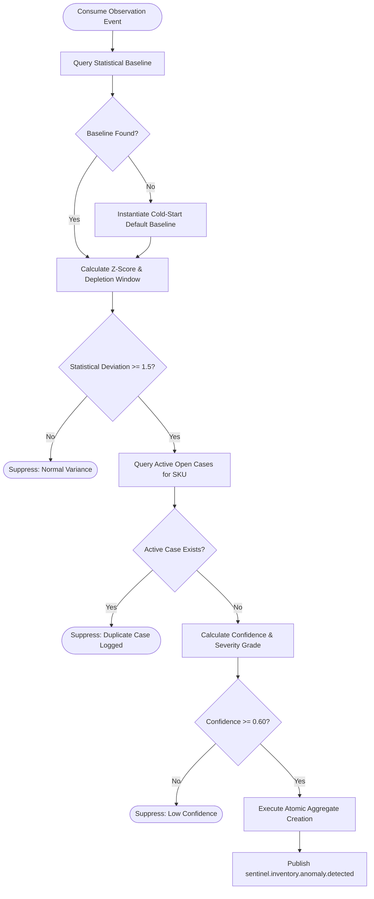

### 10.16 Decision Logic
1. **Statistical Variance Calculation**:
   $$z = \frac{x_{observed} - \mu_{baseline}}{\sigma_{baseline}}$$
   If $|z| < 1.5$ and $x_{observed} > \text{safety\_stock}$, classify as normal operational variance and suppress.
2. **Duplicate Suppression Rule**:
   Execute SQL lookup against `business_cases` where `warehouse_id = :w` and `affected_entities @> '[{"sku_id": ":s"}]'` and `status NOT IN ('CLOSED_SUCCESS', 'CLOSED_REJECTED', 'CLOSED_FAILED')`. If row count $\ge 1$, suppress candidate to prevent concurrent duplicate investigation loops.
3. **Severity Grading Matrix**:
   - $|z| \ge 4.0$ OR Depletion Window $\le 4\text{ hours}$ $\rightarrow$ **CRITICAL**
   - $3.0 \le |z| < 4.0$ OR Depletion Window $\le 12\text{ hours}$ $\rightarrow$ **HIGH**
   - $2.0 \le |z| < 3.0$ $\rightarrow$ **MEDIUM**
   - $1.5 \le |z| < 2.0$ $\rightarrow$ **LOW**

### 10.17 Tool Requirements
- Stateless mathematical evaluation engine only. Does not execute external API tools or LLM inference.

### 10.18 Prompt Contract
- *Not Applicable*. Deterministic statistical classification engine.

### 10.19 Structured Output Contract
- All database mutations must conform to SQLAlchemy aggregate models. Published events must validate against `AnomalyDetectedPayloadSchema`, enforcing valid UUID structures for `case_id`.

### 10.20 Validation Rules
| Rule Identifier | Target Attribute | Evaluation Criterion | Violation Outcome |
|---|---|---|---|
| `VAL-DET-01` | Calculated $z$-score | Absolute value must be $\ge 1.50$ or stock $\le$ safety threshold. | Suppress event creation (`ERR_INSUFFICIENT_VARIANCE`). |
| `VAL-DET-02` | SKU Active Case Status | Target SKU must possess zero active open cases in facility. | Suppress duplicate creation (`ERR_DUPLICATE_SUPPRESSED`). |
| `VAL-DET-03` | `detection_confidence` | Calculated score must be $\ge 0.60$. | Suppress low confidence candidate (`ERR_LOW_CONFIDENCE`). |

### 10.21 Success Criteria
- Atomic persistence of exactly one new `business_cases` row with accompanying timeline and audit records, followed by guaranteed event emission to initiate the Investigation phase.

### 10.22 Failure Modes
| Failure Identifier | Description | Classification | Trigger Condition | Rollback / Recovery Action |
|---|---|---|---|---|
| `FAIL-DET-01` | Concurrent Duplicate Insertion | Deterministic | Race condition triggering Postgres unique index violation (`23505`). | Intercept database exception; convert to duplicate suppression audit log; acknowledge message. |
| `FAIL-DET-02` | Aggregate Transaction Deadlock | Transient | Multi-table insert deadlock during peak concurrent anomaly spikes. | Rollback SQL transaction; execute backoff retry up to policy ceiling. |
| `FAIL-DET-03` | Sequence Lookup Failure | Transient | Database sequence generator failure during `public_id` assignment. | Abort transaction; execute backoff retry. |

### 10.23 Retry Strategy
- **Transient Failures (`FAIL-DET-02`, `FAIL-DET-03`)**:
  - Maximum Attempt Count: `3`
  - Initial Backoff Interval: `200ms`
  - Exponential Multiplier Factor: `2.0`
  - Random Jitter Allowance: `±50ms`
- **Deterministic Failures (`FAIL-DET-01`)**: Zero retry attempts permitted. Treated as successful deduplication.

### 10.24 Timeout Strategy
- Deduplication Query Ceiling: `300ms`.
- Multi-Table Atomic Transaction Ceiling: `750ms`.
- End-to-End Capability Execution Ceiling: `1500ms`.

### 10.25 Human Approval Rules
- Autonomous case creation. Surfaced immediately to operations staff via real-time WebSocket feed in Mission Control upon commit.

### 10.26 Security Requirements
- Executes under dedicated database role (`det_writer_role`) authorized for `SELECT`, `INSERT`, and `UPDATE` on case tables. Zero `DELETE` permissions granted.

### 10.27 Audit Requirements
- Every created case must append an immutable row to `audit_logs` capturing actor `detect_agent`, timestamp, and full initial JSONB state snapshot.

### 10.28 Observability
- Real-time telemetry tracking candidate evaluations, duplicate suppression ratios, severity classification breakdown, and case creation transaction latencies.

### 10.29 Performance Targets
- Sustained Anomaly Evaluation Rate: $\ge 1,000\text{ observations/second}$.
- P99 Case Instantiation Transaction Latency: $\le 100\text{ milliseconds}$.

### 10.30 Metrics
| Metric Identifier | Metric Type | Dimensional Labels | Description |
|---|---|---|---|
| `sentinel_det_candidates_evaluated_total` | Monotonic Counter | `warehouse_id` | Total observation signals evaluated for anomaly criteria. |
| `sentinel_det_suppressions_total` | Monotonic Counter | `reason` (`duplicate`/`low_variance`/`low_confidence`) | Count of observations suppressed from case instantiation. |
| `sentinel_det_cases_instantiated_total` | Monotonic Counter | `anomaly_type`, `severity` | Total authoritative Business Cases created. |
| `sentinel_det_transaction_latency_seconds` | Histogram | `status` | Duration distribution of atomic database creation transactions. |

### 10.31 Logging Requirements
Structured JSON completion log must capture: `timestamp`, `log_level`, `trace_context`, `observation_id`, `case_id` (if created), `sku_id`, `z_score`, `severity`, `suppression_reason` (if suppressed), and `execution_latency_ms`.

### 10.32 Traceability
- Links inbound `observation_id` directly into `business_cases.detection_record` and propagates `trace_context` into downstream anomaly detection events.

### 10.33 Error Recovery
- Upon database connection loss, message consumers pause ingestion without dropping stream offsets, resuming automatically when connection pool health is restored.

### 10.34 Future Evolution
- Multi-item anomaly clustering where simultaneous stock drops across bill-of-materials components are aggregated into a single parent master case.

### 10.35 Related ADRs
- `ADR-004` (Business Case Aggregate Root), `ADR-008` (Human Approval Gateway Pre-requisites), `ADR-012` (Canonical Schema Enforcement).

### 10.36 Architectural Diagrams (Detection Capability)

#### Sequence Diagram
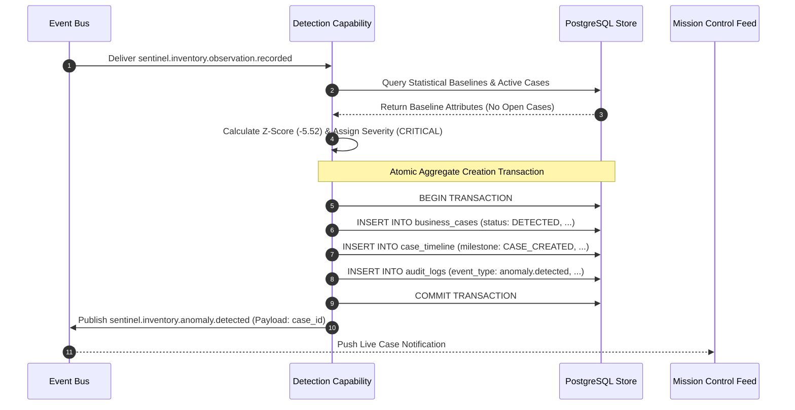

#### State Diagram
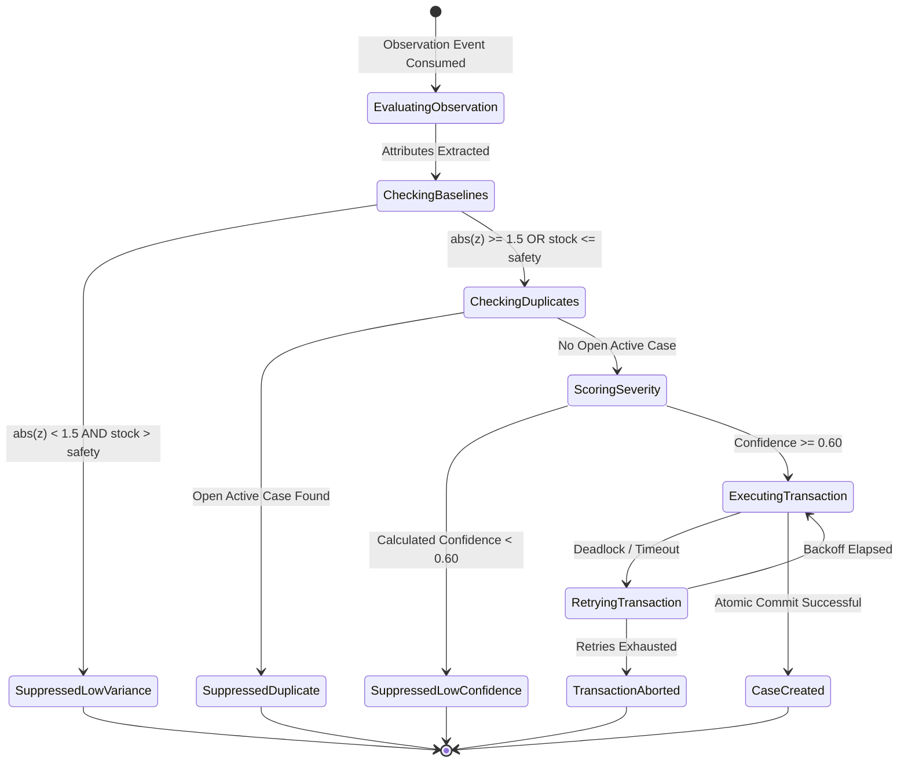

#### Lifecycle Diagram
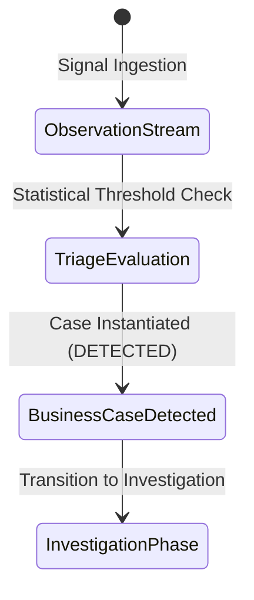

#### Dependency Diagram
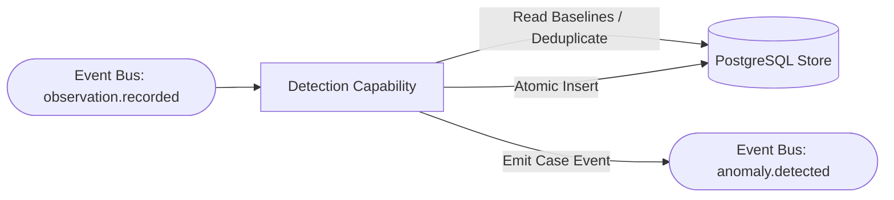

---
*End of Observation and Detection Capability Specifications.*

