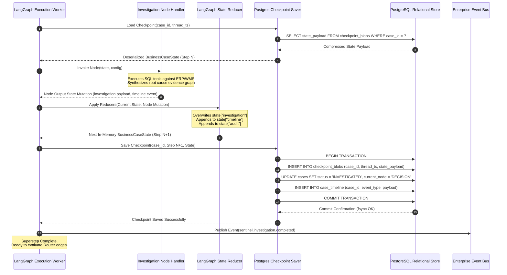
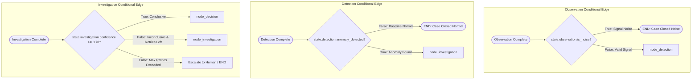
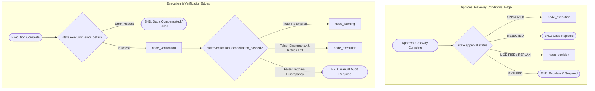
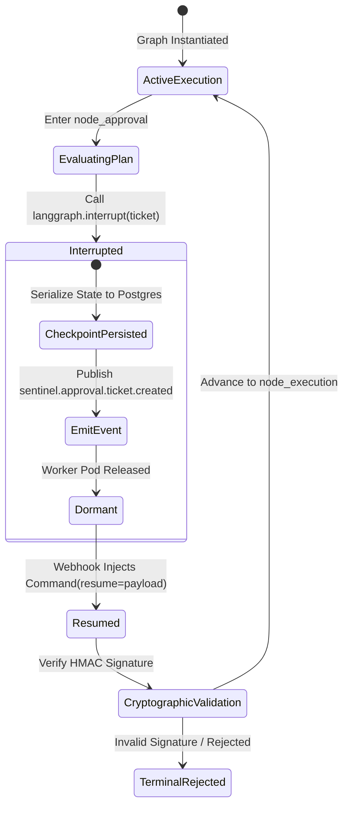
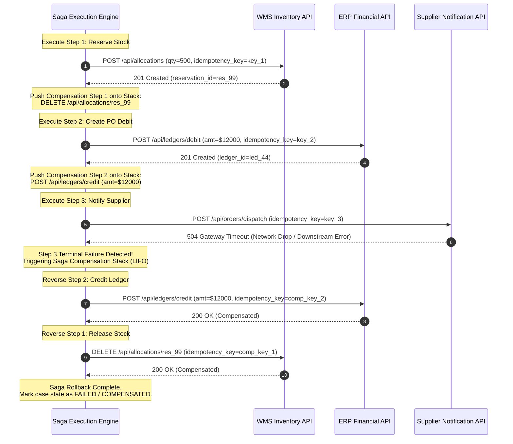
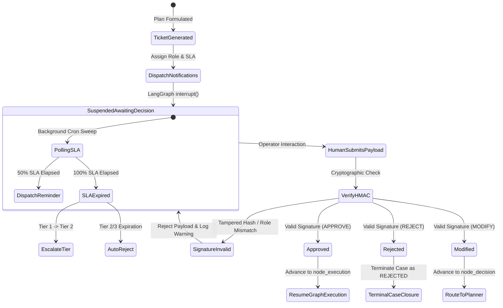
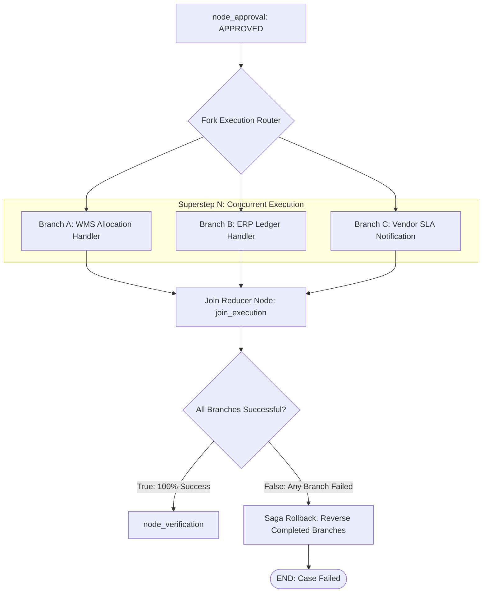
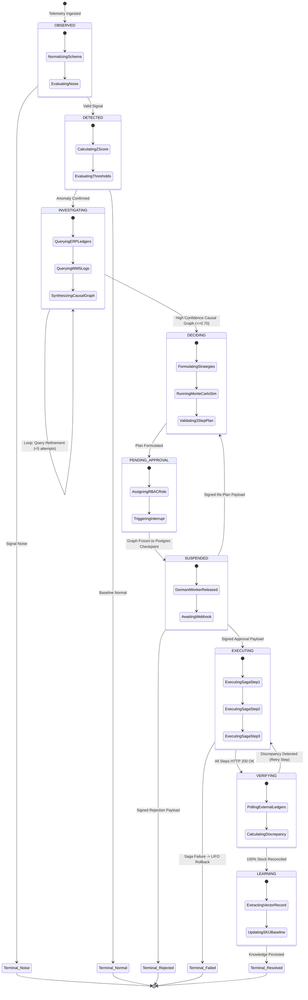

# Sentinel OS — Workflow Engine & LangGraph Execution Architecture

> **Document Class:** Definitive Engineering & Systems Architecture Specification  
> **Audience:** Senior Backend Engineers, AI Systems Engineers, Platform Architects, LangGraph Core Developers, and Site Reliability Engineers  
> **Status:** Authoritative — Version 1.0  
> **Last Updated:** 2026-07-03  
> **Parent Documents:**  
> - [00_MASTER_CONTEXT.md](./00_MASTER_CONTEXT.md)  
> - [01_PROJECT_VISION.md](./01_PROJECT_VISION.md)  
> - [03_ARCHITECTURE.md](./03_ARCHITECTURE.md)  
> - [04_DATABASE.md](./04_DATABASE.md)  
> - [05_API_SPEC.md](./05_API_SPEC.md)  
> - [06_CAPABILITY_SPECIFICATIONS.md](./06_CAPABILITY_SPECIFICATIONS.md)  
> - [15_ARCHITECTURE_DECISIONS.md](../adr/15_ARCHITECTURE_DECISIONS.md)  
>  
> **Binding Architecture Decisions:** ADR-001 (Micro-Modular Monolith), ADR-002 (Domain-Driven Design), ADR-004 (Event-Driven Architecture), ADR-005 (LangGraph Orchestration Kernel), ADR-006 (Human-in-the-Loop Mandatory Approval), ADR-007 (Deterministic Capability Contracts), ADR-008 (PostgreSQL State Persistence), ADR-009 (Append-Only Audit & Timeline), ADR-012 (Idempotent External Side Effects), ADR-013 (Saga Pattern Compensation), ADR-014 (OpenTelemetry Distributed Tracing)

---

## Table of Contents

1. [Executive Summary](#1-executive-summary)
2. [Workflow Philosophy](#2-workflow-philosophy)
3. [High-Level Workflow Architecture](#3-high-level-workflow-architecture)
4. [BusinessCaseState Specification](#4-businesscasestate-specification)
5. [Workflow Nodes Specification](#5-workflow-nodes-specification)
6. [Routing Rules & Conditional Edges](#6-routing-rules--conditional-edges)
7. [LangGraph Interrupts & Human Intervention](#7-langgraph-interrupts--human-intervention)
8. [Durable Checkpointing Architecture](#8-durable-checkpointing-architecture)
9. [Retry Framework & Fault Tolerance](#9-retry-framework--fault-tolerance)
10. [Compensation Engine & Saga Orchestration](#10-compensation-engine--saga-orchestration)
11. [Failure Recovery & Exception Matrices](#11-failure-recovery--exception-matrices)
12. [Event Lifecycle & Event-Driven Orchestration](#12-event-lifecycle--event-driven-orchestration)
13. [Human Approval Lifecycle & Gateway Mechanics](#13-human-approval-lifecycle--gateway-mechanics)
14. [Parallel Execution & Fork-Join Synchrony](#14-parallel-execution--fork-join-synchrony)
15. [Complete Workflow State Machine](#15-complete-workflow-state-machine)
16. [Observability, Telemetry & Distributed Tracing](#16-observability-telemetry--distributed-tracing)
17. [Testing Strategy & Deterministic Verification](#17-testing-strategy--deterministic-verification)
18. [Future Evolution & Architectural Horizon](#18-future-evolution--architectural-horizon)

---

## 1. Executive Summary

### 1.1 Purpose of the Sentinel OS Workflow Engine
The **Sentinel OS Workflow Engine** is the deterministic execution kernel responsible for orchestrating autonomous operational problem-solving across complex enterprise environments. Operating continuously within an enterprise's operational stream, the engine manages the end-to-end lifecycle of every business anomaly—from initial telemetry observation to root-cause investigation, action planning, human governance, external system mutation, verification, and organizational learning.

Unlike traditional workflow engines (such as Airflow or Luigi) that coordinate batch ETL tasks, or standard microservice choreographers that simply route RPCs, the Sentinel OS Workflow Engine marries **probabilistic AI cognitive reasoning** with **rigorous, transactional state machine orchestration**. It provides the mathematical and structural boundary that transforms non-deterministic Large Language Model (LLM) inference into an auditable, ACID-compliant, and fail-safe enterprise system of record.

### 1.2 The Deterministic Imperative
In mission-critical enterprise domains—such as inventory management, procurement ledgers, and supply chain fulfillment—unbounded autonomous AI represents an uninsurable operational hazard. Allowing an autonomous agent to freely generate sub-goals, recursively execute code, or perform unconstrained API mutations introduces catastrophic risks: infinite loops, state corruption, phantom financial transactions, and unexplainable operational failures.

The Sentinel OS Workflow Engine strictly rejects monolithic agentic loops. Instead, it mandates that **all AI reasoning must execute within fixed, deterministic workflow boundaries**. The progression of a business case through the system is governed entirely by formal graph topology, explicit conditional routing edges, and immutable state schemas. AI models are invoked strictly as functional units inside dedicated graph nodes; they receive structured input state, perform cognitive synthesis, and yield validated output mutations. The engine—not the LLM—decides whether a node succeeded, where the execution flows next, and whether external side effects are permitted.

### 1.3 Relationship with LangGraph
The Sentinel OS Workflow Engine is architected directly upon **LangGraph**, leveraging its underlying state graph execution engine, superstep coordination model, and native checkpointing interfaces (ADR-005). 

```
+-----------------------------------------------------------------------------------+
|                              SENTINEL OS WORKFLOW ENGINE                          |
|                                                                                   |
|  +-----------------------------------------------------------------------------+  |
|  |                           Business Case Aggregate Root                      |  |
|  |  [Case Identity] [Shared State] [Domain Events] [Timeline] [Audit Digest]   |  |
|  +-----------------------------------------------------------------------------+  |
|                                         |                                         |
|                                         v                                         |
|  +-----------------------------------------------------------------------------+  |
|  |                            LangGraph StateGraph Engine                      |  |
|  |                                                                             |  |
|  |   +-------------+       +---------------+       +-----------------------+   |  |
|  |   | Superstep   | ----> | State Reducer | ----> | Checkpoint Persister  |   |  |
|  |   | Coordinator |       | (Immutable)   |       | (PostgreSQL Adapter)  |   |  |
|  |   +-------------+       +---------------+       +-----------------------+   |  |
|  +-----------------------------------------------------------------------------+  |
|                                         |                                         |
|                                         v                                         |
|  +-----------------------------------------------------------------------------+  |
|  |                     Isolated Capability Workflow Nodes                      |  |
|  |                                                                             |  |
|  |  [Observation] -> [Detection] -> [Investigation] -> [Decision] -> [Approval]|  |
|  |                                                                        |       |  |
|  |  [Learning] <-- [Verification] <------------------ [Execution] <-------+       |  |
|  +-----------------------------------------------------------------------------+  |
+-----------------------------------------------------------------------------------+
```

LangGraph provides three foundational primitives that Sentinel OS extends into an enterprise-grade kernel:
1. **StateGraph**: Defines the formal Directed Cyclic Graph (DCG) whose nodes represent autonomous domain capabilities and whose edges represent deterministic conditional transitions.
2. **Superstep Execution Engine**: Enforces strict bulk synchronous parallel execution. Within a superstep, nodes execute concurrently or sequentially, but state updates are only merged via formal reduction channels at superstep boundaries.
3. **Durable Checkpointers (`BaseCheckpointSaver`)**: Intercepts every superstep transition to serialize and persist the complete graph state to PostgreSQL before acknowledging execution progress, ensuring zero-data-loss crash recovery.

### 1.4 Relationship with the Business Case Aggregate Root
In Sentinel OS Domain-Driven Design (ADR-002), the **Business Case (`BusinessCase`)** is the core Aggregate Root. The Workflow Engine acts as the exclusive orchestrator and lifecycle custodian of this aggregate.

The LangGraph shared state (`BusinessCaseState`) represents the exact in-memory projection of the Business Case aggregate. No workflow node is permitted to bypass the engine to mutate database tables directly. Instead, nodes mutate structured keys within `BusinessCaseState`. At the conclusion of each execution superstep, the Workflow Engine's state persister synchronizes these state mutations into the relational PostgreSQL schema (`cases`, `case_timeline`, `audit_logs`, `knowledge_records`), guaranteeing exact transactional alignment between the running graph state and the database system of record.

---

## 2. Workflow Philosophy

The Sentinel OS Workflow Engine is designed around ten non-negotiable architectural commandments. These principles govern every line of orchestration code, every node definition, and every recovery mechanism.

### 2.1 Deterministic Execution
While LLM inference produces probabilistic token distributions, workflow orchestration must remain 100% deterministic. Given an identical starting checkpoint state and an identical sequence of external inputs, the Workflow Engine must traverse the exact same graph edges, execute the exact same node handlers, and produce the exact same final state transitions. Non-determinism is isolated entirely inside node execution boundaries and captured immediately as structured state properties.

### 2.2 Workflow as a Formal State Machine
The workflow engine models operational resolution as a formal **Mealy/Moore State Machine**. The state of the system is completely defined by the contents of `BusinessCaseState` and the active node cursor. Transitions between nodes are strictly guarded by mathematical and logical invariants evaluated against the state. Implicit state, background thread mutations, or unrecorded external side-channels are strictly prohibited.

### 2.3 Recoverability
Enterprise infrastructure experiences hardware failures, network splits, worker pod evictions, and database failovers. The Workflow Engine assumes execution environment volatility. Every workflow step is structured such that if a worker pod terminates unexpectedly mid-execution, a replacement worker pod can attach to the case thread, load the latest persisted checkpoint from PostgreSQL, and resume execution without data corruption or state divergence.

### 2.4 Idempotency
Because network failures can cause execution retries after an operation has successfully completed on an external system, every external mutation performed by the Workflow Engine must be strictly **idempotent** (ADR-012). The engine generates deterministic, cryptographically secure idempotency keys derived from the Case ID, Graph Version, Node ID, and Superstep Index (`idempotency_key = SHA256(case_id + version + node + step)`). External system connectors guarantee that duplicate submissions bearing the same key return the original response without re-executing the side effect.

### 2.5 Durability
The Workflow Engine enforces **Write-Ahead Checkpointing (WAC)**. No execution state transition is considered complete, and no external event is emitted, until the updated `BusinessCaseState` is durably committed to the PostgreSQL checkpoint tables with fsync confirmation. If a catastrophic power failure occurs immediately following an LLM inference call, the system rolls back to the prior durable checkpoint upon restoration.

### 2.6 Replayability
Every completed or failed business case must be fully **replayable** in offline sandbox environments. By retaining the immutable timeline of inputs, LLM responses, tool outputs, and human decisions within the state checkpoint history, developers and compliance auditors can load historical case trajectories into the LangGraph debugger and replay the exact node transitions step-by-step for forensic investigation and regression testing.

### 2.7 Long-Running Execution
Operational problem-solving spans minutes, hours, days, or weeks. A business case waiting for asynchronous ERP batch reconciliation or executive human approval cannot hold an open network socket or consume an active thread pool worker. The Workflow Engine completely detaches inactive workflows from compute infrastructure. When a graph encounters an asynchronous wait or human interrupt, its state is frozen to disk, compute resources are released, and the workflow transitions to a dormant `SUSPENDED` state until awakened by an inbound webhook or polling event.

### 2.8 Human Interrupts
Human governance is not an afterthought; it is an architectural primitive (ADR-006). The Workflow Engine utilizes LangGraph native `interrupt()` mechanisms to sever execution flow immediately prior to any mutating external execution node. When an interrupt triggers, execution halts deterministically, an approval ticket is dispatched via the Event Bus, and the engine refuses to proceed until an authenticated, cryptographically signed human decision payload (`APPROVE`, `REJECT`, `MODIFY`) is injected back into the checkpoint state.

### 2.9 Event-Driven Orchestration
Capabilities never invoke one another via direct HTTP/RPC calls. All inter-capability and inter-system communication is mediated via **Business Events** (`sentinel.<domain>.<entity>.<verb>`) published over the enterprise event bus (ADR-004). The Workflow Engine acts as both a primary event consumer (instantiating or resuming workflows upon receiving observation telemetry or approval events) and a primary event producer (broadcasting lifecycle transitions, node completions, and audit logs).

### 2.10 Workflow Invariants
The engine continuously enforces three global invariants before and after every superstep:
1. **Conservation of State**: No attribute within `BusinessCaseState` may be deleted or overwritten with incompatible types; mutations must follow strict reduction schemas.
2. **Audit Monotonicity**: The length of `state["audit"]` and `state["timeline"]` strictly increases with every superstep; historical entries can never be mutated or excised.
3. **Approval Gating**: The graph transition from `Decision` to `Execution` cannot mathematically occur unless `state["approval"]["status"] == "APPROVED"` and a valid cryptographic signature is present.

---

## 3. High-Level Workflow Architecture

### 3.1 End-to-End Orchestration Topology
The following diagram illustrates the comprehensive structural architecture of the Sentinel OS Workflow Engine, detailing the integration between LangGraph workers, state persistence layers, event buses, human approval gateways, and external systems of record.

```mermaid
graph TD
    subgraph Ingestion Layer
        Telemetry[Raw Telemetry Streams / IoT / WMS Feeds]
        Adapter[Ingestion Adapters & Normalizers]
    end

    subgraph Event Bus & Message Broker
        EB[Enterprise Event Bus - Redis Pub/Sub & Kafka]
        DLQ[Dead-Letter Queue - Quarantine Storage]
    end

    subgraph LangGraph Orchestration Kernel
        Dispatcher[Orchestrator Dispatcher / Consumer Pool]
        
        subgraph Graph Execution State Machine
            N_Obs[1. Observation Node]
            N_Det[2. Detection Node]
            N_Inv[3. Investigation Node]
            N_Dec[4. Decision Node]
            N_App[5. Approval Gateway Node]
            N_Exe[6. Execution Node]
            N_Ver[7. Verification Node]
            N_Lrn[8. Learning Node]
        end
        
        Router{Conditional Edge Router}
    end

    subgraph Persistence Layer - PostgreSQL
        StateStore[(cases Table<br/>Aggregate Root)]
        TimelineStore[(case_timeline Table<br/>Append-Only)]
        CheckStore[(checkpoint_blobs Table<br/>LangGraph Save State)]
        AuditStore[(audit_logs Table<br/>Immutable Ledger)]
    end

    subgraph External Systems & Human Interfaces
        ApprovalUI[Human Approval Web Portal / Mobile App]
        WMS_API[External WMS System API]
        ERP_API[External ERP Financial Ledger API]
        KnowledgeStore[(Knowledge Base / Vector Index)]
    end

    %% Ingestion Flow
    Telemetry --> Adapter
    Adapter -->|sentinel.observation.telemetry.ingested| EB
    Adapter -.->|Malformed Payload| DLQ

    %% Dispatcher Flow
    EB -->|Consume Event| Dispatcher
    Dispatcher -->|Load Checkpoint| CheckStore
    Dispatcher -->|Resume/Start Graph| N_Obs

    %% Graph Execution Flow
    N_Obs --> Router
    Router -->|Valid Signal| N_Det
    Router -->|Signal Noise| TerminalDrop([Case Closed: Noise])
    
    N_Det --> Router
    Router -->|Anomaly Detected| N_Inv
    Router -->|Baseline Normal| TerminalNormal([Case Closed: Normal])
    
    N_Inv --> Router
    Router -->|Root Cause Found| N_Dec
    Router -->|Inconclusive| N_Inv
    
    N_Dec --> Router
    Router -->|Plan Formulated| N_App
    
    N_App -->|LangGraph interrupt()| ApprovalUI
    ApprovalUI -->|Webhook: Signed Decision Payload| EB
    EB -->|Resume Graph with Human Input| N_App
    
    N_App --> Router
    Router -->|Approved| N_Exe
    Router -->|Rejected| TerminalRejected([Case Closed: Rejected])
    Router -->|Re-Plan Requested| N_Dec
    
    N_Exe -->|Saga Mutations| WMS_API
    N_Exe -->|Saga Mutations| ERP_API
    N_Exe --> Router
    Router -->|Execution Success| N_Ver
    Router -->|Execution Failed| SagaRollback[Saga Compensation Engine]
    SagaRollback --> TerminalFailed([Case Closed: Failed Rollback])
    
    N_Ver --> Router
    Router -->|Verified Stable| N_Lrn
    Router -->|Reconcil. Failed| N_Exe
    
    N_Lrn -->|Persist Knowledge| KnowledgeStore
    N_Lrn --> TerminalComplete([Case Closed: Resolved])

    %% Persistence & Audit Connections
    N_Obs & N_Det & N_Inv & N_Dec & N_App & N_Exe & N_Ver & N_Lrn ==>|Superstep Sync| CheckStore
    N_Obs & N_Det & N_Inv & N_Dec & N_App & N_Exe & N_Ver & N_Lrn ==>|Append Event| TimelineStore
    N_Obs & N_Det & N_Inv & N_Dec & N_App & N_Exe & N_Ver & N_Lrn ==>|Cryptographic Log| AuditStore
    CheckStore -.->|Project State| StateStore
```

### 3.2 Component Interaction Matrix
The table below formalizes how internal components interact during workflow execution:

| Component | Responsibility | Read Access | Write Access | Failure Impact |
|---|---|---|---|---|
| **Graph Dispatcher** | Consumes events, acquires distributed locks on Case IDs, instantiates LangGraph workers. | Redis Lock Store, PostgreSQL Checkpoint Tables | Redis Lock Store | Event consumption pauses; existing running graphs complete active superstep. |
| **State Reducer** | Merges node output dictionaries into the global `BusinessCaseState` using defined channel reducers. | Current In-Memory State, Node Output | Next In-Memory State | Execution aborted before checkpoint; state rolled back to prior step. |
| **Postgres Checkpointer** | Serializes graph state via `msgpack` / JSON, saves checkpoints, project aggregate fields. | In-Memory State | `checkpoint_blobs`, `cases`, `case_timeline` | Node re-executed upon retry; no external side effects can occur without checkpointing. |
| **Node Execution Sandbox** | Isolates node code, sets up timeout constraints, injects OpenTelemetry tracing context. | `BusinessCaseState`, Environment Config | Node Output Dictionary | Sandbox catches exception, emits failure metric, triggers node retry policy. |

### 3.3 The 8-Phase Operational Pipeline
Every operational breakdown processed by Sentinel OS progresses through a rigorous 8-phase lifecycle:

1. **Observation**: Normalizes raw telemetry, validates schema constraints, performs unit synchronization, and filters noise.
2. **Detection**: Evaluates telemetry against statistical baselines (Z-score, Isolation Forests) to establish anomaly confidence and assign severity grading (`CRITICAL`, `HIGH`, `MEDIUM`, `LOW`).
3. **Investigation**: Executes automated multi-hop relational queries across WMS, ERP, and supplier APIs; leverages LLM synthesis to construct an evidence graph and identify causal root drivers.
4. **Decision**: Synthesizes investigation findings to generate candidate intervention strategies; runs Monte Carlo simulations against cost and inventory constraints; outputs a deterministic 3-step action plan.
5. **Approval**: Enforces mandatory human governance; calculates approval tier requirements; executes LangGraph `interrupt()` to suspend workflow execution and await cryptographically signed authorization.
6. **Execution**: Executes approved actions against external APIs within a transactional Saga pattern; maintains strict idempotency keys and tracks a rollback compensation stack.
7. **Verification**: Polls external systems post-execution to reconcile physical inventory counts and financial ledger balances against expected targets over a trailing window.
8. **Learning**: Extracts closed-case telemetry to update SKU reorder thresholds, refine anomaly detection weights, and synthesize semantic knowledge graph records for future retrieval.

### 3.4 Event Emission and State Sync Lifecycle Diagram
The sequence diagram below demonstrates the precise timeline of state mutations, checkpoint persistence, and event broadcasting during a single LangGraph superstep transition from **Investigation** to **Decision**.



---

## 4. BusinessCaseState Specification

The `BusinessCaseState` is the global shared data contract that travels through the LangGraph execution graph. Every node reads from this dictionary and returns targeted update slices. To prevent state corruption, all fields are bound to strict schema definitions and reduction channel rules.

### 4.1 Complete LangGraph Shared State Architecture
In LangGraph, shared state is defined using Python `TypedDict` annotated with reduction operators (e.g., `operator.add` for append-only lists). Below is the definitive architecture of `BusinessCaseState`.

### 4.2 Exhaustive Field Dictionary

| Field Name | Data Type | Owner Node | Purpose | Mutability | Default Value | Validation Schema | Lifecycle |
|---|---|---|---|---|---|---|---|
| `case` | `CaseIdentity` | Observation | Core business case metadata, tenant isolation, and status tracking. | Mutable via Reducer | Assigned on init | UUIDv4 ID, valid tenant | Persists end-to-end |
| `events` | `List[TelemetryEvent]` | Observation | Raw and enriched operational events ingested from external feeds. | Append-Only (`operator.add`) | `[]` | Strict domain telemetry schema | Retained for replay |
| `observation` | `ObservationState` | Observation | Normalized signal attributes, timestamp sync records, noise score. | Overwrite | `None` | `ObservationStateSchema` | Populated in Phase 1 |
| `detection` | `DetectionState` | Detection | Statistical anomaly gradings, Z-score calculations, assigned severity. | Overwrite | `None` | `DetectionStateSchema` | Populated in Phase 2 |
| `investigation`| `InvestigationState`| Investigation | Root cause hypothesis graph, evidence chains, SQL query logs. | Overwrite | `None` | `InvestigationStateSchema`| Populated in Phase 3 |
| `decision` | `DecisionState` | Decision | Candidate simulation strategies, recommended 3-step action plan. | Overwrite | `None` | `DecisionStateSchema` | Populated in Phase 4 |
| `approval` | `ApprovalState` | Approval | Required authorization tiers, assigned roles, human decision token. | Overwrite | `None` | `ApprovalStateSchema` | Populated in Phase 5 |
| `execution` | `ExecutionState` | Execution | Saga step execution statuses, API response payloads, rollback stack.| Overwrite | `None` | `ExecutionStateSchema` | Populated in Phase 6 |
| `verification` | `VerificationState`| Verification | Target reconciliation queries, physical vs ledger delta, stability score.| Overwrite | `None` | `VerificationStateSchema` | Populated in Phase 7 |
| `learning` | `LearningState` | Learning | Reorder parameter updates, anomaly weight adjustments, knowledge records.| Overwrite | `None` | `LearningStateSchema` | Populated in Phase 8 |
| `timeline` | `List[TimelineEvent]`| All Nodes | Human-readable chronological log of significant case transitions. | Append-Only (`operator.add`) | `[]` | `TimelineEventSchema` | Immutable audit trail |
| `audit` | `List[AuditRecord]` | All Nodes | Cryptographically hashed system ledger ensuring tamper-proof compliance.| Append-Only (`operator.add`) | `[]` | SHA256 HMAC digest | Legal compliance |
| `metrics` | `WorkflowMetrics` | All Nodes | Telemetry tracking node latencies, token consumption, and cost tracking.| Merged via Reducer | Zeroed struct | Non-negative integers | Real-time observability |
| `checkpoint` | `CheckpointMeta` | System Kernel | LangGraph thread ID, checkpoint namespace, graph version, state hash. | System Overwrite | Auto-populated | LangGraph thread schema | Kernel internal |
| `metadata` | `Dict[str, Any]` | System Kernel | Correlation IDs, distributed tracing spans, tenant context flags. | Mutable Dict | `{}` | Key-value pairs | Tracing context |

### 4.3 Production Python Code: Complete Pydantic & LangGraph Schema Implementation

```python
"""
Sentinel OS Workflow Engine — Definitive BusinessCaseState Schema
Authoritative Production Implementation (Python 3.11+ / Pydantic v2 / LangGraph)
"""

import operator
from datetime import datetime
from enum import Enum
from typing import Annotated, Any, Dict, List, Optional
from uuid import UUID, uuid4
from pydantic import BaseModel, Field, conint, confloat


# =====================================================================
# ENUMERATIONS & CORE TYPE DEFINITIONS
# =====================================================================

class CaseStatus(str, Enum):
    OBSERVED = "OBSERVED"
    DETECTED = "DETECTED"
    INVESTIGATING = "INVESTIGATING"
    INVESTIGATED = "INVESTIGATED"
    DECIDING = "DECIDING"
    PENDING_APPROVAL = "PENDING_APPROVAL"
    APPROVED = "APPROVED"
    REJECTED = "REJECTED"
    EXECUTING = "EXECUTING"
    EXECUTED = "EXECUTED"
    VERIFYING = "VERIFYING"
    RESOLVED = "RESOLVED"
    FAILED = "FAILED"
    SUSPENDED = "SUSPENDED"


class SeverityLevel(str, Enum):
    CRITICAL = "CRITICAL"
    HIGH = "HIGH"
    MEDIUM = "MEDIUM"
    LOW = "LOW"
    NOISE = "NOISE"


class ApprovalStatus(str, Enum):
    NOT_REQUIRED = "NOT_REQUIRED"
    PENDING = "PENDING"
    APPROVED = "APPROVED"
    REJECTED = "REJECTED"
    MODIFIED = "MODIFIED"
    EXPIRED = "EXPIRED"


class SagaStepStatus(str, Enum):
    PENDING = "PENDING"
    SUCCESS = "SUCCESS"
    FAILED = "FAILED"
    COMPENSATED = "COMPENSATED"


# =====================================================================
# COMPONENT SUB-STATE SCHEMAS
# =====================================================================

class CaseIdentity(BaseModel):
    case_id: UUID = Field(default_factory=uuid4, description="Globally unique case ID")
    tenant_id: str = Field(..., description="Enterprise organization tenant identifier")
    facility_code: str = Field(..., description="Physical facility or warehouse location code")
    sku_id: Optional[str] = Field(None, description="Primary impacted Stock Keeping Unit")
    status: CaseStatus = Field(default=CaseStatus.OBSERVED, description="Current lifecycle state")
    priority_score: int = Field(default=50, ge=1, le=100, description="Priority scoring (1-100)")
    created_at: datetime = Field(default_factory=datetime.utcnow)
    updated_at: datetime = Field(default_factory=datetime.utcnow)


class TelemetryEvent(BaseModel):
    event_id: UUID = Field(default_factory=uuid4)
    event_type: str
    source_system: str
    payload: Dict[str, Any]
    ingested_at: datetime = Field(default_factory=datetime.utcnow)


class ObservationState(BaseModel):
    is_noise: bool = Field(default=False, description="True if telemetry represents signal noise")
    confidence_score: float = Field(default=1.0, ge=0.0, le=1.0)
    normalized_signals: Dict[str, Any] = Field(default_factory=dict)
    timestamp_skew_ms: int = Field(default=0)


class DetectionState(BaseModel):
    anomaly_detected: bool = Field(default=False)
    severity: SeverityLevel = Field(default=SeverityLevel.LOW)
    z_score: float = Field(default=0.0)
    isolation_forest_score: float = Field(default=0.0)
    detection_summary: str = Field(default="")


class EvidenceItem(BaseModel):
    source: str
    query_executed: str
    result_summary: str
    relevance_score: float = Field(ge=0.0, le=1.0)


class InvestigationState(BaseModel):
    root_cause_hypothesis: str = Field(default="")
    confidence: float = Field(default=0.0, ge=0.0, le=1.0)
    evidence_chain: List[EvidenceItem] = Field(default_factory=list)
    required_external_queries: int = Field(default=0)


class ActionStep(BaseModel):
    step_id: int
    system_target: str
    operation: str
    parameters: Dict[str, Any]
    rollback_operation: str
    rollback_parameters: Dict[str, Any]


class DecisionState(BaseModel):
    selected_plan_id: UUID = Field(default_factory=uuid4)
    action_plan: List[ActionStep] = Field(default_factory=list)
    estimated_cost_impact_usd: float = Field(default=0.0)
    simulation_monte_carlo_success_rate: float = Field(default=1.0, ge=0.0, le=1.0)
    justification: str = Field(default="")


class ApprovalState(BaseModel):
    status: ApprovalStatus = Field(default=ApprovalStatus.NOT_REQUIRED)
    required_role: str = Field(default="OPERATIONS_MGR")
    approved_by: Optional[str] = None
    decision_timestamp: Optional[datetime] = None
    rejection_reason: Optional[str] = None
    cryptographic_signature: Optional[str] = None


class SagaExecutionLog(BaseModel):
    step_id: int
    status: SagaStepStatus = Field(default=SagaStepStatus.PENDING)
    idempotency_key: str
    api_response: Dict[str, Any] = Field(default_factory=dict)
    executed_at: datetime = Field(default_factory=datetime.utcnow)


class ExecutionState(BaseModel):
    execution_completed: bool = Field(default=False)
    saga_logs: List[SagaExecutionLog] = Field(default_factory=list)
    compensation_triggered: bool = Field(default=False)
    error_detail: Optional[str] = None


class VerificationState(BaseModel):
    reconciliation_passed: bool = Field(default=False)
    target_stock_quantity: int = Field(default=0)
    observed_stock_quantity: int = Field(default=0)
    discrepancy_delta: int = Field(default=0)
    stability_trailing_score: float = Field(default=1.0, ge=0.0, le=1.0)


class LearningState(BaseModel):
    knowledge_record_id: Optional[UUID] = None
    reorder_point_delta: int = Field(default=0)
    safety_stock_adjustment: int = Field(default=0)
    model_weight_updates: Dict[str, float] = Field(default_factory=dict)


class TimelineEvent(BaseModel):
    timestamp: datetime = Field(default_factory=datetime.utcnow)
    node_name: str
    event_title: str
    description: str
    metadata: Dict[str, Any] = Field(default_factory=dict)


class AuditRecord(BaseModel):
    audit_id: UUID = Field(default_factory=uuid4)
    timestamp: datetime = Field(default_factory=datetime.utcnow)
    actor: str
    action_type: str
    previous_state_hash: str
    new_state_hash: str
    hmac_signature: str


class WorkflowMetrics(BaseModel):
    total_latency_ms: int = Field(default=0)
    node_latencies: Dict[str, int] = Field(default_factory=dict)
    total_tokens_consumed: int = Field(default=0)
    llm_cost_usd: float = Field(default=0.0)
    retry_count: int = Field(default=0)


class CheckpointMeta(BaseModel):
    thread_id: str
    checkpoint_id: str
    graph_version: str = Field(default="1.0.0")
    persisted_at: datetime = Field(default_factory=datetime.utcnow)


# =====================================================================
# THE LANGGRAPH SHARED STATE DEFINITION (TypedDict with Reducers)
# =====================================================================

def merge_metrics(left: WorkflowMetrics, right: WorkflowMetrics) -> WorkflowMetrics:
    """Reducer function to accumulate workflow operational metrics across supersteps."""
    merged_latencies = {**left.node_latencies, **right.node_latencies}
    return WorkflowMetrics(
        total_latency_ms=left.total_latency_ms + right.total_latency_ms,
        node_latencies=merged_latencies,
        total_tokens_consumed=left.total_tokens_consumed + right.total_tokens_consumed,
        llm_cost_usd=left.llm_cost_usd + right.llm_cost_usd,
        retry_count=left.retry_count + right.retry_count
    )


class BusinessCaseState(TypedDict):
    """
    Authoritative LangGraph shared state dictionary for Sentinel OS.
    Fields annotated with operator.add append new items rather than overwriting.
    """
    case: CaseIdentity
    events: Annotated[List[TelemetryEvent], operator.add]
    observation: Optional[ObservationState]
    detection: Optional[DetectionState]
    investigation: Optional[InvestigationState]
    decision: Optional[DecisionState]
    approval: Optional[ApprovalState]
    execution: Optional[ExecutionState]
    verification: Optional[VerificationState]
    learning: Optional[LearningState]
    timeline: Annotated[List[TimelineEvent], operator.add]
    audit: Annotated[List[AuditRecord], operator.add]
    metrics: Annotated[WorkflowMetrics, merge_metrics]
    checkpoint: CheckpointMeta
    metadata: Dict[str, Any]
```

---

## 5. Workflow Nodes Specification

Every operational phase in Sentinel OS is encapsulated within an autonomous LangGraph node. Below is the rigorous specification for all eight execution nodes.

### 5.1 Observation Node (`node_observation`)
- **Mission**: Ingest raw telemetry, enforce domain schema normalization, align multi-zone timestamps to UTC, and filter operational noise.
- **Responsibilities**: Validate incoming event payloads against WMS/ERP schemas; query static facility tables to enrich location metadata; calculate signal confidence; flag unprocessable noise.
- **Inputs**: `state["events"]`, `state["case"]`.
- **Outputs**: `state["observation"]` mutation, appended `state["timeline"]` and `state["audit"]` records.
- **Reads**: Static facility registry cache (Redis), tenant configuration parameters.
- **Writes**: `BusinessCaseState["observation"]`.
- **Consumed Events**: `sentinel.observation.telemetry.ingested`.
- **Published Events**: `sentinel.observation.signal.normalized`, `sentinel.observation.noise.filtered`.
- **Database Updates**: `cases.status = 'OBSERVED'`.
- **Checkpoint**: Persisted immediately upon node exit.
- **Retry Policy**: 3 retries, exponential backoff (1s initial, 2x multiplier, 500ms jitter).
- **Timeout Policy**: 5,000 ms strict execution ceiling.
- **Failure Behaviour**: Quarantine payload to DLQ; transition case to `FAILED`.
- **Success Criteria**: `observation.normalized_signals` populated and `confidence_score >= 0.5`.

### 5.2 Detection Node (`node_detection`)
- **Mission**: Evaluate normalized telemetry against statistical baselines to identify operational inventory or logistics anomalies.
- **Responsibilities**: Execute Z-score and Isolation Forest evaluation models; assign anomaly severity grading (`CRITICAL`, `HIGH`, `MEDIUM`, `LOW`); compute priority score.
- **Inputs**: `state["observation"]`, `state["case"]`.
- **Outputs**: `state["detection"]` mutation, updated `state["case"].priority_score`.
- **Reads**: Historical anomaly threshold tables, SKU baseline statistics.
- **Writes**: `BusinessCaseState["detection"]`.
- **Consumed Events**: `sentinel.observation.signal.normalized`.
- **Published Events**: `sentinel.detection.anomaly.detected`, `sentinel.detection.baseline.normal`.
- **Database Updates**: `cases.status = 'DETECTED'`.
- **Checkpoint**: Persisted immediately upon node exit.
- **Retry Policy**: 2 retries, linear backoff (500ms initial).
- **Timeout Policy**: 10,000 ms strict execution ceiling.
- **Failure Behaviour**: Fall back to rule-based threshold comparison; emit warning audit log.
- **Success Criteria**: `detection.anomaly_detected` boolean explicitly resolved.

### 5.3 Investigation Node (`node_investigation`)
- **Mission**: Interrogate relational enterprise databases and supplier APIs to construct an authoritative root-cause evidence chain.
- **Responsibilities**: Formulate and execute deterministic SQL queries against purchase order ledgers and WMS receiving logs; invoke LLM synthesis to link empirical evidence into a coherent causal hypothesis.
- **Inputs**: `state["detection"]`, `state["case"]`.
- **Outputs**: `state["investigation"]` mutation containing structured `evidence_chain` and `confidence` score.
- **Reads**: WMS database replicas, ERP purchase order ledgers, vendor lead-time feeds.
- **Writes**: `BusinessCaseState["investigation"]`.
- **Consumed Events**: `sentinel.detection.anomaly.detected`.
- **Published Events**: `sentinel.investigation.completed`, `sentinel.investigation.inconclusive`.
- **Database Updates**: `cases.status = 'INVESTIGATED'`.
- **Checkpoint**: Persisted immediately upon node exit.
- **Retry Policy**: 3 retries for database/API tool failures (2s initial, 2x multiplier).
- **Timeout Policy**: 30,000 ms execution ceiling (accommodates multi-hop query execution).
- **Failure Behaviour**: If external queries fail, mark evidence chain as incomplete and lower confidence score; do not crash workflow.
- **Success Criteria**: `investigation.confidence >= 0.70` and `len(evidence_chain) >= 1`.

### 5.4 Decision Node (`node_decision`)
- **Mission**: Formulate a bounded, prescriptive 3-step action plan designed to resolve the investigated root cause with minimal working capital disruption.
- **Responsibilities**: Synthesize investigation findings into candidate strategies; execute Monte Carlo cost/benefit simulations against inventory constraints; output validated action steps with rollback parameters.
- **Inputs**: `state["investigation"]`, `state["case"]`.
- **Outputs**: `state["decision"]` mutation containing `selected_plan_id` and `action_plan`.
- **Reads**: Inventory holding cost policies, supplier contract SLAs, safety stock rules.
- **Writes**: `BusinessCaseState["decision"]`.
- **Consumed Events**: `sentinel.investigation.completed`.
- **Published Events**: `sentinel.decision.plan.formulated`.
- **Database Updates**: `cases.status = 'DECIDING'`, then `PENDING_APPROVAL`.
- **Checkpoint**: Persisted immediately upon node exit.
- **Retry Policy**: 2 retries on LLM schema validation failure (immediate retry with validation feedback).
- **Timeout Policy**: 20,000 ms execution ceiling.
- **Failure Behaviour**: Escalate to human operator with manual planning ticket.
- **Success Criteria**: Exactly 3 action steps generated, all conforming to strict JSON schema and rollback contracts.

### 5.5 Approval Gateway Node (`node_approval`)
- **Mission**: Enforce mandatory human governance by halting workflow execution until cryptographically authenticated human authorization is received.
- **Responsibilities**: Determine required authorization tier based on action plan financial impact; emit approval request event; execute LangGraph `interrupt()` to freeze workflow; validate signed human decision payload upon resume.
- **Inputs**: `state["decision"]`, `state["case"]`.
- **Outputs**: `state["approval"]` mutation capturing decision status, approver identity, and digital signature.
- **Reads**: Organizational RBAC policies, operator signing certificates.
- **Writes**: `BusinessCaseState["approval"]`.
- **Consumed Events**: `sentinel.decision.plan.formulated`, `sentinel.approval.decision.submitted`.
- **Published Events**: `sentinel.approval.ticket.created`, `sentinel.approval.granted`, `sentinel.approval.rejected`.
- **Database Updates**: `cases.status = 'PENDING_APPROVAL'`, transitioning to `'APPROVED'` or `'REJECTED'`.
- **Checkpoint**: Checkpoint created immediately before `interrupt()` suspension and immediately after resume.
- **Retry Policy**: Not applicable during suspension; 3 retries on signature verification computation.
- **Timeout Policy**: SLA timeout configured per tier (e.g., 24 hours); expiration triggers auto-escalation or case rejection.
- **Failure Behaviour**: If cryptographic signature validation fails, reject input payload and remain in suspended state.
- **Success Criteria**: `approval.status == APPROVED` verified with valid cryptographic HMAC.

### 5.6 Execution Node (`node_execution`)
- **Mission**: Execute approved action plan steps against live external enterprise systems within an idempotent Saga pattern.
- **Responsibilities**: Generate deterministic idempotency keys per step; execute API mutations sequentially; push executed steps onto the compensation stack; initiate rollback if any step encounters a terminal failure.
- **Inputs**: `state["decision"]`, `state["approval"]`, `state["case"]`.
- **Outputs**: `state["execution"]` mutation containing detailed `saga_logs`.
- **Reads**: External system authentication vaults, API endpoint registries.
- **Writes**: External WMS/ERP system ledgers, `BusinessCaseState["execution"]`.
- **Consumed Events**: `sentinel.approval.granted`.
- **Published Events**: `sentinel.execution.saga.started`, `sentinel.execution.step.completed`, `sentinel.execution.saga.completed`, `sentinel.execution.compensation.triggered`.
- **Database Updates**: `cases.status = 'EXECUTING'`, transitioning to `'EXECUTED'`.
- **Checkpoint**: Persisted after each individual Saga step completion to guarantee crash consistency.
- **Retry Policy**: 5 retries per API mutation with exponential backoff (2s, 4s, 8s, 16s, 32s).
- **Timeout Policy**: 45,000 ms total Saga execution ceiling.
- **Failure Behaviour**: Trigger automated Saga compensation engine to reverse previously completed steps in reverse order.
- **Success Criteria**: All action steps return HTTP 200/201 or equivalent success confirmations with valid idempotency matching.

### 5.7 Verification Node (`node_verification`)
- **Mission**: Reconcile external systems of record post-execution to confirm physical stock and ledger stabilization.
- **Responsibilities**: Query external WMS/ERP databases to verify stock quantities match expected targets; compute trailing stability score; flag discrepancies requiring re-execution.
- **Inputs**: `state["execution"]`, `state["decision"]`, `state["case"]`.
- **Outputs**: `state["verification"]` mutation containing discrepancy delta and reconciliation status.
- **Reads**: External WMS stock ledgers, ERP financial balances.
- **Writes**: `BusinessCaseState["verification"]`.
- **Consumed Events**: `sentinel.execution.saga.completed`.
- **Published Events**: `sentinel.verification.reconciled`, `sentinel.verification.discrepancy.detected`.
- **Database Updates**: `cases.status = 'VERIFYING'`, transitioning to `'RESOLVED'`.
- **Checkpoint**: Persisted immediately upon node exit.
- **Retry Policy**: 3 retries with delay-tolerant polling (10s delay between verification attempts to allow external ERP batch indexers to catch up).
- **Timeout Policy**: 60,000 ms execution ceiling.
- **Failure Behaviour**: Route workflow back to Execution or Decision node if physical stock remains unreconciled.
- **Success Criteria**: `discrepancy_delta == 0` and `reconciliation_passed == True`.

### 5.8 Learning Node (`node_learning`)
- **Mission**: Synthesize closed-case operational telemetry into persistent organizational knowledge and update statistical baselines.
- **Responsibilities**: Calculate new SKU reorder points and safety stock levels; adjust anomaly detection feature weights based on verified root cause; format and index semantic knowledge record into the enterprise vector store.
- **Inputs**: `state["verification"]`, `state["investigation"]`, `state["case"]`.
- **Outputs**: `state["learning"]` mutation containing knowledge record ID and baseline updates.
- **Reads**: Trailing 90-day case resolution logs.
- **Writes**: Knowledge vector database, SKU baseline PostgreSQL tables, `BusinessCaseState["learning"]`.
- **Consumed Events**: `sentinel.verification.reconciled`.
- **Published Events**: `sentinel.learning.knowledge.extracted`, `sentinel.case.closed`.
- **Database Updates**: `cases.status = 'RESOLVED'`, `knowledge_records` table insertion.
- **Checkpoint**: Final terminal checkpoint persisted.
- **Retry Policy**: 3 retries (1s initial backoff).
- **Timeout Policy**: 15,000 ms execution ceiling.
- **Failure Behaviour**: Log learning extraction failure; ensure case still closes successfully as `RESOLVED`.
- **Success Criteria**: Knowledge record persisted with valid vector embedding ID.

## 6. Routing Rules & Conditional Edges

In a LangGraph StateGraph, edges between nodes are either **unconditional** (direct sequence) or **conditional** (dynamic routing based on state inspection). Within the Sentinel OS Workflow Engine, almost all inter-node transitions are governed by conditional edge functions. These functions inspect `BusinessCaseState` at the conclusion of a superstep and deterministically resolve the target node string (`"node_detection"`, `"node_investigation"`, `"END"`, etc.).

### 6.1 Overview of Conditional Routing
A conditional edge in Sentinel OS behaves as a pure mathematical function: $f(\text{BusinessCaseState}) \to \text{NodeIdentifier}$. Routing functions are strictly prohibited from mutating `BusinessCaseState` or executing network side effects. They read state properties, evaluate logical invariant trees, and emit the next destination.

### 6.2 Detailed Conditional Routing Flowcharts





### 6.3 Routing Rule Matrix

| Source Node | Edge Function Name | Condition Expression | Target Node | Engineering Rationale |
|---|---|---|---|---|
| `node_observation` | `route_observation` | `state["observation"]["is_noise"] == True` | `END` | Prevents high-frequency sensor spikes or ping telemetry from consuming downstream graph inference compute. |
| `node_observation` | `route_observation` | `state["observation"]["is_noise"] == False` | `node_detection` | Validated operational signals advance immediately to statistical baseline anomaly scoring. |
| `node_detection` | `route_detection` | `state["detection"]["anomaly_detected"] == False` | `END` | Telemetry within acceptable z-score bounds requires no intervention; closes case cleanly. |
| `node_detection` | `route_detection` | `state["detection"]["anomaly_detected"] == True` | `node_investigation` | Statistically significant anomalies trigger automated multi-system root cause investigation. |
| `node_investigation`| `route_investigation`| `state["investigation"]["confidence"] >= 0.70` | `node_decision` | High-confidence causal evidence chains authorize automated action plan formulation. |
| `node_investigation`| `route_investigation`| `confidence < 0.70 and external_queries < MAX` | `node_investigation`| Prompts the LLM investigator to formulate alternative SQL queries against secondary supplier tables. |
| `node_decision` | `route_decision` | `len(state["decision"]["action_plan"]) == 3` | `node_approval` | Standard 3-step action plans transition directly to human governance evaluation. |
| `node_approval` | `route_approval` | `state["approval"]["status"] == "APPROVED"` | `node_execution` | Cryptographically signed human authorization permits live external system mutation. |
| `node_approval` | `route_approval` | `state["approval"]["status"] == "REJECTED"` | `END` | Explicit human rejection terminates workflow immediately; records rejection rationale in audit log. |
| `node_approval` | `route_approval` | `state["approval"]["status"] == "MODIFIED"` | `node_decision` | Operator feedback requesting modified inventory targets routes back to simulation planner. |
| `node_execution` | `route_execution` | `state["execution"]["compensation_triggered"] == True`| `END` | Failed executions that rolled back via Saga compensation terminate as `FAILED` to await manual intervention. |
| `node_execution` | `route_execution` | `state["execution"]["execution_completed"] == True`| `node_verification`| Successful API executions advance to physical stock and ledger verification polling. |
| `node_verification` | `route_verification`| `state["verification"]["reconciliation_passed"] == True`| `node_learning` | Verified physical reconciliation permits organizational knowledge extraction and case closure. |
| `node_verification` | `route_verification`| `reconciliation_passed == False and retries > 0`| `node_execution` | Asynchronous ERP lag or dropped mutations trigger re-execution of unconfirmed Saga steps. |

### 6.4 Production Python Implementation of Routing Logic

```python
"""
Sentinel OS Workflow Engine — Conditional Edge Routing Functions
Authoritative Production Implementation (Pure Functions)
"""

from typing import Literal
from langgraph.graph import END


def route_observation(state: dict) -> Literal["node_detection", "__end__"]:
    """Evaluates observation output; terminates noise, advances valid signals."""
    obs = state.get("observation")
    if not obs or obs.get("is_noise", False) is True:
        return END
    return "node_detection"


def route_detection(state: dict) -> Literal["node_investigation", "__end__"]:
    """Evaluates statistical detection; terminates normal baselines, advances anomalies."""
    det = state.get("detection")
    if not det or det.get("anomaly_detected", False) is False:
        return END
    return "node_investigation"


def route_investigation(state: dict) -> Literal["node_decision", "node_investigation", "__end__"]:
    """Evaluates investigation confidence; routes to decision, retry loop, or terminal escalation."""
    inv = state.get("investigation")
    if not inv:
        return END
    
    confidence = inv.get("confidence", 0.0)
    queries_run = inv.get("required_external_queries", 0)
    
    if confidence >= 0.70:
        return "node_decision"
    elif queries_run < 5:
        return "node_investigation"
    else:
        # Escalate unresolved investigation
        return END


def route_approval(state: dict) -> Literal["node_execution", "node_decision", "__end__"]:
    """Evaluates human approval gateway decision status."""
    app = state.get("approval")
    if not app:
        return END
        
    status = app.get("status", "NOT_REQUIRED")
    
    if status in ("APPROVED", "NOT_REQUIRED"):
        return "node_execution"
    elif status == "MODIFIED":
        return "node_decision"
    else:
        # REJECTED or EXPIRED
        return END


def route_execution(state: dict) -> Literal["node_verification", "__end__"]:
    """Evaluates Saga execution results."""
    exe = state.get("execution")
    if not exe or exe.get("compensation_triggered", False) is True:
        return END
    return "node_verification"


def route_verification(state: dict) -> Literal["node_learning", "node_execution", "__end__"]:
    """Evaluates target ledger reconciliation."""
    ver = state.get("verification")
    metrics = state.get("metrics", {})
    if not ver:
        return END
        
    if ver.get("reconciliation_passed", False) is True:
        return "node_learning"
    elif metrics.get("retry_count", 0) < 3:
        return "node_execution"
    else:
        return END
```

---

## 7. LangGraph Interrupts & Human Intervention

In compliance with ADR-006 (Human-in-the-Loop Mandatory Approval), Sentinel OS enforces strict human governance prior to any external system mutation. The engine achieves this without blocking OS threads by leveraging LangGraph's native `interrupt()` primitive.

### 7.1 Mechanics of LangGraph `interrupt()`
When the graph transitions into `node_approval`, the handler calculates the financial and operational risk of the proposed action plan. If human authorization is required, the node invokes `langgraph.types.interrupt(value=ticket_payload)`.

Unlike traditional thread `sleep()` or polling loops, calling `interrupt()` raises a specialized control flow exception internal to the LangGraph kernel. The engine intercepts this exception, halts node execution immediately, packages the active stack frame and `BusinessCaseState` into the PostgreSQL checkpoint store, and releases the worker thread back to the compute pool.



### 7.2 Human Governance Architecture & Approval Tiers
To balance operational efficiency against risk protection, the approval gateway assigns an authorization tier based on the financial value (`estimated_cost_impact_usd`) and inventory impact of the action plan:

| Approval Tier | Cost Threshold (USD) | Required Role | Authorization Rules | SLA Timeout | Timeout Action |
|---|---|---|---|---|---|
| **Tier 0: Automated** | $< 500$ | `SYSTEM_AUTO` | Policy-gated automated approval if operator trust score $> 0.95$. | Immediate | Advance to execution |
| **Tier 1: Standard** | $\$500 - \$5,000$ | `OPERATIONS_LEAD` | Single digital signature from shift operations lead. | 4 Hours | Escalate to Tier 2 |
| **Tier 2: Management** | $\$5,000 - \$50,000$ | `PLANT_MANAGER` | Single digital signature with two-factor cryptographic token. | 12 Hours | Auto-Reject Case |
| **Tier 3: Executive** | $> \$50,000$ | `VP_SUPPLY_CHAIN` | Dual-authorization (Two distinct executive HMAC signatures required). | 24 Hours | Auto-Reject Case |

### 7.3 State Preservation During Suspension
When suspended, the case thread is completely stateless in memory. Its authoritative representation resides in the PostgreSQL `checkpoint_blobs` and `cases` tables:
- `cases.status` is updated to `'PENDING_APPROVAL'`.
- `cases.current_node` is set to `'node_approval'`.
- The approval ticket details (assignee, tier, expiration timestamp) are indexed into the `case_timeline` table for dashboard query indexing.

### 7.4 Resuming Suspended Workflows via Webhook
When a human operator clicks "Approve" or "Reject" in the Sentinel UI portal, the frontend dispatches an authenticated REST payload to the API gateway (`POST /api/v1/cases/{id}/approve`). The API handler verifies the operator's JWT and constructs a LangGraph `Command` payload:

```python
from langgraph.types import Command

# Injected by API Gateway handler upon receiving valid human signature
resume_command = Command(
    resume={
        "status": "APPROVED",
        "approved_by": "usr_exec_8831",
        "decision_timestamp": datetime.utcnow().isoformat(),
        "cryptographic_signature": "e3b0c44298fc1c149afbf4c8996fb92427ae41e4649b934ca495991b7852b855"
    }
)

# Dispatcher resumes graph execution exactly where interrupt() occurred
graph.invoke(resume_command, config={"configurable": {"thread_id": str(case_id)}})
```

Upon invocation, LangGraph loads the checkpoint from PostgreSQL, re-enters `node_approval`, replaces the previous `interrupt()` return value with the `resume` dictionary, and executes the remainder of the node handler to validate the HMAC before returning the final state mutation.

---

## 8. Durable Checkpointing Architecture

To guarantee zero data loss and exact crash recoverability (ADR-008), the Sentinel OS Workflow Engine utilizes a custom PostgreSQL checkpoint saver adapter (`PostgresAsyncCheckpointSaver`) implementing LangGraph's `BaseCheckpointSaver` interface.

### 8.1 Write-Ahead Checkpointing (WAC) Philosophy
Every superstep transition executes inside an atomic database transaction. The engine persists state changes **before** any event is published to the enterprise message bus. If the database transaction fails due to deadlock or connection loss, the superstep is aborted, no downstream side effects occur, and the graph worker retries the superstep from the preceding durable checkpoint.

### 8.2 Checkpoint Frequency and Granularity
Checkpoints are created at two distinct operational boundaries:
1. **Superstep Boundaries**: Intercepted automatically by LangGraph after every node execution completes.
2. **Sub-Saga Step Boundaries**: Manually triggered inside `node_execution` after each individual API mutation step (WMS stock allocation, ERP invoice creation) completes, ensuring that a crash during step 2 of a 3-step action plan does not cause step 1 to be re-executed upon recovery.

### 8.3 State Serialization & PostgreSQL Schema
State dictionaries are serialized using binary `msgpack` (fallback to JSONB) with explicit type encoders for `UUID`, `datetime`, and Pydantic models.

```sql
-- Authoritative PostgreSQL Checkpoint Storage Schema
CREATE TABLE IF NOT EXISTS checkpoint_blobs (
    thread_id VARCHAR(128) NOT NULL,
    checkpoint_ns VARCHAR(128) NOT NULL DEFAULT '',
    checkpoint_id VARCHAR(128) NOT NULL,
    parent_checkpoint_id VARCHAR(128),
    type VARCHAR(64) NOT NULL,
    checkpoint JSONB NOT NULL,
    metadata JSONB NOT NULL DEFAULT '{}',
    state_payload BYTEA NOT NULL,
    created_at TIMESTAMPTZ NOT NULL DEFAULT CLOCK_TIMESTAMP(),
    PRIMARY KEY (thread_id, checkpoint_ns, checkpoint_id)
);

CREATE INDEX IF NOT EXISTS idx_checkpoint_blobs_thread_created 
ON checkpoint_blobs (thread_id, created_at DESC);
```

### 8.4 Crash Recovery & Replay Mechanics
If a worker pod suffers a fatal OOM (Out Of Memory) eviction or hardware failure while executing `node_investigation`, the orchestration dispatcher detects the dropped lease via Redis heartbeat expiration. A new worker pod acquires the case lease, queries `checkpoint_blobs` for the latest `checkpoint_id` where `thread_id == case_id`, reconstructs `BusinessCaseState`, and re-invokes `node_investigation`.

Because external side effects only occur in `node_execution` under strict idempotency keys, re-executing observation, detection, or investigation nodes upon recovery is 100% safe and side-effect free.

### 8.5 Graph Version Compatibility & Checkpoint Migration
As enterprise business logic evolves, developers deploy new versions of the LangGraph topology (e.g., v1.1.0 adding a `node_compliance_check`). Every checkpoint records `state["checkpoint"]["graph_version"]`.

When resuming a checkpoint created under v1.0.0 on a v1.1.0 engine worker:
1. The engine inspects `graph_version`.
2. If major versions differ (`v1.x` vs `v2.x`), the engine executes an automated State Migration Adapter pipeline (`migrate_v1_to_v2(state)`) before feeding the dictionary into the graph runner.
3. If structural compatibility cannot be resolved automatically, the workflow transitions to `SUSPENDED` and raises a schema migration exception to platform engineers.

---

## 9. Retry Framework & Fault Tolerance

Distributed systems fail. Network sockets time out, LLM APIs throttle requests, and database deadlocks occur. The Workflow Engine implements a multi-layered fault tolerance framework categorizing failures into six distinct classes, each governed by tailored retry policies.

### 9.1 Failure Classification Matrix

| Failure Classification | Root Cause Examples | Retry Eligibility | Max Retries | Backoff Strategy | Circuit Breaker Action |
|---|---|---|---|---|---|
| **INFRASTRUCTURE** | Postgres deadlock, Redis timeout, Worker pod eviction. | Highly Eligible | 5 | Exponential ($2^n \times 1\text{s} + \text{jitter}$) | Re-queue event to broker after max retries. |
| **LLM_API_ERROR** | HTTP 429 Rate Limit, HTTP 503 Provider Unavailable. | Highly Eligible | 4 | Exponential ($2^n \times 2\text{s} + \text{jitter}$) | Route traffic to secondary LLM provider endpoint. |
| **DATABASE_LOCK** | Row-level contention on `cases` or `inventory` tables. | Eligible | 3 | Linear ($500\text{ms} \times n$) | Abort superstep; release transaction lock. |
| **EXTERNAL_API** | WMS HTTP 504 Gateway Timeout, ERP HTTP 500 Internal Error. | Eligible | 5 | Exponential ($2^n \times 3\text{s} + \text{jitter}$) | Trigger Saga Compensation if terminal failure occurs. |
| **VALIDATION_ERROR** | LLM outputs malformed JSON or violates Pydantic schema. | Limited Eligibility | 2 | Immediate Re-Prompting with error feedback | Route to `node_decision` fallback rule-based planner. |
| **BUSINESS_LOGIC** | Insufficient stock quantity, expired vendor SLA. | Non-Retryable | 0 | None | Terminate node execution; log domain exception. |

### 9.2 Exponential Backoff, Jitter, and Circuit Breaker Mechanics
To prevent thundering herd problems during enterprise system outages, all retries incorporate full random jitter:
$$\text{SleepTime} = \min\left(\text{MaxDelay}, \text{InitialDelay} \times 2^{\text{attempt}}\right) \times (0.5 + \text{rand}(0.0, 0.5))$$

If an external integration (e.g., SAP ERP API) exhibits a failure rate exceeding 40% over a 60-second sliding window across all active worker pods, the Redis-backed Circuit Breaker trips to `OPEN`. Subsequent node executions targeting that API immediately fail fast without attempting network transmission, preserving thread resources until health probe polling restores the breaker to `CLOSED`.

### 9.3 Dead-Letter Queue (DLQ) Behavior
When a workflow node exhausts all retry attempts without resolution, the engine executes the terminal fault routine:
1. Persists the final error stack trace into `state["execution"]["error_detail"]`.
2. Transitions `cases.status` to `'FAILED'`.
3. Materializes the complete checkpoint blob and telemetry payload into the permanent PostgreSQL Dead-Letter Queue table (`dead_letter_cases`).
4. Emits `sentinel.workflow.terminal.error` to alert on-call SREs via PagerDuty.

## 10. Compensation Engine & Saga Orchestration

Because Sentinel OS mutates physical enterprise systems (allocating warehouse stock, modifying purchase orders, triggering supplier shipments), standard SQL `ROLLBACK` commands cannot undo network side effects. The Workflow Engine implements the **Saga Pattern** (ADR-013) within `node_execution` to ensure eventual consistency across distributed systems.

### 10.1 Saga Pattern Fundamentals
A Saga is a sequence of local transactions where each step updates an external system and pushes a corresponding compensating action onto a LIFO (Last-In, First-Out) stack. If step $K$ fails, the engine executes the compensating actions for steps $K-1$ down to $1$ in reverse order.



### 10.2 Idempotent Compensation Guarantees
Compensating actions must themselves be strictly idempotent and retryable indefinitely. Every candidate action step generated by `node_decision` must contain an explicit `rollback_operation` contract:
```json
{
  "step_id": 2,
  "system_target": "ERP_FINANCE",
  "operation": "CREATE_LEDGER_DEBIT",
  "parameters": {"account": "INV_HOLDING", "amount_usd": 12000.00},
  "rollback_operation": "CREATE_LEDGER_CREDIT",
  "rollback_parameters": {"account": "INV_HOLDING", "amount_usd": 12000.00, "reason": "SAGA_COMPENSATION"}
}
```

### 10.3 Production Python Code: Saga Compensation Orchestrator

```python
"""
Sentinel OS Workflow Engine — Saga Compensation Orchestrator
Authoritative Production Implementation (Python 3.11+ / Async / Idempotent)
"""

import asyncio
import logging
from typing import Dict, Any, List
from uuid import UUID

logger = logging.getLogger("sentinel.saga.engine")


class SagaStepExecutionError(Exception):
    """Raised when an individual Saga step suffers a terminal execution failure."""
    pass


class SagaOrchestrator:
    """
    Executes a multi-step action plan against external APIs.
    Maintains an in-memory LIFO compensation stack and automatically triggers
    rollback upon encountering terminal execution failures.
    """
    def __init__(self, case_id: UUID, api_clients: Dict[str, Any]):
        self.case_id = case_id
        self.api_clients = api_clients
        self.compensation_stack: List[Dict[str, Any]] = []

    async def execute_plan(self, action_plan: List[Any]) -> List[Dict[str, Any]]:
        execution_logs = []
        for step in action_plan:
            step_id = step.step_id
            target_system = step.system_target
            idempotency_key = f"saga_{self.case_id}_step_{step_id}"
            client = self.api_clients.get(target_system)

            if not client:
                raise ValueError(f"No API client registered for target system: {target_system}")

            try:
                logger.info(f"Executing Saga Step {step_id} against {target_system} [{idempotency_key}]")
                response = await client.execute_mutation(
                    operation=step.operation,
                    parameters=step.parameters,
                    idempotency_key=idempotency_key
                )
                
                # Push successful step rollback parameters to LIFO compensation stack
                self.compensation_stack.append({
                    "step_id": step_id,
                    "target_system": target_system,
                    "rollback_op": step.rollback_operation,
                    "rollback_params": step.rollback_parameters,
                    "comp_idempotency_key": f"comp_{idempotency_key}"
                })

                execution_logs.append({
                    "step_id": step_id,
                    "status": "SUCCESS",
                    "idempotency_key": idempotency_key,
                    "api_response": response
                })

            except Exception as e:
                logger.error(f"Saga Step {step_id} failed: {str(e)}. Initiating LIFO Rollback.")
                execution_logs.append({
                    "step_id": step_id,
                    "status": "FAILED",
                    "idempotency_key": idempotency_key,
                    "api_response": {"error": str(e)}
                })
                await self.rollback()
                raise SagaStepExecutionError(f"Saga aborted at step {step_id}: {str(e)}")

        return execution_logs

    async def rollback(self) -> None:
        """Executes all items on the compensation stack in reverse order (LIFO)."""
        logger.warning(f"Starting Saga Rollback for Case {self.case_id} ({len(self.compensation_stack)} steps)")
        while self.compensation_stack:
            comp_step = self.compensation_stack.pop()
            client = self.api_clients.get(comp_step["target_system"])
            try:
                await client.execute_mutation(
                    operation=comp_step["rollback_op"],
                    parameters=comp_step["rollback_params"],
                    idempotency_key=comp_step["comp_idempotency_key"]
                )
                logger.info(f"Successfully compensated Step {comp_step['step_id']}")
            except Exception as e:
                # Terminal critical error: compensation failed!
                logger.critical(f"FATAL: Saga Compensation failed for Step {comp_step['step_id']}: {str(e)}")
                # In production, emit PagerDuty critical alert for manual DB reconciliation
```

---

## 11. Failure Recovery & Exception Matrices

The Workflow Engine anticipates ten foundational failure modes across distributed infrastructure, LLM inference pipelines, and human interaction workflows.

### 11.1 Exhaustive Failure Recovery Matrix

| Failure Mode | Detection Mechanism | Immediate Action | Automated Recovery / Fallback | Escalation Path |
|---|---|---|---|---|
| **1. LLM Timeout** | Node sandbox timer trips at 20,000ms. | Abort HTTP socket; catch `TimeoutError`. | Retry up to 3x with exponential backoff; switch to secondary fallback model provider (e.g., Gemini Pro $\to$ Gemini Flash). | If fallback fails, drop to deterministic rule-based heuristic planner. |
| **2. Tool API Timeout** | Database query or external tool call exceeds 10,000ms ceiling. | Terminate tool subprocess execution. | Re-execute query against read replica; simplify SQL query constraints. | Mark investigation evidence as partial; reduce confidence score. |
| **3. Database Unavailable** | Postgres connection pool raises `ConnectionRefused` or `DeadlockDetected`. | Circuit breaker trips open; transaction rolled back. | Exponential backoff retry (up to 5 attempts); queue state updates to Redis WAL buffer. | Emit PagerDuty alert; pause graph dispatcher consumption. |
| **4. Event Duplication** | Message consumer receives event with existing `event_id`. | Lookup `event_id` in PostgreSQL deduplication ledger. | Acknowledge broker message immediately without re-executing graph node. | None (Silent Idempotent Rejection). |
| **5. Checkpoint Corruption** | `msgpack.unpack()` raises `ValueError` or checksum mismatch during load. | Quarantine corrupted row in `checkpoint_blobs`. | Query `checkpoint_blobs` for preceding valid `parent_checkpoint_id` and rollback 1 step. | Raise critical platform alarm if rollback fork cannot be established. |
| **6. Graph Version Mismatch** | `state["checkpoint"]["graph_version"]` incompatible with running worker engine. | Suspend node execution before state mutation. | Execute dynamic State Migration Adapter pipeline (`migrate_state_schema()`). | Suspend case as `SUSPENDED_SCHEMA_CONFLICT` for developer review. |
| **7. Human SLA Timeout** | Scheduled cron sweep detects approval ticket exceeding SLA threshold. | Update ticket status to `EXPIRED` in `case_timeline`. | Tier 1 auto-escalates to Tier 2 manager; Tier 2/3 auto-rejects case to prevent stock lockup. | Notify executive escalation Slack channel and email distribution list. |
| **8. Network Partition** | Worker pod loses connectivity to Redis cluster during lock renewal. | Drop active case lease immediately. | Pod terminates execution cleanly; peer worker pod re-acquires lease after TTL expiry. | None (Self-healing via distributed lease expiration). |
| **9. External API Failure** | WMS/ERP endpoint returns HTTP 500, 502, or 504 during `node_execution`. | Catch `HTTPError`; log response body. | Retry step 5x; upon terminal failure, invoke `SagaOrchestrator.rollback()`. | Transition case to `FAILED`; emit compensation audit record. |
| **10. Pod OOM Eviction** | Kubernetes container runtime sends `SIGKILL` due to memory limits. | Operating system terminates process instantly. | New worker pod claims case on restart; reloads last saved checkpoint from Postgres. | Re-run interrupted superstep; no side effects repeated due to WAC. |

---

## 12. Event Lifecycle & Event-Driven Orchestration

Capabilities inside Sentinel OS communicate exclusively through **Business Events** structured under the domain schema `sentinel.<domain>.<entity>.<verb>`.

### 12.1 The Complete Sentinel Event Catalog

| Event Name | Emitting Node | Consumer Components | Payload Summary | Ordering & Delivery Guarantees |
|---|---|---|---|---|
| `sentinel.observation.telemetry.ingested` | External Adapters | `GraphDispatcher` | Raw WMS/ERP telemetry payload, facility code, timestamp. | At-least-once via Kafka/Redis Streams; deduplicated via `event_id`. |
| `sentinel.observation.signal.normalized` | `node_observation` | `node_detection`, Analytics DB | Normalized metrics, timestamp skew, signal quality grading. | Strict causal ordering per `case_id`. |
| `sentinel.observation.noise.filtered` | `node_observation` | Audit Logger, Metrics Aggregator | Filtered event payload, noise classification score. | Asynchronous fire-and-forget. |
| `sentinel.detection.anomaly.detected` | `node_detection` | `node_investigation`, Alerting Engine | Z-score, Isolation Forest score, assigned severity level. | Guaranteed exactly-once processing per superstep. |
| `sentinel.detection.baseline.normal` | `node_detection` | Case Archiver | Normal telemetry summary, priority grading. | Asynchronous fire-and-forget. |
| `sentinel.investigation.completed` | `node_investigation`| `node_decision` | Synthesized causal hypothesis, SQL query logs, confidence score. | Strict causal ordering per `case_id`. |
| `sentinel.decision.plan.formulated` | `node_decision` | `node_approval` | 3-step action plan array, cost impact estimate, simulation success rate.| Strict causal ordering per `case_id`. |
| `sentinel.approval.ticket.created` | `node_approval` | Approval Gateway UI, Notification Service| Required role, SLA expiration timestamp, action plan summary.| High priority delivery; triggers webhook pushes. |
| `sentinel.approval.decision.submitted` | Approval Webhook | `GraphDispatcher` | Signed decision (`APPROVED`/`REJECTED`), approver ID, HMAC hash.| Exactly-once processing; unfreezes dormant graph thread. |
| `sentinel.execution.saga.started` | `node_execution` | Live Dashboard | Saga execution plan ID, target system array. | Real-time websocket broadcasting. |
| `sentinel.execution.step.completed` | `node_execution` | Live Dashboard, Audit Ledger | Step ID, idempotency key, HTTP response status. | Append-only audit guarantee. |
| `sentinel.execution.saga.completed` | `node_execution` | `node_verification` | Completed saga logs array, execution timestamp. | Strict causal ordering per `case_id`. |
| `sentinel.execution.compensation.triggered`| `node_execution` | SRE Alerting, Audit Ledger | Failed step ID, exception trace, rollback stack execution logs.| Critical priority alert broadcast. |
| `sentinel.verification.reconciled` | `node_verification` | `node_learning` | Target vs observed stock delta, trailing stability score. | Strict causal ordering per `case_id`. |
| `sentinel.learning.knowledge.extracted` | `node_learning` | Vector Indexer, Parameter Tuner | Vector embedding ID, SKU reorder point updates. | Asynchronous batch indexing. |
| `sentinel.case.closed` | All Nodes | Enterprise Archiver | Terminal case status (`RESOLVED`, `FAILED`, `REJECTED`), duration ms.| Final lifecycle broadcast event. |

### 12.2 Event Correlation & Causality Tracking
Every event emitted across the event bus inherits three tracing identifiers propagated via W3C `tracecontext` headers:
- `trace_id`: Unique UUID representing the entire end-to-end distributed transaction from raw ingestion to case closure.
- `correlation_id`: Matches the `case_id` UUID, linking all graph supersteps and external API interactions to the aggregate root.
- `causality_id`: The specific `checkpoint_id` or parent event UUID that directly triggered the active node execution.

---

## 13. Human Approval Lifecycle & Gateway Mechanics

The Human Approval Gateway (`node_approval`) ensures cryptographic non-repudiation and strict compliance before any live system mutation occurs.

### 13.1 Complete Human Approval Lifecycle State Diagram



### 13.2 Cryptographic Non-Repudiation & Audit Signatures
To prevent man-in-the-middle attacks or database tampering, human approval submissions must be signed by the operator's private key or an enterprise identity provider KMS. The Workflow Engine validates the cryptographic signature before accepting the `resume` payload:

$$\text{HMAC\_Signature} = \text{HMAC-SHA256}\left(K_{\text{public}}, \text{case\_id} \mathbin{\Vert} \text{plan\_id} \mathbin{\Vert} \text{decision} \mathbin{\Vert} \text{timestamp}\right)$$

If $\text{VerifyHMAC}(\dots) == \text{False}$, the engine drops the resume command, logs a high-severity security exception, and maintains the graph in its dormant `SUSPENDED` state.

## 14. Parallel Execution & Fork-Join Synchrony

To optimize resolution velocity when executing multi-system action plans, the Sentinel OS Workflow Engine supports **Fork-Join Parallel Execution**. When an action plan specifies mutations across non-dependent target systems (e.g., allocating inventory in WMS while updating ledger entries in ERP), LangGraph fans out execution across parallel superstep branches.

### 14.1 Fork-Join Topology Diagram



### 14.2 State Synchronization & Reduction Rules
During parallel execution, each branch executes in its own memory sandbox and returns a partial state mutation dictionary. LangGraph synchronizes these concurrent mutations at the superstep boundary (`join_execution`) using the defined state reducers:
- `execution.saga_logs`: Annotated with `operator.add`; step logs from WMS, ERP, and CRM are deterministically concatenated into a single array.
- `metrics`: Merged via `merge_metrics()`; token counts and node latencies are summed across all concurrent branches.

If Branch A (WMS) succeeds but Branch B (ERP) encounters a terminal HTTP 500 error, the join node detects the failure in `saga_logs`, prevents progression to `node_verification`, and immediately passes the aggregated successful steps to `SagaOrchestrator.rollback()` to undo Branch A's WMS allocation.

---

## 15. Complete Workflow State Machine

The following authoritative specification represents the definitive state machine governing all workflow execution within Sentinel OS.

### 15.1 State Transition Matrix

| Current Lifecycle State | Active Graph Node | Triggering Event / Condition | Next Lifecycle State | Guard Condition |
|---|---|---|---|---|
| `OBSERVED` | `node_observation` | Signal validation successful | `DETECTED` | `is_noise == False` and `confidence >= 0.5` |
| `OBSERVED` | `node_observation` | Signal flagged as telemetry noise | `RESOLVED` (Terminal Noise) | `is_noise == True` |
| `DETECTED` | `node_detection` | Anomaly baseline breached | `INVESTIGATING` | `anomaly_detected == True` |
| `DETECTED` | `node_detection` | Baseline normal; within bounds | `RESOLVED` (Terminal Normal) | `anomaly_detected == False` |
| `INVESTIGATING` | `node_investigation`| High-confidence evidence synthesized| `DECIDING` | `confidence >= 0.70` |
| `INVESTIGATING` | `node_investigation`| Inconclusive evidence; retries left | `INVESTIGATING` | `confidence < 0.70` and `queries < 5` |
| `DECIDING` | `node_decision` | 3-step action plan generated | `PENDING_APPROVAL` | `len(action_plan) == 3` |
| `PENDING_APPROVAL` | `node_approval` | LangGraph `interrupt()` invoked | `SUSPENDED` (Dormant) | `approval.status == PENDING` |
| `SUSPENDED` | `node_approval` | Signed approval webhook injected | `EXECUTING` | Valid HMAC and `status == APPROVED` |
| `SUSPENDED` | `node_approval` | Signed rejection webhook injected | `REJECTED` (Terminal) | Valid HMAC and `status == REJECTED` |
| `SUSPENDED` | `node_approval` | Signed modification request | `DECIDING` | Valid HMAC and `status == MODIFIED` |
| `EXECUTING` | `node_execution` | All Saga steps completed successfully| `VERIFYING` | `error_detail is None` |
| `EXECUTING` | `node_execution` | Terminal Saga step failure | `FAILED` (Terminal Rollback)| `error_detail is not None` |
| `VERIFYING` | `node_verification` | Ledger and stock reconciled | `RESOLVED` (Terminal Success)| `discrepancy_delta == 0` |
| `VERIFYING` | `node_verification` | Asynchronous lag / discrepancy | `EXECUTING` | `discrepancy_delta != 0` and `retries < 3` |

### 15.2 Definitive Mermaid State Diagram



---

## 16. Observability, Telemetry & Distributed Tracing

In compliance with ADR-014 (OpenTelemetry Distributed Tracing), every execution superstep is instrumented with rigorous observability metrics, structured logging, and distributed span propagation.

### 16.1 OpenTelemetry Span Hierarchy
When a business case enters the Workflow Engine, the dispatcher creates a root span (`sentinel.workflow.case_execution`). Every node execution and database interaction creates child spans bearing standardized W3C attributes:

```json
{
  "trace_id": "4bf92f3577b34da6a3ce929d0e0e4736",
  "span_id": "00f067aa0ba902b7",
  "parent_span_id": "5fb397be34d280e4",
  "operation_name": "langgraph.node.investigation",
  "attributes": {
    "sentinel.case.id": "8831a29b-4491-4c12-98e2-b14e87291a82",
    "sentinel.tenant.id": "tenant_logistics_corp",
    "sentinel.graph.version": "1.0.0",
    "sentinel.node.name": "node_investigation",
    "sentinel.superstep.index": 3,
    "llm.provider": "google",
    "llm.model": "gemini-3.1-pro",
    "llm.tokens.prompt": 4120,
    "llm.tokens.completion": 890,
    "db.system": "postgresql",
    "db.statement": "SELECT * FROM checkpoint_blobs WHERE thread_id = ?"
  }
}
```

### 16.2 Prometheus Metrics Dictionary

| Metric Name | Type | Labels | Description |
|---|---|---|---|
| `sentinel_workflow_cases_active` | Gauge | `tenant_id`, `current_node`, `status` | Total number of active business cases currently in execution or suspended state. |
| `sentinel_workflow_node_duration_seconds` | Histogram | `node_name`, `status` | Latency histogram tracking node execution durations across supersteps. |
| `sentinel_workflow_llm_tokens_total` | Counter | `node_name`, `model`, `token_type` | Total prompt and completion tokens consumed during graph inference. |
| `sentinel_workflow_saga_rollbacks_total` | Counter | `tenant_id`, `target_system` | Total count of Saga execution failures that triggered LIFO compensation stacks. |
| `sentinel_workflow_interrupts_suspended_total` | Gauge | `approval_tier`, `role` | Total number of workflows currently dormant in PostgreSQL awaiting human approval. |
| `sentinel_workflow_checkpoint_save_seconds`| Histogram| `type` | Latency tracking PostgreSQL binary serialization and fsync write times. |

---

## 17. Testing Strategy & Deterministic Verification

To guarantee that the Workflow Engine operates without regression, Sentinel OS mandates a 5-tier testing pyramid.

### 17.1 Test Pyramid Hierarchy
1. **Unit Tests**: Pure function tests verifying conditional routing logic (`route_*` functions) and reducer schema merging.
2. **Graph Topology Tests**: Static analysis confirming DCG reachability, ensuring no orphaned nodes or dead-end non-terminal states exist.
3. **Checkpoint Time-Travel Tests**: Loading historical production checkpoint forks from database dumps and asserting deterministic execution identicality.
4. **Chaos Engineering Tests**: Injecting synthetic network splits, PostgreSQL connection drops, and simulated pod `SIGKILL` evictions mid-superstep to verify write-ahead durability and zero-data-loss recovery.
5. **Load & Concurrency Tests**: Dispatching 10,000 concurrent case events across multi-node worker pools to verify distributed lock contention and connection pool stability.

### 17.2 Production Python Code: Deterministic Time-Travel Replay Harness

```python
"""
Sentinel OS Workflow Engine — Time-Travel Checkpoint Replay Harness
Authoritative Production Test Implementation (pytest / asyncio)
"""

import pytest
from uuid import uuid4
from langgraph.checkpoint.memory import MemorySaver
from sentinel.workflow.engine import build_sentinel_workflow_graph


@pytest.mark.asyncio
async def test_case_replay_from_checkpoint():
    """
    Verifies that loading an historical interrupted checkpoint state and injecting
    an identical approval resume payload deterministically reproduces the exact
    same execution state transitions and saga log outputs.
    """
    case_id = str(uuid4())
    checkpointer = MemorySaver()
    graph = build_sentinel_workflow_graph(checkpointer=checkpointer)
    config = {"configurable": {"thread_id": case_id}}

    # Step 1: Simulate progression up to Approval Gateway Interruption
    initial_state = {
        "case": {"case_id": case_id, "tenant_id": "test_tenant", "facility_code": "FAC_01", "status": "OBSERVED"},
        "events": [],
        "timeline": [],
        "audit": [],
        "metrics": {"total_latency_ms": 0, "node_latencies": {}, "total_tokens_consumed": 0, "llm_cost_usd": 0.0, "retry_count": 0}
    }

    # Run graph until it encounters langgraph.interrupt() in node_approval
    result = await graph.ainvoke(initial_state, config=config)
    
    # Assert graph is frozen at interrupt
    checkpoint_state = await graph.aget_state(config)
    assert checkpoint_state.next == ("node_approval",)
    
    # Capture state snapshot at freeze point
    saved_checkpoint_id = checkpoint_state.config["configurable"]["checkpoint_id"]

    # Step 2: Inject deterministic resume command
    resume_payload = {
        "status": "APPROVED",
        "approved_by": "usr_test_admin",
        "cryptographic_signature": "valid_mock_signature_hash"
    }
    
    from langgraph.types import Command
    resumed_output = await graph.ainvoke(Command(resume=resume_payload), config=config)

    # Step 3: Assert deterministic execution completion
    assert resumed_output["case"]["status"] == "RESOLVED"
    assert len(resumed_output["execution"]["saga_logs"]) == 3
    assert resumed_output["verification"]["reconciliation_passed"] is True
```

---

## 18. Future Evolution & Architectural Horizon

As enterprise scale demands expand, the Sentinel OS Workflow Engine is architected to transition cleanly into next-generation distributed execution paradigms.

### 18.1 Active-Active Multi-Region Orchestration & CRDT Checkpointing
To support global supply chains with zero-latency regional edge processing, future engine releases will decouple single-master PostgreSQL checkpointing in favor of **Conflict-Free Replicated Data Types (CRDTs)** over CockroachDB / Spanner distributed ledgers. This enables regional worker pools in Americas, EMEA, and APAC to simultaneously process distinct phases of a global supply chain anomaly without cross-region database locking.

### 18.2 Dynamic Policy Engine Integration (Open Policy Agent / Rego)
Hardcoded routing thresholds inside conditional edge functions will migrate into external declarative policy engines via **Open Policy Agent (OPA)**. Conditional edge routers will query local sidecar OPA daemons evaluating enterprise Rego policies:
```rego
package sentinel.routing.approval

default required_tier = "TIER_3_EXECUTIVE"

required_tier = "TIER_0_AUTO" {
    input.decision.estimated_cost_impact_usd < 500
    input.observation.confidence_score >= 0.98
    input.operator.trust_score > 0.95
}
```

### 18.3 Autonomous Self-Healing Workflows
By continuously training reinforcement learning models on the `learning` node vector outputs, future Workflow Engine versions will introduce **Adaptive Graph Routing**. When an external ERP API undergoes unexpected breaking schema changes, the graph runner will dynamically synthesize and test a temporary schema transformation node mid-execution, auto-recovering failed Saga steps without requiring human engineering intervention.

---

*This concludes the authoritative engineering specification for the Sentinel OS Workflow Engine ([07_WORKFLOW_ENGINE.md](./07_WORKFLOW_ENGINE.md)). All implementations must strictly conform to the state schemas, routing invariants, checkpoint adapters, and saga recovery rules documented herein.*
