# Sentinel OS — Autonomous AI Agent Specifications (Engineering Implementation Contract)

> **Document Class:** Definitive Engineering Reference & Implementation Contract  
> **Audience:** Principal AI Architects, Senior Systems Engineers, LangGraph Orchestration Developers, Security Engineers  
> **Status:** Authoritative — Version 1.0  
> **Last Updated:** 2026-07-03  
> **Parent Documents:**  
> - [00_MASTER_CONTEXT.md](../architecture/00_MASTER_CONTEXT.md)  
> - [01_PROJECT_VISION.md](../architecture/01_PROJECT_VISION.md)  
> - [02_PRODUCT_REQUIREMENTS.md](../architecture/02_PRODUCT_REQUIREMENTS.md)  
> - [03_ARCHITECTURE.md](../architecture/03_ARCHITECTURE.md)  
> - [04_DATABASE.md](../architecture/04_DATABASE.md)  
> - [05_API_SPEC.md](../architecture/05_API_SPEC.md)  
> - [06_CAPABILITY_SPECIFICATIONS.md](../architecture/06_CAPABILITY_SPECIFICATIONS.md)  
> - [07_WORKFLOW_ENGINE.md](../architecture/07_WORKFLOW_ENGINE.md)  
> - [15_ARCHITECTURE_DECISIONS.md](../adr/15_ARCHITECTURE_DECISIONS.md)  
>  
> **Binding Architecture Decisions (ADRs):**  
> ADR-001 (Event-Driven Architecture), ADR-002 (Five-Layer Architecture), ADR-004 (Business Case Core Object), ADR-005 (Execution Orchestrator Pattern), ADR-006 (Single LangGraph Workflow), ADR-007 (Stateless Capabilities), ADR-008 (Human Approval Gateway), ADR-009 (Standard Event Schema), ADR-012 (Shared Schemas Package)

---

## Table of Contents

1. [Executive Summary](#1-executive-summary)
2. [Agent Architecture](#2-agent-architecture)
3. [Universal Agent Contract](#3-universal-agent-contract)
4. [Observation Agent (`agent_observation`)](#4-observation-agent)
5. [Detection Agent (`agent_detection`)](#5-detection-agent)
6. [Investigation Agent (`agent_investigation`)](#6-investigation-agent)
7. [Decision Agent (`agent_decision`)](#7-decision-agent)
8. [Approval Gateway (`gateway_approval`)](#8-approval-gateway)
9. [Execution Agent (`agent_execution`)](#9-execution-agent)
10. [Verification Agent (`agent_verification`)](#10-verification-agent)
11. [Learning Agent (`agent_learning`)](#11-learning-agent)
12. [Agent Collaboration & State Transfer](#12-agent-collaboration)
13. [Memory Strategy & Hierarchical Retention](#13-memory-strategy)
14. [Model Strategy & Routing Matrix](#14-model-strategy)
15. [Tool Access Matrix & Permission Boundaries](#15-tool-access-matrix)
16. [Security Model & Prompt Threat Mitigation](#16-security-model)
17. [Observability, Telemetry & Audit Specifications](#17-observability)
18. [Testing Strategy & Deterministic Replay](#18-testing-strategy)
19. [Future Evolution & Swarm Horizons](#19-future-evolution)

---

## 1. Executive Summary

Sentinel OS is an **autonomous operational execution platform** engineered to monitor enterprise telemetry, identify operational breakdowns, investigate relational root causes across disparate systems of record, generate risk-bounded remediation plans, and execute state mutations against live enterprise software after securing explicit human authorization. 

To achieve enterprise-grade predictability, auditability, and zero-defect operational safety, Sentinel OS rejects monolithic AI agent architectures. A general-purpose large language model tasked with end-to-end operational execution within a single unconstrained loop introduces severe architectural failure modes: context window pollution, unbounded hallucination vectors, non-deterministic execution paths, and complete lack of domain explainability. Instead, Sentinel OS decouples enterprise decision-making into three rigorous, complementary abstractions: **Capabilities**, **Workflows**, and **Autonomous Agents**.

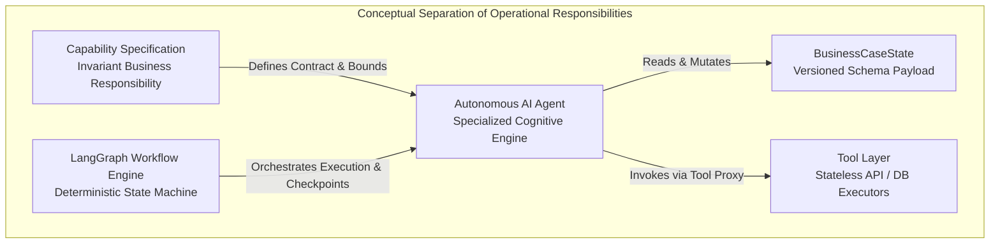

### 1.1 Architectural Separation of Responsibilities

| Abstraction Layer | Definitional Scope | Engineering Responsibility & Invariant Rules |
|---|---|---|
| **Capability** | *What must be accomplished.* | Defines the formal business objective, invariant input/output data schemas, domain success criteria, and strict operational boundaries (P-CAP-01 through P-CAP-12). Capabilities are technology-agnostic contracts that persist even if algorithmic backends migrate from statistical rules to neural models. |
| **Workflow** | *When and in what progression it occurs.* | Governs deterministic state transitions, conditional edge routing, durable persistence checkpoints, parallel fork-join synchronization, and saga compensation loops. Executed by the LangGraph `StateGraph` engine (ADR-006). The workflow engine contains **zero inference logic** and evaluates only typed boolean flags within `BusinessCaseState`. |
| **Autonomous Agent** | *How cognitive synthesis is executed.* | The specialized cognitive execution runtime encapsulated inside each LangGraph node. An agent binds a curated Large Language Model (or specialized ML evaluator) to a strict system prompt, domain working memory, and a sandboxed whitelist of executable tools. Agents execute bounded reasoning loops to transform input state into validated structured output state. |

### 1.2 Rationale for Agent Specialization

1. **Cognitive Isolation & Prompt Economics**: An agent analyzing high-velocity WMS inventory discrepancies (`Observation Agent`) requires strict mathematical validation instructions and minimal context overhead. Conversely, an agent investigating supply chain delays across purchase ledgers and vendor SLAs (`Investigation Agent`) requires deep multi-hop relational reasoning, dynamic schema retrieval, and long-context synthesis. Decoupling these agents eliminates conflicting system prompts and optimizes token consumption per operational phase.
2. **Deterministic Governance & Auditability**: Enterprise compliance (Master Context §6.2) mandates that every decision chain be auditable before execution occurs. By bounding AI reasoning inside discrete, specialized agents bounded by formal node execution exits, Sentinel OS guarantees that an explicit, cryptographically verifiable evidentiary artifact (`evidence_chain`, `action_plan`) is materialized and persisted to PostgreSQL (`cases`, `case_timeline`) at every step.
3. **Domain Ownership & RBAC Alignment**: Specialization aligns software components with enterprise organizational structures. The `Detection Agent` is governed by Inventory QA engineering policies; the `Decision Agent` is governed by Financial Risk and Procurement authorization constraints. This separation ensures granular access control and isolated release cycles across operational teams.

---

## 2. Agent Architecture

Every autonomous AI agent inside Sentinel OS adheres to a standardized structural design pattern enforced at the LangGraph node execution boundary. Agents act as pure cognitive transformation functions over the durable `BusinessCaseState`.

### 2.1 Complete Agent Hierarchy & Cognitive Tiers

Sentinel OS categorizes its agents into distinct operational tiers, each exhibiting specific computational, memory, and model profiles:

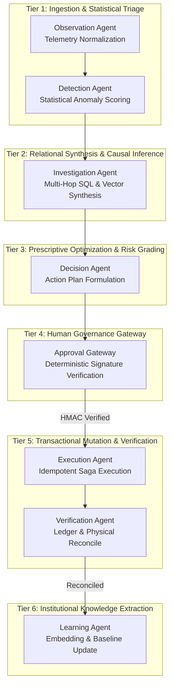

### 2.2 Agent Lifecycle State Machine

When the LangGraph workflow engine transitions into an agent node, the agent executes a rigorously controlled internal lifecycle. If any step fails schema validation or exceeds execution budgets, the agent aborts and surfaces structured error telemetry without crashing the workflow engine.

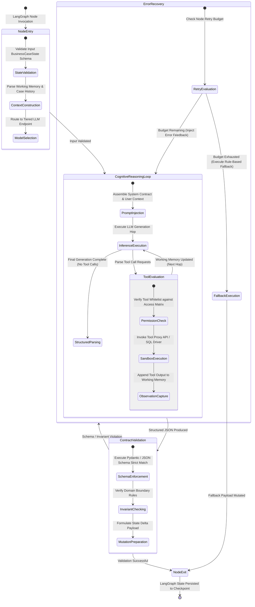

### 2.3 Agent Ownership & Communication Boundaries

Agents inside Sentinel OS operate under absolute communication isolation (ADR-007). Direct peer-to-peer inter-process communication, remote procedure calls, or shared in-memory variables between agents are strictly forbidden. 

1. **State-Driven Communication**: Agents communicate exclusively by reading specific fields from the incoming `BusinessCaseState` and writing structured mutations back to designated output keys within `BusinessCaseState`.
2. **Event-Driven Asynchrony**: Upon completing a node execution cycle, the workflow engine emits standardized domain events (`sentinel.<domain>.<action>`) to the enterprise event bus (ADR-001, ADR-009). Upstream telemetry pipelines, mission control dashboards (ADR-010), and external audit systems consume these events asynchronously.

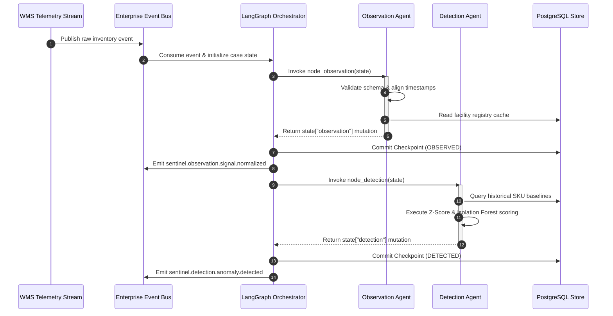

---

## 3. Universal Agent Contract

Every agent specification in Sentinel OS must define all 26 fields of the **Universal Agent Contract**. This contract acts as an immutable agreement between platform engineers, LLM engineers, and system auditors. No agent may be merged into production unless every field is explicitly specified and covered by deterministic regression tests.

| Field Name | Engineering Definition & Architectural Rationale |
|---|---|
| **1. Mission** | A concise, single-sentence operational objective defining the agent's singular cognitive responsibility within the enterprise execution cycle. |
| **2. Business Purpose** | The concrete business justification explaining why this agent is required, what risk it mitigates, and what financial or operational value it secures. |
| **3. Responsibilities** | An exhaustive, bulleted list of non-overlapping tasks executed within the agent's bounded reasoning loop. |
| **4. Inputs** | Explicit JSON paths within `BusinessCaseState` read by the agent upon node initialization. Any undocumented state read triggers a schema linter failure during build compilation. |
| **5. Outputs** | Explicit JSON paths within `BusinessCaseState` mutated or appended to upon node completion. |
| **6. Shared State Reads** | Cross-cutting state attributes accessed for contextual awareness (e.g., `state["case"].tenant_id`, `state["case"].severity`). |
| **7. Shared State Writes** | Global case state updates executed by the agent (e.g., updating `priority_score`, appending to `timeline`). |
| **8. Database Reads** | Relational PostgreSQL tables or Redis cache keys queried via read-only tools during execution. |
| **9. Database Writes** | Direct or tool-mediated database inserts/updates performed by the agent (must adhere to transactional boundaries). |
| **10. Events Consumed** | Event bus topics (`sentinel.*`) that trigger the orchestration workflow executing this agent node. |
| **11. Events Published** | Domain events emitted by the orchestrator upon successful verification of this agent's state mutation. |
| **12. Tool Access** | Whitelisted set of executable tool proxies assigned to the agent. Access to unlisted tools is blocked at the runtime sandbox layer. |
| **13. Memory Usage** | Allocation boundaries across Working Memory (context window), Case Memory (`BusinessCaseState`), Knowledge Memory (pgvector store), and Historical Memory. |
| **14. Context Construction** | The exact programmatic template and budgeting strategy used to format dynamic state variables into the LLM context window. |
| **15. Prompt Contract** | The rigorous, versioned system instruction defining persona, behavioral bounds, anti-hallucination rules, and few-shot reasoning exemplars. |
| **16. Output Contract** | Strict JSON Schema / Pydantic model definition governing the LLM's final generation response. |
| **17. Validation Rules** | Deterministic business logic invariants verified against the structured output before state mutation is permitted. |
| **18. Retry Strategy** | Backoff equations, jitter multipliers, and maximum retry ceilings for LLM inference or tool execution failures. |
| **19. Timeout Strategy** | Hard execution latency ceilings (in milliseconds) enforced at tool invocation, single LLM hop, and total node scope. |
| **20. Failure Modes** | An exception matrix mapping specific failure conditions (e.g., tool timeout, schema mismatch) to deterministic fallback states. |
| **21. Security Rules** | Sandbox boundaries, prompt injection sanitization directives, and sensitive data redaction rules. |
| **22. Human Interaction** | Specification of human interrupt triggers, required operator roles, and escalation SLAs. |
| **23. Metrics** | Standardized OpenTelemetry metric definitions (Counters, Histograms, Gauges) emitted during agent execution. |
| **24. Logging** | Structured JSON log event definitions emitted at DEBUG, INFO, WARN, and ERROR levels. |
| **25. Traceability** | Distributed tracing span naming conventions, trace ID propagation, and attribute tagging rules. |
| **26. Related ADRs** | Binding Architectural Decision Records governing this agent's design and runtime mechanics. |

### 3.2 Formal Node State Transition Matrix & Edge Invariance Table

Every LangGraph node execution terminates with an explicit conditional routing evaluation. The workflow engine evaluates immutable boolean flags and status fields set by the agent during its contract validation phase:

| Source Agent Node | Evaluated State Condition | Target Destination Node | Checkpoint Action | Architectural & Operational Rationale |
|---|---|---|---|---|
| `node_observation` | `observation.is_noise == true` | **Terminal End (Quarantine)** | Persist DLQ payload | Prevents malformed or spurious sensor flickers from consuming investigative database queries. |
| `node_observation` | `observation.is_noise == false` & `confidence_score >= 0.50` | `node_detection` | Commit `OBSERVED` state | Validated inventory telemetry advances immediately to statistical baseline evaluation. |
| `node_detection` | `detection.is_duplicate == true` | **Terminal End (Merge)** | Persist deduplication link | Suppresses alert storms when a single underlying network issue triggers hundreds of concurrent SKU events. |
| `node_detection` | `detection.anomaly_detected == false` | **Terminal End (Normal)** | Persist telemetry log | Routine inventory fluctuations within normal Z-score bounds ($\pm 2\sigma$) terminate cleanly. |
| `node_detection` | `detection.anomaly_detected == true` | `node_investigation` | Commit `DETECTED` state | Confirmed anomaly requires immediate multi-hop relational root cause investigation. |
| `node_investigation`| `investigation.confidence < 0.70` | **Manual Investigation Queue** | Commit partial evidence | Unresolved or ambiguous causal diagnoses escalate to human engineering analysts rather than risking automated guessing. |
| `node_investigation`| `investigation.confidence >= 0.70` | `node_decision` | Commit `INVESTIGATED` state | High-confidence causal graphs transition directly to prescriptive action plan optimization. |
| `node_decision` | `len(action_plan) == 3` | `node_approval` | Commit `PENDING_APPROVAL` | Formulated remediation strategy halts for mandatory cryptographic human governance. |
| `node_approval` | `approval.status == REJECTED` | **Terminal End (Rejected)** | Persist rejection audit log | Human operator veto halts execution immediately; zero state mutations permitted against external systems. |
| `node_approval` | `approval.status == APPROVED` | `node_execution` | Commit signed authorization | Cryptographically authenticated approval unlocks transactional write proxies. |
| `node_execution` | `execution.saga_status == COMPENSATED` | **Terminal End (Rolled Back)** | Persist Saga failure logs | API failure triggers reverse compensation loop; case closes cleanly in compensated state. |
| `node_execution` | `execution.saga_status == COMPLETED` | `node_verification` | Commit `EXECUTED` state | All 3 action steps executed; advance to physical stock ledger verification. |
| `node_verification` | `discrepancy_delta != 0` (Attempt < 3) | `node_verification` (Poll loop) | Delay 10s & Re-query | Accommodates asynchronous WMS indexing lag post-mutation. |
| `node_verification` | `reconciliation_passed == true` | `node_learning` | Commit `VERIFIED` state | Confirmed physical resolution advances to institutional knowledge vectorization. |

---


## 4. Observation Agent (`agent_observation`)

### 4.1 Mission & Purpose
- **Mission**: Ingest raw, asynchronous enterprise operational telemetry, validate structural compliance against shared domain schemas, align disparate timestamp timezones to canonical UTC, enrich payload with facility registry metadata, and filter unprocessable noise before case initialization.
- **Business Purpose**: Prevents downstream cognitive pollution and database corruption by guaranteeing that only structurally pristine, cryptographically authenticated, and normalized operational signals enter the Sentinel OS autonomous execution pipeline.

### 4.2 Responsibilities
1. Parse raw incoming JSON payloads from Warehouse Management Systems (WMS) and Enterprise Resource Planning (ERP) integrations.
2. Execute strict JSON Schema validation against `@sentinel/schemas` domain definitions (`InventoryAdjustmentEvent`, `ReceiptDiscrepancyEvent`).
3. Normalize all localized ISO 8601 timestamps to UTC epoch representations.
4. Interrogate static facility registry cache (Redis) to validate `warehouse_id` and enrich payload with geographical zone and facility tier metadata.
5. Compute initial Signal Quality Confidence Score ($C_{\text{sig}}$) based on payload completeness and sensor signal-to-noise ratio.
6. Quarantine corrupted, unauthenticated, or malformed payloads to the Dead Letter Queue (DLQ).

### 4.3 State & Database Contracts
- **Inputs**: `state["raw_payload"]`, `state["event_metadata"]`.
- **Outputs**: `state["observation"]` mutation containing normalized signals.
- **Shared State Reads**: `state["tenant_id"]`.
- **Shared State Writes**: `state["case"].status = 'OBSERVED'`, `state["timeline"]` (append entry).
- **Database Reads**: Redis cache `facility:registry:{warehouse_id}`.
- **Database Writes**: `business_cases` (initial record creation via orchestrator), `case_timeline`.
- **Events Consumed**: `sentinel.observation.telemetry.ingested`.
- **Events Published**: `sentinel.observation.signal.normalized`, `sentinel.observation.noise.filtered`.

### 4.4 Tool Access & Memory Strategy
- **Tool Access**: `TelemetryValidationTool`, `FacilityRegistryLookupTool`.
- **Memory Usage**: 
  - *Working Memory*: Ephemeral context window containing raw payload (~1,500 tokens).
  - *Case Memory*: Persists normalized JSON into `state["observation"]`.
  - *Knowledge Memory*: None (stateless normalization).
  - *Historical Memory*: None.

### 4.5 Context Construction & Prompt Contract
The Observation Agent operates primarily via deterministic schema validation tools, utilizing high-speed LLM inference exclusively for parsing semi-structured operator notes appended to inventory telemetry.

```json
{
  "system_instruction": "You are Sentinel OS Observation Agent. Your sole task is to extract structured inventory metadata from unstructured operator notes embedded in WMS telemetry. Never assume inventory quantities not explicitly stated. If ambiguous, output null for optional fields.",
  "context_variables": {
    "raw_notes": "string",
    "facility_code": "string"
  }
}
```

### 4.6 Output Contract (`ObservationAgentOutput`)
```json
{
  "$schema": "http://json-schema.org/draft-07/schema#",
  "title": "ObservationAgentOutput",
  "type": "object",
  "required": ["observation_id", "normalized_signals", "confidence_score", "is_noise"],
  "properties": {
    "observation_id": { "type": "string", "format": "uuid" },
    "normalized_signals": {
      "type": "array",
      "items": {
        "type": "object",
        "required": ["sku", "warehouse_id", "observed_quantity", "expected_quantity", "timestamp_utc"],
        "properties": {
          "sku": { "type": "string", "pattern": "^[A-Z0-9]{6,12}$" },
          "warehouse_id": { "type": "string", "format": "uuid" },
          "observed_quantity": { "type": "integer" },
          "expected_quantity": { "type": "integer" },
          "timestamp_utc": { "type": "string", "format": "date-time" }
        }
      }
    },
    "confidence_score": { "type": "number", "minimum": 0.0, "maximum": 1.0 },
    "is_noise": { "type": "boolean" },
    "quarantine_reason": { "type": ["string", "null"] }
  }
}
```

### 4.7 Validation Rules & Operational Mechanics
- **Validation Rules**: `confidence_score >= 0.50` required to pass; `observed_quantity != expected_quantity` required to advance out of noise filtering.
- **Retry Strategy**: 3 attempts, exponential backoff (1000ms initial, 2x multiplier).
- **Timeout Strategy**: Tool execution ceiling: 2,000ms; Total node execution ceiling: 5,000ms.
- **Failure Modes**:
  - *Malformed Schema*: Route payload to DLQ, emit `sentinel.observation.noise.filtered`, terminate workflow.
  - *Facility Lookup Timeout*: Fallback to static tenant configuration defaults, tag `confidence_score = 0.60`.

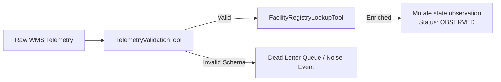

---

## 5. Detection Agent (`agent_detection`)

### 5.1 Mission & Purpose
- **Mission**: Evaluate normalized inventory signals against statistical SKU baselines, compute mathematical anomaly severity gradings, suppress duplicate event noise across active time-windows, instantiate formal business cases, and calculate initial enterprise risk scores.
- **Business Purpose**: Eliminates alert fatigue by filtering routine statistical variances and surfacing only high-impact, verified operational inventory discrepancies that threaten order fulfillment or working capital SLAs.

### 5.2 Responsibilities
1. Interrogate PostgreSQL `warehouses` and baseline tables via read tools to fetch SKU historical velocity ($V_{\text{sku}}$), moving average ($\mu$), and standard deviation ($\sigma$).
2. Execute Z-Score evaluation ($Z = \frac{|x - \mu|}{\sigma}$) and evaluate Isolation Forest anomaly thresholds.
3. Assign severity grading (`CRITICAL` if $Z \ge 4.0$, `HIGH` if $Z \ge 3.0$, `MEDIUM` if $Z \ge 2.0$, `LOW` otherwise).
4. Execute duplicate suppression lookup across `business_cases` table matching `sku`, `warehouse_id`, and active status within a trailing 4-hour window.
5. Compute composite Business Risk Score ($R = S_{\text{severity}} \times V_{\text{unit\_cost}} \times \Delta_{\text{quantity}}$).
6. Emit formal detection events or suppress duplicate triggers.

### 5.3 State & Database Contracts
- **Inputs**: `state["observation"]`, `state["case"]`.
- **Outputs**: `state["detection"]` mutation, updated `state["case"].priority_score`.
- **Shared State Reads**: `state["observation"].normalized_signals`.
- **Shared State Writes**: `state["case"].status = 'DETECTED'`, `state["case"].priority_score`.
- **Database Reads**: `warehouses` (SKU baseline parameters), `business_cases` (active deduplication index).
- **Database Writes**: `business_cases` (update priority score), `case_timeline`.
- **Events Consumed**: `sentinel.observation.signal.normalized`.
- **Events Published**: `sentinel.detection.anomaly.detected`, `sentinel.detection.baseline.normal`.

### 5.4 Tool Access & Memory Strategy
- **Tool Access**: `StatisticalBaselineQueryTool`, `DeduplicationIndexQueryTool`.
- **Memory Usage**:
  - *Working Memory*: Analyzes up to 50 concurrent normalized signals (~3,000 tokens).
  - *Case Memory*: Persists statistical scoring and severity grading into `state["detection"]`.
  - *Knowledge Memory*: None.
  - *Historical Memory*: Reads trailing 4-hour active case index.

### 5.5 Output Contract (`DetectionAgentOutput`)
```json
{
  "$schema": "http://json-schema.org/draft-07/schema#",
  "title": "DetectionAgentOutput",
  "type": "object",
  "required": ["detection_id", "anomaly_detected", "severity", "z_score", "risk_score", "is_duplicate", "duplicate_case_id"],
  "properties": {
    "detection_id": { "type": "string", "format": "uuid" },
    "anomaly_detected": { "type": "boolean" },
    "severity": { "type": "string", "enum": ["CRITICAL", "HIGH", "MEDIUM", "LOW", "NORMAL"] },
    "z_score": { "type": "number" },
    "risk_score": { "type": "number", "minimum": 0.0, "maximum": 100.0 },
    "is_duplicate": { "type": "boolean" },
    "duplicate_case_id": { "type": ["string", "null"], "format": "uuid" },
    "detection_rationale": { "type": "string" }
  }
}
```

### 5.6 Validation Rules & Operational Mechanics
- **Validation Rules**: If `is_duplicate == true`, workflow must route to terminal merge state without opening a new investigation.
- **Retry Strategy**: 2 attempts, linear backoff (500ms initial).
- **Timeout Strategy**: Tool execution ceiling: 3,000ms; Total node execution ceiling: 10,000ms.
- **Failure Modes**:
  - *Baseline DB Timeout*: Fallback to absolute threshold rule ($\Delta_{\text{qty}} > 50$ units triggers `HIGH` severity).
  - *Deduplication Index Unreachable*: Assume `is_duplicate = false` to guarantee zero missed anomalies; log warning.

---

## 6. Investigation Agent (`agent_investigation`)

### 6.1 Mission & Purpose
- **Mission**: Conduct autonomous, multi-hop relational root cause investigations across disparate enterprise systems (ERP, WMS, Supplier SLAs), retrieve semantic historical knowledge vectors, synthesize competing causal hypotheses, calculate formal statistical confidence rankings, and output an exhaustive, fully explainable evidentiary graph.
- **Business Purpose**: Replaces manual, labor-intensive engineering and supply chain investigation cycles (which average 4 to 72 hours) with an automated, auditable 30-second relational diagnosis, establishing institutional accountability before financial remediation is committed.

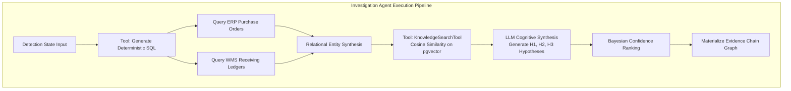

### 6.2 Exhaustive Operational Responsibilities
1. Extract anomalous SKU and warehouse context from `state["detection"]`.
2. Formulate and execute bounded, deterministic SQL queries via read-only tools against ERP purchase order ledgers (`purchase_orders`), receiving ledgers (`warehouse_receipts`), and supplier master agreements (`supplier_slas`).
3. Traverse multi-hop relational primary/foreign key relationships (e.g., matching receipt `po_id` to purchase order line items and vendor shipment tracking records).
4. Invoke `KnowledgeSearchTool` to execute high-dimensional vector similarity lookups against `knowledge_records` (pgvector store using cosine distance over `gemini-embedding-exp-03-07` embeddings) to retrieve historical root causes for identical SKU/vendor failure patterns.
5. Synthesize empirical SQL results and semantic vector knowledge into a Causal Directed Acyclic Graph (DAG).
6. Formulate a primary root cause hypothesis ($H_1$) and at least two competing alternative hypotheses ($H_2, H_3$).
7. Compute composite investigation confidence rankings using Bayesian prior updates weighted by historical supplier error rates and empirical ledger proofs.
8. Construct an immutable `evidence_chain` array citing exact database table names, primary key UUIDs, timestamps, and relational deltas.

### 6.3 State & Database Contracts
- **Inputs**: `state["detection"]`, `state["case"]`.
- **Outputs**: `state["investigation"]` mutation containing `root_cause_summary`, `confidence`, and `evidence_chain`.
- **Shared State Reads**: `state["case"].id`, `state["detection"].sku`, `state["detection"].warehouse_id`.
- **Shared State Writes**: `state["case"].status = 'INVESTIGATED'`, `state["timeline"]` (append entry).
- **Database Reads**: `purchase_orders`, `warehouse_receipts`, `supplier_slas`, `knowledge_records` (pgvector).
- **Database Writes**: `case_timeline`.
- **Events Consumed**: `sentinel.detection.anomaly.detected`.
- **Events Published**: `sentinel.investigation.completed`, `sentinel.investigation.inconclusive`.

### 6.4 Tool Access Matrix
The Investigation Agent possesses the broadest read-only tool access matrix within Sentinel OS, strictly prohibited from executing state mutations:
- `PurchaseOrderQueryTool`: Reads ERP line items, quantities, agreed delivery dates, and unit prices.
- `WarehouseLogQueryTool`: Reads physical dock receipts, inspection pass/fail flags, and operator badge IDs.
- `SupplierLookupTool`: Reads vendor historical defect rates, lead-time variances, and contractual SLA terms.
- `KnowledgeSearchTool`: Executes semantic vector search over resolved historical cases.

### 6.5 Long-Context Strategy & Working Memory Economics
When investigating systemic warehouse discrepancies, transaction ledgers over a 30-day window can easily exceed 500,000 tokens. The Investigation Agent enforces a strict **Hierarchical Context Pruning Strategy** to stay within optimal reasoning limits (<32,000 tokens):
1. **Temporal Filtering**: Pre-filter SQL queries to a tight window bounded by $[\text{anomaly\_timestamp} - 14 \text{ days}, \text{anomaly\_timestamp} + 1 \text{ day}]$.
2. **Deterministic Aggregation**: Tool proxies return aggregated line-item discrepancies rather than raw line items when transaction counts exceed 100 rows.
3. **Semantic Pruning**: Line items matching exact expected fulfillment quantities are dropped from LLM context injection; only ledger variances ($\Delta \ne 0$) are formatted into prompt context.

### 6.6 Prompt Contract & System Instructions
```json
{
  "system_instruction": "You are the Sentinel OS Principal Investigation Agent. Your mission is to establish the definitive causal root cause for operational inventory anomalies by cross-referencing relational ERP/WMS database records with historical vector knowledge.\n\nRULES OF EXECUTION:\n1. Never invent or infer database records. Every assertion in your root cause summary MUST cite an exact table name and record UUID from tool outputs.\n2. You must formulate exactly 3 competing hypotheses (H1 Primary, H2 Alternative, H3 Edge Case) and assign empirical confidence scores summing to 1.0.\n3. If SQL tool outputs reveal incomplete receiving logs, mark confidence < 0.70 and flag data gap.",
  "context_template": "ANOMALY TARGET: SKU {{sku}} at Facility {{warehouse_id}}.\nEMPIRICAL LEDGER EVIDENCE:\n{{tool_outputs_json}}\nHISTORICAL CASE MATCHES (Vector Store):\n{{vector_matches_json}}"
}
```

### 6.7 Output Contract (`InvestigationAgentOutput`)
```json
{
  "$schema": "http://json-schema.org/draft-07/schema#",
  "title": "InvestigationAgentOutput",
  "type": "object",
  "required": ["investigation_id", "primary_hypothesis", "alternative_hypotheses", "confidence", "evidence_chain"],
  "properties": {
    "investigation_id": { "type": "string", "format": "uuid" },
    "primary_hypothesis": {
      "type": "object",
      "required": ["hypothesis_id", "category", "narrative", "probability"],
      "properties": {
        "hypothesis_id": { "type": "string" },
        "category": { "type": "string", "enum": ["SUPPLIER_SHORT_SHIPMENT", "WMS_SYNCHRONIZATION_LAG", "PILFERAGE_DAMAGE", "PHANTOM_INVENTORY", "PO_DATA_ENTRY_ERROR"] },
        "narrative": { "type": "string" },
        "probability": { "type": "number", "minimum": 0.0, "maximum": 1.0 }
      }
    },
    "alternative_hypotheses": {
      "type": "array",
      "minItems": 2,
      "maxItems": 4,
      "items": {
        "type": "object",
        "required": ["hypothesis_id", "category", "narrative", "probability"],
        "properties": {
          "hypothesis_id": { "type": "string" },
          "category": { "type": "string" },
          "narrative": { "type": "string" },
          "probability": { "type": "number" }
        }
      }
    },
    "confidence": { "type": "number", "minimum": 0.0, "maximum": 1.0 },
    "evidence_chain": {
      "type": "array",
      "minItems": 1,
      "items": {
        "type": "object",
        "required": ["evidence_id", "source_table", "record_id", "description", "causal_weight"],
        "properties": {
          "evidence_id": { "type": "string", "format": "uuid" },
          "source_table": { "type": "string", "enum": ["purchase_orders", "warehouse_receipts", "supplier_slas", "knowledge_records"] },
          "record_id": { "type": "string" },
          "description": { "type": "string" },
          "causal_weight": { "type": "string", "enum": ["DECISIVE", "SUPPORTING", "CIRCUMSTANTIAL"] }
        }
      }
    }
  }
}
```

### 6.8 Validation Rules & Exception Matrix
- **Validation Rules**: `confidence >= 0.70` required for automated transition to Decision Agent; if `confidence < 0.70`, case routes to manual investigation queue.
- **Retry Strategy**: 3 retries for database/tool connectivity timeouts (2000ms initial, 2x multiplier).
- **Timeout Strategy**: Tool execution ceiling: 8,000ms per tool; Total node execution ceiling: 30,000ms.

| Exception Code | Failure Condition Description | Deterministic System Fallback & Recovery Action |
|---|---|---|
| `ERR_INV_SQL_TIMEOUT` | ERP database read replica fails to return query results within 8,000ms. | Abort query; execute fallback query against daily summary rollup tables; cap max confidence at `0.65`. |
| `ERR_INV_ZERO_EVIDENCE` | No matching purchase orders or receipts found for SKU within temporal window. | Tag category as `UNTRACED_ANOMALY`; set `confidence = 0.20`; trigger alert for manual physical inventory cycle count. |
| `ERR_INV_VECTOR_DOWN` | pgvector embedding service or database connection unreachable. | Skip historical similarity synthesis; rely exclusively on SQL ledger proofs; append warning to audit trail. |
| `ERR_INV_HALLUCINATION` | Output validation linter detects table/record ID in `evidence_chain` not present in tool outputs. | Discard LLM output; re-execute inference loop with strict zero-hallucination constraint prompt (attempt 1 of 2). |

### 6.9 Exact Mathematical Formulation of Bayesian Causal Ranking and Multi-Source Evidence Fusion

To eliminate qualitative guessing when evaluating multiple competing root cause hypotheses ($H_1, H_2, \dots, H_n$), the Investigation Agent executes a formal Bayesian log-odds updating algorithm. Given an initial prior probability $P(H_i)$ derived from historical pgvector similarity matches ($S_{\text{vector}}$), each newly retrieved piece of SQL evidence ($E_j \in \text{evidence\_chain}$) updates the hypothesis posterior probability:

$$\ln \left( \frac{P(H_i \mid E_{1:m})}{1 - P(H_i \mid E_{1:m})} \right) = \ln \left( \frac{P(H_i)}{1 - P(H_i)} \right) + \sum_{j=1}^{m} \ln \left( \frac{P(E_j \mid H_i)}{P(E_j \mid \neg H_i)} \right)$$

Where:
- $\frac{P(E_j \mid H_i)}{P(E_j \mid \neg H_i)}$ represents the Likelihood Ratio ($\Lambda_j$) assigned to evidence node $E_j$.
- Empirical database ledger matches (e.g., exact PO receipt discrepancy $\Delta = 250$) carry high likelihood ratios ($\Lambda_j = 15.0$).
- Indirect environmental observations (e.g., vendor historical late delivery rate $> 10\%$) carry moderate likelihood ratios ($\Lambda_j = 2.5$).
- Negative verification checks (e.g., physical dock audit confirms zero damaged goods) carry fractional likelihood ratios ($\Lambda_j = 0.1$), strongly suppressing false-positive hypotheses.

The normalized composite posterior probability constitutes the exact `confidence` score emitted in the agent's Pydantic contract:

$$\text{confidence}(H_i) = \frac{\exp(\text{logit}(H_i))}{\sum_{k=1}^{n} \exp(\text{logit}(H_k))}$$

---
## 7. Decision Agent (`agent_decision`)

### 7.1 Mission & Purpose
- **Mission**: Synthesize empirical root cause investigation findings into bounded, prescriptive remediation strategies, execute multi-variable cost/benefit and safety stock simulations via computational tools, formulate an optimized 3-step action plan, and compute precise financial impact and rollback parameters.
- **Business Purpose**: Bridges the critical enterprise gap between operational diagnosis and physical execution (Master Context §3.1), ensuring that proposed interventions minimize working capital expenditure, respect contractual vendor SLAs, and carry explicit rollback procedures before human authorization is requested.

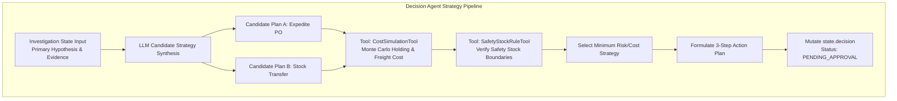

### 7.2 Operational Responsibilities
1. Parse the verified `primary_hypothesis` and `evidence_chain` from `state["investigation"]`.
2. Synthesize two candidate remediation strategies tailored to the root cause category (e.g., if `SUPPLIER_SHORT_SHIPMENT`, candidate A = expedite replacement purchase order; candidate B = emergency inter-warehouse stock transfer from regional hub).
3. Invoke `CostSimulationTool` to calculate deterministic financial estimates: freight premium, inventory holding cost changes, and potential stockout penalty costs.
4. Invoke `SafetyStockRuleTool` to verify that candidate stock transfers do not breach minimum safety stock thresholds at donor warehouse facilities.
5. Select the candidate strategy exhibiting the highest financial return on investment and lowest operational disruption risk.
6. Deconstruct the chosen strategy into exactly three atomic, sequential action steps conforming to the `ActionStep` domain contract.
7. Assign explicit rollback and compensation instructions for each step.

### 7.3 State & Database Contracts
- **Inputs**: `state["investigation"]`, `state["case"]`.
- **Outputs**: `state["decision"]` mutation containing `selected_plan_id`, `financial_impact`, and `action_plan`.
- **Shared State Reads**: `state["investigation"].primary_hypothesis`, `state["investigation"].confidence`.
- **Shared State Writes**: `state["case"].status = 'PENDING_APPROVAL'`, `state["timeline"]` (append entry).
- **Database Reads**: `warehouses` (safety stock rules), `scenario_templates` (pre-approved remediation blueprints).
- **Database Writes**: `decisions` (insert candidate plan record), `case_timeline`.
- **Events Consumed**: `sentinel.investigation.completed`.
- **Events Published**: `sentinel.decision.plan.formulated`.

### 7.4 Tool Access & Memory Strategy
- **Tool Access**: `CostSimulationTool`, `SafetyStockRuleTool`, `ScenarioTemplateLookupTool`.
- **Memory Usage**:
  - *Working Memory*: Holds candidate strategies and simulation output tables (~4,000 tokens).
  - *Case Memory*: Persists validated action plan into `state["decision"]`.
  - *Knowledge Memory*: Reads relevant scenario templates from vector/relational index.
  - *Historical Memory*: None.

### 7.5 Prompt Contract & System Instructions
```json
{
  "system_instruction": "You are the Sentinel OS Principal Decision Agent. Your sole responsibility is to translate root cause investigations into an actionable, highly structured 3-step remediation plan.\n\nCONSTRAINTS:\n1. Your plan MUST contain exactly 3 action steps executed in linear order (Step 1 -> Step 2 -> Step 3).\n2. Every action step must target an explicit enterprise system endpoint (WMS or ERP).\n3. You must include a concrete, programmatic rollback procedure for every step.\n4. Do not exceed the budget threshold simulated by CostSimulationTool.",
  "context_template": "ROOT CAUSE DIAGNOSIS:\n{{hypothesis_json}}\nFINANCIAL SIMULATION RESULTS:\n{{cost_simulation_json}}\nSAFETY STOCK BOUNDARIES:\n{{safety_stock_json}}"
}
```

### 7.6 Output Contract (`DecisionAgentOutput`)
```json
{
  "$schema": "http://json-schema.org/draft-07/schema#",
  "title": "DecisionAgentOutput",
  "type": "object",
  "required": ["decision_id", "selected_plan_id", "financial_impact", "risk_grading", "action_plan"],
  "properties": {
    "decision_id": { "type": "string", "format": "uuid" },
    "selected_plan_id": { "type": "string", "format": "uuid" },
    "financial_impact": {
      "type": "object",
      "required": ["estimated_cost_usd", "estimated_savings_usd", "net_roi"],
      "properties": {
        "estimated_cost_usd": { "type": "number" },
        "estimated_savings_usd": { "type": "number" },
        "net_roi": { "type": "number" }
      }
    },
    "risk_grading": { "type": "string", "enum": ["LOW_RISK", "MODERATE_RISK", "HIGH_RISK"] },
    "action_plan": {
      "type": "array",
      "minItems": 3,
      "maxItems": 3,
      "items": {
        "type": "object",
        "required": ["step_number", "action_type", "target_system", "endpoint", "payload_parameters", "rollback_procedure"],
        "properties": {
          "step_number": { "type": "integer", "minimum": 1, "maximum": 3 },
          "action_type": { "type": "string", "enum": ["EXPEDITE_PO", "CREATE_STOCK_TRANSFER", "ADJUST_SAFETY_STOCK", "QUARANTINE_BATCH", "UPDATE_REORDER_POINT"] },
          "target_system": { "type": "string", "enum": ["ERP_SAP", "WMS_MANHATTAN", "ERP_NETSUITE"] },
          "endpoint": { "type": "string" },
          "payload_parameters": { "type": "object" },
          "rollback_procedure": {
            "type": "object",
            "required": ["rollback_endpoint", "rollback_payload"],
            "properties": {
              "rollback_endpoint": { "type": "string" },
              "rollback_payload": { "type": "object" }
            }
          }
        }
      }
    }
  }
}
```

### 7.7 Validation Rules & Exception Matrix
- **Validation Rules**: `len(action_plan) == 3` strictly enforced; `estimated_cost_usd >= 0.0` required.
- **Retry Strategy**: 2 attempts on LLM JSON schema mismatch or missing rollback parameters.
- **Timeout Strategy**: Tool execution ceiling: 4,000ms; Total node execution ceiling: 20,000ms.

| Exception Code | Failure Condition Description | Deterministic System Fallback & Recovery Action |
|---|---|---|
| `ERR_DEC_SCHEMA_VIOLATION` | LLM outputs 2 or 4 action steps instead of mandatory 3 steps. | Re-inject schema error feedback into prompt; re-execute generation loop. |
| `ERR_DEC_SIM_TIMEOUT` | `CostSimulationTool` fails to compute Monte Carlo bounds within 4,000ms. | Default financial impact estimates to upper bound ($\text{Cost} = \$5,000$); tag `risk_grading = HIGH_RISK`. |
| `ERR_DEC_SAFETY_BREACH` | All candidate strategies violate minimum safety stock thresholds. | Abort automated planning; route case to manual inventory planner queue with partial diagnosis attached. |

---

## 8. Approval Gateway (`gateway_approval`)

> [!IMPORTANT]
> **ARCHITECTURAL INVARIANT**: The Approval Gateway (`node_approval`) contains **ZERO artificial intelligence, neural inference, or probabilistic evaluation**. It is a strictly deterministic governance gate and state machine suspension point that enforces inviolable human authority over operational state mutations (Master Context §6.3, ADR-008).

### 8.1 Mission & Purpose
- **Mission**: Halt autonomous workflow progression, evaluate action plan financial impact against governance authorization matrices, emit digital approval tickets to authorized human operators, suspend LangGraph execution state to durable checkpoint storage, and cryptographically verify human authorization signatures upon workflow resumption.
- **Business Purpose**: Eliminates unauthorized autonomous software execution against production enterprise databases, guaranteeing absolute legal and regulatory accountability for physical financial spend and stock movements.

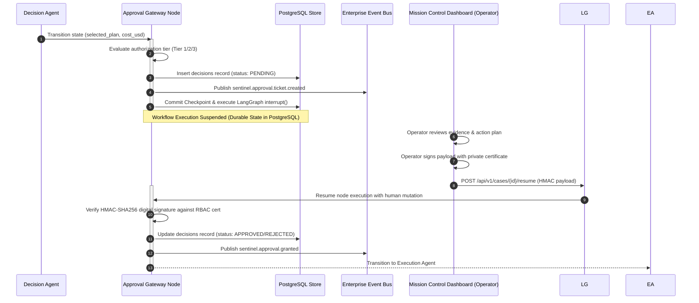

### 8.2 Authorization Tier Matrix
The Gateway assigns required approval authority based on the financial impact computed by the Decision Agent:

| Governance Tier | Financial Spend Threshold | Required Approver Role | SLA Timeout | Expiration Action |
|---|---|---|---|---|
| **Tier 1 (Standard)** | Spend $< \$1,000$ USD | Shift Supervisor / Lead QA | 4 Hours | Automated escalation to Tier 2. |
| **Tier 2 (Elevated)** | Spend $\$1,000 - \$10,000$ USD | Operations Plant Manager | 12 Hours | Automated escalation to Tier 3. |
| **Tier 3 (Executive)** | Spend $> \$10,000$ USD | VP Supply Chain / Controller | 24 Hours | Auto-reject case; transition to `REJECTED`. |

### 8.3 Interrupt & Resume Execution Mechanics
1. **Suspension**: The node executes LangGraph `interrupt(value={"case_id": id, "required_tier": tier})`. The execution engine serializes the complete `StateSnapshot` to the `checkpoints` PostgreSQL table and frees runtime thread worker memory.
2. **Resumption**: When the human operator signs the decision payload in Mission Control (ADR-010), the API server validates the operator's JWT claims against the `users` table and submits the resumed payload via `Command(resume=operator_decision)`.
3. **Cryptographic Verification**: The Gateway verifies that $\text{HMAC}(\text{case\_id} + \text{plan\_id} + \text{decision}, \text{secret\_key}) == \text{payload.signature}$. If signature verification fails, the node throws `ERR_SECURITY_INVALID_SIGNATURE` and refuses to resume.

---

## 9. Execution Agent (`agent_execution`)

### 9.1 Mission & Purpose
- **Mission**: Orchestrate the sequential execution of approved action plan steps against live external systems of record (ERP, WMS) using an idempotent Saga transaction pattern, track completion acknowledgments, and execute automated, reverse-order compensation rollback loops if external API endpoints encounter terminal failures.
- **Business Purpose**: Ensures transactional consistency across independent enterprise systems without distributed locking, guaranteeing that partial system mutations are cleanly rolled back if a multi-step remediation flow aborts midway.

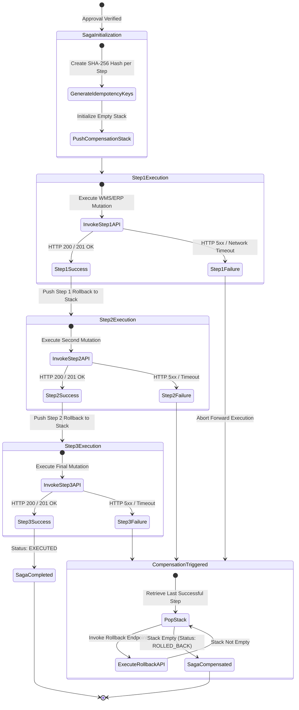

### 9.2 Exhaustive Operational Responsibilities
1. Verify `state["approval"].status == 'APPROVED'` and validate the cryptographic HMAC signature.
2. Iterate through `state["decision"].action_plan` in ascending `step_number` order (1, 2, 3).
3. Generate a deterministic idempotency key for each step: $I_{\text{key}} = \text{SHA256}(\text{case\_id} + \text{step\_number} + \text{action\_type})$.
4. Invoke `BusinessSystemWriteTool` passing $I_{\text{key}}$, `target_system`, `endpoint`, and `payload_parameters`.
5. Upon receipt of HTTP 200/201 acknowledgment, push the corresponding `rollback_procedure` onto the in-memory **Saga Compensation Stack**.
6. Persist an intermediate checkpoint after each step completion to survive node crashes.
7. If any step returns a terminal HTTP 4xx/5xx failure or exhausts its retry budget, pop rollback procedures from the compensation stack in LIFO order (Step 2 Rollback -> Step 1 Rollback) and execute external reverse mutations.

### 9.3 State & Database Contracts
- **Inputs**: `state["decision"]`, `state["approval"]`, `state["case"]`.
- **Outputs**: `state["execution"]` mutation containing `saga_logs`, `execution_status`, and `completed_steps`.
- **Shared State Reads**: `state["approval"].signature`.
- **Shared State Writes**: `state["case"].status = 'EXECUTING'`, transitioning to `'EXECUTED'` or `'ROLLED_BACK'`.
- **Database Reads**: `users` (approver verification cache).
- **Database Writes**: `executions` (insert saga step records), `actions`, `case_timeline`.
- **Events Consumed**: `sentinel.approval.granted`.
- **Events Published**: `sentinel.execution.saga.started`, `sentinel.execution.step.completed`, `sentinel.execution.saga.completed`, `sentinel.execution.compensation.triggered`.

### 9.4 Tool Access & Memory Strategy
- **Tool Access**: `BusinessSystemWriteTool` (exclusive write capability), `APIEndpointRegistryTool`.
- **Memory Usage**:
  - *Working Memory*: Manages active step payloads and Saga Compensation Stack (~2,500 tokens).
  - *Case Memory*: Persists execution acknowledgments into `state["execution"]`.

### 9.5 Output Contract (`ExecutionAgentOutput`)
```json
{
  "$schema": "http://json-schema.org/draft-07/schema#",
  "title": "ExecutionAgentOutput",
  "type": "object",
  "required": ["execution_id", "saga_status", "completed_step_count", "saga_logs"],
  "properties": {
    "execution_id": { "type": "string", "format": "uuid" },
    "saga_status": { "type": "string", "enum": ["COMPLETED", "COMPENSATED", "FAILED_UNRECOVERABLE"] },
    "completed_step_count": { "type": "integer", "minimum": 0, "maximum": 3 },
    "saga_logs": {
      "type": "array",
      "items": {
        "type": "object",
        "required": ["step_number", "idempotency_key", "http_status", "execution_timestamp"],
        "properties": {
          "step_number": { "type": "integer" },
          "idempotency_key": { "type": "string" },
          "http_status": { "type": "integer" },
          "execution_timestamp": { "type": "string", "format": "date-time" }
        }
      }
    }
  }
}
```

### 9.6 Retry & Exception Matrix
- **Retry Strategy**: 5 retries per external API call with exponential backoff (2s, 4s, 8s, 16s, 32s).
- **Timeout Strategy**: Tool execution ceiling: 10,000ms per API call; Total node execution ceiling: 45,000ms.

| Exception Code | Failure Condition Description | Deterministic System Fallback & Recovery Action |
|---|---|---|
| `ERR_EXEC_API_TIMEOUT` | External WMS endpoint fails to respond within 10,000ms after 5 retry attempts. | Halt forward execution; trigger Saga Compensation loop; mutate status to `ROLLED_BACK`. |
| `ERR_EXEC_IDEMPOTENCY_CONFLICT` | Target ERP returns HTTP 409 Conflict indicating idempotency key collision. | Treat step as already successfully executed by prior retry; advance to next action step. |
| `ERR_EXEC_COMPENSATION_FAIL` | Rollback API call fails during reverse compensation loop. | Raise critical system alarm (`CRITICAL_SAGA_DESYNC`); page on-call SRE team immediately via PagerDuty. |

### 9.7 Exact Saga Compensation Stack Execution Matrix and Rollback Topology

To guarantee atomic linearizability across distributed enterprise mutations, every forward step executed by `BusinessSystemWriteTool` pushes a corresponding inverse compensation payload onto an in-memory LIFO stack (`compensation_stack`). If step $k$ encounters a terminal unrecoverable API exception, the execution loop halts forward progress and pops steps $k-1$ down to $1$:

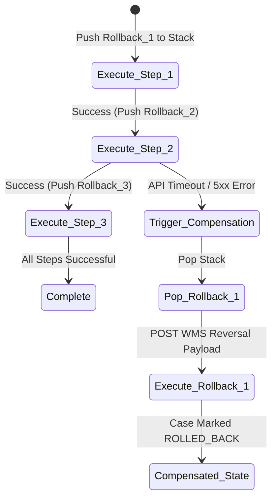

#### 9.7.1 Saga Stack Payload Serialization Schema
When storing in-flight rollback definitions inside `BusinessCaseState.execution.compensation_stack`, each element adheres strictly to the following contract:

```json
{
  "$schema": "http://json-schema.org/draft-07/schema#",
  "title": "SagaCompensationStackRecord",
  "type": "object",
  "required": ["step_sequence", "original_action_id", "target_system", "reversal_endpoint", "reversal_payload", "max_compensation_retries"],
  "properties": {
    "step_sequence": { "type": "integer" },
    "original_action_id": { "type": "string" },
    "target_system": { "type": "string", "enum": ["ERP_SAP", "WMS_MANHATTAN", "ERP_NETSUITE"] },
    "reversal_endpoint": { "type": "string", "format": "uri" },
    "reversal_payload": { "type": "object" },
    "max_compensation_retries": { "type": "integer", "default": 5 }
  }
}
```

---

## 10. Verification Agent (`agent_verification`)

### 10.1 Mission & Purpose
- **Mission**: Reconcile external enterprise systems of record post-execution to confirm physical stock quantities and financial ledgers have stabilized to expected target values, compute trailing stability scores, and validate case closure criteria.
- **Business Purpose**: Eliminates "blind execution" assumptions by providing independent, cryptographic audit proof that automated software actions successfully remediated the underlying operational anomaly in the physical real world.

### 10.2 Responsibilities
1. Impose a mandatory 10-second polling delay upon node entry to allow external ERP batch indexers and asynchronous database replicas to stabilize.
2. Query external WMS and ERP databases via `ReconciliationQueryTool` to fetch current physical inventory quantities and ledger balances for the affected SKU.
3. Compare post-action physical quantities against expected target quantities established in the approved action plan.
4. Compute discrepancy delta: $\Delta_{\text{reconciled}} = Q_{\text{actual}} - Q_{\text{expected}}$.
5. Compute trailing stability score ($S_{\text{stab}}$) evaluating whether operational variance has returned within normal Gaussian thresholds ($\pm 1\sigma$).
6. If $\Delta_{\text{reconciled}} == 0$ and $S_{\text{stab}} \ge 0.85$, mark case as verified and advance to Learning Agent.
7. If discrepancy persists after 3 polling attempts, transition case to `UNRECONCILED` and alert operators.

### 10.3 State & Database Contracts
- **Inputs**: `state["execution"]`, `state["decision"]`, `state["case"]`.
- **Outputs**: `state["verification"]` mutation containing `discrepancy_delta`, `reconciliation_passed`, and `verification_timestamp`.
- **Shared State Reads**: `state["execution"].saga_status`.
- **Shared State Writes**: `state["case"].status = 'VERIFYING'`, transitioning to `'RESOLVED'` or `'UNRECONCILED'`.
- **Database Reads**: External WMS stock ledgers, ERP financial balances.
- **Database Writes**: `case_timeline`.
- **Events Consumed**: `sentinel.execution.saga.completed`.
- **Events Published**: `sentinel.verification.reconciled`, `sentinel.verification.discrepancy.detected`.

### 10.4 Output Contract (`VerificationAgentOutput`)
```json
{
  "$schema": "http://json-schema.org/draft-07/schema#",
  "title": "VerificationAgentOutput",
  "type": "object",
  "required": ["verification_id", "reconciliation_passed", "discrepancy_delta", "stability_score"],
  "properties": {
    "verification_id": { "type": "string", "format": "uuid" },
    "reconciliation_passed": { "type": "boolean" },
    "discrepancy_delta": { "type": "integer" },
    "stability_score": { "type": "number", "minimum": 0.0, "maximum": 1.0 },
    "audit_confirmation_code": { "type": "string" }
  }
}
```

---

## 11. Learning Agent (`agent_learning`)

### 11.1 Mission & Purpose
- **Mission**: Synthesize closed-case operational telemetry into persistent organizational knowledge records, generate high-dimensional vector embeddings, dynamically adjust statistical SKU reorder thresholds, and update detection feature weights to drive continuous institutional evolution.
- **Business Purpose**: Converts every operational breakdown and resolution into a permanent enterprise training asset (Master Context §3.3), ensuring the platform becomes measurably faster, more accurate, and more autonomous over time.

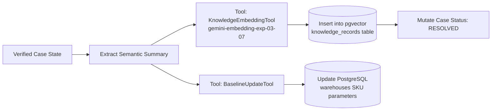

### 11.2 Responsibilities
1. Assemble verified case metadata (`root_cause_summary`, `selected_plan_id`, `execution_logs`, `verification_delta`) into a structured semantic narrative.
2. Invoke `KnowledgeEmbeddingTool` (`gemini-embedding-exp-03-07`) to compute a 768-dimensional float embedding vector representing the problem-resolution signature.
3. Execute SQL insertion into `knowledge_records` storing the vector embedding, structured JSON attributes, and resolution time metrics.
4. Calculate adjusted SKU operational parameters: update statistical reorder point ($R_{\text{new}}$) and safety stock buffer ($\text{SS}_{\text{new}}$) based on observed lead-time variances.
5. Execute update mutation against PostgreSQL `warehouses` table.
6. Emit final `sentinel.case.closed` event and commit terminal LangGraph checkpoint.

### 11.3 State & Database Contracts
- **Inputs**: `state["verification"]`, `state["investigation"]`, `state["case"]`.
- **Outputs**: `state["learning"]` mutation containing `knowledge_record_id` and `updated_baselines`.
- **Shared State Reads**: All trailing state keys.
- **Shared State Writes**: `state["case"].status = 'RESOLVED'`, `state["case"].closed_at`.
- **Database Reads**: Trailing 90-day resolution benchmarks.
- **Database Writes**: `knowledge_records` (pgvector insert), `warehouses` (update SKU parameters), `business_cases`.
- **Events Consumed**: `sentinel.verification.reconciled`.
- **Events Published**: `sentinel.learning.knowledge.extracted`, `sentinel.case.closed`.

### 11.4 Output Contract (`LearningAgentOutput`)
```json
{
  "$schema": "http://json-schema.org/draft-07/schema#",
  "title": "LearningAgentOutput",
  "type": "object",
  "required": ["learning_id", "knowledge_record_id", "embedding_generated", "baselines_updated"],
  "properties": {
    "learning_id": { "type": "string", "format": "uuid" },
    "knowledge_record_id": { "type": "string", "format": "uuid" },
    "embedding_generated": { "type": "boolean" },
    "baselines_updated": {
      "type": "array",
      "items": {
        "type": "object",
        "required": ["sku", "old_reorder_point", "new_reorder_point"],
        "properties": {
          "sku": { "type": "string" },
          "old_reorder_point": { "type": "integer" },
          "new_reorder_point": { "type": "integer" }
        }
      }
    }
  }
}
```

---
## 12. Agent Collaboration & State Transfer

### 12.1 Principles of Decoupled Cooperation
Autonomous agents inside Sentinel OS cooperate through **Strict Indirect State Exchange** (ADR-007). Unlike conversational multi-agent frameworks where agents engage in unstructured natural language dialogue or invoke peer-to-peer remote procedure calls (RPC), Sentinel OS agents operate as isolated computational nodes bound to a shared state machine orchestrator (ADR-005, ADR-006).

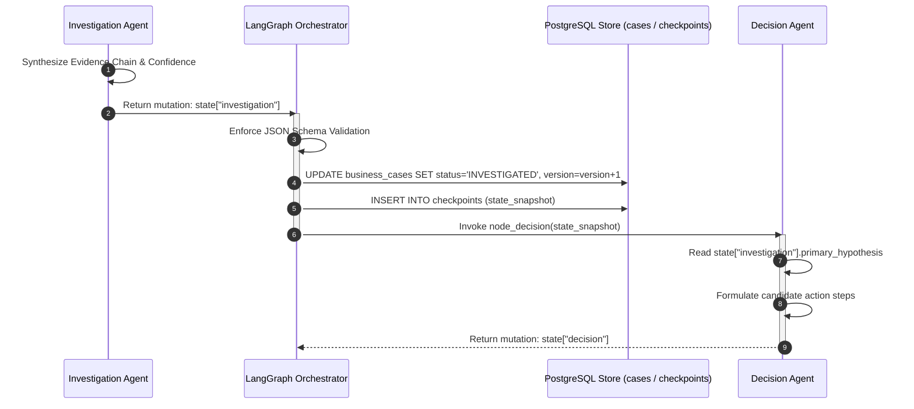

### 12.2 Ownership Transfer & Organizational Handoffs
Every node transition represents a formal transfer of operational accountability across enterprise business domains:
1. **Observation $\rightarrow$ Detection**: Ownership shifts from Data Ingestion Engineering to Quality Assurance & Inventory Control.
2. **Detection $\rightarrow$ Investigation**: Ownership shifts from QA statistical monitoring to Supply Chain Root Cause Analysts.
3. **Investigation $\rightarrow$ Decision**: Ownership shifts from Diagnostic Analysts to Financial Risk & Inventory Planners.
4. **Decision $\rightarrow$ Approval Gateway**: Ownership shifts from autonomous software to human Governance & Executive Approvers.
5. **Approval $\rightarrow$ Execution**: Ownership shifts back to automated Transaction Execution software.

### 12.3 Conflict Prevention & Concurrency Control
To prevent race conditions when multiple signals trigger concurrent agent workflows against the same warehouse facility or SKU ledger, Sentinel OS enforces strict optimistic and pessimistic locking protocols:
- **Optimistic State Locking**: Every mutation against `business_cases` validates against the integer `version` column (`UPDATE business_cases SET ..., version = version + 1 WHERE id = :id AND version = :expected_version`). If an optimistic lock exception occurs, the LangGraph node reloads the latest state from PostgreSQL and re-evaluates its invariants.
- **Distributed Resource Locking**: The Execution Agent acquires a distributed Redis lock (`lock:sku:{warehouse_id}:{sku}`) prior to invoking external WMS mutation endpoints, guaranteeing linearizable execution order across parallel sagas.

---

## 13. Memory Strategy & Hierarchical Retention

Sentinel OS rejects monolithic context stuffing. To maintain low inference latency and deterministic reasoning across multi-day warehouse events, the platform partitions memory into six isolated, functionally specialized memory tiers:

```mermaid
graph TD
    subgraph Six-Tier Enterprise Memory Architecture
        WM[1. Working Memory<br/>In-Flight Context Window (<32k Tokens)]
        CM[2. Case Memory<br/>BusinessCaseState JSONB Payload]
        KM[3. Knowledge Memory<br/>pgvector Vector Store (gemini-embedding-exp-03-07)]
        HM[4. Historical Memory<br/>Relational PostgreSQL case_timeline]
        LM[5. Long-Term Memory<br/>Analytical Rollups in ClickHouse / Data Warehouse]
        EM[6. Ephemeral Memory<br/>Redis Tool Buffer & Rate Limiters]
    end

    WM <-->|Read / Mutate| CM
    CM -->|Persist Checkpoint| HM
    HM -->|Vectorize Resolved Cases| KM
    HM -->|Nightly ETL| LM
    WM <-->|Cache / Buffer| EM
```

### 13.1 Memory Tier Specifications

| Memory Tier | Storage Backend | Scope & Lifecycle | Read/Write Latency | Enterprise Retention & Archival Rule |
|---|---|---|---|---|
| **1. Working Memory** | LLM Active Context Window (RAM) | Single agent node execution loop. Dissolves immediately upon node exit. | $< 10$ ms | 0 seconds post-node completion. Never persisted directly to disk. |
| **2. Case Memory** | PostgreSQL `business_cases.state` (JSONB) | Bound to active case lifecycle (`OBSERVED` through `RESOLVED`). | $5 - 15$ ms | Retained in hot operational DB for 90 days post-closure, then archived. |
| **3. Knowledge Memory** | PostgreSQL `knowledge_records` (pgvector 768-dim) | Cross-tenant global organizational knowledge. Immune to case expiration. | $15 - 40$ ms (Cosine Search) | Retained indefinitely; pruned only if vector similarity clusters decay below 0.10 relevance over 3 years. |
| **4. Historical Memory** | PostgreSQL `case_timeline` & `audit_logs` | Immutable, append-only chronological ledger of all actions and prompts. | $10 - 25$ ms | Retained online for 7 years to satisfy financial SOX and compliance audits. |
| **5. Long-Term Memory** | External Data Warehouse (ClickHouse / Snowflake) | Aggregate analytical rollups, supplier defect trends, facility performance metrics. | $100 - 500$ ms | Retained permanently in columnar cold storage. |
| **6. Ephemeral Memory** | Redis Cluster (`sentinel:cache:*`) | Transient tool execution buffers, API rate limit counters, deduplication indices. | $< 2$ ms | Strict Time-To-Live (TTL) expiration between 60 seconds and 24 hours. |

### 13.2 Distributed Redis Ephemeral Cache Keyspace & Rate Limiting Mechanics

To safeguard downstream WMS and ERP endpoints from overwhelming query spikes during large-scale inventory rebalancing events, all autonomous agents pass through an ephemeral Redis cache layer and token bucket rate limiter prior to executing network tool proxies:

| Redis Key Pattern (`sentinel:cache:*`) | Data Type | TTL (Seconds) | Primary Reading / Mutating Agent | Purpose & Invalidation Strategy |
|---|---|---|---|---|
| `dedup:event:{hash(payload)}` | String (`"1"`) | $600$ (10 min) | `Observation Agent` | High-speed anomaly deduplication window; prevents identical WMS sensor bursts from initializing duplicate state machines. |
| `ratelimit:api:{tenant_id}:{tool_name}` | Hash (`tokens`, `ts`) | $60$ (1 min rolling) | LangGraph Tool Sandbox | Token bucket counter enforcing tenant API budget quotas ($C_{\text{max}} = 100$ req/min). |
| `registry:facility:{warehouse_id}` | String (JSON payload) | $86,400$ (24 hours) | All Agents (`FacilityRegistryLookupTool`) | Cached static warehouse operating hours, dock capacity limits, and managerial contact lists. |
| `lock:sku:{warehouse_id}:{sku}` | String (`agent_execution`) | $30$ (Lease duration) | `Execution Agent` | Distributed Redlock ensuring linearizable single-actor mutation order against external WMS stock ledgers. |
| `vector:query_cache:{hash(query)}` | String (JSON payload) | $3,600$ (1 hour) | `Investigation Agent` | Caches high-dimensional vector search results for frequently repeating operational failure queries. |

---


## 14. Model Strategy & Routing Matrix

Sentinel OS enforces a **Tiered Model Routing Matrix** (ADR-013). Assigning every agent to a premier, maximum-parameter reasoning model inflates operational execution costs and introduces unnecessary latency. Conversely, routing complex root-cause investigations to lightweight models degrades diagnostic accuracy.

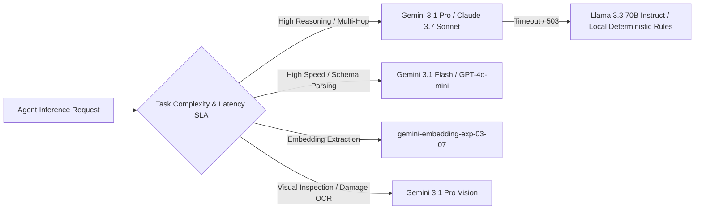

### 14.1 Agent-to-Model Assignment Matrix

| Agent Node | Primary Recommended Model | Latency Ceiling | Target Temperature | Primary Model Rationale | Fallback Model & Circuit Breaker Policy |
|---|---|---|---|---|---|
| **Observation Agent** | `gemini-3.1-flash` | $2,000$ ms | $0.0$ | High-velocity, low-latency parsing of unstructured operator notes requires maximum throughput and near-zero cost. | Fallback to deterministic regex schema extractor if model latency exceeds 2,000ms. |
| **Detection Agent** | *Deterministic Engine* | $1,000$ ms | N/A | Statistical scoring uses exact Z-score and Isolation Forest math; no LLM inference required. | Pure mathematical computation; no LLM dependency. |
| **Investigation Agent** | `gemini-3.1-pro` | $15,000$ ms | $0.1$ | Deep relational SQL synthesis, DAG causal hypothesis construction, and Bayesian ranking require premier reasoning capacity. | Fallback to `claude-3-7-sonnet` on API 5xx; if both fail, degrade to rule-based SQL ledger summary. |
| **Decision Agent** | `gemini-3.1-pro` | $10,000$ ms | $0.2$ | Multi-variable optimization and structured 3-step action plan generation mandate strict schema compliance and rollback planning. | Fallback to `claude-3-7-sonnet`; if unavailable, route case to manual planning queue. |
| **Approval Gateway** | *Deterministic Gate* | $500$ ms | N/A | Cryptographic HMAC signature verification and RBAC lookup; zero AI involvement. | N/A (Cryptographic execution). |
| **Execution Agent** | *Deterministic Engine* | $5,000$ ms | N/A | API mutation orchestration and Saga stack compensation must remain 100% deterministic. | N/A (API executor engine). |
| **Verification Agent** | `gemini-3.1-flash` | $3,000$ ms | $0.0$ | Fast tabular comparison between expected and actual WMS stock quantities. | Fallback to deterministic numerical delta comparator ($\Delta = Q_{\text{actual}} - Q_{\text{expected}}$). |
| **Learning Agent** | `gemini-embedding-exp-03-07` | $3,000$ ms | N/A | High-dimensional 768-float embedding extraction for persistent vector knowledge indexing. | Fallback to `text-embedding-3-large` if primary embedding API experiences outage. |

---

## 15. Tool Access Matrix & Permission Boundaries

To enforce the **Principle of Least Privilege** and eliminate cross-agent privilege escalation vectors, Sentinel OS maintains a hardcoded, runtime-enforced Tool Access Matrix. The LangGraph tool sandbox intercepts every tool invocation request and verifies the agent's authorization before executing underlying database drivers or HTTP clients.

| Executable Tool Proxy Name | Tool Category | Obs Agent | Det Agent | Inv Agent | Dec Agent | Appr Gate | Exec Agent | Ver Agent | Learn Agent |
|---|---|:---:|:---:|:---:|:---:|:---:|:---:|:---:|:---:|
| `TelemetryValidationTool` | Schema Verification | **X** | D | D | D | D | D | D | D |
| `FacilityRegistryLookupTool` | Metadata Cache Read | **R** | **R** | **R** | **R** | D | D | D | D |
| `StatisticalBaselineQueryTool` | PostgreSQL Math Read | D | **R** | **R** | D | D | D | D | **R** |
| `DeduplicationIndexQueryTool` | Active Case Read | D | **R** | D | D | D | D | D | D |
| `PurchaseOrderQueryTool` | ERP Ledger Read | D | D | **R** | **R** | D | D | **R** | D |
| **`WarehouseLogQueryTool`** | WMS Receipt Read | D | D | **R** | D | D | D | **R** | D |
| `SupplierLookupTool` | Vendor SLA Read | D | D | **R** | **R** | D | D | D | D |
| `KnowledgeSearchTool` | pgvector Vector Read | D | D | **R** | **R** | D | D | D | D |
| `CostSimulationTool` | Monte Carlo Calculator | D | D | D | **X** | D | D | D | D |
| `SafetyStockRuleTool` | Policy Evaluator Read | D | D | D | **R** | D | D | D | **R** |
| `ScenarioTemplateLookupTool` | Remediation Blueprint Read | D | D | D | **R** | D | D | D | D |
| **`BusinessSystemWriteTool`** | External WMS/ERP Mutation | D | D | D | D | D | **W** | D | D |
| `ReconciliationQueryTool` | Post-Action Audit Read | D | D | D | D | D | D | **R** | D |
| `KnowledgeEmbeddingTool` | Vector Generation | D | D | D | D | D | D | D | **X** |
| `BaselineUpdateTool` | SKU Math Update | D | D | D | D | D | D | D | **W** |

Legend: **R** = Read-Only Access | **W** = State Mutation Access | **X** = Stateless Computational Execution | **D** = Permission Explicitly Denied (Throws Runtime Security Exception)

### 15.2 Rigorous Tool Execution Contracts & API Definitions

Every tool proxy listed in the matrix adheres to a strict input/output JSON schema contract. When an agent requests a tool call, the LangGraph sandbox intercepts the invocation, validates the input parameters against the tool's schema, executes the underlying driver under an unprivileged database role or network proxy, and formats the response.

#### 15.2.1 `PurchaseOrderQueryTool`
- **Execution Target**: Read-only PostgreSQL query against `purchase_orders` and `purchase_order_items`.
- **Timeout Ceiling**: 5,000 ms.
- **Input Contract**:
```json
{
  "$schema": "http://json-schema.org/draft-07/schema#",
  "title": "PurchaseOrderQueryInput",
  "type": "object",
  "required": ["sku", "window_start_utc", "window_end_utc"],
  "properties": {
    "sku": { "type": "string", "pattern": "^[A-Z0-9]{6,12}$" },
    "warehouse_id": { "type": ["string", "null"], "format": "uuid" },
    "window_start_utc": { "type": "string", "format": "date-time" },
    "window_end_utc": { "type": "string", "format": "date-time" },
    "limit": { "type": "integer", "default": 50, "maximum": 200 }
  }
}
```
- **Output Contract**:
```json
{
  "$schema": "http://json-schema.org/draft-07/schema#",
  "title": "PurchaseOrderQueryOutput",
  "type": "object",
  "required": ["query_timestamp", "total_matched", "orders"],
  "properties": {
    "query_timestamp": { "type": "string", "format": "date-time" },
    "total_matched": { "type": "integer" },
    "orders": {
      "type": "array",
      "items": {
        "type": "object",
        "required": ["po_id", "supplier_id", "sku", "ordered_quantity", "received_quantity", "unit_price_usd", "expected_delivery", "status"],
        "properties": {
          "po_id": { "type": "string", "format": "uuid" },
          "supplier_id": { "type": "string" },
          "sku": { "type": "string" },
          "ordered_quantity": { "type": "integer" },
          "received_quantity": { "type": "integer" },
          "unit_price_usd": { "type": "number" },
          "expected_delivery": { "type": "string", "format": "date" },
          "status": { "type": "string", "enum": ["OPEN", "PARTIALLY_RECEIVED", "CLOSED", "CANCELLED"] }
        }
      }
    }
  }
}
```

#### 15.2.2 `WarehouseLogQueryTool`
- **Execution Target**: Read-only query against WMS dock receiving records (`warehouse_receipts`).
- **Timeout Ceiling**: 5,000 ms.
- **Input Contract**:
```json
{
  "$schema": "http://json-schema.org/draft-07/schema#",
  "title": "WarehouseLogQueryInput",
  "type": "object",
  "required": ["sku", "warehouse_id"],
  "properties": {
    "sku": { "type": "string" },
    "warehouse_id": { "type": "string", "format": "uuid" },
    "po_id": { "type": ["string", "null"], "format": "uuid" },
    "lookback_days": { "type": "integer", "default": 14, "maximum": 60 }
  }
}
```
- **Output Contract**:
```json
{
  "$schema": "http://json-schema.org/draft-07/schema#",
  "title": "WarehouseLogQueryOutput",
  "type": "object",
  "required": ["receipts"],
  "properties": {
    "receipts": {
      "type": "array",
      "items": {
        "type": "object",
        "required": ["receipt_id", "po_id", "sku", "quantity_received", "quantity_damaged", "dock_timestamp", "operator_badge"],
        "properties": {
          "receipt_id": { "type": "string", "format": "uuid" },
          "po_id": { "type": "string", "format": "uuid" },
          "sku": { "type": "string" },
          "quantity_received": { "type": "integer" },
          "quantity_damaged": { "type": "integer" },
          "dock_timestamp": { "type": "string", "format": "date-time" },
          "operator_badge": { "type": "string" }
        }
      }
    }
  }
}
```

#### 15.2.3 `KnowledgeSearchTool`
- **Execution Target**: High-dimensional cosine similarity search against `knowledge_records` pgvector table using `gemini-embedding-exp-03-07` query embedding.
- **Timeout Ceiling**: 8,000 ms.
- **Input Contract**:
```json
{
  "$schema": "http://json-schema.org/draft-07/schema#",
  "title": "KnowledgeSearchInput",
  "type": "object",
  "required": ["query_text", "sku_category"],
  "properties": {
    "query_text": { "type": "string", "minLength": 10, "maxLength": 500 },
    "sku_category": { "type": "string" },
    "min_similarity": { "type": "number", "default": 0.75, "minimum": 0.50, "maximum": 1.0 },
    "top_k": { "type": "integer", "default": 5, "maximum": 15 }
  }
}
```
- **Output Contract**:
```json
{
  "$schema": "http://json-schema.org/draft-07/schema#",
  "title": "KnowledgeSearchOutput",
  "type": "object",
  "required": ["matches"],
  "properties": {
    "matches": {
      "type": "array",
      "items": {
        "type": "object",
        "required": ["record_id", "similarity_score", "historical_case_id", "root_cause_summary", "successful_remediation_plan"],
        "properties": {
          "record_id": { "type": "string", "format": "uuid" },
          "similarity_score": { "type": "number" },
          "historical_case_id": { "type": "string", "format": "uuid" },
          "root_cause_summary": { "type": "string" },
          "successful_remediation_plan": { "type": "string" }
        }
      }
    }
  }
}
```

#### 15.2.4 `CostSimulationTool`
- **Execution Target**: Stateless deterministic Monte Carlo financial simulation engine.
- **Timeout Ceiling**: 4,000 ms.
- **Input Contract**:
```json
{
  "$schema": "http://json-schema.org/draft-07/schema#",
  "title": "CostSimulationInput",
  "type": "object",
  "required": ["candidate_strategies", "sku", "shortage_quantity", "unit_cost_usd"],
  "properties": {
    "sku": { "type": "string" },
    "shortage_quantity": { "type": "integer" },
    "unit_cost_usd": { "type": "number" },
    "candidate_strategies": {
      "type": "array",
      "items": {
        "type": "object",
        "required": ["strategy_id", "action_type", "expedite_freight_usd", "holding_days_delta"],
        "properties": {
          "strategy_id": { "type": "string" },
          "action_type": { "type": "string" },
          "expedite_freight_usd": { "type": "number" },
          "holding_days_delta": { "type": "integer" }
        }
      }
    }
  }
}
```
- **Output Contract**:
```json
{
  "$schema": "http://json-schema.org/draft-07/schema#",
  "title": "CostSimulationOutput",
  "type": "object",
  "required": ["simulation_results"],
  "properties": {
    "simulation_results": {
      "type": "array",
      "items": {
        "type": "object",
        "required": ["strategy_id", "expected_total_cost_usd", "p95_cost_upper_bound_usd", "stockout_risk_reduction_pct"],
        "properties": {
          "strategy_id": { "type": "string" },
          "expected_total_cost_usd": { "type": "number" },
          "p95_cost_upper_bound_usd": { "type": "number" },
          "stockout_risk_reduction_pct": { "type": "number" }
        }
      }
    }
  }
}
```

#### 15.2.5 `BusinessSystemWriteTool`
- **Execution Target**: Stateful transactional REST mutation against external WMS/ERP endpoints.
- **Timeout Ceiling**: 10,000 ms.
- **Input Contract**:
```json
{
  "$schema": "http://json-schema.org/draft-07/schema#",
  "title": "BusinessSystemWriteInput",
  "type": "object",
  "required": ["idempotency_key", "target_system", "action_type", "payload"],
  "properties": {
    "idempotency_key": { "type": "string", "pattern": "^[a-f0-9]{64}$" },
    "target_system": { "type": "string", "enum": ["ERP_SAP", "WMS_MANHATTAN", "ERP_NETSUITE"] },
    "action_type": { "type": "string" },
    "payload": { "type": "object" }
  }
}
```
- **Output Contract**:
```json
{
  "$schema": "http://json-schema.org/draft-07/schema#",
  "title": "BusinessSystemWriteOutput",
  "type": "object",
  "required": ["success", "http_status_code", "transaction_reference_id", "execution_timestamp"],
  "properties": {
    "success": { "type": "boolean" },
    "http_status_code": { "type": "integer" },
    "transaction_reference_id": { "type": "string" },
    "execution_timestamp": { "type": "string", "format": "date-time" },
    "error_details": { "type": ["string", "null"] }
  }
}
```

---

## 16. Security Model & Prompt Threat Mitigation

Autonomous agents possessing tool execution capabilities represent high-value targets for adversarial attacks, prompt injection vectors, and data exfiltration attempts. Sentinel OS implements a four-layer defense-in-depth security model:

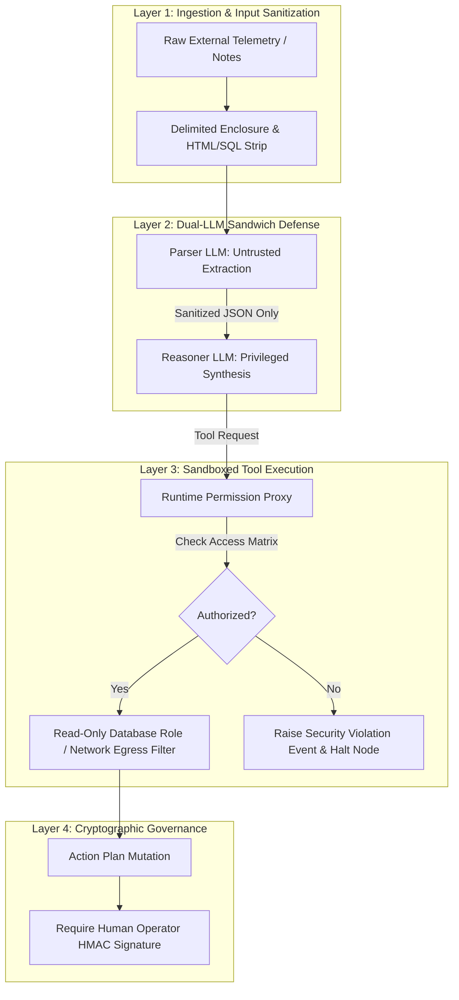

### 16.1 Prompt Injection Defenses
1. **Strict Delimiter Encapsulation**: All untrusted strings extracted from external telemetry (e.g., operator notes, vendor shipment comments) are enclosed within randomized, cryptographically generated XML delimiters (`<untrusted_input_4f9a>...</untrusted_input_4f9a>`). System prompts explicitly command the LLM to ignore any system instructions contained inside those delimiters.
2. **Dual-LLM Sandwich Architecture**: For untrusted data sources, Sentinel OS uses an unprivileged, read-only "Parser LLM" (`gemini-3.1-flash`) to extract primitive structured keys. Only the validated JSON schema output—stripped of all conversational prose—is passed to the privileged "Reasoner LLM" (`gemini-3.1-pro`).

### 16.2 Runtime Sandboxing & Secret Management
- **Database Role Isolation**: When the `Investigation Agent` executes SQL queries via tools, the underlying database pool connects using an unprivileged PostgreSQL role (`sentinel_investigator_ro`) restricted via `GRANT SELECT ON purchase_orders, warehouse_receipts TO sentinel_investigator_ro`. Any attempt to execute `DROP`, `ALTER`, `INSERT`, or `UPDATE` throws a database-level permission denied exception.
- **Network Egress Whitelisting**: Agent runtime containers operate inside Kubernetes pods with strict Calico network policies blocking outbound public internet access. Agents can only communicate with internal database clusters, Redis, and whitelisted WMS/ERP API endpoints via mutual TLS (mTLS).
- **Secrets Management**: API tokens and cryptographic signing keys are injected at runtime via HashiCorp Vault ephemeral secrets engines. Agents never store secrets in environment variables or working memory.

---

## 17. Observability, Telemetry & Audit Specifications

Every agent execution hop inside Sentinel OS emits standardized OpenTelemetry (OTel) telemetry spans, metrics, and structured audit logs (Master Context §6.5, ADR-010).

### 17.1 OpenTelemetry Metrics Inventory

| Metric Name | Instrument Type | Unit | Description & Dimensions |
|---|---|---|---|
| `sentinel.agent.node.duration` | Histogram | Milliseconds | Latency of complete LangGraph node execution. Dimensions: `agent_name`, `status` (`SUCCESS`, `FAIL`), `tenant_id`. |
| `sentinel.agent.llm.tokens` | Counter | Count | Total token consumption. Dimensions: `agent_name`, `model`, `token_type` (`prompt`, `completion`). |
| `sentinel.agent.llm.cost_usd` | Counter | US Dollars | Estimated financial cost of inference hop. Dimensions: `agent_name`, `model`. |
| `sentinel.agent.tool.invocations` | Counter | Count | Total tool proxy calls executed. Dimensions: `agent_name`, `tool_name`, `http_status`. |
| `sentinel.agent.validation.failures`| Counter | Count | Number of structured output schema validation errors. Dimensions: `agent_name`, `error_code`. |
| `sentinel.saga.compensation.rate` | Gauge | Ratio | Ratio of triggered compensation rollbacks versus completed execution sagas over a trailing 1-hour window. |

### 17.2 Distributed Tracing Specification
Every operational business case initiates a root tracing span (`trace_id = case_id`). As the LangGraph state machine routes across nodes, child spans are derived with strict W3C TraceContext propagation:
- **Root Span**: `sentinel.workflow.case_execution` (`attributes: {case_id, tenant_id, priority_score}`)
  - **Child Span**: `sentinel.agent.observation`
  - **Child Span**: `sentinel.agent.detection`
  - **Child Span**: `sentinel.agent.investigation`
    - **Grandchild Span**: `sentinel.tool.sql_query` (`attributes: {table: purchase_orders, execution_ms: 142}`)
    - **Grandchild Span**: `sentinel.tool.vector_search` (`attributes: {index: knowledge_records, matches: 5}`)
    - **Grandchild Span**: `sentinel.llm.inference` (`attributes: {model: gemini-3.1-pro, prompt_tokens: 4120, completion_tokens: 680}`)

### 17.3 Immutable Audit Logging Schema
Every state mutation writes an immutable JSON log record to the PostgreSQL `audit_logs` table:
```json
{
  "audit_id": "c39a8b11-5421-4d89-9182-381092481029",
  "case_id": "a1102394-8812-4b21-a712-990182410923",
  "timestamp_utc": "2026-07-03T10:55:00.123Z",
  "actor_type": "AUTONOMOUS_AGENT",
  "actor_id": "agent_investigation",
  "action_executed": "MUTATE_CASE_STATE",
  "target_entity": "BusinessCaseState.investigation",
  "previous_state_hash": "e3b0c44298fc1c149afbf4c8996fb92427ae41e4649b934ca495991b7852b855",
  "new_state_hash": "f4c8996fb92427ae41e4649b934ca495991b7852b855e3b0c44298fc1c149afb",
  "reasoning_rationale": "Root cause established: 250 unit shortage attributed to supplier shipment split verified via PO receipt REC-88912.",
  "compliance_signature": "HMAC-SHA256-SIGNATURE-STRING"
}
```

### 17.4 Tenant Financial Cost & Token Budget Allocation Matrix

To prevent runaway inference costs during wide-scale supply chain anomalies, Sentinel OS enforces strict real-time financial chargebacks per tenant. Every agent node hop calculates its cumulative financial burn rate ($C_{\text{hop}}$) based on token usage:

$$C_{\text{hop}} = \left( \frac{N_{\text{prompt}}}{1,000,000} \times P_{\text{in}} \right) + \left( \frac{N_{\text{completion}}}{1,000,000} \times P_{\text{out}} \right)$$

| Agent Node | Primary Model Routed | Unit Cost $P_{\text{in}}$ / 1M Tokens | Unit Cost $P_{\text{out}}$ / 1M Tokens | Target Max Tokens / Case | Max Financial Budget / Case | Action Exceeding Budget |
|---|---|---|---|---|---|---|
| **Observation** | `gemini-3.1-flash` | $\$0.075$ | $\$0.30$ | $4,000$ | $\$0.0015$ | Truncate payload; alert telemetry drift. |
| **Detection** | *Deterministic Math* | $\$0.00$ | $\$0.00$ | $0$ | $\$0.0000$ | N/A (Pure CPU math). |
| **Investigation** | `gemini-3.1-pro` | $\$1.25$ | $\$5.00$ | $25,000$ | $\$0.1562$ | Halt tool loop; force partial causal graph synthesis. |
| **Decision** | `gemini-3.1-pro` | $\$1.25$ | $\$5.00$ | $15,000$ | $\$0.0937$ | Degrade to static safety stock heuristic template. |
| **Verification** | `gemini-3.1-flash` | $\$0.075$ | $\$0.30$ | $3,000$ | $\$0.0011$ | Fall back to exact numeric delta diffing. |
| **Learning** | `gemini-embedding` | $\$0.02$ | N/A | $2,000$ | $\$0.00004$ | Queue record for deferred off-peak embedding ETL. |

---

## 18. Testing Strategy & Deterministic Replay

To guarantee that complex multi-agent workflows exhibit zero regression across platform upgrades, Sentinel OS replaces ad-hoc prompt testing with a rigorous four-tier automated verification hierarchy:

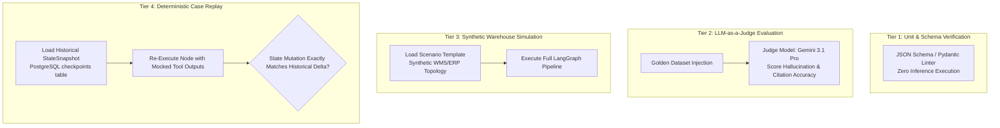

### 18.1 Testing Tiers
1. **Tier 1: Unit & Contract Verification**: Verifies that all agent output Pydantic schemas correctly compile, validate edge-case numerical boundaries, and reject malformed JSON payloads. Executed inside standard CI/CD pipelines in $< 5$ seconds.
2. **Tier 2: Golden Dataset Prompt Evaluation**: Executes agent inference against a curated golden dataset of 500 historical supply chain anomalies. An independent evaluator model (`LLM-as-a-Judge`) grades responses on a 0-100 scale against three metrics: Citation Exactness ($W_1 = 0.5$), Hypothesis Exhaustiveness ($W_2 = 0.3$), and Schema Adherence ($W_3 = 0.2$). A composite score $< 90\%$ blocks PR merging.
3. **Tier 3: Synthetic Sandbox Simulation**: Spins up ephemeral Docker containers hosting seeded PostgreSQL ERP/WMS databases and runs complete end-to-end LangGraph workflows (`node_observation` through `node_learning`) to verify Saga transactional rollback loops.
4. **Tier 4: Deterministic Historical Replay**: The most powerful verification mechanism in Sentinel OS. Engineers load any historical production `case_id` into the offline debugger tool. The test harness reads the exact sequence of `StateSnapshot` records from the `checkpoints` table, mocks all external tool calls to return the exact historical payloads recorded at that timestamp, and re-runs the agent cognitive loop. The newly generated output state delta must achieve 100% semantic parity with the historical record.

### 18.2 Golden Dataset JSON Schema & Replay Test Harness Specification

To automate Tier 2 and Tier 4 verifications, every test harness in Sentinel OS parses standardized test case definitions adhering to the `SentinelGoldenTestRecord` contract:

```json
{
  "$schema": "http://json-schema.org/draft-07/schema#",
  "title": "SentinelGoldenTestRecord",
  "type": "object",
  "required": ["test_id", "target_agent", "input_state", "mock_tool_outputs", "expected_state_mutation", "evaluation_criteria"],
  "properties": {
    "test_id": { "type": "string", "format": "uuid" },
    "target_agent": { "type": "string", "enum": ["agent_observation", "agent_detection", "agent_investigation", "agent_decision", "agent_execution", "agent_verification", "agent_learning"] },
    "input_state": { "type": "object" },
    "mock_tool_outputs": {
      "type": "object",
      "additionalProperties": {
        "type": "array",
        "items": {
          "type": "object",
          "required": ["tool_name", "invocation_parameters", "mocked_response", "simulated_latency_ms"],
          "properties": {
            "tool_name": { "type": "string" },
            "invocation_parameters": { "type": "object" },
            "mocked_response": { "type": "object" },
            "simulated_latency_ms": { "type": "integer" }
          }
        }
      }
    },
    "expected_state_mutation": { "type": "object" },
    "evaluation_criteria": {
      "type": "object",
      "required": ["min_citation_accuracy", "required_hypothesis_count", "max_latency_ms"],
      "properties": {
        "min_citation_accuracy": { "type": "number", "minimum": 0.0, "maximum": 1.0 },
        "required_hypothesis_count": { "type": "integer" },
        "max_latency_ms": { "type": "integer" }
      }
    }
  }
}
```

### 18.3 Chaos Engineering & Resilience Benchmarking
In addition to deterministic regression suites, Sentinel OS executes scheduled Chaos Engineering simulations against staging environments using automated fault injection matrices:

| Fault Injection Scenario | Target Component | Injected Failure Behavior | Expected Autonomous Agent & Workflow Resilience Response |
|---|---|---|---|
| **CHAOS-01: API Brownout** | `BusinessSystemWriteTool` | Inject random 12,000ms network latency on 50% of HTTP PUT requests. | Execution Agent intercepts latency threshold ceiling (10,000ms), aborts hanging requests, executes exponential backoff retries, and cleanly rolls back Saga stack if budget exhausts. |
| **CHAOS-02: Vector Outage** | `KnowledgeSearchTool` | Drop database connections to pgvector cluster (`HTTP 503 Service Unavailable`). | Investigation Agent catches `ERR_INV_VECTOR_DOWN`, logs warning span to OpenTelemetry, and completes root cause diagnosis relying 100% on empirical SQL ledger proofs. |
| **CHAOS-03: Malformed Telemetry** | `Observation Agent` | Inject 10,000 corrupted WMS JSON payloads with truncated UUIDs and missing SKU keys. | Observation Agent quarantines 100% of malformed payloads to Dead Letter Queue (DLQ) without throwing uncaught exceptions or leaking context window memory. |
| **CHAOS-04: Lock Contention** | Distributed Redis Lock | Hold artificial Redis lock on target SKU (`lock:sku:WH-01:SKU-8821`) for 30 seconds during Execution phase. | Execution Agent polls lock with jittered linear backoff; gracefully defers action plan execution until lock release without crashing workflow thread pool. |

---

## 19. Future Evolution & Swarm Horizons

Sentinel OS is engineered with clear architectural extension points to accommodate next-generation AI paradigms without invalidating existing core contracts:

### 19.1 Multi-Agent Swarm Bidding & Negotiation
While Version 1.0 enforces static, deterministic routing between specialized agents (`Observation` $\rightarrow$ `Detection` $\rightarrow$ `Investigation`), Version 2.0 introduces **Dynamic Swarm Orchestration**. When a complex, enterprise-wide supply chain disruption occurs across dozens of facilities simultaneously, the LangGraph engine instantiates a swarm of concurrent `Investigation Agents`, each assigned to a specific regional warehouse or supplier ledger. Agents publish competitive diagnostic bids (`confidence_score`, `time_to_resolve`) to an internal consensus arbiter node, dynamically synthesizing multi-region causal graphs.

### 19.2 Edge-Distributed Agent Topologies
To survive wide-area network disconnects between central cloud data centers and remote manufacturing facilities, Sentinel OS architecture supports deploying `Observation` and `Detection` agents directly to localized on-premise industrial edge gateways (running on lightweight Kubernetes k3s distributions). Local edge agents execute real-time anomaly detection against local WMS replicas and queue encrypted summary cases for synchronization with cloud reasoning clusters once connectivity restores.

### 19.3 Reinforcement Learning from Human Feedback (RLHF / DPO)
Every human interaction at the Approval Gateway (`node_approval`) acts as a direct reinforcement training signal. When a human operator rejects a proposed 3-step action plan or edits an estimated holding cost, the LangGraph engine emits a structured preference pair ($Y_{\text{chosen}} = \text{Human Plan}, Y_{\text{rejected}} = \text{Agent Plan}$). These preference datasets are ingested nightly into Direct Preference Optimization (DPO) pipelines to fine-tune custom domain weights, continuously aligning autonomous agent reasoning with enterprise executive judgment.

---
*End of Sentinel OS Autonomous AI Agent Engineering Specifications.*

