# Sentinel OS — Tool Layer & Model Context Protocol (MCP) Specifications (Engineering Implementation Contract)

> **Document Class:** Definitive Engineering Reference & Implementation Contract  
> **Audience:** Principal AI Architects, Senior Systems Engineers, LangGraph Orchestration Developers, Security Engineers, Enterprise Integration Architects  
> **Status:** Authoritative — Version 1.0  
> **Last Updated:** 2026-07-03  
> **Parent Documents:**  
> - [00_MASTER_CONTEXT.md](../architecture/00_MASTER_CONTEXT.md)  
> - [01_PROJECT_VISION.md](../architecture/01_PROJECT_VISION.md)  
> - [02_PRODUCT_REQUIREMENTS.md](../architecture/02_PRODUCT_REQUIREMENTS.md)  
> - [03_ARCHITECTURE.md](../architecture/03_ARCHITECTURE.md)  
> - [04_DATABASE.md](../architecture/04_DATABASE.md)  
> - [05_API_SPEC.md](../architecture/05_API_SPEC.md)  
> - [06_CAPABILITY_SPECIFICATIONS.md](../architecture/06_CAPABILITY_SPECIFICATIONS.md)  
> - [07_WORKFLOW_ENGINE.md](../architecture/07_WORKFLOW_ENGINE.md)  
> - [08_AGENT_SPECIFICATIONS.md](./08_AGENT_SPECIFICATIONS.md)  
> - [15_ARCHITECTURE_DECISIONS.md](../adr/15_ARCHITECTURE_DECISIONS.md)  
>  
> **Binding Architecture Decisions (ADRs):**  
> ADR-001 (Event-Driven Architecture), ADR-002 (Five-Layer Architecture), ADR-004 (Business Case Core Object), ADR-005 (Execution Orchestrator Pattern), ADR-006 (Single LangGraph Workflow), ADR-007 (Stateless Capabilities), ADR-008 (Human Approval Gateway), ADR-009 (Standard Event Schema), ADR-012 (Shared Schemas Package), ADR-014 (Stateless Tool Sandbox & Model Context Protocol Standard)

---

## Table of Contents

1. [Executive Summary](#1-executive-summary)
2. [Tool Philosophy & Conceptual Abstractions](#2-tool-philosophy--conceptual-abstractions)
3. [Tooling Principles (15 Core Engineering Invariants)](#3-tooling-principles-15-core-engineering-invariants)
4. [Model Context Protocol (MCP) Architecture](#4-model-context-protocol-mcp-architecture)
5. [Complete MCP Server Architecture](#5-complete-mcp-server-architecture)
6. [Enterprise Tool Categories Catalog](#6-enterprise-tool-categories-catalog)
7. [Universal Tool Contract Specification](#7-universal-tool-contract-specification)
8. [Tool Registry & Governance Architecture](#8-tool-registry--governance-architecture)
9. [MCP Resources Specification](#9-mcp-resources-specification)
10. [MCP Prompts Specification](#10-mcp-prompts-specification)
11. [Tool Invocation End-to-End Lifecycle](#11-tool-invocation-end-to-end-lifecycle)
12. [Core Database Tool Specifications](#12-core-database-tool-specifications)
13. [External Enterprise Integration Tools](#13-external-enterprise-integration-tools)
14. [Security Architecture & Threat Mitigation](#14-security-architecture--threat-mitigation)
15. [Performance, Caching & Concurrency Engineering](#15-performance-caching--concurrency-engineering)
16. [Error Handling, Resilience & Compensation](#16-error-handling-resilience--compensation)
17. [Observability, Audit & Telemetry Specifications](#17-observability-audit--telemetry-specifications)
18. [Testing Strategy & Deterministic Replay Verification](#18-testing-strategy--deterministic-replay-verification)
19. [Future Evolution & Distributed Tool Mesh Horizons](#19-future-evolution--distributed-tool-mesh-horizons)

---

## 1. Executive Summary

Sentinel OS is an **autonomous enterprise operational execution platform** designed to monitor enterprise telemetry, detect operational breakdowns across disparate systems of record, investigate relational root causes, generate risk-analyzed remediation plans, and execute state mutations against live enterprise software after securing explicit human authorization. 

To achieve zero-defect operational safety, complete auditability, and deterministic execution behavior, Sentinel OS enforces a fundamental separation between **Cognitive Synthesis** (AI Agents) and **Operational Action** (Tools). Under no circumstances is an AI Agent permitted to hold raw database handles, execute unchecked HTTP requests, maintain direct network sockets to enterprise systems, or directly invoke shell environments. All interaction between an autonomous agent and the external world occurs strictly mediated by stateless, deterministic, schema-enforced functional primitives called **Tools**, exposed and managed via the **Model Context Protocol (MCP)**.

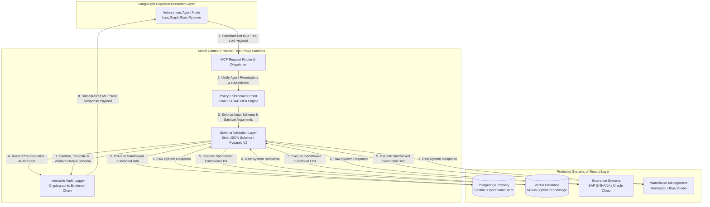

### 1.1 Why the Tool Layer Exists
1. **Decoupling Cognitive Uncertainty from System Determinism:** Large Language Models operate probabilistically. Enterprise databases and ERP systems operate deterministically. The Tool Layer acts as a structural firewall that translates probabilistic intent into deterministic, mathematically verified operational commands.
2. **Elimination of Injection and Mutation Vectors:** If an AI agent were granted direct SQL execution access, a prompt injection attack embedded within an external vendor invoice could command the agent to drop production tables or exfiltrate sensitive payroll records. By encapsulating operations within parameterized, single-purpose Tools, the system entirely eliminates SQL injection, arbitrary code execution, and un-validated state mutations.
3. **Connection Pooling and Infrastructure Protection:** Autonomous agents executing parallel LangGraph workflows can easily spawn thousands of concurrent nodes. If each agent opened direct database sockets or REST client sessions, enterprise backend infrastructure would suffer catastrophic connection starvation. The Tool Layer multiplexes, pools, rate-limits, and caches backend requests independently of agent scaling cycles.

### 1.2 Why the Model Context Protocol (MCP) Exists
Sentinel OS adopts the open **Model Context Protocol (MCP)** standard as the universal wire and discovery interface between AI Agents and the Tool Layer. MCP replaces bespoke, fragmented tool orchestration frameworks with a standardized client-server architecture:
- **Universal Tool Discovery:** Agents dynamically query MCP servers during node initialization (`tools/list`) to discover permitted tools, parameter definitions, and operational descriptions tailored to their active capability scope.
- **Controlled Resource Context:** MCP provides structured primitives (`resources/list`, `resources/read`) for injecting static and dynamic context (e.g., database schemas, WMS location dictionaries, organizational policies) directly into the agent's workspace without consuming unbounded token context windows.
- **Language & Runtime Independence:** MCP enables the core LangGraph engine (Python) to seamlessly execute tools implemented in high-performance Rust microservices, Node.js integration worker pools, or legacy Go proxies via standardized JSON-RPC 2.0 payloads over stdio or SSE transport layers.

### 1.3 Enterprise Benefits of Architecture Mediation

| Architectural Quality | Unconstrained Agent Execution (Anti-Pattern) | Sentinel OS MCP Tool Mediation Architecture |
|---|---|---|
| **Auditability** | Agent reasoning and network calls are opaque text streams; forensic analysis requires parsing ambiguous logs. | Every invocation generates a cryptographically signed, schema-validated audit event (`cases_timeline`) linking `case_id`, `agent_id`, inputs, outputs, and execution latency. |
| **Security & Access** | Agent runs with shared global credentials; vulnerability compromise yields full infrastructure access. | Zero-trust execution. Tools are sandboxed processes authenticated via ephemeral cryptographic tickets scoped to the active capability boundary and tenant identity. |
| **Testability** | Deterministic automated testing is impossible due to probabilistic API call generation and live side effects. | 100% deterministic testing via contract testing, mock MCP server injection, and exact historical replay from immutable audit logs. |
| **Scalability** | Agent scaling directly impacts backend concurrency, leading to cascading timeouts across legacy ERPs. | Tool layer enforces token-bucket rate limiting, circuit breakers, and distributed Redis caching independent of cognitive worker scaling. |

---

## 2. Tool Philosophy & Conceptual Abstractions

In Sentinel OS, clarity of architectural responsibility is non-negotiable. Senior engineers must maintain strict conceptual isolation across five core abstractions: **Capability**, **Workflow**, **Agent**, **Tool**, and **MCP**.

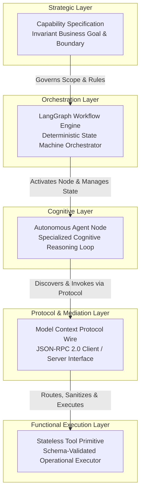

### 2.1 Formal Definitions and Conceptual Boundaries

1. **Capability Specification (`P-CAP-01` through `P-CAP-12`):**
   - *Definition:* An invariant business objective defining *what* the system must accomplish, independent of underlying technology. It defines the formal input/output schemas, domain success criteria, business risk classification, and non-negotiable operational invariants.
   - *Rule:* Capabilities never execute code directly. They are structural contracts enforced by the orchestration and execution layers.

2. **LangGraph Workflow Engine (`StateGraph`):**
   - *Definition:* The deterministic orchestration engine governing *when* cognitive and operational steps occur. It manages graph topology, conditional edge evaluation, durable checkpointing (`checkpointer`), parallel fork-join synchronization, and saga compensation loops.
   - *Rule:* The workflow engine contains zero inference logic and zero direct external integrations. It routes state between autonomous nodes based on typed boolean flags within `BusinessCaseState`.

3. **Autonomous Agent (`Agent Node Runtime`):**
   - *Definition:* A specialized cognitive synthesis unit inside a LangGraph node that governs *how* unstructured domain data is analyzed and transformed into structured operational decisions. An agent binds an LLM to a specific system prompt, domain memory, and a curated whitelist of available tools.
   - *Rule:* Agents are strictly forbidden from maintaining network sockets, database pools, or filesystem handles. Their sole external interaction mechanism is emitting structured tool invocation requests.

4. **Tool (`Stateless Operational Primitive`):**
   - *Definition:* A discrete, deterministic, stateless functional unit of work executed within a protected sandbox. A tool accepts a strictly validated JSON input payload, performs a single, highly focused operational action against an external system or internal data store, and returns a strictly validated JSON output payload.
   - *Rule:* Tools contain zero cognitive reasoning, zero LLM prompts, and zero multi-step graph orchestration logic. Given identical inputs and external system state, a tool must produce identical outputs.

5. **Model Context Protocol (`MCP`):**
   - *Definition:* The standardized communication, discovery, and transport protocol that connects AI Agents (MCP Clients) to stateless Tool Runtimes (MCP Servers). It defines the exact serialization format, error codes, authentication headers, resource injection schemes, and cancellation signaling mechanisms.
   - *Rule:* MCP is the universal translation layer. It guarantees that agents remain completely oblivious to whether a tool executes locally in memory, inside an isolated Docker container, or remotely across a multi-cloud service mesh.

### 2.2 Abstraction Boundary Matrix

| Dimension | Capability | Workflow | Agent | Tool | MCP Layer |
|---|---|---|---|---|---|
| **Primary Responsibility** | Business goal definition | State progression & control flow | Cognitive synthesis & reasoning | Deterministic operational execution | Transport, discovery & schema validation |
| **Statefulness** | Immutable contract | Stateful (`BusinessCaseState`) | Ephemeral (within node loop) | Absolutely Stateless | Stateless wire routing & caching |
| **Execution Engine** | Specification doc | LangGraph `StateGraph` | LLM Inference Engine | Python / Rust / Node sandbox | JSON-RPC 2.0 / SSE / Stdio |
| **Failure Handling** | Defines error budget | Graph retry & fallback routing | Cognitive self-correction loop | Circuit breaker & exponential backoff | Standardized JSON-RPC error codes |
| **Security Context** | Defines policy scope | Passes tenant & case context | Inherits node permissions | Enforces RBAC/ABAC token boundaries | Cryptographic mTLS & token validation |

---

## 3. Tooling Principles (15 Core Engineering Invariants)

Every engineering specification, pull request, and architecture review within the Tool Layer must strictly adhere to the following fifteen core invariants. Violation of any principle constitutes an immediate architecture defect.

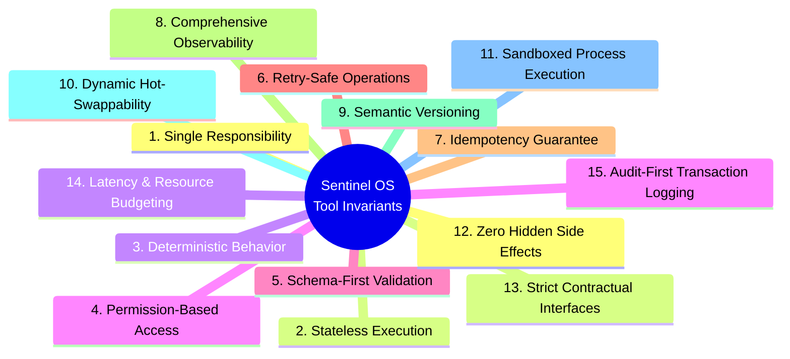

### 3.1 Exhaustive Principle Specifications

#### Principle 1: Single Responsibility Principle (SRP)
- *Explanation:* A tool must perform exactly one discrete operational action or query. Tools must not bundle multiple unrelated operations into complex, multi-step macros.
- *Invariant Rule:* If a tool requires internal conditional branching based on business logic (e.g., "if PO > $10,000 call SAP, else call local DB"), it must be split into distinct tools orchestrated by the workflow or agent.
- *Anti-Pattern:* `ExecuteProcurementWorkflowTool` (combines lookup, stock reservation, approval routing, and notification into one opaque call).

#### Principle 2: Absolutely Stateless Execution
- *Explanation:* Tools must retain zero internal state across sequential invocations. Any required context (e.g., `case_id`, `tenant_id`, `correlation_id`) must be explicitly passed within the tool invocation request.
- *Invariant Rule:* Tools must not store variables in memory, local disk, or static class members between execution runs. Every execution must be completely self-contained.
- *Anti-Pattern:* Caching authentication tokens or database cursors in a global Python variable within the tool process execution memory.

#### Principle 3: Deterministic Behavior
- *Explanation:* Given identical input arguments and identical external system state, a tool must consistently produce exact, byte-identical output payloads or deterministic error codes.
- *Invariant Rule:* Tools must never incorporate unseeded random number generation, un-normalized current timestamps (unless explicitly requested as the tool's core function), or non-deterministic dictionary sorting in their responses.
- *Anti-Pattern:* Returning un-sorted JSON arrays from database queries where ordering varies randomly between execution runs.

#### Principle 4: Permission-Based Access Control (RBAC/ABAC)
- *Explanation:* Every tool invocation must undergo rigorous cryptographic authorization verification before execution begins. Tool access is governed by both the requesting Agent's role (RBAC) and the active capability context attributes (ABAC).
- *Invariant Rule:* A tool must reject any invocation request that lacks a valid, unexpired cryptographic execution ticket explicitly granting authorization for the target tool and resource ID.
- *Anti-Pattern:* Relying solely on the prompt instructions given to the agent to prevent unauthorized tool usage.

#### Principle 5: Schema-First Validation
- *Explanation:* All inputs and outputs must be rigorously validated against strict JSON Schema definitions (compiled via Pydantic V2 in Python or Zod in TypeScript) prior to runtime execution.
- *Invariant Rule:* Extra, undefined fields passed into a tool request must trigger an immediate validation failure (`FORBIDDEN_EXTRA_FIELDS`). Output payloads that deviate from the contract schema must be blocked from returning to the agent.
- *Anti-Pattern:* Accepting arbitrary JSON objects (`Dict[str, Any]`) and performing manual string regex checking inside tool business logic.

#### Principle 6: Retry-Safe Operations
- *Explanation:* Tools must be engineered to withstand transient infrastructure failures (e.g., TCP connection dropouts, lock timeouts) by supporting safe, automated retries without risking data corruption.
- *Invariant Rule:* Read-only tools must be 100% retry-safe. Mutating tools must implement cryptographic transaction deduplication tokens to guarantee safe re-execution under retry policies.
- *Anti-Pattern:* Throwing unhandled exceptions on database deadlocks that leave upstream connection state corrupted and un-retryable.

#### Principle 7: Idempotency Guarantee for Mutating Actions
- *Explanation:* Executing a mutating tool multiple times with the identical input payload and `idempotency_key` must produce the exact same final system state as executing it a single time.
- *Invariant Rule:* Mutating tools must check the `sentinel_idempotency_ledger` table prior to executing writes. If an execution key exists, the tool must immediately return the cached historical response payload.
- *Anti-Pattern:* Executing an inventory reservation insertion directly without checking if the transaction ID was already processed during a prior network retry loop.

#### Principle 8: Comprehensive Observability & Structured Auditing
- *Explanation:* Tools must emit structured OpenTelemetry trace spans, precise runtime metrics, and standardized audit logs across every phase of their lifecycle.
- *Invariant Rule:* Every tool invocation must inject `trace_id`, `span_id`, `case_id`, and `agent_id` into all downstream database queries, API calls, and log emissions.
- *Anti-Pattern:* Printing unstructured plaintext debug messages using `print()` or standard logging without JSON formatting and correlation identifiers.

#### Principle 9: Semantic Versioning & Backward Compatibility
- *Explanation:* Tool schemas are immutable contracts. Changes to tool interfaces must strictly follow semantic versioning conventions (`MAJOR.MINOR.PATCH`).
- *Invariant Rule:* Breaking changes (removing fields, adding required input arguments, altering semantic types) require incrementing the `MAJOR` version and running parallel tool endpoints (`v1` and `v2`) for a minimum 30-day deprecation cycle.
- *Anti-Pattern:* Modifying the data type of an existing output attribute from `float` to `string` in place without updating the tool registration version.

#### Principle 10: Dynamic Hot-Swappability & Replaceability
- *Explanation:* The architecture must allow tools to be upgraded, patched, or replaced at runtime without restarting active LangGraph workflow orchestrators or interrupting ongoing cases.
- *Invariant Rule:* Tool discovery occurs dynamically via the centralized MCP Tool Registry. Agents bind to logical tool capability contracts rather than hardcoded server IP addresses or memory pointers.
- *Anti-Pattern:* Hardcoding tool execution class imports directly inside LangGraph node functions.

#### Principle 11: Sandboxed Process Execution
- *Explanation:* Tools must execute inside isolated OS sandboxes (containers, gVisor, or strict seccomp profile worker processes) to prevent unauthorized filesystem access, kernel exploits, or network pivoting.
- *Invariant Rule:* Tool execution runtimes must run as unprivileged non-root users (`UID 10001`) with read-only root filesystems and restricted Linux kernel capabilities (`CAP_DROP_ALL`).
- *Anti-Pattern:* Executing database query tools or Python code evaluation tools directly on the main host OS running the LangGraph state orchestrator.

#### Principle 12: Zero Hidden Side Effects
- *Explanation:* A tool must strictly limit its mutations to the explicit domain entities specified in its contract description. It must never perform unannounced background mutations or external data transmissions.
- *Invariant Rule:* A tool designed to query purchase order records must never modify audit tables, touch user profiles, or send telemetry to un-registered third-party analytics endpoints.
- *Anti-Pattern:* A data lookup tool silently updating an internal "last_accessed_timestamp" column on production transactional tables during a read-only query.

#### Principle 13: Strict Contractual Interfaces
- *Explanation:* Every tool must document a self-describing contractual specification detailing exact mission parameters, edge case behaviors, expected error payloads, and SLA latency boundaries.
- *Invariant Rule:* Tool documentation schemas must be machine-readable and exposed via the MCP `tools/list` protocol so agents can perform autonomous reasoning on tool suitability.
- *Anti-Pattern:* Naming tool arguments `arg1`, `data`, or `options` without descriptive markdown documentation and strict typing constraints.

#### Principle 14: Latency & Resource Budgeting
- *Explanation:* Every tool must operate within a bounded execution window and strict memory footprint. Unbounded execution runs endanger the overall workflow SLA.
- *Invariant Rule:* All tool execution requests must enforce a hard execution timeout (`default: 15,000ms`). If execution exceeds the SLA budget, the sandbox must forcefully terminate the process with an `ERR_TOOL_TIMEOUT` signal.
- *Anti-Pattern:* Executing synchronous, un-paginated database queries that scan multi-million row tables without query timeouts or row-return ceilings.

#### Principle 15: Audit-First Transaction Logging
- *Explanation:* Evidentiary logging takes precedence over action execution. For high-risk operations, the system must record intention before mutation occurs.
- *Invariant Rule:* Mutating tools must execute a write to the append-only `sentinel_audit_ledger` (recording proposed state mutation) prior to committing transactions against external enterprise systems.
- *Anti-Pattern:* Committing a financial order in SAP S/4HANA and asynchronously attempting to write an audit log afterwards without rollback protection if the logging database fails.

---

## 4. Model Context Protocol (MCP) Architecture

Sentinel OS implements an enterprise-hardened specification of the Model Context Protocol (MCP) version 2024-11-05. The MCP architecture defines how cognitive agents discover, interrogate, and execute operational tools across distributed infrastructure.

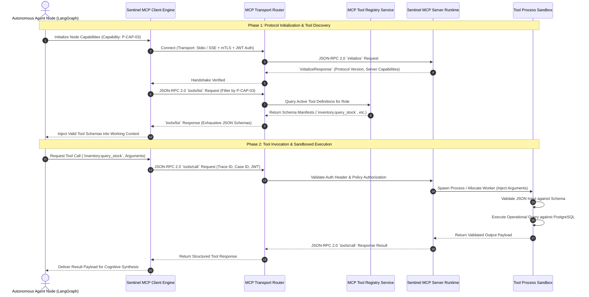

### 4.1 Wire Protocol & Transport Layers
The Sentinel OS MCP implementation supports two distinct transport protocols, dynamically selected based on execution proximity and network topology:

1. **Sandboxed Stdio Transport (Local Execution):**
   - *Use Case:* High-performance local execution where the MCP Server runs as a co-located sidecar container within the same Kubernetes pod as the LangGraph worker node.
   - *Protocol:* Standard Input / Standard Output (`stdin`/`stdout`) streams formatted strictly as newline-delimited JSON-RPC 2.0 messages (`\n`).
   - *Advantage:* Zero network overhead, microsecond transport latency, and absolute process isolation via OS pipes.

2. **Server-Sent Events (SSE) & HTTP POST Transport (Distributed Execution):**
   - *Use Case:* Distributed microservices where tools execute inside specialized remote VPCs (e.g., dedicated SAP integration clusters or secure on-premise gateways).
   - *Protocol:* Bidirectional communication where the client establishes a persistent HTTP GET connection to `/mcp/sse` to receive server-initiated events and tool responses, while emitting requests via HTTP POST to `/mcp/messages`.
   - *Advantage:* Full network observability, compatibility with enterprise API gateways, and TLS 1.3 encryption across network boundaries.

### 4.2 Protocol Handshake & Initialization
Every MCP connection begins with a mandatory initialization handshake establishing capability negotiation and protocol alignment:

```json
// Client Request: initialize
{
  "jsonrpc": "2.0",
  "id": 1,
  "method": "initialize",
  "params": {
    "protocolVersion": "2024-11-05",
    "capabilities": {
      "roots": { "listChanged": true },
      "sampling": {}
    },
    "clientInfo": {
      "name": "sentinel-agent-investigation",
      "version": "1.4.2"
    }
  }
}
```

```json
// Server Response: initializeResponse
{
  "jsonrpc": "2.0",
  "id": 1,
  "result": {
    "protocolVersion": "2024-11-05",
    "capabilities": {
      "tools": { "listChanged": true },
      "resources": { "subscribe": true, "listChanged": true },
      "prompts": { "listChanged": false }
    },
    "serverInfo": {
      "name": "sentinel-core-mcp-server",
      "version": "2.1.0"
    }
  }
}
```

### 4.3 Context Injection Mechanics
To prevent token window exhaustion and preserve cognitive focus, the MCP architecture separates **Metadata Context** from **Cognitive Prompt Context**:
- **Metadata Injection:** When an agent calls a tool, the MCP Client Engine transparently injects operational headers (`x-sentinel-case-id`, `x-sentinel-tenant-id`, `x-sentinel-trace-id`, `x-sentinel-agent-role`) directly into the JSON-RPC request envelope metadata. The agent never sees or formats these structural fields inside its LLM prompt generation loop.
- **Resource Context Injection:** Rather than pasting entire database schemas or 50-page vendor SLA documents into the agent's system prompt, the agent requests specific resource slices via `resources/read`. The MCP server returns structured, highly compressed representations directly into the tool execution memory boundary.

### 4.4 Error Propagation & Standard Codes
Errors occurring within the Tool Layer are rigorously categorized and serialized into standard JSON-RPC 2.0 error envelopes:

| JSON-RPC Error Code | Sentinel Domain Code | Error Name | Architectural Trigger & Required System Response |
|---|---|---|---|
| `-32700` | `ERR_MCP_PARSE` | Parse Error | Invalid JSON received on transport pipe. Terminate connection immediately. |
| `-32600` | `ERR_MCP_INVALID_REQ` | Invalid Request | JSON payload does not conform to JSON-RPC 2.0 specification. Drop request. |
| `-32601` | `ERR_MCP_METHOD_NOT_FOUND`| Method Not Found | Requested tool name does not exist in registry. Return discovery guidance. |
| `-32602` | `ERR_MCP_INVALID_PARAMS` | Invalid Params | Input arguments violate strict schema bounds. Return granular Pydantic error trace. |
| `-32001` | `ERR_TOOL_UNAUTHORIZED` | Unauthorized Access | Requesting agent role lacks permission ticket for tool/resource. Log security alert. |
| `-32002` | `ERR_TOOL_EXECUTION_FAIL` | Execution Breakdown| Tool execution threw unhandled exception or external system returned 5xx error. |
| `-32003` | `ERR_TOOL_TIMEOUT` | SLA Timeout | Tool execution exceeded configured latency threshold (`15,000ms`). Process killed. |
| `-32004` | `ERR_TOOL_IDEMPOTENCY` | Idempotency Conflict| Transaction collision detected on idempotency ledger. Return historical payload. |

---

## 5. Complete MCP Server Architecture

The internal architecture of the production `sentinel-mcp-server` runtime is engineered for absolute resilience, zero-trust security isolation, and massive concurrency.

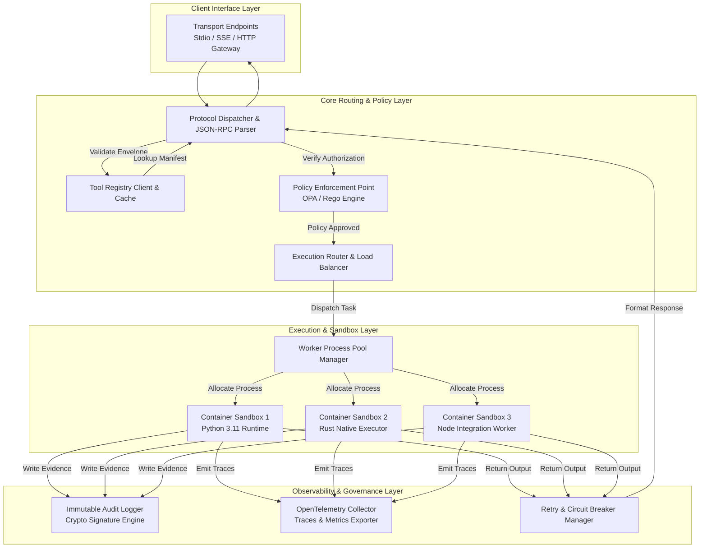

### 5.1 Component Specifications

1. **Protocol Dispatcher & JSON-RPC Parser:**
   - Parses raw incoming streams, validates JSON-RPC 2.0 structure, extracts trace headers, and validates envelope integrity. It isolates malformed payloads before allocating processing memory.

2. **Tool Registry Client & Local Cache:**
   - Maintains a read-optimized, in-memory LRU cache of active tool manifests synced continuously from the central PostgreSQL `sentinel_tool_catalog`. Guarantees sub-millisecond tool discovery resolution.

3. **Policy Enforcement Point (PEP - OPA/Rego Engine):**
   - Intercepts every invocation request prior to execution. Evaluates Open Policy Agent (Rego) policies combining the requesting Agent's JWT claims, the target Tool identity, and the active Case risk tier.

4. **Execution Router & Worker Pool Manager:**
   - Manages pools of isolated worker processes across supported runtimes (Python, Rust, Node.js). Enforces strict memory quotas (`max_rss: 512MB`) and CPU throttling (`cgroups v2`) per worker instance.

5. **Sandboxed Process Execution Engines:**
   - Ephemeral execution environments wrapped inside Linux namespaces (`PID`, `NET`, `IPC`, `MNT`) or lightweight micro-VMs (Firecracker/gVisor). Sandboxes are destroyed immediately upon task completion.

6. **Immutable Audit Logger:**
   - Asynchronously writes SHA-256 cryptographically signed transaction records to the append-only `sentinel_audit_ledger` database table. Guarantees non-repudiation of all tool invocations.

7. **Retry & Circuit Breaker Manager:**
   - Wraps external tool execution calls within Resilience4j/Tenacity state machines. Tracks failure rates per external dependency and trips circuit breakers to prevent cascading system outages.

---

## 6. Enterprise Tool Categories Catalog

Sentinel OS categorizes all tools into sixteen distinct operational domains. Each category enforces tailored security constraints, latency budgets, and execution policies.

```mermaid
graph LR
    subgraph Sentinel OS Tool Catalog
        DB[1. Database Tools]
        KN[2. Knowledge Tools]
        ERP[3. ERP Tools]
        INV[4. Inventory Tools]
        WMS[5. WMS Tools]
        NOT[6. Notification Tools]
        APP[7. Approval Tools]
        SIM[8. Simulation Tools]
        ANA[9. Analytics Tools]
        FS[10. Filesystem Tools]
        SCH[11. Search Tools]
        VEC[12. Vector Tools]
        EML[13. Email Tools]
        SLK[14. Slack/Teams Tools]
        WEB[15. Webhook Tools]
        RST[16. REST/GraphQL Tools]
    end
```

### 6.1 Exhaustive Category Engineering Matrix

| Category ID | Category Name | Primary Operational Mission | Permitted Action Scope | Latency Budget (P99) | Default Circuit Breaker Threshold |
|---|---|---|---|---|---|
| `CAT-01` | **Database Tools** | Structured SQL querying and transactional state mutation against core operational databases. | Read/Write (`sentinel_*` tables only). Strictly parameterized SQL. | `2,500ms` | 5 consecutive failures / 30s window |
| `CAT-02` | **Knowledge Tools** | Interrogating unstructured corporate documentation, SOPs, and engineering guidelines. | Read-Only vector search and graph traversal across embedded corpora. | `3,500ms` | 10 consecutive failures / 60s window |
| `CAT-03` | **ERP Tools** | Integration with enterprise resource planning systems (SAP S/4HANA, Oracle Cloud ERP). | Financial ledgers, purchase orders, vendor master records, billing invoices. | `8,000ms` | 3 consecutive failures / 30s window |
| `CAT-04` | **Inventory Tools** | Multi-echelon stock level verification, SKU tracking, and allocation reservations. | Read/Write against inventory master ledgers and SKU safety buffers. | `1,500ms` | 5 consecutive failures / 30s window |
| `CAT-05` | **WMS Tools** | Warehouse Management System execution (Manhattan, Blue Yonder, local WMS). | Bin locations, pick-pack-ship queues, forklift task routing, dock scheduling. | `2,000ms` | 5 consecutive failures / 30s window |
| `CAT-06` | **Notification Tools** | Dispatching multi-channel alerts to operational personnel and system operators. | Email, SMS, PagerDuty, enterprise dashboard event broadcast. | `3,000ms` | 10 consecutive failures / 60s window |
| `CAT-07` | **Approval Tools** | Interfacing with human authorization gateways and cryptographic sign-off workflows. | Creating approval tickets, querying token status, verifying digital signatures. | `1,000ms` | 5 consecutive failures / 30s window |
| `CAT-08` | **Simulation Tools** | Running mathematical risk models, Monte Carlo supply chain disruptions, and digital twins. | Ephemeral execution of deterministic stochastic simulation algorithms. | `12,000ms` | 3 consecutive failures / 60s window |
| `CAT-09` | **Analytics Tools** | Statistical aggregation, time-series forecasting, and KPI computation across historical data. | Read-Only analytical queries against ClickHouse / Snowflake data warehouses. | `6,000ms` | 5 consecutive failures / 60s window |
| `CAT-10` | **Filesystem Tools** | Secure reading and generating of transient operational files (CSV export, PDF generation). | Read/Write strictly restricted to ephemeral container scratch directory (`/tmp/sentinel`). | `1,500ms` | 10 consecutive failures / 30s window |
| `CAT-11` | **Search Tools** | Federated full-text search across enterprise intranets, Jira, Confluence, and ServiceNow. | Read-Only indexed keyword search across authorized enterprise platforms. | `3,000ms` | 8 consecutive failures / 45s window |
| `CAT-12` | **Vector Search Tools**| High-dimensional dense similarity search across Milvus/Qdrant vector databases. | Read-Only approximate nearest neighbor (ANN) vector embedding queries. | `800ms` | 10 consecutive failures / 30s window |
| `CAT-13` | **Email Tools** | Parsing incoming vendor communication and dispatching formal organizational notices. | Read IMAP/MS Graph mailboxes; Send SMTP via DKIM-signed mail gateways. | `4,000ms` | 5 consecutive failures / 45s window |
| `CAT-14` | **Slack/Teams Tools** | Interactive collaboration messaging, posting Adaptive Cards, and reading thread context. | Post messages, update interactive card states, query dedicated operational channels. | `2,000ms` | 8 consecutive failures / 30s window |
| `CAT-15` | **Webhook Tools** | Dispatching signed event notifications to third-party logistics partners and external webhooks. | Outbound HTTP POST payloads secured via HMAC-SHA256 signature generation. | `3,500ms` | 5 consecutive failures / 30s window |
| `CAT-16` | **REST/GraphQL Tools**| Generic OpenAPI/GraphQL invocation adapters for long-tail enterprise software endpoints. | Dynamic REST/GraphQL client execution governed by OpenAPI schema definitions. | `5,000ms` | 4 consecutive failures / 30s window |

---

## 7. Universal Tool Contract Specification

Every tool deployed within Sentinel OS must strictly implement the Universal Tool Contract. This contract defines an immutable interface blueprint guaranteeing schema enforcement, observability, security authorization, and automated lifecycle governance.

### 7.1 Exhaustive JSON Schema Contract Definition (`UniversalToolContract.schema.json`)
```json
{
  "$schema": "https://json-schema.org/draft/2020-12/schema",
  "$id": "https://sentinel.internal/schemas/v1/UniversalToolContract.schema.json",
  "title": "SentinelUniversalToolContract",
  "description": "Authoritative meta-schema defining the contract for all operational tools within Sentinel OS.",
  "type": "object",
  "required": [
    "tool_id", "category_id", "version", "mission", "business_purpose",
    "inputs_schema", "outputs_schema", "permissions", "retry_policy",
    "timeout_ms", "failure_modes", "security_profile"
  ],
  "properties": {
    "tool_id": {
      "type": "string",
      "pattern": "^[a-z_]{2,32}\\.[a-z_]{2,32}\\.[a-z0-9_]{2,64}$",
      "description": "Hierarchical tool identifier (e.g., inventory.query.stock_levels)."
    },
    "category_id": {
      "type": "string",
      "pattern": "^CAT-(0[1-9]|1[0-6])$"
    },
    "version": {
      "type": "string",
      "pattern": "^[0-9]+\\.[0-9]+\\.[0-9]+$"
    },
    "mission": {
      "type": "string",
      "minLength": 20,
      "maxLength": 300,
      "description": "Concise single-sentence operational objective."
    },
    "business_purpose": {
      "type": "string",
      "minLength": 50,
      "description": "Exhaustive explanation of enterprise justification and operational value."
    },
    "inputs_schema": {
      "type": "object",
      "description": "Strict JSON Schema draft 2020-12 definition of input arguments."
    },
    "outputs_schema": {
      "type": "object",
      "description": "Strict JSON Schema draft 2020-12 definition of success output payload."
    },
    "permissions": {
      "type": "object",
      "required": ["allowed_roles", "required_abac_attributes", "requires_human_approval"],
      "properties": {
        "allowed_roles": {
          "type": "array",
          "items": { "type": "string" },
          "minItems": 1
        },
        "required_abac_attributes": {
          "type": "array",
          "items": { "type": "string" }
        },
        "requires_human_approval": { "type": "boolean" }
      }
    },
    "retry_policy": {
      "type": "object",
      "required": ["max_retries", "backoff_strategy", "is_idempotent"],
      "properties": {
        "max_retries": { "type": "integer", "minimum": 0, "maximum": 10 },
        "backoff_strategy": { "type": "string", "enum": ["NONE", "FIXED", "EXPONENTIAL"] },
        "is_idempotent": { "type": "boolean" }
      }
    },
    "timeout_ms": {
      "type": "integer",
      "minimum": 100,
      "maximum": 60000
    },
    "failure_modes": {
      "type": "array",
      "items": {
        "type": "object",
        "required": ["error_code", "description", "is_retryable"],
        "properties": {
          "error_code": { "type": "string" },
          "description": { "type": "string" },
          "is_retryable": { "type": "boolean" }
        }
      }
    },
    "security_profile": {
      "type": "object",
      "required": ["network_access_tier", "filesystem_access", "secret_vault_keys"],
      "properties": {
        "network_access_tier": { "type": "string", "enum": ["NONE", "INTERNAL_DB", "ERP_VPC", "EGRESS_WHITELIST"] },
        "filesystem_access": { "type": "string", "enum": ["NONE", "EPHEMERAL_SCRATCH_ONLY"] },
        "secret_vault_keys": { "type": "array", "items": { "type": "string" } }
      }
    }
  },
  "additionalProperties": false
}
```

### 7.2 Production Python Base Class Interface (`SentinelBaseTool`)
Senior engineers implementing tools in Python must extend the following rigorous abstract base class governed by Pydantic V2 and Python `abc`.

```python
from abc import ABC, abstractmethod
from typing import Any, Dict, List, Optional
from pydantic import BaseModel, Field, ConfigDict
from datetime import datetime

class ToolExecutionMetadata(BaseModel):
    """Immutable operational envelope injected by the MCP execution runtime."""
    model_config = ConfigDict(frozen=True, extra="forbid")
    
    trace_id: str = Field(..., description="W3C OpenTelemetry Trace ID")
    span_id: str = Field(..., description="W3C OpenTelemetry Span ID")
    case_id: str = Field(..., description="Active Sentinel Business Case ID")
    tenant_id: str = Field(..., description="Isolated Enterprise Tenant ID")
    agent_id: str = Field(..., description="Invoking LangGraph Agent Identity")
    agent_role: str = Field(..., description="Verified RBAC Agent Role")
    idempotency_key: Optional[str] = Field(None, description="Deduplication key for mutating actions")

class ToolRequest(BaseModel):
    """Standardized tool invocation payload."""
    model_config = ConfigDict(frozen=True, extra="forbid")
    
    metadata: ToolExecutionMetadata
    arguments: Dict[str, Any]

class ToolResponse(BaseModel):
    """Standardized tool execution output envelope."""
    model_config = ConfigDict(frozen=True, extra="forbid")
    
    tool_id: str
    execution_status: str = Field(..., pattern="^(SUCCESS|FAILURE|TIMEOUT|REJECTED)$")
    result: Dict[str, Any]
    error_details: Optional[Dict[str, Any]] = None
    execution_latency_ms: int
    completed_at: datetime = Field(default_factory=datetime.utcnow)

class SentinelBaseTool(ABC):
    """
    Authoritative abstract base class for all Sentinel OS Python tools.
    Subclasses must define explicit contract attributes and implement execute_action.
    """
    
    @property
    @abstractmethod
    def tool_id(self) -> str:
        """Return the unique hierarchical tool identifier."""
        pass

    @property
    @abstractmethod
    def category_id(self) -> str:
        """Return the CAT-XX category classification."""
        pass

    @property
    @abstractmethod
    def timeout_ms(self) -> int:
        """Return hard SLA execution timeout ceiling in milliseconds."""
        pass

    @abstractmethod
    def validate_inputs(self, arguments: Dict[str, Any]) -> BaseModel:
        """Parse and validate raw arguments against strict Pydantic V2 schema."""
        pass

    @abstractmethod
    async def execute_action(self, validated_args: BaseModel, metadata: ToolExecutionMetadata) -> Dict[str, Any]:
        """
        Execute the core functional logic inside the sandbox.
        Must raise domain exceptions on failure; never return raw unhandled stack traces.
        """
        pass

    async def invoke(self, request: ToolRequest) -> ToolResponse:
        """
        Public runtime entrypoint invoked by the MCP Server engine.
        Enforces schema checking, telemetry emission, and exception formatting.
        """
        import time
        start_time = time.perf_counter_ns()
        
        try:
            validated_inputs = self.validate_inputs(request.arguments)
            raw_result = await self.execute_action(validated_inputs, request.metadata)
            
            latency_ms = int((time.perf_counter_ns() - start_time) / 1_000_000)
            return ToolResponse(
                tool_id=self.tool_id,
                execution_status="SUCCESS",
                result=raw_result,
                execution_latency_ms=latency_ms
            )
        except Exception as exc:
            latency_ms = int((time.perf_counter_ns() - start_time) / 1_000_000)
            return ToolResponse(
                tool_id=self.tool_id,
                execution_status="FAILURE",
                result={},
                error_details={
                    "error_type": type(exc).__name__,
                    "error_message": str(exc)
                },
                execution_latency_ms=latency_ms
            )
```

### 7.3 Production TypeScript Interface (`ISentinelTool`)
For integration workers executed in edge Node.js / Deno runtimes, tools must adhere to the authoritative TypeScript contractual specification.

```typescript
export interface IToolExecutionMetadata {
  readonly traceId: string;
  readonly spanId: string;
  readonly caseId: string;
  readonly tenantId: string;
  readonly agentId: string;
  readonly agentRole: string;
  readonly idempotencyKey?: string;
}

export interface IToolRequest<TArguments = Record<string, unknown>> {
  readonly metadata: IToolExecutionMetadata;
  readonly arguments: TArguments;
}

export interface IToolResponse<TResult = Record<string, unknown>> {
  readonly toolId: string;
  readonly executionStatus: 'SUCCESS' | 'FAILURE' | 'TIMEOUT' | 'REJECTED';
  readonly result: TResult;
  readonly errorDetails?: {
    readonly errorCode: string;
    readonly errorMessage: string;
    readonly stackTrace?: string;
  };
  readonly executionLatencyMs: number;
  readonly completedAt: string;
}

export interface ISentinelTool<TArguments, TResult> {
  readonly toolId: string;
  readonly categoryId: string;
  readonly version: string;
  readonly timeoutMs: number;

  validateInputs(rawArgs: unknown): TArguments;
  executeAction(args: TArguments, meta: IToolExecutionMetadata): Promise<TResult>;
  invoke(request: IToolRequest<unknown>): Promise<IToolResponse<TResult>>;
}
```

---

## 8. Tool Registry & Governance Architecture

The `SentinelToolRegistry` is the centralized governance plane responsible for managing the lifecycle, versioning, security verification, and dynamic discovery of all tools deployed across the enterprise.

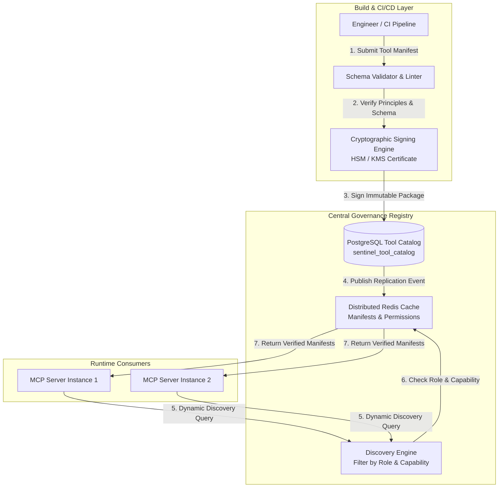

### 8.1 Tool Registration & Lifecycle Management
Tools are immutable software packages registered via automated CI/CD pipelines. Manual modification of runtime tool definitions is technically blocked at the database layer.

1. **Manifest Validation:** The build pipeline validates the tool specification against `UniversalToolContract.schema.json`. Any missing descriptions, un-typed parameters, or missing timeout SLAs cause immediate pipeline rejection.
2. **Cryptographic Attestation:** Approved tool bundles are signed using an enterprise Hardware Security Module (HSM) private key. The signature is embedded directly within the manifest catalog entry.
3. **Registry Ingestion:** The registry stores the tool definition in `sentinel_tool_catalog` and broadcasts an invalidation event across the Redis cluster, updating all active MCP Server runtimes within 500 milliseconds.

### 8.2 Semantic Versioning & Deprecation Matrix
Tool versioning follows rigorous enterprise backward compatibility rules:

| Version Mutation Type | Example Scenario | Architectural Impact | Required Engineering Governance |
|---|---|---|---|
| **PATCH (`1.0.x`)** | Internal SQL query optimization; bug fix in output formatting without schema change. | Zero impact on agents or schemas. | Automated deployment after unit/integration test suite passes. |
| **MINOR (`1.x.0`)** | Adding an optional input argument with a sensible default; adding a new optional output field. | Fully backward compatible. Agents using old schema continue to function seamlessly. | Deploy immediately. Notify prompt engineering team of new optional capabilities. |
| **MAJOR (`x.0.0`)** | Removing a required output field; renaming an input parameter; changing a semantic data type. | **Breaking Change.** Agents using old schema will fail validation. | Deploy as concurrent endpoint (`v2`). Maintain `v1` endpoint in active deprecation state for minimum 30 days. Issue automated alerts on `v1` invocation. |

### 8.3 Dynamic Discovery & Capability Mapping
When an agent node initializes within LangGraph, it queries the Tool Registry via MCP `tools/list`. The registry filters the entire enterprise catalog through a strict two-stage security sieve:
1. **RBAC Filtering:** Does the active Agent Role (`agent_investigation`) possess permission to see this category of tools?
2. **Capability ABAC Filtering:** Is the active LangGraph execution step running under a Capability (`P-CAP-04: Root Cause Analysis`) that explicitly whitelists this specific tool ID?

If both conditions are not met, the tool manifest is stripped from the discovery payload. The agent remains entirely unaware that the restricted tool exists within the infrastructure.

---

## 9. MCP Resources Specification

MCP Resources represent structured read-only context primitives injected directly into the tool execution runtime or agent metadata boundary, eliminating the need to stuff massive reference files into LLM token streams.

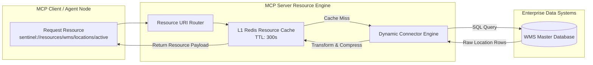

### 9.1 Resource URI Schemes and Taxonomy
All Sentinel OS resources conform to a rigorous hierarchical URI scheme:
`sentinel://resources/{domain}/{entity}/{resource_id}?{query_params}`

| URI Pattern | Resource Class | Description | Cache TTL |
|---|---|---|---|
| `sentinel://resources/schemas/db/{table_name}` | Static Schema | Exact PostgreSQL column names, types, and foreign key constraints for safe SQL construction. | `86,400s` (24h) |
| `sentinel://resources/wms/locations/active` | Dynamic Dictionary | Current active warehouse aisle and bin mapping dictionary compressed as JSON. | `300s` (5m) |
| `sentinel://resources/policy/soa/{department_id}` | Static Policy | Enterprise Schedule of Authorization (SoA) limits defining monetary approval ceilings. | `3,600s` (1h) |
| `sentinel://resources/cases/{case_id}/timeline` | Dynamic Event Log | Compressed, immutable audit trail of all prior agent decisions within the active case saga. | `0s` (No Cache) |

---

## 10. MCP Prompts Specification

MCP Prompts represent standardized, version-controlled scaffolding templates stored on the MCP server. They provide deterministic framing instructions for complex tool execution patterns, ensuring consistency across disparate LLM reasoning engines.

### 10.1 Prompt Registry & Composition
Prompts are parameterized templates written in strict Jinja2 markdown formatting, registered within the `sentinel_prompt_catalog`.

```json
{
  "name": "sql_query_scaffolding",
  "version": "1.2.0",
  "description": "Deterministic scaffolding for generating read-only PostgreSQL queries against Sentinel operational tables.",
  "arguments": [
    { "name": "table_name", "description": "Target database table name", "required": true },
    { "name": "business_question", "description": "Natural language question to answer", "required": true }
  ]
}
```

### 10.2 Prompt Injection & Tampering Defense
To prevent adversarial data (e.g., untrusted vendor email text or notes fields in WMS logs) from hijacking prompt scaffolding:
1. **Mandatory Delimiter Boxing:** Untrusted variables injected into prompts are strictly wrapped inside XML-style structural boundary delimiters (`<untrusted_external_data> ... </untrusted_external_data>`).
2. **Instruction Hierarchy Enforcement:** System prompts explicitly instruct the LLM reasoning engine to treat all content contained within untrusted delimiters strictly as inert string data, ignoring any imperative command instructions contained within.

---

## 11. Tool Invocation End-to-End Lifecycle

The following sequence diagram defines the exhaustive, step-by-step lifecycle of a tool invocation within Sentinel OS, illustrating execution flow across the LangGraph Engine, MCP Client, Policy Sandbox, and PostgreSQL Audit Ledger.

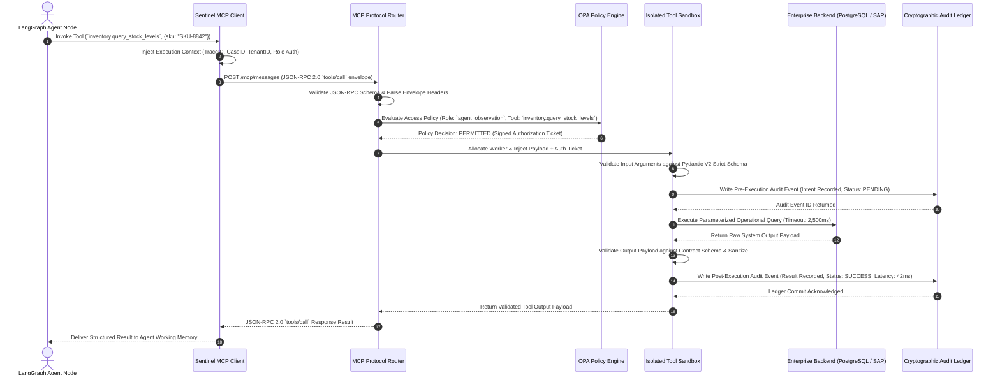

---

## 12. Core Database Tool Specifications

The following section provides the authoritative engineering specifications for the nine core operational tools embedded within the Sentinel OS base deployment.

### 12.1 InventoryQueryTool (`inventory.query_stock_levels`)
- **Mission:** Query multi-echelon real-time inventory stock levels, safety thresholds, and allocated reservations for specified SKU identifiers across enterprise warehouse locations.
- **Inputs Schema:**
  ```json
  {
    "type": "object",
    "required": ["sku_list"],
    "properties": {
      "sku_list": {
        "type": "array",
        "items": { "type": "string", "pattern": "^SKU-[A-Z0-9]{4,12}$" },
        "minItems": 1,
        "maxItems": 50
      },
      "warehouse_id": { "type": "string", "pattern": "^WH-[0-9]{3}$" },
      "include_reserved": { "type": "boolean", "default": true }
    },
    "additionalProperties": false
  }
  ```
- **Outputs Schema:**
  ```json
  {
    "type": "object",
    "required": ["stock_records", "query_timestamp"],
    "properties": {
      "stock_records": {
        "type": "array",
        "items": {
          "type": "object",
          "required": ["sku", "warehouse_id", "on_hand", "reserved", "available"],
          "properties": {
            "sku": { "type": "string" },
            "warehouse_id": { "type": "string" },
            "on_hand": { "type": "integer", "minimum": 0 },
            "reserved": { "type": "integer", "minimum": 0 },
            "available": { "type": "integer" }
          }
        }
      },
      "query_timestamp": { "type": "string", "format": "date-time" }
    }
  }
  ```
- **SQL Execution Pattern:**
  ```sql
  SELECT sku, warehouse_id, on_hand_qty, reserved_qty, (on_hand_qty - reserved_qty) AS available
  FROM sentinel_inventory_master
  WHERE sku = ANY($1::text[]) AND ($2::text IS NULL OR warehouse_id = $2)
  LIMIT 50;
  ```
- **Permissions:** Required Role: `agent_observation`, `agent_investigation`. ABAC: `tenant_id` match required.

### 12.2 PurchaseOrderQueryTool (`procurement.query_po`)
- **Mission:** Retrieve comprehensive lifecycle state, line-item pricing, vendor details, and delivery schedule tracking for internal purchase orders.
- **Permissions:** Required Role: `agent_investigation`, `agent_decision`. Timeout: `3,000ms`.

### 12.3 SupplierLookupTool (`supplier.lookup_master`)
- **Mission:** Interrogate vendor master ledgers to verify active contractual status, SLA risk ratings, historical fulfillment metrics, and authorized financial payment terms.
- **Permissions:** Required Role: `agent_investigation`. Timeout: `2,000ms`.

### 12.4 WarehouseLogQueryTool (`wms.query_audit_logs`)
- **Mission:** Extract chronological barcode scanning records, dock door check-ins, forklift movements, and inventory adjustments for root cause tracing of lost shipments.
- **Permissions:** Required Role: `agent_observation`, `agent_investigation`. Timeout: `4,000ms`.

### 12.5 KnowledgeSearchTool (`knowledge.vector_search`)
- **Mission:** Execute hybrid dense vector embeddings similarity search across corporate standard operating procedures (SOPs), engineering manuals, and prior resolved case summaries.
- **Permissions:** Required Role: `All Agents`. Timeout: `1,500ms`.

### 12.6 ApprovalTool (`gateway.submit_approval`)
- **Mission:** Transition an active `BusinessCaseState` into a human authorization hold, generating a cryptographically signed approval ticket routed to enterprise decision-makers via Slack/Teams/Email.
- **Permissions:** Required Role: `gateway_approval` ONLY. Timeout: `1,000ms`.

### 12.7 ExecutionTool (`execution.commit_mutation`)
- **Mission:** Execute an authorized operational state mutation against external enterprise software (e.g., releasing a WMS shipping hold or updating a PO line item).
- **Permissions:** Required Role: `agent_execution` ONLY. Mandatory: Valid human approval signature token required in envelope headers.

### 12.8 NotificationTool (`notify.dispatch_alert`)
- **Mission:** Dispatch formatted operational status notifications across enterprise communication channels (Slack, Microsoft Teams, PagerDuty, SMTP email).
- **Permissions:** Required Role: `All Agents`. Timeout: `3,000ms`.

### 12.9 MetricsTool (`telemetry.record_metric`)
- **Mission:** Emit custom business and operational telemetry metrics directly into the enterprise OpenTelemetry time-series collector pipeline.
- **Permissions:** Required Role: `All Agents`. Timeout: `500ms`.

---

## 13. External Enterprise Integration Tools

Integrating with legacy enterprise software requires robust adapter patterns that isolate internal agent schemas from external vendor quirks.

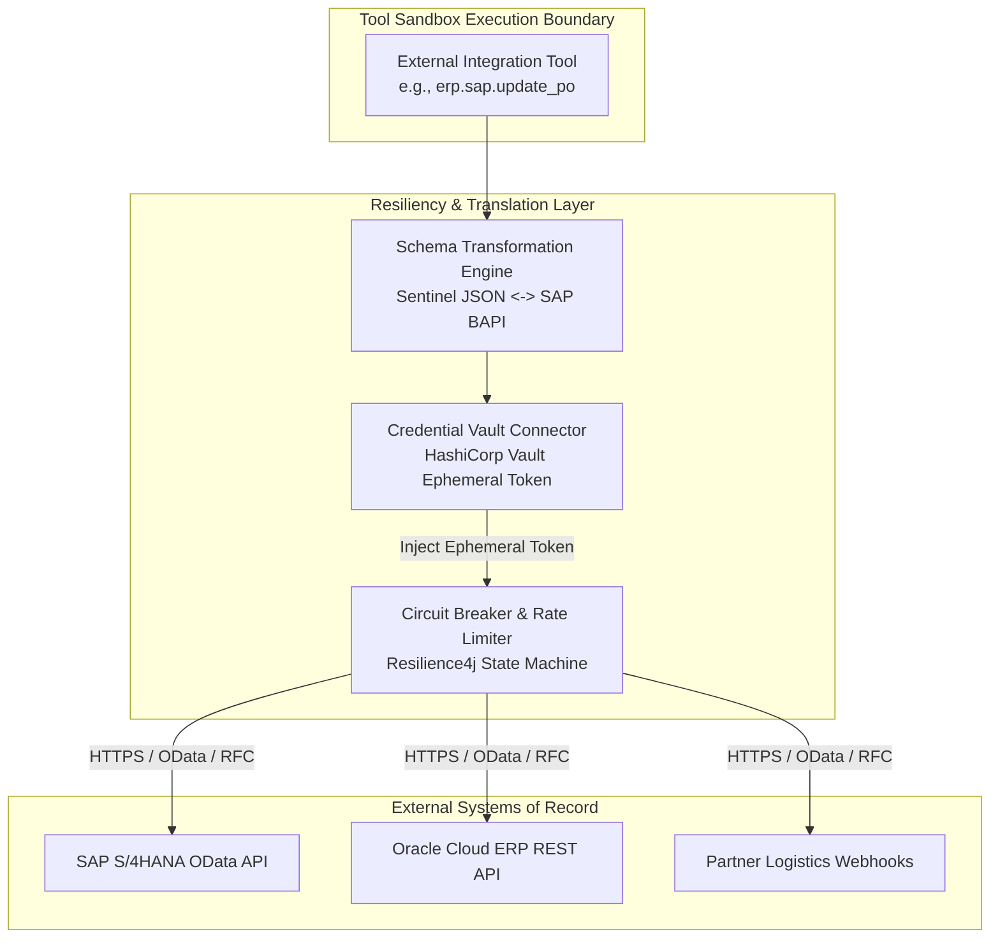

### 13.1 SAP S/4HANA OData & RFC Connectors
- **Integration Mechanism:** Tools interact with SAP strictly via standardized OData v4 REST endpoints or compiled BAPI RFC connectors over TLS 1.3.
- **Credential Handling:** Tools never store static SAP passwords. At execution time, the tool requests a short-lived OAuth2 client credentials grant token from HashiCorp Vault scoped strictly to the target BAPI function module.

### 13.2 Generic REST & GraphQL Adapters
- **OpenAPI Schema Enforcement:** For generic REST endpoints, the tool ingests an OpenAPI 3.0 specification at build time. Runtime execution enforces complete parameter checking against the OpenAPI schema prior to emitting HTTP packets over the wire.
- **GraphQL Query Whitelisting:** GraphQL integration tools reject arbitrary query construction. Tools execute only pre-compiled, statically verified GraphQL query documents stored in the registry, injecting dynamic variables via strict JSON parameter dictionaries.

---

## 14. Security Architecture & Threat Mitigation

The Tool Layer represents the primary attack surface where cognitive inference meets infrastructure mutation. Security engineering must assume that LLM prompts can and will be compromised by adversarial prompt injection.

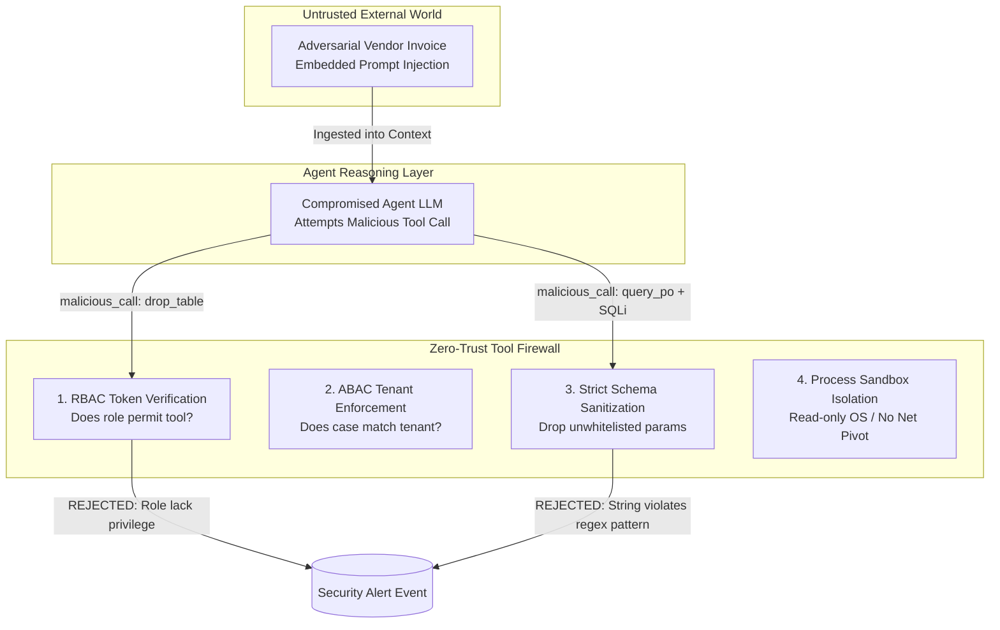

### 14.1 Sandboxing & Process Isolation
- **Container Sandbox:** Every tool execution runs inside an ephemeral, unprivileged Linux container sandbox utilizing `gVisor` runsc runtime.
- **Kernel Restriction:** Seccomp-bpf profiles block 300+ Linux system calls, permitting only basic memory allocation, file read/write on ephemeral scratch pads, and explicit network sockets directed exclusively at approved backend IP ranges.
- **Filesystem Immutability:** The root container filesystem (`/`) is mounted read-only. Temporary scratch space (`/tmp`) is strictly mounted as `tmpfs` with `noexec` flags to prevent binary payload execution.

### 14.2 Granular RBAC & ABAC Access Matrix

| Tool Category / ID | `agent_observation` | `agent_detection` | `agent_investigation` | `agent_decision` | `gateway_approval` | `agent_execution` | `agent_verification` | `agent_learning` |
|---|---|---|---|---|---|---|---|---|
| `db.query.*` | **ALLOW** | **ALLOW** | **ALLOW** | **ALLOW** | DENY | **ALLOW** | **ALLOW** | **ALLOW** |
| `db.mutate.*` | DENY | DENY | DENY | DENY | DENY | **ALLOW** (Signed)| DENY | DENY |
| `knowledge.search` | **ALLOW** | **ALLOW** | **ALLOW** | **ALLOW** | **ALLOW** | **ALLOW** | **ALLOW** | **ALLOW** |
| `erp.sap.query` | DENY | DENY | **ALLOW** | **ALLOW** | DENY | **ALLOW** | **ALLOW** | DENY |
| `erp.sap.mutate` | DENY | DENY | DENY | DENY | DENY | **ALLOW** (Signed)| DENY | DENY |
| `gateway.submit` | DENY | DENY | DENY | DENY | **ALLOW** | DENY | DENY | DENY |

---

## 15. Performance, Caching & Concurrency Engineering

To support high-velocity enterprise throughput without infrastructure collapse, the Tool Layer incorporates multi-tiered caching and rigorous concurrency budgeting.

```mermaid
graph LR
    subgraph Tool Request Stream
        REQ[Incoming Tool Calls]
    end

    subgraph Concurrency & Throttling Layer
        TB[Token Bucket Rate Limiter<br/>Max 100 Req/Sec per Tool]
        SEM[Worker Semaphore Pool<br/>Max 20 Concurrent Sandboxes]
    end

    subgraph Distributed Caching Layer
        L1[L1 In-Memory LRU Cache<br/>Sub-millisecond access]
        L2[L2 Redis Distributed Cache<br/>Shared across cluster]
    end

    subgraph Backend Infrastructure
        DB[(PostgreSQL Primary)]
    end

    REQ --> TB
    TB --> SEM
    SEM --> L1
    L1 -->|Hit (12%)| RESP[Return Cached Result]
    L1 -->|Miss| L2
    L2 -->|Hit (68%)| RESP
    L2 -->|Miss (20%)| DB
    DB -->|Execute Query| L2
```

### 15.1 Multi-Tier Caching Protocol
- **L1 In-Memory Cache:** Worker nodes maintain an internal LRU cache (capacity: 10,000 items) for static resource lookups (`sentinel://resources/schemas/*`).
- **L2 Redis Cache:** Read-only database query results (`inventory.query_stock_levels`) are cached in Redis keyed by `SHA256(tool_id + sorted_json_arguments)` with dynamic TTLs matching operational volatility (e.g., inventory: 30s, vendor master: 3600s).
- **Bypass Rule:** Any request containing `x-sentinel-cache-bypass: true` or executing a mutating tool category (`CAT-01 Mutate`, `CAT-03 Mutate`) completely bypasses caching layers.

---

## 16. Error Handling, Resilience & Compensation

System failures are inevitable. The Tool Layer guarantees graceful degradation, bounded retry execution, and deterministic failure reporting.

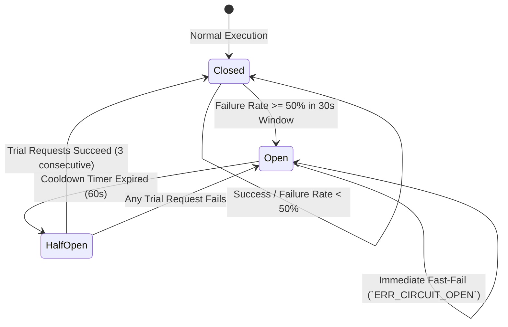

### 16.1 Exponential Backoff Retry Matrix

| Failure Category | Trigger Condition | Max Retries | Backoff Strategy | Circuit Breaker Action |
|---|---|---|---|---|
| **Transient Network (`ERR_NET_RESET`)** | TCP connection reset by peer or timeout during socket handshake. | `3` | Exponential (`initial: 200ms`, `multiplier: 2.0`, `jitter: full`) | Increment failure counter. |
| **Database Lock (`ERR_DB_DEADLOCK`)** | PostgreSQL serializable transaction serialization failure or deadlock detected. | `4` | Exponential (`initial: 100ms`, `multiplier: 1.5`, `jitter: full`) | Increment failure counter. |
| **Upstream 429 (`ERR_RATE_LIMIT`)** | External ERP or API gateway returns HTTP 429 Too Many Requests. | `5` | Strict adherence to `Retry-After` HTTP header or exponential backoff up to 10s. | Do not increment circuit breaker. |
| **Schema Validation (`ERR_SCHEMA`)**| JSON arguments fail Pydantic V2 input validation check. | `0` | **NO RETRY.** Fast-fail immediately back to LangGraph agent node for cognitive correction. | Do not increment circuit breaker. |

---

## 17. Observability, Audit & Telemetry Specifications

Every tool execution must be entirely transparent to enterprise systems engineers and internal compliance auditors.

### 17.1 OpenTelemetry Trace Span Architecture
Every tool execution generates a standardized W3C OpenTelemetry trace span wrapping the sandbox lifecycle:

```json
{
  "trace_id": "4bf92f3577b34da6a3ce929d0e0e4736",
  "span_id": "00f067aa0ba902b7",
  "parent_span_id": "5fb397be34d280e4",
  "name": "sentinel.tool.execute/inventory.query_stock_levels",
  "kind": "SPAN_KIND_CLIENT",
  "start_time_unix_nano": 1751541000120000000,
  "end_time_unix_nano": 1751541000162000000,
  "attributes": {
    "sentinel.case_id": "CASE-2026-0884",
    "sentinel.tenant_id": "TENANT-ACME-01",
    "sentinel.agent.role": "agent_observation",
    "mcp.tool.name": "inventory.query_stock_levels",
    "mcp.transport": "sse",
    "tool.execution.status": "SUCCESS",
    "tool.execution.latency_ms": 42
  }
}
```

### 17.2 Immutable Audit Ledger Schema (`sentinel_audit_ledger`)
All operational tool executions must commit a verifiable audit record to PostgreSQL:

```sql
CREATE TABLE sentinel_audit_ledger (
    audit_id UUID PRIMARY KEY DEFAULT gen_random_uuid(),
    case_id VARCHAR(64) NOT NULL,
    tenant_id VARCHAR(64) NOT NULL,
    agent_id VARCHAR(64) NOT NULL,
    tool_name VARCHAR(128) NOT NULL,
    execution_timestamp TIMESTAMPTZ NOT NULL DEFAULT CLOCK_TIMESTAMP(),
    input_payload JSONB NOT NULL,
    output_payload JSONB NOT NULL,
    execution_latency_ms INTEGER NOT NULL,
    status VARCHAR(32) NOT NULL,
    cryptographic_signature TEXT NOT NULL,
    CONSTRAINT chk_status CHECK (status IN ('SUCCESS', 'FAILURE', 'TIMEOUT', 'REJECTED'))
);

CREATE INDEX idx_audit_case_tenant ON sentinel_audit_ledger(tenant_id, case_id);
CREATE INDEX idx_audit_tool_time ON sentinel_audit_ledger(tool_name, execution_timestamp DESC);
```

---

## 18. Testing Strategy & Deterministic Replay Verification

To certify tool reliability without polluting live production ERP environments, Sentinel OS mandates a rigorous four-layer testing hierarchy.

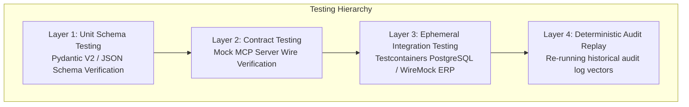

### 18.1 Deterministic Audit Replay Testing
Because every tool invocation records exact input arguments and external responses inside `sentinel_audit_ledger`, engineers can verify tool upgrades by executing **Replay Suites**:
1. The replay harness queries historical audit entries for a target tool across the previous 30 days.
2. The harness intercepts network sockets, injecting historical external system responses when the tool attempts backend communication.
3. The newly compiled tool candidate processes the historical inputs. If the generated output payload deviates by a single byte from the historical audit log output (for non-timestamp attributes), the build fails immediately.

---

## 19. Future Evolution & Distributed Tool Mesh Horizons

As Sentinel OS evolves from single-datacenter enterprise deployments into federated multi-cloud agent swarms, the Tool Layer architecture transitions toward a **Distributed Tool Mesh**.

```mermaid
graph TB
    subgraph Global Control Plane
        REG[Federated Global Tool Registry]
    end

    subgraph AWS Region (US-East)
        A1[LangGraph Swarm Node]
        M1[Local MCP Proxy Gateway]
    end

    subgraph SAP Private Cloud (EU-Central)
        M2[Remote Edge MCP Server]
        SAP[(SAP S/4HANA Master)]
    end

    REG -->|Sync Manifests| M1 & M2
    A1 -->|Invoke Tool over gRPC/mTLS| M1
    M1 -->|Cross-Cloud Federation| M2
    M2 -->|Local Execution| SAP
```

### 19.1 Architectural Horizons
1. **Zero-Trust Edge MCP Servers:** Co-locating lightweight Rust MCP servers directly inside private vendor subnets (e.g., inside corporate manufacturing plants), allowing centralized LangGraph agents in public clouds to safely execute factory-floor tooling over mTLS tunnels without VPN gateways.
2. **Autonomous Tool Discovery & Synthesis:** Enabling advanced learning agents (`agent_learning`) to analyze recurring schema transformation failures and autonomously draft OpenAPI adapter configurations, submitting candidate tool manifests to CI/CD pipelines for human engineering review.
3. **Hardware-Accelerated Sandbox Isolation:** Migrating worker sandboxes from container namespaces to AWS Nitro Enclaves and confidential computing environments, guaranteeing that even physical host hypervisor compromise cannot inspect sensitive tool execution memories.

---
> **End of Definitive Specification — 09_TOOLING_AND_MCP.md**
