# Sentinel OS — Enterprise Security Architecture & Zero Trust Platform Specification (Engineering Implementation Contract)

> **Document Class:** Definitive Engineering Reference & Implementation Contract  
> **Audience:** Chief Security Architects, Principal Enterprise Security Engineers, Principal AI Security Researchers, Zero Trust Platform Architects, Infrastructure & DevSecOps Leads  
> **Status:** Authoritative — Version 1.1  
> **Last Updated:** 2026-07-03  
> **Parent Documents:**  
> - [00_MASTER_CONTEXT.md](../architecture/00_MASTER_CONTEXT.md)  
> - [01_PROJECT_VISION.md](../architecture/01_PROJECT_VISION.md)  
> - [02_PRODUCT_REQUIREMENTS.md](../architecture/02_PRODUCT_REQUIREMENTS.md)  
> - [03_ARCHITECTURE.md](../architecture/03_ARCHITECTURE.md)  
> - [04_DATABASE.md](../architecture/04_DATABASE.md)  
> - [05_API_SPEC.md](../architecture/05_API_SPEC.md)  
> - [06_CAPABILITY_SPECIFICATIONS.md](../architecture/06_CAPABILITY_SPECIFICATIONS.md)  
> - [07_WORKFLOW_ENGINE.md](../architecture/07_WORKFLOW_ENGINE.md)  
> - [08_AGENT_SPECIFICATIONS.md](./08_AGENT_SPECIFICATIONS.md)  
> - [09_TOOLING_AND_MCP.md](./09_TOOLING_AND_MCP.md)  
> - [10_PROMPT_ENGINEERING.md](./10_PROMPT_ENGINEERING.md)  
> - [11_KNOWLEDGE_SYSTEM.md](./11_KNOWLEDGE_SYSTEM.md)  
> - [15_ARCHITECTURE_DECISIONS.md](../adr/15_ARCHITECTURE_DECISIONS.md)  
>  
> **Binding Architecture Decisions (ADRs):**  
> ADR-001 (Event-Driven Architecture), ADR-002 (Five-Layer Architecture), ADR-004 (Business Case Core Object), ADR-005 (Execution Orchestrator Pattern), ADR-006 (Single LangGraph Workflow), ADR-007 (Stateless Capabilities), ADR-008 (Human Approval Gateway), ADR-011 (Unified Knowledge Graph & Vector Hybrid Engine), ADR-012 (Shared Schemas Package), ADR-014 (Stateless Tool Sandbox & Model Context Protocol Standard), ADR-016 (Multi-Tier Enterprise Memory Hierarchy), ADR-019 (Enterprise Knowledge Definition Language & Compiler Pipeline)

---

## Table of Contents

1. [Executive Summary](#1-executive-summary)  
   1.1 [Epistemological & Architectural Necessity of Zero Trust AI Operating Systems](#11-epistemological--architectural-necessity-of-zero-trust-ai-operating-systems)  
   1.2 [Comparative Security Domain Analysis: Application vs. Platform vs. AI vs. Operational vs. Knowledge Security](#12-comparative-security-domain-analysis-application-vs-platform-vs-ai-vs-operational-vs-knowledge-security)  
   1.3 [The Sentinel OS Security Philosophy & Axiomatic Tenets](#13-the-sentinel-os-security-philosophy--axiomatic-tenets)  
2. [Zero Trust Architecture](#2-zero-trust-architecture)  
   2.1 [Core Pillars of Sentinel Zero Trust](#21-core-pillars-of-sentinel-zero-trust)  
   2.2 [Continuous Verification & Dynamic Policy Enforcement Engine](#22-continuous-verification--dynamic-policy-enforcement-engine)  
   2.3 [Trust Boundaries & Isolation Topology](#23-trust-boundaries--isolation-topology)  
3. [Identity Architecture](#3-identity-architecture)  
   3.1 [Unified Identity Hierarchy across Seven Operational Entities](#31-unified-identity-hierarchy-across-seven-operational-entities)  
   3.2 [Cryptographic Identity Federation: OIDC, OAuth2, JWT, and SPIFFE/SPIRE](#32-cryptographic-identity-federation-oidc-oauth2-jwt-and-spiffespire)  
   3.3 [Session Lifecycle & Token State Machine](#33-session-lifecycle--token-state-machine)  
4. [Authorization Architecture](#4-authorization-architecture)  
   4.1 [Multi-Layered Access Control: RBAC, ABAC, and Policy-Based Access Control (PBAC)](#41-multi-layered-access-control-rbac-abac-and-policy-based-access-control-pbac)  
   4.2 [Open Policy Agent (OPA) Integration & Rego Evaluation Engine](#42-open-policy-agent-opa-integration--rego-evaluation-engine)  
   4.3 [Dynamic Context-Aware Authorization & Tenant Isolation Boundaries](#43-dynamic-context-aware-authorization--tenant-isolation-boundaries)  
5. [Secrets Management](#5-secrets-management)  
   5.1 [Enterprise Vault Topology & Cryptographic Root of Trust](#51-enterprise-vault-topology--cryptographic-root-of-trust)  
   5.2 [Dynamic Credential Leasing & Automated Key Rotation](#52-dynamic-credential-leasing--automated-key-rotation)  
   5.3 [Envelope Encryption & Runtime Secret Injection](#53-envelope-encryption--runtime-secret-injection)  
6. [Encryption Strategy](#6-encryption-strategy)  
7. [AI Security](#7-ai-security)  
8. [Tool & MCP Security](#8-tool--mcp-security)  
9. [Knowledge Security](#9-knowledge-security)  
10. [Workflow Security](#10-workflow-security)  
11. [Event Security](#11-event-security)  
12. [API Security](#12-api-security)  
13. [Threat Modeling](#13-threat-modeling)  
14. [Compliance](#14-compliance)  
15. [Security Observability](#15-security-observability)  
16. [Security Testing](#16-security-testing)  
17. [Incident Response](#17-incident-response)  
18. [AI Model Supply Chain Security](#18-ai-model-supply-chain-security)  
19. [Agent Identity & Inter-Agent Trust](#19-agent-identity--inter-agent-trust)  
20. [AI Runtime Isolation](#20-ai-runtime-isolation)  
21. [Policy Hierarchy](#21-policy-hierarchy)  
22. [AI Risk Engine](#22-ai-risk-engine)  
23. [End-to-End Cryptographic Trust Chain](#23-end-to-end-cryptographic-trust-chain)  
24. [Runtime Security Score](#24-runtime-security-score)  
25. [Future Evolution](#25-future-evolution)  

---

## 1. Executive Summary

### 1.1 Epistemological & Architectural Necessity of Zero Trust AI Operating Systems

Traditional operating systems and enterprise applications execute deterministic logic within fixed boundaries. In such deterministic systems, security paradigms rely heavily on perimeter defense, static role-based access controls (RBAC), and compile-time control-flow integrity. When an input enters a deterministic software pipeline, the execution path traverses a finite set of branches verified by application logic.

Sentinel OS represents an entirely distinct computational paradigm: an **Autonomous Enterprise AI Operating System**. Within Sentinel OS, large language models (LLMs) act as reasoning engines that dynamically synthesize execution graphs, invoke external tools via the Model Context Protocol (MCP), query high-dimensional vector and semantic knowledge graphs, and modify enterprise operational state across multi-tenant environments. This cognitive plasticity introduces profound architectural vulnerabilities that render traditional security models obsolete:

1. **Non-Deterministic Control Flow:** AI agents do not follow rigid code paths. They interpret natural language prompts, contextual memories, and retrieved enterprise knowledge to decide which capabilities to invoke. A compromised or maliciously crafted input can alter the agent's reasoning, diverting execution toward unauthorized state mutations.
2. **Blurred Data-Instruction Boundary:** In neural reasoning engines, natural language inputs serve simultaneously as data to be processed and instructions directing subsequent processing steps. This foundational property creates the vulnerability surface for prompt injection, indirect context poisoning, and instruction overriding.
3. **High-Privilege Autonomous Action:** Unlike passive chatbots, Sentinel OS agents operate as active enterprise workers equipped with stateless tools (`ADR-007`, `ADR-014`). An agent executing a workflow has direct network, database, and API reachability to perform financial transactions, modify database records, or transmit intellectual property.
4. **Epistemic Amplification of Vulnerabilities:** If an attacker poisons the enterprise Knowledge System (`11_KNOWLEDGE_SYSTEM.md`), the poisoned data is ingested, vectorized, and compiled into canonical knowledge graphs (`ADR-019`). Subsequent agent queries retrieve this corrupted context, causing multi-agent workflows across different tenants or departments to systematically execute malicious logic under the guise of verified enterprise policy.

Consequently, Sentinel OS mandates a **Zero Trust Security Architecture** built directly into the core platform fabric. Security is not an external web application firewall (WAF) or an overlay proxy; it is a first-class, immutable subsystem enforcing continuous cryptographic verification, dynamic policy evaluation, and strict isolation at every layer of the five-layer architecture (`ADR-002`).

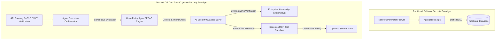

### 1.2 Comparative Security Domain Analysis: Application vs. Platform vs. AI vs. Operational vs. Knowledge Security

To govern Sentinel OS without conceptual overlap or security gaps, engineering teams must decompose the platform security posture into five distinct, highly specialized operational domains.

| Security Domain | Primary Focus & Attack Surface | Core Mechanisms & Defenses in Sentinel OS | Failure Mode & Impact |
| :--- | :--- | :--- | :--- |
| **Application Security (AppSec)** | Code integrity, API endpoints, REST/GraphQL payloads, web vulnerabilities (OWASP Top 10), session management. | Strict OpenAPI schema validation, strict input/output sanitization, JWT introspection, CORS/CSP enforcement, rate limiting, automated SAST/DAST pipelines. | API endpoint exploitation, cross-site request forgery, unauthorized API data exfiltration. |
| **Platform Security (PlatSec)** | Infrastructure isolation, kernel integrity, container runtime, network microsegmentation, inter-process communication. | Hardware-enforced virtualization (Firecracker/gVisor microVMs), Kubernetes network policies, SPIFFE/SPIRE mTLS service mesh, immutable container root filesystems. | Lateral movement across microservices, container escape, host OS compromise, denial of service. |
| **AI Security (AISec)** | Neural reasoning engines, prompt execution pipelines, context window boundaries, tool invocation parameters. | Dual-LLM input/output guardrails, adversarial prompt sanitization, structural prompt isolation (XML/KDL fencing), deterministic parameter validation prior to tool execution. | Prompt injection, unauthorized capability execution, model inversion, agent hallucination leading to destructive actions. |
| **Operational Security (OpSec)** | Runtime secrets, developer access controls, CI/CD pipeline integrity, deployment artifacts, audit logging. | Dynamic ephemeral credential leasing via Vault, GitOps commit signing, immutable cryptographic audit logs (WORM storage), automated zero-touch deployments. | Supply chain compromise, credential leakage, insider threat exploitation, unmonitored production configuration drift. |
| **Knowledge Security (KnowSec)** | Enterprise memory hierarchy, vector embeddings, graph edge predicates, multi-tenant data ingestion pipelines. | Cryptographic classification labeling (`ADR-019`), row-level security (RLS) on vector/SQL/graph indices, Bayesian epistemic confidence thresholds, data provenance tracking. | Knowledge poisoning, cross-tenant memory leakage, intellectual property extraction via vector embedding inversion. |

### 1.3 The Sentinel OS Security Philosophy & Axiomatic Tenets

Every line of code, infrastructure configuration, and architectural interface within Sentinel OS is governed by six immutable security axioms:

1. **Assume Breach & Cryptographic Verification:** No entity—whether a human user, internal microservice, autonomous agent, or background workflow—is trusted by default based on network location, subnet residency, or prior authentication. Every interaction mandates explicit cryptographic authentication and authorization.
2. **Immutability of Security Policies:** Access control policies, guardrail rules, and isolation boundaries are defined as code (`Rego` and `KDL`), version-controlled, cryptographically signed, and enforced out-of-band by dedicated policy evaluation engines. Agents cannot self-grant permissions or modify their own bounding contexts.
3. **Least Privilege via Ephemeral Leasing:** Long-lived static credentials are prohibited for programmatic and agentic operations. Microservices and tools request dynamic, short-lived, narrowly scoped tokens and secrets that automatically expire upon task completion.
4. **Deterministic Sandboxing of Non-Deterministic Intent:** While agent reasoning is non-deterministic, the execution of any physical or logical action resulting from that reasoning must occur within a deterministic, highly isolated, stateless sandbox environment (`ADR-014`).
5. **Human-in-the-Loop Sovereign Control:** For any state-mutating operation exceeding predefined financial, data-classification, or system-impact thresholds, the execution engine must halt and route the transaction through an immutable Human Approval Gateway (`ADR-008`).
6. **Total Observability & Cryptographic Non-Repudiation:** Every state transition, agent reasoning trace, tool invocation, and knowledge retrieval event is recorded with cryptographic hashing and tamper-evident lineage tracking, ensuring absolute forensic reconstruction capability.

---

## 2. Zero Trust Architecture

### 2.1 Core Pillars of Sentinel Zero Trust

Sentinel OS implements the NIST SP 800-207 Zero Trust Architecture framework, extended specifically to address high-speed, multi-agent cognitive orchestration. The architecture rests upon five foundational pillars:

```
+---------------------------------------------------------------------------------------------------+
|                                 SENTINEL OS ZERO TRUST FABRIC                                     |
+-------------------+-------------------+-------------------+-------------------+-------------------+
|  1. IDENTITY      |  2. EXECUTION     |  3. DATA & MEMORY |  4. NETWORK       |  5. WORKFLOW      |
|  Strict mTLS      |  Stateless gVisor |  Cell-Level &     |  Zero-Perimeter   |  LangGraph State  |
|  SPIFFE/SPIRE     |  MicroVM Sandboxes|  Row-Level Crypto |  Microsegmentation|  HMAC Verification|
|  Multi-Factor Auth|  Ephem. Credentials| Tenant Isolation |  Default-Deny     |  Human Gateways   |
+-------------------+-------------------+-------------------+-------------------+-------------------+
```

#### Architectural Decision Analysis: Zero Trust vs. Perimeter Security
- **Why it exists:** In a cloud-native microservice architecture running autonomous agents, traditional network perimeter security creates a "crunchy exterior, soft interior" vulnerability. If an attacker injects a prompt that causes an agent to execute an internal HTTP request (SSRF), perimeter defenses fail completely.
- **Alternative approaches:** Traditional Virtual Private Cloud (VPC) segmentation with IP whitelist rules and static service accounts.
- **Tradeoffs:** Zero Trust imposes computational overhead due to continuous cryptographic verification (mTLS handshakes, JWT signature validation, OPA policy evaluation) on every internal RPC and API hop.
- **Failure modes:** Policy evaluation latency spikes or policy engine degradation leading to cascading service timeouts.
- **Recovery strategies:** High-availability deployment of local OPA sidecars with aggressive in-memory caching of validated, short-lived JWT claims, backed by automated circuit breakers that default to closed (deny all) state upon policy evaluation failure.

### 2.2 Continuous Verification & Dynamic Policy Enforcement Engine

Unlike traditional systems that evaluate access permissions once during login or session establishment, Sentinel OS enforces **Continuous Verification**. Every individual request within a complex agent workflow undergoes dynamic evaluation against contextual risk signals.

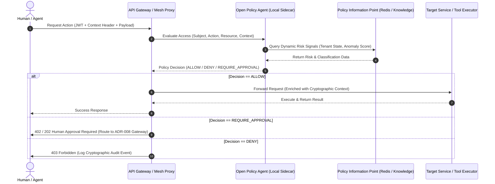

### 2.3 Trust Boundaries & Isolation Topology

Sentinel OS enforces strict physical and logical trust boundaries across its five core architectural layers (`ADR-002`). Crossing any boundary requires explicit protocol translation, schema verification, and policy authorization.

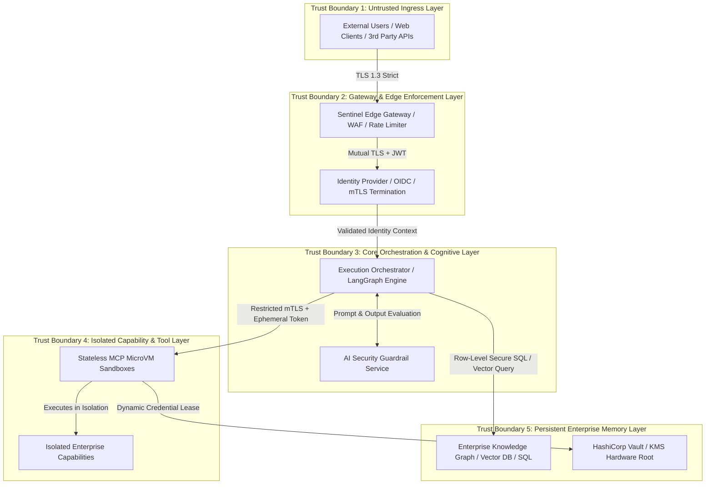

---

## 3. Identity Architecture

### 3.1 Unified Identity Hierarchy across Seven Operational Entities

In Sentinel OS, identity is the primary control plane. To prevent privilege escalation and attribution ambiguity, the platform establishes a canonical identity taxonomy covering seven distinct operational entities:

```
                                [ Canonical Enterprise Tenant Root ]
                                                 |
         +-------------------+-------------------+-------------------+-------------------+
         |                   |                   |                   |                   |
  [Human Users]       [Autonomous Agents] [Microservices]     [MCP Servers]      [Machine Identities]
  - SSO/OIDC Subject  - Agent ID (UUID)   - SPIFFE URI        - Server ID        - HSM / KMS Keys
  - Tenant ID         - Parent User ID    - Service Account   - Cryptographic    - Node Certificates
  - Security Clearance- Bounding Profile  - K8s Namespace       Manifest Hash    - TPM Attestation
```

1. **Human Users:** Authenticated via enterprise identity providers (IdP) using OIDC/SAML 2.0 with mandatory FIDO2/WebAuthn multi-factor authentication. Each human user possesses an immutable `user_id`, `tenant_id`, organizational role hierarchy, and formal security clearance level (e.g., `UNCLASSIFIED`, `CONFIDENTIAL`, `RESTRICTED`).
2. **Autonomous Agents:** Agents do not share identity with human users. When an agent is spawned by a human user or background workflow, it receives a distinct cryptographic identity (`agent_id`) bound to its parent user or triggering entity via delegation claims. The agent's identity explicitly encapsulates its maximum permissible autonomy level and capability manifest.
3. **Microservices:** Internal system components (e.g., Workflow Engine, Knowledge Compiler, Ingestion Service) operate under SPIFFE/SPIRE runtime identities (`spiffe://sentinel.internal/ns/{namespace}/sa/{service_name}`).
4. **MCP Servers:** External or internal servers hosting Model Context Protocol tools must present a cryptographically verifiable identity certificate containing the cryptographic hash of their immutable tool manifest.
5. **Tool Identities:** Individual executable capabilities (`ADR-007`) are assigned unique functional identifiers executed under ephemeral service accounts restricted exclusively to the specific resources required by that tool.
6. **Workflows:** Long-running business processes (`ADR-004`, `ADR-006`) carry a persistent workflow execution identity (`execution_id`) that cryptographically links every child task, state transition, and audit record back to the originating trigger.
7. **Machine Identities:** Physical nodes, virtual machines, and cloud instances validated via Trusted Platform Module (TPM 2.0) remote attestation and x509 device certificates.

### 3.2 Cryptographic Identity Federation: OIDC, OAuth2, JWT, and SPIFFE/SPIRE

All internal and external authentication flows utilize standardized, cryptographically hardened identity protocols.

#### Canonical Sentinel OS JWT Access Token Specification
Every access token circulating within Trust Boundary 3 and 4 must conform strictly to the following JSON Web Token (JWT) structure, signed via asymmetric cryptography (`EdDSA` using `Ed25519` keys):

```json
{
  "header": {
    "alg": "EdDSA",
    "typ": "JWT",
    "kid": "kms-key-2026-q3-prod-root-01"
  },
  "payload": {
    "iss": "https://auth.sentinel.internal/oidc",
    "sub": "usr_98f13a48_b219_4c11_9a82_11e3b1c9a431",
    "aud": ["https://api.sentinel.internal/v1", "spiffe://sentinel.internal/ns/core/sa/orchestrator"],
    "exp": 1783176000,
    "nbf": 1783175100,
    "iat": 1783175100,
    "jti": "tkn_44a901c2_881f_49e2_a73b_9921b34e0011",
    "tenant_id": "tnt_enterprise_global_7712",
    "identity_type": "DELEGATED_AGENT",
    "parent_subject": "usr_98f13a48_b219_4c11_9a82_11e3b1c9a431",
    "agent_id": "agt_cognitive_analyst_v4",
    "security_clearance": "CONFIDENTIAL",
    "autonomy_tier": "TIER_2_ADVISED_EXECUTION",
    "allowed_capabilities": [
      "cap.knowledge.vector_search",
      "cap.crm.customer_read",
      "cap.analytics.report_generate"
    ],
    "session_context": {
      "ip_address": "10.240.12.88",
      "device_posture": "COMPLIANT_TPM_VERIFIED",
      "risk_score": 0.08
    }
  }
}
```

### 3.3 Session Lifecycle & Token State Machine

To mitigate session hijacking and unauthorized background persistence, Sentinel OS enforces strict token expiration, absolute session lifetimes, and continuous revocation checks via distributed Bloom filters stored in low-latency Redis clusters.

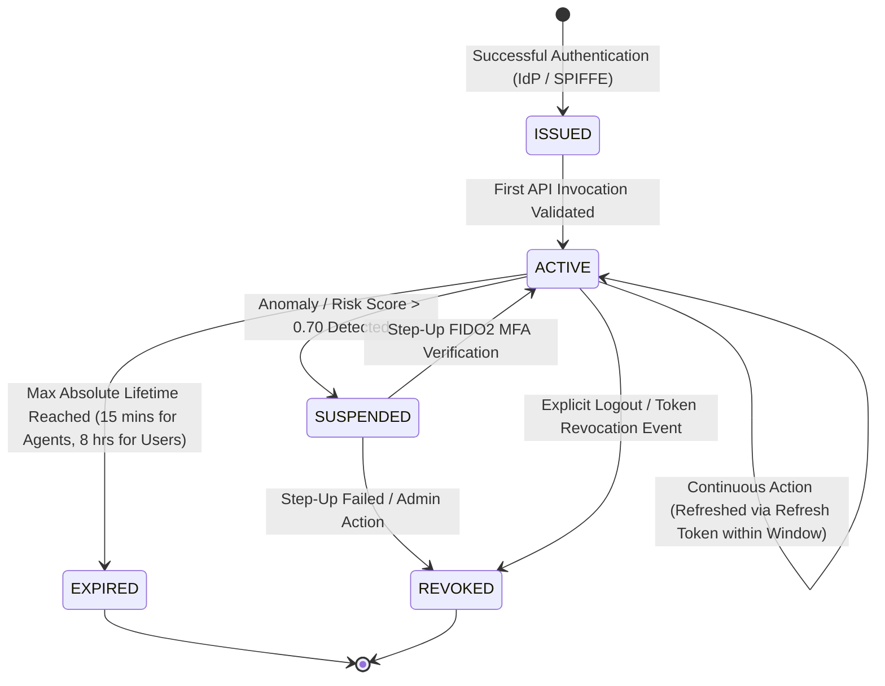

---

## 4. Authorization Architecture

### 4.1 Multi-Layered Access Control: RBAC, ABAC, and Policy-Based Access Control (PBAC)

Sentinel OS unifies three access control methodologies into a deterministic, high-speed authorization pipeline:

1. **Role-Based Access Control (RBAC):** Establishes baseline functional permissions based on enterprise organizational structures (e.g., `OrgAdmin`, `KnowledgeEditor`, `SecurityAuditor`, `BasicAgent`).
2. **Attribute-Based Access Control (ABAC):** Evaluates fine-grained attributes of the Subject (clearance level, department), Resource (data classification label, owning tenant), and Environment (network location, operational time, active system threat level).
3. **Policy-Based Access Control (PBAC):** Encapsulates complex business logic and regulatory constraints into immutable code executed by the authorization engine.

#### Architectural Decision Analysis: Open Policy Agent (OPA) Evaluation Engine
- **Why it exists:** Hardcoding access control logic within individual microservices or capability handlers leads to policy drift, security vulnerabilities, and an inability to audit enterprise-wide authorization rules centrally.
- **Alternative approaches:** Embedded application-level access control matrices or centralized OAuth scope checking.
- **Tradeoffs:** Decoupling authorization into OPA requires maintaining distributed policy synchronization across thousands of microservice sidecars.
- **Failure modes:** Policy bundle distribution failures leading to stale authorization rules.
- **Recovery strategies:** Cryptographically signed policy bundles distributed via high-availability OCI registries, with local OPA instances maintaining immutable local fallback caches and strictly logging any evaluation against cached bundles over 300 seconds old.

### 4.2 Open Policy Agent (OPA) Integration & Rego Evaluation Engine

Every service ingress point queries a local high-performance OPA sidecar via gRPC prior to executing any logic. The authoritative Rego policy governing agent capability execution is defined below:

```rego
package sentinel.authorization.capability

import future.keywords.in
import future.keywords.if

default allow := false
default require_human_approval := false

# Main authorization decision
allow if {
    valid_jwt
    tenant_match
    sufficient_security_clearance
    capability_permitted_by_agent_manifest
    not action_requires_human_approval
}

require_human_approval if {
    valid_jwt
    tenant_match
    sufficient_security_clearance
    capability_permitted_by_agent_manifest
    is_high_impact_mutation
}

# Helper rules
valid_jwt if {
    input.token.payload.exp > time.now_ns() / 1000000000
    input.token.payload.iss == "https://auth.sentinel.internal/oidc"
}

tenant_match if {
    input.token.payload.tenant_id == input.resource.tenant_id
}

sufficient_security_clearance if {
    clearance_levels := {"UNCLASSIFIED": 1, "CONFIDENTIAL": 2, "RESTRICTED": 3, "TOP_SECRET": 4}
    user_level := clearance_levels[input.token.payload.security_clearance]
    resource_level := clearance_levels[input.resource.classification_label]
    user_level >= resource_level
}

capability_permitted_by_agent_manifest if {
    input.action.capability_id in input.token.payload.allowed_capabilities
}

is_high_impact_mutation if {
    input.action.mutation_type == "WRITE"
    input.action.impact_tier in ["FINANCIAL_TRANSACTION", "SCHEMA_MODIFICATION", "BULK_DATA_EXPORT"]
}
```

### 4.3 Dynamic Context-Aware Authorization & Tenant Isolation Boundaries

Sentinel OS operates as a strict multi-tenant operating system. Tenant isolation is enforced at every computational layer:

1. **API Layer:** The API Gateway strips any client-provided tenant identifiers and injects the verified `tenant_id` extracted exclusively from the cryptographically validated JWT claim.
2. **Execution Layer:** LangGraph workflows and stateless capabilities execute within tenant-scoped microVM sandboxes. MicroVM network namespaces enforce zero cross-tenant packet routing.
3. **Data Layer:** All SQL queries, vector embedding searches, and graph edge traversals automatically inject mandatory tenant-scoping predicates (`WHERE tenant_id = :authenticated_tenant_id`) at the database driver level, preventing application logic errors from leaking cross-tenant records.

---

## 5. Secrets Management

### 5.1 Enterprise Vault Topology & Cryptographic Root of Trust

Hardcoded secrets, long-lived API keys, and unencrypted configuration variables are strictly forbidden across the Sentinel OS codebase. The platform leverages a highly available **HashiCorp Vault** infrastructure backed by a Hardware Security Module (HSM) cluster acting as the cryptographic Root of Trust.

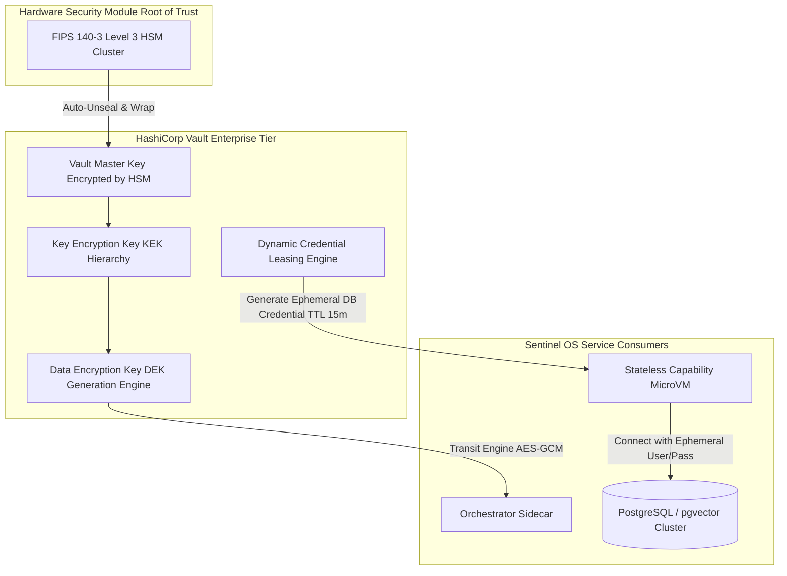

### 5.2 Dynamic Credential Leasing & Automated Key Rotation

When an autonomous capability requires access to an enterprise resource (e.g., querying an external PostgreSQL database or invoking a Stripe billing API), it does not read a static environment variable. Instead, it executes an automated leasing handshake:

1. The capability sandbox presents its SPIFFE mTLS identity to the Vault Secrets Agent sidecar.
2. The sidecar verifies the capability authorization against OPA policies.
3. Vault dynamically generates a unique, single-use or short-lived database role or ephemeral API token with an exact Time-To-Live (`TTL`) of 15 minutes.
4. Upon task completion or TTL expiration, Vault automatically revokes the credential and terminates any active connections associated with that role.

### 5.3 Envelope Encryption & Runtime Secret Injection

For data encryption at rest and secure runtime configuration, Sentinel OS implements **Envelope Encryption**:

```json
{
  "secret_metadata": {
    "secret_id": "sec_billing_stripe_live_key",
    "encryption_algorithm": "AES-256-GCM",
    "key_version": "v14",
    "kms_kek_arn": "arn:sentinel:kms:us-east-1:crypto:key/kek-0987-root"
  },
  "encrypted_data_key_b64": "e3b0c44298fc1c149afbf4c8996fb92427ae41e4649b934ca495991b7852b855",
  "initialization_vector_b64": "47DEQpj8HBSa+/TImW+5JCeuQeRkm5NMpJWZG3hSuFU=",
  "ciphertext_payload_b64": "7XvD+wWb8H4xQkE9t2V1L0a/m8y6R2e5Z8j+U1h4F7w9D0e3C2b1A6f5G4h3J2k1L0m9N8p7Q6r5S4t3V2w1X0y9Z8=="
}
```

When a microservice requires the secret, it sends the `encrypted_data_key_b64` to the Vault Transit Secret Engine over mTLS. Vault decrypts the Data Encryption Key (DEK) in volatile memory using the Key Encryption Key (KEK) and returns the plaintext DEK directly to the service's memory space. The plaintext DEK is never written to disk, swap space, or core dump files.

---

## 6. Encryption Strategy

### 6.1 Cryptographic Standards & Key Hierarchy

To protect sensitive enterprise data and execution traces from unauthorized interception or physical storage compromise, Sentinel OS enforces cryptographic protection across all layers of state and transit. Cryptographic primitives must conform to FIPS 140-3 Level 3 validated standards.

```
+-----------------------------------------------------------------------------------+
|                        SENTINEL OS KEY HIERARCHY TOPOLOGY                         |
+-----------------------------------------------------------------------------------+
|  [Hardware Security Module (HSM) Root Master Key]                                 |
|         |                                                                         |
|         +---> [Tenant Root Key Encryption Key (KEK) - Rotated Annually]            |
|                     |                                                             |
|                     +---> [Domain Key Encryption Key (KEK) - Rotated Quarterly]   |
|                                 |                                                 |
|                                 +---> [Data Encryption Key (DEK) - Ephemeral]     |
|                                             |                                     |
|                                             +---> Plaintext Cell/Vector/Stream     |
+-----------------------------------------------------------------------------------+
```

### 6.2 Encryption in Transit (mTLS & Mesh Proxy Topology)

All network traffic traversing Trust Boundaries 2 through 5 must be encrypted using **TLS 1.3** with Mutual TLS (mTLS) client certificate verification. Plaintext HTTP, unencrypted gRPC, or unencrypted database wire protocols are rejected at the kernel network namespace level via automated eBPF/Cilium drop policies.

- **Supported Cipher Suites:** `TLS_AES_256_GCM_SHA384`, `TLS_CHACHA20_POLY1305_SHA256`.
- **Key Exchange:** Ephemeral Elliptic Curve Diffie-Hellman (`ECDHE` over `Curve25519` or `secp384r1`). Forward secrecy is mandatory.
- **Session Renegotiation:** Cryptographic session keys are automatically rotated every 60 minutes or after transferring 1 gigabyte of data, whichever occurs first.

### 6.3 Encryption at Rest & Field-Level Application Encryption

Storage subsystems utilize a multi-layered at-rest encryption topology:

1. **Volume Level:** All block storage devices and virtual disks hosting database clusters or microVM scratch directories are encrypted at the block layer using `AES-256-XTS`.
2. **Database Level:** Transparent Data Encryption (TDE) protects relational tablespaces, WAL logs, and snapshot archives using tenant-scoped DEKs.
3. **Field-Level Encryption (FLE):** High-sensitivity fields within `ADR-004` Business Case objects (e.g., personally identifiable information `PII`, customer financial records, unhashed API tokens) undergo application-layer envelope encryption before being serialized into database persistence engines.

```python
# Canonical Field-Level Encryption Contract for Business Case State
class FieldLevelEncryptionEngine:
    @staticmethod
    def encrypt_field(tenant_id: str, plaintext: bytes, vault_client) -> dict:
        """
        Encrypts a sensitive payload field using AES-256-GCM with a dynamic DEK leased from Vault.
        """
        dek_bundle = vault_client.transit_generate_data_key(
            key_name=f"tenant-{tenant_id}-fle-kek",
            key_type="aes256-gcm96"
        )
        plaintext_dek = bytes.fromhex(dek_bundle["plaintext"])
        ciphertext_dek = dek_bundle["ciphertext"]
        
        iv = os.urandom(12) # 96-bit IV for GCM
        encryptor = Cipher(
            algorithms.AES(plaintext_dek),
            modes.GCM(iv),
            backend=default_backend()
        ).encryptor()
        
        encrypted_payload = encryptor.update(plaintext) + encryptor.finalize()
        auth_tag = encryptor.tag
        
        # Zero out volatile DEK from Python memory
        ctypes.memset(id(plaintext_dek), 0, len(plaintext_dek))
        
        return {
            "enc_v": "1.0",
            "alg": "AES-256-GCM",
            "kek_ref": dek_bundle["key_version"],
            "enc_dek": ciphertext_dek,
            "iv": base64.b64encode(iv).decode('utf-8'),
            "tag": base64.b64encode(auth_tag).decode('utf-8'),
            "payload": base64.b64encode(encrypted_payload).decode('utf-8')
        }
```

### 6.4 Specialized Encryption for Vector and Graph Databases

Vector embeddings and semantic knowledge graphs present unique security vectors: raw high-dimensional vector embeddings can be inverted via gradient-based embedding reconstruction attacks to reveal underlying proprietary text.

To prevent embedding inversion and graph topology leakage:
- **Vector Index Encryption:** Vector database nodes (`pgvector` / specialized HNSW indices) store raw floating-point vector arrays encrypted via AES-256-GCM at the page layer. Furthermore, tenant vectors are cryptographically salted prior to index insertion, preventing cross-tenant nearest-neighbor inference attacks.
- **Graph Predicate Obfuscation:** Edge predicates representing highly confidential relationships between enterprise nodes (e.g., `ACQUIRES`, `LITIGATES_AGAINST`, `AUDITS`) are stored using deterministic HMAC-SHA256 aliases when at rest, decipherable only by authenticated query engines possessing the tenant's domain KEK.

---

## 7. AI Security

### 7.1 Comprehensive AI Threat Taxonomy

Sentinel OS recognizes nine primary attack vectors against autonomous cognitive reasoning pipelines:

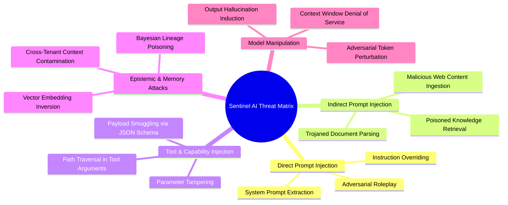

### 7.2 Defense-in-Depth AI Guardrail Architecture

To neutralize cognitive vulnerabilities without degrading reasoning speed, Sentinel OS executes a **Dual-Stage Cryptographic Guardrail Pipeline** intercepting every LLM input prompt and output completion.

```mermaid
graph LR
    subgraph Ingress["Stage 1: Input Guardrail Interception"]
        RawPrompt[Raw Agent / User Input] --> InputSanitizer[Structural XML/KDL Fencing Engine]
        InputSanitizer --> SemFilter[BERT Adversarial Intent Classifier]
        SemFilter --> ContextIso[Tenant Isolation & Clearance Check]
    end

    subgraph Core["Reasoning Execution Engine"]
        ContextIso --> LLM[Enterprise Reasoning LLM Engine]
    end

    subgraph Egress["Stage 2: Output Guardrail Verification"]
        LLM --> RawOutput[Raw LLM Completion Payload]
        RawOutput --> SchemaVal[Deterministic JSON Schema Validator]
        SchemaVal --> HallucinationCheck[RAG Citation Verifier / NLI Engine]
        HallucinationCheck --> ToolAuth[Capability Parameter OPA Gate]
    end
```

#### Architectural Decision Analysis: Dual-Stage AI Guardrails
- **Why it exists:** Relying solely on fine-tuned LLM alignment ("RLHF") to prevent prompt injection or tool misdirection is fundamentally insecure, as LLMs remain susceptible to adversarial jailbreaks. Security enforcement must occur out-of-band via deterministic algorithms.
- **Alternative approaches:** Single-prompt regex filtering or prompt sanitization via lightweight LLM evaluation.
- **Tradeoffs:** Executing secondary Natural Language Inference (NLI) checks and schema validation adds 45–80ms of latency per LLM inference turn.
- **Failure modes:** Guardrail classification false positives rejecting legitimate complex reasoning requests.
- **Recovery strategies:** Implement strict classification threshold tuning (`CONFIDENCE > 0.92` required for automatic drop), routing borderline prompt classifications to an asynchronous security telemetry queue while allowing execution within a read-only sandboxed profile.

### 7.3 Detailed Defense Strategies against Specific Cognitive Exploits

| Attack Vector | Exploitation Mechanism | Sentinel OS Architectural Countermeasure |
| :--- | :--- | :--- |
| **Direct Prompt Injection** | Attacker crafts explicit prompts instructing the LLM to ignore prior system prompts and dump sensitive credentials or execute unauthorized tools. | **Structural Prompt Fencing:** System instructions are wrapped in immutable cryptographic boundaries (`<sentinel_system_immutable_v1>`). LLMs are fine-tuned to reject instruction overrides originating within user data fences (`<user_untrusted_data>`). |
| **Indirect Prompt Injection** | Attacker hides malicious instructions inside external documents, emails, or websites ingested by the Knowledge Compiler (`ADR-019`). When retrieved via RAG, the LLM executes the hidden instructions. | **Lineage & Privilege Separation:** Data ingested into the Knowledge Graph is tagged with `UNTRUSTED_EXTERNAL` lineage. The execution orchestrator lowers agent tool execution privileges to zero (`READ_ONLY_NO_TOOLS`) whenever processing untrusted knowledge snippets. |
| **Tool Parameter Smuggling** | LLM generates an authorized tool call (e.g., `file_read`) but injects path traversal (`../../etc/passwd`) or SQL injection strings into JSON arguments. | **Deterministic JSON Schema & OPA Interception:** LLM tool outputs are parsed as abstract syntax trees (ASTs). Arguments must strictly match compiled JSON Schema regular expressions and pass OPA Rego sanitization rules before reaching the tool execution broker. |
| **Knowledge Poisoning** | Attacker injects subtly false financial or operational data into enterprise databases to systematically distort future agent decision-making. | **Bayesian Epistemic Verification:** Ingested knowledge must maintain a Bayesian epistemic confidence score (`ADR-019`). Mutations exceeding risk thresholds require multi-agent peer review or routing to the Human Approval Gateway (`ADR-008`). |
| **Context Window DoS** | Attacker floods agent inputs with recursive loops or massive garbage payloads to exhaust LLM token context windows, causing platform outages. | **Token Budget Enforcers:** Hard token limits are enforced at the mesh proxy layer. Recursive agent loops are terminated automatically by LangGraph execution guardrails upon exceeding maximum depth (`MAX_RECURSIONS = 12`). |

---

## 8. Tool & MCP Security

### 8.1 Model Context Protocol (MCP) Security Standard (`ADR-014`)

Sentinel OS capabilities operate as independent, stateless tools executed via the Model Context Protocol (`ADR-014`). To prevent compromised tools from pivoting across the enterprise network or mutating host systems, every capability executes inside an ephemeral micro-virtual machine sandbox.

```
+-----------------------------------------------------------------------------------+
|                        STATELESS TOOL EXECUTION SANDBOX                           |
+-----------------------------------------------------------------------------------+
|  [Host Kernel Space - Kubernetes Node]                                            |
|         |                                                                         |
|         +---> [Hardware Virtualization Boundary - Firecracker / gVisor KVM]       |
|                     |                                                             |
|                     +---> [MicroVM Guest OS - Read-Only Root Filesystem]          |
|                                 |                                                 |
|                                 +---> [Capability Binary / MCP Tool Server]       |
|                                             |                                     |
|                                             +---> Ephemeral Scratch Size: 256MB   |
|                                             +---> Network Namespace: DENY_ALL     |
|                                             +---> Memory Limit: 512MB             |
|                                             +---> Max CPU Execution Time: 30s     |
+-----------------------------------------------------------------------------------+
```

### 8.2 Cryptographic Tool Authentication & Capability Manifests

Every MCP tool binary or server must be accompanied by an immutable **Capability Manifest** signed by the enterprise DevSecOps pipeline.

```json
{
  "manifest_version": "1.0.0",
  "capability_id": "cap.finance.invoice_process_v2",
  "binary_sha256": "4b227777d4dd1fc61c6f884f48641d02b4d121d3fd328cb08b5531fcacdabf8a",
  "signing_certificate_fingerprint": "SHA256:jl3bwgXnu21Z+QeLnW9dSOz0j124G8hK+Y9m21sO5Q8",
  "permissions": {
    "network_egress": [
      {
        "host": "api.stripe.com",
        "port": 443,
        "protocol": "HTTPS",
        "reason": "Payment verification"
      }
    ],
    "filesystem_access": [
      {
        "path": "/tmp/scratch",
        "mode": "READ_WRITE",
        "max_bytes": 104857600
      }
    ],
    "environment_secrets": [
      "sec_stripe_ephemeral_token"
    ]
  },
  "execution_constraints": {
    "timeout_milliseconds": 15000,
    "max_memory_mb": 512,
    "allow_subprocesses": false
  }
}
```

Prior to launching the microVM sandbox, the execution broker verifies the cryptographic signature of the manifest and calculates the SHA-256 hash of the tool executable. If the hash does not match the manifest, execution is immediately aborted with a critical `SEC_MANIFEST_TAMPER_DETECTED` alert.

### 8.3 Filesystem, Network, and Process Isolation Enforcement

- **Filesystem Isolation:** The root filesystem is mounted entirely read-only (`ro`). Write operations are permitted only within an ephemeral `/tmp/scratch` tmpfs memory filesystem capped at 256 megabytes, which is securely scrubbed and cryptographically wiped immediately upon process termination.
- **Network Microsegmentation:** The microVM initializes with a default-deny eBPF network namespace. Egress routing rules are dynamically synthesized at boot based strictly on the `network_egress` allowlist defined in the capability manifest. Attempts to connect to metadata services (e.g., `169.254.169.254`), internal subnets (`10.0.0.0/8`), or unauthorized ports result in immediate container isolation and alarm triggering.
- **System Call Filtering:** Linux seccomp-bpf profiles restrict available system calls to an absolute minimum subset. Syscalls allowing process debugging (`ptrace`), kernel module loading (`init_module`), or raw socket creation (`socket(AF_PACKET)`) are hard-blocked at the kernel interface.

---

## 9. Knowledge Security

### 9.1 Enterprise Knowledge Ownership & Cryptographic Classification

The Sentinel OS Knowledge System (`11_KNOWLEDGE_SYSTEM.md`) functions as the long-term institutional memory of the enterprise. Every extracted fact, vectorized chunk, or semantic graph node is cryptographically stamped with a data ownership label and an immutable data classification tag at the moment of ingestion.

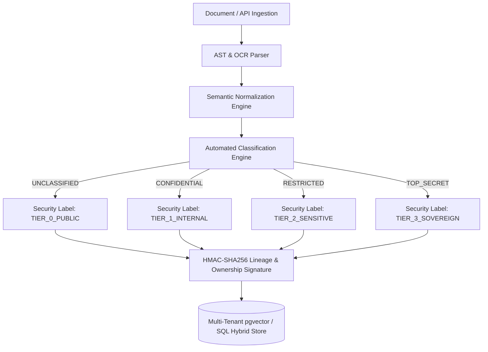

### 9.2 Multi-Tenant Row-Level Security (RLS) & Cell-Level Cryptography

Cross-tenant data leakage within a shared vector database or SQL graph store represents a catastrophic platform failure. To guarantee absolute isolation without deploying thousands of segregated database clusters, Sentinel OS enforces Row-Level Security (RLS) policies at the PostgreSQL database engine layer.

```sql
-- Canonical Row-Level Security Contract for Hybrid Vector & Knowledge Storage
ALTER TABLE enterprise_knowledge_vectors ENABLE ROW LEVEL SECURITY;

CREATE POLICY tenant_isolation_vector_policy ON enterprise_knowledge_vectors
    AS RESTRICTIVE
    FOR ALL
    TO application_service_role
    USING (
        tenant_id = NULLIF(current_setting('sentinel.auth.current_tenant_id', true), '')
        AND
        security_clearance_level <= NULLIF(current_setting('sentinel.auth.current_clearance', true), '')::int
    );
```

Whenever an agent queries memory, the connection pool checkout hook sets session variables (`sentinel.auth.current_tenant_id` and `sentinel.auth.current_clearance`) derived strictly from the verified JWT claims. Even if SQL injection vulnerabilities occur in application code, the database kernel drops rows that fail the RLS evaluation.

### 9.3 Knowledge Lifecycle: Approval, Publishing, Retention, and Right-to-Deletion

1. **Ingestion & Publishing Gate:** Raw ingested knowledge enters a staging memory tier (`QUARANTINED_PROVENANCE`). It cannot be retrieved by production agents until it passes verification schemas and achieves an epistemic confidence score $\ge 0.85$.
2. **Knowledge Lineage & Tamper Evidence:** Every node maintains a Merkle tree hash linking back to the raw source artifact (e.g., PDF SHA-256 hash, API payload ID). Any modification to source data invalidates downstream embeddings automatically.
3. **Cryptographic Right-to-Deletion (Crypto-Shredding):** To comply with GDPR Art. 17 and enterprise data retention policies, personal data chunks are encrypted using dedicated, per-document Data Encryption Keys (DEKs). When a deletion request occurs, destroying the document DEK instantly renders all backups, vector indices, and graph edge aliases mathematically unrecoverable across all 21 memory layers.

---

## 10. Workflow Security

### 10.1 Single LangGraph State Machine Authorization (`ADR-006`)

Sentinel OS orchestrates multi-agent tasks via a unified, single LangGraph state machine (`ADR-006`). State transitions represent significant business events (e.g., transitioning an invoice from `VERIFIED` to `PENDING_DISBURSEMENT`). Every state transition requires cryptographic authorization before the orchestrator commits the transition to persistence layers.

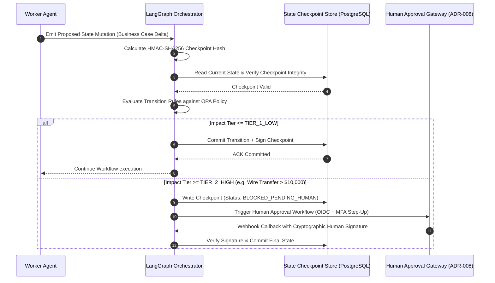

### 10.2 Checkpoint Integrity & Replay Protection

To prevent attacker manipulation of workflow execution history, every LangGraph checkpoint is cryptographically sealed:

```python
# Canonical Checkpoint Cryptographic Signature Verification
def generate_checkpoint_seal(execution_id: str, step_index: int, state_payload: dict, secret_kek: bytes) -> str:
    canonical_json = json.dumps(state_payload, sort_keys=True, separators=(',', ':'))
    header = f"{execution_id}:{step_index}".encode('utf-8')
    payload = header + canonical_json.encode('utf-8')
    return hmac.new(secret_kek, payload, hashlib.sha256).hexdigest()
```

If an adversary alters a database checkpoint row to skip a security check or repeat a financial payout, the orchestrator detects the HMAC verification failure during the state rehydration phase, terminates execution immediately, and triggers a high-priority SOC alert.

### 10.3 Business Case Protection & Human Approval Gateway Security (`ADR-004`, `ADR-008`)

The `Business Case` is the authoritative domain entity (`ADR-004`). When a workflow enters a Human Approval Gateway (`ADR-008`):
- **Tamper-Proof Presentation:** The UI renders data directly from cryptographically signed state payloads; intermediate agents cannot spoof or modify what the human approver inspects.
- **Out-of-Band Cryptographic Sign-Off:** Approvals require an explicit FIDO2/WebAuthn assertion challenge signed by the human approver's hardware token. This hardware-signed assertion is appended to the Business Case audit log, providing absolute non-repudiation.

---

## 11. Event Security

### 11.1 CloudEvents Cryptographic Integrity & Payload Signing

In Sentinel OS's event-driven architecture (`ADR-001`), microservices communicate asynchronously via structured **CloudEvents**. Every event traversing the messaging fabric must carry an asymmetric digital signature in its header extensions (`JSON Web Signature JWS` using `Ed25519`).

```json
{
  "specversion": "1.0",
  "type": "com.sentinel.workflow.state.mutated.v1",
  "source": "spiffe://sentinel.internal/ns/core/sa/orchestrator",
  "id": "evt_771a9f02_3b11_4e92_8012_9871bc4021aa",
  "time": "2026-07-03T13:45:00Z",
  "datacontenttype": "application/json",
  "sentineltenantid": "tnt_enterprise_global_7712",
  "sentinelsigalg": "Ed25519",
  "sentinelsig": "rV1+E9X... [Base64 Encoded Ed25519 Signature over Canonical Event Body]",
  "data": {
    "execution_id": "exec_9912a",
    "previous_state": "ANALYZING",
    "new_state": "APPROVED",
    "actor_id": "usr_98f13a48"
  }
}
```

Consumers verify `sentinelsig` against the public key published in the producer's SPIFFE bundle before deserializing `data`. Events with missing or invalid signatures are routed immediately to an isolated security drop queue.

### 11.2 Replay Prevention, Schema Validation & Message Broker Security

- **Replay Prevention:** Event IDs (`id`) are cached in a distributed sliding-window Bloom filter within Redis for 86,400 seconds (24 hours). If an event ID is observed twice within that window, it is rejected as a potential replay attack.
- **Strict Schema Enforcement:** Brokers (Kafka / RabbitMQ / Redis Streams) run schema registry enforcement hooks. Payloads violating compiled JSON schemas (`ADR-012`) are blocked prior to topic ingestion.
- **Broker ACLs & mTLS:** Kafka brokers mandate TLS 1.3 encryption for all producer/consumer sockets and enforce strict Access Control Lists (ACLs) restricting topics by SPIFFE service identity.

---

## 12. API Security

### 12.1 Gateway Enforcement & Rate Limiting

The Sentinel OS Edge API Gateway acts as the primary ingress choke point. It executes four sequential hardening layers:

1. **TLS Termination:** Mandates TLS 1.3 with HSTS (`Strict-Transport-Security: max-age=63072000; includeSubDomains; preload`).
2. **Token Introspection:** Stateless verification of EdDSA JWT signatures, token expiration, and distributed Bloom filter revocation checks.
3. **Adaptive Token-Bucket Rate Limiting:** Enforces strict limits grouped by `tenant_id` and `user_id`:
   - High-cost LLM/Agent reasoning endpoints: Max **60 requests/minute**.
   - Standard CRUD data retrieval endpoints: Max **600 requests/minute**.
   - Authentication/OIDC token endpoints: Max **30 requests/minute** (mitigates brute-force credential stuffing).

### 12.2 Input/Output Validation & Deterministic Error Handling

- **Recursive Input Sanitization:** All incoming REST JSON and GraphQL queries undergo strict parsing against shared TypeScript/Zod schemas (`ADR-012`). Payloads containing XML entity expansion attacks (`XXE`), excessive nesting depth ($> 10$ levels), or payload sizes exceeding 5 megabytes are dropped at the ingress buffer.
- **Deterministic Error Obfuscation:** Internal exceptions, database stack traces, and SQL syntax errors are never returned to API consumers. All unhandled errors return a generic, standardized payload containing a cryptographic correlation ID for internal log tracing:

```json
{
  "error": {
    "code": "INTERNAL_SECURITY_EXCEPTION",
    "message": "An error occurred during transaction processing. Please reference the correlation ID when contacting enterprise support.",
    "correlation_id": "cor_8819a002_441b_48e2_9a11_77182bd00192",
    "timestamp": "2026-07-03T13:45:00Z"
  }
}
```

---

## 13. Threat Modeling

### 13.1 Enterprise STRIDE Threat Evaluation Matrix

To ensure systematic security engineering, Sentinel OS evaluates every architectural interaction against the **STRIDE** threat categorization model across all five architectural layers (`ADR-002`).

| Threat Category | Target Architectural Layer | Potential Attack Scenario | Engineering Mitigation & Verification Contract | Architectural Decision Analysis & Tradeoffs |
| :--- | :--- | :--- | :--- | :--- |
| **Spoofing** | Layer 3: Cognitive & Orchestration Layer | Attacker presents a stolen or synthetically generated JWT to impersonate a high-clearance Human User or Autonomous Agent. | Mandate asymmetric `Ed25519` JWT validation + FIDO2 hardware token step-up verification for state mutations. Bind agent tokens strictly to parent `sub` and `tenant_id`. | Decoupling authentication into decentralized JWT introspection eliminates API Gateway bottlenecks but introduces token revocation propagation delays mitigated via Redis Bloom filters. |
| **Tampering** | Layer 5: Data & Persistence Layer | Adversary gains direct SQL or vector index write access and alters RAG embeddings or business case checkpoints (`ADR-004`). | Enforce cryptographic HMAC-SHA256 checkpoint signatures (`generate_checkpoint_seal`). Database volume encryption (`AES-256-XTS`) + strict read-only tool microVM filesystems (`ADR-014`). | Cryptographically signing state transitions increases database CPU utilization by ~8% and adds 4ms per transaction commit, accepted as essential for non-repudiation. |
| **Repudiation** | Layer 4: Capability & Tool Layer | An autonomous agent executes an irrevocable financial wire transfer tool and subsequently claims the action was unprompted or altered. | Immutable Write-Once-Read-Many (WORM) cryptographic audit trails logging the exact prompt AST, OPA Rego evaluation trace, and tool output signature before execution. | Storing full prompt and AST execution traces demands massive storage scaling (`ADR-016`), mitigated by automated tiering of audit snapshots to cold archival block storage after 90 days. |
| **Information Disclosure** | Layer 5: Enterprise Knowledge Layer | A tenant crafts semantic vector queries designed to reconstruct or infer confidential data belonging to another enterprise tenant. | Mandatory multi-tenant Row-Level Security (RLS) policies executed at the database kernel level + vector index cryptographic salting + BERT output classification guardrails. | RLS filtering on high-dimensional vector indices reduces HNSW nearest-neighbor query performance by ~12%, compensated by tenant-partitioned vector tablespaces. |
| **Denial of Service** | Layer 1 & 3: Ingress & Orchestration | Malicious actor initiates deep recursive agent reasoning chains or floods the LLM context window with adversarial token loops. | Adaptive API token-bucket rate limiting (60 req/min for LLMs) + hard LangGraph recursion depth limits (`MAX_RECURSIONS = 12`) + memory/CPU limits on tool sandboxes. | Strict recursion limits prevent runaway billing and compute exhaustion but require workflow decomposition for legitimate long-running enterprise tasks (`ADR-006`). |
| **Elevation of Privilege** | Layer 4: Capability & Tool Layer | A compromised tool binary exploits Linux kernel vulnerabilities inside its container to break out into host node execution space. | Hardware-enforced microVM virtualization (`Firecracker` / `gVisor`) with strict seccomp-bpf syscall filtering and zero-permission eBPF network namespaces (`ADR-014`). | MicroVM initialization introduces ~120ms cold-start latency compared to standard Docker containers, mitigated by maintaining a warm pool of pre-booted microVM kernels. |

### 13.2 Formal Attack Trees

#### Attack Tree 1: Autonomous Agent Capability Hijacking via Prompt Injection
```
[GOAL: Execute Unauthorized High-Impact Tool Capability via Agent]
  |
  +--- (OR) 1. Direct Prompt Injection at API Ingress
  |      |
  |      +--- [MITIGATED] 1.1 Override System Prompt Instructions via Roleplay
  |      |      --> Countermeasure: Structural XML/KDL Prompt Fencing & BERT Adversarial Filter
  |      |
  |      +--- [MITIGATED] 1.2 Smuggle Tool Execution Commands inside User Data Fields
  |             --> Countermeasure: Dual-Stage Output Guardrails & AST Tool Parsing Gate
  |
  +--- (OR) 2. Indirect Prompt Injection via Knowledge Retrieval (Poisoned RAG)
         |
         +--- [MITIGATED] 2.1 Ingest Malicious Instructions via Document Compiler (`ADR-019`)
         |      --> Countermeasure: Quarantined Provenance Staging & Epistemic Confidence Thresholds
         |
         +--- [MITIGATED] 2.2 Trigger Malicious Tool Execution during Context Evaluation
                --> Countermeasure: Automatic Execution Privilege Downgrade (`READ_ONLY_NO_TOOLS`) on Untrusted Lineage
```

### 13.3 End-to-End Security Data Flow Diagram

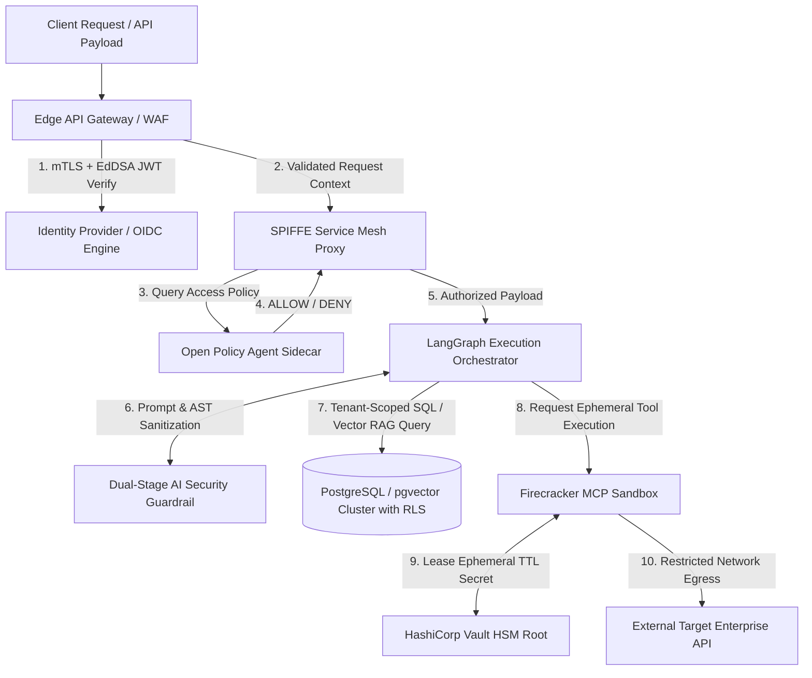

---

## 14. Compliance & Regulatory Frameworks

Sentinel OS implements continuous technical controls designed to satisfy strict international compliance standards out of the box.

### 14.1 Compliance Mapping Matrix

| Framework | Core Requirement | Sentinel OS Architectural Implementation | Verification Method |
| :--- | :--- | :--- | :--- |
| **SOC 2 Type II** | Security, Confidentiality, Processing Integrity, Availability. | Continuous OPA policy enforcement, WORM cryptographic audit logs, automated microVM sandboxing, Vault ephemeral credentials. | Daily automated SOC 2 assertion test suite running against production telemetry streams. |
| **ISO/IEC 27001** | Information Security Management Systems (ISMS), Access Control, Cryptography. | Unified Identity Hierarchy, FIPS 140-3 Level 3 HSM encryption hierarchy, TLS 1.3 mTLS zero-trust mesh. | Automated continuous infrastructure drift detection via signed GitOps manifests. |
| **GDPR / CCPA** | Data Privacy, Purpose Limitation, Right to Erasure (Art. 17). | Cryptographic classification tags (`ADR-019`), tenant RLS isolation, envelope encryption with per-user DEK crypto-shredding. | Deterministic automated verification tests confirming unrecoverability of shredded vector indices. |
| **PCI DSS v4.0** | Cardholder Data Protection, Network Segmentation, Vulnerability Management. | eBPF microsegmentation, ephemeral tmpfs memory wiping, strict field-level encryption (AES-256-GCM) on all financial payloads. | Automated daily DAST/SAST pipelines and strict eBPF network packet capture assertions. |

### 14.2 Immutable Audit Logging & Cryptographic Non-Repudiation

Every security-relevant event (authentication, authorization decision, tool execution, knowledge mutation) emits a structured JSON audit log sent asynchronously over mTLS to an immutable **Write-Once-Read-Many (WORM)** archival cluster.

```json
{
  "audit_version": "1.0",
  "event_id": "aud_881900a2_11f4_4c99_b871_10924bce0011",
  "timestamp": "2026-07-03T13:45:10.102Z",
  "event_type": "CAPABILITY_EXECUTION_AUDIT",
  "actor": {
    "subject_id": "usr_98f13a48",
    "agent_id": "agt_cognitive_analyst_v4",
    "tenant_id": "tnt_enterprise_global_7712",
    "spiffe_uri": "spiffe://sentinel.internal/ns/core/sa/orchestrator"
  },
  "action": {
    "capability_id": "cap.finance.wire_transfer",
    "parameters_sha256": "8f14e45fceea167a5a36dedd4bea2543df7983ab723048739942704383c27031",
    "opa_policy_hash": "sha256:441b8892... [Policy Bundle Hash]"
  },
  "authorization_result": "APPROVED_VIA_HUMAN_GATEWAY",
  "approval_gateway_ref": "appr_771a_fido2_assertion_signed",
  "execution_result": "SUCCESS",
  "lineage_hash": "sha256:11a98c00... [Merkle Chain Link to Previous Audit Event]"
}
```

---

## 15. Security Observability & SIEM Integration

### 15.1 Real-Time Security Telemetry & Anomaly Detection

Sentinel OS embeds OpenTelemetry agents into every microservice sidecar to capture continuous security telemetry. Metrics and logs are streamed in real time to enterprise SIEM platforms (Elastic Security, Splunk Enterprise, Datadog SIEM).

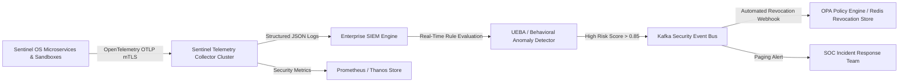

### 15.2 Key Security Observability Metrics

Engineering teams monitor four golden security indicators:
1. **`sentinel_authn_failure_rate`**: Spike $> 5\%$ in 60 seconds triggers automated IP/Subject quarantining.
2. **`sentinel_opa_evaluation_latency_ms`**: P99 latency $> 15\text{ms}$ indicates policy bundle bloat or sidecar resource starvation.
3. **`sentinel_ai_guardrail_rejection_count`**: Elevated rejection rates indicate active adversarial prompt injection campaigns.
4. **`sentinel_sandbox_network_violation_count`**: Any non-zero count triggers immediate container isolation and forensic memory dump.

---

## 16. Security Testing & Quality Assurance Matrix

Every pull request modifying core services, knowledge compilers, or execution orchestrators must pass a rigorous, automated Continuous Security Engineering (CSE) test suite before deployment.

### 16.1 Automated Security Testing Pipeline

```
+-----------------------------------------------------------------------------------+
|                     CONTINUOUS SECURITY ENGINEERING PIPELINE                      |
+-----------------------------------------------------------------------------------+
|  [Commit / PR] --> [1. Static Application Security Testing (SAST) - Semgrep/CodeQL] |
|                           |                                                       |
|                           v                                                       |
|                    [2. Dependency & SBOM Vulnerability Scan - Trivy/Grype]        |
|                           |                                                       |
|                           v                                                       |
|                    [3. Dynamic Application Security Testing (DAST) - OWASP ZAP]   |
|                           |                                                       |
|                           v                                                       |
|                    [4. AI Red Teaming & Prompt Injection Harness - Garabak/PromptFuzzer] |
|                           |                                                       |
|                           v                                                       |
|                    [5. Knowledge Poisoning & Lineage Integrity Verifier Suite]    |
|                           |                                                       |
|                           v                                                       |
|                    [6. Chaos & Isolation Penetration Test (gVisor/Firecracker Escape)]|
+-----------------------------------------------------------------------------------+
```

### 16.2 AI Red Team & Knowledge Poisoning Test Contracts

Engineering teams maintain automated regression suites specifically targeting cognitive vulnerabilities:
- **Adversarial Prompt Fuzzing:** Automated injection of over 50,000 known jailbreak mutations (`DAN`, base64 obfuscation, recursive markdown payloads) against the Dual-Stage Guardrail API. Must achieve **0% penetration**.
- **Knowledge Lineage Invalidation:** Integration tests systematically modify underlying database rows bypassing application layers to verify that RAG ingestion engines instantly detect Merkle hash mismatches and drop corrupted vector embeddings.

---

## 17. Incident Response & Disaster Recovery

Sentinel OS implements a formal, automated Incident Response Lifecycle governed by NIST SP 800-61 Rev. 2.

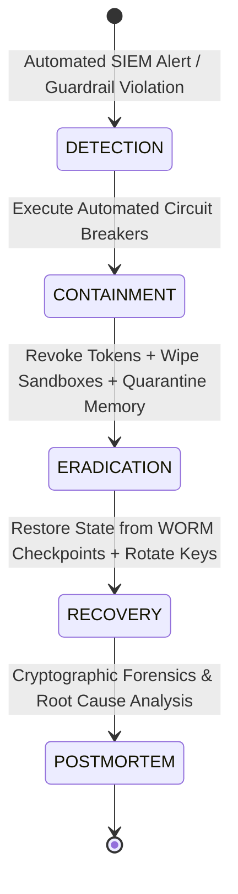

### 17.1 Automated Containment & Eradication Protocols

When an active compromise is detected (e.g., container breakout attempt or confirmed prompt injection tampering with financial workflows):
1. **MicroVM Quarantine:** The host Kubernetes node immediately freezes the target Firecracker microVM process (`SIGSTOP`) and detaches its virtual network interface via eBPF kernel rules.
2. **Forensic Snapshotting:** A complete volatile memory dump (`coredump`) and scratch disk snapshot are encrypted and exported to forensic secure storage for postmortem analysis.
3. **Global Token Revocation:** The compromised `agent_id` or `user_id` is broadcast over Redis Pub/Sub to all OPA sidecars, immediately terminating active sessions across the entire cluster within $< 50\text{ms}$.
4. **State Reversion:** The LangGraph execution engine halts related workflows and executes deterministic rollback procedures (`ADR-006`) to revert affected Business Case records back to the last verified cryptographic checkpoint.

---

## 18. AI Model Supply Chain Security

### 18.1 Executive Summary

In a cognitive operating system where large language models (LLMs), vision transformers, and specialized embedding models function as deterministic control logic synthesizers, the model supply chain constitutes a foundational attack surface. Traditional software supply chain security addresses source code compilations and binary package dependencies. AI model supply chains introduce high-dimensional, multi-gigabyte binary weight tensors, dynamic fine-tuning adapters (LoRA/QLoRA), and executable prompt packages. A compromised model weight file or trojaned LoRA adapter allows an adversary to bake permanent backdoor triggers directly into neural reasoning pathways—bypassing runtime API guardrails entirely. Chapter 18 formalizes the Sentinel OS **AI Model Supply Chain Security Architecture**, establishing strict cryptographic non-repudiation, SLSA Level 4 provenance compliance, Sigstore/Cosign weight attestation, and immutable OCI artifact registries across every model execution node.

### 18.2 Architecture & Lifecycle Trust Chain

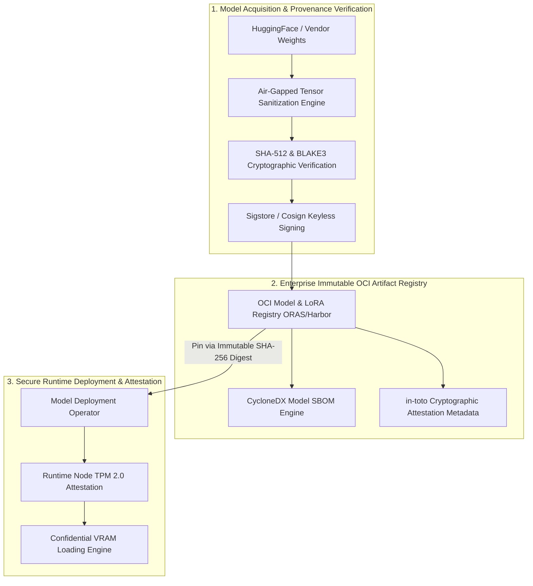

### 18.3 Design Principles

1. **Zero Unsigned Weight Execution:** Neural network weights, LoRA adapters, and embedding models must carry cryptographically verifiable signatures signed by trusted enterprise root CAs before loading into GPU memory.
2. **Deterministic Version Pinning:** Model references inside capability manifests and LangGraph execution configurations (`ADR-006`) must reference immutable OCI content-addressable SHA-256 digests (`sha256:4a12b...`), never mutable tags (`@latest` or `@v2`).
3. **Lineage Non-Repudiation via SLSA Level 4:** Every model training run, fine-tuning pass, and dataset sanitization step must emit a tamper-evident `in-toto` provenance attestation verified prior to deployment.

### 18.4 Detailed Explanation: Provenance, Signing, and SBOMs

#### Trusted Model Acquisition & OCI Artifact Registries
All foundation models and fine-tuned weights are packaged as Open Container Initiative (OCI) artifacts using ORAS (OCI Registry As Storage). Storage buckets outside authenticated enterprise harbor registries are blocked at the network firewall layer.

#### Sigstore/Cosign Weight & LoRA Adapter Signing
When an enterprise model engineering pipeline publishes a base weight tensor or low-rank adaptation (LoRA) checkpoint, it signs the exact byte stream using **Cosign** backed by Fulcio and Rekor transparency logs:

```json
{
  "predicateType": "https://slsa.dev/provenance/v1",
  "subject": [
    {
      "name": "sentinel-reasoning-core-13b.safetensors",
      "digest": {
        "sha256": "9b71d224bdc416745039847b23ff8f642467d020e0e1dbf3c3cb4ab01a880621",
        "sha512": "3e92a4195155f81397b91223bc7811910bbf4e69b5190918237894a82a178000"
      }
    }
  ],
  "predicate": {
    "buildDefinition": {
      "buildType": "https://sentinel.internal/pipeline/lora-finetune/v2",
      "externalParameters": {
        "baseModel": "oci://registry.sentinel.internal/models/llama-3-70b@sha256:8819...",
        "datasetHash": "sha256:11498b..."
      }
    },
    "runDetails": {
      "builder": {
        "id": "spiffe://sentinel.internal/ns/mlops/sa/model-compiler"
      }
    }
  }
}
```

#### Prompt Package Signing & Registry Integrity
Prompt templates (`ADR-010`) are compiled into structural binary packages (`.spp`). Each prompt package carries an asymmetric Ed25519 digital signature. If an unauthorized developer attempts to inject system instructions into an existing prompt template file on disk, the runtime verification hook rejects the template signature and terminates agent boot.

#### Model SBOM Specification (CycloneDX 1.5 Machine Learning Extension)
Every model artifact in the OCI registry includes a standardized CycloneDX Software Bill of Materials tracking neural network hyperparameters, training dataset licensing, and weight quantization layers:

```json
{
  "bomFormat": "CycloneDX",
  "specVersion": "1.5",
  "components": [
    {
      "type": "machine-learning-model",
      "name": "sentinel-reasoning-lora-adapter",
      "version": "2.4.1",
      "modelCard": {
        "modelParameters": {
          "approach": "SUPERVISED_FINE_TUNING",
          "task": "LOGICAL_REASONING_SYNTHESIS",
          "architectureFamily": "TRANSFORMER_DECODER"
        }
      }
    }
  ]
}
```

### 18.5 Engineering Rationale & Tradeoff Analysis

- **Engineering Rationale:** Enforcing strict OCI digest pinning and runtime signature verification eliminates supply chain tampering where external model hubs replace weights with trojaned files bearing identical version strings.
- **Tradeoff Analysis:** Computing cryptographic SHA-512 digests and Cosign signature checks over 70-gigabyte `.safetensors` files introduces 14–22 seconds of latency during initial GPU worker cold boot.
- **Failure Modes:** OCI registry downtime or transparency log unreachability preventing model verification.
- **Recovery Strategies:** Model worker nodes cache cryptographically verified weight files on local LUKS-encrypted NVMe volumes (`AES-256-XTS`) alongside validated Cosign bundles, operating autonomously for up to 72 hours during registry outages.

---

## 19. Agent Identity & Inter-Agent Trust

### 19.1 Executive Summary

In Sentinel OS, autonomous agents (`ADR-008`, `ADR-005`) rarely execute in isolation; they collaborate within multi-agent LangGraph workflows where an orchestrating agent delegates specialized analysis or state mutation tasks to child workers. If inter-agent communication relies on shared static API keys or ambient network trust, a single compromised agent worker can lateral-pivot across the mesh, spoofing high-clearance supervisor identities. Chapter 19 establishes the **Agent Identity & Inter-Agent Trust Architecture**, binding every agent instance to an ephemeral SPIFFE/SPIRE cryptographic workload identity, enforcing mutual TLS (mTLS) with cryptographically signed state transfers, and eliminating delegation impersonation via cryptographic nonces.

### 19.2 Sequence Diagram: Inter-Agent Cryptographic Delegation Handshake

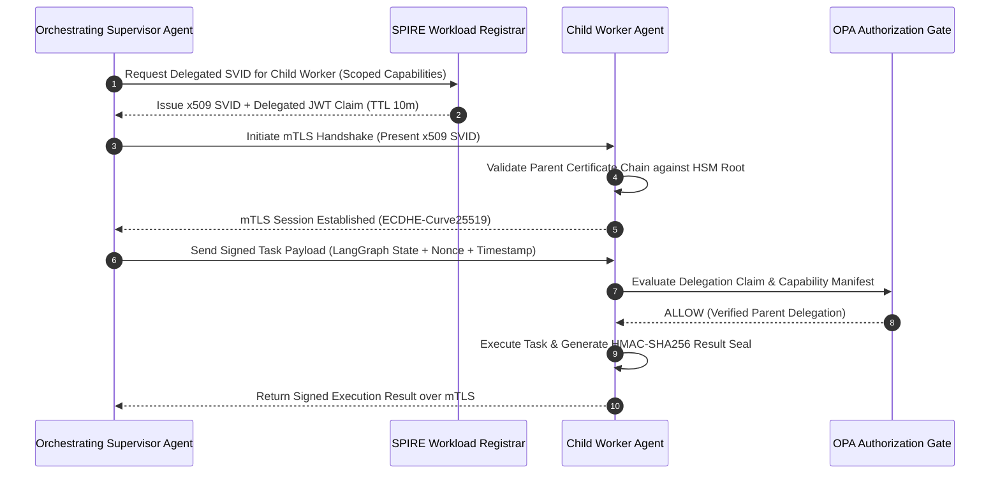

### 19.3 Design Principles

1. **Cryptographic Identity Uniqueness:** Every spawned agent task receives an ephemeral x509 SVID (`SPIFFE Verifiable Identity Document`) uniquely addressing the exact workflow execution instance (`spiffe://sentinel.internal/ns/{tenant}/sa/agent-{workflow_id}-{worker_id}`).
2. **Explicit Capability Delegation:** Delegation is non-transitive by default. A child agent cannot sub-delegate its parent's permissions to a third-tier agent unless explicit delegation depth tokens ($D_{max} > 1$) are cryptographically embedded in the JWT claim.
3. **Temporal & Replay Immunity:** All inter-agent RPCs carry mandatory timestamp headers and 128-bit cryptographic nonces verified against Redis sliding-window Bloom filters.

### 19.4 Detailed Explanation: Workload Identities, Signed Transfers, and Trust Graphs

#### SPIFFE/SPIRE Workload Identity Structure
When the Execution Orchestrator spawns an agent worker, the local SPIRE agent attests the worker process via kernel namespace verification and issues an x509 SVID:

```
Subject: CN = agent-worker-proc-8819, O = Sentinel OS Enterprise
X509v3 Subject Alternative Name:
    URI: spiffe://sentinel.internal/ns/tenant-7712/sa/agent-worker-finance-v4
```

#### Signed State Transfers & Replay Protection
During multi-agent state handoffs (`ADR-006`), the serialized JSON state payload is encapsulated in a signed envelope containing a monotonic UNIX timestamp and a unique 128-bit hexadecimal nonce:

```python
# Canonical Inter-Agent State Transfer Signing Contract
def sign_agent_state_transfer(parent_svid_key, target_spiffe_uri: str, state: dict) -> dict:
    payload = {
        "timestamp_utc": int(time.time()),
        "nonce": secrets.token_hex(16),
        "source_agent": "spiffe://sentinel.internal/ns/core/sa/orchestrator",
        "target_agent": target_spiffe_uri,
        "state_delta": state
    }
    canonical_bytes = json.dumps(payload, sort_keys=True).encode('utf-8')
    signature = parent_svid_key.sign(
        canonical_bytes,
        padding.PSS(mgf=padding.MGF1(hashes.SHA256()), salt_length=padding.PSS.MAX_LENGTH),
        hashes.SHA256()
    )
    return {
        "payload": payload,
        "signature_b64": base64.b64encode(signature).decode('utf-8'),
        "alg": "RSASSA-PSS-SHA256"
    }
```

Receiving agents reject payloads where $|T_{now} - T_{payload}| > 30\text{ seconds}$ or where `nonce` exists within the Redis Bloom deduplication index.

### 19.5 Engineering Rationale & Tradeoff Analysis

- **Engineering Rationale:** Enforcing SPIFFE workload identities and cryptographically signed state transfers ensures that even if an adversary achieves remote code execution inside a low-privilege analytics agent, they cannot spoof messages to financial or administrative worker agents.
- **Tradeoff Analysis:** Continuous x509 SVID issuance and verification across thousands of sub-second agent tasks increases SPIRE server CPU load and adds ~8ms to inter-agent task initialization.
- **Failure Modes:** SPIRE server certificate authority revocation distribution lag.
- **Recovery Strategies:** Local SPIRE agents maintain aggressive in-memory certificate revocation lists (CRLs) and fallback leaf certificates with strict 15-minute expiration bounds, ensuring zero unbounded persistence for compromised keys.

---

## 20. AI Runtime Isolation

### 20.1 Executive Summary

When autonomous agents process multi-tenant datasets or invoke capabilities (`ADR-007`, `ADR-014`), execution occurs across shared hardware compute clusters equipped with high-performance GPUs. Without rigorous physical and logical runtime isolation, residual GPU memory (VRAM), unscrubbed CPU registers, or shared kernel structures can leak confidential context windows across tenant boundaries. Chapter 20 defines the **AI Runtime Isolation Architecture**, mandating hardware-level GPU Multi-Instance micro-partitioning, deterministic VRAM zero-wiping between inference turns, Firecracker microVM execution encapsulation, and hardware Confidential Computing (AMD SEV-SNP / Intel TDX).

### 20.2 Runtime Isolation Topology Diagram

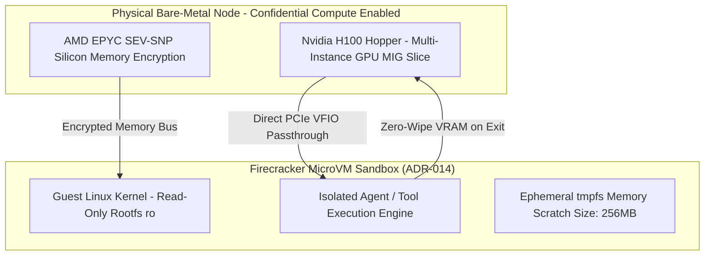

### 20.3 Design Principles

1. **Zero State Persistence Across Executions:** No tool sandbox or inference worker process survives across distinct agent task boundaries. Containers and microVMs terminate deterministically upon task completion.
2. **Hardware-Enforced Memory Scrubbing:** Volatile system RAM and GPU VRAM must undergo cryptographic zero-wiping (`ctypes.memset` / CUDA memory reset) before a compute slot is reassigned to another tenant.
3. **Micro-Segmentation of GPU Hardware:** Multi-tenant inference sharing a physical GPU must execute within hardware-isolated Multi-Instance GPU (MIG) slices maintaining independent cross-bar interconnects, L2 caches, and memory controllers.

### 20.4 Detailed Explanation: VRAM Scrubbing, MicroVMs, and Confidential AI

#### GPU Isolation & Deterministic VRAM Wiping
To prevent cross-tenant inference leakage via uninitialized VRAM allocations or lingering Key-Value (KV) cache tensors, Sentinel OS inference schedulers execute a kernel-level VRAM wipe routine immediately following generation completion:

```cpp
// Canonical CUDA VRAM Zero-Scrubbing Interface Contract
cudaError_t scrub_tenant_vram_slice(void* devPtr, size_t sizeBytes) {
    cudaError_t status = cudaMemsetAsync(devPtr, 0x00, sizeBytes, cudaStreamDefault);
    if (status != cudaSuccess) {
        // Critical hardware fault: Force node quarantine
        trigger_security_kernel_panic("FATAL: VRAM scrubbing failure detected.");
    }
    return cudaStreamSynchronize(cudaStreamDefault);
}
```

#### Firecracker MicroVM Sandbox (`ADR-014`)
Every capability binary executes inside a dedicated **Firecracker microVM** booted via KVM virtualization. The microVM initializes in $< 120\text{ms}$ with a strict seccomp profile dropping 300+ Linux syscalls.

#### Secure Context Caching & KV-Cache Poisoning Prevention
In enterprise RAG workflows, embedding context windows are cached in GPU memory to accelerate multi-turn inference. To prevent cache poisoning where an attacker injects adversarial prefixes into shared prefix caches:
- Every KV-cache slot is keyed by the cryptographic HMAC-SHA256 hash of `tenant_id + parent_jwt_sub + prompt_prefix`.
- Cache lookups strictly enforce exact key matching; prefix hits across mismatched tenant IDs trigger immediate cache eviction and security alerting.

### 20.5 Engineering Rationale & Tradeoff Analysis

- **Engineering Rationale:** Deploying Firecracker microVMs and hardware MIG slices eliminates Linux container escape vulnerabilities (e.g., `runc` CVEs or dirty pipe exploits) that could otherwise compromise host node kernel integrity.
- **Tradeoff Analysis:** Hardware MIG slicing limits dynamic GPU memory oversubscription, reducing total theoretical node density by ~18%.
- **Failure Modes:** GPU driver memory leak during abnormal microVM termination preventing complete VRAM deallocation.
- **Recovery Strategies:** Node health watchdogs monitor GPU memory allocation counters; any orphaned memory block detected post-task triggers an automated PCIe device bus reset (`nvidia-smi --gpu-reset`) before reinserting the GPU slice into the scheduling pool.

---

## 21. Policy Hierarchy

### 21.1 Executive Summary

In a multi-tenant enterprise operating system executing thousands of concurrent autonomous capabilities, access control cannot rely on flat role lists or uncoordinated microservice rules. When an enterprise user initiates a workflow (`ADR-006`) that spawns an autonomous worker agent (`ADR-008`), the agent's actions must be continuously constrained by regulatory compliance, corporate governance, organizational boundaries, tenant SLAs, and dynamic threat postures. If two policies conflict—such as a departmental policy allowing raw data export versus an enterprise regulatory policy forbidding PII exfiltration—the platform must resolve the conflict deterministically in $< 10\text{ms}$ without human intervention. Chapter 21 specifies the Sentinel OS **11-Layer Deterministic Policy Hierarchy**, establishing strict inheritance rules, conflict resolution priority matrices, and high-speed Open Policy Agent (OPA) Rego execution trees.

### 21.2 Architecture: 11-Layer Policy Evaluation Tree

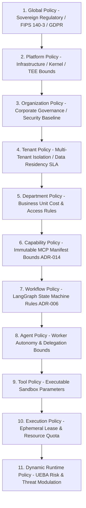

### 21.3 Design Principles

1. **Monotonic Privilege Reduction:** Permissions can only be restricted or filtered as evaluation traverses down the hierarchy from Global ($k=1$) to Dynamic Runtime ($k=11$). No lower-level policy ($k > n$) can ever grant a permission or widen a scope denied by an upper-level policy ($k \le n$).
2. **Deterministic Default-Deny:** If any policy level evaluates to `DENY` or encounters a syntax/evaluation timeout, the entire authorization chain aborts instantly with an authoritative `DENY`.
3. **Out-of-Band Immutable Compilation:** Policy bundles are compiled into WebAssembly (WASM) modules distributed via signed OCI registries (`ADR-012`), ensuring zero runtime evaluation overhead or policy tampering.

### 21.4 Detailed Explanation: Priority Resolution, Override Rules, and OPA Evaluation

#### Mathematical Formalization of Policy Priority Resolution
Let $\mathcal{P} = \{P_1, P_2, \dots, P_{11}\}$ represent the ordered set of policy layers. For any requested action $a$ against resource $r$ by subject $s$ under context $c$, each policy layer $P_k$ outputs a decision $d_k \in \{\text{ALLOW}, \text{DENY}, \text{REQUIRE\_HUMAN}, \text{NEUTRAL}\}$.

The effective platform decision $\mathcal{D}_{\text{eff}}(s, a, r, c)$ is computed deterministically as:

$$\mathcal{D}_{\text{eff}} = \begin{cases} \text{DENY} & \text{if } \exists k \in [1, 11] \text{ s.t. } d_k = \text{DENY} \\ \text{REQUIRE\_HUMAN} & \text{if } \forall k, d_k \neq \text{DENY} \text{ and } \exists j \in [1, 11] \text{ s.t. } d_j = \text{REQUIRE\_HUMAN} \\ \text{ALLOW} & \text{if } \forall k, d_k \in \{\text{ALLOW}, \text{NEUTRAL}\} \text{ and } \exists m \text{ s.t. } d_m = \text{ALLOW} \\ \text{DENY} & \text{otherwise (Implicit Default-Deny)} \end{cases}$$

#### Canonical OPA Rego Hierarchical Evaluation Contract
The local OPA sidecar evaluates the hierarchical policy tree using structured rule aggregation:

```rego
package sentinel.policy.hierarchy

import future.keywords.if
import future.keywords.in

default final_decision := "DENY"

final_decision := "DENY" if {
    some k in numbers.range(1, 11)
    layer_decisions[k] == "DENY"
}

final_decision := "REQUIRE_HUMAN" if {
    not final_decision == "DENY"
    some k in numbers.range(1, 11)
    layer_decisions[k] == "REQUIRE_HUMAN"
}

final_decision := "ALLOW" if {
    not final_decision in ["DENY", "REQUIRE_HUMAN"]
    some k in numbers.range(1, 11)
    layer_decisions[k] == "ALLOW"
}

# Sample Layer Evaluation: Tenant Policy (Layer 4)
layer_decisions[4] := decision if {
    input.resource.tenant_id == input.subject.tenant_id
    decision := "ALLOW"
} else := "DENY"
```

### 21.5 Engineering Rationale & Tradeoff Analysis

- **Engineering Rationale:** Enforcing an 11-layer hierarchical evaluation tree ensures absolute multi-tenant compliance where regulatory constraints ($P_1$) and tenant SLAs ($P_4$) physically override any developer or autonomous agent configuration.
- **Tradeoff Analysis:** Executing 11 sequential policy evaluations per RPC could degrade throughput; compiling Rego bundles into optimized WASM bytecodes executed inside Envoy sidecar filters reduces P99 evaluation latency to $< 1.8\text{ms}$.
- **Failure Modes:** Policy distribution split-brain where a node evaluates against a stale policy bundle.
- **Recovery Strategies:** Every request payload carries a policy bundle version manifest hash; if a sidecar detects its local WASM bundle is older than the ingress bundle timestamp by $> 60\text{ seconds}$, it halts processing and executes a synchronous OCI bundle pull.

---

## 22. AI Risk Engine

### 22.1 Executive Summary

Cognitive reasoning engines display varying degrees of operational uncertainty. While standard database CRUD queries execute with absolute determinism, autonomous agent reasoning loops synthesizing database updates, drafting external contracts, or triggering multi-agent sub-tasks carry probabilistic risks of hallucination, misinterpretation, or prompt injection. Treating all agent capabilities with uniform security rules either cripples productivity or invites catastrophic enterprise damage. Chapter 22 establishes the Sentinel OS **AI Risk Engine**, formalizing a 5-tier classification matrix (`LOW`, `MEDIUM`, `HIGH`, `CRITICAL`, `MISSION_CRITICAL`) that dynamically binds every agent action to exact approval gates (`ADR-008`), capability limits, logging SLAs, and automated suspension circuit breakers.

### 22.2 Architecture & Risk State Machine

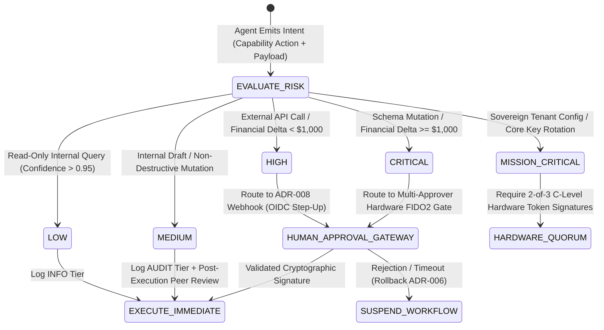

### 22.3 Detailed Explanation: Risk Matrix & Execution SLAs

| Risk Level | Typical Operational Scope | Approval Requirement (`ADR-008`) | Execution Limits & Tool Restrictions | Logging & Audit SLA | Rollback & Suspension Policy |
| :--- | :--- | :--- | :--- | :--- | :--- |
| **LOW** | Internal vector knowledge queries, telemetry summarization, non-PII read operations. | Fully Autonomous (Zero human latency). | Read-only filesystem, internal network namespace only, max CPU time 10s. | Standard `INFO` log emitted to local OpenTelemetry collector. | Automatic in-memory discard upon task exit. |
| **MEDIUM** | Drafting internal documents, generating analytical reports, updating staging database rows. | Autonomous with Post-Execution Asynchronous Audit Notification. | Ephemeral scratch write $\le 50\text{MB}$, restricted HTTPS egress to allowlisted internal APIs. | Structured `AUDIT` log signed via Ed25519 sent to WORM storage. | Deterministic LangGraph state rollback (`ADR-006`) upon validation error. |
| **HIGH** | Transmitting emails to external customers, financial transactions $< \$1,000$, modifying production customer CRM records. | Single Human Approver via Step-Up Authentication (MFA challenge). | Strict JSON Schema validation on tool args (`ADR-012`), runtime secret lease TTL 5m. | Immutable `FORENSIC_TRACE` log recording full prompt AST and tool output payload. | Automatic workflow halt; rollback Business Case delta within $< 500\text{ms}$. |
| **CRITICAL** | Bulk data exports ($> 10,000$ rows), financial transactions $\ge \$1,000$, production database schema migrations. | Dual Human Approval Quorum (Two independent authenticated managers via FIDO2 hardware keys). | Dedicated isolated microVM node, zero network ingress during execution, exact tool binary hash pinning. | Synchronous WORM persistence verification required prior to transaction commit. | Immediate workflow freezing (`SIGSTOP`); quarantine agent workload identity SVID. |
| **MISSION_CRITICAL** | Rotating root KMS/HSM keys, modifying enterprise OPA policy bundles, altering multi-tenant RLS policies. | Hardware Token Quorum (2-of-3 Chief Security Officer / DevSecOps Lead FIDO2 assertions). | Air-gapped TEE execution enclave only, zero external network routing, absolute memory wiping. | Cryptographic broadcast to enterprise SIEM and real-time C-suite paging alert. | Global cluster-wide circuit breaker; revert platform GitOps state to previous signed tag. |

### 22.4 Engineering Rationale & Tradeoff Analysis

- **Engineering Rationale:** Binding risk classification to concrete cryptographic approval gates (`ADR-008`) prevents autonomous neural agents from inadvertently executing irreversible enterprise actions while preserving high-speed execution for routine analytical workloads.
- **Tradeoff Analysis:** Routing `HIGH` and `CRITICAL` workflows through human gateways introduces asynchronous latency ranging from minutes to hours, breaking synchronous HTTP client expectations.
- **Failure Modes:** Approval gateway webhook unreachability stalling enterprise workflows indefinitely.
- **Recovery Strategies:** Workflows entering approval gates detach from synchronous execution threads, persisting state in PostgreSQL with an automated 24-hour expiration TTL that defaults to safe rollback (`REJECTED_BY_TIMEOUT`) if human signatures are not acquired.

---

## 23. End-to-End Cryptographic Trust Chain

### 23.1 Executive Summary

True enterprise Zero Trust requires that security assertions are not lost when execution traverses protocol boundaries. In complex Sentinel OS operations, a single human request initiates an execution chain spanning web gateways, OIDC providers, LangGraph workflow engines (`ADR-006`), autonomous agents (`ADR-005`), vector databases (`11_KNOWLEDGE_SYSTEM.md`), LLM reasoning servers, stateless capability microVMs (`ADR-014`), and HashiCorp Vault clusters. If any hop drops cryptographic context or relies on unverified implicit trust, end-to-end lineage and non-repudiation collapse. Chapter 23 formalizes the **15-Stage End-to-End Cryptographic Trust Chain**, specifying explicit authentication, authorization, signature verification, integrity, trace propagation, and non-repudiation contracts across every computational junction.

### 23.2 Architecture: Complete 15-Stage Chain of Custody

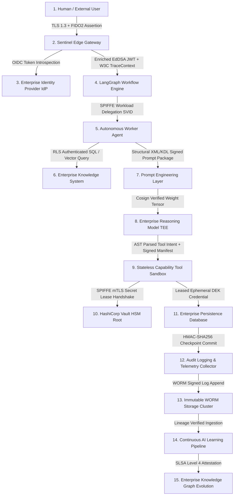

### 23.3 Detailed Explanation: Stage-by-Stage Security Contracts

| Stage # | Architectural Entity | Authentication Mechanism | Authorization Control | Signature & Integrity Verification | Trace Propagation & Non-Repudiation |
| :--- | :--- | :--- | :--- | :--- | :--- |
| **1** | **Human User** | FIDO2 / WebAuthn Hardware Key via SAML 2.0 / OIDC. | Enterprise IdP Group Membership & Clearance Level. | Hardware secure enclave assertion signature (`ECDSA-P256`). | W3C `traceparent` generated at browser/API client root. |
| **2** | **Edge Gateway** | mTLS client certificate + OAuth2 bearer token. | OPA Ingress Rego policy evaluation ($P_1 - P_4$). | Verification of IdP Ed25519 JWT public key signature. | Injection of canonical `X-Sentinel-Trace-ID` and correlation headers. |
| **3** | **Identity Provider** | FIPS 140-3 Level 3 HSM Root Key verification. | Token issuance scope restriction based on tenant baseline. | Cryptographic signing of access token (`kid` referencing HSM). | Complete token lifecycle audit record emitted to Kafka bus. |
| **4** | **Workflow Engine** | SPIFFE/SPIRE x509 SVID (`spiffe://.../orchestrator`). | Verification of JWT `allowed_capabilities` claim. | HMAC-SHA256 verification on incoming CloudEvents (`ADR-001`). | Append workflow execution step index to OpenTelemetry span. |
| **5** | **Worker Agent** | Delegated x509 SVID bound to parent workflow ID. | OPA Agent Policy gate ($P_8$) restricting tool reach. | Validation of parent delegation signature and 128-bit nonce. | Cryptographic recording of agent reasoning prompt AST in memory trace. |
| **6** | **Knowledge Layer** | mTLS database connection pool with session claims. | PostgreSQL Row-Level Security (RLS) kernel filtering. | Verification of Merkle tree lineage hash on retrieved vectors. | Attribution of retrieved document chunk IDs to agent inference span. |
| **7** | **Prompt Layer** | Verification of compiled `.spp` prompt package signature. | Tenant clearance check against prompt template security tag. | Ed25519 signature check against prompt package manifest. | Immutable embedding of prompt hash (`sha256:88a1...`) in inference audit. |
| **8** | **Reasoning Model** | Confidential Compute TEE silicon hardware attestation. | OCI digest pinning verified prior to model weight loading. | Cosign signature check on `.safetensors` weight file. | Emission of deterministic inference token usage and model card SBOM ID. |
| **9** | **Tool Sandbox** | Firecracker microVM kernel attestation via KVM. | Verification of Capability Manifest (`ADR-014`) allowed hosts. | SHA-256 binary hash check against manifest signature. | Capture of microVM stdout/stderr and seccomp syscall trace logs. |
| **10** | **Vault HSM** | SPIFFE mTLS authentication against Vault Secrets Agent. | OPA Policy check confirming tool authorized for secret lease. | TLS 1.3 session encryption + HSM unseal verification. | Log ephemeral lease ID (`lease_id: 99a1`) and exact 15m expiration TTL. |
| **11** | **Database** | Ephemeral dynamic PostgreSQL username/password lease. | Database table privileges scoped strictly to tool function. | Transparent Data Encryption (TDE) page checksum verification. | Record exact SQL query AST and affected row UUIDs in query audit. |
| **12** | **Audit Collector** | mTLS client certificate verification from tool/agent nodes. | Collector ingestion rate limiting and schema check (`ADR-012`). | Verification of event digital signature (`sentinelsig`). | Aggregation of distributed OpenTelemetry spans into unified trace graph. |
| **13** | **WORM Cluster** | Hardware write-once optical/immutable object storage lock. | Zero deletion or modification permissions for all roles. | Merkle tree chain hash calculation over sequential log blocks. | Cryptographic timestamping via RFC 3161 Time-Stamping Authority (TSA). |
| **14** | **Learning Pipeline**| Air-gapped mTLS ingestion worker identity. | Strict filtering rejecting non-verified provenance chunks. | Verification of WORM block Merkle roots prior to training. | Emission of training dataset lineage hash into updated model SBOM. |
| **15** | **Graph Evolution**| Knowledge Compiler (`ADR-019`) SPIFFE identity. | Bayesian epistemic confidence score threshold evaluation. | Signing of compiled knowledge graph edge predicates. | Final `in-toto` provenance manifest generation closing the trust loop. |

---

## 24. Runtime Security Score

### 24.1 Executive Summary

Binary access control decisions (`ALLOW` vs. `DENY`) fail to capture gradual cognitive or operational degradation. An autonomous agent might possess valid JWT credentials and pass initial OPA schema checks while subtly exhibiting anomalous behavior—such as querying unusual clusters of vector embeddings or initiating tool executions at abnormal frequencies. Chapter 24 designs the Sentinel OS **Continuous Runtime Security Scoring System**, defining a dynamic mathematical metric ($S_{rt} \in [0, 100]$) evaluated continuously at runtime across 11 normalized security vectors. Falling security scores automatically trigger non-linear penalties, throttling agent reasoning budgets, requiring step-up human authentication (`ADR-008`), or executing instantaneous cluster-wide workflow suspensions.

### 24.2 Mathematical Formulation & Non-Linear Weighting

Let $S_{rt}(t)$ represent the continuous Runtime Security Score of an active workflow execution at timestamp $t$. $S_{rt}(t)$ is computed as a weighted combination of 11 normalized confidence vectors $V_i(t) \in [0, 1]$, subject to exponential penalty decay for critical security indicators:

$$S_{rt}(t) = 100 \times \left( \sum_{i=1}^{11} w_i V_i(t) \right) \times \prod_{j \in \mathcal{K}} \exp\left( -\lambda_j (1 - V_j(t)) \right)$$

where $\sum_{i=1}^{11} w_i = 1.0$, $\mathcal{K}$ represents the subset of critical zero-tolerance vectors (Prompt Injection, Behavioral Anomaly, and Device Trust), and $\lambda_j \ge 4.0$ represents the exponential decay penalty coefficient.

#### Explicit Vector Definitions & Weighting Table

| Vector Identifier | Description & Telemetry Source | Baseline Normalized Range $[0, 1]$ | Linear Weight ($w_i$) | Exponential Penalty ($\lambda_j$) |
| :--- | :--- | :--- | :--- | :--- |
| **$V_1: C_{\text{auth}}$** | Authentication Confidence: Hardware FIDO2 vs. bearer token vs. session age. | $1.0$ (Fresh FIDO2) $\rightarrow 0.0$ (Expired/Missing) | $0.12$ | $0.0$ (Linear) |
| **$V_2: C_{\text{pol}}$** | Policy Confidence: Ratio of passed OPA Rego assertions across layers $P_1-P_{11}$. | $1.0$ (100% Pass) $\rightarrow 0.0$ (Failure) | $0.10$ | $0.0$ (Linear) |
| **$V_3: I_{\text{prompt}}$** | Prompt Injection Score: BERT classification confidence that prompt is benign. | $1.0$ (Benign) $\rightarrow 0.0$ (Active Attack) | $0.15$ | **$\lambda_3 = 6.0$ (Critical)** |
| **$V_4: T_{\text{know}}$** | Knowledge Trust Score: Average Bayesian epistemic score of retrieved RAG chunks. | $1.0$ (Verified Sovereign) $\rightarrow 0.0$ (Untrusted) | $0.08$ | $0.0$ (Linear) |
| **$V_5: T_{\text{tool}}$** | Tool Trust: Binary verification of SHA-256 capability manifest signature. | $1.0$ (Verified Manifest) $\rightarrow 0.0$ (Tampered)| $0.10$ | **$\lambda_5 = 8.0$ (Fatal)** |
| **$V_6: C_{\text{model}}$** | Model Confidence: Runtime TEE silicon attestation and Cosign weight verification. | $1.0$ (TEE Attested) $\rightarrow 0.0$ (Unverified) | $0.08$ | $0.0$ (Linear) |
| **$V_7: A_{\text{beh}}$** | Behavior Anomaly Score: UEBA neural network output evaluating RPC flow rate. | $1.0$ (Normal Baseline) $\rightarrow 0.0$ (High Anomaly)| $0.12$ | **$\lambda_7 = 4.5$ (Critical)** |
| **$V_8: T_{\text{ten}}$** | Tenant Trust: Verification of JWT `tenant_id` matching target database RLS rows. | $1.0$ (Strict Match) $\rightarrow 0.0$ (Mismatch) | $0.10$ | **$\lambda_8 = 10.0$ (Fatal)** |
| **$V_9: T_{\text{dev}}$** | Device Trust: TPM 2.0 remote boot attestation posture of host bare-metal node. | $1.0$ (Compliant Boot) $\rightarrow 0.0$ (Rooted/Drift) | $0.05$ | $0.0$ (Linear) |
| **$V_{10}: L_{\text{risk}}$** | Risk Level Modulation: Inverse penalty of target capability risk class (`ADR-007`).| $1.0$ (`LOW`) $\rightarrow 0.2$ (`MISSION_CRITICAL`) | $0.05$ | $0.0$ (Linear) |
| **$V_{11}: H_{\text{exec}}$** | Execution History: Historical pass/fail success ratio of the specific agent UUID. | $1.0$ (Zero Past Alerts) $\rightarrow 0.0$ (Flagged) | $0.05$ | $0.0$ (Linear) |

### 24.3 Runtime Evaluation Loop & Automated Circuit Breakers

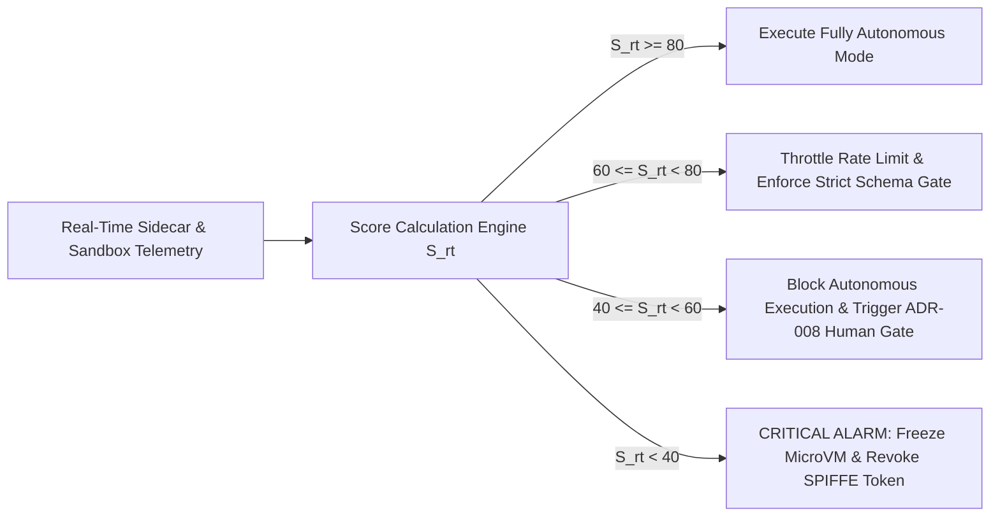

### 24.4 Engineering Rationale & Tradeoff Analysis

- **Engineering Rationale:** Utilizing non-linear exponential decay ($\lambda_j$) ensures that while minor telemetry fluctuations (such as an aging session token) smoothly lower the score, a single severe security violation—such as a prompt injection detection ($V_3 < 0.5$) or cross-tenant RLS mismatch ($V_8 = 0.0$)—instantly crashes $S_{rt}$ below $40$, triggering immediate workflow freezing prior to state commit.
- **Tradeoff Analysis:** Evaluating 11 continuous vectors across streaming telemetry requires dedicated Redis memory allocation and stream processing compute cycles.
- **Failure Modes:** Telemetry collector congestion delaying score updates during rapid multi-step agent reasoning chains.
- **Recovery Strategies:** Every agent worker sidecar runs a local lightweight approximation of $S_{rt}$ evaluating local vectors ($V_1, V_2, V_3, V_5, V_8$) synchronously on the request path in $< 0.4\text{ms}$, ensuring critical circuit breakers execute instantaneously even during central telemetry collector outages.

---

## 25. Future Evolution

To maintain security leadership against emerging computational threats over the next decade, Sentinel OS's architectural roadmap incorporates three advanced security paradigms:

### 25.1 Confidential Computing & Trusted Execution Environments (TEEs)

By Q4 2026, all core reasoning engines, memory indexing pipelines, and HashiCorp Vault instances will transition to hardware-enforced **Confidential Computing** environments utilizing AMD SEV-SNP (Secure Encrypted Virtualization-Secure Nested Paging) and Intel TDX (Trust Domain Extensions).

Within a TEE, memory contents are encrypted at the silicon memory bus level using hardware-generated ephemeral keys inaccessible even to cloud infrastructure providers, hypervisors, or host operating systems. This guarantees total data-in-use privacy for multi-tenant LLM reasoning.

### 25.2 Post-Quantum Cryptography (PQC) Migration

Recognizing the threat of "Harvest Now, Decrypt Later" quantum computing attacks against classical asymmetric cryptography (`Ed25519`, `ECDHE`), Sentinel OS is engineering a phased transition to NIST-standardized Post-Quantum Cryptographic algorithms:
- **Key Exchange Protocols:** Hybrid TLS 1.3 handshakes combining `X25519` with **ML-KEM (CRYSTALS-Kyber)**.
- **Digital Signatures:** Transitioning JWT signing and CloudEvents payload signatures to **ML-DSA (CRYSTALS-Dilithium)** and stateless hash-based **SLH-DSA (SPHINCS+)** for long-term root certificate authorities.

### 25.3 Autonomous Adversarial Threat Detection & Self-Healing Security

Future releases will embed specialized, small-footprint cognitive security agents directly inside the microservice mesh. These autonomous security agents continuously analyze execution graphs, network flows, and prompt mutations in real time using reinforcement learning models. Upon detecting zero-day behavioral anomalies, the self-healing security mesh autonomously synthesizes and deploys eBPF firewall filters and OPA Rego patches cluster-wide without human intervention.

---

> **End of Specification — Authoritative Engineering Contract**  
> *Sentinel OS Engineering Leadership — Zero Trust Architecture Group*

