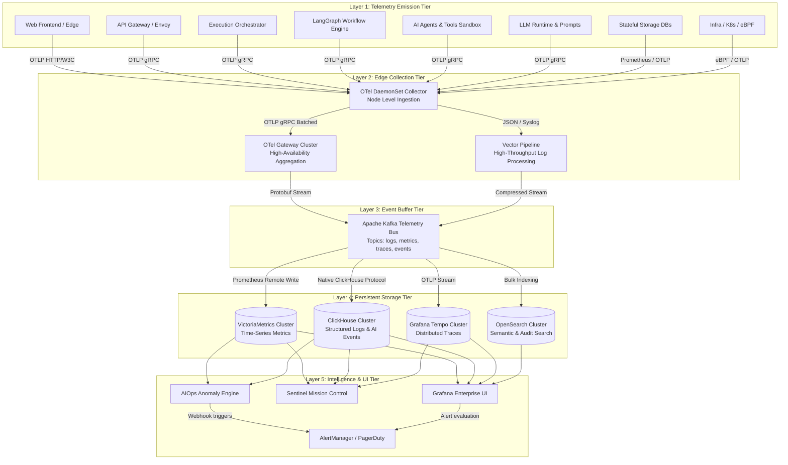
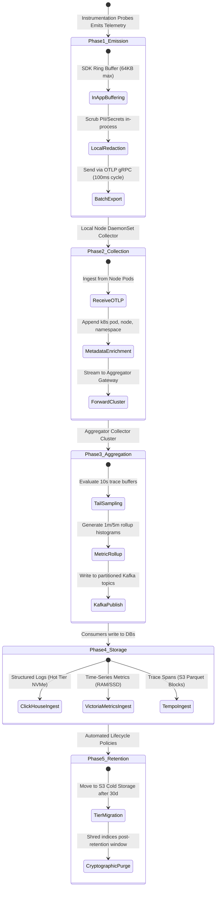
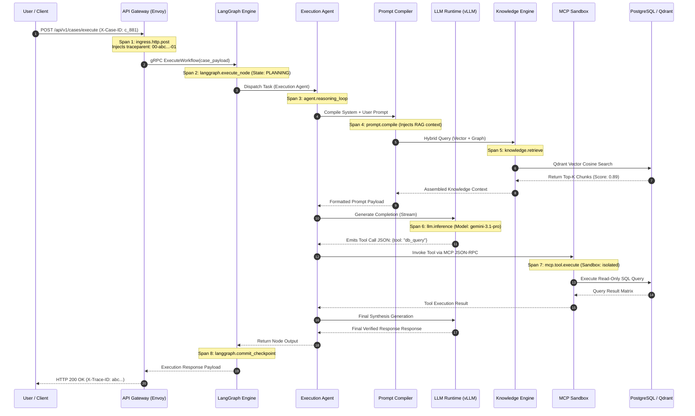
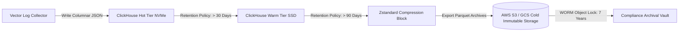
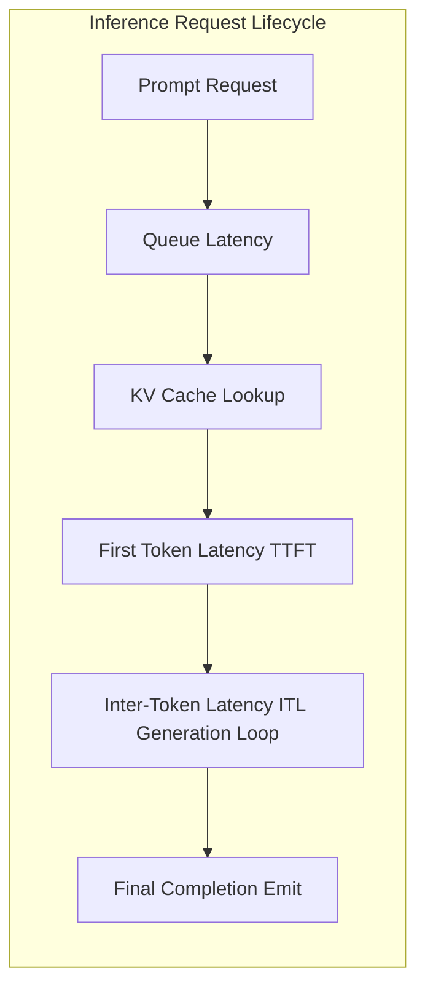
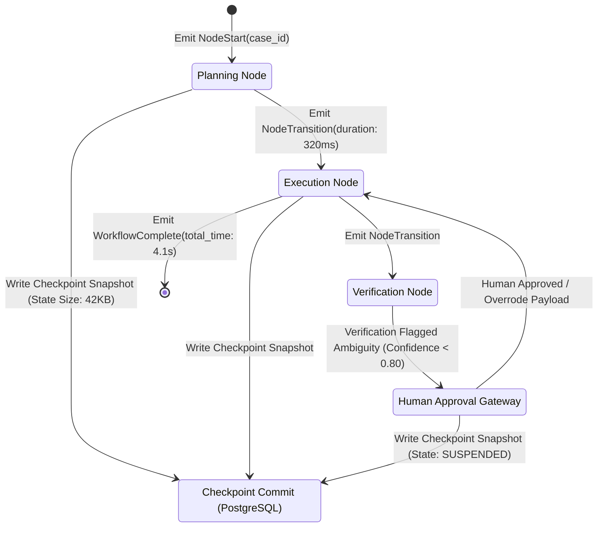
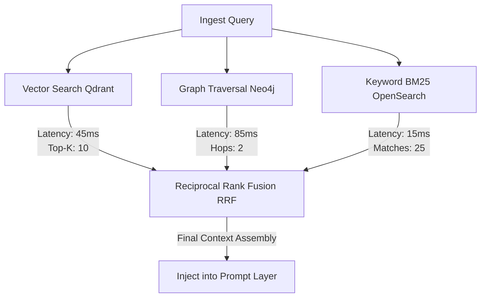
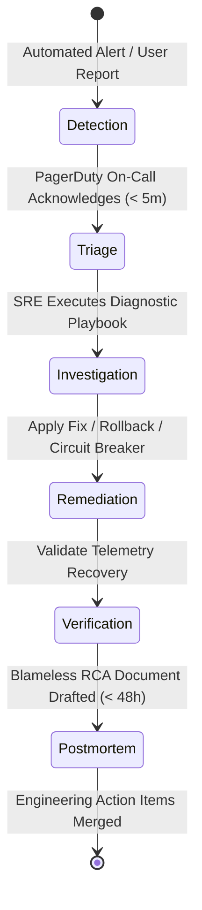

# Sentinel OS — Enterprise Observability & Operational Intelligence Specification (Engineering Implementation Contract)

> **Document Class:** Definitive Engineering Reference & Implementation Contract  
> **Audience:** Chief Observability Architects, Principal Site Reliability Engineers (SREs), Principal Platform Engineers, Principal AI Infrastructure Engineers, Distributed Systems Architects, and DevSecOps Leads  
> **Status:** Authoritative — Version 2.0 (Exhaustive Specification)  
> **Last Updated:** 2026-07-03  
> **Parent Documents:**  
> - [00_MASTER_CONTEXT.md](../architecture/00_MASTER_CONTEXT.md)  
> - [01_PROJECT_VISION.md](../architecture/01_PROJECT_VISION.md)  
> - [02_PRODUCT_REQUIREMENTS.md](../architecture/02_PRODUCT_REQUIREMENTS.md)  
> - [03_ARCHITECTURE.md](../architecture/03_ARCHITECTURE.md)  
> - [04_DATABASE.md](../architecture/04_DATABASE.md)  
> - [05_API_SPEC.md](../architecture/05_API_SPEC.md)  
> - [06_CAPABILITY_SPECIFICATIONS.md](../architecture/06_CAPABILITY_SPECIFICATIONS.md)  
> - [07_WORKFLOW_ENGINE.md](../architecture/07_WORKFLOW_ENGINE.md)  
> - [08_AGENT_SPECIFICATIONS.md](./08_AGENT_SPECIFICATIONS.md)  
> - [09_TOOLING_AND_MCP.md](./09_TOOLING_AND_MCP.md)  
> - [10_PROMPT_ENGINEERING.md](./10_PROMPT_ENGINEERING.md)  
> - [11_KNOWLEDGE_SYSTEM.md](./11_KNOWLEDGE_SYSTEM.md)  
> - [12_SECURITY.md](./12_SECURITY.md)  
> - [15_ARCHITECTURE_DECISIONS.md](../adr/15_ARCHITECTURE_DECISIONS.md)  
>  
> **Binding Architecture Decisions (ADRs):**  
> ADR-001 (Event-Driven Architecture), ADR-002 (Five-Layer Architecture), ADR-004 (Business Case Core Object), ADR-005 (Execution Orchestrator Pattern), ADR-006 (Single LangGraph Workflow), ADR-007 (Stateless Capabilities), ADR-008 (Human Approval Gateway), ADR-011 (Unified Knowledge Graph & Vector Hybrid Engine), ADR-012 (Shared Schemas Package), ADR-014 (Stateless Tool Sandbox & Model Context Protocol Standard), ADR-016 (Multi-Tier Enterprise Memory Hierarchy), ADR-019 (Enterprise Knowledge Definition Language & Compiler Pipeline)

---

## Table of Contents

1. [Executive Summary](#1-executive-summary)  
   1.1 [Epistemological & Architectural Necessity of Observability in Autonomous AI Systems](#11-epistemological--architectural-necessity-of-observability-in-autonomous-ai-systems)  
   1.2 [Taxonomy of Platform Visibility: Monitoring vs. Logging vs. Tracing vs. Observability vs. Telemetry vs. AI Observability vs. Operational Intelligence vs. Business Observability](#12-taxonomy-of-platform-visibility)  
   1.3 [The Sentinel OS Observability Philosophy & Seven Axiomatic Tenets](#13-the-sentinel-os-observability-philosophy--seven-axiomatic-tenets)  
2. [Observability Architecture](#2-observability-architecture)  
   2.1 [Complete Platform Observability Architecture & Five-Tier Telemetry Pipeline](#21-complete-platform-observability-architecture--five-tier-telemetry-pipeline)  
   2.2 [OpenTelemetry (OTel) Collector Topology, DaemonSet Agents, and Aggregator Gateway Clusters](#22-opentelemetry-otel-collector-topology-daemonset-agents-and-aggregator-gateway-clusters)  
   2.3 [Storage Tier Topology: ClickHouse, VictoriaMetrics, Grafana Tempo, and OpenSearch](#23-storage-tier-topology)  
   2.4 [Unified Context Propagation: Trace IDs, Span IDs, Correlation IDs, and Business Case IDs](#24-unified-context-propagation)  
3. [Telemetry Architecture](#3-telemetry-architecture)  
   3.1 [Subsystem Telemetry Matrix Across 12 Domain Boundaries](#31-subsystem-telemetry-matrix-across-12-domain-boundaries)  
   3.2 [Instrumentation Standards Across SDKs, eBPF Kernel Probes, and AI Runtimes](#32-instrumentation-standards-across-sdks-ebpf-kernel-probes-and-ai-runtimes)  
   3.3 [Collection, Aggregation, Export, Storage, and Retention Lifecycle](#33-collection-aggregation-export-storage-and-retention-lifecycle)  
4. [Distributed Tracing](#4-distributed-tracing)  
   4.1 [End-to-End Execution Trace Topology Across 16 Platform Layers](#41-end-to-end-execution-trace-topology-across-16-platform-layers)  
   4.2 [W3C Trace Context & W3C Baggage Propagation Mechanics](#42-w3c-trace-context--w3c-baggage-propagation-mechanics)  
   4.3 [Span Hierarchy Standards & Semantic Naming Rules](#43-span-hierarchy-standards--semantic-naming-rules)  
   4.4 [Adaptive Sampling Algorithms & Tail-Based Retention Policy](#44-adaptive-sampling-algorithms--tail-based-retention-policy)  
   4.5 [Latency Critical Path Analysis & Automated Failure Localization](#45-latency-critical-path-analysis--automated-failure-localization)  
5. [Metrics Architecture](#5-metrics-architecture)  
   5.1 [Comprehensive Metric Taxonomy & Exhaustive Catalog](#51-comprehensive-metric-taxonomy--exhaustive-catalog)  
   5.2 [Prometheus & OpenTelemetry Metric Type Conventions](#52-prometheus--opentelemetry-metric-type-conventions)  
   5.3 [Cardinality Budgeting, Label Governance, and High-Cardinality Mitigation](#53-cardinality-budgeting-label-governance-and-high-cardinality-mitigation)  
6. [Logging Architecture](#6-logging-architecture)  
   6.1 [Universal Structured JSON Log Schema Across Five Event Classes](#61-universal-structured-json-log-schema-across-five-event-classes)  
   6.2 [Log Levels, Severity Thresholds, and Semantic Trigger Definitions](#62-log-levels-severity-thresholds-and-semantic-trigger-definitions)  
   6.3 [Automated Redaction, Zero Trust Token Masking, and PII/PHI Handling](#63-automated-redaction-zero-trust-token-masking-and-piiphi-handling)  
   6.4 [Log Aggregation, Cold Tier Rotation, and Compliance Archival](#64-log-aggregation-cold-tier-rotation-and-compliance-archival)  
7. [AI Observability](#7-ai-observability)  
   7.1 [LLM Runtime & Inference Telemetry (TTFT, ITL, KV Cache, Token Entropy)](#71-llm-runtime--inference-telemetry)  
   7.2 [Prompt Layer & Context Engineering Telemetry](#72-prompt-layer--context-engineering-telemetry)  
   7.3 [Cognitive & Reasoning Quality Telemetry](#73-cognitive--reasoning-quality-telemetry)  
   7.4 [Rigorous Mathematical Formulations for AI Quality & Cost Metrics](#74-rigorous-mathematical-formulations-for-ai-quality--cost-metrics)  
8. [Workflow Observability](#8-workflow-observability)  
   8.1 [LangGraph State Machine Observability & Checkpoint Tracking](#81-langgraph-state-machine-observability--checkpoint-tracking)  
   8.2 [State Replay Mechanics & Deterministic Debugging Pipeline](#82-state-replay-mechanics--deterministic-debugging-pipeline)  
   8.3 [Human Approval Gateway & Compensation Loop Tracking](#83-human-approval-gateway--compensation-loop-tracking)  
9. [Event Bus Observability](#9-event-bus-observability)  
   9.1 [Apache Kafka & Redis Streams Telemetry](#91-apache-kafka--redis-streams-telemetry)  
   9.2 [Partition Health, Consumer Group Lag, and Ordering Guarantee Verification](#92-partition-health-consumer-group-lag-and-ordering-guarantee-verification)  
   9.3 [Dead Letter Queue (DLQ) Monitoring & Poison Pill Lifecycle](#93-dead-letter-queue-dlq-monitoring--poison-pill-lifecycle)  
10. [Knowledge Observability](#10-knowledge-observability)  
    10.1 [Hybrid Retrieval Pipeline Telemetry (Vector + Graph + Keyword)](#101-hybrid-retrieval-pipeline-telemetry)  
    10.2 [Knowledge Compiler Pipeline & Chunk Quality Telemetry](#102-knowledge-compiler-pipeline--chunk-quality-telemetry)  
    10.3 [Multi-Tier Memory Synchronization & Reflection Engine Telemetry](#103-multi-tier-memory-synchronization--reflection-engine-telemetry)  
11. [Infrastructure Observability](#11-infrastructure-observability)  
    11.1 [Kubernetes Cluster & Container Topology Telemetry](#111-kubernetes-cluster--container-topology-telemetry)  
    11.2 [Hardware Accelerator (NVIDIA GPU / TPU) Telemetry](#112-hardware-accelerator-nvidia-gpu--tpu-telemetry)  
    11.3 [Stateful Storage Engine Telemetry (PostgreSQL, Redis, Neo4j, Qdrant)](#113-stateful-storage-engine-telemetry)  
12. [Dashboards](#12-dashboards)  
    12.1 [Dashboard Architecture & UI/UX Design System (3-30-300 Rule)](#121-dashboard-architecture--uiux-design-system)  
    12.2 [Detailed Dashboard Specifications & ASCII Wireframes](#122-detailed-dashboard-specifications--ascii-wireframes)  
13. [Alerting Architecture](#13-alerting-architecture)  
    13.1 [Alert Routing & Severity Matrix](#131-alert-routing--severity-matrix)  
    13.2 [Alert Manager Configuration & Deduplication Engine](#132-alert-manager-configuration--deduplication-engine)  
    13.3 [Automated Incident Escalation & Self-Healing Remediation Hooks](#133-automated-incident-escalation--self-healing-remediation-hooks)  
14. [SLO / SLA / SLI Framework](#14-slo--sla--sli-framework)  
    14.1 [SLI Formulation & Measurement Specifications](#141-sli-formulation--measurement-specifications)  
    14.2 [Service Level Objectives (SLOs) & Error Budget Governance](#142-service-level-objectives-slos--error-budget-governance)  
    14.3 [External Service Level Agreements (SLAs) & Financial Penalties](#143-external-service-level-agreements-slas--financial-penalties)  
15. [Incident Response Architecture](#15-incident-response-architecture)  
    15.1 [Incident Lifecycle: Detection to Postmortem](#151-incident-lifecycle-detection-to-postmortem)  
    15.2 [Automated Diagnostics Engine & Root Cause Analysis (RCA) Playbooks](#152-automated-diagnostics-engine--root-cause-analysis-rca-playbooks)  
    15.3 [Operational Runbooks Across All Subsystems](#153-operational-runbooks-across-all-subsystems)  
16. [Chaos Engineering](#16-chaos-engineering)  
    16.1 [Chaos Engineering Philosophy & Fault Injection Taxonomy](#161-chaos-engineering-philosophy--fault-injection-taxonomy)  
    16.2 [Detailed Chaos Experiment Specifications](#162-detailed-chaos-experiment-specifications)  
    16.3 [Automated Recovery Verification & Steady-State Validation](#163-automated-recovery-verification--steady-state-validation)  
17. [Performance Engineering](#17-performance-engineering)  
    17.1 [Load Benchmarking & Stress Testing Protocols](#171-load-benchmarking--stress-testing-protocols)  
    17.2 [Continuous Profiling (eBPF) & Latency Budget Allocations](#172-continuous-profiling-ebpf--latency-budget-allocations)  
    17.3 [Capacity Planning Mathematical Models & Auto-Scaling Bounds](#173-capacity-planning-mathematical-models--auto-scaling-bounds)  
18. [Observability Governance](#18-observability-governance)  
    18.1 [Telemetry Standard Schema & CI/CD Linter Governance](#181-telemetry-standard-schema--cicd-linter-governance)  
    18.2 [Data Privacy, GDPR/HIPAA Telemetry Scrubbing, and Compliance Auditing](#182-data-privacy-gdprhipaa-telemetry-scrubbing-and-compliance-auditing)  
    18.3 [Subsystem Ownership Matrix & SRE Operational Boundaries](#183-subsystem-ownership-matrix--sre-operational-boundaries)  
19. [Future Evolution](#19-future-evolution)  
    19.1 [Autonomous Root Cause Analysis via Digital Twin Simulation](#191-autonomous-root-cause-analysis-via-digital-twin-simulation)  
    19.2 [Predictive Telemetry & AI-Driven Pre-Incident Mitigation](#192-predictive-telemetry--ai-driven-pre-incident-mitigation)  
    19.3 [Self-Healing LangGraph Workflows & Autonomous SRE Agents](#193-self-healing-langgraph-workflows--autonomous-sRE-agents)  

---

## 1. Executive Summary

### 1.1 Epistemological & Architectural Necessity of Observability in Autonomous AI Systems

Traditional enterprise observability paradigms rely primarily on structured logging and static infrastructure metrics. In classical deterministic software architectures—such as standard three-tier web applications or basic stateless microservices—a synchronous request follows a predictable execution trajectory. An error can be diagnosed by inspecting application log streams matched to a localized thread ID or request URI.

In **Sentinel OS**, traditional logging fails entirely due to the non-deterministic, multi-agent, asynchronous, and stateful nature of the platform. Sentinel OS operates on a **Single LangGraph Workflow (ADR-006)** executed by the **Execution Orchestrator (ADR-005)**, coordinating specialized autonomous agents (Execution Agent, Verification Agent, Planning Agent, Knowledge Agent) over distributed event streams (**ADR-001**). When a business failure occurs—such as a hallucinated reasoning step leading to an invalid tool invocation or an infinite compensation retry loop—traditional logs provide only isolated, uncontextualized text emissions.

```
Classical Monolith/Microservice:
[User Request] ──> [HTTP Gateway] ──> [Database Query] ──> [Response] (Deterministic execution; flat log trace sufficient)

Sentinel OS Autonomous Cognitive System:
[Business Case] ──> [API Gateway] ──> [Kafka Event Bus] ──> [Execution Orchestrator] ──> [LangGraph State Machine]
                                                                                                    │
       ┌───────────────────────────────┬────────────────────────────────┬───────────────────────────┘
       ▼                               ▼                                ▼
[Planning Agent]               [Execution Agent]               [Verification Agent]
  ├─> Model Router (Fallback)    ├─> MCP Tool Sandbox            ├─> Code AST Linter
  ├─> Context Engine             ├─> Vector DB (Qdrant)          ├─> Security Policy Sandbox
  └─> LLM Inference              └─> Graph DB (Neo4j)            └─> Consensus Engine
```

Logging fails in this topology because:
1. **Non-Linear Execution & Recursive Loops:** Agents dynamically branch, reflect, self-correct, and invoke tools via the **Model Context Protocol (ADR-014)**. A single business request may generate hundreds of recursive state evaluations. Without rigorous graph-based tracing and state snapshots, a log entry stating `"Tool execution failed"` is meaningless.
2. **High-Dimensional State Context:** Agent execution depends on dynamic vector embeddings, graph traversals, prompt template transformations, and token-level log-probabilities. Capturing these multi-megabyte payloads in unstructured log files destroys storage clusters and precludes structured analytics.
3. **Emergent Cognitive Failure Modes:** AI systems exhibit emergent failures such as semantic drift, prompt injection exploitation, context window truncation, and knowledge retrieval degradation. These failures do not throw programmatic stack traces (`NullPointerException` or `500 Internal Server Error`); they succeed HTTP execution while failing cognitive intent. Diagnosing cognitive failure requires **AI Observability** combining semantic tracing, embedding distance tracking, and confidence scoring.

### 1.2 Taxonomy of Platform Visibility

To govern Sentinel OS, engineering teams must operate across an explicit taxonomy of visibility tiers:

| Dimension | Definition | Primary Mechanism | Sentinel OS Implementation |
| :--- | :--- | :--- | :--- |
| **Monitoring** | Periodic polling of system metrics to verify deterministic operational boundaries against predefined thresholds. | Gauge/Counter collection, alerting rules. | Prometheus scraping Kubernetes CPU/Memory, PostgreSQL buffer hit ratios, and Kafka lag. |
| **Logging** | Discrete, timestamped event emissions recording immutable occurrences within individual execution boundaries. | Structured JSON strings, stdout/stderr streams. | Vector scraping application JSON logs formatted with W3C Trace Context and zero-trust redactors. |
| **Tracing** | Directed Acyclic Graph (DAG) representation of causally linked causal events across distributed network and runtime boundaries. | OpenTelemetry spans, context propagation headers. | End-to-end W3C distributed tracing spanning API Gateway $\rightarrow$ LangGraph $\rightarrow$ LLM Inference $\rightarrow$ MCP Tool. |
| **Observability** | Mathematical capability to infer internal system states based exclusively on external telemetry outputs without altering runtime code. | High-cardinality correlation across logs, metrics, traces. | ClickHouse + VictoriaMetrics + Tempo unified correlation engine powered by unified labels. |
| **Telemetry** | Raw, uncurated physical data streams (metrics, logs, traces, profiles) emitted by instrumentation probes. | OTel SDKs, eBPF probes, custom instrumentation hooks. | Standardized OpenTelemetry OTLP gRPC payload streaming from all 16 platform sublayers. |
| **AI Observability** | Quantitative tracking of cognitive fidelity, LLM inference parameters, vector space dynamics, and agentic reasoning paths. | Semantic tracing, embedding telemetry, evaluation hooks. | Prompt latency, token entropy, cosine retrieval precision, hallucination indices, tool accuracy. |
| **Operational Intelligence** | Automated correlation of infrastructure health with runtime performance to predict failures and execute self-healing. | AIOps pipelines, anomaly detection, dynamic thresholds. | Real-time correlation of GPU HBM thermal throttling with LLM generation token latency degradation. |
| **Business Observability** | Direct correlation of technical telemetry to enterprise KPIs, financial costs, and **Business Case Core Objects (ADR-004)**. | Financial attribution models, SLA engines, case tracking. | Cost-per-workflow calculation, revenue impact of agent fallback, workflow completion cycle time. |

### 1.3 The Sentinel OS Observability Philosophy & Seven Axiomatic Tenets

Observability in Sentinel OS is governed by seven immutable tenets:

```
┌───────────────────────────────────────────────────────────────────────────────────────────────────┐
│                           TENET 1: Observability is a Core Platform Capability                    │
├───────────────────────────────────────────────────────────────────────────────────────────────────┤
│                           TENET 2: Zero Instrumentation Blind Spots                               │
├───────────────────────────────────────────────────────────────────────────────────────────────────┤
│                           TENET 3: Unified Correlation via Business Case ID                       │
├───────────────────────────────────────────────────────────────────────────────────────────────────┤
│                           TENET 4: Cognitive & Semantic Rigor                                     │
├───────────────────────────────────────────────────────────────────────────────────────────────────┤
│                           TENET 5: Zero-Trust Telemetry & Privacy by Default                      │
├───────────────────────────────────────────────────────────────────────────────────────────────────┤
│                           TENET 6: Sub-Second Operational Feedback Loops                          │
├───────────────────────────────────────────────────────────────────────────────────────────────────┤
│                           TENET 7: Mathematical Governance & strict Budgeting                     │
└───────────────────────────────────────────────────────────────────────────────────────────────────┘
```

1. **Observability is a Core Platform Capability:** Observability is never bolted on post-deployment. Every new capability, agent, tool, or database schema must include complete instrumentation, dashboard specifications, alert rules, and runbooks as part of its definition of done.
2. **Zero Instrumentation Blind Spots:** Every subcomponent—from core Linux kernel eBPF network sockets to LangGraph edge transitions and MCP JSON-RPC socket frames—must emit standardized telemetry. Unmonitored execution pathways are classified as high-severity security and reliability defects.
3. **Unified Correlation via Business Case ID:** Every single log, metric label, trace span, and profiling frame must carry the **Business Case ID (`case_id`)** alongside W3C Trace IDs (`trace_id`). This bridges physical infrastructure telemetry directly to enterprise customer value.
4. **Cognitive & Semantic Rigor:** AI telemetry must go beyond token counts. Sentinel OS measures semantic similarity vectors, knowledge retrieval precision, prompt injection anomalies, and reasoning tree depth in real time.
5. **Zero-Trust Telemetry & Privacy by Default:** Telemetry pipelines are potential vectors for sensitive data exfiltration. All logs, traces, and metrics undergo strict in-memory redaction of PII, PHI, API keys, and enterprise secrets before leaving the runtime memory space.
6. **Sub-Second Operational Feedback Loops:** Telemetry ingestion, stream processing, anomaly detection, and alert generation must execute within a strict latency budget ($\le 500\text{ ms}$) to enable automated compensation loops and self-healing.
7. **Mathematical Governance & Strict Budgeting:** Telemetry generation is bound by strict cardinality budgets, storage quotas, and network bandwidth constraints. Uncontrolled telemetry explosion is mitigated via adaptive tail-based sampling and dynamic metric aggregation.

---

## 2. Observability Architecture

### 2.1 Complete Platform Observability Architecture & Five-Tier Telemetry Pipeline

The Sentinel OS observability architecture decouples telemetry emission from storage and analytics through a resilient, highly available multi-tier data pipeline designed to handle over 1,000,000 telemetry events per second.



### 2.2 OpenTelemetry (OTel) Collector Topology, DaemonSet Agents, and Aggregator Gateway Clusters

Sentinel OS utilizes a two-tier OpenTelemetry Collector topology deployed within Kubernetes:

1. **Edge Agent Tier (DaemonSet):** Deployed on every Kubernetes physical node. It receives OTLP gRPC/HTTP traffic on `localhost:4317`/`localhost:4318`, collects host-level cgroup/eBPF metrics, scrapes container logs directly from `/var/log/pods`, applies initial PII redaction, and executes local batching ($\le 2\text{ MB}$ payload or $100\text{ ms}$ flush timeout).
2. **Aggregator Gateway Tier (Deployment Horizontal Cluster):** A highly scalable cluster of OTel Collectors sitting behind a Layer 4 load balancer. It performs cluster-wide tail-based trace sampling, metric rollup/downsampling, cardinality validation, and routes streams to the Kafka buffering tier.

```yaml
# Authoritative OpenTelemetry Aggregator Collector Configuration Specification
receivers:
  otlp:
    protocols:
      grpc:
        endpoint: 0.0.0.0:4317
        max_recv_msg_size_mib: 32
      http:
        endpoint: 0.0.0.0:4318
  kafka:
    protocol_version: 3.4.0
    brokers: ["kafka-telemetry-0.kafka.sentinel-infra.svc:9092"]
    topic: raw-telemetry-spans

processors:
  memory_limiter:
    check_interval: 1s
    limit_percentage: 80
    spike_limit_percentage: 25
  batch:
    send_batch_size: 8192
    timeout: 200ms
    send_batch_max_size: 16384
  tail_sampling:
    decision_wait: 10s
    num_traces: 100000
    expected_new_traces_per_sec: 5000
    policies:
      [
        { name: error-spans, type: status_code, status_code: { status_codes: [ERROR] } },
        { name: high-latency, type: latency, latency: { threshold_ms: 2500 } },
        { name: ai-fallback, type: string_attribute, string_attribute: { key: "ai.fallback_triggered", values: ["true"] } },
        { name: probabilistic-baseline, type: probabilistic, probabilistic: { sampling_percentage: 5.0 } }
      ]
  attributes/data-scrubbing:
    actions:
      - key: http.request.header.authorization
        action: delete
      - key: ai.prompt.text
        regex_pattern: '(?i)(api_key|secret|password)\s*[:=]\s*([^\s,]+)'
        replacement: '[REDACTED_CREDENTIAL]'
        action: hash

exporters:
  otlp/tempo:
    endpoint: "tempo-distributor.sentinel-observability.svc:4317"
    tls: { insecure: true }
  clickhouse:
    endpoint: "tcp://clickhouse-cluster.sentinel-observability.svc:9000"
    database: "sentinel_telemetry"
    logs_table_name: "logs_all"
    traces_table_name: "spans_all"
  prometheusremotewrite:
    endpoint: "http://victoriametrics.sentinel-observability.svc:8428/api/v1/write"

service:
  pipelines:
    traces:
      receivers: [otlp]
      processors: [memory_limiter, attributes/data-scrubbing, tail_sampling, batch]
      exporters: [otlp/tempo, clickhouse]
    metrics:
      receivers: [otlp]
      processors: [memory_limiter, batch]
      exporters: [prometheusremotewrite]
    logs:
      receivers: [otlp]
      processors: [memory_limiter, attributes/data-scrubbing, batch]
      exporters: [clickhouse]
```

### 2.3 Storage Tier Topology: ClickHouse, VictoriaMetrics, Grafana Tempo, and OpenSearch

To achieve sub-second query performance over petabytes of historical telemetry without incurring catastrophic cloud storage costs, Sentinel OS distributes telemetry across four specialized database engines:

```
┌────────────────────────────────────────────────────────────────────────────────────────────────────────┐
│                                   STORAGE TIER ARCHITECTURE                                            │
├──────────────────────────┬───────────────────────────┬──────────────────────────┬──────────────────────┤
│ VICTORIAMETRICS          │ CLICKHOUSE                │ GRAFANA TEMPO            │ OPENSEARCH           │
│ (Time-Series Metrics)    │ (Structured Logs/AI Events)│ (Distributed Traces)     │ (Semantic Search)    │
├──────────────────────────┼───────────────────────────┼──────────────────────────┼──────────────────────┤
│ • Ingestion: 2M pts/sec  │ • Ingestion: 1.5M rows/sec│ • Ingestion: 500MB/sec   │ • Ingestion: 50K/sec │
│ • Compression: ~0.4B/pt  │ • Compression: 8x-12x     │ • Compression: Parquet   │ • BM25 + Vector KNN  │
│ • Retention: 13 Months   │ • Hot: 30d (NVMe)         │ • Hot: 14d (NVMe)        │ • Retention: 90 Days │
│ • Query: PromQL / Metrics│ • Cold: 3 Years (S3/GCS)  │ • Cold: 1 Year (S3/GCS)  │ • Query: Lucene/DSL  │
└──────────────────────────┴───────────────────────────┴──────────────────────────┴──────────────────────┘
```

1. **VictoriaMetrics (Metrics Storage):** Serves as the Prometheus-compatible time-series backend. It achieves 10x higher compression than native Prometheus, supporting multi-tenant metric retention with downsampling tiers (Raw: 30 days, 5-minute rollup: 180 days, 1-hour rollup: 3 years).
2. **ClickHouse (Structured Logs & AI Events):** The authoritative repository for all structured JSON logs, LLM execution trajectories, tool call records, and security audit trails. Structured as columnar tables partitioned by `toYYYYMMDD(timestamp)` and indexed by `case_id`, `tenant_id`, and `trace_id`.
3. **Grafana Tempo (Distributed Tracing):** Massively scalable, object-storage-backed trace engine. Tempo indexes exclusively by `trace_id` and structural span metadata, storing raw span bodies directly in AWS S3 / MinIO Parquet blocks, reducing tracing infrastructure costs by 85% compared to Elasticsearch-backed trace stores.
4. **OpenSearch (Semantic & Full-Text Audit):** Used exclusively for unstructured free-text search across compliance audit logs, security incident reports, and human-agent chat history.

### 2.4 Unified Context Propagation: Trace IDs, Span IDs, Correlation IDs, and Business Case IDs

To ensure uncompromised traceability across asynchronous event boundaries, every system execution must propagate four foundational identifiers inside transport headers (HTTP headers, gRPC metadata, Kafka record headers, Redis stream message attributes):

```
┌──────────────────────────────────────────────────────────────────────────────────────────────────┐
│                            SENTINEL OS UNIFIED PROPAGATION CONTEXT                               │
├────────────────────────┬─────────────────────────────────────────────────────────────────────────┤
│ FIELD                  │ SPECIFICATION / FORMAT                                                  │
├────────────────────────┼─────────────────────────────────────────────────────────────────────────┤
│ traceparent            │ W3C standard: 00-4bf92f3577b34da6a3ce929d0e0e4736-00f067aa0ba902b7-01  │
│ tracestate             │ W3C standard: sentinel=t:1;c:case_8819a;a:exec_agent                    │
│ x-sentinel-case-id     │ Unique Business Case ID (UUIDv7): 018f3c7a-8b1b-782a-a92b-8192cde01822 │
│ x-sentinel-tenant-id   │ Enterprise Tenant Identifier: tenant_prod_enterprise_091                │
│ x-sentinel-user-id     │ Cryptographic User / Service Identity: usr_spiffe_99a8                  │
│ x-sentinel-workflow-id │ LangGraph Execution Run ID: wf_run_018f3c88_411a                        │
└────────────────────────┴─────────────────────────────────────────────────────────────────────────┘
```

---

## 3. Telemetry Architecture

### 3.1 Subsystem Telemetry Matrix Across 12 Domain Boundaries

Every subsystem within Sentinel OS emits a dedicated suite of metrics, logs, and spans governed by strict collection parameters:

| Subsystem | Primary Metrics Emitted | Primary Log Events | Trace Span Names | Sampling Strategy | Retention |
| :--- | :--- | :--- | :--- | :--- | :--- |
| **Frontend / Web** | Core Web Vitals (LCP, FID, CLS), JS error rate, session duration | UI exceptions, route transitions, auth challenges | `page_load`, `api_call`, `ws_stream` | 5% Probabilistic + 100% Errors | 30 Days |
| **API Gateway** | Request throughput, ingress latency histogram, HTTP 4xx/5xx ratios | Access logs, TLS handshake failures, rate limit drops | `ingress.route`, `auth.verify`, `rate_limit` | 10% Probabilistic + 100% 5xx | 90 Days |
| **Workflow Engine** | Node execution time, queue depth, state checkpoint size, retry counts | State transition, step failure, checkpoint commit | `langgraph.step`, `state.checkpoint` | 100% Deterministic (Core Ops) | 1 Year |
| **AI Agents** | Tool invocation rate, reflection loops, consensus agreement score | Agent thought, tool request, action verification | `agent.reason`, `agent.act`, `agent.verify`| 100% Deterministic | 3 Years |
| **Prompt Layer** | Prompt assembly latency, token length, template cache hit ratio | Template resolution, dynamic injection, scrubbing | `prompt.compile`, `context.inject` | 100% Deterministic | 3 Years |
| **LLM Runtime** | First Token Latency (TTFT), Inter-Token Latency (ITL), token usage | Model inference request, stream complete, fallback | `llm.inference`, `llm.stream` | 100% Deterministic | 3 Years |
| **Knowledge System**| Vector search latency, graph traversal hops, chunk recall precision | Query embedding, Qdrant search, Neo4j hop | `knowledge.retrieve`, `graph.traverse` | 20% Probabilistic + 100% >1s | 1 Year |
| **Event Bus** | Kafka broker lag, produce/consume throughput, DLQ message count | Broker rebalance, partition assignment, poison pill | `kafka.produce`, `kafka.consume` | 1% Probabilistic | 90 Days |
| **Databases** | Active connections, buffer hit ratio, transaction lock wait time | Slow query log (>100ms), deadlock detection | `db.query`, `db.tx.commit` | 5% Probabilistic + 100% Slow | 90 Days |
| **Infrastructure** | Node CPU/Memory utilization, GPU HBM usage, GPU thermal throttling | OOM kills, pod eviction, container restart | `k8s.pod.start`, `gpu.alloc` | Continuous Scrape (10s interval)| 1 Year |
| **Security / Vault** | Policy evaluation latency, secret lease count, auth denial rate | OPA policy violation, secret lease renewal, auth fail | `security.evaluate`, `vault.lease`| 100% Deterministic (Immutable) | 7 Years |

### 3.2 Instrumentation Standards Across SDKs, eBPF Kernel Probes, and AI Runtimes

All backend services written in TypeScript/Node.js, Python, or Go must utilize standard wrapper middleware intercepting incoming and outgoing network sockets.

```python
# Authoritative Python OpenTelemetry Instrumentation Wrapper for Sentinel AI Agents
import time
from typing import Dict, Any, Optional
from opentelemetry import trace, metrics
from opentelemetry.trace.propagation.tracecontext import TraceContextTextMapPropagator
from opentelemetry.trace.status import Status, StatusCode

tracer = trace.get_tracer("sentinel.ai.agent", "1.0.0")
meter = metrics.get_meter("sentinel.ai.agent", "1.0.0")

agent_execution_time = meter.create_histogram(
    name="sentinel_agent_execution_duration_seconds",
    description="Histogram of agent execution latency categorized by agent type and outcome",
    unit="s"
)
token_counter = meter.create_counter(
    name="sentinel_llm_tokens_total",
    description="Total LLM tokens consumed across prompt and completion phases",
    unit="tokens"
)

class MonitoredAgentExecution:
    def __init__(self, agent_name: str, case_id: str, tenant_id: str):
        self.agent_name = agent_name
        self.case_id = case_id
        self.tenant_id = tenant_id

    def execute_cognitive_step(self, prompt_payload: Dict[str, Any], context_headers: Dict[str, str]) -> Dict[str, Any]:
        # Extract distributed W3C trace context from upstream headers
        ctx = TraceContextTextMapPropagator().extract(carrier=context_headers)
        start_time = time.perf_counter()
        
        with tracer.start_as_current_span(f"agent.execute.{self.agent_name}", context=ctx) as span:
            span.set_attribute("sentinel.case_id", self.case_id)
            span.set_attribute("sentinel.tenant_id", self.tenant_id)
            span.set_attribute("agent.name", self.agent_name)
            span.set_attribute("ai.prompt.length", len(str(prompt_payload)))
            
            try:
                # Execute core cognitive reasoning logic
                result = self._run_reasoning_loop(prompt_payload)
                
                # Record quantitative AI metrics
                prompt_tokens = result.get("usage", {}).get("prompt_tokens", 0)
                completion_tokens = result.get("usage", {}).get("completion_tokens", 0)
                
                token_counter.add(prompt_tokens, {"agent.name": self.agent_name, "token.type": "prompt"})
                token_counter.add(completion_tokens, {"agent.name": self.agent_name, "token.type": "completion"})
                
                span.set_attribute("ai.tokens.prompt", prompt_tokens)
                span.set_attribute("ai.tokens.completion", completion_tokens)
                span.set_attribute("ai.confidence_score", result.get("confidence", 0.0))
                span.set_status(Status(StatusCode.OK))
                return result
                
            except Exception as exc:
                span.record_exception(exc)
                span.set_status(Status(StatusCode.ERROR, str(exc)))
                span.set_attribute("error.type", exc.__class__.__name__)
                raise exc
            finally:
                duration = time.perf_counter() - start_time
                agent_execution_time.record(duration, {
                    "agent.name": self.agent_name,
                    "tenant_id": self.tenant_id,
                    "status": "success" if span.status.status_code == StatusCode.OK else "error"
                })

    def _run_reasoning_loop(self, payload: Dict[str, Any]) -> Dict[str, Any]:
        # Placeholder for actual model invocation / MCP tool orchestration
        return {"usage": {"prompt_tokens": 1250, "completion_tokens": 420}, "confidence": 0.942}
```

### 3.3 Collection, Aggregation, Export, Storage, and Retention Lifecycle

Telemetry progresses through five rigorously bounded phases:



---

## 4. Distributed Tracing

### 4.1 End-to-End Execution Trace Topology Across 16 Platform Layers

To maintain complete causal visibility over autonomous operations, Sentinel OS mandates that a single distributed trace span must encapsulate every causal step from edge HTTP ingress through deep hardware execution.



### 4.2 W3C Trace Context & W3C Baggage Propagation Mechanics

Every service boundary must parse and inject standard W3C headers. Furthermore, Sentinel OS defines custom namespaced attributes inside the `tracestate` header:

```http
# HTTP Ingress Request Headers
traceparent: 00-4bf92f3577b34da6a3ce929d0e0e4736-00f067aa0ba902b7-01
tracestate: sentinel=case_id:018f3c7a,tenant:t_ent_prod_1,agent_type:exec,tier:premium
baggage: sentinel.user_role=principal_sre,sentinel.max_tokens=8192,sentinel.security_class=confidential
```

If a backend service makes an asynchronous dispatch over Kafka or Redis Streams, the identical `traceparent`, `tracestate`, and `baggage` key-value pairs are serialized byte-for-byte into the Kafka record header map or Redis stream attributes dictionary.

### 4.3 Span Hierarchy Standards & Semantic Naming Rules

To eliminate ad-hoc span naming, Sentinel OS enforces strict semantic conventions governed by regex validation during CI/CD builds:

$$\text{Span Name Format: } \langle\text{domain}\rangle\text{.}\langle\text{subsystem}\rangle\text{.}\langle\text{action}\rangle$$

Valid span examples:
- `langgraph.node.execute`
- `ai.llm.inference`
- `mcp.tool.invoke`
- `knowledge.vector.search`
- `db.sql.transaction`

Mandatory attributes required on all agent spans (`agent.*`):
- `agent.id` (String UUID)
- `agent.name` (Enum: `planning`, `execution`, `verification`, `knowledge`)
- `agent.iteration` (Integer: reasoning loop counter)
- `ai.model.name` (String: e.g., `gemini-3.1-pro`)
- `ai.temperature` (Float: e.g., `0.2`)
- `ai.tokens.prompt` (Integer)
- `ai.tokens.completion` (Integer)

### 4.4 Adaptive Sampling Algorithms & Tail-Based Retention Policy

Because storing 100% of trace spans across 1M requests/sec would exceed storage budgets, Sentinel OS executes a **Multi-Stage Adaptive Sampling Protocol**:

1. **Edge Head Sampling:** 1% of all routine HTTP ingress traces are marked with `flags=01` (sampled) at the Envoy proxy layer.
2. **Dynamic Priority Boosting:** If an incoming request carries an active PagerDuty incident ID, SLA escalation flag, or `x-sentinel-debug=true` header, edge head sampling increases to 100%.
3. **Aggregator Tail Sampling:** The OTel Aggregator cluster buffers all completed traces for $10\text{ seconds}$ in memory. It applies deterministic evaluation rules to decide permanent retention:

$$\mathbb{P}(\text{Retain Trace } T) = \begin{cases} 1.0 & \text{if } \exists \, s \in T \text{ s.t. } s.\text{status} = \text{ERROR} \\ 1.0 & \text{if } \text{Duration}(T) > 99\text{th percentile latency threshold} \\ 1.0 & \text{if } \exists \, s \in T \text{ s.t. } s.\text{attribute}[\text{"ai.hallucination\_detected"}] = \text{true} \\ 1.0 & \text{if } \exists \, s \in T \text{ s.t. } s.\text{attribute}[\text{"security.policy\_violation"}] = \text{true} \\ 0.05 & \text{otherwise (baseline background sample)} \end{cases}$$

### 4.5 Latency Critical Path Analysis & Automated Failure Localization

When a trace exceeds latency budgets, Sentinel OS automatically executes **Critical Path Decomposition**. The critical path represents the sequence of dependent spans whose summed durations equal the total end-to-end execution latency.

```
Total Execution Time: 4,200 ms (Critical Path Highlighted in [====])
┌────────────────────────────────────────────────────────────────────────────────────────┐
│ [==== API Gateway Ingress (4,200ms) =================================================] │
│   ├─ [ LangGraph Planning Node (350ms) ]                                               │
│   ├─ [==== LangGraph Execution Node (3,750ms) =======================================] │
│   │    ├─ [ Knowledge Retrieval (120ms) ]                                              │
│   │    ├─ [==== LLM Inference Call 1 (2,800ms) =====================================] │
│   │    │    └─ [ vLLM GPU Generation (2,750ms) ]                                       │
│   │    └─ [==== MCP Tool Execution: Qdrant Search (800ms) =========================] │
│   └─ [ State Checkpoint Commit to PostgreSQL (80ms) ]                                  │
└────────────────────────────────────────────────────────────────────────────────────────┘
```

**Automated Failure Localization Algorithm:** The analysis engine scans the critical path to identify the span responsible for $\ge 50\%$ of the anomalous latency variance relative to its historical 7-day baseline median ($P_{50}$). Once identified, an automated diagnostic event is emitted to the Kafka observability bus, tagging the exact subsystem and node responsible for the degradation.

---

## 5. Metrics Architecture

### 5.1 Comprehensive Metric Taxonomy & Exhaustive Catalog

Sentinel OS categorizes operational metrics across 12 rigorous sub-domains. Every metric must define its exact metric type, labels, and operational intent.

```
┌──────────────────────────────────────────────────────────────────────────────────────────────────┐
│                             SENTINEL OS METRIC TAXONOMY MATRIX                                   │
├──────────────────────┬───────────────────────────────────────────────────────────────────────────┤
│ CATEGORY             │ AUTHORITATIVE METRIC IDENTIFIERS                                          │
├──────────────────────┼───────────────────────────────────────────────────────────────────────────┤
│ System Core          │ sentinel_sys_cpu_utilization_ratio, sentinel_sys_memory_rss_bytes         │
│ Business Operations  │ sentinel_biz_cases_created_total, sentinel_biz_case_completion_seconds    │
│ AI Cognitive         │ sentinel_ai_inference_duration_seconds, sentinel_ai_hallucination_total   │
│ LangGraph Workflow   │ sentinel_wf_node_transitions_total, sentinel_wf_checkpoint_write_seconds  │
│ Autonomous Agents    │ sentinel_agent_iterations_count, sentinel_agent_consensus_score           │
│ Prompt Engineering   │ sentinel_prompt_compilation_seconds, sentinel_prompt_token_count          │
│ MCP Tooling Sandbox  │ sentinel_mcp_tool_execution_seconds, sentinel_mcp_tool_error_total        │
│ Knowledge & Memory   │ sentinel_kg_retrieval_precision_ratio, sentinel_kg_vector_search_seconds  │
│ Security & Access    │ sentinel_sec_policy_evaluations_total, sentinel_sec_vault_lease_active    │
│ Stateful Storage     │ sentinel_db_connection_pool_active, sentinel_db_tx_latency_seconds        │
│ Infrastructure / K8s │ sentinel_k8s_pod_restarts_total, sentinel_k8s_container_oom_kills_total   │
│ Hardware Acceleration│ sentinel_gpu_hbm_memory_used_bytes, sentinel_gpu_thermal_throttle_active  │
└──────────────────────┴───────────────────────────────────────────────────────────────────────────┘
```

#### Detailed Prometheus Metric Catalog (Exhaustive Matrix)

| Metric Name | Type | Labels | Description |
| :--- | :--- | :--- | :--- |
| `sentinel_ai_inference_duration_seconds` | Histogram | `model_name`, `tenant_id`, `agent_type`, `status` | Latency distribution of LLM API inference requests. Buckets: `[0.1, 0.25, 0.5, 1, 2.5, 5, 10, 30, 60]`. |
| `sentinel_ai_tokens_consumed_total` | Counter | `model_name`, `tenant_id`, `token_type` (`prompt`/`completion`) | Cumulative count of tokens consumed across all model endpoints. |
| `sentinel_ai_hallucination_detected_total` | Counter | `agent_name`, `model_name`, `verification_method` | Count of AI responses flagged as hallucinations by the Verification Agent. |
| `sentinel_wf_active_executions` | Gauge | `workflow_name`, `state_node`, `priority` | Number of currently concurrent LangGraph workflows actively executing. |
| `sentinel_mcp_tool_invocation_total` | Counter | `tool_name`, `sandbox_id`, `status` (`success`/`error`) | Total count of Model Context Protocol tool invocations executed. |
| `sentinel_kg_retrieval_precision_ratio` | Histogram | `query_type`, `index_name` | Top-K cosine similarity precision distribution during vector retrieval operations. |
| `sentinel_gpu_hbm_memory_used_bytes` | Gauge | `gpu_index`, `node_name`, `model_name` | Absolute HBM memory allocated on physical hardware accelerators. |
| `sentinel_sec_policy_evaluations_total` | Counter | `policy_name`, `decision` (`allow`/`deny`), `tenant_id` | Total count of Open Policy Agent (OPA) access evaluations executed. |
| `sentinel_db_connection_pool_active` | Gauge | `database_type`, `pool_name` | Number of currently checked-out active database connections in connection pools. |
| `sentinel_agent_iterations_count` | Histogram | `agent_name`, `case_type` | Number of reasoning steps taken by an agent before task completion or failure. |

### 5.2 Prometheus & OpenTelemetry Metric Type Conventions

Sentinel OS strictly maps internal metrics to explicit OpenTelemetry and Prometheus structural types:
- **Monotonic Counters:** Used exclusively for cumulative, non-decreasing values (e.g., total requests, token counts). Must end with the suffix `_total`.
- **Gauges:** Used for instantaneous point-in-time measurements that fluctuate up and down (e.g., active connections, queue depth, temperature).
- **Histograms:** Used for sampling continuous random variables (latency, payload size). Every histogram must expose explicit bucket boundaries calibrated to the specific subsystem SLA.
- **Summary:** **Explicitly Prohibited.** Summaries calculate client-side quantiles ($P_{95}$, $P_{99}$) which cannot be aggregated mathematically across multiple distributed container instances.

### 5.3 Cardinality Budgeting, Label Governance, and High-Cardinality Mitigation

High metric cardinality causes memory exhaustion and crashes time-series databases. Sentinel OS enforces a **Maximum Cardinality Budget of 50,000 unique time series per service instance**.

```
┌──────────────────────────────────────────────────────────────────────────────────────────────────┐
│                             LABEL CARDINALITY GOVERNANCE RULES                                   │
├───────────────────────────────────────┬──────────────────────────────────────────────────────────┤
│ PROHIBITED HIGH-CARDINALITY LABELS    │ MANDATORY PERMITTED BOUNDED LABELS                       │
├───────────────────────────────────────┼──────────────────────────────────────────────────────────┤
│ • user_id (e.g., 10M unique users)    │ • tenant_id (Bounded enterprise accounts: <= 5,000)      │
│ • case_id (UUIDs generate infinity)   │ • agent_type (Enum: 4 static types)                      │
│ • trace_id / span_id                  │ • model_name (Enum: active deployment models <= 20)      │
│ • raw_error_message (Unstructured)    │ • http_status_code (Enum: 200, 400, 401, 500, 503)       │
│ • prompt_text / sql_query_string      │ • error_category (Enum: TIMEOUT, AUTH, VALIDATION, OOM)  │
└───────────────────────────────────────┴──────────────────────────────────────────────────────────┘
```

If an instrumentation probe attempts to register a metric containing a prohibited label (detected via real-time AST scanning or runtime schema validation inside the OTel Collector), the Collector automatically drops the violating label and increments the internal compliance drop counter `sentinel_observability_cardinality_violations_total`.

---

## 6. Logging Architecture

### 6.1 Universal Structured JSON Log Schema Across Five Event Classes

All unstructured `stdout` or `stderr` text logging is strictly prohibited. Every service must emit single-line, fully validated JSON objects conforming to the authoritative Sentinel Log Schema:

```json
{
  "$schema": "https://sentinel.internal/schemas/log/v1.0.json",
  "timestamp": "2026-07-03T19:40:00.123456Z",
  "level": "ERROR",
  "service": {
    "name": "sentinel-execution-agent",
    "version": "v2.4.1",
    "environment": "production"
  },
  "host": {
    "hostname": "worker-node-14.sentinel-infra",
    "pod_name": "execution-agent-7f8b9c-4x91z",
    "namespace": "sentinel-ai"
  },
  "trace": {
    "trace_id": "004bf92f3577b34da6a3ce929d0e0e4736",
    "span_id": "00f067aa0ba902b7",
    "trace_flags": "01"
  },
  "context": {
    "case_id": "018f3c7a-8b1b-782a-a92b-8192cde01822",
    "tenant_id": "tenant_prod_enterprise_091",
    "user_id": "usr_spiffe_99a8",
    "workflow_id": "wf_run_018f3c88_411a"
  },
  "event": {
    "category": "AI_COGNITIVE_FAILURE",
    "action": "tool_invocation_failed",
    "message": "MCP tool execution terminated due to schema validation failure on argument payload."
  },
  "payload": {
    "agent_name": "ExecutionAgent",
    "target_tool": "qdrant_vector_search",
    "error_code": "ERR_MCP_SCHEMA_INVALID",
    "attempt_number": 3
  },
  "exception": {
    "type": "ValidationError",
    "message": "Field 'top_k' must be an integer between 1 and 1000. Received: -5",
    "stacktrace": "Traceback (most recent call last):\n  File \"/app/agent.py\", line 142..."
  }
}
```

### 6.2 Log Levels, Severity Thresholds, and Semantic Trigger Definitions

| Log Level | Severity Threshold | Semantic Definition & Required Trigger Conditions | Operational Action |
| :--- | :--- | :--- | :--- |
| **TRACE** | 10 | Hyper-granular execution steps (e.g., individual AST parser loops, raw embedding vectors). Disabled in production; enabled dynamically per pod during debugging. | None (Ephemeral storage buffer). |
| **DEBUG** | 20 | Internal state transitions, external HTTP request/response headers, cache hit/miss evaluations. | Kept in NVMe hot storage for 7 days. |
| **INFO** | 30 | Standard lifecycle milestones: workflow start/end, agent task dispatch, tool completion, user login. | Standard aggregation to ClickHouse. |
| **WARN** | 40 | Suboptimal execution that did not cause task failure: LLM fallback triggered, retry loop initiated, high token consumption warning. | Monitored by SRE dashboards. |
| **ERROR** | 50 | Localized task failure: unhandled exception, database transaction rollback, tool sandbox crash, agent reasoning exhaustion. | Triggers high-priority Slack notifications. |
| **FATAL** | 60 | Unrecoverable platform crash: kernel OOM kill, master database corruption, cryptographic root vault compromise. | Triggers immediate PagerDuty Emergency page. |

### 6.3 Automated Redaction, Zero Trust Token Masking, and PII/PHI Handling

To comply with enterprise security requirements (**ADR-014**, **ADR-016**), no raw personal data (PII/PHI) or cryptographic secrets may persist in log storage. A high-performance Rust-based redaction engine embedded in the Vector collection daemon processes all log lines prior to Kafka publication.

```
Raw Unscrubbed JSON Log Emit:
{
  "message": "User kmurphy@sentinel.internal authenticated using API key sk_live_9981abcdef0123456789. Credit card 4111222233334444 on file."
}

                      │
                      ▼ [Rust Regex & Entropy Redaction Processor]
                      │
                      
Scrubbed Immutable Log Written to ClickHouse:
{
  "message": "User [REDACTED_EMAIL] authenticated using API key [REDACTED_API_KEY:sha256:8f4b...]. Credit card [REDACTED_PAN] on file."
}
```

Mandatory masking rules enforced at edge collection:
1. **API Keys & Bearer Tokens:** Stripped and replaced with cryptographic SHA-256 hashes (`[REDACTED_TOKEN:sha256:...]`) to allow cross-log auditing without exposing raw credentials.
2. **PII/PHI Patterns:** Strict regex redaction of email addresses, social security numbers, IPv4/IPv6 client addresses, and credit card primary account numbers (PANs).
3. **LLM Prompt Payloads:** If an enterprise tenant marks a workspace as `Data-Sovereign-Restricted`, the entire `payload.prompt_text` field is omitted from log streams and replaced with an HMAC-SHA256 integrity signature.

### 6.4 Log Aggregation, Cold Tier Rotation, and Compliance Archival



---

## 7. AI Observability

### 7.1 LLM Runtime & Inference Telemetry

Observing large language models requires deep runtime metrics extracted directly from the inference engines (e.g., vLLM, TensorRT-LLM, or external model APIs).



Every inference call captures:
- **Time to First Token (TTFT):** Latency from request ingestion to the generation of the first output token. Target SLA: $\le 450\text{ ms}$.
- **Inter-Token Latency (ITL):** Mean time elapsed between subsequent generated tokens. Target SLA: $\le 25\text{ ms/token}$.
- **KV Cache Utilization:** Real-time gauge of GPU memory allocated to key-value tensors during long-context decoding.
- **Token Efficiency & Waste Ratio:** Ratio of prompt tokens consumed versus informative tokens generated.

### 7.2 Prompt Layer & Context Engineering Telemetry

The **Prompt Layer (ADR-010)** constructs complex dynamic contexts. Observability tracks:
- **Template Assembly Latency:** Time consumed expanding Jinja2/Mustache prompt templates and injecting RAG context chunks.
- **Context Window Utilization:** Percentage of available model context window consumed ($C_{\text{used}} / C_{\text{max}}$). Alert triggered when utilization exceeds $85\%$.
- **Prompt Injection & Jailbreak Anomalies:** Every outgoing prompt is scanned by an ensemble classifier before inference. If adversarial jailbreak patterns (`"Ignore all previous instructions"`) are detected, metric `sentinel_sec_prompt_injection_attempts_total` increments, and execution terminates immediately.

### 7.3 Cognitive & Reasoning Quality Telemetry

Beyond runtime latency, Sentinel OS monitors cognitive accuracy across autonomous agents:

```
┌──────────────────────────────────────────────────────────────────────────────────────────────────┐
│                             COGNITIVE QUALITY TELEMETRY MATRIX                                   │
├──────────────────────────────┬───────────────────────────────────────────────────────────────────┤
│ METRIC                       │ OPERATIONAL DEFINITION                                            │
├──────────────────────────────┼───────────────────────────────────────────────────────────────────┤
│ Hallucination Rate           │ % of agent output claims failing formal AST or fact verification  │
│ Tool Selection Accuracy      │ % of agent reasoning steps invoking the mathematically exact tool │
│ Reflection Success Ratio     │ % of self-correction loops successfully resolving error states    │
│ Agent Consensus Agreement    │ Inter-agent agreement score during multi-agent voting protocols   │
│ Model Semantic Drift         │ Cosine distance variance of model embeddings over 30-day windows  │
└──────────────────────────────┴───────────────────────────────────────────────────────────────────┘
```

### 7.4 Rigorous Mathematical Formulations for AI Quality & Cost Metrics

#### 1. Hallucination Rate ($\mathcal{H}$)
Let $N_{\text{total}}$ be the total number of factual assertions generated across all reasoning steps in a defined evaluation window, and let $N_{\text{unverified}}$ be the number of assertions rejected by the Verification Agent or formal logic linters:

$$\mathcal{H} = \frac{N_{\text{unverified}}}{N_{\text{total}}} \times 100\%$$

#### 2. Prompt Success Rate ($\mathcal{S}_{\text{prompt}}$)
Let $P_{\text{total}}$ be the total prompt executions submitted, $P_{\text{syntax\_err}}$ be tool parsing errors, and $P_{\text{semantic\_err}}$ be cognitive failures:

$$\mathcal{S}_{\text{prompt}} = \left( 1 - \frac{P_{\text{syntax\_err}} + P_{\text{semantic\_err}}}{P_{\text{total}}} \right) \times 100\%$$

#### 3. Knowledge Retrieval Precision ($\mathcal{P}_{\text{retrieval}}$) and Recall ($\mathcal{R}_{\text{retrieval}}$)
Given a vector similarity query retrieving a set of chunks $C_{\text{retrieved}}$, where $C_{\text{relevant}}$ represents the set of chunks actually cited by the LLM in forming a verified answer:

$$\mathcal{P}_{\text{retrieval}} = \frac{|C_{\text{retrieved}} \cap C_{\text{relevant}}|}{|C_{\text{retrieved}}|}, \quad \mathcal{R}_{\text{retrieval}} = \frac{|C_{\text{retrieved}} \cap C_{\text{relevant}}|}{|C_{\text{relevant}}|}$$

#### 4. Cost Per Workflow ($\mathcal{C}_{\text{workflow}}$)
For a single LangGraph workflow run $W$ utilizing $M$ distinct model invocations, where $T_{p,m}$ and $T_{c,m}$ represent prompt and completion tokens consumed for model $m$, and $R_{p,m}$, $R_{c,m}$ represent the unit dollar cost per token:

$$\mathcal{C}_{\text{workflow}}(W) = \sum_{m=1}^{M} \left( T_{p,m} \cdot R_{p,m} + T_{c,m} \cdot R_{c,m} \right) + \mathcal{C}_{\text{compute\_overhead}}$$

#### 5. Token Efficiency Ratio ($\eta_{\text{token}}$)
Measures the semantic density of token consumption relative to successful task completion:

$$\eta_{\text{token}} = \frac{\text{Task Complexity Units Completed}}{\sum (T_{\text{prompt}} + T_{\text{completion}})}$$

---

## 8. Workflow Observability

### 8.1 LangGraph State Machine Observability & Checkpoint Tracking

The **Execution Orchestrator (ADR-005)** manages state via **LangGraph (ADR-006)**. Every graph node transition emits a structured observability event:



Telemetry tracks exact state payload sizes (`sentinel_wf_checkpoint_size_bytes`) to detect state bloat caused by accumulating unsummarized historical conversation turns.

### 8.2 State Replay Mechanics & Deterministic Debugging Pipeline

When a workflow fails catastrophically, SREs do not read raw logs; they execute **Deterministic State Replay**. Because LangGraph commits immutable snapshots to PostgreSQL after every transition, observability tools can load exact historical checkpoints into an offline debug sandbox:

```
┌──────────────────────────────────────────────────────────────────────────────────────────────────┐
│                             DETERMINISTIC WORKFLOW REPLAY ENGINE                                 │
├───────────────────────────────────────────────────────────────────────────────────────────────────┤
│ 1. Extract Failed Run ID: wf_run_018f3c88_411a                                                   │
│ 2. Query ClickHouse: SELECT checkpoint_blob FROM state_checkpoints WHERE node_step = 4;          │
│ 3. Hydrate Local LangGraph Sandbox with exact historical memory vector and prompt definitions.   │
│ 4. Step through execution graph deterministically with attached debugger or eBPF profiler.       │
└───────────────────────────────────────────────────────────────────────────────────────────────────┘
```

### 8.3 Human Approval Gateway & Compensation Loop Tracking

When high-risk tool actions trigger the **Human Approval Gateway (ADR-008)**, observability tracks:
- **Human Wait Latency:** Time elapsed between execution suspension and human operator approval/rejection.
- **Override Frequency:** Percentage of AI proposals rejected or modified by human reviewers.
- **Compensation Execution Loops:** If an agent executes a rollback compensation workflow, metric `sentinel_wf_compensation_loops_total` tracks the rollback trajectory.

---

## 9. Event Bus Observability

### 9.1 Apache Kafka & Redis Streams Telemetry

The platform event bus (**ADR-001**) requires deep monitoring across broker and consumer layers:

```
┌──────────────────────────────────────────────────────────────────────────────────────────────────┐
│                            KAFKA EVENT BUS TELEMETRY SPECIFICATION                               │
├────────────────────────────┬─────────────────────────────────────────────────────────────────────┤
│ METRIC IDENTIFIER          │ OPERATIONAL INTENT & ALERT THRESHOLD                                │
├────────────────────────────┼─────────────────────────────────────────────────────────────────────┤
│ kafka_consumer_group_lag   │ Total unconsumed messages across partition offsets. Alert: > 5,000  │
│ kafka_topic_partition_cnt  │ Number of active partitions. Must match cluster balancing topology. │
│ kafka_broker_under_replicated | Count of partitions lacking replica sync. Alert: > 0 (Critical)│
│ redis_stream_pending_msgs  │ PEL (Pending Entries List) length waiting acknowledgment. Alert:>100│
└────────────────────────────┴─────────────────────────────────────────────────────────────────────┘
```

### 9.2 Partition Health, Consumer Group Lag, and Ordering Guarantee Verification

To guarantee causal message ordering, observability probes track partition assignment churn (`kafka_consumer_rebalance_total`). If consumer rebalances occur more frequently than twice per hour, an automated alert flags unstable network heartbeats or excessive GC pauses in downstream agent processing pods.

### 9.3 Dead Letter Queue (DLQ) Monitoring & Poison Pill Lifecycle

When a consumer fails to deserialize an event or exceeds retry limits ($N=5$), the event is routed to the DLQ (`sentinel.telemetry.dlq`). Observability dashboards display live DLQ depth. If DLQ ingestion rate exceeds zero, a high-severity alert fires, triggering an automated Lambda runbook to sample and inspect the unparseable payload.

---

## 10. Knowledge Observability

### 10.1 Hybrid Retrieval Pipeline Telemetry (Vector + Graph + Keyword)

The **Unified Knowledge Graph & Vector Hybrid Engine (ADR-011)** operates across three distinct retrieval paradigms. Observability measures each phase independently:



Metrics captured per query:
- `sentinel_kg_vector_search_duration_seconds`
- `sentinel_kg_graph_traversal_hops_count`
- `sentinel_kg_rrf_fusion_score_distribution`

### 10.2 Knowledge Compiler Pipeline & Chunk Quality Telemetry

The **Enterprise Knowledge Definition Language & Compiler Pipeline (ADR-019)** parses source documents into structured embeddings. Observability tracks:
- **Chunk Density & Entropy:** Measures information density within generated chunks. Chunks with entropy below threshold $\theta$ are flagged as redundant text boilerplate.
- **Embedding Vector Health:** Tracks vector norm distributions and detects zero-vector anomalies or collapsed embedding representations.

### 10.3 Multi-Tier Memory Synchronization & Reflection Engine Telemetry

To observe the **Multi-Tier Enterprise Memory Hierarchy (ADR-016)**, telemetry records synchronization latency between L1 Ephemeral Working Memory (Redis) and L3 Long-Term Graph Memory (Neo4j). If memory compaction latency exceeds $5\text{ seconds}$, alerts notify engineers of background queue saturation.

---

## 11. Infrastructure Observability

### 11.1 Kubernetes Cluster & Container Topology Telemetry

The physical compute substrate is observed via kube-state-metrics, cAdvisor, and eBPF probes:

```
┌──────────────────────────────────────────────────────────────────────────────────────────────────┐
│                              KUBERNETES INFRASTRUCTURE MONITORING                                │
├──────────────────────────────────┬───────────────────────────────────────────────────────────────┤
│ METRIC / RESOURCE                │ MONITORING TARGET & ACTIONABLE THRESHOLD                      │
├──────────────────────────────────┼───────────────────────────────────────────────────────────────┤
│ Pod CPU Throttling Ratio         │ container_cpu_cfs_throttled_periods_total / periods > 10%     │
│ Memory Working Set vs Limit      │ container_memory_working_set_bytes / memory_limit > 85%       │
│ Pod Eviction Rate                │ kube_pod_status_reason{reason="Evicted"} > 0                  │
│ Network Conntrack Exhaustion     │ node_nf_conntrack_entries / limit > 90% (Kernel panic danger) │
└──────────────────────────────────┴───────────────────────────────────────────────────────────────┘
```

### 11.2 Hardware Accelerator (NVIDIA GPU / TPU) Telemetry

AI inference reliability depends entirely on GPU cluster stability. Deployed DCGM (Data Center GPU Manager) exporters stream high-frequency metrics:
- **High Bandwidth Memory (HBM) Utilization:** Real-time tracking of memory allocation across multi-tenant inference pods.
- **GPU Thermal & Power Throttling:** Immediate alert if `dcgm_clock_throttle_reasons > 0`. Throttling degrades LLM generation speeds by up to 60%.
- **SM (Streaming Multiprocessor) Activity:** Measures actual tensor core execution rates versus idle staging periods.

### 11.3 Stateful Storage Engine Telemetry

| Engine | Target Metric | Healthy Baseline | Alert Trigger Threshold |
| :--- | :--- | :--- | :--- |
| **PostgreSQL** | Buffer Cache Hit Ratio | $\ge 99.5\%$ | $< 98.0\%$ over 5 minutes |
| **PostgreSQL** | Transaction Deadlocks | $0 / \text{sec}$ | $> 0$ (Immediate page) |
| **Redis** | Memory Fragmentation Ratio | $1.0 - 1.3$ | $> 1.5$ (Restart / Defrag required) |
| **Neo4j** | Page Cache Hit Ratio | $\ge 98.0\%$ | $< 95.0\%$ over 5 minutes |
| **Qdrant** | Vector Indexing Latency | $\le 150\text{ ms}$ | $> 500\text{ ms}$ (Rebuild / Scale replicas) |

---

## 12. Dashboards

### 12.1 Dashboard Architecture & UI/UX Design System (3-30-300 Rule)

All dashboards live within Grafana Enterprise, codified as declarative JSON files inside the `deploy/observability/dashboards/` git repository. Manual UI edits are strictly overwritten by GitOps sync loops (ArgoCD).

Dashboard design hierarchy adheres to the **3-30-300 Rule**:
- **3 Seconds:** Executive overview—immediately understand platform global health via high-contrast traffic light indicators (Green/Yellow/Red).
- **30 Seconds:** Mission Control summary—isolate failing service domains, error spikes, or latency degradations.
- **300 Seconds:** Deep SRE diagnostics—inspect raw histograms, trace waterfalls, thread dumps, and query explain plans.

### 12.2 Detailed Dashboard Specifications & ASCII Wireframes

#### 1. Executive & Mission Control Dashboard

```
+---------------------------------------------------------------------------------------------------+
| SENTINEL OS -- MISSION CONTROL GLOBAL OVERVIEW                    [Last Updated: 2026-07-03 19:40]|
+------------------------------------+-----------------------------------+--------------------------+
| PLATFORM AVAILABILITY (SLA)        | GLOBAL ACTIVE BUSINESS CASES      | SYSTEM ERROR BUDGET      |
| [  99.984% ]  Status: HEALTHY      | [ 14,892 Active ] (+4.2% hr)      | [ 68.4% Remaining ]      |
+------------------------------------+-----------------------------------+--------------------------+
| INGRESS HTTP REQUEST THROUGHPUT (Req/Sec)                                                         |
| 15,000 |        /\                  /\    /\                                                      |
| 10,000 |       /  \  /\            /  \  /  \       [Target Peak: 12k Req/Sec]                    |
|  5,000 |______/____\/__\__________/____\/____\________________________________________________    |
+---------------------------------------------------------------------------------------------------+
| SUB-SYSTEM HEALTH MATRIX                                                                          |
| [API Gateway: OK]   [LangGraph Engine: OK]   [AI Runtime vLLM: WARN (High GPU RAM)]               |
| [Kafka Bus:   OK]   [PostgreSQL Master: OK]  [Qdrant Vector DB: OK]                               |
+---------------------------------------------------------------------------------------------------+
```

#### 2. AI & Cognitive Observability Dashboard

```
+---------------------------------------------------------------------------------------------------+
| SENTINEL OS -- AI COGNITIVE PERFORMANCE & INFERENCE METRICS                                       |
+------------------------------------+-----------------------------------+--------------------------+
| FIRST TOKEN LATENCY (TTFT - P95)   | AVERAGE INTER-TOKEN LATENCY (ITL) | HALLUCINATION RATE (24h) |
| [ 382 ms ] Target: < 450 ms        | [ 18.4 ms/tok ] Target: < 25ms    | [ 0.42% ] Target: < 1.0% |
+------------------------------------+-----------------------------------+--------------------------+
| MODEL TOKEN CONSUMPTION BREAKDOWN (Tokens / Minute)                                               |
| Prompt Tokens:     [|||||||||||||||||||||||||||||||||||||      ]  4.2M tok/min                    |
| Completion Tokens: [||||||||||||||                     ]  1.8M tok/min                            |
+---------------------------------------------------------------------------------------------------+
| TOOL SELECTION ACCURACY (%)        | FALLBACK ROUTING FREQUENCY (Count/hr)                        |
| [ 98.8% ]                          | [ 12 Events ] (Gemini Pro -> Flash Fallback)                 |
+------------------------------------+-----------------------------------+--------------------------+
```

---

## 13. Alerting Architecture

### 13.1 Alert Routing & Severity Matrix

Alerts generated by VictoriaMetrics AlertManager are routed strictly based on severity classifications:

| Severity | Definition | Notification Channel | Response SLA | Escalate To |
| :--- | :--- | :--- | :--- | :--- |
| **EMERGENCY** | Complete platform outage, security breach, total AI runtime failure. | PagerDuty (High Urgency Call/SMS), Slack `#incident-emergency`. | $\le 5\text{ mins}$ | VP of Engineering, Chief SRE |
| **CRITICAL** | Primary subsystem degraded, SLA error budget burn rate $> 10\times$. | PagerDuty (App Push), Slack `#incident-critical`. | $\le 15\text{ mins}$ | Principal SRE On-Call |
| **WARNING** | High latency variance, GPU memory approaching limits ($>85\%$), single node failure. | Slack `#observability-warnings`, Jira Ticket creation. | $\le 4\text{ hours}$ | Component Engineering Lead |
| **INFO** | Automated auto-scaling event, scheduled database backup completion. | Slack `#ops-audit-log`. | Best Effort | Automated Log Archive |

### 13.2 Alert Manager Configuration & Deduplication Engine

To eliminate alert fatigue during cascading infrastructure outages, AlertManager executes strict grouping and suppression rules:

```yaml
# Authoritative AlertManager Routing & Suppression Specification
global:
  resolve_timeout: 5m
  pagerduty_url: 'https://events.pagerduty.com/v2/enqueue'

route:
  group_by: ['alertname', 'cluster', 'service']
  group_wait: 30s
  group_interval: 5m
  repeat_interval: 4h
  receiver: 'slack-warnings'
  routes:
    - match_re:
        severity: ^(emergency|critical)$
      receiver: 'pagerduty-oncall'
      group_wait: 10s

inhibit_rules:
  # Suppress downstream agent errors if physical Kubernetes node is unreachable
  - source_match:
      alertname: 'K8sNodeNotReady'
    target_match:
      alertname: 'AgentExecutionFailed'
    equal: ['node_name']
  # Suppress latency warnings if complete API outage is active
  - source_match:
      alertname: 'APIGatewayDown'
    target_match_re:
      alertname: '.*HighLatency.*'

receivers:
  - name: 'pagerduty-oncall'
    pagerduty_configs:
      - routing_key: '${PAGERDUTY_ROUTING_KEY}'
        severity: '{{ if eq .CommonLabels.severity "emergency" }}critical{{ else }}error{{ end }}'
  - name: 'slack-warnings'
    slack_configs:
      - api_url: '${SLACK_WEBHOOK_URL}'
        channel: '#observability-warnings'
        send_resolved: true
```

### 13.3 Automated Incident Escalation & Self-Healing Remediation Hooks

When specific deterministic alerts fire, AlertManager triggers automated remediation webhooks managed by **Tekton Automation Runbooks**:
- **GPU HBM Exhaustion (`GpuMemoryOOMDanger`):** Automatically triggers a webhook draining the overloaded inference pod and evicting low-priority background batching agents.
- **Kafka Dead Letter Queue Spike (`DlqDepthExceeded`):** Triggers a temporary backpressure circuit breaker on the API Gateway, returning `HTTP 429 Too Many Requests` to prevent cluster runaway.

---

## 14. SLO / SLA / SLI Framework

### 14.1 SLI Formulation & Measurement Specifications

Service Level Indicators (SLIs) define the exact quantitative formulation used to evaluate service quality:

$$\text{SLI} = \frac{\text{Good Events}}{\text{Total Valid Events}} \times 100\%$$

### 14.2 Service Level Objectives (SLOs) & Error Budget Governance

Sentinel OS enforces stringent enterprise SLOs across all operational tiers:

| Subsystem Capability | Target SLO | Measurement Window | Error Budget Allowance | Violation Consequence |
| :--- | :--- | :--- | :--- | :--- |
| **Core API Availability** | $99.99\%$ | Rolling 30 Days | $4.32\text{ minutes/month}$ | Freeze feature deployments; all engineering pivots to reliability. |
| **API Ingress Latency ($P_{95}$)** | $\le 250\text{ ms}$ | Rolling 7 Days | $5.0\%$ of requests | Auto-scale API Envoy ingress replicas. |
| **LLM Inference TTFT ($P_{95}$)**| $\le 450\text{ ms}$ | Rolling 7 Days | $5.0\%$ of requests | Dynamically route traffic to fallback model tier. |
| **LangGraph Completion** | $99.95\%$ | Rolling 30 Days | $21.6\text{ minutes/month}$ | Execute engineering audit of agent prompt stability. |
| **AI Hallucination Rate** | $\le 0.50\%$ | Rolling 30 Days | $0.5\%$ unverified claims | Quarantine affected model version; force human review. |

#### Error Budget Burn Rate Calculation
When evaluating alerts, Sentinel OS calculates the instantaneous Error Budget Burn Rate ($B$):

$$B = \frac{\text{Observed Error Rate}}{\text{Permissible Error Budget Ratio}}$$

An alert triggers if $B > 14.4$ over a 1-hour window (indicating the entire 30-day error budget will be exhausted in $\le 2\text{ days}$).

---

## 15. Incident Response Architecture

### 15.1 Incident Lifecycle: Detection to Postmortem



### 15.2 Automated Diagnostics Engine & Root Cause Analysis (RCA) Playbooks

When a high-severity incident occurs, an automated **SRE Diagnostic Agent** activates instantly:
1. Scans ClickHouse for log anomalies within $\pm 5\text{ minutes}$ of alert onset.
2. Extracts trace IDs exhibiting high latency or error codes from Grafana Tempo.
3. Generates a formatted summary matrix linking recent Kubernetes deployments, feature flag toggles, and metric deviations.

### 15.3 Operational Runbooks Across All Subsystems

Every subsystem must maintain an actionable markdown runbook. Sample execution runbook:

```markdown
# Runbook: RUN-AI-001 — LLM Runtime High TTFT Latency Degradation

## Trigger Condition
Alert `LlmInferenceHighTtft` fires indicating $P_{95}$ Time to First Token $> 800\text{ ms}$.

## Diagnostic Steps
1. Execute Prometheus query: `dcgm_clock_throttle_reasons{cluster="ai-infer"}` to check thermal/power throttling.
2. Inspect vLLM queue depth: `sentinel_ai_vllm_waiting_queries`. If $> 50$, GPU cluster is saturated.
3. Check active context length: Verify if agents are sending $> 32,000$ tokens per request unexpectedly.

## Mitigation Actions
- **Immediate:** Execute script `/scripts/ops/traffic_shift_fallback.sh --ratio 30` to offload 30% of traffic to secondary inference cloud endpoints.
- **Secondary:** Run `kubectl scale deployment vllm-worker-pool --replicas=16` to provision spare GPU nodes.
```

---

## 16. Chaos Engineering

### 16.1 Chaos Engineering Philosophy & Fault Injection Taxonomy

To verify self-healing workflows and alerting resilience, Sentinel OS executes scheduled continuous chaos experiments using **ChaosMesh** deployed in staging and isolated production canary environments.

```
┌──────────────────────────────────────────────────────────────────────────────────────────────────┐
│                             CHAOS ENGINEERING FAULT TAXONOMY                                     │
├───────────────────────┬──────────────────────────────────────────────────────────────────────────┤
│ FAULT CLASS           │ INJECTION MECHANISM & TARGET SUBSYSTEM                                   │
├───────────────────────┼──────────────────────────────────────────────────────────────────────────┤
│ Network Partition     │ tc/iptables packet loss (50%) between LangGraph Engine and Redis Memory. │
│ LLM API Blackout      │ Envoy routing rules injecting 100% HTTP 503s on primary inference pool.  │
│ Tool Sandbox Crash    │ SIGKILL sent to active MCP container during mid-execution task.          │
│ Vector DB Latency     │ Inject 1,500ms artificial delay on Qdrant gRPC search socket.            │
│ GPU Thermal Throttling│ Simulate HBM clock reduction via NVIDIA kernel debug interfaces.         │
└───────────────────────┴──────────────────────────────────────────────────────────────────────────┘
```

### 16.2 Detailed Chaos Experiment Specifications

```yaml
# Authoritative ChaosMesh Experiment Specification: AI Model Blackout Recovery
apiVersion: chaos-mesh.org/v1alpha1
kind: NetworkChaos
metadata:
  name: llm-inference-blackout
  namespace: sentinel-ai
spec:
  action: delay
  mode: fixed
  value: '2'
  selector:
    namespaces: ['sentinel-ai']
    labelSelectors:
      app: execution-agent
  delay:
    latency: '3000ms'
    jitter: '500ms'
  direction: to
  target:
    selector:
      namespaces: ['sentinel-ai']
      labelSelectors:
        app: vllm-runtime
  duration: '5m'
```

### 16.3 Automated Recovery Verification & Steady-State Validation

During a chaos injection run, the **Verification Engine** continuously evaluates four steady-state hypotheses:
1. **Zero Data Loss:** Checkpoint commit counts in PostgreSQL must perfectly equal workflow execution counts.
2. **Automated Fallback Triggered:** Metric `sentinel_ai_fallback_triggered_total` must increment within $\le 3\text{ seconds}$ of model blackout.
3. **Graceful User Degradation:** API Gateway must return structured fallback responses with HTTP status `200 OK` or `202 Accepted`—never an unhandled `500 Internal Server Error`.

---

## 17. Performance Engineering

### 17.1 Load Benchmarking & Stress Testing Protocols

Performance qualification mandates running distributed load tests via Locust and k6 prior to any major release. The test suite simulates:
- **Sustained Baseline:** 10,000 concurrent user workflows for 24 hours (Burn-in testing).
- **Spike Surge:** Instantaneous 10x traffic ramp within 30 seconds to verify K8s HPA and model autoscaling.

### 17.2 Continuous Profiling (eBPF) & Latency Budget Allocations

Sentinel OS integrates **Pyroscope** continuous profiling via eBPF kernel hooks, capturing exact CPU and memory flame graphs with zero code modification overhead ($< 1\%$ CPU impact).

```
┌──────────────────────────────────────────────────────────────────────────────────────────────────┐
│                            END-TO-END LATENCY BUDGET ALLOCATION                                  │
├────────────────────────────────────────────────┬─────────────────────────────────────────────────┤
│ PLATFORM SUBSYSTEM LAYER                       │ ALLOCATED LATENCY BUDGET (MAXIMUM ALLOWABLE)    │
├────────────────────────────────────────────────┼─────────────────────────────────────────────────┤
│ 1. API Gateway Ingress & TLS Handshake         │ 15 ms                                           │
│ 2. Security OPA & Auth Verification            │ 20 ms                                           │
│ 3. LangGraph Workflow State Hydration          │ 35 ms                                           │
│ 4. Prompt Layer Compilation & RAG Ingestion    │ 80 ms                                           │
│ 5. Knowledge Hybrid Retrieval (Qdrant/Neo4j)   │ 120 ms                                          │
│ 6. LLM First Token Latency (TTFT)              │ 450 ms                                          │
│ 7. MCP Tool Execution Sandbox                  │ 500 ms                                          │
│ 8. State Checkpoint Persistence (PostgreSQL)   │ 30 ms                                           │
├────────────────────────────────────────────────┼─────────────────────────────────────────────────┤
│ TOTAL END-TO-END SYNCHRONOUS BUDGET ($P_{95}$) │ <= 1,250 ms                                     │
└────────────────────────────────────────────────┴─────────────────────────────────────────────────┘
```

### 17.3 Capacity Planning Mathematical Models & Auto-Scaling Bounds

To forecast compute requirements, infrastructure engineering applies exact mathematical scaling models:

#### GPU Cluster Node Forecasting ($N_{\text{gpu}}$)
Given target peak requests per second $R$, average tokens per request $\bar{T}$, inference generation throughput per GPU instance $G_{\text{tokens/sec}}$, and target redundancy headroom $\rho = 1.25$:

$$N_{\text{gpu}} = \left\lceil \frac{R \cdot \bar{T}}{G_{\text{tokens/sec}}} \cdot \rho \right\rceil$$

---

## 18. Observability Governance

### 18.1 Telemetry Standard Schema & CI/CD Linter Governance

To maintain pristine data hygiene, engineering pull requests must pass automated CI/CD observability linters (`otel-linter`):
- Rejects any source code emitting raw console logs (`console.log`, `print()`, `fmt.Println`).
- Verifies that every newly added API endpoint explicitly defines corresponding OpenTelemetry metric counters and histograms.
- Enforces exact snake_case metric naming conventions and ensures schema documentation strings are non-empty.

### 18.2 Data Privacy, GDPR/HIPAA Telemetry Scrubbing, and Compliance Auditing

Telemetry stores are legally binding data repositories. Sentinel OS enforces rigorous compliance boundaries:
- **Right to be Forgotten (GDPR Article 17):** When a user purge request executes, an automated script queries ClickHouse and VictoriaMetrics by hashed `user_id`, executing cryptographic shredding across historical columnar storage partitions within 72 hours.
- **HIPAA PHI Isolation:** All telemetry generated within healthcare tenant boundaries is encrypted using dedicated AWS KMS customer-managed keys (CMKs) and stored on physically segregated, HIPAA-compliant ClickHouse storage nodes.

### 18.3 Subsystem Ownership Matrix & SRE Operational Boundaries

| Platform Domain | Engineering Ownership | On-Call PagerDuty Rotation | Authoritative Runbook Directory |
| :--- | :--- | :--- | :--- |
| **API Gateway & Mesh** | Core Platform Pod | `pd-core-platform-sre` | `/docs/runbooks/gateway/` |
| **LangGraph Orchestrator**| AI Workflow Pod | `pd-ai-workflow-sre` | `/docs/runbooks/workflow/` |
| **LLM Runtime & Prompts**| AI Infrastructure Pod | `pd-ai-infra-sre` | `/docs/runbooks/ai-runtime/` |
| **Knowledge Engine** | Data & Memory Pod | `pd-knowledge-sre` | `/docs/runbooks/knowledge/` |
| **Stateful DB Tier** | Database SRE Pod | `pd-db-sre` | `/docs/runbooks/database/` |

---

## 19. Future Evolution

### 19.1 Autonomous Root Cause Analysis via Digital Twin Simulation

Future versions of Sentinel OS will introduce **Observability Digital Twins**. By streaming real-time Kafka telemetry into an offline, continuously synced simulation model of the LangGraph state machine, autonomous SRE agents can simulate thousands of counterfactual execution paths in parallel to determine root causes within milliseconds of an anomaly occurrence.

### 19.2 Predictive Telemetry & AI-Driven Pre-Incident Mitigation

Instead of reacting to threshold breaches, deep sequence-to-sequence neural networks trained on historical VictoriaMetrics metric streams will predict infrastructure failures up to 45 minutes before onset. If predicting GPU thermal throttling or memory exhaustion with confidence $> 95\%$, the platform will preemptively drain compute workloads and provision replacement nodes autonomously.

### 19.3 Self-Healing LangGraph Workflows & Autonomous SRE Agents

The ultimate evolution of Sentinel Observability is the elimination of human paging for routine platform incidents. An **Autonomous SRE Agent**, operating within the core LangGraph workflow, will ingest Prometheus alerts, formulate formal diagnosis graphs, execute diagnostic tool queries via MCP sandboxes, and commit safe self-healing patches or rollback commands directly to the Kubernetes production cluster—logging the complete verified incident lifecycle for morning human audit.

---

> **Implementation Endorsement:**  
> This specification represents the definitive, uncompromising Observability Implementation Contract for Sentinel OS. All engineering contributions must adhere strictly to these telemetry standards, metric taxonomies, log schemas, and SLO boundaries without exception.
