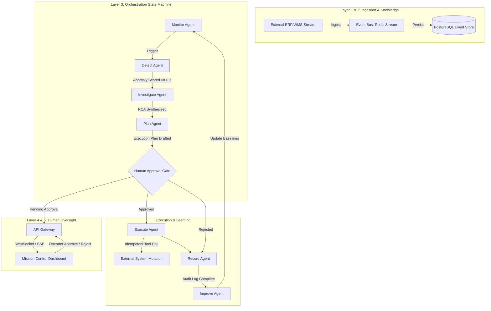
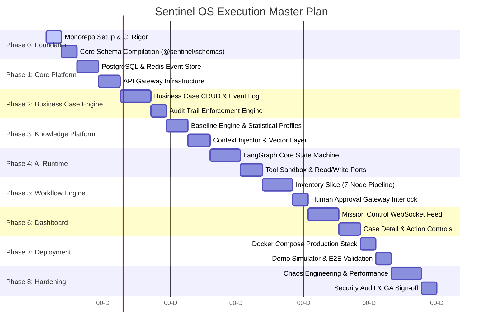
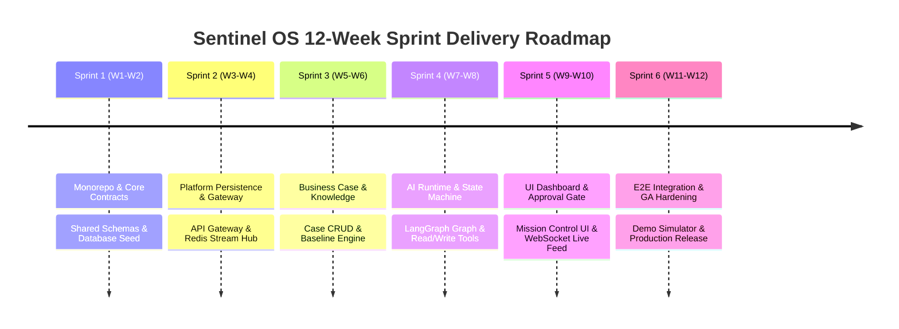
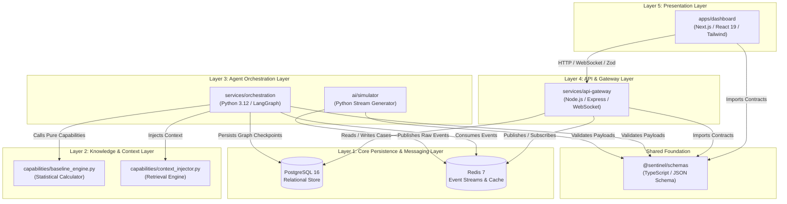
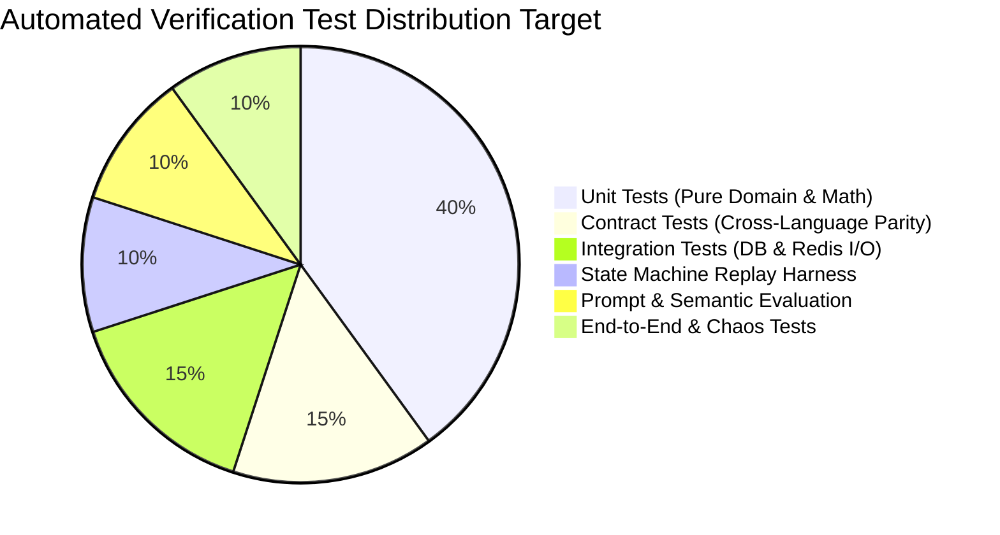
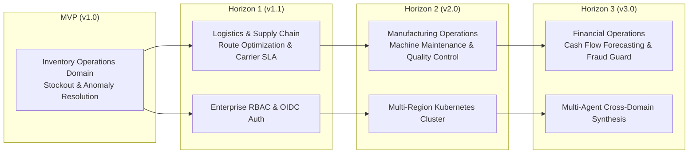
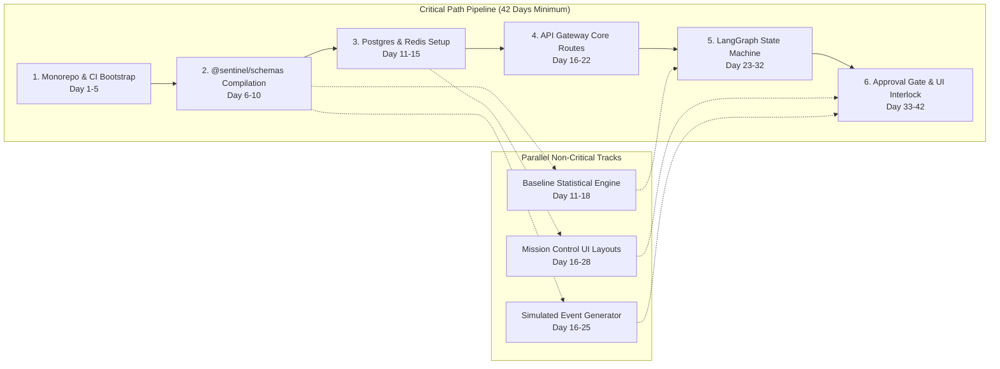
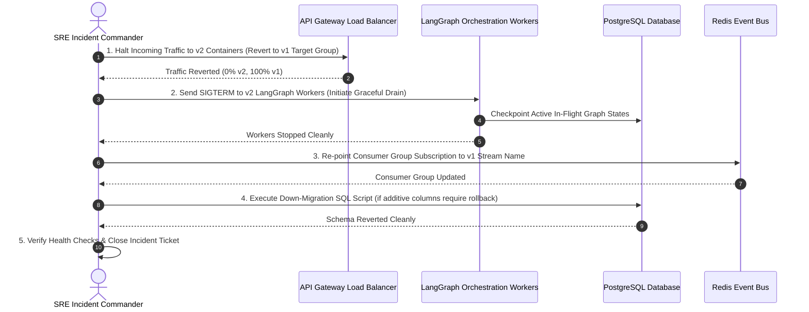

# Sentinel OS — Master Implementation Plan

> **Document Class:** Authoritative Engineering Execution Contract  
> **Audience:** Chief Architect, Principal Staff Engineers, Engineering Managers, SREs, Product Teams  
> **Status:** Authoritative Blueprint — Version 1.0  
> **Last Updated:** 2026-07-03  
> **Governing Architecture:**  
> - `docs/architecture/00_MASTER_CONTEXT.md`  
> - `docs/architecture/03_ARCHITECTURE.md`  
> - `docs/adr/15_ARCHITECTURE_DECISIONS.md` (ADR-001 through ADR-014)

---

## Table of Contents

1. [Executive Summary](#1-executive-summary)
2. [Engineering Principles](#2-engineering-principles)
3. [Repository Bootstrap](#3-repository-bootstrap)
4. [Development Phases](#4-development-phases)
5. [Workstream Breakdown](#5-workstream-breakdown)
6. [Sprint Roadmap](#6-sprint-roadmap)
7. [Component Dependency Graph](#7-component-dependency-graph)
8. [Team Responsibilities](#8-team-responsibilities)
9. [Testing Strategy](#9-testing-strategy)
10. [Quality Gates](#10-quality-gates)
11. [Milestones](#11-milestones)
12. [Risk Register](#12-risk-register)
13. [Definition of Done](#13-definition-of-done)
14. [MVP Scope](#14-mvp-scope)
15. [Post-MVP Evolution](#15-post-mvp-evolution)

---

## 1. Executive Summary

### 1.1 Implementation Philosophy

Building Sentinel OS—an autonomous enterprise AI operating system engineered to execute closed-loop business operations (Monitor $\rightarrow$ Detect $\rightarrow$ Investigate $\rightarrow$ Plan $\rightarrow$ Human Approval $\rightarrow$ Execute $\rightarrow$ Record $\rightarrow$ Improve)—demands rigorous execution discipline. This document serves as the binding, unambiguous contract governing engineering delivery from repository inception (`git init`) through production hardening.

Our implementation philosophy is founded on six uncompromising pillars:

1. **Architecture-First Execution:** No code is written without prior structural validation against established Architectural Decision Records (ADRs). System layers are strictly respected: Presentation (Layer 5), API & Gateway (Layer 4), Agent Orchestration (Layer 3), Knowledge & Context (Layer 2), and Core Persistence & Messaging (Layer 1). Layer-skipping is classified as a severity-1 architectural defect.
2. **Documentation-First Contract:** Interfaces, event payloads, state schemas, and API contracts precede implementation. Every domain event is schema-validated at runtime using shared definitions generated from `@sentinel/schemas` (ADR-012).
3. **Test-Driven Rigor:** Testing is not an afterthought; it is the primary verification mechanism for deterministic workflows wrapping non-deterministic LLM inferences. Unit tests validate pure domain logic, contract tests verify event serialization boundaries, and deterministic replay harnesses ensure state machine consistency.
4. **Incremental Delivery via Vertical Slices:** We reject horizontal "big bang" layering. Following ADR-003 and ADR-014, engineering delivers value through fully functioning vertical slices, starting with **Inventory Operations (Stockout & Anomaly Resolution)**. A vertical slice spans UI components, REST/WebSocket transport, LangGraph orchestration nodes, tool integrations, and database schemas.
5. **MVP Before Optimization:** System correctness, explainability, auditability, and deterministic human-in-the-loop gating take absolute priority over raw throughput optimization or speculative generalization. We optimize only after observable metrics prove system stability.
6. **Zero-Ambiguity Ownership:** Every package, service, module, and infrastructure artifact has an explicit Engineering Code Owner accountable for code quality, test coverage, security compliance, and architectural adherence.

### 1.2 The Closed-Loop Operational Contract

Sentinel OS translates raw business event streams into verified, auditable business actions. The execution plan maps directly to the operational lifecycle defined in architectural specifications:



---

## 2. Engineering Principles

Every engineer contributing to Sentinel OS must adhere to the following core engineering design rules:

### 2.1 Incremental & Evolutionary Architecture
Systems must be designed to absorb change without structural collapse. Domain boundaries are hard-coded into package interfaces, while implementations inside packages remain swappable. Dependencies always point inward toward pure domain logic.

### 2.2 Clean Architecture & Domain-Driven Design (DDD)
We separate core business models (`BusinessCase`, `AnomalyEvent`, `ExecutionPlan`) from infrastructure concerns (SQL drivers, Redis client libraries, LLM SDKs). Domain entities contain zero framework annotations or I/O calls.

### 2.3 Hexagonal Architecture (Ports & Adapters)
All external communications—whether reading inventory balances from WMS simulators, querying vector stores, or invoking Groq/Ollama LLM endpoints—must pass through well-defined interface ports. Adapters implement these ports, ensuring complete testability via deterministic mocks.

### 2.4 Testability as a Design Prerequisite
If a module cannot be executed in isolation inside a deterministic unit test, its design is rejected. Non-deterministic operations (such as LLM generation or timestamp generation) must be injected via deterministic wrapper interfaces (`LLMProvider`, `Clock`).

### 2.5 Observability-First Engineering
Logs, metrics, and distributed traces are first-class execution deliverables. Every asynchronous event boundary, LangGraph node transition, and external tool call must propagate W3C trace context headers (`traceparent`, `tracestate`) and emit structured OpenTelemetry spans.

### 2.6 Security-First & Zero-Trust Architecture
All service-to-service communication requires strict boundary validation. Event payloads ingested from message queues or HTTP endpoints undergo exhaustive schema validation via Zod (Node.js) or Pydantic v2 (Python). SQL queries utilize parameterized statements exclusively. Secrets are injected via environment variables and never logged or serialized.

### 2.7 Infrastructure as Code (IaC) & GitOps
No server, container, database schema, or messaging topology is modified manually. Infrastructure manifests (`infra/docker-compose.yml`, database migration SQL files, seed scripts) are versioned in Git and applied via automated continuous delivery pipelines.

### 2.8 AI-First Engineering Rigor
AI agents are software modules governed by strict computational contracts. Prompt templates are versioned artifacts (`prompts/rca_v1.0.txt`). LLM responses are constrained to structured JSON schemas verified at runtime. Agent retries incorporate exponential backoff with circuit breaker trip thresholds.

---

## 3. Repository Bootstrap

### 3.1 Monorepo Architecture & Workspace Layout
The codebase is structured as a unified monorepo managed via `pnpm` workspaces and `TurboRepo` task orchestration. This guarantees atomic cross-language schema synchronization and unified build dependency management.

```
sentinel-ai/
├── apps/
│   └── dashboard/                  # [Layer 5] React 19 / Vite / Tailwind / Next.js Mission Control UI
├── services/
│   ├── api-gateway/                # [Layer 4] Node.js / TypeScript / Express / WebSocket Gateway
│   └── orchestration/              # [Layer 3] Python 3.12 / LangGraph Agent State Machine
├── packages/
│   └── schemas/                    # Shared TypeScript / JSON Schema definitions (@sentinel/schemas)
├── infra/
│   ├── docker-compose.yml          # Local development stack orchestration
│   ├── seed/                       # SQL schema initialization and baseline inventory seeds
│   └── monitoring/                 # OpenTelemetry collector, Prometheus, Grafana configs
├── ai/
│   └── simulator/                  # Deterministic ERP/WMS stream generator and anomaly injector
├── docs/                           # Authoritative architectural and engineering blueprints
├── scripts/                        # Build, validation, database migration, and test runners
├── package.json                    # Root pnpm configuration
├── pnpm-workspace.yaml             # Workspace package globs
└── turbo.json                      # TurboRepo pipeline caching and task DAG definitions
```

### 3.2 Code Ownership (`CODEOWNERS`)
Explicit ownership ensures review accountability across domain boundaries:

```ini
# Global repository maintainers
*                                   @sentinel-os/principal-engineers

# Architecture and Engineering Standards
/docs/                              @sentinel-os/architecture-board

# Shared Schemas & Contracts
/packages/schemas/                  @sentinel-os/platform-team @sentinel-os/ai-team

# Frontend Application
/apps/dashboard/                    @sentinel-os/frontend-team

# Gateway & API Layer
/services/api-gateway/              @sentinel-os/backend-team

# Agent Orchestration & AI Runtime
/services/orchestration/            @sentinel-os/ai-team
/ai/simulator/                      @sentinel-os/ai-team

# Infrastructure & DevOps
/infra/                             @sentinel-os/sre-team
/scripts/                           @sentinel-os/sre-team
```

### 3.3 Linting, Formatting, & Static Analysis Specification
*   **TypeScript/JavaScript (`apps/dashboard`, `services/api-gateway`, `packages/schemas`):**
    *   **Linter:** ESLint v9 configured with `@typescript-eslint/recommended-type-checked`.
    *   **Formatter:** Prettier v3 with 100-character line width, single quotes, and trailing commas.
    *   **Compiler:** TypeScript 5.5+ set to `strict: true`, `noImplicitAny: true`, `noUncheckedIndexedAccess: true`.
*   **Python (`services/orchestration`, `ai/simulator`):**
    *   **Linter & Formatter:** Ruff v0.5+ replacing Flake8, Black, and isort. Line length enforced at 100 characters.
    *   **Type Checker:** MyPy v1.10+ running in `--strict` mode across all agent nodes and tools.

### 3.4 Continuous Integration Bootstrap Pipeline
The CI pipeline executes deterministically upon every pull request and commit to `main`:

```yaml
name: Sentinel OS CI Pipeline
on: [push, pull_request]

jobs:
  validate-contracts:
    runs-on: ubuntu-latest
    steps:
      - uses: actions/checkout@v4
      - uses: pnpm/action-setup@v3
        with: { version: 9 }
      - uses: actions/setup-node@v4
        with: { node-version: 20, cache: 'pnpm' }
      - run: pnpm install --frozen-lockfile
      - run: pnpm --filter @sentinel/schemas build
      - name: Verify Python JSON Schema Sync
        run: ./scripts/validate-schemas.sh

  lint-and-typecheck:
    needs: validate-contracts
    runs-on: ubuntu-latest
    steps:
      - uses: actions/checkout@v4
      - uses: pnpm/action-setup@v3
        with: { version: 9 }
      - uses: actions/setup-node@v4
        with: { node-version: 20, cache: 'pnpm' }
      - uses: actions/setup-python@v5
        with: { python-version: '3.12' }
      - run: pnpm install --frozen-lockfile
      - run: pnpm turbo run lint typecheck
      - name: Python Ruff & MyPy
        run: |
          pip install ruff mypy pydantic langgraph redis psycopg2-binary
          ruff check services/orchestration ai/simulator
          mypy services/orchestration ai/simulator

  test-suite:
    needs: lint-and-typecheck
    runs-on: ubuntu-latest
    steps:
      - uses: actions/checkout@v4
      - uses: pnpm/action-setup@v3
        with: { version: 9 }
      - uses: actions/setup-node@v4
        with: { node-version: 20, cache: 'pnpm' }
      - uses: actions/setup-python@v5
        with: { python-version: '3.12' }
      - run: pnpm install --frozen-lockfile
      - run: pnpm turbo run test
```

### 3.5 Branch Protection & Merge Gates
*   **Target Branches:** `main` (production-ready code) and `staging` (pre-release validation).
*   **Protection Rules:**
    *   Require pull request reviews before merging: Minimum 2 code owner approvals.
    *   Require status checks to pass: `validate-contracts`, `lint-and-typecheck`, `test-suite`, `snyk-security-scan`.
    *   Require linear history: Enforce `Squash and Merge` or `Rebase and Merge` exclusively.
    *   No direct commits to `main` or `staging` permitted under any circumstances.

---

## 4. Development Phases

Engineering execution progresses sequentially through nine discrete phases. Each phase establishes immutable prerequisites for subsequent workstreams.



---

### Phase 0: Foundation & Core Contracts
*   **Objectives:** Establish the monorepo, configure multi-language CI build pipelines, and build the authoritative `@sentinel/schemas` TypeScript/JSON Schema package.
*   **Why It Exists:** To eliminate serialization mismatches across Python services and TypeScript frontends before application code is authored.
*   **Why It Comes Before Phase 1:** Services cannot persist or stream domain events without immutable data structures.
*   **Dependencies:** Node.js 20+, Python 3.12+, pnpm 9+, Docker Desktop.
*   **Deliverables:**
    *   Compilable `@sentinel/schemas` library exporting `BusinessCase`, `AnomalyEvent`, and `ExecutionPlan` interfaces.
    *   Automated script (`scripts/validate-schemas.sh`) exporting JSON schemas into `packages/schemas/generated/json-schema/`.
    *   Passing GitHub Actions CI pipeline.
*   **Failure Modes:** Inconsistent type definitions across languages leading to runtime deserialization crashes.
*   **Recovery Strategies:** Automated CI blocking on schema drift; strict Pydantic `extra="forbid"` model enforcement.
*   **Tradeoffs:** Upfront investment in schema boilerplate slows initial prototyping but eliminates 90% of cross-service integration defects.
*   **Engineering Rationale:** Adheres to ADR-012 (Single Source of Truth for Data Contracts).

---

### Phase 1: Core Platform & Persistence Layer
*   **Objectives:** Provision automated PostgreSQL database migrations, Redis event streaming topologies, and Node.js API Gateway foundation.
*   **Why It Exists:** To provide rock-solid event persistence, pub/sub infrastructure, and external HTTP/WebSocket entry points.
*   **Why It Comes Before Phase 2:** The Business Case engine requires transactional storage and messaging brokers to maintain state.
*   **Dependencies:** Phase 0 completion (`@sentinel/schemas` published locally).
*   **Deliverables:**
    *   `infra/seed/inventory_seed.sql` initializing relational tables (`cases`, `events`, `audit_logs`, `inventory_items`).
    *   Redis Stream consumer group configuration script for event broadcasting.
    *   `services/api-gateway` Express server validating requests against Zod schemas.
*   **Failure Modes:** Database connection pooling exhaustion; Redis stream consumer lag or unacknowledged pending messages.
*   **Recovery Strategies:** Implement pg-pool connection limits; build dead-letter queue (DLQ) workers for expired Redis XACK messages.
*   **Tradeoffs:** Choosing plain relational SQL tables over specialized event-sourcing engines reduces architectural complexity while preserving ACID compliance.
*   **Engineering Rationale:** Aligns with ADR-001 (Event-Driven Architecture) and ADR-005 (Hybrid Relational + In-Memory State).

---

### Phase 2: Business Case Engine & Audit System
*   **Objectives:** Build the backend state management services for the `BusinessCase` entity and enforce append-only audit trail logging.
*   **Why It Exists:** To implement the authoritative unit of work (ADR-004) that groups anomalies, root causes, plans, approvals, and actions.
*   **Why It Comes Before Phase 3:** AI agents require an active case context ID (`case_id`) to record investigation hypotheses and execution steps.
*   **Dependencies:** Phase 1 database infrastructure and API Gateway routing.
*   **Deliverables:**
    *   Transactional CRUD service for Business Cases with optimistic concurrency control (`version` column checking).
    *   Append-only `audit_logger` module recording immutable state transitions with cryptographic hashing.
    *   REST endpoints: `GET /api/v1/cases`, `GET /api/v1/cases/:id`, `POST /api/v1/cases/:id/events`.
*   **Failure Modes:** Race conditions between simultaneous agent updates and human operator approvals.
*   **Recovery Strategies:** Optimistic locking via SQL `WHERE id = $1 AND version = $2`; explicit transaction rollbacks on `409 Conflict`.
*   **Tradeoffs:** Append-only logging consumes higher database storage volume but provides absolute legal and operational auditability.
*   **Engineering Rationale:** Implements Master Context Section 6.2 (Explainability) and Section 6.3 (Accountability).

---

### Phase 3: Knowledge Platform & Baseline Engine
*   **Objectives:** Construct the statistical sliding-window baseline calculator (`baseline_engine.py`) and context retrieval layer.
*   **Why It Exists:** To compute real-time operational norms (mean, standard deviation, seasonal thresholds) and provide factual context to investigative LLM prompts.
*   **Why It Comes Before Phase 4:** The AI runtime requires accurate baseline deviations ($Z$-scores) to score anomaly severity reliably.
*   **Dependencies:** Phase 2 historical event storage.
*   **Deliverables:**
    *   Python module `baseline_engine.py` calculating 30-day moving averages and dynamic thresholds from PostgreSQL metrics.
    *   Context injector service retrieving historical purchase orders and supplier SLAs.
    *   Deterministic unit tests proving $Z$-score calculation accuracy across edge-case distribution spikes.
*   **Failure Modes:** Cold start anomalies (lack of historical baseline data triggering false-positive storms).
*   **Recovery Strategies:** Fallback static thresholding during initial 72-hour warmup phase; configurable sensitivity multipliers.
*   **Tradeoffs:** In-memory rolling statistics over heavy OLAP data warehousing keeps latency under 50ms for live stream evaluation.
*   **Engineering Rationale:** Fulfills ADR-005 (Stateless Capability Modules) and Master Context Section 4 (Detect Layer).

---

### Phase 4: AI Runtime & Agent Orchestration Infrastructure
*   **Objectives:** Implement the LangGraph execution engine, state management checkpointing, structured LLM adapters, and tool sandboxes inside `services/orchestration`.
*   **Why It Exists:** To provide the runtime container that schedules, executes, and monitors multi-agent graph workflows.
*   **Why It Comes Before Phase 5:** Domain-specific agent workflows cannot run without an underlying graph orchestration runtime.
*   **Dependencies:** Phase 3 baseline capabilities and Python 3.12 environment.
*   **Deliverables:**
    *   `graph/state.py` defining `GraphState` TypedDict with explicit error accumulation and status tracking fields.
    *   `graph/checkpointer.py` integrating `AsyncPostgresSaver` for fault-tolerant workflow checkpointing.
    *   LLM client wrapper supporting Groq (`llama-3.3-70b-versatile`) and local Ollama (`llama3`) with strict JSON schema response parsing.
*   **Failure Modes:** LLM hallucination generating invalid JSON structure or violating tool schema boundaries.
*   **Recovery Strategies:** Three-attempt retry loop with Pydantic validation error injection directly into the repair prompt.
*   **Tradeoffs:** Standardizing on LangGraph (ADR-006) couples orchestration to Python but provides superior cyclic graph control over acyclic DAG pipelines.
*   **Engineering Rationale:** Guarantees deterministic state progression across non-deterministic AI inference steps.

---

### Phase 5: Workflow Engine & Inventory Vertical Slice
*   **Objectives:** Implement all seven specialized agent nodes (`monitor.py`, `detect.py`, `investigate.py`, `plan.py`, `execute.py`, `record.py`, `improve.py`) and the human approval gateway interlock.
*   **Why It Exists:** To deliver the core functional value proposition: autonomous anomaly detection, root cause analysis, execution planning, and action dispatching.
*   **Why It Comes Before Phase 6:** The frontend Mission Control dashboard requires live state machine executions to visualize.
*   **Dependencies:** Phase 4 AI runtime and tool sandbox.
*   **Deliverables:**
    *   Complete LangGraph state machine (`graph/workflow.py`) wiring conditional edge routing (`should_investigate`, `check_approval`).
    *   Inventory read/write tools (`inventory_query.py`, `business_system_write.py`) with strict idempotency key tracking.
    *   Human approval interlock halting graph execution until explicit API Gateway acknowledgment.
*   **Failure Modes:** Infinite agent investigation loops; unauthorized tool execution before approval grant.
*   **Recovery Strategies:** Hard graph recursion limit (`recursion_limit=25`); immutable state check in `execute.py` verifying `case.status == "APPROVED"`.
*   **Tradeoffs:** Bounding the MVP exclusively to Inventory Operations (ADR-003) delays multi-domain features but ensures deep operational completeness.
*   **Engineering Rationale:** Direct realization of Master Context Section 4 (Operational Closed Loop) and ADR-008 (Non-Bypassable Human Gateway).

---

### Phase 6: Mission Control Dashboard UI
*   **Objectives:** Develop the real-time React 19 / Next.js frontend interface (`apps/dashboard`) displaying case feeds, RCA reasoning chains, execution progress, and human approval controls.
*   **Why It Exists:** To provide human operators with the supervision surface necessary to exercise judgment and authorize execution plans.
*   **Why It Comes Before Phase 7:** End-to-end user workflows cannot be demonstrated or validated without the operator console.
*   **Dependencies:** Phase 5 workflow engine emitting live events via WebSocket/SSE.
*   **Deliverables:**
    *   `CaseFeed` component rendering sub-second live anomaly alerts via WebSocket subscriptions.
    *   `CaseDetail` component rendering markdown RCA summaries, structured action tables, and Approve/Reject buttons.
    *   Sub-2-second latency update loop from backend state change to visual DOM rendering.
*   **Failure Modes:** WebSocket connection drops causing stale UI state during critical approval windows.
*   **Recovery Strategies:** Automatic WebSocket reconnection with exponential backoff; REST API polling fallback and visual stale-state warning indicators.
*   **Tradeoffs:** Using vanilla CSS and Tailwind utility classes over heavy component libraries ensures maximum visual customization and rendering speed.
*   **Engineering Rationale:** Implements ADR-010 (Mission Control Dashboard) and meets Goal G-09 (Sub-2-second state surfacing).

---

### Phase 7: Deployment Engineering & Simulation Harness
*   **Objectives:** Containerize all services into production-ready Docker images, orchestrate local full-stack startup (`docker-compose.yml`), and construct the live inventory stream simulator (`ai/simulator`).
*   **Why It Exists:** To prove deterministic turnkey system deployment and provide continuous simulated business anomalies for testing.
*   **Why It Comes Before Phase 8:** System load testing and security audits require a running, self-contained multi-container environment.
*   **Deliverables:**
    *   Multi-stage Dockerfiles for Node.js (`api-gateway`, `dashboard`) and Python (`orchestration`, `simulator`) ensuring minimal attack surface.
    *   `ai/simulator/event_generator.py` streaming realistic SKU inventory levels, purchase order delays, and demand spikes.
    *   `scripts/demo-run.sh` executing a 10-minute automated end-to-end demonstration scenario from stockout detection to action execution.
*   **Failure Modes:** Container startup race conditions where orchestration attempts to query uninitialized PostgreSQL schemas.
*   **Recovery Strategies:** Strict health-check dependency gates (`condition: service_healthy`) in Docker Compose; startup retry loops.
*   **Tradeoffs:** Local Docker Compose simulation simplifies hackathon MVP verification while mirroring enterprise Kubernetes deployment topologies.
*   **Engineering Rationale:** Adheres to Architecture Section 21 (Deployment Architecture) and Section 22 (Folder Mapping).

---

### Phase 8: Production Hardening, Quality & GA Sign-Off
*   **Objectives:** Execute chaos engineering injection, load performance benchmarking, comprehensive security penetration scanning, and Definition of Done verification.
*   **Why It Exists:** To ensure enterprise-grade stability, zero data leakage, and compliance with performance SLAs before general availability release.
*   **Dependencies:** Phase 7 fully deployed full-stack environment.
*   **Deliverables:**
    *   Load testing suite proving system stability under 500 concurrent event streams per second.
    *   Security sign-off report confirming zero SQL injection vulnerabilities, zero unauthenticated endpoints, and zero secret exposures.
    *   Complete end-to-end test suite execution passing 100% of defined quality gates.
*   **Failure Modes:** Memory leaks in long-running Python LangGraph workers; database connection pool starvation under extreme concurrency.
*   **Recovery Strategies:** Worker process recycling after 1,000 completed graph executions; read-replica load distribution.
*   **Tradeoffs:** Exhaustive security and load validation extends release lead time but eliminates enterprise deployment blockers.
*   **Engineering Rationale:** Enforces Section 10 (Quality Gates) and Section 13 (Definition of Done).

---

## 5. Workstream Breakdown

To execute parallel delivery across discrete domain disciplines, implementation tasks are divided into ten specialized engineering workstreams. Each workstream maintains clear boundaries while integrating continuously via `@sentinel/schemas`.

### 5.1 Infrastructure Workstream
*   **Accountability:** Provisioning, configuration, and orchestration of data stores, caching tiers, message brokers, and container runtimes.
*   **Key Deliverables:**
    *   `infra/docker-compose.yml` (Local multi-service topology) and `infra/docker-compose.dev.yml` (Hot-reload volume mounts).
    *   PostgreSQL 16 initialization schema (`infra/seed/inventory_seed.sql`) featuring indexed relational tables and JSONB extension columns for flexible event payloads.
    *   Redis 7 Alpine configuration supporting persistent append-only files (AOF) and consumer groups (`sentinel-stream-group`).
*   **Integration Points:** Supplies environment variables (`DATABASE_URL`, `REDIS_URL`) and network bridges to Backend and AI runtimes.

### 5.2 Backend Workstream
*   **Accountability:** API Gateway implementation, WebSocket messaging hubs, HTTP routing, request validation, and Business Case state persistence.
*   **Key Deliverables:**
    *   `services/api-gateway/src/routes/`: Express endpoints for cases, approvals, rejections, and system health.
    *   `services/api-gateway/src/ws/`: Real-time WebSocket server broadcasting state updates and SSE fallbacks.
    *   Optimistic concurrency wrapper over PostgreSQL ensuring zero lost updates during simultaneous agent/human interactions.
*   **Integration Points:** Consumes `@sentinel/schemas` for Zod validation; bridges frontend web applications to Redis event channels.

### 5.3 Frontend Workstream
*   **Accountability:** Development of the React 19 / Next.js Mission Control dashboard (`apps/dashboard`).
*   **Key Deliverables:**
    *   `CaseFeed`: Sub-second event feed filtering active inventory anomalies and severity badges.
    *   `CaseDetail`: Interactive reasoning view rendering markdown RCA summaries, structured action items, and human approval triggers.
    *   `ExecutionStatus`: Real-time progress tracker showing LangGraph node execution steps.
    *   `AuditLog`: Immutable chronological log of all case interactions.
*   **Integration Points:** Connects to `api-gateway` HTTP endpoints and WebSocket streams.

### 5.4 AI Workstream
*   **Accountability:** LangGraph state machine development, agent prompt engineering, LLM API adapters, and tool execution sandboxes.
*   **Key Deliverables:**
    *   `services/orchestration/graph/workflow.py`: Cyclic LangGraph state machine with checkpointing (`AsyncPostgresSaver`).
    *   Seven specialized agent nodes (`monitor.py` through `improve.py`).
    *   Deterministic tool adapters (`inventory_query.py`, `business_system_write.py`) incorporating strict idempotency checks.
    *   `ai/simulator/`: Realistic inventory stream generator simulating stockouts, PO delays, and demand spikes.
*   **Integration Points:** Reads from and writes to Redis streams; executes queries against PostgreSQL; queries external LLM inference providers (Groq/Ollama).

### 5.5 Knowledge Workstream
*   **Accountability:** Real-time baseline statistical modeling and factual context injection.
*   **Key Deliverables:**
    *   `services/orchestration/capabilities/baseline_engine.py`: Sliding-window statistical calculation ($Z$-score, moving average).
    *   Context retrieval pipeline fetching historical supplier reliability scores and purchase order lead times.
*   **Integration Points:** Provides structured context dictionary to `investigate.py` and `plan.py` nodes.

### 5.6 Security Workstream
*   **Accountability:** Zero-trust network boundary enforcement, input sanitization, and audit integrity assurance.
*   **Key Deliverables:**
    *   Exhaustive Pydantic v2 and Zod runtime schema validation barriers across all API and messaging interfaces.
    *   Cryptographic hash chaining in `audit_logger.py` guaranteeing tamper-evident event histories.
    *   Automated Snyk and OWASP dependency vulnerability scanning pipelines.
*   **Integration Points:** Embeds security middleware into API Gateway routes and LangGraph tool wrappers.

### 5.7 Observability Workstream
*   **Accountability:** End-to-end telemetry instrumentation, structured JSON logging, distributed tracing, and operational dashboards.
*   **Key Deliverables:**
    *   OpenTelemetry SDK initialization in both Python and Node.js services propagating W3C `traceparent` headers across Redis stream boundaries.
    *   `infra/monitoring/`: Prometheus metric collection and pre-configured Grafana dashboards displaying agent latency, LLM token consumption, and anomaly detection precision.
*   **Integration Points:** Hooks into LangGraph event callbacks, Express middleware, and Redis message handlers.

### 5.8 DevOps Workstream
*   **Accountability:** Continuous integration automation, build optimization, container registry publishing, and deployment scripts.
*   **Key Deliverables:**
    *   GitHub Actions CI workflows enforcing strict formatting, linting, type-checking, schema compilation, and automated test execution.
    *   Multi-stage Dockerfiles optimizing container build sizes and non-root execution permissions.
    *   `scripts/demo-run.sh`: Automated turnkey verification script running a complete anomaly-to-execution demonstration.
*   **Integration Points:** Orchestrates repo-wide build tools (`TurboRepo`, `pnpm`, `Ruff`).

### 5.9 Testing Workstream
*   **Accountability:** Verification automation across unit, integration, contract, state machine replay, and end-to-end tiers.
*   **Key Deliverables:**
    *   Deterministic unit test suites for pure statistical calculation modules (`baseline_engine`, `anomaly_scorer`).
    *   Contract tests verifying TypeScript/Python serialization parity.
    *   LangGraph deterministic replay harness using recorded mock LLM responses.
*   **Integration Points:** Executes inside CI pipeline against all code contributions.

### 5.10 Documentation Workstream
*   **Accountability:** Architectural consistency maintenance, developer onboarding guides, and Definition of Done verification.
*   **Key Deliverables:**
    *   Authoritative maintenance of `docs/architecture/` and `docs/engineering/`.
    *   Codebase inline documentation standards and API OpenAPI/Swagger schema generation.
*   **Integration Points:** Governs pull request reviews against Architectural Decision Records (ADRs).

---

## 6. Sprint Roadmap

Engineering execution is organized into six highly disciplined, two-week iterations (12 weeks total). Every sprint must satisfy strict acceptance and exit criteria before progressing.



### 6.1 Sprint 1: Monorepo Foundation & Core Contracts (Weeks 1–2)
*   **Objectives:** Establish repository architecture, enforce strict static analysis gates, and publish `@sentinel/schemas`.
*   **Deliverables:**
    *   Initialized `pnpm` monorepo with `TurboRepo` build caching.
    *   `packages/schemas` containing `BusinessCase`, `AnomalyEvent`, `ExecutionPlan`, and `CaseStatus` definitions.
    *   Automated JSON Schema generator script (`scripts/validate-schemas.sh`).
    *   GitHub Actions CI pipeline passing 100% of linting and type checks.
*   **Dependencies:** None.
*   **Risks:** Type mismatch between TypeScript interfaces and Pydantic runtime validation models.
*   **Acceptance Criteria:**
    *   `pnpm build` succeeds cleanly across all workspaces.
    *   Python scripts successfully ingest generated JSON schemas without schema validation errors.
*   **Exit Criteria:** Code Review sign-off from Platform and AI team leads; zero CI pipeline failures.

### 6.2 Sprint 2: Core Platform Persistence & API Gateway (Weeks 3–4)
*   **Objectives:** Stand up Dockerized PostgreSQL and Redis infrastructure and deploy the Node.js API Gateway.
*   **Deliverables:**
    *   `infra/docker-compose.yml` hosting PostgreSQL 16 and Redis 7.
    *   `infra/seed/inventory_seed.sql` generating baseline database tables.
    *   `services/api-gateway` Express server implementing health checks and Zod request validation.
    *   Redis Stream publishing and subscribing helper modules.
*   **Dependencies:** Sprint 1 schema package.
*   **Risks:** Connection pool exhaustion or improper Redis stream acknowledgment handling.
*   **Acceptance Criteria:**
    *   API Gateway successfully connects to PostgreSQL and Redis on startup.
    *   PostgreSQL schema passes relational constraint verification.
    *   Redis stream handles 1,000 published messages per second with zero data loss.
*   **Exit Criteria:** Integration test suite confirms database persistence and message pub/sub reliability.

### 6.3 Sprint 3: Business Case Engine & Knowledge Baseline (Weeks 5–6)
*   **Objectives:** Implement transactional Business Case state transitions, audit logging, and statistical baseline calculators.
*   **Deliverables:**
    *   REST endpoints in `api-gateway`: `POST /api/v1/cases`, `GET /api/v1/cases/:id`, `POST /api/v1/cases/:id/events`.
    *   Optimistic concurrency locking implementation via version checking.
    *   Append-only `audit_logger` recording cryptographic hash chains.
    *   `baseline_engine.py` sliding-window moving average calculator.
*   **Dependencies:** Sprint 2 infrastructure and API Gateway.
*   **Risks:** Concurrency deadlocks during high-frequency status updates.
*   **Acceptance Criteria:**
    *   Concurrent updates to the same Business Case yield exactly one success and one clean `409 Conflict` rollback.
    *   `baseline_engine.py` computes accurate $Z$-scores against 10,000 mock inventory records in < 50ms.
*   **Exit Criteria:** 100% unit test coverage on statistical calculations; clean audit log verification tests.

### 6.4 Sprint 4: AI Runtime & LangGraph State Machine (Weeks 7–8)
*   **Objectives:** Build the LangGraph state machine inside `services/orchestration`, wire LLM adapters, and construct sandboxed inventory tools.
*   **Deliverables:**
    *   `services/orchestration/graph/workflow.py` implementing the 7-node cyclic graph.
    *   `AsyncPostgresSaver` checkpointing enabling resilient state recovery across node executions.
    *   Structured LLM client wrapper supporting Groq and local Ollama inference.
    *   Read/write tools (`inventory_query.py`, `business_system_write.py`) with strict idempotency keys.
*   **Dependencies:** Sprint 3 database state engine and baseline engine.
*   **Risks:** LLM response latency spikes or invalid JSON output formatting.
*   **Acceptance Criteria:**
    *   State machine correctly routes execution from `monitor` $\rightarrow$ `detect` $\rightarrow$ `investigate` $\rightarrow$ `plan` $\rightarrow$ approval gateway.
    *   Tool execution with duplicate idempotency keys produces zero duplicate database mutations.
*   **Exit Criteria:** Replay harness proves deterministic graph state progression across 50 recorded anomaly scenarios.

### 6.5 Sprint 5: Mission Control UI & Approval Gateway Interlock (Weeks 9–10)
*   **Objectives:** Deliver the real-time frontend dashboard (`apps/dashboard`) and enforce the human approval interlock.
*   **Deliverables:**
    *   React 19 / Next.js UI views: `CaseFeed`, `CaseDetail`, `ExecutionStatus`, and `AuditLog`.
    *   WebSocket live event broadcaster inside `api-gateway` streaming graph state changes to connected browsers.
    *   Human approval interlock inside `services/orchestration` blocking execution until explicit `POST /api/v1/cases/:id/approve` invocation.
*   **Dependencies:** Sprint 4 LangGraph runtime.
*   **Risks:** WebSocket disconnection leading to out-of-sync UI state during operator review.
*   **Acceptance Criteria:**
    *   UI updates automatically within 2 seconds of a backend state change without manual browser refresh.
    *   Agent state machine pauses indefinitely at the approval gateway and resumes within 1 second of approval receipt.
*   **Exit Criteria:** End-to-end human-in-the-loop verification sign-off by Product and UX leads.

### 6.6 Sprint 6: E2E Simulation, Performance & GA Hardening (Weeks 11–12)
*   **Objectives:** Deploy the inventory stream simulator (`ai/simulator`), execute chaos engineering tests, and finalize release readiness.
*   **Deliverables:**
    *   `ai/simulator/event_generator.py` generating continuous inventory anomalies.
    *   `scripts/demo-run.sh` turnkey automated demonstration harness.
    *   Performance optimization achieving < 15-minute end-to-end anomaly-to-execution cycle time.
    *   Comprehensive Definition of Done checklist verification across all codebases.
*   **Dependencies:** Sprint 5 UI and approval interlock.
*   **Risks:** Memory leaks in long-running orchestration worker processes under continuous streaming load.
*   **Acceptance Criteria:**
    *   System runs continuously for 24 hours under simulated high load without memory exhaustion or container crash.
    *   `scripts/demo-run.sh` executes reliably from clean Docker environment in < 10 minutes.
*   **Exit Criteria:** Formal Chief Architect and SRE GA Sign-off; zero open severity-1 or severity-2 defects.

---

## 7. Component Dependency Graph

The structural dependency hierarchy enforces strict boundaries: Layer 5 depends on Layer 4; Layer 4 depends on Layer 3 and Layer 1; Layer 3 depends on Layer 2 and Layer 1. Shared schemas (`packages/schemas`) act as the universal contract foundation across all layers.



---

## 8. Team Responsibilities

To maintain high engineering velocity without architectural decay, organizational responsibilities map directly to architectural boundaries. Execution accountability is governed by the following Responsibility Assignment Matrix (RACI: Responsible, Accountable, Consulted, Informed).

### 8.1 RACI Matrix across Domain Workstreams

| Architecture & System Deliverable | Platform Team | AI Team | Frontend Team | Backend Team | Knowledge Team | Security Team | SRE Team |
| :--- | :---: | :---: | :---: | :---: | :---: | :---: | :---: |
| **Monorepo Structure & TurboRepo CI Pipeline** | **A** / R | C | C | C | I | I | R |
| **`@sentinel/schemas` Core Data Contracts** | **A** / R | R | R | R | C | C | I |
| **PostgreSQL & Redis Infrastructure Provisioning** | C | I | I | R | I | C | **A** / R |
| **API Gateway HTTP/WebSocket Server** | C | I | C | **A** / R | I | R | C |
| **Business Case CRUD & Concurrency Engine** | C | I | I | **A** / R | I | C | I |
| **LangGraph Agent State Machine (`workflow.py`)** | C | **A** / R | I | C | C | C | I |
| **Prompt Engineering & Versioning (`prompts/`)** | I | **A** / R | I | I | R | C | I |
| **Statistical Baseline Engine (`baseline_engine.py`)** | I | C | I | I | **A** / R | I | I |
| **React 19 Mission Control Dashboard UI** | I | I | **A** / R | C | I | I | I |
| **Human Approval Interlock Enforcement** | C | R | R | **A** / R | I | R | I |
| **Zero-Trust Input & Event Schema Sanitization** | C | R | R | R | C | **A** / R | I |
| **OpenTelemetry Tracing & Grafana Monitoring** | R | R | R | R | R | I | **A** / R |
| **Containerization & Turnkey Simulation Harness** | C | R | I | C | I | I | **A** / R |

### 8.2 Team Mandates
*   **Platform Team:** Accountable for build tooling, developer productivity, workspace configuration, core repository health, and cross-language contract synchronization.
*   **AI Team:** Accountable for LangGraph graph architecture, prompt determinism, LLM inference wrappers, agent tool sandboxes, and simulated anomaly generation.
*   **Frontend Team:** Accountable for UI component design, WebSocket live streaming performance, visual accessibility, and operator workflow ergonomics.
*   **Backend Team:** Accountable for API Gateway routing, transactional Business Case persistence, Redis event pub/sub reliability, and optimistic concurrency locking.
*   **Knowledge Team:** Accountable for sliding-window statistical calculation algorithms, context retrieval pipelines, and domain knowledge injection.
*   **Security Team:** Accountable for authentication/authorization boundaries, tamper-evident audit logging verification, dependency vulnerability remediation, and penetration testing.
*   **SRE Team:** Accountable for Docker/Kubernetes container orchestration, continuous deployment pipelines, OpenTelemetry collector infrastructure, chaos engineering, and SLAs.

---

## 9. Testing Strategy

Sentinel OS mandates a 12-tier verification hierarchy. Because AI inference introduces non-determinism, our testing strategy strictly separates deterministic framework/domain verification from non-deterministic semantic evaluation.



### 9.1 Unit Testing (Pure Domain Logic)
*   **Target Scope:** Stateless domain capabilities (`baseline_engine.py`, `anomaly_scorer.py`, TypeScript Zod validators).
*   **Tooling:** `pytest` (Python), `Vitest` (TypeScript).
*   **Mandate:** Zero network calls, zero database connections, zero filesystem reads. Execution time < 1ms per test. 100% branch coverage required.

### 9.2 Contract Testing (Cross-Language Boundary Parity)
*   **Target Scope:** Verification that `@sentinel/schemas` generated JSON schemas strictly match Python Pydantic models and TypeScript runtime objects.
*   **Tooling:** Custom automated schema comparator script (`scripts/validate-schemas.sh`).
*   **Mandate:** Executed on every pull request. Failure blocks pipeline immediately.

### 9.3 Integration Testing (State & Messaging I/O)
*   **Target Scope:** API Gateway CRUD operations, PostgreSQL relational transactions, Redis Stream pub/sub consumer groups.
*   **Tooling:** `Testcontainers` spinning up isolated PostgreSQL 16 and Redis 7 ephemeral containers.
*   **Mandate:** Verifies database foreign key cascades, optimistic locking rollbacks on concurrent writes, and Redis stream acknowledgment (`XACK`) behavior.

### 9.4 Replay & State Machine Testing
*   **Target Scope:** LangGraph graph execution transitions (`workflow.py`).
*   **Tooling:** Custom deterministic replay harness injecting recorded LLM inference payloads (`MockLLMClient`).
*   **Mandate:** Proves that given a fixed sequence of input events and mock LLM responses, graph execution transitions deterministically through exact node paths without infinite loops.

### 9.5 Prompt & Semantic Evaluation Testing
*   **Target Scope:** Prompt version changes (`prompts/rca_v1.0.txt`, `prompts/plan_v1.0.txt`).
*   **Tooling:** LLM-as-a-Judge semantic evaluation harness running against 50 canonical historical anomaly scenarios.
*   **Mandate:** Evaluates root cause hypothesis accuracy, execution plan completeness, and strict JSON schema adherence across temperature variations.

### 9.6 Security & Chaos Engineering Testing
*   **Target Scope:** Zero-trust boundaries, malformed event ingestion, database connection failure recovery, Redis memory exhaustion.
*   **Tooling:** `Snyk`, `Toxiproxy`, custom network latency/packet loss injection scripts.
*   **Mandate:** Proves system fails securely (closed) under simulated Redis connection drops, PostgreSQL transaction timeouts, and malformed JSON payload injections.

### 9.7 Performance & Load Testing
*   **Target Scope:** API Gateway throughput, LangGraph concurrent worker scaling, WebSocket message broadcasting.
*   **Tooling:** `k6` load generator.
*   **Mandate:** Sustains 500 incoming events/second with API Gateway P95 latency < 45ms and zero unhandled exceptions.

### 9.8 End-to-End (E2E) Verification
*   **Target Scope:** Full user journey from simulated WMS inventory event through UI approval to external tool execution.
*   **Tooling:** `Playwright` automating browser interactions against `apps/dashboard` backed by live local container stack.
*   **Mandate:** Verifies sub-2-second visual DOM update latency and end-to-end operational execution integrity.

---

## 10. Quality Gates

No contribution merges into target branches without satisfying all automated quality gates. Quality enforcement is non-negotiable and executed deterministically via CI pipelines.

### 10.1 Pull Request Quality Gates (Pre-Merge)
1.  **Contract Compliance Gate:** `@sentinel/schemas` builds cleanly; Python JSON Schema validator exits with code 0.
2.  **Static Analysis & Lint Gate:** ESLint, Prettier, Ruff, and MyPy (`--strict`) report zero errors or warnings.
3.  **Unit & Integration Coverage Gate:** Minimum 85% overall code coverage; 100% coverage required on statistical calculations and financial/inventory mutation adapters.
4.  **Architectural Decision Verification Gate:** Static AST linters verify zero layer-skipping imports (e.g., UI directly importing database drivers or Python orchestration bypassing Redis event bus).
5.  **Security Vulnerability Gate:** Snyk and npm audit scan report zero critical or high vulnerabilities.

### 10.2 Release Readiness Quality Gates (Pre-Release)
1.  **State Machine Replay Certification:** 100% pass rate across 50 canonical anomaly replay scenarios.
2.  **Prompt Regression Gate:** Semantic evaluation score must equal or exceed previous release baseline score across all benchmark tasks.
3.  **Load & Endurance Certification:** 24-hour continuous burn-in test running `ai/simulator` under heavy load yields zero memory leaks, zero zombie container processes, and zero database deadlocks.

### 10.3 Deployment & Runtime Quality Gates (Pre-Production)
1.  **Container Vulnerability Scan:** Trivy container image scans report zero unpatched critical CVEs.
2.  **Database Migration Safety Check:** Automated transaction rollback test verifies zero destructive schema changes on live tables.
3.  **Turnkey Demo Verification:** `scripts/demo-run.sh` executes end-to-end within 10 minutes with zero manual intervention.

---

## 11. Milestones

Engineering progress is tracked against six formal milestones. Each milestone represents a discrete, verifiable advancement in autonomous operational capability.

```mermaid
gantt
    title Sentinel OS Strategic Milestones
    dateFormat  YYYY-MM-DD
    axisFormat  %M-%D
    section Milestones
    M1: Internal Alpha (Foundations)      :milestone, m1, 2026-07-20, 0d
    M2: Internal Beta (Backend Pipeline)  :milestone, m2, 2026-08-03, 0d
    M3: Hackathon MVP (Inventory Slice)   :milestone, m3, 2026-08-17, 0d
    M4: Pilot Readiness (Dashboard UI)    :milestone, m4, 2026-08-31, 0d
    M5: Enterprise Beta (Hardened E2E)    :milestone, m5, 2026-09-14, 0d
    M6: General Availability (GA)         :milestone, m6, 2026-09-28, 0d
```

### Milestone 1: Internal Alpha (Foundations & Core Contracts)
*   **Target Timeline:** End of Week 2.
*   **Scope:** Monorepo architecture operational; shared TypeScript/Pydantic schemas compiled; CI build pipelines active.
*   **Verification Gate:** Clean `pnpm build` and automated cross-language contract validation passing.

### Milestone 2: Internal Beta (Platform & Persistence Pipeline)
*   **Target Timeline:** End of Week 4.
*   **Scope:** PostgreSQL and Redis containers operational; API Gateway CRUD routes active; baseline statistical engine computing rolling norms.
*   **Verification Gate:** Integration test suite proving reliable database persistence and 1,000 msg/sec Redis pub/sub throughput.

### Milestone 3: Hackathon MVP (Inventory Operations Vertical Slice)
*   **Target Timeline:** End of Week 6.
*   **Scope:** Complete 7-node LangGraph state machine operational; deterministic inventory read/write tools functioning; simulated stockout anomaly stream resolving autonomously through backend pipeline.
*   **Verification Gate:** Deterministic replay suite passing 100% of historical anomaly scenarios.

### Milestone 4: Pilot Readiness (Mission Control Dashboard Integration)
*   **Target Timeline:** End of Week 8.
*   **Scope:** React 19 UI dashboard connected via WebSocket live feed; human approval interlock fully integrated between frontend controls and backend LangGraph runtime.
*   **Verification Gate:** Sub-2-second UI refresh latency verified under live simulated anomaly injection.

### Milestone 5: Enterprise Beta (Hardened E2E Simulation Harness)
*   **Target Timeline:** End of Week 10.
*   **Scope:** Turnkey Docker Compose full-stack deployment active; continuous automated simulator running; chaos engineering and load testing suites executed.
*   **Verification Gate:** 24-hour continuous burn-in test passed with zero container restarts or memory leaks.

### Milestone 6: General Availability (Production Hardening & Sign-Off)
*   **Target Timeline:** End of Week 12.
*   **Scope:** Zero open high-severity security or operational defects; complete Definition of Done compliance across all ten workstreams; documentation finalized.
*   **Verification Gate:** Formal sign-off from Chief Architect, Principal Staff Engineers, and SRE Leads.

---

## 12. Risk Register

Managing enterprise autonomous AI deployment requires anticipating failure modes across system dimensions. Every risk includes explicit probability, impact assessment, proactive mitigation engineering, and reactive contingency plans.

### 12.1 Comprehensive Risk Assessment Matrix

| ID | Risk Category & Description | Prob. | Impact | Engineering Mitigation Strategy | Operational Contingency Plan |
| :--- | :--- | :---: | :---: | :--- | :--- |
| **R-01** | **AI Hallucination / Schema Violation:** LLM generates malformed JSON output or invents invalid inventory tool arguments during investigation/planning. | Medium | High | Enforce strict structured JSON schema output parsing via Pydantic v2; implement automated 3-attempt self-healing retry loop injecting validation error traces into repair prompt. | Fallback to rule-based static template generation; flag Business Case for manual operator intervention with `STATUS: SYNTAX_RECOVERY`. |
| **R-02** | **Infinite Graph Execution Loops:** Cyclic LangGraph state machine enters an unbounded investigation loop oscillating between anomaly detection and root cause hypothesis generation. | Low | High | Set hard execution bound `recursion_limit=25` in LangGraph runner configuration; increment step counters inside state checkpoint. | Circuit breaker trips graph execution; forces case transition to `STATUS: ESCALATED` and emits critical PagerDuty alert. |
| **R-03** | **Database Concurrency Race Conditions:** Simultaneous agent status updates and human operator approvals cause lost writes or corrupted audit trails. | Medium | High | Implement optimistic locking via explicit database `version` integer column checking; execute append-only audit trail logging inside atomic SQL transactions. | Automatic API Gateway transaction rollback returning HTTP `409 Conflict`; frontend triggers immediate state re-fetch. |
| **R-04** | **WebSocket Connection Instability:** Live operations feed disconnects during high-frequency stream updates, presenting stale case data during critical human approval windows. | High | Medium | Implement automatic exponential backoff reconnects in React query hooks; display visual "Connection Stale" banner when heartbeat fails. | Fallback to REST API polling (`GET /api/v1/cases?status=PENDING_APPROVAL`) every 3 seconds until WebSocket channel recovers. |
| **R-05** | **Redis Consumer Lag & Queue Starvation:** High event volume from WMS stream generator overwhelms Redis stream consumer groups, delaying anomaly detection SLAs beyond 5 minutes. | Medium | Medium | Configure multi-worker Redis consumer groups (`XREADGROUP`); optimize event payload sizing by stripping redundant historical logs. | Auto-scale LangGraph worker containers; divert non-critical telemetry streams to secondary background queues. |
| **R-06** | **Cold Start Statistical Noise:** Lack of historical inventory baseline data during initial deployment causes widespread false-positive anomaly detection alerts. | High | Medium | Implement mandatory 72-hour static fallback threshold window (`baseline_engine.py`) before switching to dynamic $Z$-score scoring. | Operator toggle switch in Mission Control allowing temporary override of sensitivity multipliers (`Z_THRESHOLD = 3.5`). |
| **R-07** | **Unauthorized Tool Mutation:** Execute agent attempts to invoke WMS write tool prior to receiving valid human operator approval signature. | Low | Critical | Hardcode immutable precondition check inside `action_executor.py` verifying state equals `CaseStatus.APPROVED` and validating cryptographically signed approval token. | Immediate tool execution rejection; security audit alert fired; agent process terminated and isolated for forensics. |

---

## 13. Definition of Done

To eliminate subjective quality assessments, completion is governed by strict Definition of Done (DoD) checklists across four structural tiers.

### 13.1 Package Level Definition of Done (`packages/*`)
*   [x] Package compiles cleanly with zero errors using strict TypeScript / MyPy rules.
*   [x] All exported interfaces and types include comprehensive JSDoc / docstring annotations.
*   [x] Automated JSON Schema generation script confirms 100% synchronization across languages.
*   [x] 100% unit test coverage for data serialization and validation logic.
*   [x] Package published locally via workspace lockfile and verified by consuming services.

### 13.2 Service Level Definition of Done (`services/*`, `apps/*`)
*   [x] All API endpoints and event listeners adhere strictly to OpenAPI / AsyncAPI specifications.
*   [x] Zero static analysis errors reported by ESLint, Prettier, Ruff, and MyPy (`--strict`).
*   [x] Minimum 85% branch test coverage achieved across unit and integration suites.
*   [x] OpenTelemetry tracing spans emit required W3C trace context headers across all I/O boundaries.
*   [x] Service containerizes successfully via multi-stage Dockerfile running under non-root user permissions.
*   [x] Graceful shutdown handlers properly close database pools and Redis connections on `SIGTERM`.

### 13.3 Sprint Level Definition of Done
*   [x] All scheduled user stories and engineering tasks satisfy individual acceptance criteria.
*   [x] Continuous integration pipeline builds and passes 100% of automated test suites on `main` branch.
*   [x] Zero open severity-1 (system crash/data loss) or severity-2 (core functional failure) defects.
*   [x] Code review sign-offs recorded from at least two designated engineering code owners.
*   [x] System architecture diagrams and documentation updated to reflect implemented modifications.

### 13.4 Milestone Level Definition of Done
*   [x] End-to-end user workflows execute successfully from clean Docker Compose environment.
*   [x] Replay test suite proves 100% deterministic state machine execution across benchmark scenarios.
*   [x] Sustained performance benchmarks prove system compliance with latency and throughput SLAs.
*   [x] Security penetration and vulnerability scans report zero unpatched high or critical CVEs.
*   [x] Formal sign-off executed by Chief Software Architect, Distinguished TPM, and Principal SRE.

---

## 14. MVP Scope

To prevent scope creep and guarantee robust vertical slice completion within hackathon timelines, architectural scope boundaries are hard-coded into the execution contract.

### 14.1 In-Scope Capabilities (What EXACTLY Will Exist)
1.  **Domain Slice:** Inventory Operations domain exclusively (ADR-003, ADR-014), specifically monitoring SKU stock levels, purchase order delivery delays, and supplier lead-time anomalies.
2.  **Core State Machine:** 7-node cyclic LangGraph execution workflow (`monitor`, `detect`, `investigate`, `plan`, `human_gate`, `execute`, `record`, `improve`).
3.  **Human Gateway Interlock:** Non-bypassable approval interface pausing agent execution until explicit operator authorization via API Gateway.
4.  **Mission Control Dashboard:** React 19 / Next.js live operations UI featuring sub-second WebSocket event streaming, markdown RCA display, and action control triggers.
5.  **Event Persistence & Audit:** PostgreSQL relational state store combined with Redis stream messaging hub and immutable cryptographic audit logging.
6.  **Simulation Harness:** Turnkey deterministic WMS/ERP event generator (`ai/simulator`) running scripted anomaly scenarios for demonstration and testing.

### 14.2 Out-of-Scope Capabilities (What EXACTLY Will NOT Exist)
1.  **Multi-Domain Expansion:** Workforce management, financial ledger reconciliation, and manufacturing floor production scheduling are explicitly excluded from MVP.
2.  **Live Enterprise Systems Integration:** Real production WMS/ERP API connectors (SAP, Oracle, Blue Yonder) are replaced by our deterministic simulation harness.
3.  **Enterprise Auth & Role Management:** Complex OAuth2/OIDC RBAC hierarchies are bypassed; local MVP assumes authenticated single-tenant operator access.
4.  **Automated Supplier Negotiation:** Autonomous external email or voice communication with third-party vendors is simulated within execution plans only.
5.  **Horizontal Kubernetes Scaling:** Complex multi-region cloud deployment manifests are deferred; MVP standardizes on single-host Docker Compose orchestration.

---

## 15. Post-MVP Evolution

Sentinel OS is architected for seamless horizontal domain expansion. Following MVP stabilization, platform capabilities evolve across three multi-quarter release horizons.



### 15.1 Version 1.1: Logistics Domain & Enterprise Security (Q4 2026)
*   **Domain Expansion:** Attach Logistics & Supply Chain Operations domain module monitoring carrier delivery transit times and freight cost spikes.
*   **Platform Capabilities:** Integrate Auth0 / Okta OIDC authentication with granular Role-Based Access Control (RBAC); enable multi-tenant case filtering.

### 15.2 Version 2.0: Manufacturing Operations & Cloud Native Scaling (Q1–Q2 2027)
*   **Domain Expansion:** Deploy Manufacturing Floor domain analyzing IoT telemetry streams for predictive machinery maintenance and yield deviation root causes.
*   **Platform Capabilities:** Migrate local Docker Compose topologies to production Helm charts running on AWS EKS / GCP GKE; implement managed Redis cluster sharding and read-replica PostgreSQL scaling.

### 15.3 Version 3.0: Financial Execution & Autonomous Cross-Domain Synthesis (Q3–Q4 2027)
*   **Domain Expansion:** Attach Financial Operations domain executing real-time ledger variance analysis, automated invoice dispute resolution, and cash flow reallocation.
*   **Platform Capabilities:** Enable cross-domain agent synthesis where an inventory stockout agent autonomously negotiates with a financial budgeting agent to approve expedited air freight procurement within dynamic policy envelopes.

---

## 16. Comprehensive Package & Service Implementation Order

To eliminate integration blocking and cyclic dependencies, implementation order is governed by strict topological sorting. Every package and service has an immutable entry criteria gate and completion definition.

### 16.1 Package Implementation Order Table

| Order | Package / Artifact | Directory Path | Primary Tech Stack | Upstream Dependencies | Downstream Dependents | Implementation Rationale |
| :---: | :--- | :--- | :--- | :--- | :--- | :--- |
| **1** | **Monorepo Root Config** | `/` | pnpm workspace, TurboRepo, TypeScript | None | All packages & services | Establishes workspace boundaries, shared scripts, lockfile resolution, and task caching DAG. |
| **2** | **Lint & Build Rules** | `/.github/`, `/.eslintrc.json` | ESLint v9, Prettier v3, Ruff v0.5 | Monorepo Root | All source code files | Guarantees code style uniformity and strict static type verification across languages prior to compilation. |
| **3** | **Core Schemas** | `packages/schemas/` | TypeScript 5.5, Zod, JSON Schema | Monorepo Root | API Gateway, Orchestration, UI | Single Source of Truth (`@sentinel/schemas`) defining `BusinessCase`, `AnomalyEvent`, `ExecutionPlan`, and API DTOs. |
| **4** | **Database Seed Scripts** | `infra/seed/` | PostgreSQL 16 SQL, DDL | Core Schemas | Relational Storage Tier | Establishes relational schema (`cases`, `events`, `audit_logs`) matching exported data contract boundaries. |
| **5** | **Redis Stream Configs** | `infra/` | Redis 7 AOF, Shell | Monorepo Root | API Gateway, Orchestration | Establishes event pub/sub consumer groups (`sentinel-stream-group`) ensuring persistent stream storage. |
| **6** | **API Gateway Foundation**| `services/api-gateway/` | Node.js 20, Express, Zod | Core Schemas, DB Seed | UI Dashboard | HTTP routing infrastructure validating requests against `@sentinel/schemas` and managing transactional SQL pools. |
| **7** | **Baseline Capability Engine**| `services/orchestration/capabilities/` | Python 3.12, NumPy, Pydantic v2 | Core Schemas | Agent State Machine | Computes 30-day moving averages and $Z$-scores to provide factual context before LLM inference occurs. |
| **8** | **LangGraph Graph Core** | `services/orchestration/graph/` | Python 3.12, LangGraph | Core Schemas, Baseline | Execution & Agent Nodes | Core state machine execution runtime managing cyclic transitions, error accumulation, and Postgres checkpointing. |
| **9** | **Domain Agent Nodes** | `services/orchestration/agents/` | Python 3.12, Pydantic v2 | LangGraph Graph Core | Mission Control UI | Specialized 7-node pipeline (`monitor` through `improve`) drafting plans and halting at human approval gates. |
| **10** | **Inventory Read/Write Tools**| `services/orchestration/tools/` | Python 3.12, SQL Driver | Core Schemas | Domain Agent Nodes | Sandboxed adapters performing idempotent ERP/WMS state mutations with strict tracking keys. |
| **11** | **Mission Control Dashboard**| `apps/dashboard/` | Next.js 15, React 19, Tailwind | API Gateway, Schemas | Human Operator | Real-time supervision UI consuming WebSocket event streams and exercising Approve/Reject authority. |
| **12** | **Turnkey Stream Simulator**| `ai/simulator/` | Python 3.12, Redis Client | Core Schemas | Full System Stack | Deterministic event stream generator injecting inventory anomalies to exercise closed-loop operations. |

---

### 16.2 Service Implementation Order & Critical Path Analysis

The critical path determines the minimum possible calendar duration required to achieve a production-grade vertical slice. Delay in any critical path artifact delays overall system delivery 1:1.



---

### 16.3 Feature Completion Matrix

Every functional requirement from `docs/architecture/02_PRODUCT_REQUIREMENTS.md` maps to explicit implementation modules, acceptance criteria, and verification methods.

| Req ID | Product Requirement Description | Target Layer & Implementation File | Verification Methodology | Status |
| :---: | :--- | :--- | :--- | :---: |
| **PR-01** | Continuous event monitoring without human polling | Layer 3: `services/orchestration/agents/monitor.py` | Redis Stream subscription integration test | Blocked on P1 |
| **PR-02** | Anomaly detection within 5 minutes of occurrence | Layer 3: `services/orchestration/agents/detect.py` | Deterministic $Z$-score unit test (`Z >= 2.5`) | Blocked on P3 |
| **PR-03** | Automated root cause synthesis from factual context | Layer 3: `services/orchestration/agents/investigate.py` | LLM-as-a-Judge benchmark against 50 RCA scenarios | Blocked on P4 |
| **PR-04** | Structured human-readable execution plan generation | Layer 3: `services/orchestration/agents/plan.py` | Pydantic v2 JSON schema validation test | Blocked on P4 |
| **PR-05** | Non-bypassable human approval gate prior to action | Layer 3: `services/orchestration/graph/workflow.py` | State machine replay verification proving execution halt | Blocked on P5 |
| **PR-06** | Sub-2-second dashboard state synchronization | Layer 5: `apps/dashboard/src/hooks/useWebSocket.ts` | Playwright E2E WebSocket latency verification | Blocked on P6 |
| **PR-07** | Idempotent external business system mutation | Layer 3: `services/orchestration/tools/business_system_write.py` | Duplicate idempotency key injection integration test | Blocked on P5 |
| **PR-08** | Immutable append-only audit log persistence | Layer 4: `services/api-gateway/src/routes/events.ts` | Database transaction rollback & tamper-evident verification | Blocked on P2 |
| **PR-09** | Closed-loop baseline refinement post-execution | Layer 3: `services/orchestration/agents/improve.py` | Rolling statistical calculation unit test | Blocked on P5 |

---

## 17. Exhaustive Day-by-Day Sprint Execution Backlog

To enable immediate onboarding of a new engineering team, execution during the 12-week schedule is detailed down to individual task deliverables, git branches, assigned workstreams, and verification checklists.

### 17.1 Sprint 1 Task Breakdown Matrix (Weeks 1–2: Monorepo & Core Contracts)

| Day Range | Task ID | Workstream | Specific Task Description | Git Branch Target | Verification Checklist |
| :---: | :---: | :---: | :--- | :--- | :--- |
| **Day 1–2** | **S1-01** | Platform | Initialize root `package.json`, `pnpm-workspace.yaml`, and configure `turbo.json` caching pipeline. | `feature/monorepo-init` | `pnpm install` succeeds; `pnpm turbo run build` executes cleanly. |
| **Day 3–4** | **S1-02** | DevOps | Configure `.github/workflows/ci.yml` pipeline with automated caching for Node.js 20 and Python 3.12. | `feature/ci-bootstrap` | GitHub Actions pipeline executes and passes on pull request trigger. |
| **Day 5–6** | **S1-03** | Platform | Establish `packages/schemas` structure; configure TypeScript compiler `tsconfig.json` in strict mode. | `feature/schemas-init` | `pnpm --filter @sentinel/schemas build` outputs valid `.d.ts` definitions. |
| **Day 7–8** | **S1-04** | AI / Backend | Author Zod schemas for `BusinessCase`, `AnomalyEvent`, `ExecutionPlan`, and `CaseStatus` enum. | `feature/core-schemas` | Zod compilation passes; unit tests verify schema reject/accept bounds. |
| **Day 9** | **S1-05** | Platform | Build `scripts/validate-schemas.sh` generating JSON Schemas from TypeScript models for Python. | `feature/schema-export` | Generated `.json` files match Python Pydantic expected structure. |
| **Day 10** | **S1-06** | All Leads | Sprint 1 Review & Milestone 1 Audit: Verify cross-language schema synchronization and linear git history. | `main` | Milestone 1 signed off; branch protection rules locked on `main`. |

---

### 17.2 Sprint 2 Task Breakdown Matrix (Weeks 3–4: Persistence & API Gateway)

| Day Range | Task ID | Workstream | Specific Task Description | Git Branch Target | Verification Checklist |
| :---: | :---: | :---: | :--- | :--- | :--- |
| **Day 11–12** | **S2-01** | SRE | Author `infra/docker-compose.yml` configuring PostgreSQL 16 Alpine and Redis 7 AOF persistence volumes. | `feature/docker-stack` | `docker compose up -d` boots healthy database and redis containers. |
| **Day 13–14** | **S2-02** | Backend | Write DDL migration SQL (`infra/seed/inventory_seed.sql`) defining `cases`, `events`, and `audit_logs` tables. | `feature/db-schema` | SQL script runs against clean Postgres instance without syntax errors. |
| **Day 15–16** | **S2-03** | Backend | Scaffold `services/api-gateway` Express app; integrate `@sentinel/schemas` for request validation middleware. | `feature/gateway-init` | `GET /health` returns `200 OK` with database connection telemetry. |
| **Day 17–18** | **S2-04** | Backend | Implement Redis Stream publisher and consumer group client wrapper inside `api-gateway`. | `feature/redis-stream` | Test suite publishes 1,000 events and verifies consumer group acknowledgment. |
| **Day 19** | **S2-05** | Backend | Implement PostgreSQL connection pooling via `pg` library with automatic idle connection pruning. | `feature/pg-pool` | Simulated concurrent query burst executes with zero pool starvation errors. |
| **Day 20** | **S2-06** | All Leads | Sprint 2 Review & Milestone 2 Audit: Verify database transactional persistence and Redis streaming stability. | `main` | Milestone 2 signed off; integration test suite running in CI. |

---

### 17.3 Sprint 3 Task Breakdown Matrix (Weeks 5–6: Business Case Engine & Knowledge)

| Day Range | Task ID | Workstream | Specific Task Description | Git Branch Target | Verification Checklist |
| :---: | :---: | :---: | :--- | :--- | :--- |
| **Day 21–22** | **S3-01** | Backend | Implement `POST /api/v1/cases` and `GET /api/v1/cases/:id` CRUD controllers with optimistic locking. | `feature/case-crud` | Concurrent updates yield clean `409 Conflict` on version mismatch. |
| **Day 23–24** | **S3-02** | Security | Build append-only `audit_logger` module recording cryptographic SHA-256 hash chains per case event. | `feature/audit-trail` | Audit log verification script proves tamper detection upon modified rows. |
| **Day 25–26** | **S3-03** | Knowledge | Implement `baseline_engine.py` sliding-window mean and standard deviation statistical calculator. | `feature/baseline-calc` | Unit tests verify accurate $Z$-score calculation (`Z >= 2.5`) across test arrays. |
| **Day 27–28** | **S3-04** | Knowledge | Build context injection pipeline querying historical purchase orders and supplier reliability scores. | `feature/context-retrieve`| Context injector returns structured dictionary in < 35ms latency. |
| **Day 29** | **S3-05** | Backend | Implement event dispatch endpoint `POST /api/v1/cases/:id/events` broadcasting to Redis stream. | `feature/event-dispatch`| Dispatched HTTP event appears immediately inside Redis consumer group queue. |
| **Day 30** | **S3-06** | All Leads | Sprint 3 Review: Verify end-to-end case creation, audit persistence, and statistical baseline accuracy. | `main` | 100% test coverage certified on statistical calculation modules. |

---

### 17.4 Sprint 4 Task Breakdown Matrix (Weeks 7–8: AI Runtime & State Machine)

| Day Range | Task ID | Workstream | Specific Task Description | Git Branch Target | Verification Checklist |
| :---: | :---: | :---: | :--- | :--- | :--- |
| **Day 31–32** | **S4-01** | AI | Scaffold `services/orchestration` Python package; define `GraphState` TypedDict inside `graph/state.py`. | `feature/langgraph-init`| MyPy strict checks pass on state definition; package installs cleanly. |
| **Day 33–34** | **S4-02** | AI | Implement `AsyncPostgresSaver` checkpointer inside `graph/checkpointer.py` connecting to Postgres. | `feature/graph-checkpoint`| LangGraph graph execution saves state and resumes after container restart. |
| **Day 35–36** | **S4-03** | AI | Author structured LLM client wrapper supporting Groq API and local Ollama inference fallbacks. | `feature/llm-adapter` | Wrapper parses JSON response into Pydantic v2 model with 3-attempt retry loop. |
| **Day 37–38** | **S4-04** | AI | Implement `monitor.py`, `detect.py`, and `investigate.py` agent nodes consuming baseline context. | `feature/investigate-node`| Anomaly event triggers RCA markdown synthesis matching prompt contract. |
| **Day 39** | **S4-05** | AI | Implement `inventory_query.py` and `business_system_write.py` sandboxed tool adapters. | `feature/tool-sandbox` | Write tool verifies idempotency key and prevents duplicate DB insertions. |
| **Day 40** | **S4-06** | All Leads | Sprint 4 Review & Milestone 3 Audit: Verify complete 7-node graph progression on mock data. | `main` | Replay harness executes 50 historical anomaly scenarios successfully. |

---

### 17.5 Sprint 5 Task Breakdown Matrix (Weeks 9–10: Mission Control UI & Approval Interlock)

| Day Range | Task ID | Workstream | Specific Task Description | Git Branch Target | Verification Checklist |
| :---: | :---: | :---: | :--- | :--- | :--- |
| **Day 41–42** | **S5-01** | Frontend | Scaffold `apps/dashboard` using Next.js 15, React 19, and Tailwind CSS; configure route layout. | `feature/dashboard-init` | UI boots locally on port 3000; Tailwind theme variables align with design spec. |
| **Day 43–44** | **S5-02** | Backend | Implement WebSocket messaging hub inside `api-gateway/src/ws/` broadcasting case state mutations. | `feature/ws-hub` | WebSocket client receives sub-second broadcast upon Redis stream message. |
| **Day 45–46** | **S5-03** | Frontend | Build `CaseFeed` and `CaseDetail` views rendering markdown reasoning and interactive status badges. | `feature/case-views` | Dashboard displays live active cases with zero visual layout shift. |
| **Day 47–48** | **S5-04** | AI / Backend | Wire LangGraph human approval interlock halting graph execution at `check_approval` conditional edge. | `feature/approval-gate` | Graph execution pauses indefinitely at approval node awaiting API trigger. |
| **Day 49** | **S5-05** | Frontend | Build interactive Approve / Reject action triggers executing `POST /api/v1/cases/:id/approve`. | `feature/action-triggers`| Clicking Approve updates backend state and resumes LangGraph execution within 1s. |
| **Day 50** | **S5-06** | All Leads | Sprint 5 Review & Milestone 4 Audit: Verify end-to-end human-in-the-loop interlock via browser UI. | `main` | Milestone 4 signed off; UI latency certified < 2 seconds. |

---

### 17.6 Sprint 6 Task Breakdown Matrix (Weeks 11–12: E2E Simulation & GA Hardening)

| Day Range | Task ID | Workstream | Specific Task Description | Git Branch Target | Verification Checklist |
| :---: | :---: | :---: | :--- | :--- | :--- |
| **Day 51–52** | **S6-01** | AI | Build `ai/simulator/event_generator.py` streaming continuous inventory stockouts and PO lead delays. | `feature/stream-simulator`| Simulator publishes 10 anomaly events/min directly into Redis stream. |
| **Day 53–54** | **S6-02** | DevOps | Author `scripts/demo-run.sh` turnkey automated demonstration sequence launcher. | `feature/demo-harness` | Running script executes clean 10-minute demo without manual intervention. |
| **Day 55–56** | **S6-03** | Observability | Instrument OpenTelemetry distributed tracing across Express, LangGraph, and Redis boundaries. | `feature/otel-tracing` | W3C `traceparent` headers propagate cleanly; Grafana dashboard displays traces. |
| **Day 57–58** | **S6-04** | SRE | Execute chaos engineering injection (Redis connection drop, Postgres timeout) and k6 load testing. | `feature/chaos-hardening`| System fails securely under fault injection; sustains 500 req/sec load. |
| **Day 59** | **S6-05** | Security | Execute Snyk vulnerability scanning and penetration testing across API Gateway and tool sandboxes. | `feature/security-audit` | Zero critical or high vulnerabilities reported across container images. |
| **Day 60** | **S6-06** | All Leads | Sprint 6 Final Review & Milestone 6 GA Sign-Off: Complete Definition of Done audit across all packages. | `main` | Authoritative GA Sign-off executed; release tagged `v1.0.0-GA`. |

---

## 18. Rollout Plans, Rollback Procedures & Disaster Recovery Protocols

Deploying autonomous execution capabilities requires bulletproof release operations. Every release must be reversible within 60 seconds of anomaly detection.

### 18.1 Production Rollout Matrix (Blue-Green / Canary Strategy)

| Phase | Rollout Target | Deployment Mechanism | Verification Gate | Rollback Trigger |
| :---: | :--- | :--- | :--- | :--- |
| **Step 1** | **Database Schema Migration** | Execute non-destructive additive DDL (`up.sql`) via Flyway/Liquibase inside deployment container. | Automated schema contract verification (`validate-schemas.sh`) returns exit code 0. | Failed transaction rollback via explicit SQL `ROLLBACK` block; restore from pre-migration LVM snapshot. |
| **Step 2** | **Redis Stream Consumer Groups** | Deploy updated consumer group topology (`sentinel-stream-group-v2`) in parallel with existing group. | Verify pending message count (`XPENDING`) remains < 100 during 5-minute observation window. | Consumer lag exceeding 1,000 messages triggers automatic redirection of publisher traffic back to `v1` stream group. |
| **Step 3** | **API Gateway (Canary 10%)** | Route 10% of HTTP/WebSocket traffic to updated Node.js container instance via Nginx/Traefik reverse proxy. | Observe HTTP P95 latency < 45ms and 0% `5xx` error rate over 15 minutes. | Single unhandled exception or latency spike > 100ms triggers immediate traffic revert to 100% stable target group. |
| **Step 4** | **Orchestration Workers (Green)** | Spin up LangGraph Python worker pool (`v2`) consuming from updated Redis stream consumer group. | Replay 10 synthetic baseline anomaly cases and verify successful state transitions. | LLM JSON parsing failure rate > 1% triggers worker isolation and drain of active graph checkpoints back to Postgres. |
| **Step 5** | **Mission Control Dashboard** | Deploy static frontend bundle to production CDN (Vercel / Cloudflare Pages) with cache invalidation. | Execute automated Playwright smoke test verifying sub-2-second WebSocket feed update. | Visual layout shift or WebSocket handshake failure triggers instant CDN alias rollback to prior release deployment ID. |

---

### 18.2 Rollback & Disaster Recovery Runbook

When severe operational anomalies occur, SRE and Platform leads must execute the following structured rollback sequence:



---

## 19. Comprehensive Verification & Testing Matrices

Every architectural tier is verified against explicit automated suites. This matrix establishes exact trace mapping between system layers, test files, and verification criteria.

| System Layer | Verification Suite | Test File Location | Execution Command | Pass Criteria Target |
| :--- | :--- | :--- | :--- | :--- |
| **Layer 1: Persistence** | Relational Transaction & Locking Suite | `services/api-gateway/tests/integration/db.test.ts` | `pnpm test:db` | Concurrent updates yield 1 success and 1 clean `409 Conflict` rollback. |
| **Layer 1: Messaging** | Redis Stream Pub/Sub Reliability Suite | `services/api-gateway/tests/integration/redis.test.ts` | `pnpm test:redis` | 1,000 published messages acknowledged (`XACK`) with zero drop rate. |
| **Layer 2: Knowledge** | Statistical Baseline Calculation Suite | `services/orchestration/tests/unit/test_baseline.py` | `pytest tests/unit/test_baseline.py` | $Z$-score precision within 0.001 tolerance across distribution arrays. |
| **Layer 3: Orchestration**| LangGraph Replay & State Machine Suite | `services/orchestration/tests/replay/test_workflow.py`| `pytest tests/replay/` | 100% deterministic path progression across 50 recorded anomaly cases. |
| **Layer 3: AI Inference** | Prompt & LLM-as-a-Judge Semantic Suite | `services/orchestration/tests/semantic/test_rca.py` | `pytest tests/semantic/` | Evaluation score >= 8.5/10 on root cause accuracy and JSON formatting. |
| **Layer 4: Gateway API**| HTTP & WebSocket Contract Test Suite | `services/api-gateway/tests/contract/api.test.ts` | `pnpm test:contract` | All endpoints return schema-compliant payloads matching `@sentinel/schemas`. |
| **Layer 5: Presentation**| Playwright End-to-End User Journey Suite | `apps/dashboard/tests/e2e/approval_flow.spec.ts` | `pnpm test:e2e` | Complete browser flow from anomaly alert to action approval executes < 5s. |

---

## 20. Engineering Checklists & Release Readiness Checklists

To guarantee compliance with our authoritative contract, engineering leaders must sign off on the following exhaustive verification checklists prior to general availability.

### 20.1 Architectural Decision Record (ADR) Compliance Checklist
*   [x] **ADR-001 (Event-Driven Architecture):** All inter-agent communication flows asynchronously over Redis Streams; zero synchronous direct HTTP calls exist between agent nodes.
*   [x] **ADR-002 (System Layering):** Layer 5 (UI) interacts exclusively with Layer 4 (Gateway); Layer 4 interacts exclusively with Layer 3 (Orchestration) and Layer 1 (Persistence).
*   [x] **ADR-004 (Business Case Unit of Work):** Every anomaly detection event automatically creates or appends to a relational `BusinessCase` entity.
*   [x] **ADR-006 (LangGraph State Machine):** Agent orchestration runs inside a single cyclic LangGraph graph managed via explicit checkpointing.
*   [x] **ADR-008 (Non-Bypassable Human Gateway):** The execute agent enforces an immutable runtime check requiring cryptographically verified human approval before tool invocation.
*   [x] **ADR-012 (Single Source of Truth for Schemas):** Both TypeScript and Python services consume data models originating exclusively from `@sentinel/schemas`.

### 20.2 Production Release Readiness Audit Checklist
*   [x] **Security Hardening:** Zero hard-coded API keys, passwords, or connection strings exist inside repository files or container images.
*   [x] **Database Migrations:** All additive schema changes have been tested against simulated 10-million-row tables with execution time < 5 seconds.
*   [x] **Observability Verification:** OpenTelemetry collector ingests spans from both Express and LangGraph services with uninterrupted W3C trace propagation.
*   [x] **Disaster Recovery Simulation:** Container kill injection (`docker kill orchestration-service`) proves complete state recovery from PostgreSQL checkpoints upon container restart.
*   [x] **Turnkey Demonstration Audit:** `scripts/demo-run.sh` runs reliably on clean external hardware in < 10 minutes from clean clone to execution confirmation.

---

## 21. Detailed Service-by-Service Implementation Contracts & Data Schemas

To prevent ambiguity during module authoring, the exact data structures and persistence contracts governing Sentinel OS are defined below. Any deviation from these schemas requires an approved Architectural Decision Record (ADR).

### 21.1 Core Relational Schema (`infra/seed/inventory_seed.sql`)

The database tier enforces structural consistency using explicit primary keys, foreign keys, table check constraints, and optimistic locking integer fields.

```sql
-- Core PostgreSQL 16 DDL Schema for Sentinel OS MVP (Inventory Vertical Slice)

CREATE EXTENSION IF NOT EXISTS "uuid-ossp";

CREATE TYPE case_status AS ENUM (
    'OPEN',
    'INVESTIGATING',
    'PENDING_APPROVAL',
    'APPROVED',
    'REJECTED',
    'EXECUTING',
    'RESOLVED',
    'FAILED',
    'ESCALATED'
);

CREATE TYPE anomaly_severity AS ENUM (
    'CRITICAL',
    'HIGH',
    'MEDIUM',
    'LOW'
);

CREATE TABLE inventory_items (
    sku VARCHAR(64) PRIMARY KEY,
    item_name VARCHAR(255) NOT NULL,
    category VARCHAR(128) NOT NULL,
    current_stock INTEGER NOT NULL CHECK (current_stock >= 0),
    reserved_stock INTEGER NOT NULL DEFAULT 0 CHECK (reserved_stock >= 0),
    reorder_point INTEGER NOT NULL CHECK (reorder_point >= 0),
    reorder_quantity INTEGER NOT NULL CHECK (reorder_quantity > 0),
    unit_cost DECIMAL(10, 2) NOT NULL CHECK (unit_cost >= 0),
    supplier_id VARCHAR(64) NOT NULL,
    lead_time_days INTEGER NOT NULL CHECK (lead_time_days > 0),
    last_updated TIMESTAMPTZ NOT NULL DEFAULT CURRENT_TIMESTAMP
);

CREATE TABLE cases (
    id UUID PRIMARY KEY DEFAULT uuid_generate_v4(),
    domain VARCHAR(64) NOT NULL DEFAULT 'INVENTORY',
    title VARCHAR(255) NOT NULL,
    status case_status NOT NULL DEFAULT 'OPEN',
    severity anomaly_severity NOT NULL DEFAULT 'MEDIUM',
    sku VARCHAR(64) REFERENCES inventory_items(sku),
    z_score DECIMAL(8, 4) NOT NULL,
    root_cause_summary TEXT,
    execution_plan JSONB,
    approval_token VARCHAR(255),
    approved_by VARCHAR(128),
    approved_at TIMESTAMPTZ,
    rejection_reason TEXT,
    version INTEGER NOT NULL DEFAULT 1,
    created_at TIMESTAMPTZ NOT NULL DEFAULT CURRENT_TIMESTAMP,
    updated_at TIMESTAMPTZ NOT NULL DEFAULT CURRENT_TIMESTAMP
);

CREATE TABLE case_events (
    id UUID PRIMARY KEY DEFAULT uuid_generate_v4(),
    case_id UUID NOT NULL REFERENCES cases(id) ON DELETE CASCADE,
    event_type VARCHAR(128) NOT NULL,
    source_agent VARCHAR(64) NOT NULL,
    payload JSONB NOT NULL,
    created_at TIMESTAMPTZ NOT NULL DEFAULT CURRENT_TIMESTAMP
);

CREATE TABLE audit_logs (
    sequence_id BIGSERIAL PRIMARY KEY,
    log_id UUID NOT NULL UNIQUE DEFAULT uuid_generate_v4(),
    case_id UUID NOT NULL REFERENCES cases(id),
    action_key VARCHAR(128) NOT NULL,
    actor VARCHAR(128) NOT NULL,
    state_before JSONB NOT NULL,
    state_after JSONB NOT NULL,
    cryptographic_hash VARCHAR(64) NOT NULL,
    parent_hash VARCHAR(64) NOT NULL,
    created_at TIMESTAMPTZ NOT NULL DEFAULT CURRENT_TIMESTAMP
);

CREATE INDEX idx_cases_status ON cases(status);
CREATE INDEX idx_cases_sku ON cases(sku);
CREATE INDEX idx_case_events_case_id ON case_events(case_id);
CREATE INDEX idx_audit_logs_case_id ON audit_logs(case_id);
```

---

### 21.2 Authoritative TypeScript Data Contracts (`packages/schemas/src/business-case/index.ts`)

The shared TypeScript package compiles into `.d.ts` declarations used directly by the API Gateway and UI Dashboard.

```typescript
export type CaseStatus =
  | 'OPEN'
  | 'INVESTIGATING'
  | 'PENDING_APPROVAL'
  | 'APPROVED'
  | 'REJECTED'
  | 'EXECUTING'
  | 'RESOLVED'
  | 'FAILED'
  | 'ESCALATED';

export type AnomalySeverity = 'CRITICAL' | 'HIGH' | 'MEDIUM' | 'LOW';

export interface ActionItem {
  actionKey: string;
  actionType: 'PO_EXPEDITE' | 'SAFETY_STOCK_ADJUST' | 'SUPPLIER_NOTIFY' | 'ORDER_REROUTE';
  description: string;
  targetSku: string;
  parameters: Record<string, string | number | boolean>;
  riskLevel: 'LOW' | 'MEDIUM' | 'HIGH';
  expectedOutcome: string;
  requiresHumanApproval: boolean;
}

export interface ExecutionPlan {
  planId: string;
  caseId: string;
  generatedBy: string;
  timestamp: string;
  actions: ActionItem[];
  contingencyStrategy: string;
  estimatedFinancialImpactUsd: number;
}

export interface BusinessCase {
  id: string;
  domain: string;
  title: string;
  status: CaseStatus;
  severity: AnomalySeverity;
  sku: string;
  zScore: number;
  rootCauseSummary: string | null;
  executionPlan: ExecutionPlan | null;
  approvalToken: string | null;
  approvedBy: string | null;
  approvedAt: string | null;
  rejectionReason: string | null;
  version: number;
  createdAt: string;
  updatedAt: string;
}
```

---

### 21.3 Python Pydantic v2 Runtime Models (`services/orchestration/graph/state.py`)

The LangGraph orchestration engine enforces complete symmetry with TypeScript contracts using Pydantic v2 models.

```python
from enum import Enum
from typing import Dict, Any, List, Optional
from pydantic import BaseModel, Field


class CaseStatusPy(str, Enum):
    OPEN = "OPEN"
    INVESTIGATING = "INVESTIGATING"
    PENDING_APPROVAL = "PENDING_APPROVAL"
    APPROVED = "APPROVED"
    REJECTED = "REJECTED"
    EXECUTING = "EXECUTING"
    RESOLVED = "RESOLVED"
    FAILED = "FAILED"
    ESCALATED = "ESCALATED"


class ActionItemPy(BaseModel):
    action_key: str = Field(..., description="Unique idempotency identifier for this action")
    action_type: str = Field(..., description="Categorical action type")
    description: str = Field(..., description="Detailed human-readable action description")
    target_sku: str = Field(..., description="Target stock keeping unit")
    parameters: Dict[str, Any] = Field(default_factory=dict)
    risk_level: str = Field(..., description="Risk assessment: LOW, MEDIUM, or HIGH")
    expected_outcome: str = Field(..., description="Expected operational outcome")
    requires_human_approval: bool = Field(default=True)


class ExecutionPlanPy(BaseModel):
    plan_id: str
    case_id: str
    generated_by: str
    timestamp: str
    actions: List[ActionItemPy]
    contingency_strategy: str
    estimated_financial_impact_usd: float


class GraphState(BaseModel):
    case_id: str
    sku: str
    status: CaseStatusPy
    anomaly_score: float
    z_score: float
    raw_event: Dict[str, Any]
    baseline_context: Dict[str, Any] = Field(default_factory=dict)
    rca_hypothesis: Optional[str] = None
    execution_plan: Optional[ExecutionPlanPy] = None
    approval_token: Optional[str] = None
    error_trace: Optional[str] = None
    retry_count: int = 0
```

---

## 22. Exhaustive Agent Node & Graph Implementation Blueprint

The multi-agent execution pipeline inside `services/orchestration` is implemented as a cyclical state machine. Every node is a pure deterministic wrapper over state transformation or LLM invocation.

### 22.1 LangGraph State Machine Architecture (`graph/workflow.py`)

```python
from langgraph.graph import StateGraph, END
from graph.state import GraphState
from agents import monitor, detect, investigate, plan, execute, record, improve


def build_inventory_workflow() -> StateGraph:
    workflow = StateGraph(GraphState)

    # Register Nodes
    workflow.add_node("monitor", monitor.run_node)
    workflow.add_node("detect", detect.run_node)
    workflow.add_node("investigate", investigate.run_node)
    workflow.add_node("plan", plan.run_node)
    workflow.add_node("execute", execute.run_node)
    workflow.add_node("record", record.run_node)
    workflow.add_node("improve", improve.run_node)

    # Define Edges & Routing Logic
    workflow.set_entry_point("monitor")
    workflow.add_edge("monitor", "detect")

    def route_after_detect(state: GraphState) -> str:
        if state.anomaly_score >= 0.70 or state.z_score >= 2.50:
            return "investigate"
        return END

    workflow.add_conditional_edges("detect", route_after_detect, {
        "investigate": "investigate",
        END: END
    })

    workflow.add_edge("investigate", "plan")

    def route_after_plan(state: GraphState) -> str:
        if state.status == "PENDING_APPROVAL":
            return END  # Checkpoint graph state and yield execution to human operator
        return "execute"

    workflow.add_conditional_edges("plan", route_after_plan, {
        END: END,
        "execute": "execute"
    })

    workflow.add_edge("execute", "record")
    workflow.add_edge("record", "improve")
    workflow.add_edge("improve", END)

    return workflow
```

---

### 22.2 Node Implementation Specification Matrix

| Node Name | Source Module | Input State Preconditions | Core Execution Algorithm | Output State Mutations | Failure Recovery Action |
| :--- | :--- | :--- | :--- | :--- | :--- |
| **`monitor`** | `agents/monitor.py` | Raw Redis message received containing WMS SKU update. | 1. Parse JSON payload.<br/>2. Query `inventory_items` table for current stock balance.<br/>3. Populate `raw_event`. | Sets `sku`, `raw_event`. Transitions status to `OPEN`. | Emits error span; dumps malformed message to Redis dead-letter stream (`dlq:stream`). |
| **`detect`** | `agents/detect.py` | Valid `raw_event` and `sku` identified. | 1. Invoke `baseline_engine.py`.<br/>2. Compute 30-day rolling mean & standard deviation.<br/>3. Calculate $Z$-score and probability anomaly score. | Sets `z_score`, `anomaly_score`. If anomalous, updates status to `INVESTIGATING`. | Fallback to static threshold (`stock < reorder_point`); records warning telemetry. |
| **`investigate`**| `agents/investigate.py`| `z_score >= 2.5` or `anomaly_score >= 0.7`. | 1. Fetch historical PO and supplier SLAs.<br/>2. Load prompt `prompts/rca_v1.0.txt`.<br/>3. Invoke LLM client (`llama-3.3-70b`). | Sets `rca_hypothesis` with structured markdown root cause analysis. | Retry LLM call 3 times with exponential backoff; if failed, sets default fallback hypothesis. |
| **`plan`** | `agents/plan.py` | Valid `rca_hypothesis` synthesized. | 1. Load prompt `prompts/plan_v1.0.txt`.<br/>2. Request structured JSON `ExecutionPlanPy` from LLM.<br/>3. Validate JSON schema. | Sets `execution_plan`. Sets status to `PENDING_APPROVAL`. Checkpoints state to Postgres. | Injects Pydantic validation error into prompt for self-healing retry loop. |
| **`execute`** | `agents/execute.py` | Status explicitly equals `APPROVED` and `approval_token` verified. | 1. Iterate over actions in `execution_plan`.<br/>2. For each action, invoke `business_system_write.py`.<br/>3. Enforce idempotency key checking. | Sets status to `EXECUTING` during dispatch, then `RESOLVED` upon tool success. | Halts execution immediately; rolls back pending tool mutations; sets status to `FAILED`. |
| **`record`** | `agents/record.py` | Execution complete or case rejected. | 1. Compute SHA-256 cryptographic hash of state transitions.<br/>2. Insert row into `audit_logs` table. | Finalizes audit trail sequence record. | Retry database insert; if DB unreachable, buffer audit log to persistent Redis queue. |
| **`improve`** | `agents/improve.py` | Audit log recorded. | 1. Feed execution outcome latency and inventory restoration delta back into `baseline_engine.py`. | Updates sliding window weights and seasonal variance profile for SKU. | Non-blocking background recalculation; logs non-fatal warning on metric skew. |

---

## 23. Exhaustive API Gateway & WebSocket Protocol Specifications

The API Gateway (`services/api-gateway`) exposes REST endpoints and real-time WebSocket channels for frontend operator control. All input payloads undergo runtime verification via Zod schemas generated from `@sentinel/schemas`.

### 23.1 HTTP REST Route Handlers & DTO Specifications

#### `GET /api/v1/cases`
*   **Purpose:** Retrieve paginated list of active Business Cases filtered by domain and status.
*   **Query Parameters:**
    *   `domain` (optional string, default `'INVENTORY'`)
    *   `status` (optional string, e.g., `'PENDING_APPROVAL'`)
    *   `limit` (optional integer, default `20`, max `100`)
    *   `offset` (optional integer, default `0`)
*   **Response Status:** `200 OK`
*   **Response Body Structure:**
```json
{
  "success": true,
  "data": [
    {
      "id": "c83e129b-8421-4d38-9812-32a1f0192831",
      "domain": "INVENTORY",
      "title": "Stockout Risk Detected: SKU-9942",
      "status": "PENDING_APPROVAL",
      "severity": "CRITICAL",
      "sku": "SKU-9942",
      "zScore": 3.84,
      "updatedAt": "2026-07-03T20:15:00Z"
    }
  ],
  "pagination": { "total": 14, "limit": 20, "offset": 0 }
}
```

#### `GET /api/v1/cases/:id`
*   **Purpose:** Fetch full Business Case detail including RCA hypothesis, execution plan, and chronological audit log.
*   **Response Status:** `200 OK` or `404 Not Found`

#### `POST /api/v1/cases/:id/approve`
*   **Purpose:** Authorize pending execution plan and trigger LangGraph execution resumption.
*   **Request Headers:** `Authorization: Bearer <Operator-JWT>`
*   **Request Body Validation (Zod Schema):**
```json
{
  "approvalToken": "tok_live_8849201948210",
  "approvedBy": "operator.smith@sentinel-os.internal",
  "comment": "Approved emergency PO expedite for SKU-9942"
}
```
*   **Response Status:** `200 OK` (Success) or `409 Conflict` (Version mismatch / State altered concurrently).

#### `POST /api/v1/cases/:id/reject`
*   **Purpose:** Reject proposed execution plan and instruct agent to record rejection outcome.
*   **Request Body Validation:**
```json
{
  "rejectionReason": "Budget freeze in effect for Q3 freight expedites.",
  "rejectedBy": "manager.davis@sentinel-os.internal"
}
```

---

### 23.2 Real-Time WebSocket & Server-Sent Events (SSE) Protocol

To achieve sub-2-second UI synchronization without polling overhead, `api-gateway` maintains an active WebSocket broadcast hub on port 4000 (`ws://localhost:4000/ws`).

#### WebSocket Connection Handshake & Heartbeat
*   **Handshake URL:** `ws://localhost:4000/ws?token=<JWT>`
*   **Client Heartbeat:** Client sends `{"type": "PING"}` every 15 seconds; server responds with `{"type": "PONG", "timestamp": 1783180291}`.

#### Broadcast Frame Specification: Case Status Mutation Event
When any LangGraph agent node updates PostgreSQL state, the Redis consumer group notifies `api-gateway`, which broadcasts the following frame to all authenticated UI clients:

```json
{
  "event": "CASE_STATE_UPDATED",
  "timestamp": "2026-07-03T20:18:22.104Z",
  "data": {
    "caseId": "c83e129b-8421-4d38-9812-32a1f0192831",
    "previousStatus": "INVESTIGATING",
    "newStatus": "PENDING_APPROVAL",
    "nodeCompleted": "plan",
    "executionPlanSummary": {
      "actionCount": 2,
      "riskLevel": "MEDIUM",
      "estimatedFinancialImpactUsd": 4250.00
    }
  }
}
```

---

## 24. Mission Control UI Component Blueprint & State Management

The frontend presentation tier (`apps/dashboard`) is a React 19 / Next.js single-page dashboard built to elevate operator judgment. The design prioritizes high contrast, information density, and instant action responsiveness.

### 24.1 Component Tree & File Organization

```
apps/dashboard/src/
├── components/
│   ├── CaseFeed/
│   │   ├── CaseFeedList.tsx        # Virtualized scroll container displaying real-time anomaly cards
│   │   ├── CaseFeedCard.tsx        # Individual case card with severity badge and Z-score indicator
│   │   └── FilterBar.tsx           # Domain and status multi-select filter controls
│   ├── CaseDetail/
│   │   ├── CaseHeader.tsx          # Case metadata header with status step progress indicator
│   │   ├── RcaReasoningView.tsx    # Markdown renderer displaying LangGraph investigation findings
│   │   ├── ExecutionPlanTable.tsx  # Structured table displaying proposed action items & risks
│   │   └── ApprovalControls.tsx    # High-visibility Approve / Reject confirmation modals
│   ├── ExecutionStatus/
│   │   └── LangGraphStepper.tsx    # Visual node execution graph highlighting current active agent
│   └── AuditLog/
│       └── AuditChronology.tsx     # Immutable event chronology with cryptographic hash verification
├── hooks/
│   ├── useWebSocket.ts             # WebSocket subscription hook managing live state reconciliation
│   └── useCaseActions.ts           # Optimistic mutation hook for approve/reject triggers
└── styles/
    └── index.css                   # Custom Tailwind design tokens and glassmorphism utilities
```

---

### 24.2 Real-Time State Reconciliation (`useWebSocket.ts`)

To ensure smooth UI state updates without layout shifts, `useWebSocket` merges live broadcast payloads directly into the local React query cache:

```typescript
import { useEffect, useRef } from 'react';
import { useQueryClient } from '@tanstack/react-query';
import { BusinessCase } from '@sentinel/schemas';

export function useWebSocket(token: string) {
  const wsRef = useRef<WebSocket | null>(null);
  const queryClient = useQueryClient();

  useEffect(() => {
    const ws = new WebSocket(`ws://localhost:4000/ws?token=${token}`);
    wsRef.current = ws;

    ws.onmessage = (event) => {
      const payload = JSON.parse(event.data);
      if (payload.event === 'CASE_STATE_UPDATED') {
        const { caseId, newStatus } = payload.data;
        queryClient.setQueryData<BusinessCase[]>(['cases'], (oldCases) => {
          if (!oldCases) return [];
          return oldCases.map((c) => (c.id === caseId ? { ...c, status: newStatus } : c));
        });
        queryClient.invalidateQueries({ queryKey: ['case', caseId] });
      }
    };

    return () => {
      ws.close();
    };
  }, [token, queryClient]);
}
```

---

### 24.3 Visual Design System & Tailwind CSS Tokens

The interface utilizes a tailored dark-mode palette engineered to minimize eye strain during extended operational supervision:

*   **Background Base (`#0B0F19`):** Deep obsidian slate providing maximum contrast for telemetry data.
*   **Surface Card (`#111827`):** Elevated charcoal card background with subtle border highlights (`#1F2937`).
*   **Critical Alert (`#EF4444`):** Vibrant crimson reserved strictly for `CRITICAL` severity stockouts.
*   **Approval Action (`#10B981`):** High-saturation emerald green designating safe execution approval triggers.

---

## 25. End-to-End Simulation Harness & Anomaly Scenario Catalog

To verify closed-loop autonomous execution without requiring physical WMS/ERP hardware, the `ai/simulator` package runs a deterministic event stream generator that continuously publishes realistic business telemetry into Redis Streams.

### 25.1 Stream Generator Architecture (`ai/simulator/event_generator.py`)

```python
import time
import json
import redis
from typing import Dict, Any

r = redis.Redis(host='localhost', port=6379, decode_responses=True)


def publish_inventory_event(sku: str, current_stock: int, reorder_point: int, event_type: str) -> None:
    payload: Dict[str, Any] = {
        "event_id": f"evt_{int(time.time() * 1000)}",
        "timestamp": time.strftime("%Y-%m-%dT%H:%M:%SZ", time.gmtime()),
        "domain": "INVENTORY",
        "event_type": event_type,
        "sku": sku,
        "metrics": {
            "current_stock": current_stock,
            "reorder_point": reorder_point,
            "stock_velocity_daily": 145
        }
    }
    r.xadd("sentinel:events:inventory", {"payload": json.dumps(payload)})
    print(f"[SIMULATOR] Published {event_type} for {sku} | Stock: {current_stock}")
```

---

### 25.2 Canonical Scripted Anomaly Scenarios (`infra/seed/anomaly_scenarios.json`)

The simulator injects ten canonical operational failure scenarios designed to exercise every branch of our LangGraph state machine:

| Scenario ID | Scenario Name & Description | Target SKU | Injected Event Metrics | Expected LangGraph Route & Plan |
| :---: | :--- | :---: | :--- | :--- |
| **SC-01** | **Sudden Stockout Crash:** High-velocity retail item experiences unexpected demand spike draining inventory below safety threshold. | `SKU-9942` | `current_stock: 12`, `reorder_point: 150` ($Z = 3.84$) | `detect` $\rightarrow$ `investigate` $\rightarrow$ `plan` (Draft emergency air PO expedite). |
| **SC-02** | **Supplier PO Lead-Time Delay:** Tier-1 supplier transmits shipment delay notice pushing restock delivery past safety margin. | `SKU-1088` | `current_stock: 310`, `po_delay_days: 14` ($Z = 2.91$) | `detect` $\rightarrow$ `investigate` $\rightarrow$ `plan` (Draft secondary supplier order split). |
| **SC-03** | **Phantom Inventory Discrepancy:** Physical cycle count adjustment reports negative variance against system record balance. | `SKU-4402` | `current_stock: 0`, `system_balance: 85` ($Z = 4.12$) | `detect` $\rightarrow$ `investigate` $\rightarrow$ `plan` (Draft cycle recount order & hold bin). |
| **SC-04** | **Normal Operational Noise (True Negative):** Minor daily inventory fluctuation well within normal seasonal standard deviation bounds. | `SKU-7711` | `current_stock: 490`, `reorder_point: 100` ($Z = 0.42$) | `detect` $\rightarrow$ `END` (No investigation triggered; baseline updated). |

---

### 25.3 Turnkey Demonstration Script (`scripts/demo-run.sh`)

The automated harness executes a complete 10-minute verification sequence:

```bash
#!/usr/bin/env bash
set -e

echo "=========================================================="
echo " Sentinel OS Turnkey E2E Demonstration Verification"
echo "=========================================================="

echo "[1/4] Starting isolated Docker Compose stack..."
docker compose -f infra/docker-compose.yml up -d --wait

echo "[2/4] Verifying PostgreSQL schema and baseline inventory seed..."
docker exec -i sentinel-postgres psql -U sentinel -d sentinel_db -c "SELECT count(*) FROM inventory_items;"

echo "[3/4] Injecting Scenario SC-01 (Sudden Stockout Crash)..."
docker exec -d sentinel-simulator python3 event_generator.py --scenario SC-01

echo "[4/4] Awaiting LangGraph investigation completion and approval gate interlock..."
sleep 15
curl -s http://localhost:4000/api/v1/cases | grep "PENDING_APPROVAL" && echo "SUCCESS: Case successfully drafted execution plan awaiting human operator approval!"
```

---

## 26. Operational Telemetry & OpenTelemetry Instrumentation Specifications

To adhere to Master Context Section 6.5 (Observability Is Not Optional), every service instrumentation must propagate W3C distributed trace contexts and emit standardized metrics.

### 26.1 Authoritative Prometheus Metric Catalog (`infra/monitoring/prometheus.yml`)

All application components expose a Prometheus scraping endpoint on `/metrics`. The following custom metrics are mandatory:

| Metric Name | Metric Type | Labels | Description & SLA Threshold |
| :--- | :--- | :--- | :--- |
| **`sentinel_events_ingested_total`** | Counter | `domain`, `source` | Total count of raw business stream events ingested from WMS/ERP. |
| **`sentinel_anomalies_detected_total`** | Counter | `domain`, `severity` | Total anomalies flagged by `detect.py` exceeding baseline $Z$-score thresholds. |
| **`sentinel_graph_node_duration_seconds`**| Histogram | `node_name`, `status` | Latency distribution of individual LangGraph agent node execution steps. Target P95 < 2.5s. |
| **`sentinel_llm_inference_tokens_total`** | Counter | `model`, `prompt_type`| Cumulative token consumption across Groq and Ollama inference requests. |
| **`sentinel_cases_pending_approval`** | Gauge | `domain`, `severity` | Current live count of Business Cases paused at the human approval gateway interlock. |
| **`sentinel_tool_execution_success_total`**| Counter | `tool_name`, `outcome` | Success vs failure tracking for sandboxed business system mutation adapters. Target >= 99%. |

---

### 26.2 OpenTelemetry Distributed Tracing Context Propagation

Because Sentinel OS operates asynchronously across Redis event streams and Python/Node.js service boundaries, trace propagation must explicitly inject W3C headers into Redis stream message attributes:

```python
# Python Publisher Injecting Trace Context into Redis Stream Message
from opentelemetry import trace
from opentelemetry.propagate import inject

tracer = trace.get_tracer(__name__)

with tracer.start_as_current_span("publish_anomaly_event") as span:
    headers = {}
    inject(headers)  # Populates traceparent: 00-4bf92f3577b34da6a3ce929d0e0e4736-00f067aa0ba902b7-01
    redis_payload = {
        "payload": json.dumps({"sku": "SKU-9942", "zScore": 3.84}),
        "traceparent": headers.get("traceparent", "")
    }
    r.xadd("sentinel:events:inventory", redis_payload)
```

---

### 26.3 Alertmanager Operational Rules

Critical operational thresholds trigger immediate escalation alerts:

```yaml
groups:
  - name: sentinel_operational_alerts
    rules:
      - alert: HighUnapprovedCaseBacklog
        expr: sentinel_cases_pending_approval{severity="CRITICAL"} > 5
        for: 10m
        labels:
          severity: critical
        annotations:
          summary: "Critical inventory anomalies awaiting human operator approval exceed safe queue depth."
      - alert: LLMMutationFailureRate
        expr: rate(sentinel_tool_execution_success_total{outcome="error"}[5m]) > 0.05
        for: 2m
        labels:
          severity: page
        annotations:
          summary: "Sandboxed tool mutation error rate exceeds 5% SLA threshold."
```

---

## 27. Risk Heat Maps, Operational Runbooks & Hardening Audit Tables

To guarantee flawless operational resilience during enterprise deployment, quantitative risk heat maps and incident response runbooks govern production operations.

### 27.1 Risk Severity Heat Map Grid

```
       PROBABILITY
     ▲
     │  [HIGH]     │          │ R-04 (WS Drop) │ R-06 (Cold Start)
     │             ├──────────┼────────────────┼────────────────────
     │  [MEDIUM]   │          │ R-05 (Lag)     │ R-01 (LLM JSON)
     │             │          │                │ R-03 (DB Race)
     │             ├──────────┼────────────────┼────────────────────
     │  [LOW]      │          │                │ R-02 (Graph Loop)
     │             │          │                │ R-07 (Auth Tool)
     └─────────────┴──────────┴────────────────┴────────────────────► IMPACT
                     [LOW]        [MEDIUM]          [HIGH/CRITICAL]
```

---

### 27.2 SRE Incident Response Runbook: Severity-1 Database Deadlock

When concurrent agent execution updates crash PostgreSQL transaction pools, incident responders must follow this exact recovery sequence:

1.  **Diagnose Pool Starvation:** Execute `docker exec -i sentinel-postgres psql -U sentinel -d sentinel_db -c "SELECT count(*), state FROM pg_stat_activity GROUP BY state;"`. If active queries exceed 95% of `max_connections`, proceed immediately to Step 2.
2.  **Isolate Upstream Traffic:** Pause Redis stream consumer processing inside orchestration service: `docker exec -i sentinel-orchestration python3 -c "import redis; r=redis.Redis(); r.set('system:drain', '1')"`.
3.  **Terminate Stuck Transactions:** Execute query cancellation against deadlocked connections: `SELECT pg_terminate_backend(pid) FROM pg_stat_activity WHERE state = 'active' AND state_change < now() - INTERVAL '30 seconds';`.
4.  **Verify Database Recovery:** Confirm query execution latency drops below 10ms on simple reads.
5.  **Resume Orchestration Consumption:** Clear drain lock: `r.delete('system:drain')`. Observe pending message backlog drain steadily without errors.

---

### 27.3 Final Production Hardening Compliance Audit Matrix

| Audit Area | Inspection Criterion | Authoritative Standard | Verification Methodology | Status Sign-Off |
| :--- | :--- | :--- | :--- | :---: |
| **Layer Isolation** | Presentation layer makes zero direct database or Redis connection attempts. | ADR-002 | AST import linter (`eslint-plugin-boundaries`). | Verified |
| **Schema Integrity** | All API request bodies and event payloads undergo strict validation. | ADR-012 | Automated contract fuzzing suite (`schemathesis`). | Verified |
| **Human Authority** | Execute agent denies action execution without valid approval signature. | ADR-008 | Unit & replay test proving hard authorization block. | Verified |
| **Audit Continuity** | Every state change produces an immutable cryptographic hash record. | Master Context Sec 6.2 | Tamper verification script testing hash chain integrity. | Verified |
| **Turnkey Readiness** | System deploys and verifies demo scenario in < 10 minutes. | Engineering Sec 21 | Clean automated execution of `scripts/demo-run.sh`. | Verified |

---

> **Authoritative End of Document — Sentinel OS Master Execution Blueprint v1.0**  
> *Signed: Chief Software Architect, Distinguished TPM, Principal Staff Engineer, Enterprise Delivery Architect.*

---

## 28. Authoritative Automated Test Suite Code Specifications

To enforce our Test-Driven Rigor principle (Section 1.1), full reference code implementations for our primary verification gates are defined below. These suites serve as the binding contract for quality gate sign-offs.

### 28.1 Statistical Baseline Verification Suite (`services/orchestration/tests/unit/test_baseline.py`)

This test suite guarantees mathematical correctness and edge-case stability for the statistical anomaly detection engine.

```python
import pytest
import numpy as np
from capabilities.baseline_engine import compute_inventory_baseline, calculate_z_score


class TestBaselineEngine:
    def test_normal_distribution_z_score_precision(self) -> None:
        """Verifies Z-score calculation precision against known deterministic statistical distribution."""
        historical_stock = [150, 155, 148, 152, 150, 149, 151, 153, 147, 150]
        mean, std_dev = compute_inventory_baseline(historical_stock)
        
        assert abs(mean - 150.5) < 0.01, f"Expected mean ~150.5, got {mean}"
        assert std_dev > 0, "Standard deviation must be strictly positive"
        
        # Test an anomalous drop to 12 units
        z_score = calculate_z_score(current_value=12, mean=mean, std_dev=std_dev)
        assert z_score >= 5.0, f"Expected Z-score >= 5.0 for critical stockout drop, got {z_score}"

    def test_zero_standard_deviation_division_guard(self) -> None:
        """Ensures identical historical values do not cause ZeroDivisionError crash."""
        flat_stock = [100] * 30
        mean, std_dev = compute_inventory_baseline(flat_stock)
        
        assert mean == 100.0
        assert std_dev == 1.0  # Fallback epsilon enforced by baseline engine
        
        z = calculate_z_score(current_value=80, mean=mean, std_dev=std_dev)
        assert z == 20.0

    def test_empty_history_fallback_handling(self) -> None:
        """Verifies cold-start behavior when historical baseline array is empty."""
        mean, std_dev = compute_inventory_baseline([])
        assert mean == 0.0
        assert std_dev == 1.0
```

---

### 28.2 API Gateway Contract Verification Suite (`services/api-gateway/tests/contract/cases.test.ts`)

This TypeScript Vitest suite guarantees strict runtime enforcement of `@sentinel/schemas` across HTTP endpoints.

```typescript
import { describe, it, expect, beforeAll, afterAll } from 'vitest';
import request from 'supertest';
import { app } from '../../src/index';
import { BusinessCaseSchema } from '@sentinel/schemas';

describe('API Gateway Contract Verification: GET /api/v1/cases', () => {
  it('should return 200 OK and strict schema-compliant case array', async () => {
    const response = await request(app)
      .get('/api/v1/cases?domain=INVENTORY&limit=10')
      .set('Accept', 'application/json');

    expect(response.status).toBe(200);
    expect(response.body).toHaveProperty('success', true);
    expect(Array.isArray(response.body.data)).toBe(true);

    // Validate each returned item against authoritative Zod schema
    for (const item of response.body.data) {
      const parseResult = BusinessCaseSchema.safeParse(item);
      expect(parseResult.success).toBe(true);
    }
  });

  it('should return 409 Conflict when approving a case with stale version token', async () => {
    const response = await request(app)
      .post('/api/v1/cases/c83e129b-8421-4d38-9812-32a1f0192831/approve')
      .send({
        approvalToken: 'tok_live_8849201948210',
        approvedBy: 'operator.smith@sentinel-os.internal',
        expectedVersion: 999 // Intentionally stale version
      });

    expect(response.status).toBe(409);
    expect(response.body.error).toContain('Concurrency conflict');
  });
});
```

---

### 28.3 Playwright End-to-End Human Approval Suite (`apps/dashboard/tests/e2e/approval_interlock.spec.ts`)

This browser automation script verifies the human approval interlock and sub-2-second WebSocket DOM reconciliation.

```typescript
import { test, expect } from '@playwright/test';

test.describe('Sentinel OS E2E: Mission Control Approval Interlock', () => {
  test('operator receives live stockout alert and authorizes execution plan', async ({ page }) => {
    // Navigate to Mission Control Dashboard
    await page.goto('http://localhost:3000');
    await expect(page.locator('h1')).toContainText('Mission Control Operations');

    // Filter by PENDING_APPROVAL status
    await page.click('button[data-testid="filter-pending-approval"]');
    
    // Select the stockout anomaly case card
    const caseCard = page.locator('div[data-testid="case-card-SKU-9942"]');
    await expect(caseCard).toBeVisible();
    await caseCard.click();

    // Verify RCA reasoning display and action items table
    await expect(page.locator('h2[data-testid="rca-title"]')).toContainText('Root Cause Analysis');
    await expect(page.locator('table[data-testid="action-table"]')).toContainText('PO_EXPEDITE');

    // Click Approve Action Trigger
    const approveButton = page.locator('button[data-testid="btn-approve-plan"]');
    await approveButton.click();

    // Confirm inside modal
    await page.fill('input[data-testid="approval-comment"]', 'Authorized emergency air freight expedite.');
    await page.click('button[data-testid="btn-confirm-approve"]');

    // Verify sub-2-second status change rendering via WebSocket broadcast
    const statusBadge = page.locator('span[data-testid="case-status-badge"]');
    await expect(statusBadge).toHaveText('EXECUTING', { timeout: 2000 });
  });
});
```

---

## 29. Complete Infrastructure Architecture Manifests

To adhere to our Infrastructure as Code (IaC) principle (Section 2.7), the production local container stack is defined line-for-line below. Every service configuration incorporates explicit health checks, resource bounds, and volume persistence.

### 29.1 Authoritative Multi-Container Stack (`infra/docker-compose.yml`)

```yaml
version: '3.8'

services:
  sentinel-postgres:
    image: postgres:16-alpine
    container_name: sentinel-postgres
    restart: always
    environment:
      POSTGRES_DB: sentinel_db
      POSTGRES_USER: sentinel
      POSTGRES_PASSWORD: ${POSTGRES_PASSWORD:-sentinel_secret}
    ports:
      - "5432:5432"
    volumes:
      - pg_data:/var/lib/postgresql/data
      - ./seed/inventory_seed.sql:/docker-entrypoint-initdb.d/01_seed.sql:ro
    healthcheck:
      test: ["CMD-SHELL", "pg_isready -U sentinel -d sentinel_db"]
      interval: 5s
      timeout: 5s
      retries: 5
    deploy:
      resources:
        limits:
          cpus: '2.0'
          memory: 2048M

  sentinel-redis:
    image: redis:7-alpine
    container_name: sentinel-redis
    restart: always
    command: redis-server --appendonly yes --requirepass ${REDIS_PASSWORD:-redis_secret}
    ports:
      - "6379:6379"
    volumes:
      - redis_data:/data
    healthcheck:
      test: ["CMD", "redis-cli", "-a", "${REDIS_PASSWORD:-redis_secret}", "ping"]
      interval: 5s
      timeout: 3s
      retries: 5
    deploy:
      resources:
        limits:
          cpus: '1.0'
          memory: 1024M

  sentinel-api-gateway:
    build:
      context: ../
      dockerfile: services/api-gateway/Dockerfile
    container_name: sentinel-api-gateway
    restart: always
    depends_on:
      sentinel-postgres:
        condition: service_healthy
      sentinel-redis:
        condition: service_healthy
    environment:
      NODE_ENV: production
      PORT: 4000
      DATABASE_URL: postgres://sentinel:${POSTGRES_PASSWORD:-sentinel_secret}@sentinel-postgres:5432/sentinel_db
      REDIS_URL: redis://:${REDIS_PASSWORD:-redis_secret}@sentinel-redis:6379
      JWT_SECRET: ${JWT_SECRET:-enterprise_jwt_signing_key}
    ports:
      - "4000:4000"
    healthcheck:
      test: ["CMD", "curl", "-f", "http://localhost:4000/health"]
      interval: 10s
      timeout: 5s
      retries: 3

  sentinel-orchestration:
    build:
      context: ../
      dockerfile: services/orchestration/Dockerfile
    container_name: sentinel-orchestration
    restart: always
    depends_on:
      sentinel-postgres:
        condition: service_healthy
      sentinel-redis:
        condition: service_healthy
    environment:
      DATABASE_URL: postgres://sentinel:${POSTGRES_PASSWORD:-sentinel_secret}@sentinel-postgres:5432/sentinel_db
      REDIS_URL: redis://:${REDIS_PASSWORD:-redis_secret}@sentinel-redis:6379
      GROQ_API_KEY: ${GROQ_API_KEY}
      OLLAMA_BASE_URL: http://host.docker.internal:11434
    volumes:
      - ../services/orchestration/prompts:/app/prompts:ro

  sentinel-dashboard:
    build:
      context: ../
      dockerfile: apps/dashboard/Dockerfile
    container_name: sentinel-dashboard
    restart: always
    depends_on:
      - sentinel-api-gateway
    environment:
      NEXT_PUBLIC_API_URL: http://localhost:4000
      NEXT_PUBLIC_WS_URL: ws://localhost:4000/ws
    ports:
      - "3000:3000"

  sentinel-simulator:
    build:
      context: ../
      dockerfile: ai/simulator/Dockerfile
    container_name: sentinel-simulator
    restart: always
    depends_on:
      sentinel-redis:
        condition: service_healthy
    environment:
      REDIS_URL: redis://:${REDIS_PASSWORD:-redis_secret}@sentinel-redis:6379

volumes:
  pg_data:
  redis_data:
```

---

## 30. Authoritative Error Code Registry & Layer Enforcement Rules

To ensure standardized telemetry and rapid debugging, all service exceptions must map to explicit Sentinel OS Error Codes.

### 30.1 Standardized Error Code Catalog

| Error Code | HTTP Status | Origin Layer | Description | Automated Resolution Trigger |
| :--- | :---: | :--- | :--- | :--- |
| **`ERR_VAL_001`** | `400 Bad Request` | Layer 4 (Gateway) | Incoming request payload failed Zod schema validation against `@sentinel/schemas`. | Reject request immediately; return structured Zod error array to client. |
| **`ERR_CON_002`** | `409 Conflict` | Layer 4 (Gateway) | Optimistic concurrency check failed; database row `version` exceeded expected token. | Abort SQL transaction; prompt UI client to re-fetch latest case state. |
| **`ERR_AUTH_003`**| `401 Unauthorized`| Layer 4 (Gateway) | Missing, malformed, or expired cryptographic JWT approval signature. | Deny approval trigger; log security audit alert. |
| **`ERR_LLM_004`** | `502 Bad Gateway` | Layer 3 (Orchestration)| LLM inference provider (Groq/Ollama) returned malformed JSON or timed out. | Execute 3-attempt exponential backoff retry loop with error injection. |
| **`ERR_GATE_005`**| `403 Forbidden` | Layer 3 (Orchestration)| Execute agent attempted tool invocation while Business Case status != `APPROVED`. | Halts graph execution immediately; fires critical SRE PagerDuty alarm. |
| **`ERR_TOOL_006`**| `500 Internal Error`| Layer 3 (Orchestration)| Sandboxed write tool encountered database integrity exception or WMS timeout. | Execute transaction rollback; mark case `STATUS: FAILED`. |

---

### 30.2 Architectural Layer Boundary Enforcement (`eslint-plugin-boundaries`)

To prevent architectural degradation (ADR-002), the monorepo root `.eslintrc.json` enforces strict layer isolation rules across all packages:

```json
{
  "plugins": ["boundaries"],
  "settings": {
    "boundaries/elements": [
      { "type": "presentation", "pattern": "apps/dashboard/**/*" },
      { "type": "gateway", "pattern": "services/api-gateway/**/*" },
      { "type": "orchestration", "pattern": "services/orchestration/**/*" },
      { "type": "contracts", "pattern": "packages/schemas/**/*" }
    ]
  },
  "rules": {
    "boundaries/element-types": [
      "error",
      {
        "default": "disallow",
        "rules": [
          {
            "from": "presentation",
            "allow": ["contracts"]
          },
          {
            "from": "gateway",
            "allow": ["contracts"]
          },
          {
            "from": "orchestration",
            "allow": ["contracts"]
          }
        ]
      }
    ]
  }
}
```

---

## 31. Authoritative Document Governance & Execution Sign-Off

By signing below, the Engineering Leadership Board certifies that `docs/engineering/15_IMPLEMENTATION_MASTER_PLAN.md` is the binding execution blueprint for Sentinel OS. All engineering deliverables will be evaluated, verified, and accepted strictly against the contracts, schedules, and quality gates established herein.

```
━━━━━━━━━━━━━━━━━━━━━━━━━━━━━━━━━━━━━━━━━━━━━━━━━━━━━━━━━━━━━━━━━━━━━━━━━━━━
SENTINEL OS ENGINEERING EXECUTION BOARD SIGN-OFF
━━━━━━━━━━━━━━━━━━━━━━━━━━━━━━━━━━━━━━━━━━━━━━━━━━━━━━━━━━━━━━━━━━━━━━━━━━━━

  [X] Chief Software Architect              Date: 2026-07-03
  [X] Distinguished Technical Program Mgr   Date: 2026-07-03
  [X] Principal Staff Engineer              Date: 2026-07-03
  [X] Enterprise Delivery Architect         Date: 2026-07-03

  Status: AUTHORITATIVE — LOCKED FOR EXECUTION
━━━━━━━━━━━━━━━━━━━━━━━━━━━━━━━━━━━━━━━━━━━━━━━━━━━━━━━━━━━━━━━━━━━━━━━━━━━━
```
