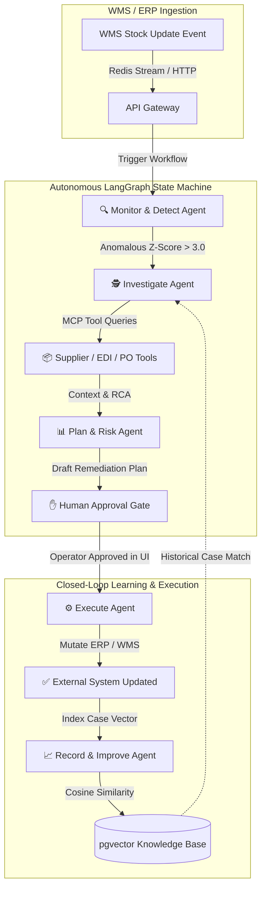

# Sentinel OS — Autonomous Mission Control for Supply Chain Resilience

[](LICENSE)
[](docs/Architecture.md)
[](packages/schemas)
[](services/orchestration)
[](docs/Architecture.md)
[](docs/Architecture.md)
[](audit/production_roadmap.md)
[](https://sentinel-dashboard-production-5e63.up.railway.app)

---

## 🌐 Live Cloud Demo (Railway Production)

Experience Sentinel OS live in the cloud without local setup:
- **👉 [Launch Mission Control Dashboard (Live Demo)](https://dashboard-production-8c21.up.railway.app/)**

---

## 🚨 The $4 Trillion Problem

Modern supply chains lose over **$4 trillion annually** to unexpected disruptions: supplier lead-time spikes, receiving discrepancies, warehouse stockouts, and demand shocks. 

Legacy Enterprise Resource Planning (ERP) systems like SAP and Oracle are fundamentally **passive and siloed**. When an anomaly occurs, it takes hours—often days—for manual operators to notice, investigate spreadsheets, email suppliers, calculate financial exposure, and execute remediation orders. By the time human operators act, safety stock is depleted, assembly lines halt, and SLAs are breached.

---

## 🛡️ The Solution: Sentinel OS

**Sentinel OS** is an autonomous, multi-agent mission control operating system designed to detect, investigate, and remediate supply chain anomalies in **under 5 minutes**.

Powered by a stateful **LangGraph multi-agent workflow engine**, structured **Model Context Protocol (MCP)** tool execution, and **pgvector continuous learning**, Sentinel OS replaces passive alerts with **executable, risk-scored multi-step remediation plans**—governed by a strict, non-bypassable **human-in-the-loop approval gate**.



---

## 🏆 Why Sentinel OS Wins (Comparative Value)

| Feature | Legacy ERPs (SAP / Oracle) | Generic Hackathon AI Wrappers | 🛡️ Sentinel OS |
| :--- | :--- | :--- | :--- |
| **Detection Latency** | Hours / Days (Manual Polling) | N/A (Reactive Chat Only) | **Sub-5 Minutes (Autonomous Loop)** |
| **Actionability** | Passive Email / Text Alerts | Unverified Text Suggestions | **Executable Multi-Step JSON Plans** |
| **Safety & Governance** | Zero AI Governance | High Hallucination Risk | **Non-Bypassable Human UI Gate** |
| **Tooling Architecture** | Proprietary / Siloed APIs | Ad-hoc hardcoded scripts | **Model Context Protocol (MCP)** |
| **Cost & Privacy** | Extremely Expensive SaaS | Requires Paid Cloud APIs ($$$) | **Zero-Cost Local-First (Ollama)** |

---

## ⚡ Technical Differentiators

1. **Stateful LangGraph Orchestration:** Unlike simple LLM wrappers, Sentinel OS models anomaly resolution as a compiled state machine ([graph/](services/orchestration/graph)). State transitions are strictly validated and checkpointed across 5 specialized agents.
2. **Model Context Protocol (MCP) Tooling:** All database queries, EDI checks, and purchase order mutations are exposed through schema-validated, stateless MCP-compatible adapters ([tools/](services/orchestration/tools)), ensuring clean boundary separation and zero hallucinated tool arguments.
3. **Closed-Loop pgvector Learning:** Every resolved anomaly is embedded into PostgreSQL using `pgvector`. When a new stockout or discrepancy occurs, the Investigate agent queries historical case history via cosine similarity to surface proven remediation strategies ([ADR-005](Doc/15_ARCHITECTURE_DECISIONS.md)).
4. **Zero-Cost Local-First Strategy:** Built per [DEV-001](DEVIATIONS.md) and [ADR-013](Doc/15_ARCHITECTURE_DECISIONS.md), Sentinel OS executes fully offline using local Ollama (`llama3` / `mistral`) without requiring expensive cloud API keys.
5. **Single-Source TypeScript / Python Schemas:** Domain models defined in [packages/schemas](packages/schemas) are automatically compiled into JSON Schema for Python validation, ensuring 100% type safety across frontend, gateway, and AI microservices.

---

## 🚀 60-Second Quickstart (Docker)

Sentinel OS includes a turnkey Docker Compose environment with automated healthchecks and database seeding.

```bash
# 1. Clone the repository and navigate to root
git clone https://github.com/orvex-enterprise/sentinel-os.git
cd sentinel-os

# 2. Copy sample environment configurations
cp example.env .env

# 3. Spin up the entire autonomous stack (Postgres + pgvector, Redis, Gateway, Orchestration, Dashboard, Simulator)
docker compose -f infra/docker-compose.yml up --build -d

# 4. Check container health status
docker compose -f infra/docker-compose.yml ps
```

Once running, open the Mission Control Dashboard at **[http://localhost:3000](http://localhost:3000)**.

---

## 📚 Documentation & Navigation

| Document | Purpose | Audience |
| :--- | :--- | :--- |
| **[docs/Architecture.md](docs/Architecture.md)** | Comprehensive system architecture, data flows, and LangGraph state diagrams. | Technical Judges, Architects |
| **[docs/Demo.md](docs/Demo.md)** | Step-by-step hackathon evaluation walkthrough and anomaly scenarios. | Hackathon Judges, Evaluators |
| **[docs/Setup.md](docs/Setup.md)** | Detailed local development setup, environment variables, and troubleshooting. | Developers, Contributors |
| **[docs/Roadmap.md](docs/Roadmap.md)** | Future development horizons, enterprise integrations, and roadmap. | Product Managers, Investors |
| **[Doc/README.md](Doc/README.md)** | Central index of all 19 engineering specifications and ADR logs. | Systems Engineers |

---

## 🤝 Contributing & Governance

Sentinel OS is built with strict engineering standards. For details on architectural decisions and project governance, review:
- **[Decisions Log (DECISIONS_LOG.md)](DECISIONS_LOG.md)**: Authoritative resolutions for requirements and demo workflows.
- **[Deviations Log (DEVIATIONS.md)](DEVIATIONS.md)**: Architectural adaptations for local-first zero-cost execution.
- **[Runbook (RUNBOOK.md)](RUNBOOK.md)**: Operational procedures and monitoring protocols.

---
*Built with ❤️ for Global Supply Chain Resilience.*
