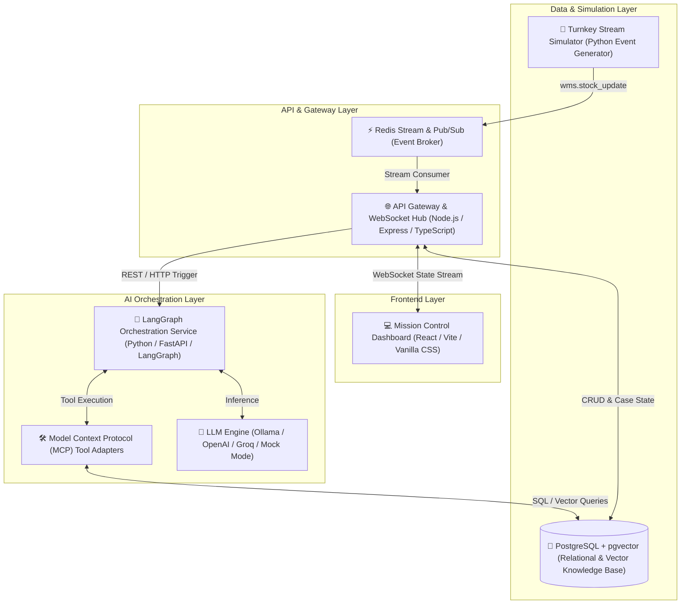
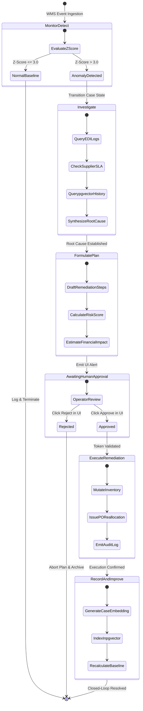
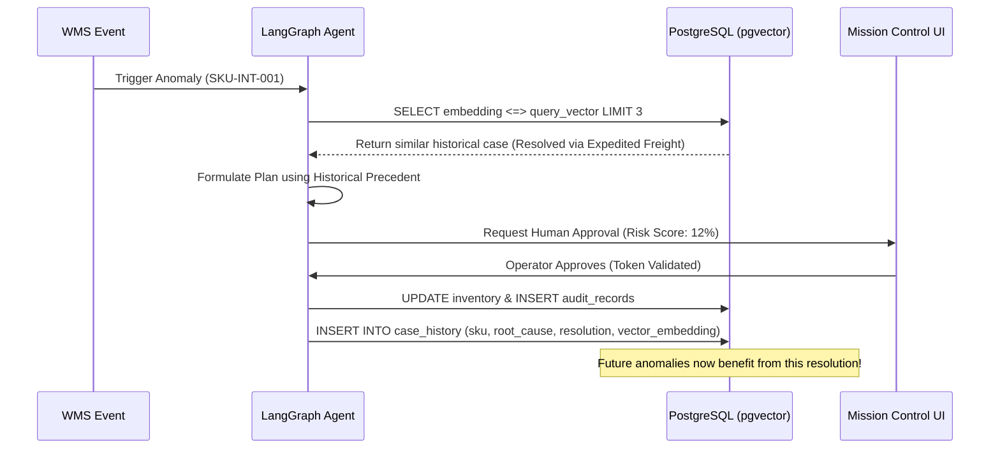

# Sentinel OS — System Architecture & Technical Specifications

> **Document Class:** Technical Architecture Specification  
> **Status:** Authoritative  
> **Target Audience:** Hackathon Judges, Systems Architects, Core Developers

---

## 1. High-Level Architecture Overview

Sentinel OS is engineered as an event-driven, multi-agent microservices ecosystem. It bridges real-time warehouse telemetry with generative AI reasoning while strictly isolating LLM non-determinism from production database mutations.

---

## 2. The LangGraph Multi-Agent State Machine

Unlike conventional chatbot interfaces or simple linear chains, Sentinel OS models anomaly resolution as a deterministic **LangGraph State Graph** ([services/orchestration/graph](../services/orchestration/graph)).

---

## 3. Model Context Protocol (MCP) Tooling Architecture

To prevent LLM hallucination and maintain strict architectural boundaries, all tool execution occurs through schema-validated adapters inspired by the **Model Context Protocol (MCP)** ([services/orchestration/tools](../services/orchestration/tools)).

### Core Tool Adapters:
1. `inventory_query()`: Queries real-time stock levels, safety stock thresholds, and reorder points across warehouses.
2. `supplier_lookup()`: Retrieves supplier SLA terms, historical lead times, and active purchase orders.
3. `purchase_order_query()`: Evaluates pending shipment EDI logs and transit milestones.
4. `business_system_write()`: The *only* mutating tool in the system. Required to pass an explicit human approval token (`approvalToken`) before modifying database records.
5. `case_history_vector_search()`: Performs cosine similarity search against `pgvector` embeddings to retrieve top-3 historical anomaly resolutions.

---

## 4. Closed-Loop Learning with PostgreSQL & pgvector

Sentinel OS implements a self-improving memory architecture per [ADR-005](../Doc/15_ARCHITECTURE_DECISIONS.md) and [DEV-003](../DEVIATIONS.md).

---

## 5. Single-Source Type Safety Strategy

To eliminate schema drift between our TypeScript frontend/gateway and Python AI backend, Sentinel OS utilizes a monorepo schema pipeline:

1. Authoritative domain interfaces and validation rules are defined in **[packages/schemas/src/index.ts](../packages/schemas/src/index.ts)**.
2. The build script **[export-json-schema.ts](../packages/schemas/src/export-json-schema.ts)** compiles TypeScript types into JSON Schema artifacts.
3. Python microservices import these generated schemas to enforce strict Pydantic/FastAPI request validation.

---

## 6. Security & Governance (DEV-002)

- **Non-Bypassable Approval Gates:** External database mutation via `business_system_write()` is cryptographically blocked unless accompanied by a valid operator token generated by UI confirmation.
- **Idempotency Enforcement:** All state transitions and approval requests require unique `Idempotency-Key` headers (§12.4) to prevent double-execution during network retries.
- **Zero-Cost / Local-First Privacy:** By supporting local Ollama execution ([DEV-001](../DEVIATIONS.md)), sensitive enterprise inventory data never leaves the local VPC or hardware boundary.
