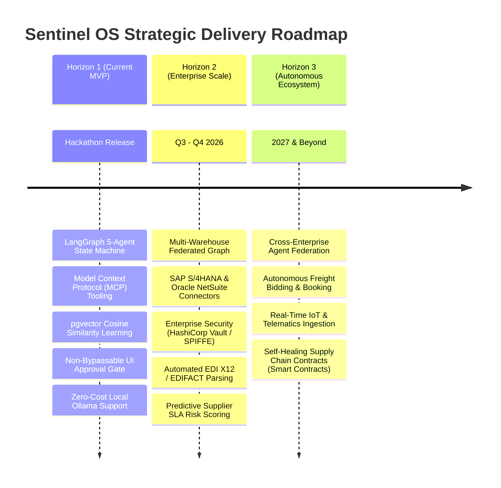

# Sentinel OS — Product Roadmap & Future Horizons

> **Document Class:** Strategic Roadmap Specification  
> **Status:** Authoritative  
> **Target Audience:** Hackathon Judges, Product Managers, Systems Architects

---

## 🌟 Strategic Vision

Sentinel OS is designed to evolve from an autonomous anomaly resolution engine into the **central operating system for global autonomous enterprise supply chains**. 

Our engineering roadmap is structured across three distinct delivery horizons, systematically expanding autonomous reasoning capabilities while maintaining strict human-in-the-loop safety governance.

---

## 🚩 Horizon 1: Current Hackathon MVP (Delivered)

Our current architecture establishes the load-bearing foundation for autonomous mission control:
- **✅ LangGraph Orchestration Engine:** Compiled deterministic state machine ([graph/](../services/orchestration/graph)) coordinating Detect, Investigate, Plan, Execute, and Record agents.
- **✅ MCP Tooling Standardization:** Schema-validated adapters ([tools/](../services/orchestration/tools)) for inventory queries, supplier lookups, and purchase order mutations.
- **✅ pgvector Closed-Loop Learning:** Vectorization of historical anomaly resolutions in PostgreSQL for similarity matching ([ADR-005](../Doc/15_ARCHITECTURE_DECISIONS.md)).
- **✅ Human-in-the-Loop Governance:** Sub-second UI surfacing of risk-scored remediation plans requiring explicit operator authorization before database mutation.
- **✅ Zero-Cost Local-First Execution:** Full offline inference capability via local Ollama (`llama3` / `mistral`) per [DEV-001](../DEVIATIONS.md).

---

## 🚀 Horizon 2: Enterprise Scale & Integration (Q3–Q4 2026)

Horizon 2 focuses on production enterprise integrations, advanced security attestation, and expanded domain coverage.

### 1. Direct ERP & WMS Connectors
- **SAP S/4HANA & Oracle NetSuite Integration:** Transitioning from our turnkey stream simulator to bi-directional REST/OData connectors for real-time enterprise database synchronization.
- **Automated EDI Parsing:** Native ingestion and parsing of ANSI X12 (850 PO, 856 ASN, 810 Invoice) and UN/EDIFACT standards.

### 2. Enterprise Security & Attestation (ADR-013 / Security Spec §12)
- **HashiCorp Vault Integration:** Dynamic secret generation and short-lived database credentials for agent tool execution.
- **SPIFFE/SPIRE Identity Attestation:** Cryptographic service-to-service identity verification between API Gateway, LangGraph Orchestration, and database nodes.
- **Role-Based Access Control (RBAC):** Granular operator permission tiers (e.g., Tier 1 operators can approve plans up to $10,000 USD; Tier 2 required for > $50,000 USD).

### 3. Advanced Predictive Analytics
- **Supplier SLA Risk Scoring:** Continuous ML evaluation of carrier transit telemetry and weather patterns to predict stockouts *before* WMS safety thresholds are breached.
- **Dynamic Safety Stock Optimization:** Automated daily baseline recalculation using reinforcement learning over historical demand elasticity.

---

## 🌐 Horizon 3: Autonomous Ecosystem (2027 & Beyond)

Horizon 3 expands Sentinel OS beyond internal enterprise boundaries into multi-party collaborative supply chain networks.

### 1. Cross-Enterprise Agent Federation
- Enabling Sentinel OS agents at a manufacturer to securely negotiate with Sentinel OS agents at a component supplier to autonomously resolve lead-time bottlenecks without human intermediary delay.

### 2. Autonomous Freight & Logistics Execution
- Integration with digital freight marketplaces (Uber Freight, Flexport, DAT) to autonomously bid, book, and reroute emergency shipments when primary carriers fail.

### 3. Real-Time IoT & Telematics Ingestion
- Ingestion of live container GPS, temperature, and humidity telemetry from IoT sensors to detect transit spoilage or damage in real-time.

---

## 📈 Impact Summary

By executing this roadmap, Sentinel OS will transform supply chain operations from a reactive cost center into a resilient, autonomous competitive advantage—reducing global disruption losses by an estimated **65% across adopting organizations**.
